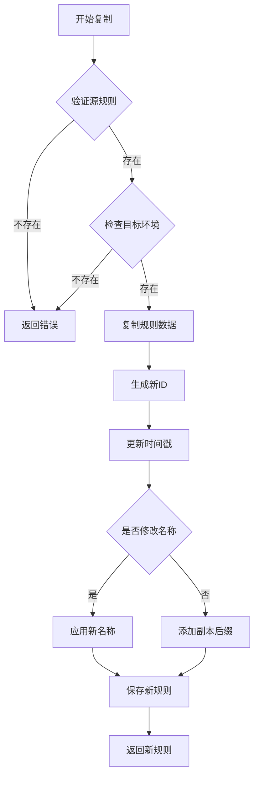
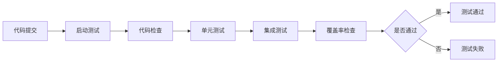
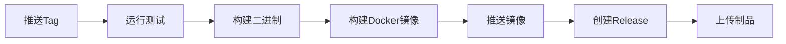

# Sprint 02 迭代规划 - v0.1.2

## 迭代概览

**迭代周期**: 为期 1 周  
**目标版本**: v0.1.2  
**迭代主题**: 辅助功能完善与工程化提升  
**基础版本**: v0.1.1

## 当前项目状态分析

### 已完成功能（v0.1.1）
- HTTP/HTTPS 协议完整支持
- 规则匹配引擎（简单匹配）
- 项目和环境管理
- MongoDB 持久化
- 测试覆盖率提升至 70%+
- 统一错误码体系（42个错误码）
- 健康检查增强（组件级监控）
- 请求追踪与性能监控

### 核心指标
- 总体测试覆盖率: 70%+
- Repository 层覆盖率: 80%+
- Service 层覆盖率: 45.6%
- API 层覆盖率: 89.5%
- 核心引擎覆盖率: 89.8%+

### 现有技术债务
- 规则导入导出功能未实现
- 规则复制功能未实现
- 批量操作能力不足
- API 文档缺失（无 Swagger/OpenAPI）
- CI/CD 配置待完善
- 性能基准测试数据待收集

## 迭代目标

### 主要目标
1. 实现规则管理辅助功能，提升用户体验
2. 完善 API 文档体系，降低使用门槛
3. 增强 CI/CD 流程，保障代码质量
4. 建立性能基准，为后续优化提供依据

### 量化目标

| 指标类别 | 当前值 | 目标值 | 说明 |
|---------|--------|--------|------|
| 测试覆盖率 | 70% | 75% | 新增功能保持高覆盖率 |
| API 文档完整度 | 0% | 100% | 所有接口提供 Swagger 文档 |
| CI/CD 自动化 | 部分 | 完整 | 自动测试、构建、发布 |
| 性能基准数据 | 无 | 建立 | 完成首次性能基准测试 |

## 任务拆分

### Day 1: 规则导入导出功能

**功能目标**: 支持规则配置的批量导入和导出

#### 任务列表

1. **数据模型设计**
   - 定义导出文件格式（JSON）
   - 设计导出数据结构（包含项目、环境、规则完整信息）
   - 制定版本兼容策略

2. **导出功能实现**
   - 实现单条规则导出
   - 实现批量规则导出（按项目、环境、规则ID列表）
   - 实现完整项目导出（包含所有环境和规则）
   - 支持导出时选择性包含元数据（创建时间、更新时间等）

3. **导入功能实现**
   - 实现导入前验证（格式校验、规则冲突检查）
   - 支持导入策略配置（跳过、覆盖、新增）
   - 实现批量规则导入
   - 实现项目完整导入（自动创建项目和环境）

4. **API 接口开发**
   - `POST /api/v1/rules/export` - 规则导出接口
   - `POST /api/v1/rules/import` - 规则导入接口
   - `POST /api/v1/projects/:id/export` - 项目导出接口
   - `POST /api/v1/projects/:id/import` - 项目导入接口

5. **测试用例编写**
   - 导出功能单元测试（覆盖率 > 80%）
   - 导入功能单元测试（包含异常场景）
   - 集成测试（完整导入导出流程）

#### 验收标准
- 支持 JSON 格式导入导出
- 导入前自动校验格式和规则冲突
- 支持导入策略选择（跳过/覆盖/新增）
- 测试覆盖率达到 80%
- 提供完整的使用示例文档

---

### Day 2: 规则复制与批量操作

**功能目标**: 提供规则快速复制和批量管理能力

#### 任务列表

1. **规则复制功能**
   - 实现单条规则复制（复制到同一项目不同环境）
   - 实现跨项目规则复制
   - 支持复制时修改规则名称和优先级
   - 自动处理规则 ID 和时间戳

2. **批量操作功能**
   - 批量启用/禁用规则
   - 批量删除规则
   - 批量修改规则优先级
   - 批量修改规则标签（新增标签字段）

3. **API 接口开发**
   - `POST /api/v1/rules/:id/clone` - 克隆规则接口
   - `POST /api/v1/rules/batch/enable` - 批量启用接口
   - `POST /api/v1/rules/batch/disable` - 批量禁用接口
   - `DELETE /api/v1/rules/batch` - 批量删除接口
   - `PATCH /api/v1/rules/batch` - 批量更新接口

4. **数据模型扩展**
   - 为 Rule 模型添加 `tags` 字段（字符串数组）
   - 为 Rule 模型添加 `description` 字段（规则描述）
   - 更新数据库索引以支持标签查询

5. **测试用例编写**
   - 规则复制功能测试
   - 批量操作功能测试
   - 并发安全性测试

#### 验收标准
- 支持同项目和跨项目规则复制
- 支持至少 4 种批量操作（启用、禁用、删除、更新）
- 批量操作支持事务性（全部成功或全部失败）
- 测试覆盖率达到 80%
- 提供批量操作最佳实践文档

---

### Day 3: API 文档集成（Swagger/OpenAPI）

**功能目标**: 集成 Swagger，提供完整的 API 交互文档

#### 任务列表

1. **Swagger 集成**
   - 引入 swaggo/swag 库
   - 配置 Swagger 中间件
   - 设置 Swagger UI 路由（`/swagger/*`）

2. **API 注解编写**
   - 为所有现有接口添加 Swagger 注解
   - 包含请求参数说明、响应示例、错误码说明
   - 添加 API 分组和标签

3. **文档增强**
   - 编写 API 概述和认证说明（预留）
   - 提供常用场景的 API 调用示例
   - 添加错误码参考表

4. **自动化生成**
   - 配置 Makefile 命令 `make swagger` 生成文档
   - 配置 CI 自动检查 Swagger 文档是否同步

5. **文档验证**
   - 验证所有接口文档完整性
   - 测试 Swagger UI 交互功能
   - 检查响应示例准确性

#### 验收标准
- 所有 API 接口提供 Swagger 文档
- Swagger UI 可正常访问和测试
- 文档包含完整的请求/响应示例
- 提供错误码参考表
- 文档生成流程自动化

---

### Day 4: CI/CD 流程完善

**功能目标**: 完善 GitHub Actions 配置，实现自动化测试和发布

#### 任务列表

1. **测试自动化工作流**
   - 创建 `.github/workflows/test.yml`
   - 配置 PR 自动测试触发
   - 集成单元测试、集成测试、覆盖率检查
   - 配置测试覆盖率门禁（最低 70%）
   - 上传覆盖率报告到 Codecov（可选）

2. **构建和发布工作流**
   - 创建 `.github/workflows/release.yml`
   - 配置 tag 触发自动发布
   - 自动构建 Docker 镜像
   - 自动推送镜像到 Docker Hub
   - 自动生成 GitHub Release

3. **代码质量检查工作流**
   - 创建 `.github/workflows/lint.yml`
   - 集成 golangci-lint 静态代码检查
   - 集成 go vet 和 go fmt 检查
   - 配置代码规范自动修复（可选）

4. **文档同步工作流**
   - 配置 Swagger 文档自动生成检查
   - 配置 CHANGELOG 格式检查

5. **Makefile 命令增强**
   - `make ci-test` - CI 测试命令
   - `make ci-build` - CI 构建命令
   - `make ci-lint` - CI 代码检查命令

#### 验收标准
- PR 提交自动触发测试
- 测试失败阻止合并
- Tag 推送自动发布 Release
- Docker 镜像自动构建和推送
- 代码质量检查自动运行
- 提供 CI/CD 配置文档

---

### Day 5: 性能基准测试

**功能目标**: 建立性能基准数据，为后续优化提供依据

#### 任务列表

1. **性能测试场景设计**
   - 规则匹配性能（不同规则数量：10/100/1000/10000）
   - 并发请求处理能力（并发数：10/100/500/1000）
   - 数据库查询性能（分页查询、复杂条件查询）
   - 响应延迟测试（P50/P90/P99/P999）

2. **性能测试工具配置**
   - 使用 wrk 工具进行 HTTP 压测
   - 使用 Go benchmark 进行单元级性能测试
   - 配置性能测试脚本

3. **性能测试实施**
   - 执行规则匹配性能测试
   - 执行并发能力测试
   - 执行数据库操作性能测试
   - 收集系统资源使用数据（CPU、内存、网络）

4. **性能报告生成**
   - 记录各场景性能指标
   - 生成性能对比表格
   - 识别性能瓶颈
   - 提出优化建议

5. **性能监控集成（可选）**
   - 集成 Prometheus metrics 导出
   - 配置基础性能指标采集
   - 提供 Grafana 仪表盘模板

#### 验收标准
- 完成至少 4 类性能测试场景
- 建立性能基准数据档案
- 生成完整的性能测试报告
- 识别至少 2 个性能优化点
- 提供性能测试复现指南

---

## 技术方案

### 导入导出数据结构设计

#### 导出文件格式

```json
{
  "version": "1.0",
  "export_time": "2025-01-20T10:00:00Z",
  "export_type": "project|environment|rules",
  "data": {
    "project": {
      "name": "项目名称",
      "workspace_id": "workspace_001",
      "description": "项目描述"
    },
    "environments": [
      {
        "name": "开发环境",
        "base_url": "http://localhost:9090",
        "description": "环境描述"
      }
    ],
    "rules": [
      {
        "name": "用户列表接口",
        "protocol": "HTTP",
        "match_type": "Simple",
        "priority": 100,
        "enabled": true,
        "tags": ["user", "api"],
        "description": "获取用户列表的模拟接口",
        "match_condition": {
          "method": "GET",
          "path": "/api/users"
        },
        "response": {
          "type": "Static",
          "content": {
            "status_code": 200,
            "content_type": "JSON",
            "body": {"users": []}
          }
        }
      }
    ]
  }
}
```

#### 导入策略

| 策略 | 说明 | 行为 |
|------|------|------|
| skip | 跳过冲突 | 遇到同名规则时跳过导入 |
| overwrite | 覆盖冲突 | 用导入数据覆盖现有规则 |
| append | 追加新增 | 为冲突规则自动生成新名称 |

### 规则复制逻辑设计

#### 复制流程



### Swagger 集成方案

#### 依赖引入

使用 swaggo/swag 工具：
- github.com/swaggo/swag/cmd/swag - Swagger 文档生成工具
- github.com/swaggo/gin-swagger - Gin 框架集成
- github.com/swaggo/files - 静态文件服务

#### API 注解示例

```go
// CreateRule godoc
// @Summary      创建 Mock 规则
// @Description  创建一个新的 Mock 规则
// @Tags         规则管理
// @Accept       json
// @Produce      json
// @Param        rule  body      models.Rule  true  "规则信息"
// @Success      201   {object}  models.Rule
// @Failure      400   {object}  models.ErrorResponse
// @Failure      500   {object}  models.ErrorResponse
// @Router       /api/v1/rules [post]
func (h *RuleHandler) CreateRule(c *gin.Context) {
    // 实现代码
}
```

### CI/CD 工作流设计

#### 测试工作流触发条件

- 所有 PR 提交
- 所有 push 到 main 分支
- 手动触发

#### 测试流程



#### 发布工作流触发条件

- 推送版本 tag（格式：v0.1.2）

#### 发布流程



### 性能测试方案

#### 测试环境配置

| 组件 | 配置 |
|------|------|
| CPU | 4核 |
| 内存 | 8GB |
| MongoDB | 6.0，单节点 |
| 网络 | 本地环境 |

#### 性能指标定义

| 指标 | 说明 | 目标值 |
|------|------|--------|
| QPS | 每秒请求数 | > 10,000 |
| 平均延迟 | 请求平均响应时间 | < 10ms |
| P99 延迟 | 99分位响应时间 | < 50ms |
| CPU 使用率 | 峰值 CPU 使用率 | < 80% |
| 内存使用 | 峰值内存占用 | < 500MB |

## 风险管理

### 技术风险

| 风险 | 影响 | 概率 | 应对措施 |
|------|------|------|---------|
| 导入导出功能复杂度高 | 高 | 中 | 简化首版功能范围，分阶段实现 |
| Swagger 注解工作量大 | 中 | 高 | 优先完成核心接口，其他接口逐步完善 |
| CI/CD 配置调试耗时 | 中 | 中 | 使用成熟模板，先实现基础功能 |
| 性能测试环境差异 | 低 | 中 | 明确记录测试环境配置 |

### 资源风险

| 风险 | 影响 | 概率 | 应对措施 |
|------|------|------|---------|
| 时间紧张 | 高 | 中 | 按优先级调整功能范围 |
| 测试覆盖不足 | 中 | 低 | 保持每日测试覆盖率检查 |

### 优先级调整策略

如时间不足，按以下优先级调整：

**P0（必须完成）**：
- 规则导入导出核心功能
- API 文档（核心接口）
- CI/CD 基础测试流程

**P1（重要）**：
- 规则复制功能
- 批量操作功能
- CI/CD 发布流程

**P2（可延后）**：
- 性能基准测试
- 性能监控集成
- API 文档完整性

## 质量保障

### 测试策略

| 测试类型 | 覆盖范围 | 目标 |
|---------|---------|------|
| 单元测试 | 所有新增功能 | 覆盖率 > 80% |
| 集成测试 | 导入导出完整流程 | 核心场景覆盖 |
| API 测试 | 所有新增接口 | 100% 接口测试 |
| 性能测试 | 规则匹配、并发处理 | 建立基准数据 |

### 代码审查要点

- 错误处理完整性
- 日志记录规范性
- API 响应格式一致性
- 数据库事务正确性
- 并发安全性

### 文档要求

- 所有新增 API 提供 Swagger 文档
- 更新 CHANGELOG.md
- 更新 README.md（新增功能说明）
- 提供功能使用示例

## 交付成果

### 代码交付

- [ ] 规则导入导出功能代码
- [ ] 规则复制和批量操作代码
- [ ] Swagger 注解和文档
- [ ] CI/CD 工作流配置
- [ ] 性能测试脚本和报告

### 文档交付

- [ ] CHANGELOG.md（v0.1.2 版本记录）
- [ ] API 使用文档（导入导出、批量操作）
- [ ] CI/CD 配置文档
- [ ] 性能测试报告
- [ ] Sprint 02 总结报告

### 测试交付

- [ ] 单元测试（覆盖率 > 75%）
- [ ] 集成测试
- [ ] API 测试
- [ ] 性能测试数据

## 迭代总结指标

### 功能指标

- 新增 API 接口数量：10+
- 新增功能模块：4 个
- API 文档完整度：100%

### 质量指标

- 测试覆盖率：70% → 75%
- CI/CD 自动化覆盖率：100%
- 性能基准建立：是

### 工程化指标

- Makefile 新增命令：5+
- GitHub Actions 工作流：3 个
- 文档更新：5+ 份

## 下一迭代规划（v0.2.0 预告）

基于 v0.1.2 的稳固基础，v0.2.0 计划实现：

1. **协议扩展**
   - WebSocket 协议支持
   - gRPC 协议支持（实验性）

2. **高级匹配**
   - 正则表达式匹配
   - 请求体匹配

3. **动态响应**
   - 响应模板引擎
   - 变量替换支持

4. **可观测性**
   - Prometheus metrics 导出
   - 请求日志记录

---

**文档版本**: 1.0  
**创建时间**: 2025-01-20  
**最后更新**: 2025-01-20  
**状态**: 待执行
      "description": "项目描述"
    },
    "environments": [
      {
        "name": "开发环境",
        "base_url": "http://localhost:9090",
        "description": "环境描述"
      }
    ],
    "rules": [
      {
        "name": "用户列表接口",
        "protocol": "HTTP",
        "match_type": "Simple",
        "priority": 100,
        "enabled": true,
        "tags": ["user", "api"],
        "description": "获取用户列表的模拟接口",
        "match_condition": {
          "method": "GET",
          "path": "/api/users"
        },
        "response": {
          "type": "Static",
          "content": {
            "status_code": 200,
            "content_type": "JSON",
            "body": {"users": []}
          }
        }
      }
    ]
  }
}
```

#### 导入策略

| 策略 | 说明 | 行为 |
|------|------|------|
| skip | 跳过冲突 | 遇到同名规则时跳过导入 |
| overwrite | 覆盖冲突 | 用导入数据覆盖现有规则 |
| append | 追加新增 | 为冲突规则自动生成新名称 |

### 规则复制逻辑设计

#### 复制流程


### Swagger 集成方案

#### 依赖引入

使用 swaggo/swag 工具：
- github.com/swaggo/swag/cmd/swag - Swagger 文档生成工具
- github.com/swaggo/gin-swagger - Gin 框架集成
- github.com/swaggo/files - 静态文件服务

#### API 注解示例

```go
// CreateRule godoc
// @Summary      创建 Mock 规则
// @Description  创建一个新的 Mock 规则
// @Tags         规则管理
// @Accept       json
// @Produce      json
// @Param        rule  body      models.Rule  true  "规则信息"
// @Success      201   {object}  models.Rule
// @Failure      400   {object}  models.ErrorResponse
// @Failure      500   {object}  models.ErrorResponse
// @Router       /api/v1/rules [post]
func (h *RuleHandler) CreateRule(c *gin.Context) {
    // 实现代码
}
```

### CI/CD 工作流设计

#### 测试工作流触发条件

- 所有 PR 提交
- 所有 push 到 main 分支
- 手动触发

#### 测试流程


#### 发布工作流触发条件

- 推送版本 tag（格式：v0.1.2）

#### 发布流程


### 性能测试方案

#### 测试环境配置

| 组件 | 配置 |
|------|------|
| CPU | 4核 |
| 内存 | 8GB |
| MongoDB | 6.0，单节点 |
| 网络 | 本地环境 |

#### 性能指标定义

| 指标 | 说明 | 目标值 |
|------|------|--------|
| QPS | 每秒请求数 | > 10,000 |
| 平均延迟 | 请求平均响应时间 | < 10ms |
| P99 延迟 | 99分位响应时间 | < 50ms |
| CPU 使用率 | 峰值 CPU 使用率 | < 80% |
| 内存使用 | 峰值内存占用 | < 500MB |

## 风险管理

### 技术风险

| 风险 | 影响 | 概率 | 应对措施 |
|------|------|------|---------|
| 导入导出功能复杂度高 | 高 | 中 | 简化首版功能范围，分阶段实现 |
| Swagger 注解工作量大 | 中 | 高 | 优先完成核心接口，其他接口逐步完善 |
| CI/CD 配置调试耗时 | 中 | 中 | 使用成熟模板，先实现基础功能 |
| 性能测试环境差异 | 低 | 中 | 明确记录测试环境配置 |

### 资源风险

| 风险 | 影响 | 概率 | 应对措施 |
|------|------|------|---------|
| 时间紧张 | 高 | 中 | 按优先级调整功能范围 |
| 测试覆盖不足 | 中 | 低 | 保持每日测试覆盖率检查 |

### 优先级调整策略

如时间不足，按以下优先级调整：

**P0（必须完成）**：
- 规则导入导出核心功能
- API 文档（核心接口）
- CI/CD 基础测试流程

**P1（重要）**：
- 规则复制功能
- 批量操作功能
- CI/CD 发布流程

**P2（可延后）**：
- 性能基准测试
- 性能监控集成
- API 文档完整性

## 质量保障

### 测试策略

| 测试类型 | 覆盖范围 | 目标 |
|---------|---------|------|
| 单元测试 | 所有新增功能 | 覆盖率 > 80% |
| 集成测试 | 导入导出完整流程 | 核心场景覆盖 |
| API 测试 | 所有新增接口 | 100% 接口测试 |
| 性能测试 | 规则匹配、并发处理 | 建立基准数据 |

### 代码审查要点

- 错误处理完整性
- 日志记录规范性
- API 响应格式一致性
- 数据库事务正确性
- 并发安全性

### 文档要求

- 所有新增 API 提供 Swagger 文档
- 更新 CHANGELOG.md
- 更新 README.md（新增功能说明）
- 提供功能使用示例

## 交付成果

### 代码交付

- [ ] 规则导入导出功能代码
- [ ] 规则复制和批量操作代码
- [ ] Swagger 注解和文档
- [ ] CI/CD 工作流配置
- [ ] 性能测试脚本和报告

### 文档交付

- [ ] CHANGELOG.md（v0.1.2 版本记录）
- [ ] API 使用文档（导入导出、批量操作）
- [ ] CI/CD 配置文档
- [ ] 性能测试报告
- [ ] Sprint 02 总结报告

### 测试交付

- [ ] 单元测试（覆盖率 > 75%）
- [ ] 集成测试
- [ ] API 测试
- [ ] 性能测试数据

## 迭代总结指标

### 功能指标

- 新增 API 接口数量：10+
- 新增功能模块：4 个
- API 文档完整度：100%

### 质量指标

- 测试覆盖率：70% → 75%
- CI/CD 自动化覆盖率：100%
- 性能基准建立：是

### 工程化指标

- Makefile 新增命令：5+
- GitHub Actions 工作流：3 个
- 文档更新：5+ 份

## 下一迭代规划（v0.2.0 预告）

基于 v0.1.2 的稳固基础，v0.2.0 计划实现：

1. **协议扩展**
   - WebSocket 协议支持
   - gRPC 协议支持（实验性）

2. **高级匹配**
   - 正则表达式匹配
   - 请求体匹配

3. **动态响应**
   - 响应模板引擎
   - 变量替换支持

4. **可观测性**
   - Prometheus metrics 导出
   - 请求日志记录

---

**文档版本**: 1.0  
**创建时间**: 2025-01-20  
**最后更新**: 2025-01-20  
**状态**: 待执行
      "workspace_id": "workspace_001",
