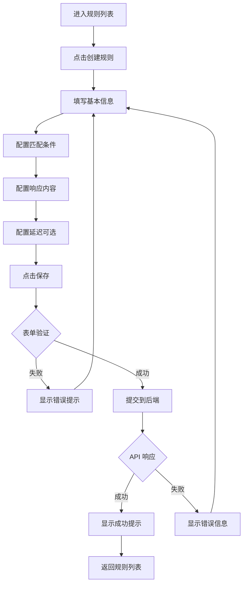
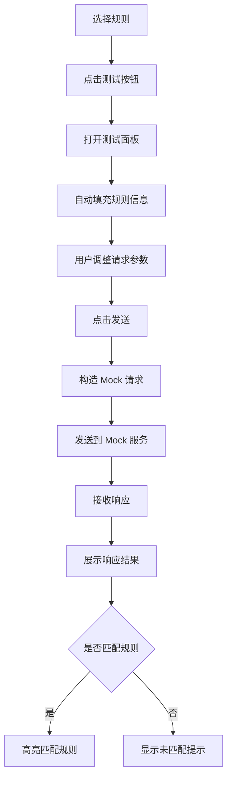

# Sprint 03 迭代规划 - Web 管理界面开发（v0.2.0）

## 迭代概览

**迭代周期**: 4 周（约 1 个月）  
**目标版本**: v0.2.0  
**迭代主题**: Web 管理界面开发与用户体验提升  
**基础版本**: v0.1.2  
**团队规模**: 1-2 人

## 当前项目状态分析

### 已完成功能（v0.1.2）

#### 后端能力
- HTTP/HTTPS 协议完整支持
- 规则匹配引擎（简单匹配）
- 项目和环境管理完整 API
- 规则 CRUD 完整 API
- 规则导入导出功能
- 规则复制与批量操作
- MongoDB 持久化
- Swagger API 文档
- 统一错误码体系（42个错误码）
- 健康检查与性能监控
- CI/CD 自动化流程

#### 测试与质量
- 总体测试覆盖率: 75%+
- Repository 层覆盖率: 80%+
- Service 层覆盖率: 70%+
- API 层覆盖率: 89%+

#### 现存痛点
- 无可视化管理界面，需通过 API 或命令行操作
- 学习成本高，使用门槛大
- 规则配置复杂，容易出错
- 缺少实时 Mock 测试能力
- 无法直观查看规则匹配状态

## 迭代目标

### 核心目标

1. 开发完整的 Web 管理界面，实现项目、环境、规则的可视化管理
2. 提供友好的规则配置体验，降低使用门槛
3. 集成实时 Mock 测试功能，支持在线调试
4. 提供数据可视化展示，增强可观测性
5. 实现前后端集成部署，简化运维

### 量化目标

| 指标类别 | 当前值 | 目标值 | 说明 |
|---------|--------|--------|------|
| UI 功能完整度 | 0% | 90% | 覆盖核心管理功能 |
| 前端测试覆盖率 | 0% | 60% | 关键组件和业务逻辑 |
| 页面加载性能 | - | < 2s | 首屏加载时间 |
| 移动端适配 | 0% | 80% | 响应式设计覆盖率 |
| 用户操作便捷度 | - | 高 | 3 步内完成核心操作 |

### 用户价值

- 降低使用门槛，非技术人员也能快速上手
- 提升配置效率，可视化操作减少 70% 时间
- 实时反馈，即时验证规则有效性
- 直观展示，快速定位问题

## 技术选型

### 前端技术栈

| 技术 | 版本 | 用途 |
|------|------|------|
| React | 18.x | UI 框架 |
| TypeScript | 5.x | 类型安全 |
| Ant Design | 5.x | UI 组件库 |
| Vite | 5.x | 构建工具 |
| React Router | 6.x | 路由管理 |
| Axios | 1.x | HTTP 客户端 |
| Zustand | 4.x | 状态管理 |
| React Query | 5.x | 数据请求与缓存 |
| Monaco Editor | 0.45.x | 代码编辑器 |
| ECharts | 5.x | 数据可视化 |

### 项目结构

```
web/
├── frontend/                    # 前端项目根目录
│   ├── public/                  # 静态资源
│   │   ├── favicon.ico
│   │   └── logo.png
│   ├── src/
│   │   ├── api/                 # API 接口层
│   │   │   ├── client.ts        # Axios 实例配置
│   │   │   ├── project.ts       # 项目相关 API
│   │   │   ├── environment.ts   # 环境相关 API
│   │   │   ├── rule.ts          # 规则相关 API
│   │   │   └── system.ts        # 系统相关 API
│   │   ├── components/          # 通用组件
│   │   │   ├── Layout/          # 布局组件
│   │   │   ├── Header/          # 头部组件
│   │   │   ├── Sidebar/         # 侧边栏组件
│   │   │   ├── RuleEditor/      # 规则编辑器
│   │   │   ├── JsonViewer/      # JSON 查看器
│   │   │   └── MockTester/      # Mock 测试组件
│   │   ├── pages/               # 页面组件
│   │   │   ├── Dashboard/       # 仪表盘
│   │   │   ├── Projects/        # 项目管理
│   │   │   ├── Environments/    # 环境管理
│   │   │   ├── Rules/           # 规则管理
│   │   │   │   ├── RuleList.tsx
│   │   │   │   ├── RuleCreate.tsx
│   │   │   │   ├── RuleEdit.tsx
│   │   │   │   └── RuleDetail.tsx
│   │   │   └── Settings/        # 系统设置
│   │   ├── hooks/               # 自定义 Hooks
│   │   │   ├── useProjects.ts
│   │   │   ├── useEnvironments.ts
│   │   │   ├── useRules.ts
│   │   │   └── useMockTest.ts
│   │   ├── store/               # 状态管理
│   │   │   ├── projectStore.ts
│   │   │   ├── environmentStore.ts
│   │   │   └── appStore.ts
│   │   ├── types/               # TypeScript 类型定义
│   │   │   ├── project.ts
│   │   │   ├── environment.ts
│   │   │   ├── rule.ts
│   │   │   └── common.ts
│   │   ├── utils/               # 工具函数
│   │   │   ├── request.ts       # 请求封装
│   │   │   ├── format.ts        # 格式化工具
│   │   │   └── validator.ts     # 验证工具
│   │   ├── styles/              # 样式文件
│   │   │   └── global.css
│   │   ├── App.tsx              # 根组件
│   │   ├── main.tsx             # 入口文件
│   │   └── router.tsx           # 路由配置
│   ├── tests/                   # 测试文件
│   │   ├── unit/                # 单元测试
│   │   └── e2e/                 # E2E 测试
│   ├── package.json
│   ├── tsconfig.json
│   ├── vite.config.ts
│   └── README.md
└── dist/                        # 构建产物（由后端静态托管）
```

### 后端调整

在现有 Go 后端基础上增加静态文件托管能力：

- 使用 Gin 的静态文件中间件托管前端构建产物
- 配置 SPA 路由回退到 index.html
- 保持现有管理 API（端口 8080）不变
- 前端访问路径：`http://localhost:8080/`
- API 访问路径：`http://localhost:8080/api/v1/*`

## 任务拆分（4 周计划）

### 第 1 周：基础框架与项目管理

#### Week 1.1（Day 1-2）：项目初始化与基础框架

**任务列表**

1. 前端项目初始化
   - 使用 Vite + React + TypeScript 创建项目
   - 配置 ESLint、Prettier 代码规范
   - 配置路径别名（@/components、@/api 等）
   - 集成 Ant Design 组件库
   - 配置主题定制（品牌色、圆角等）

2. 基础布局开发
   - 开发通用布局组件（Header + Sidebar + Content）
   - 实现侧边栏菜单（项目、环境、规则、设置）
   - 实现顶部导航栏（面包屑、用户信息）
   - 实现响应式布局（支持移动端）

3. 路由配置
   - 配置 React Router 路由
   - 定义页面路由结构
   - 实现路由守卫（预留）
   - 实现 404 页面

4. API 客户端封装
   - 封装 Axios 实例
   - 配置请求拦截器（添加 request_id）
   - 配置响应拦截器（统一错误处理）
   - 定义 API 响应类型

**验收标准**
- 项目可正常启动和构建
- 基础布局完整展示
- 路由切换正常
- API 客户端可正常调用后端接口

#### Week 1.2（Day 3-5）：项目管理功能

**任务列表**

1. 项目列表页面
   - 展示项目卡片列表（支持列表/网格切换）
   - 项目搜索和过滤功能
   - 项目创建按钮
   - 项目基本信息展示（名称、描述、创建时间、规则数量）
   - 项目操作菜单（编辑、删除、导出）

2. 项目创建表单
   - 创建项目弹窗表单
   - 表单字段：名称、工作空间 ID、描述
   - 表单验证（必填项、长度限制）
   - 创建成功提示和页面跳转

3. 项目详情页面
   - 项目基本信息展示
   - 环境列表展示
   - 规则统计展示（总数、启用数、禁用数）
   - 快速操作入口（创建环境、创建规则）

4. 项目编辑与删除
   - 项目编辑表单
   - 项目删除确认（二次确认）
   - 删除前检查（有规则时提示）

5. 数据层集成
   - 定义 Project TypeScript 类型
   - 实现项目 API 调用（CRUD）
   - 使用 React Query 管理数据缓存
   - 实现乐观更新（创建、编辑时）

**验收标准**
- 可完整进行项目 CRUD 操作
- 表单验证完善，用户体验友好
- 数据展示准确，加载状态清晰
- 支持搜索和过滤
- 响应式设计，移动端可用

---

### 第 2 周：环境与规则管理

#### Week 2.1（Day 6-8）：环境管理功能

**任务列表**

1. 环境列表展示
   - 在项目详情页展示环境列表
   - 环境卡片展示（名称、Base URL、规则数量）
   - 环境状态标识
   - 环境操作菜单

2. 环境 CRUD 功能
   - 环境创建表单（名称、Base URL、描述）
   - 环境编辑功能
   - 环境删除功能（二次确认）
   - 环境切换功能（影响规则列表显示）

3. 环境选择器组件
   - 全局环境选择器（影响规则列表过滤）
   - 环境快速切换
   - 当前选中环境高亮显示

4. 数据层集成
   - 定义 Environment TypeScript 类型
   - 实现环境 API 调用
   - 实现环境与项目的关联关系
   - 实现环境切换状态管理

**验收标准**
- 可完整进行环境 CRUD 操作
- 环境与项目关联正确
- 环境切换功能正常
- 数据展示准确

#### Week 2.2（Day 9-12）：规则列表与查询

**任务列表**

1. 规则列表页面
   - 规则表格展示（名称、协议、方法、路径、状态、优先级、操作）
   - 支持分页显示
   - 支持排序（按优先级、创建时间）
   - 规则状态标识（启用/禁用）

2. 规则过滤与搜索
   - 按项目过滤
   - 按环境过滤
   - 按状态过滤（全部/启用/禁用）
   - 按协议过滤
   - 关键字搜索（规则名称、路径）
   - 高级过滤器（方法、优先级范围）

3. 规则批量操作
   - 批量选择（复选框）
   - 批量启用/禁用
   - 批量删除（二次确认）
   - 批量导出

4. 规则快速操作
   - 单条规则启用/禁用开关
   - 规则复制按钮
   - 规则编辑按钮
   - 规则删除按钮
   - 规则详情查看

5. 数据层集成
   - 定义 Rule TypeScript 类型
   - 实现规则列表 API 调用
   - 实现规则批量操作 API 调用
   - 实现列表数据缓存和刷新

**验收标准**
- 规则列表展示完整准确
- 过滤和搜索功能正常
- 批量操作功能正常
- 分页和排序功能正常
- 列表性能良好（支持 1000+ 规则）

---

### 第 3 周：规则编辑与 Mock 测试

#### Week 3.1（Day 13-16）：规则创建与编辑

**任务列表**

1. 规则创建页面
   - 基本信息表单（名称、协议、优先级、启用状态）
   - 匹配条件配置区
     - HTTP 方法选择（单选或多选）
     - 路径输入（支持路径参数提示）
     - Query 参数配置（键值对列表）
     - Header 配置（键值对列表）
     - IP 白名单配置（IP 列表输入）
   - 响应配置区
     - 响应类型选择（静态响应）
     - HTTP 状态码选择
     - Content-Type 选择（JSON/XML/HTML/Text）
     - 响应头配置（键值对列表）
     - 响应体编辑器（Monaco Editor）
       - JSON 格式化和验证
       - 语法高亮
       - 自动补全
   - 延迟配置区
     - 固定延迟
     - 随机延迟（最小值、最大值）
   - 表单验证
   - 保存按钮
   - 取消按钮

2. 规则编辑页面
   - 复用创建页面组件
   - 加载现有规则数据
   - 支持修改所有字段
   - 修改提示
   - 保存更新

3. 规则详情页面
   - 只读展示规则完整信息
   - 格式化展示 JSON 数据
   - 快速操作按钮（编辑、复制、删除、测试）
   - 显示创建时间、更新时间

4. 规则复制功能
   - 复制规则弹窗
   - 选择目标项目
   - 选择目标环境
   - 修改规则名称（自动添加"副本"后缀）
   - 执行复制

5. 表单组件封装
   - 键值对编辑器组件（支持添加、删除、编辑）
   - JSON 编辑器组件（基于 Monaco Editor）
   - 延迟配置组件
   - 路径输入组件（提示路径参数格式）

6. 数据层集成
   - 实现规则创建 API 调用
   - 实现规则更新 API 调用
   - 实现规则复制 API 调用
   - 表单数据与 API 数据映射

**验收标准**
- 规则创建表单功能完整
- 表单验证完善，错误提示友好
- JSON 编辑器体验良好
- 规则编辑功能正常
- 规则复制功能正常
- 数据提交准确无误

#### Week 3.2（Day 17-19）：Mock 测试功能

**任务列表**

1. Mock 测试面板组件
   - 请求配置区
     - HTTP 方法选择
     - 路径输入
     - Query 参数编辑器
     - Header 编辑器
     - Body 编辑器（支持 JSON、表单、文本）
   - 响应展示区
     - HTTP 状态码显示
     - 响应头展示
     - 响应体展示（JSON 格式化）
     - 响应时间显示
   - 发送请求按钮
   - 清空按钮
   - 历史记录（最近 10 次请求）

2. Mock 测试功能实现
   - 构造完整的 Mock 请求 URL
   - 发送 HTTP 请求到 Mock 服务（端口 9090）
   - 解析响应数据
   - 展示请求结果
   - 错误处理和提示

3. 规则匹配反馈
   - 显示匹配到的规则信息
   - 未匹配时显示提示
   - 匹配条件对比展示

4. 快速测试入口
   - 规则详情页集成测试按钮
   - 规则列表集成快速测试
   - 自动填充规则信息到测试面板

5. 测试历史记录
   - 保存最近的测试请求（LocalStorage）
   - 快速加载历史请求
   - 清空历史记录

**验收标准**
- Mock 测试功能正常
- 请求和响应展示清晰
- 支持各种 HTTP 方法和参数类型
- 历史记录功能正常
- 错误提示友好

---

### 第 4 周：数据可视化与集成部署

#### Week 4.1（Day 20-22）：仪表盘与数据可视化

**任务列表**

1. 仪表盘页面开发
   - 总体统计卡片
     - 项目总数
     - 规则总数
     - 启用规则数
     - 今日新增规则数
   - 规则分布图表
     - 按协议分布（饼图）
     - 按项目分布（柱状图）
     - 按状态分布（环形图）
   - 最近活动列表
     - 最近创建的规则
     - 最近更新的规则
     - 最近创建的项目
   - 快速入口
     - 创建项目
     - 创建规则
     - 导入配置

2. 统计数据 API 扩展
   - 在后端新增统计 API 接口
     - `GET /api/v1/statistics/overview` - 总体统计
     - `GET /api/v1/statistics/rules/distribution` - 规则分布
     - `GET /api/v1/statistics/recent-activities` - 最近活动

3. 图表组件集成
   - 集成 ECharts
   - 封装图表组件（饼图、柱状图、环形图）
   - 图表主题定制
   - 图表响应式设计

4. 数据刷新机制
   - 页面加载时自动刷新
   - 定时自动刷新（可选）
   - 手动刷新按钮

**验收标准**
- 仪表盘数据展示准确
- 图表渲染正常，交互流畅
- 统计数据实时更新
- 响应式设计良好

#### Week 4.2（Day 23-25）：导入导出与设置

**任务列表**

1. 规则导入功能
   - 导入按钮（规则列表页）
   - 文件上传组件
   - 导入策略选择（跳过/覆盖/追加）
   - 导入前预览（显示将要导入的规则）
   - 执行导入
   - 导入结果展示（成功数、失败数、错误信息）

2. 规则导出功能
   - 导出按钮（项目详情页、规则列表页）
   - 导出范围选择
     - 导出整个项目
     - 导出当前环境规则
     - 导出选中规则
   - 导出格式确认（JSON）
   - 下载导出文件

3. 系统设置页面
   - API 端点配置展示
   - Mock 服务端点配置展示
   - 系统版本信息
   - 健康状态检查
   - 数据库连接状态

4. 帮助与文档
   - 内嵌帮助文档链接
   - 快速入门指南
   - API 文档链接（Swagger）
   - 常见问题解答

**验收标准**
- 导入导出功能正常
- 导入结果反馈清晰
- 设置页面展示准确
- 帮助文档易于访问

#### Week 4.3（Day 26-28）：前后端集成与部署

**任务列表**

1. 后端静态文件托管
   - 在 Go 后端添加静态文件服务
   - 配置静态文件目录（`web/dist`）
   - 配置 SPA 路由回退
   - 确保 API 路由优先级高于静态文件

2. 前端构建配置
   - 配置生产环境构建
   - 优化构建产物大小
   - 配置 CDN 路径（可选）
   - 生成 Source Map

3. Makefile 命令增强
   - `make build-frontend` - 构建前端
   - `make build-all` - 构建前后端
   - `make dev-frontend` - 启动前端开发服务器
   - `make dev-backend` - 启动后端服务
   - `make dev` - 同时启动前后端开发环境

4. Docker 镜像更新
   - 更新 Dockerfile，包含前端构建步骤
   - 多阶段构建：前端构建 → 后端构建 → 运行时
   - 优化镜像大小
   - 测试 Docker 部署

5. 文档更新
   - 更新 README.md（增加 Web 界面说明）
   - 编写前端开发文档
   - 编写部署文档
   - 更新 CHANGELOG.md

**验收标准**
- 前后端集成部署成功
- 访问 `http://localhost:8080/` 可正常使用 Web 界面
- API 调用正常
- Docker 镜像构建和运行正常
- 文档完整准确

#### Week 4.4（Day 29-30）：测试与优化

**任务列表**

1. 前端单元测试
   - 关键组件测试（使用 Vitest + React Testing Library）
   - API 客户端测试
   - 工具函数测试
   - 自定义 Hooks 测试
   - 目标覆盖率 > 60%

2. E2E 测试
   - 使用 Playwright 编写 E2E 测试
   - 核心流程测试
     - 项目创建流程
     - 规则创建流程
     - Mock 测试流程
   - 测试自动化运行

3. 性能优化
   - 代码分割（路由懒加载）
   - 组件懒加载
   - 图片优化
   - 打包体积优化
   - 首屏加载优化（< 2s）

4. 用户体验优化
   - 加载状态优化（骨架屏）
   - 错误提示优化
   - 空状态提示
   - 操作反馈优化（Loading、Toast）
   - 键盘快捷键支持

5. 兼容性测试
   - 浏览器兼容性测试（Chrome、Firefox、Safari、Edge）
   - 移动端适配测试
   - 不同分辨率测试

6. 安全性检查
   - XSS 防护检查
   - CSRF 防护检查（预留）
   - 依赖漏洞扫描

**验收标准**
- 前端测试覆盖率 > 60%
- E2E 测试通过
- 首屏加载时间 < 2s
- 主流浏览器兼容
- 移动端可正常使用
- 无明显性能和安全问题

---

## 技术方案详解

### 前端架构设计

#### 目录结构设计原则

- 按功能模块划分目录（pages、components）
- 按技术层次划分（api、store、hooks、utils）
- 通用组件与业务组件分离
- 类型定义集中管理

#### 状态管理策略

使用 Zustand 管理全局状态：
- 项目选择状态
- 环境选择状态
- 用户偏好设置
- 应用全局配置

使用 React Query 管理服务端状态：
- 数据请求与缓存
- 乐观更新
- 自动重新获取
- 请求去重

#### 组件设计原则

- 单一职责原则
- 可复用性优先
- 受控组件与非受控组件合理选择
- Props 类型严格定义

### 后端调整方案

#### 静态文件托管实现

在 `cmd/mockserver/main.go` 中添加静态文件服务：

```
路由优先级配置：
1. API 路由（/api/v1/*）
2. 静态文件（/*）
3. SPA 回退（404 → index.html）
```

#### CORS 配置

为支持前端开发环境调用后端 API，配置 CORS 中间件：
- 允许的源：`http://localhost:5173`（Vite 默认端口）
- 允许的方法：GET、POST、PUT、DELETE、OPTIONS
- 允许的头：Content-Type、Authorization（预留）
- 允许凭证：true

#### 统计 API 设计

新增统计相关 API 接口：

**总体统计接口**
- 路径：`GET /api/v1/statistics/overview`
- 响应数据：
  - 项目总数
  - 规则总数
  - 启用规则数
  - 禁用规则数
  - 今日新增规则数

**规则分布接口**
- 路径：`GET /api/v1/statistics/rules/distribution`
- 响应数据：
  - 按协议分布
  - 按项目分布
  - 按状态分布

**最近活动接口**
- 路径：`GET /api/v1/statistics/recent-activities`
- 响应数据：
  - 最近创建的规则（10 条）
  - 最近更新的规则（10 条）
  - 最近创建的项目（10 条）

### 数据类型映射

#### 前端 TypeScript 类型定义

定义与后端 API 一致的 TypeScript 类型：

**Project 类型**
- id: string
- name: string
- workspace_id: string
- description?: string
- created_at: string
- updated_at: string

**Environment 类型**
- id: string
- name: string
- project_id: string
- base_url: string
- description?: string
- created_at: string
- updated_at: string

**Rule 类型**
- id: string
- name: string
- project_id: string
- environment_id: string
- protocol: "HTTP" | "HTTPS"
- match_type: "Simple"
- priority: number
- enabled: boolean
- tags?: string[]
- description?: string
- match_condition: MatchCondition
- response: Response
- delay?: Delay
- created_at: string
- updated_at: string

### 用户交互流程设计

#### 规则创建流程



#### Mock 测试流程



### 性能优化策略

#### 前端性能优化

**代码分割**
- 路由级别懒加载
- 大型组件按需加载
- 第三方库按需引入

**资源优化**
- 图片压缩和懒加载
- 字体文件优化
- SVG 图标使用

**渲染优化**
- 虚拟列表（大数据量规则列表）
- React.memo 避免不必要渲染
- useMemo 和 useCallback 优化计算和回调

**缓存策略**
- React Query 自动缓存
- LocalStorage 缓存用户偏好
- Service Worker 缓存静态资源（可选）

#### 后端性能优化

**静态资源缓存**
- 设置合理的 Cache-Control 头
- 静态文件启用 gzip 压缩
- 使用 ETag 验证缓存

**API 响应优化**
- 分页查询优化
- 数据库索引优化
- 响应数据压缩

### 错误处理策略

#### 前端错误处理

**API 错误处理**
- 统一的 Axios 拦截器处理错误
- 根据 HTTP 状态码展示不同提示
- 解析后端错误码，展示友好信息
- 网络错误特殊处理

**用户操作错误**
- 表单验证实时反馈
- 必填项明确标识
- 错误信息具体明确

**异常场景处理**
- 数据加载失败展示重试
- 空数据展示友好提示
- 组件渲染错误边界处理

#### 错误展示方式

- 表单错误：字段下方红色文字
- API 错误：顶部 Toast 提示
- 页面级错误：错误提示页面
- 操作确认：Modal 二次确认

### 测试策略

#### 前端测试分层

**单元测试（Vitest）**
- 工具函数测试
- 自定义 Hooks 测试
- API 客户端测试
- 独立组件测试

**组件测试（React Testing Library）**
- 表单组件交互测试
- 列表组件渲染测试
- 弹窗组件行为测试

**E2E 测试（Playwright）**
- 完整用户流程测试
- 跨页面交互测试
- 核心业务场景覆盖

#### 测试覆盖率目标

| 层次 | 目标覆盖率 |
|------|----------|
| 工具函数 | > 80% |
| API 客户端 | > 70% |
| Hooks | > 60% |
| 组件 | > 50% |
| 总体 | > 60% |

### 部署方案

#### 开发环境部署

前后端分离开发：
- 前端：Vite Dev Server（端口 5173）
- 后端：Go 服务（端口 8080 管理 API，9090 Mock 服务）
- 跨域：后端配置 CORS 允许前端端口

#### 生产环境部署

前后端集成部署：
- 前端构建产物放在 `web/dist` 目录
- 后端静态托管前端文件
- 单一服务端口（8080）
- Docker 容器化部署

#### Docker 部署流程

多阶段构建 Dockerfile：

**阶段 1：前端构建**
- 基础镜像：node:20-alpine
- 安装前端依赖
- 构建前端项目
- 输出到 /app/web/dist

**阶段 2：后端构建**
- 基础镜像：golang:1.25-alpine
- 编译 Go 二进制文件

**阶段 3：运行时**
- 基础镜像：alpine:latest
- 复制前端构建产物
- 复制后端二进制文件
- 暴露端口 8080 和 9090
- 启动服务

#### CI/CD 流程调整

在现有 CI/CD 基础上增加前端构建步骤：

**测试工作流**
- 前端代码检查（ESLint）
- 前端单元测试
- 前端 E2E 测试
- 后端测试（保持原有）

**构建工作流**
- 构建前端
- 构建后端
- 构建 Docker 镜像
- 推送镜像

## 风险管理

### 技术风险

| 风险 | 影响 | 概率 | 应对措施 |
|------|------|------|---------|
| 前端技术栈学习曲线 | 高 | 中 | 使用成熟技术栈，参考官方文档和最佳实践 |
| 前后端集成调试复杂 | 中 | 中 | 开发阶段前后端分离，明确接口契约 |
| 性能优化难度大 | 中 | 低 | 从设计阶段考虑性能，使用性能监控工具 |
| 浏览器兼容性问题 | 低 | 低 | 使用 Babel 和 PostCSS 处理兼容性 |

### 进度风险

| 风险 | 影响 | 概率 | 应对措施 |
|------|------|------|---------|
| 任务量估算不准确 | 高 | 中 | 每周进行进度检查，及时调整计划 |
| UI 设计变更频繁 | 中 | 低 | 提前确定 UI 设计规范，使用组件化降低影响 |
| 前端测试耗时超预期 | 中 | 中 | 优先保证核心功能测试，其他测试可延后 |

### 质量风险

| 风险 | 影响 | 概率 | 应对措施 |
|------|------|------|---------|
| 用户体验不佳 | 高 | 低 | 进行用户体验评审，及时优化交互流程 |
| 前端性能不达标 | 中 | 低 | 持续进行性能监控和优化 |
| 测试覆盖不足 | 中 | 中 | 明确测试覆盖率目标，代码审查检查测试 |

### 优先级调整策略

如时间不足，按以下优先级调整：

**P0（必须完成）**
- 项目、环境、规则的基础 CRUD 功能
- 规则创建和编辑表单
- 规则列表展示和过滤
- 前后端集成部署

**P1（重要）**
- Mock 测试功能
- 仪表盘统计
- 规则批量操作
- 导入导出功能

**P2（可延后到下个迭代）**
- 数据可视化图表
- E2E 测试
- 移动端深度适配
- 高级性能优化

## 质量保障

### 代码质量标准

**前端代码规范**
- 使用 ESLint + Prettier 统一代码风格
- TypeScript 严格模式
- 组件命名规范（PascalCase）
- 函数命名规范（camelCase）
- 常量命名规范（UPPER_SNAKE_CASE）

**代码审查要点**
- TypeScript 类型定义完整性
- 组件可复用性
- 性能优化考虑
- 错误处理完整性
- 无 console 日志残留
- 无硬编码配置

### 测试质量标准

- 单元测试覆盖率 > 60%
- 核心业务流程 E2E 测试覆盖
- 所有 API 调用有错误处理测试
- 边界条件测试覆盖

### 用户体验标准

- 首屏加载时间 < 2 秒
- 交互响应时间 < 100ms
- 表单验证实时反馈
- 操作结果明确提示
- 加载状态清晰展示
- 空状态友好提示
- 错误信息具体可操作

### 文档质量标准

- README 包含完整的启动和构建说明
- 代码关键部分有注释
- 复杂组件有使用文档
- API 调用有示例代码
- CHANGELOG 记录详细

## 交付成果

### 代码交付

- [ ] 前端完整项目代码
  - [ ] 项目管理功能
  - [ ] 环境管理功能
  - [ ] 规则管理功能（CRUD）
  - [ ] Mock 测试功能
  - [ ] 仪表盘与数据可视化
  - [ ] 导入导出功能
- [ ] 后端调整代码
  - [ ] 静态文件托管
  - [ ] CORS 配置
  - [ ] 统计 API 接口
- [ ] 前端测试代码
  - [ ] 单元测试
  - [ ] E2E 测试
- [ ] 前端构建配置
- [ ] Docker 镜像更新

### 文档交付

- [ ] 前端开发文档
  - [ ] 项目结构说明
  - [ ] 开发环境搭建
  - [ ] 组件使用指南
  - [ ] API 调用规范
- [ ] 用户使用文档
  - [ ] Web 界面使用指南
  - [ ] 快速入门教程
  - [ ] 功能说明文档
- [ ] 部署文档
  - [ ] 前后端集成部署指南
  - [ ] Docker 部署指南
  - [ ] 配置说明
- [ ] CHANGELOG.md（v0.2.0 版本记录）
- [ ] README.md 更新（增加 Web 界面说明）
- [ ] Sprint 03 总结报告

### 测试交付

- [ ] 前端单元测试（覆盖率 > 60%）
- [ ] 前端 E2E 测试
- [ ] 浏览器兼容性测试报告
- [ ] 性能测试报告
- [ ] 用户验收测试清单

## 迭代总结指标

### 功能指标

- 新增 Web 管理界面功能：15+ 页面/组件
- 新增后端 API 接口：3+ 个（统计相关）
- UI 功能完整度：90%+
- 移动端适配覆盖率：80%+

### 质量指标

- 前端测试覆盖率：> 60%
- 首屏加载时间：< 2 秒
- 页面性能评分（Lighthouse）：> 85
- 主流浏览器兼容：100%

### 工程化指标

- Makefile 新增命令：5+ 个
- Docker 镜像大小：< 100MB
- CI/CD 流程增强：前端测试集成
- 文档更新：8+ 份

### 用户价值指标

- 配置效率提升：70%+（对比 API 操作）
- 学习成本降低：80%+（无需技术背景）
- 操作便捷度：核心操作 ≤ 3 步

## 下一迭代规划（v0.3.0 预告）

基于 v0.2.0 的 Web 管理界面，v0.3.0 计划实现：

### 用户认证与权限

- 用户注册和登录
- JWT Token 认证
- 基础 RBAC 权限体系
- 项目成员管理

### 协议扩展

- WebSocket 协议支持
- WebSocket Mock 规则配置
- WebSocket 测试工具

### 高级功能

- 规则版本控制
- 规则变更历史
- 配置对比功能
- 规则模板库

### 可观测性增强

- 请求日志记录
- Mock 请求统计分析
- 实时监控仪表盘
- 性能指标展示

---

**文档版本**: 1.0  
**创建时间**: 2025-01-21  
**最后更新**: 2025-01-21  
**状态**: 待执行  
**预计开始时间**: 2025-02-01  
**预计完成时间**: 2025-02-28

## 技术方案详解

### 前端架构设计

#### 目录结构设计原则

- 按功能模块划分目录（pages、components）
- 按技术层次划分（api、store、hooks、utils）
- 通用组件与业务组件分离
- 类型定义集中管理

#### 状态管理策略

使用 Zustand 管理全局状态：
- 项目选择状态
- 环境选择状态
- 用户偏好设置
- 应用全局配置

使用 React Query 管理服务端状态：
- 数据请求与缓存
- 乐观更新
- 自动重新获取
- 请求去重

#### 组件设计原则

- 单一职责原则
- 可复用性优先
- 受控组件与非受控组件合理选择
- Props 类型严格定义

### 后端调整方案

#### 静态文件托管实现

在 `cmd/mockserver/main.go` 中添加静态文件服务：

```
路由优先级配置：
1. API 路由（/api/v1/*）
2. 静态文件（/*）
3. SPA 回退（404 → index.html）
```

#### CORS 配置

为支持前端开发环境调用后端 API，配置 CORS 中间件：
- 允许的源：`http://localhost:5173`（Vite 默认端口）
- 允许的方法：GET、POST、PUT、DELETE、OPTIONS
- 允许的头：Content-Type、Authorization（预留）
- 允许凭证：true

#### 统计 API 设计

新增统计相关 API 接口：

**总体统计接口**
- 路径：`GET /api/v1/statistics/overview`
- 响应数据：
  - 项目总数
  - 规则总数
  - 启用规则数
  - 禁用规则数
  - 今日新增规则数

**规则分布接口**
- 路径：`GET /api/v1/statistics/rules/distribution`
- 响应数据：
  - 按协议分布
  - 按项目分布
  - 按状态分布

**最近活动接口**
- 路径：`GET /api/v1/statistics/recent-activities`
- 响应数据：
  - 最近创建的规则（10 条）
  - 最近更新的规则（10 条）
  - 最近创建的项目（10 条）

### 数据类型映射

#### 前端 TypeScript 类型定义

定义与后端 API 一致的 TypeScript 类型：

**Project 类型**
- id: string
- name: string
- workspace_id: string
- description?: string
- created_at: string
- updated_at: string

**Environment 类型**
- id: string
- name: string
- project_id: string
- base_url: string
- description?: string
- created_at: string
- updated_at: string

**Rule 类型**
- id: string
- name: string
- project_id: string
- environment_id: string
- protocol: "HTTP" | "HTTPS"
- match_type: "Simple"
- priority: number
- enabled: boolean
- tags?: string[]
- description?: string
- match_condition: MatchCondition
- response: Response
- delay?: Delay
- created_at: string
- updated_at: string

### 用户交互流程设计

#### 规则创建流程


#### Mock 测试流程


### 性能优化策略

#### 前端性能优化

**代码分割**
- 路由级别懒加载
- 大型组件按需加载
- 第三方库按需引入

**资源优化**
- 图片压缩和懒加载
- 字体文件优化
- SVG 图标使用

**渲染优化**
- 虚拟列表（大数据量规则列表）
- React.memo 避免不必要渲染
- useMemo 和 useCallback 优化计算和回调

**缓存策略**
- React Query 自动缓存
- LocalStorage 缓存用户偏好
- Service Worker 缓存静态资源（可选）

#### 后端性能优化

**静态资源缓存**
- 设置合理的 Cache-Control 头
- 静态文件启用 gzip 压缩
- 使用 ETag 验证缓存

**API 响应优化**
- 分页查询优化
- 数据库索引优化
- 响应数据压缩

### 错误处理策略

#### 前端错误处理

**API 错误处理**
- 统一的 Axios 拦截器处理错误
- 根据 HTTP 状态码展示不同提示
- 解析后端错误码，展示友好信息
- 网络错误特殊处理

**用户操作错误**
- 表单验证实时反馈
- 必填项明确标识
- 错误信息具体明确

**异常场景处理**
- 数据加载失败展示重试
- 空数据展示友好提示
- 组件渲染错误边界处理

#### 错误展示方式

- 表单错误：字段下方红色文字
- API 错误：顶部 Toast 提示
- 页面级错误：错误提示页面
- 操作确认：Modal 二次确认

### 测试策略

#### 前端测试分层

**单元测试（Vitest）**
- 工具函数测试
- 自定义 Hooks 测试
- API 客户端测试
- 独立组件测试

**组件测试（React Testing Library）**
- 表单组件交互测试
- 列表组件渲染测试
- 弹窗组件行为测试

**E2E 测试（Playwright）**
- 完整用户流程测试
- 跨页面交互测试
- 核心业务场景覆盖

#### 测试覆盖率目标

| 层次 | 目标覆盖率 |
|------|----------|
| 工具函数 | > 80% |
| API 客户端 | > 70% |
| Hooks | > 60% |
| 组件 | > 50% |
| 总体 | > 60% |

### 部署方案

#### 开发环境部署

前后端分离开发：
- 前端：Vite Dev Server（端口 5173）
- 后端：Go 服务（端口 8080 管理 API，9090 Mock 服务）
- 跨域：后端配置 CORS 允许前端端口

#### 生产环境部署

前后端集成部署：
- 前端构建产物放在 `web/dist` 目录
- 后端静态托管前端文件
- 单一服务端口（8080）
- Docker 容器化部署

#### Docker 部署流程

多阶段构建 Dockerfile：

**阶段 1：前端构建**
- 基础镜像：node:20-alpine
- 安装前端依赖
- 构建前端项目
- 输出到 /app/web/dist

**阶段 2：后端构建**
- 基础镜像：golang:1.25-alpine
- 编译 Go 二进制文件

**阶段 3：运行时**
- 基础镜像：alpine:latest
- 复制前端构建产物
- 复制后端二进制文件
- 暴露端口 8080 和 9090
- 启动服务

#### CI/CD 流程调整

在现有 CI/CD 基础上增加前端构建步骤：

**测试工作流**
- 前端代码检查（ESLint）
- 前端单元测试
- 前端 E2E 测试
- 后端测试（保持原有）

**构建工作流**
- 构建前端
- 构建后端
- 构建 Docker 镜像
- 推送镜像

## 风险管理

### 技术风险

| 风险 | 影响 | 概率 | 应对措施 |
|------|------|------|---------|
| 前端技术栈学习曲线 | 高 | 中 | 使用成熟技术栈，参考官方文档和最佳实践 |
| 前后端集成调试复杂 | 中 | 中 | 开发阶段前后端分离，明确接口契约 |
| 性能优化难度大 | 中 | 低 | 从设计阶段考虑性能，使用性能监控工具 |
| 浏览器兼容性问题 | 低 | 低 | 使用 Babel 和 PostCSS 处理兼容性 |

### 进度风险

| 风险 | 影响 | 概率 | 应对措施 |
|------|------|------|---------|
| 任务量估算不准确 | 高 | 中 | 每周进行进度检查，及时调整计划 |
| UI 设计变更频繁 | 中 | 低 | 提前确定 UI 设计规范，使用组件化降低影响 |
| 前端测试耗时超预期 | 中 | 中 | 优先保证核心功能测试，其他测试可延后 |

### 质量风险

| 风险 | 影响 | 概率 | 应对措施 |
|------|------|------|---------|
| 用户体验不佳 | 高 | 低 | 进行用户体验评审，及时优化交互流程 |
| 前端性能不达标 | 中 | 低 | 持续进行性能监控和优化 |
| 测试覆盖不足 | 中 | 中 | 明确测试覆盖率目标，代码审查检查测试 |

### 优先级调整策略

如时间不足，按以下优先级调整：

**P0（必须完成）**
- 项目、环境、规则的基础 CRUD 功能
- 规则创建和编辑表单
- 规则列表展示和过滤
- 前后端集成部署

**P1（重要）**
- Mock 测试功能
- 仪表盘统计
- 规则批量操作
- 导入导出功能

**P2（可延后到下个迭代）**
- 数据可视化图表
- E2E 测试
- 移动端深度适配
- 高级性能优化

## 质量保障

### 代码质量标准

**前端代码规范**
- 使用 ESLint + Prettier 统一代码风格
- TypeScript 严格模式
- 组件命名规范（PascalCase）
- 函数命名规范（camelCase）
- 常量命名规范（UPPER_SNAKE_CASE）

**代码审查要点**
- TypeScript 类型定义完整性
- 组件可复用性
- 性能优化考虑
- 错误处理完整性
- 无 console 日志残留
- 无硬编码配置

### 测试质量标准

- 单元测试覆盖率 > 60%
- 核心业务流程 E2E 测试覆盖
- 所有 API 调用有错误处理测试
- 边界条件测试覆盖

### 用户体验标准

- 首屏加载时间 < 2 秒
- 交互响应时间 < 100ms
- 表单验证实时反馈
- 操作结果明确提示
- 加载状态清晰展示
- 空状态友好提示
- 错误信息具体可操作

### 文档质量标准

- README 包含完整的启动和构建说明
- 代码关键部分有注释
- 复杂组件有使用文档
- API 调用有示例代码
- CHANGELOG 记录详细

## 交付成果

### 代码交付

- [ ] 前端完整项目代码
  - [ ] 项目管理功能
  - [ ] 环境管理功能
  - [ ] 规则管理功能（CRUD）
  - [ ] Mock 测试功能
  - [ ] 仪表盘与数据可视化
  - [ ] 导入导出功能
- [ ] 后端调整代码
  - [ ] 静态文件托管
  - [ ] CORS 配置
  - [ ] 统计 API 接口
- [ ] 前端测试代码
  - [ ] 单元测试
  - [ ] E2E 测试
- [ ] 前端构建配置
- [ ] Docker 镜像更新

### 文档交付

- [ ] 前端开发文档
  - [ ] 项目结构说明
  - [ ] 开发环境搭建
  - [ ] 组件使用指南
  - [ ] API 调用规范
- [ ] 用户使用文档
  - [ ] Web 界面使用指南
  - [ ] 快速入门教程
  - [ ] 功能说明文档
- [ ] 部署文档
  - [ ] 前后端集成部署指南
  - [ ] Docker 部署指南
  - [ ] 配置说明
- [ ] CHANGELOG.md（v0.2.0 版本记录）
- [ ] README.md 更新（增加 Web 界面说明）
- [ ] Sprint 03 总结报告

### 测试交付

- [ ] 前端单元测试（覆盖率 > 60%）
- [ ] 前端 E2E 测试
- [ ] 浏览器兼容性测试报告
- [ ] 性能测试报告
- [ ] 用户验收测试清单

## 迭代总结指标

### 功能指标

- 新增 Web 管理界面功能：15+ 页面/组件
- 新增后端 API 接口：3+ 个（统计相关）
- UI 功能完整度：90%+
- 移动端适配覆盖率：80%+

### 质量指标

- 前端测试覆盖率：> 60%
- 首屏加载时间：< 2 秒
- 页面性能评分（Lighthouse）：> 85
- 主流浏览器兼容：100%

### 工程化指标

- Makefile 新增命令：5+ 个
- Docker 镜像大小：< 100MB
- CI/CD 流程增强：前端测试集成
- 文档更新：8+ 份

### 用户价值指标

- 配置效率提升：70%+（对比 API 操作）
- 学习成本降低：80%+（无需技术背景）
- 操作便捷度：核心操作 ≤ 3 步

## 下一迭代规划（v0.3.0 预告）

基于 v0.2.0 的 Web 管理界面，v0.3.0 计划实现：

### 用户认证与权限

- 用户注册和登录
- JWT Token 认证
- 基础 RBAC 权限体系
- 项目成员管理

### 协议扩展

- WebSocket 协议支持
- WebSocket Mock 规则配置
- WebSocket 测试工具

### 高级功能

- 规则版本控制
- 规则变更历史
- 配置对比功能
- 规则模板库

### 可观测性增强

- 请求日志记录
- Mock 请求统计分析
- 实时监控仪表盘
- 性能指标展示

---

**文档版本**: 1.0  
**创建时间**: 2025-01-21  
**最后更新**: 2025-01-21  
**状态**: 待执行  
**预计开始时间**: 2025-02-01  
**预计完成时间**: 2025-02-28
