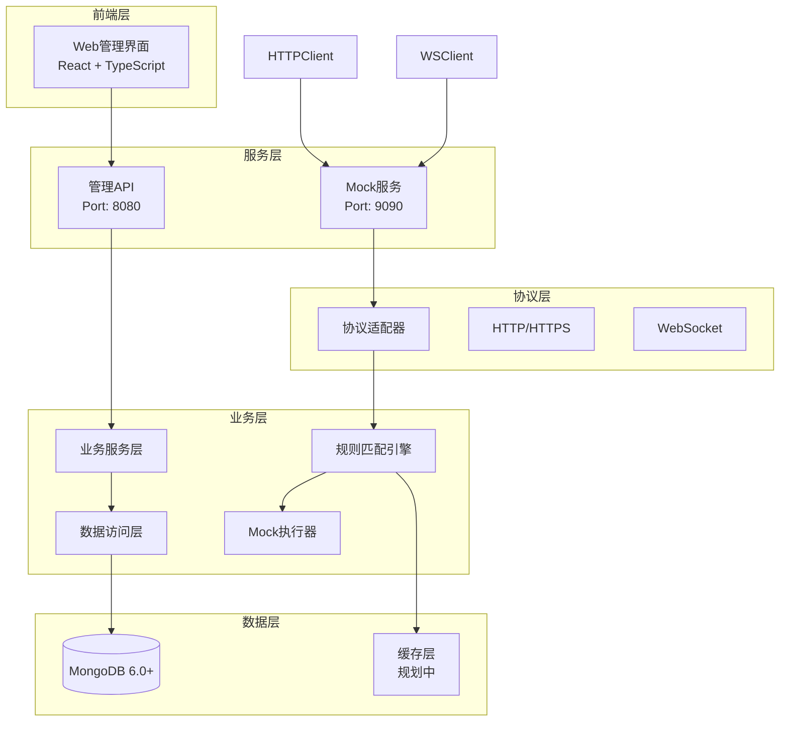
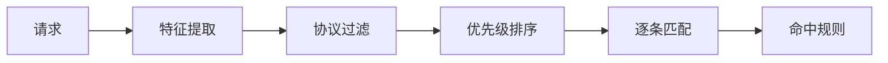

# Mock Server 系统架构设计

> **当前版本**: v0.6.2 (Enterprise Foundation)
> **设计状态**: 生产就绪
> **更新日期**: 2025-11-18

## 1. 系统概述

### 1.1 设计目标
构建企业级 Mock Server 系统，提供统一的多协议接口模拟能力，支持灵活的规则配置、可视化管理和大容量部署。

### 1.2 核心价值主张
- **多协议统一管理**: HTTP/HTTPS、WebSocket 等协议的一站式 Mock 解决方案
- **智能匹配引擎**: 从简单路径匹配到复杂脚本匹配的完整体系
- **可视化配置**: React + TypeScript 现代化 Web 管理界面
- **企业级特性**: 项目隔离、权限管理、版本控制、审计日志
- **高可用部署**: 单机到集群的平滑扩展能力

### 1.3 技术定位
- **后端**: Go 1.24+ 高性能并发架构
- **前端**: React 18 + TypeScript 5 + Ant Design 5
- **数据层**: MongoDB 6.0+ 主存储，Redis 缓存优化
- **部署**: Docker 容器化，支持 Kubernetes 编排

## 2. 系统架构

### 2.1 整体架构设计



### 2.2 分层架构原则

| 层次 | 职责 | 技术选型 |
|------|------|---------|
| **前端层** | 用户交互、规则配置、监控展示 | React 18 + TypeScript 5 + Ant Design 5 |
| **服务层** | API网关、协议路由、请求接入 | Gin Web Framework |
| **业务层** | 规则匹配、Mock执行、业务逻辑 | Go 1.24+ 标准库 |
| **协议层** | 多协议适配、请求转换统一化 | gorilla/websocket v1.5.3 |
| **数据层** | 持久化存储、缓存优化、事务管理 | MongoDB 6.0+ + Redis (规划) |

### 2.3 核心设计原则

1. **协议无关性**: 通过适配器模式实现多协议支持
2. **规则驱动**: 所有Mock行为由可配置规则定义
3. **状态无关**: 服务无状态设计，支持水平扩展
4. **可观测性**: 内置日志、监控、追踪能力
5. **企业级**: 权限控制、审计日志、版本管理

## 3. 核心模块设计

### 3.1 规则匹配引擎 (engine/)

**核心职责**: 根据请求特征高效匹配对应的 Mock 规则

**设计特点**:
- **多策略匹配**: 支持简单匹配、正则匹配、脚本匹配
- **优先级控制**: 数值越大优先级越高，支持精确控制
- **高性能**: LRU缓存优化，支持万级规则实时匹配
- **协议无关**: 通过适配器模式支持多协议

**匹配流程**:


**匹配策略层次**:
1. **简单匹配**: 路径、方法、Header、Query参数
2. **正则匹配**: 复杂模式匹配，LRU缓存
3. **脚本匹配**: JavaScript引擎，安全沙箱
4. **IP过滤**: CIDR网段白名单

### 3.2 Mock执行器 (executor/)

**核心职责**: 根据匹配规则生成各类 Mock 响应

**响应类型**:
- **静态响应**: JSON/XML/HTML/二进制数据
- **动态响应**: Go template引擎，13个内置函数
- **代理模式**: HTTP反向代理，支持请求/响应修改
- **文件引用**: 流式大文件支持
- **脚本响应**: JavaScript动态生成

**延迟策略**:
- 固定延迟、随机延迟、正态分布
- 阶梯延迟：模拟服务逐步过载
- 支持微秒级精度控制

### 3.3 协议适配器 (adapter/)

**核心职责**: 统一不同协议的请求/响应模型

**已实现协议**:
- **HTTP/HTTPS**: 完整RESTful API支持
- **WebSocket**: 实时双向通信，1000+并发

**协议扩展能力**:
- 标准化适配器接口
- 统一请求/响应模型
- 协议特征提取和转换
- 插件化协议支持

### 3.4 业务服务层 (service/)

**核心职责**: 业务逻辑处理和数据管理

**主要服务**:
- **规则管理**: CRUD操作、批量处理、导入导出
- **项目管理**: 多项目、多环境隔离
- **统计分析**: 实时监控、趋势分析
- **系统管理**: 健康检查、配置管理

### 3.5 数据访问层 (repository/)

**核心职责**: 数据持久化和高性能访问

**数据模型**:
- **规则集合**: 索引优化，支持复杂查询
- **项目模型**: 工作空间、项目、环境三层组织
- **日志系统**: 异步写入，自动TTL过期
- **统计缓存**: 实时聚合，性能优化

**性能优化**:
- 连接池管理
- 索引策略优化
- 查询缓存机制
- 批量操作支持

## 4. 数据架构设计

### 4.1 数据模型设计

**数据组织层次**:
```
工作空间 (Workspace)
  └── 项目 (Project)
      └── 环境 (Environment)
          └── 规则集合 (Rule Set)
              └── Mock 规则 (Mock Rule)
```

**核心实体**:
- **工作空间**: 最高组织单位，支持多租户隔离
- **项目**: 业务项目边界，规则管理单元
- **环境**: 开发、测试、预发布等环境隔离
- **规则**: 具体的Mock配置，支持多协议

### 4.2 存储架构

**主存储**: MongoDB 6.0+
- **文档模型**: 灵活的JSON数据结构
- **索引策略**: 复合索引优化查询性能
- **连接池**: 支持高并发访问
- **副本集**: 数据高可用保障

**缓存层**: Redis (规划中)
- **热点规则**: 提升匹配性能
- **统计数据**: 实时聚合计算
- **会话管理**: 用户状态保持

### 4.3 性能优化

**查询优化**:
- 索引命中率 > 95%
- 查询响应时间 < 10ms
- 支持 10,000+ 规则实时匹配

**数据安全**:
- 访问权限控制
- 敏感数据加密
- 审计日志完整记录

## 5. 部署架构

### 5.1 部署形态

**单机部署**:
- 适用于开发测试环境
- 资源需求: 2核4G内存
- 快速启动，易于调试

**集群部署**:
- 适用于生产环境
- 负载均衡 + 高可用
- 支持水平扩展

**容器化部署**:
- Docker + Docker Compose
- Kubernetes 支持
- 环境一致性保障

### 5.2 服务拆分

**核心服务**:
- **管理API**: 规则配置、项目管理 (Port: 8080)
- **Mock服务**: 协议处理、规则执行 (Port: 9090)
- **前端服务**: Web管理界面 (Port: 5173)

**支撑服务**:
- **MongoDB**: 主数据存储
- **Redis**: 缓存层 (规划)
- **Nginx**: 反向代理 (可选)

### 5.3 网络架构

```
Internet
    ↓
[Nginx 反向代理]
    ↓
┌─────────────────────────┐
│  前端服务 (Port: 5173)   │
└─────────────────────────┘
    ↓
┌─────────────────────────┐
│ 管理API (Port: 8080)      │
└─────────────────────────┘
    ↓
┌─────────────────────────┐
│ Mock服务 (Port: 9090)     │
└─────────────────────────┘
    ↓
┌─────────────────────────┐
│   MongoDB + Redis        │
└─────────────────────────┘
```

## 6. 技术架构总结

### 6.1 架构优势

**高性能**:
- Go语言并发优势
- 缓存优化策略
- 连接池管理
- 异步处理机制

**高可用**:
- 无状态服务设计
- 数据库副本集
- 负载均衡支持
- 健康检查机制

**可扩展**:
- 模块化架构
- 插件化协议支持
- 水平扩展能力
- 微服务友好

**可观测**:
- 结构化日志
- 性能指标采集
- 链路追踪
- 实时监控

### 6.2 关键技术决策

| 技术领域 | 选型 | 理由 |
|---------|------|------|
| 后端语言 | Go 1.24+ | 高性能、并发友好、部署简单 |
| Web框架 | Gin | 轻量级、高性能、生态成熟 |
| 数据库 | MongoDB 6.0+ | 文档型数据库、灵活扩展 |
| 前端框架 | React 18 + TypeScript | 现代化、类型安全 |
| 构建工具 | Vite 5.1.0 | 快速开发、热更新 |
| 容器化 | Docker + Kubernetes | 标准化部署、云原生 |

### 6.3 架构演进路线

**当前状态 (v0.6.2)**:
- ✅ 核心协议支持 (HTTP/WebSocket)
- ✅ 智能匹配引擎
- ✅ 可视化管理界面
- ✅ 企业级特性 (项目隔离、权限)
- ✅ 容器化部署

**规划演进**:
- 🔄 缓存层集成 (Redis)
- 🔄 gRPC协议支持
- 🔄 分布式部署优化
- 🔄 插件系统
- 🔄 多租户增强

---

**文档状态**: ✅ 当前版本已实现
**维护团队**: Mock Server 架构组
**最后更新**: 2025-11-18
