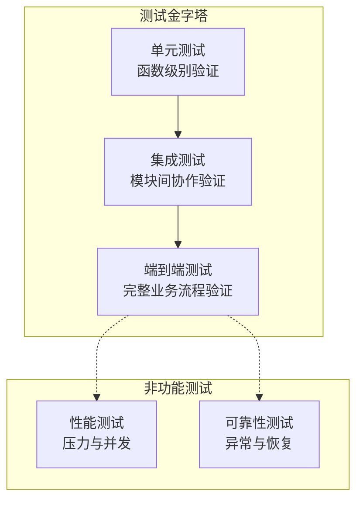
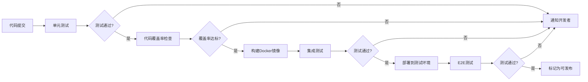

# 测试策略文档

## 文档元数据

| 项目 | 内容 |
|------|------|
| 文档名称 | 测试策略文档 |
| 创建时间 | 2025-11-14 |
| 适用版本 | v0.1.0-v0.1.3 |
| 文档类型 | 测试策略 |
| 优先级 | P0 - 高优先级 |
| 状态 | 进行中 |

## 概述

### 目标

建立统一的测试策略，确保 Mock Server 项目的质量保障体系完整有效，覆盖单元测试、集成测试、端到端测试和性能测试等多个层次。

### 范围

- 单元测试策略和覆盖率要求
- 集成测试场景设计
- 端到端测试流程
- 性能测试基准和指标
- 可靠性测试方案

### 原则

- 测试分层：按照测试金字塔原则，单元测试占主导，集成测试和端到端测试作为补充
- 自动化优先：尽可能实现测试自动化，减少手工测试依赖
- 持续集成：将测试集成到 CI/CD 流程中，确保每次变更都经过验证
- 质量门禁：设置代码覆盖率和测试通过率门槛，不达标不允许合并

---

## 测试体系设计

### 测试层次架构

### 测试分层职责

| 测试层次 | 测试目标 | 覆盖率要求 | 执行频率 |
|---------|---------|-----------|---------|
| 单元测试 | 函数逻辑正确性 | 核心模块 > 80% | 每次提交 |
| 集成测试 | 模块协作正确性 | 关键路径 100% | 每次构建 |
| 端到端测试 | 业务流程完整性 | 主要场景 100% | 每日构建 |
| 性能测试 | 性能指标达标 | 关键接口 | 发布前 |

---

## 单元测试策略

### 测试覆盖模块

#### 1. 规则匹配引擎测试
- HTTP方法匹配测试
- 路径匹配测试（精确匹配、参数匹配）
- Query参数匹配测试
- Header匹配测试
- IP白名单测试
- 优先级排序测试
- 组合条件测试
- 边界条件测试

#### 2. Mock执行器测试
- 静态响应生成测试
- 状态码处理测试
- 响应头设置测试
- 延迟配置测试
- 响应体处理测试

#### 3. 协议适配器测试
- 请求解析测试
- 响应构建测试
- 边界条件处理测试

#### 4. 数据仓库测试
- RuleRepository CRUD测试
- ProjectRepository CRUD测试
- EnvironmentRepository CRUD测试
- 分页查询测试
- 边界条件测试

### 单元测试技术方案

#### 测试框架选择

| 组件 | 技术选型 | 说明 |
|------|---------|------|
| 测试框架 | Go testing + testify | 标准库 + 断言增强 |
| Mock框架 | gomock | 接口Mock生成 |
| 数据库Mock | testcontainers-go | 真实MongoDB容器测试 |
| HTTP测试 | httptest | 标准库HTTP测试工具 |

#### 测试覆盖率要求

| 模块 | 覆盖率目标 |
|------|-----------|
| engine | > 85% |
| executor | > 80% |
| adapter | > 75% |
| repository | > 80% |
| service | > 70% |
| api | > 75% |
| 整体平均 | > 80% |

---

## 集成测试策略

### 测试场景设计

#### 1. 管理API集成测试
- 项目管理流程测试（创建、查询、更新、删除）
- 环境管理流程测试（创建、查询、更新、删除）
- 规则管理流程测试（创建、查询、更新、启用/禁用、删除）

#### 2. Mock服务集成测试
- 请求匹配和响应测试
- 响应特性测试（JSON/XML响应、状态码、响应头、延迟）
- 环境隔离测试

#### 3. 端到端业务流程测试
- 用户API Mock完整流程
- 多环境并行使用
- 规则优先级验证

---

## 性能测试策略

### 性能测试目标

| 性能指标 | 目标值 | 测试场景 |
|---------|-------|---------|
| HTTP请求QPS | > 10,000 | 简单规则匹配 |
| 平均响应时间 | < 10ms | 无延迟配置 |
| P95响应时间 | < 30ms | 正常负载 |
| P99响应时间 | < 50ms | 正常负载 |
| 并发连接数 | > 5,000 | 持续压力测试 |
| 规则匹配性能 | < 5ms | 100条规则场景 |
| 数据库查询 | < 10ms | 规则查询操作 |

### 性能测试工具和方法

#### 测试工具选择

| 工具 | 用途 | 说明 |
|------|-----|------|
| Apache JMeter | HTTP压力测试 | 配置测试计划和并发场景 |
| wrk | 命令行压测 | 快速基准测试 |
| Go benchmark | 单元性能测试 | 核心函数性能测试 |
| pprof | 性能分析 | CPU和内存分析 |

---

## 可靠性测试策略

### 异常场景测试

| 测试场景 | 异常注入 | 预期行为 |
|---------|---------|---------|
| 数据库连接失败 | MongoDB不可用 | 返回服务不可用错误，不崩溃 |
| 数据库连接中断 | 运行中断开连接 | 自动重连或返回错误 |
| 非法请求处理 | 发送畸形HTTP请求 | 返回400错误，不崩溃 |
| 超大请求体 | 发送10MB请求体 | 拒绝或正确处理 |
| 非法规则配置 | 创建无效规则 | 返回验证错误 |
| 并发创建冲突 | 同时创建同名项目 | 一个成功，其他返回冲突错误 |
| 规则查询超时 | 模拟慢查询 | 超时返回错误 |
| 内存泄漏测试 | 长时间运行 | 内存使用稳定 |
| 协程泄漏测试 | 大量并发请求 | Goroutine数量回落正常 |

---

## 测试自动化方案

### CI/CD集成

#### 测试流水线设计

#### Makefile测试命令

需要提供的测试命令：
- `make test-unit`：运行单元测试
- `make test-integration`：运行集成测试
- `make test-e2e`：运行端到端测试
- `make test-all`：运行所有测试
- `make test-coverage`：生成覆盖率报告
- `make test-performance`：运行性能测试

---

## 附录

### 参考资料

- Go Testing官方文档：https://golang.org/pkg/testing/
- Testify文档：https://github.com/stretchr/testify
- JMeter性能测试指南：https://jmeter.apache.org/usermanual/
- MongoDB测试最佳实践：https://www.mongodb.com/docs/manual/testing/

### 变更记录

| 版本 | 变更内容 | 变更时间 | 变更人 |
|------|---------|---------|--------|
| v1.0 | 初始版本 | 2025-11-14 | Assistant |