# 系统设计文档

## 项目概述

### 目标
实现一个功能强大、灵活可配置的 Mock Server 系统，支持多协议模拟、可视化配置和多种部署方式，满足开发测试场景中的接口模拟需求。

### 核心价值
- 支持主流协议（HTTP/HTTPS、WebSocket、gRPC、TCP/UDP）的统一 Mock 管理
- 提供直观的 Web 界面进行规则配置和管理
- 灵活的规则匹配引擎，支持简单到复杂的各类匹配场景
- 企业级持久化方案，支持团队协作和配置共享
- 多种部署形态，适应不同规模和场景需求

## 系统架构

### 整体架构

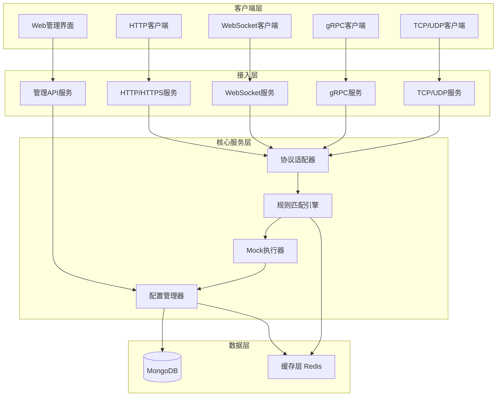

### 分层设计

#### 客户端层
负责用户交互和请求发起，包括管理界面和各类协议客户端。

#### 接入层
提供多协议服务端点，处理不同协议的连接和请求接入。

#### 核心服务层
实现核心业务逻辑，包括规则匹配、Mock响应生成、配置管理等。

#### 数据层
提供数据持久化和缓存能力，支持高性能访问。

## 核心模块设计

### 1. 规则匹配引擎

#### 职责
根据请求特征匹配对应的 Mock 规则，支持多种匹配策略。

#### 匹配策略层次

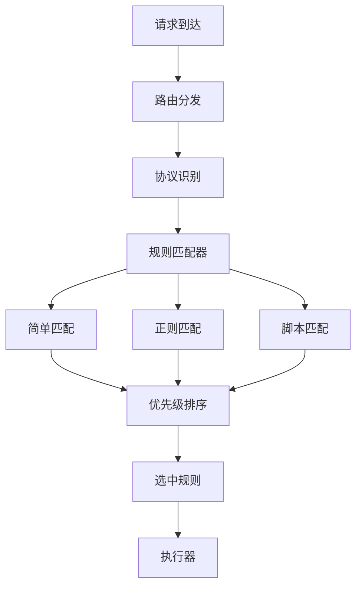

#### 匹配规则模型

| 字段名称 | 类型 | 说明 | 必填 |
|---------|------|------|------|
| 规则ID | String | 唯一标识符 | 是 |
| 规则名称 | String | 规则描述名称 | 是 |
| 协议类型 | Enum | HTTP/WebSocket/gRPC/TCP/UDP | 是 |
| 匹配类型 | Enum | Simple/Regex/Script | 是 |
| 优先级 | Integer | 数值越大优先级越高 | 是 |
| 启用状态 | Boolean | 是否生效 | 是 |
| 匹配条件 | Object | 具体匹配条件（见下表） | 是 |
| 响应配置 | Object | Mock响应定义（见下表） | 是 |
| 创建时间 | Timestamp | 规则创建时间 | 是 |
| 更新时间 | Timestamp | 规则更新时间 | 是 |
| 创建者 | String | 创建用户标识 | 否 |
| 标签 | Array | 规则分类标签 | 否 |

#### HTTP协议匹配条件

| 字段名称 | 类型 | 说明 | 示例 |
|---------|------|------|------|
| 请求方法 | String/Array | GET/POST等 | "GET" 或 ["GET","POST"] |
| 路径模式 | String | 路径匹配表达式 | "/api/users/:id" |
| 查询参数 | Object | 查询参数条件 | {"status": "active"} |
| 请求头 | Object | Header匹配条件 | {"Content-Type": "application/json"} |
| 请求体匹配 | Object | Body匹配规则 | JSONPath或正则 |
| IP限制 | Array | 允许的IP列表 | ["192.168.1.0/24"] |

#### WebSocket匹配条件

| 字段名称 | 类型 | 说明 |
|---------|------|------|
| 连接路径 | String | WebSocket端点路径 |
| 握手Header | Object | 握手时Header条件 |
| 消息模式 | String | 消息内容匹配表达式 |
| 消息类型 | Enum | Text/Binary |

#### gRPC匹配条件

| 字段名称 | 类型 | 说明 |
|---------|------|------|
| 服务名 | String | gRPC服务全限定名 |
| 方法名 | String | RPC方法名 |
| 元数据 | Object | Metadata匹配条件 |
| 请求消息 | Object | Protobuf字段匹配 |

#### TCP/UDP匹配条件

| 字段名称 | 类型 | 说明 |
|---------|------|------|
| 端口号 | Integer | 监听端口 |
| 数据模式 | String | 二进制数据匹配模式（Hex/正则） |
| 首包特征 | String | 连接首包特征匹配 |

#### 脚本匹配引擎

支持使用 JavaScript 表达式进行高级匹配，脚本环境提供以下上下文：

| 上下文变量 | 类型 | 说明 |
|-----------|------|------|
| request | Object | 完整请求对象 |
| headers | Object | 请求头映射 |
| body | String/Object | 请求体 |
| query | Object | 查询参数 |
| path | String | 请求路径 |
| method | String | 请求方法 |
| protocol | String | 协议类型 |
| utils | Object | 工具函数库（时间、加密、随机等） |

脚本返回布尔值表示是否匹配成功。

### 2. Mock 执行器

#### 职责
根据匹配的规则生成 Mock 响应数据。

#### 响应配置模型

| 字段名称 | 类型 | 说明 |
|---------|------|------|
| 响应类型 | Enum | Static/Dynamic/Proxy/Script |
| 延迟配置 | Object | 响应延迟设置 |
| 响应内容 | Object | 具体响应数据 |
| 错误模拟 | Object | 错误场景配置 |

#### HTTP响应配置

| 字段名称 | 类型 | 说明 |
|---------|------|------|
| 状态码 | Integer | HTTP状态码 |
| 响应头 | Object | 自定义Header |
| 响应体 | String/Object | 响应内容 |
| 响应体类型 | Enum | JSON/XML/HTML/Text/Binary |
| 模板变量 | Object | 动态变量定义 |

#### WebSocket响应配置

| 字段名称 | 类型 | 说明 |
|---------|------|------|
| 响应模式 | Enum | Once/Multiple/Stream |
| 消息序列 | Array | 消息列表 |
| 推送间隔 | Integer | 消息推送间隔(ms) |
| 消息模板 | String | 消息内容模板 |

#### gRPC响应配置

| 字段名称 | 类型 | 说明 |
|---------|------|------|
| 状态码 | Enum | gRPC状态码 |
| 响应消息 | Object | Protobuf消息定义 |
| 流式模式 | Enum | Unary/ServerStream/ClientStream/Bidirectional |
| 尾部元数据 | Object | Trailing Metadata |

#### TCP/UDP响应配置

| 字段名称 | 类型 | 说明 |
|---------|------|------|
| 响应数据 | String | Hex编码的响应内容 |
| 分包策略 | Object | 数据分包配置 |
| 连接保持 | Boolean | 是否保持连接 |

#### 动态响应能力

支持以下动态数据生成方式：

1. **变量占位符**
   - 请求参数引用
   - 系统变量（时间戳、UUID、随机数等）
   - 环境变量

2. **模板引擎**
   - 支持条件判断
   - 支持循环生成
   - 支持表达式计算

3. **脚本生成**
   - JavaScript脚本动态生成响应
   - 访问外部数据源
   - 复杂业务逻辑模拟

4. **代理模式**
   - 转发到真实后端
   - 修改请求/响应
   - 流量录制回放

#### 响应延迟策略

| 策略类型 | 说明 | 参数 |
|---------|------|------|
| 固定延迟 | 固定时间延迟 | 延迟毫秒数 |
| 随机延迟 | 范围内随机 | 最小值、最大值 |
| 正态分布 | 符合正态分布 | 均值、标准差 |
| 阶梯延迟 | 根据请求次数递增 | 步长、上限 |

### 3. 配置管理器

#### 职责
管理 Mock 规则的 CRUD 操作、版本控制和配置分发。

#### 配置组织结构

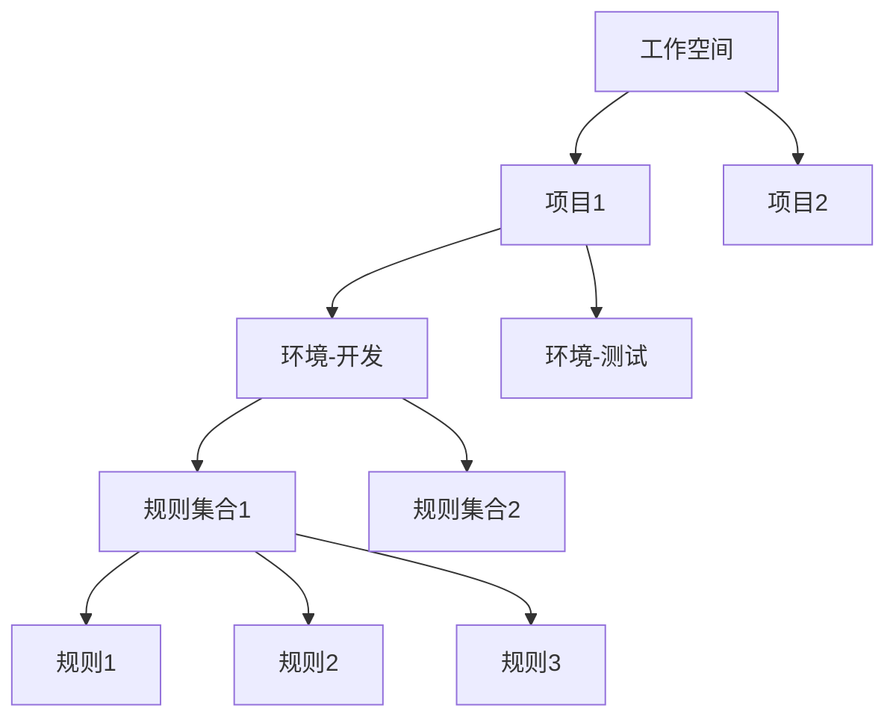

#### 工作空间模型

| 字段名称 | 类型 | 说明 |
|---------|------|------|
| 工作空间ID | String | 唯一标识 |
| 工作空间名称 | String | 显示名称 |
| 所有者 | String | 创建用户 |
| 成员列表 | Array | 协作成员 |
| 权限配置 | Object | 访问控制规则 |

#### 项目模型

| 字段名称 | 类型 | 说明 |
|---------|------|------|
| 项目ID | String | 唯一标识 |
| 项目名称 | String | 显示名称 |
| 所属工作空间 | String | 工作空间ID |
| 描述信息 | String | 项目说明 |
| 环境列表 | Array | 环境配置 |

#### 环境模型

| 字段名称 | 类型 | 说明 |
|---------|------|------|
| 环境ID | String | 唯一标识 |
| 环境名称 | String | 如：开发、测试、预发布 |
| 基础URL | String | Mock服务地址 |
| 全局变量 | Object | 环境级变量 |
| 规则集合 | Array | 规则集ID列表 |

#### 版本控制

每次规则修改都会产生版本记录：

| 字段名称 | 类型 | 说明 |
|---------|------|------|
| 版本号 | String | 语义化版本号 |
| 变更类型 | Enum | Create/Update/Delete |
| 变更内容 | Object | 变更详情 |
| 操作用户 | String | 用户标识 |
| 操作时间 | Timestamp | 时间戳 |
| 变更说明 | String | 备注信息 |

支持版本对比、回滚和分支管理。

### 4. 协议适配器

#### 职责
将不同协议的请求统一转换为内部标准格式，并将响应转换回对应协议格式。

#### 统一请求模型

| 字段名称 | 类型 | 说明 |
|---------|------|------|
| 请求ID | String | 唯一追踪ID |
| 协议类型 | Enum | HTTP/WebSocket/gRPC/TCP/UDP |
| 元数据 | Object | 协议特定元数据 |
| 路径/方法 | String | 请求标识 |
| 头信息 | Object | 键值对形式 |
| 载荷数据 | Bytes | 请求体原始数据 |
| 解析后数据 | Object | 结构化数据 |
| 来源信息 | Object | IP、端口等 |
| 接收时间 | Timestamp | 请求到达时间 |

#### 协议转换流程

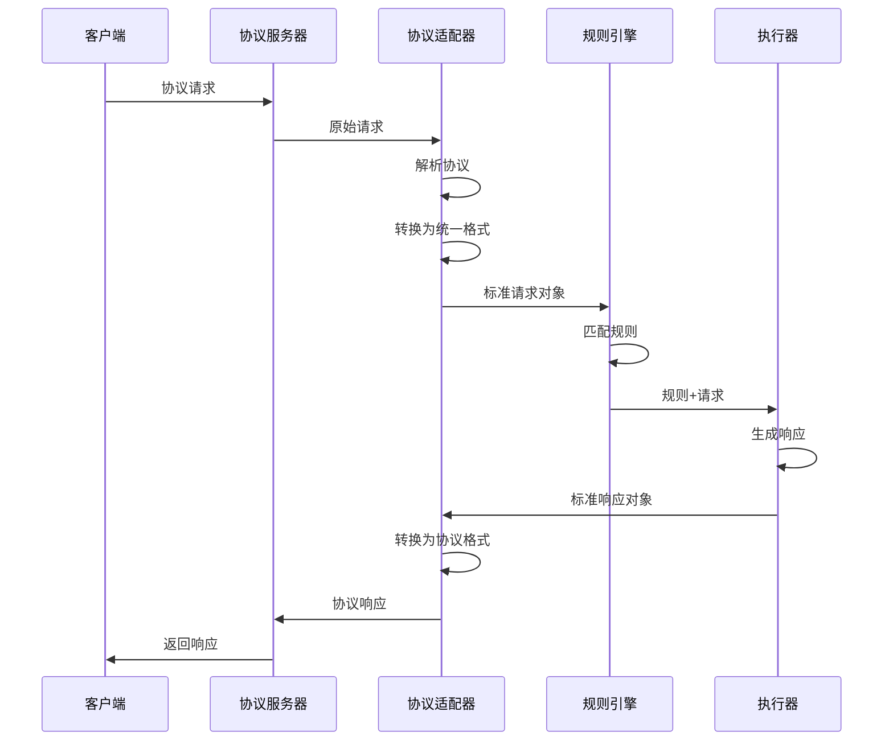

### 5. Web 管理界面

#### 功能模块

##### 仪表盘
- 实时请求监控
- 规则命中统计
- 性能指标展示
- 错误率监控

##### 规则管理
- 规则列表视图（支持搜索、过滤、排序）
- 规则创建向导
- 规则编辑器（可视化 + 代码模式）
- 规则测试工具
- 批量操作（启用/禁用/删除/导出）

##### 项目管理
- 工作空间管理
- 项目组织
- 环境配置
- 成员权限管理

##### 请求日志
- 实时日志流
- 日志查询和过滤
- 请求重放
- 日志导出

##### 数据管理
- 规则导入/导出
- 配置备份/恢复
- 数据清理

##### 系统设置
- 服务端口配置
- 数据库连接
- 缓存配置
- 安全设置
- 插件管理

#### 前端技术选型建议

| 层次 | 推荐技术 | 说明 |
|-----|---------|------|
| 框架 | React 18+ | 组件化、生态丰富 |
| 状态管理 | Zustand/Redux Toolkit | 轻量级状态管理 |
| UI组件库 | Ant Design/Material-UI | 企业级组件 |
| 路由 | React Router | 标准路由方案 |
| 请求库 | Axios | HTTP客户端 |
| 代码编辑器 | Monaco Editor | VS Code同款 |
| 图表 | ECharts/Recharts | 数据可视化 |
| 构建工具 | Vite | 快速开发构建 |

### 6. 管理 API 服务

#### API 分组

##### 规则管理 API

| 接口路径 | 方法 | 说明 |
|---------|------|------|
| /api/v1/rules | GET | 查询规则列表 |
| /api/v1/rules | POST | 创建规则 |
| /api/v1/rules/:id | GET | 获取规则详情 |
| /api/v1/rules/:id | PUT | 更新规则 |
| /api/v1/rules/:id | DELETE | 删除规则 |
| /api/v1/rules/:id/enable | POST | 启用规则 |
| /api/v1/rules/:id/disable | POST | 禁用规则 |
| /api/v1/rules/batch | POST | 批量操作 |
| /api/v1/rules/import | POST | 导入规则 |
| /api/v1/rules/export | POST | 导出规则 |

##### 项目管理 API

| 接口路径 | 方法 | 说明 |
|---------|------|------|
| /api/v1/workspaces | GET/POST | 工作空间管理 |
| /api/v1/projects | GET/POST | 项目管理 |
| /api/v1/environments | GET/POST | 环境管理 |
| /api/v1/members | GET/POST/DELETE | 成员管理 |

##### 日志查询 API

| 接口路径 | 方法 | 说明 |
|---------|------|------|
| /api/v1/logs | GET | 查询请求日志 |
| /api/v1/logs/stream | WebSocket | 实时日志流 |
| /api/v1/logs/:id | GET | 获取日志详情 |
| /api/v1/logs/export | POST | 导出日志 |

##### 统计分析 API

| 接口路径 | 方法 | 说明 |
|---------|------|------|
| /api/v1/stats/overview | GET | 概览统计 |
| /api/v1/stats/rules | GET | 规则统计 |
| /api/v1/stats/performance | GET | 性能指标 |
| /api/v1/stats/traffic | GET | 流量分析 |

##### 系统管理 API

| 接口路径 | 方法 | 说明 |
|---------|------|------|
| /api/v1/system/config | GET/PUT | 系统配置 |
| /api/v1/system/health | GET | 健康检查 |
| /api/v1/system/version | GET | 版本信息 |

## 数据持久化设计

### MongoDB 集合设计

#### rules 集合（规则集合）

存储所有 Mock 规则配置，索引设计：

| 索引字段 | 类型 | 说明 |
|---------|------|------|
| _id | 主键 | 规则ID |
| project_id + environment_id | 复合索引 | 快速查询环境规则 |
| protocol_type | 单字段索引 | 协议类型查询 |
| enabled | 单字段索引 | 启用状态过滤 |
| priority | 单字段索引 | 优先级排序 |
| tags | 多键索引 | 标签查询 |
| created_at | 单字段索引 | 时间范围查询 |

#### projects 集合（项目集合）

| 索引字段 | 类型 | 说明 |
|---------|------|------|
| _id | 主键 | 项目ID |
| workspace_id | 单字段索引 | 工作空间查询 |

#### environments 集合（环境集合）

| 索引字段 | 类型 | 说明 |
|---------|------|------|
| _id | 主键 | 环境ID |
| project_id | 单字段索引 | 项目关联 |

#### logs 集合（日志集合）

存储请求日志，支持 TTL 自动过期：

| 索引字段 | 类型 | 说明 |
|---------|------|------|
| _id | 主键 | 日志ID |
| request_id | 单字段索引 | 请求追踪 |
| rule_id | 单字段索引 | 规则关联 |
| protocol_type | 单字段索引 | 协议过滤 |
| timestamp | TTL索引 | 自动过期（默认7天） |
| project_id + environment_id | 复合索引 | 项目日志查询 |

#### versions 集合（版本集合）

| 索引字段 | 类型 | 说明 |
|---------|------|------|
| _id | 主键 | 版本ID |
| rule_id | 单字段索引 | 规则关联 |
| created_at | 单字段索引 | 时间排序 |

#### users 集合（用户集合）

| 索引字段 | 类型 | 说明 |
|---------|------|------|
| _id | 主键 | 用户ID |
| username | 唯一索引 | 用户名 |
| email | 唯一索引 | 邮箱 |

### 缓存策略（Redis）

#### 缓存场景

| 缓存键模式 | 数据类型 | 说明 | 过期时间 |
|-----------|---------|------|---------|
| rule:env:{env_id} | Hash | 环境规则集 | 5分钟 |
| rule:detail:{rule_id} | String | 规则详情 | 10分钟 |
| config:global | String | 全局配置 | 30分钟 |
| stats:daily:{date} | Hash | 每日统计 | 24小时 |
| session:{token} | String | 用户会话 | 2小时 |

#### 缓存更新策略

- 规则变更时主动失效对应缓存
- 使用发布/订阅模式同步集群缓存
- 支持缓存预热和批量刷新

## 部署架构设计

### 单机部署

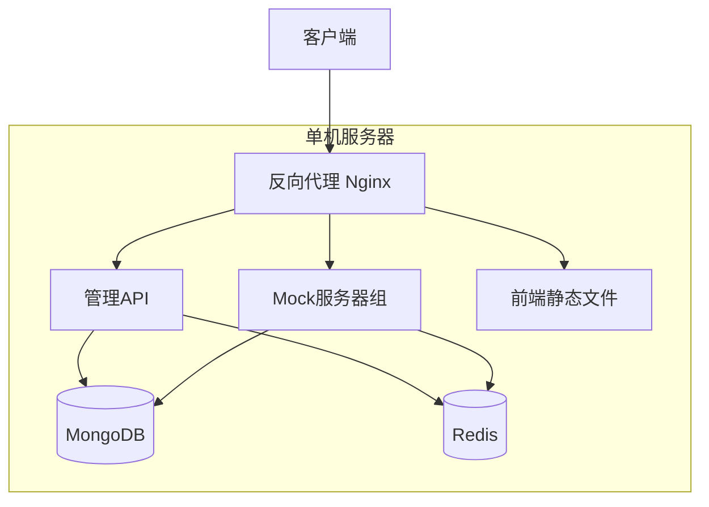

适用场景：个人开发、小团队、测试环境

### 集群部署

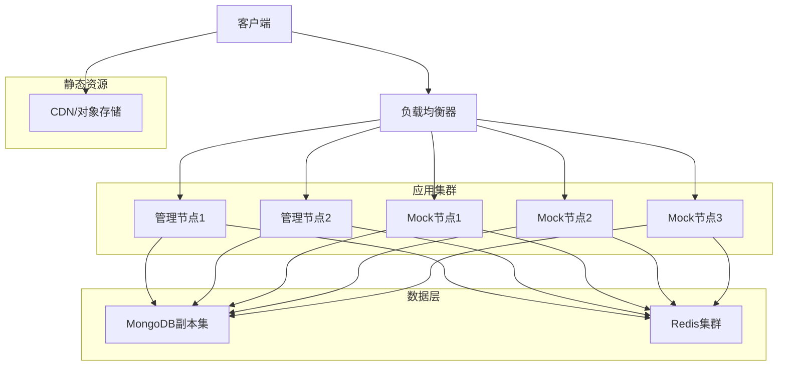

适用场景：企业生产环境、高可用要求

### 容器化部署

使用 Docker Compose 或 Kubernetes 进行容器编排：

#### 服务组件清单

| 组件名称 | 说明 | 副本数 |
|---------|------|-------|
| mockserver-admin | 管理API服务 | 2+ |
| mockserver-http | HTTP Mock服务 | 3+ |
| mockserver-grpc | gRPC Mock服务 | 2+ |
| mockserver-tcp | TCP/UDP Mock服务 | 2+ |
| mockserver-frontend | 前端服务 | 2+ |
| mongodb | 数据库 | 3（副本集） |
| redis | 缓存 | 3（哨兵模式） |

#### Kubernetes 部署要点

- 使用 Deployment 管理无状态服务
- 使用 StatefulSet 管理数据库
- 使用 Service 暴露服务端点
- 使用 Ingress 管理外部访问
- 使用 ConfigMap 管理配置
- 使用 Secret 管理敏感信息
- 使用 HPA 实现自动扩缩容

## 核心流程设计

### 规则匹配流程

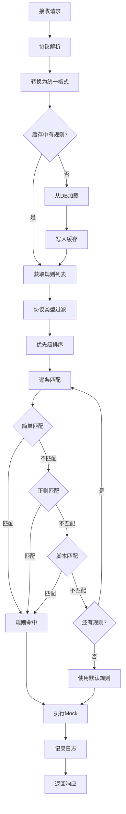

### 规则创建流程

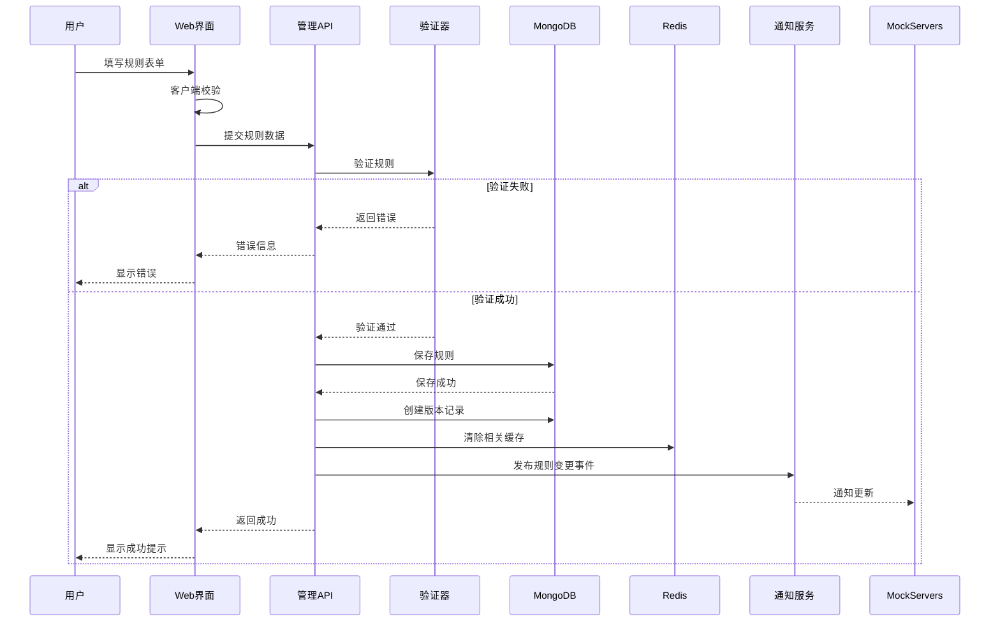

### 请求处理流程

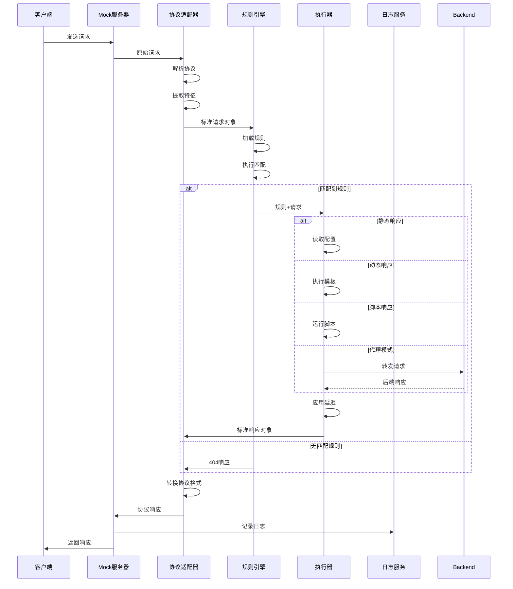

## 安全性设计

### 认证授权

#### 认证方式

| 方式 | 场景 | 说明 |
|-----|------|------|
| JWT Token | 管理API | 标准Token认证 |
| API Key | 程序调用 | 服务间认证 |
| OAuth 2.0 | 第三方集成 | 标准授权协议 |

#### 权限模型

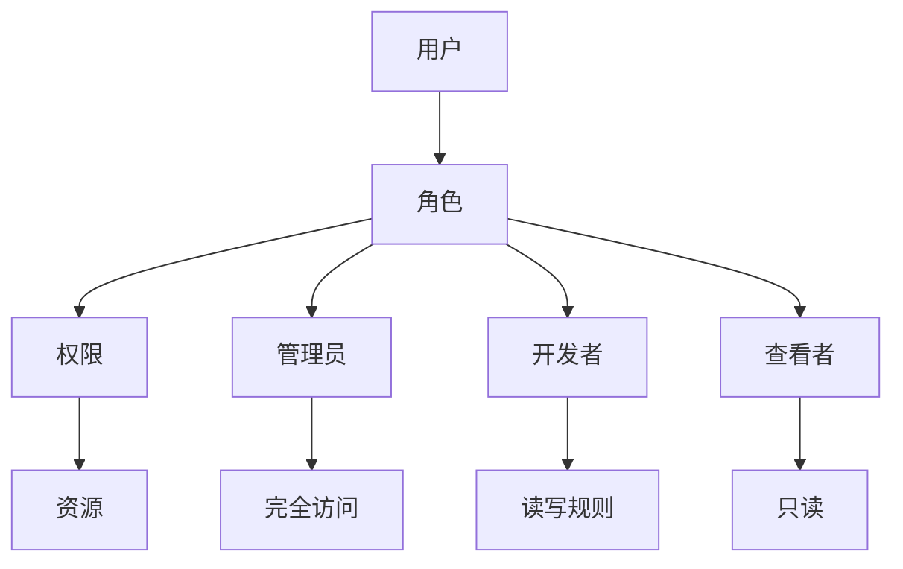

#### 权限矩阵

| 角色 | 查看规则 | 创建规则 | 修改规则 | 删除规则 | 查看日志 | 系统配置 |
|-----|---------|---------|---------|---------|---------|---------|
| 管理员 | ✓ | ✓ | ✓ | ✓ | ✓ | ✓ |
| 开发者 | ✓ | ✓ | ✓ | ✓ | ✓ | ✗ |
| 查看者 | ✓ | ✗ | ✗ | ✗ | ✓ | ✗ |

### 数据安全

#### 敏感数据保护

- 数据库连接信息加密存储
- API Key 哈希存储
- 支持字段级加密
- 日志脱敏处理

#### 通信安全

- 管理接口强制 HTTPS
- 支持 TLS/SSL 证书配置
- WebSocket 加密传输
- gRPC 安全连接

### 访问控制

#### IP 白名单

支持配置允许访问的 IP 地址范围，可在以下层级设置：
- 全局级别
- 项目级别
- 规则级别

#### 请求频率限制

| 限制维度 | 默认值 | 说明 |
|---------|-------|------|
| 单IP请求速率 | 1000/分钟 | 防止滥用 |
| 单用户API调用 | 100/分钟 | 管理API限流 |
| 全局请求限制 | 10000/秒 | 系统保护 |

### 审计日志

记录关键操作：

| 操作类型 | 记录内容 |
|---------|---------|
| 规则变更 | 操作用户、变更详情、时间戳 |
| 配置修改 | 修改项、修改前后值 |
| 用户登录 | 用户、IP、时间、结果 |
| 权限变更 | 授权者、被授权者、权限内容 |

## 可观测性设计

### 日志系统

#### 日志分类

| 日志类型 | 级别 | 说明 | 保留期 |
|---------|-----|------|-------|
| 访问日志 | INFO | 所有请求记录 | 7天 |
| 应用日志 | DEBUG/INFO/WARN/ERROR | 应用运行日志 | 30天 |
| 审计日志 | INFO | 操作审计 | 90天 |
| 错误日志 | ERROR | 异常堆栈 | 30天 |

#### 结构化日志格式

所有日志采用 JSON 格式，包含标准字段：

| 字段名 | 说明 |
|-------|------|
| timestamp | ISO8601时间戳 |
| level | 日志级别 |
| service | 服务名称 |
| trace_id | 链路追踪ID |
| message | 日志消息 |
| context | 上下文信息 |

### 监控指标

#### 系统指标

- CPU 使用率
- 内存使用率
- 磁盘 I/O
- 网络流量
- Goroutine 数量

#### 业务指标

| 指标名称 | 类型 | 说明 |
|---------|-----|------|
| 请求总数 | Counter | 累计请求数 |
| 请求QPS | Gauge | 每秒请求数 |
| 响应时间 | Histogram | 响应时间分布 |
| 规则命中率 | Gauge | 规则匹配成功率 |
| 错误率 | Gauge | 错误响应占比 |
| 协议分布 | Counter | 各协议请求占比 |

#### 告警规则

| 告警项 | 阈值 | 级别 |
|-------|-----|------|
| 错误率 | >5% | 警告 |
| 错误率 | >10% | 严重 |
| 响应时间P99 | >1000ms | 警告 |
| 内存使用 | >85% | 警告 |
| CPU使用 | >80% | 警告 |
| MongoDB连接失败 | 任意 | 严重 |

### 链路追踪

使用 OpenTelemetry 标准实现分布式追踪：

- 为每个请求生成唯一 trace_id
- 记录完整调用链路
- 标记关键操作耗时
- 支持跨服务追踪

## 性能优化策略

### 缓存优化

#### 多级缓存架构

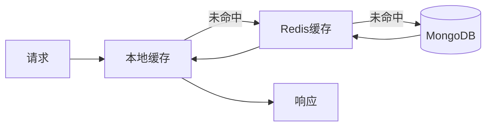

#### 缓存策略

| 数据类型 | 缓存位置 | 过期策略 |
|---------|---------|---------|
| 热点规则 | 本地+Redis | LRU，5分钟 |
| 规则详情 | Redis | 主动失效 |
| 全局配置 | 本地+Redis | 配置更新时失效 |
| 统计数据 | Redis | 定时刷新 |

### 数据库优化

#### 索引优化
- 根据查询模式建立复合索引
- 定期分析慢查询优化索引
- 避免全表扫描

#### 查询优化
- 使用投影减少返回字段
- 合理使用分页
- 批量操作替代循环查询

#### 连接池配置

| 参数 | 推荐值 | 说明 |
|-----|-------|------|
| 最小连接数 | 10 | 保持基础连接 |
| 最大连接数 | 100 | 根据负载调整 |
| 连接超时 | 5s | 快速失败 |
| 空闲超时 | 10min | 释放空闲连接 |

### 并发优化

#### Goroutine 池
- 控制并发数量避免资源耗尽
- 请求处理使用协程池
- 合理设置队列长度

#### 协议优化

| 协议 | 优化措施 |
|-----|---------|
| HTTP | 启用HTTP/2，连接复用，压缩 |
| WebSocket | 心跳保活，消息批量发送 |
| gRPC | 多路复用，流式处理 |
| TCP | 连接池，缓冲区优化 |

### 响应优化

- 静态响应预编译
- 模板预加载和缓存
- 大文件流式传输
- 支持响应压缩（gzip、br）

## 扩展性设计

### 插件机制

支持通过插件扩展功能：

#### 插件类型

| 插件类型 | 说明 | 接口定义 |
|---------|------|---------|
| 协议插件 | 支持新协议 | Protocol Handler |
| 匹配插件 | 自定义匹配逻辑 | Matcher Interface |
| 执行插件 | 自定义响应生成 | Executor Interface |
| 存储插件 | 自定义存储后端 | Storage Interface |
| 认证插件 | 自定义认证方式 | Auth Provider |

#### 插件加载机制

- 支持动态加载卸载
- 插件隔离和沙箱
- 插件版本管理
- 插件配置管理

### API 扩展

提供 Webhook 机制：

| 事件类型 | 触发时机 |
|---------|---------|
| rule.created | 规则创建时 |
| rule.updated | 规则更新时 |
| rule.deleted | 规则删除时 |
| request.received | 请求到达时 |
| response.sent | 响应发送后 |

### 协议扩展

新增协议支持的步骤：

1. 实现协议适配器接口
2. 定义协议特定匹配条件模型
3. 定义协议响应配置模型
4. 注册到协议管理器
5. 更新前端表单支持

## 配置管理

### 配置文件结构

主配置文件采用 YAML 格式：

| 配置段 | 说明 |
|-------|------|
| server | 服务端口配置 |
| database | MongoDB连接配置 |
| redis | Redis连接配置 |
| security | 安全配置 |
| logging | 日志配置 |
| performance | 性能参数 |
| features | 功能开关 |

### 配置优先级

配置来源优先级从高到低：

1. 环境变量
2. 命令行参数
3. 配置文件
4. 默认值

### 动态配置

支持运行时修改的配置项：

- 日志级别
- 缓存过期时间
- 限流阈值
- 功能开关

通过管理API或配置中心实时生效，无需重启服务。

## 容错与高可用

### 服务降级

当依赖服务不可用时的降级策略：

| 场景 | 降级措施 |
|-----|---------|
| MongoDB不可用 | 使用本地缓存规则，只读模式 |
| Redis不可用 | 降级为无缓存模式 |
| 脚本执行超时 | 返回默认响应 |
| 代理后端不可用 | 返回Mock响应 |

### 熔断机制

对外部依赖实施熔断保护：

| 参数 | 默认值 | 说明 |
|-----|-------|------|
| 失败阈值 | 50% | 触发熔断的失败率 |
| 请求量阈值 | 20 | 最小请求数 |
| 熔断时长 | 10s | 熔断后等待时间 |
| 半开状态请求数 | 5 | 探测请求数 |

### 健康检查

提供多层次健康检查：

| 检查项 | 端点 | 说明 |
|-------|-----|------|
| 存活检查 | /health/liveness | 服务是否运行 |
| 就绪检查 | /health/readiness | 是否可接收流量 |
| 依赖检查 | /health/dependencies | 依赖服务状态 |

### 数据备份

#### 备份策略

| 备份类型 | 频率 | 保留期 |
|---------|-----|-------|
| 全量备份 | 每日 | 30天 |
| 增量备份 | 每小时 | 7天 |
| 配置快照 | 变更时 | 永久 |

#### 灾难恢复

- 支持一键恢复到指定时间点
- 跨区域备份
- 定期恢复演练

## 测试策略

### 测试分层

| 测试类型 | 覆盖范围 | 目标 |
|---------|---------|------|
| 单元测试 | 函数/方法级 | >80%覆盖率 |
| 集成测试 | 模块间交互 | 核心流程 |
| 接口测试 | API契约 | 全部API |
| 性能测试 | 系统吞吐 | QPS指标 |
| 压力测试 | 极限负载 | 稳定性 |

### 性能基准

| 指标 | 目标值 | 测试条件 |
|-----|-------|---------|
| HTTP请求QPS | >10,000 | 4核8G单机 |
| 平均响应时间 | <10ms | 简单规则 |
| P99响应时间 | <50ms | 简单规则 |
| 并发WebSocket | >5,000 | 单机连接数 |
| 规则数量支持 | >10,000 | 不影响性能 |

### 测试工具

- 单元测试：Go testing 框架
- API测试：Postman/Newman
- 性能测试：JMeter/K6
- 压力测试：Locust/Gatling

## 实施路线图

### 阶段一：核心功能（MVP）

**目标**：实现基础 Mock 能力

**功能范围**：
- HTTP/HTTPS 协议支持
- 简单规则匹配（路径、方法、Header）
- 静态响应配置
- 基础 Web 管理界面（规则 CRUD）
- MongoDB 持久化
- 单机部署

**交付物**：
- 可运行的单机服务
- 基础管理界面
- 部署文档

### 阶段二：协议扩展

**目标**：支持多协议

**功能范围**：
- WebSocket 协议支持
- gRPC 协议支持
- TCP/UDP 协议支持
- 协议适配器框架
- 协议切换和管理

**交付物**：
- 多协议服务端
- 协议配置界面
- 协议测试工具

### 阶段三：高级匹配

**目标**：增强规则能力

**功能范围**：
- 正则表达式匹配
- 脚本化匹配引擎
- 动态响应模板
- 脚本响应生成
- 代理模式
- 规则测试调试工具

**交付物**：
- 高级匹配引擎
- 脚本编辑器
- 规则测试平台

### 阶段四：企业特性

**目标**：企业级能力

**功能范围**：
- 项目和环境管理
- 用户权限体系
- 版本控制和回滚
- 配置导入导出
- 数据备份恢复
- 审计日志

**交付物**：
- 多租户管理系统
- 权限管理界面
- 版本控制系统

### 阶段五：可观测性

**目标**：生产级监控

**功能范围**：
- 实时请求监控
- 性能指标采集
- 链路追踪
- 告警系统
- 日志分析
- 统计报表

**交付物**：
- 监控仪表盘
- 告警配置
- 日志查询系统

### 阶段六：高可用

**目标**：支持集群部署

**功能范围**：
- 集群部署支持
- Redis 缓存集成
- 负载均衡
- 健康检查
- 服务降级熔断
- 容器化部署

**交付物**：
- 集群部署方案
- Docker/K8s 部署文件
- 高可用运维手册

### 阶段七：生态扩展

**目标**：开放生态

**功能范围**：
- 插件系统
- Webhook 集成
- OpenAPI 规范
- CLI 工具
- SDK 开发
- 社区文档

**交付物**：
- 插件开发文档
- SDK 和 CLI
- 完整文档站点

## 技术选型建议

### 后端技术栈

| 层次 | 推荐技术 | 理由 |
|-----|---------|------|
| 语言 | Go 1.21+ | 高性能、并发友好、部署简单 |
| Web框架 | Gin/Fiber | 轻量、高性能 |
| gRPC | grpc-go | 官方库 |
| WebSocket | gorilla/websocket | 成熟稳定 |
| MongoDB驱动 | mongo-go-driver | 官方驱动 |
| Redis客户端 | go-redis | 功能完善 |
| 配置管理 | Viper | 多格式支持 |
| 日志 | Zap | 高性能结构化日志 |
| 脚本引擎 | goja | JavaScript引擎 |
| 验证 | validator | 数据验证 |
| 测试 | testify | 断言和Mock |

### 前端技术栈

| 层次 | 推荐技术 | 理由 |
|-----|---------|------|
| 框架 | React 18 | 生态丰富 |
| 语言 | TypeScript | 类型安全 |
| 构建 | Vite | 快速开发 |
| 状态管理 | Zustand | 轻量简洁 |
| UI组件 | Ant Design | 企业级组件库 |
| 请求 | Axios | HTTP客户端 |
| 路由 | React Router | 官方路由 |
| 代码编辑器 | Monaco Editor | 强大编辑能力 |
| 图表 | ECharts | 功能丰富 |
| 表单 | React Hook Form | 性能优秀 |

### 基础设施

| 组件 | 推荐版本 | 说明 |
|-----|---------|------|
| MongoDB | 6.0+ | 主存储 |
| Redis | 7.0+ | 缓存 |
| Nginx | 1.24+ | 反向代理 |
| Docker | 24.0+ | 容器化 |
| Kubernetes | 1.28+ | 编排 |

## 风险评估

### 技术风险

| 风险项 | 影响 | 概率 | 应对措施 |
|-------|-----|------|---------|
| 脚本引擎性能 | 中 | 中 | 限制脚本复杂度，超时保护 |
| gRPC反射解析 | 高 | 低 | 要求提供proto文件，降级方案 |
| 高并发稳定性 | 高 | 中 | 充分压测，限流保护 |
| MongoDB性能瓶颈 | 中 | 中 | 缓存优化，分片扩展 |

### 业务风险

| 风险项 | 影响 | 概率 | 应对措施 |
|-------|-----|------|---------|
| 需求变更频繁 | 中 | 高 | 模块化设计，插件化扩展 |
| 用户学习成本 | 中 | 中 | 完善文档，向导式操作 |
| 数据安全 | 高 | 低 | 权限控制，加密传输 |

## 成功标准

### 功能完整性

- 支持所有计划协议
- 规则配置灵活度满足80%常见场景
- Web界面覆盖所有管理功能

### 性能指标

- HTTP请求 QPS >10,000（4核8G）
- P99延迟 <50ms
- 支持10,000+规则无明显性能下降

### 可用性

- 系统可用性 >99.9%
- 故障恢复时间 <5分钟
- 数据零丢失

### 用户体验

- 新用户15分钟内完成首个Mock配置
- 界面响应时间 <200ms
- 操作成功率 >95%
