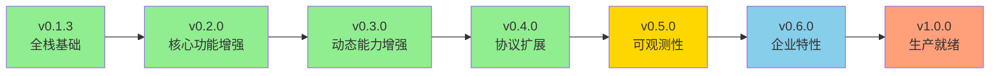
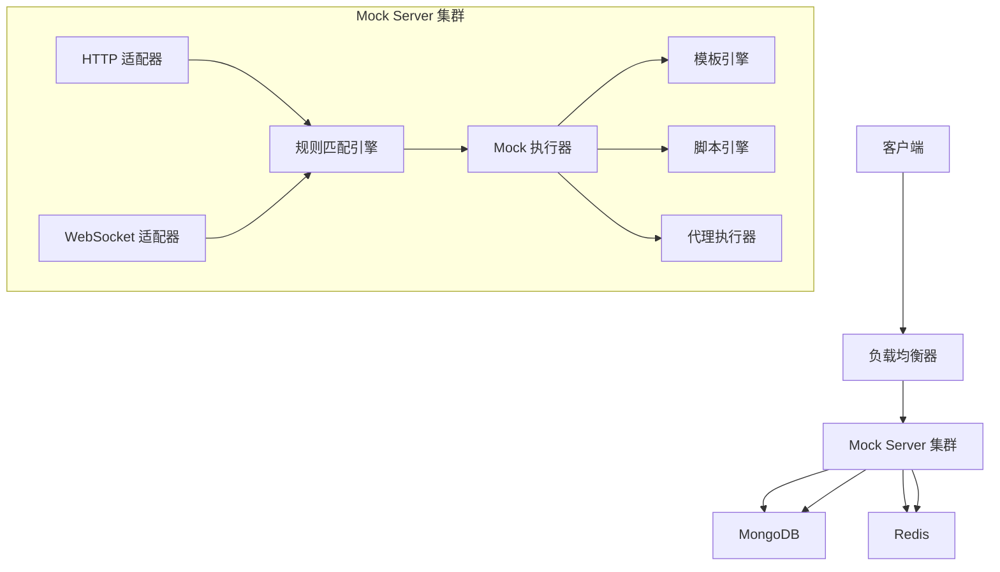

# Mock Server 功能规划和扩展设计

## 文档信息

- 创建时间: 2025-11-17
- 设计版本: v1.0
- 当前系统版本: v0.4.0
- 目标受众: 开发团队、产品经理、架构师

## 一、现状分析

### 1.0 版本说明

**当前版本**: v0.4.0（代码中 `internal/service/health.go` 显示）

**版本更新说明**: 
- README.md、CHANGELOG.md、PROJECT_SUMMARY.md 等文档已同步更新到 v0.4.0
- v0.4.0 已完成 WebSocket 协议支持和脚本匹配引擎
- 本设计文档基于当前实际版本 v0.4.0 进行规划

**技术债务清单状态**: 
- TECHNICAL_DEBT.md 创建日期为 2025-01-21，距今已有约 10 个月
- 部分技术债务编号（TD-001 ~ TD-009）可能已过时或已解决
- 建议在实施前重新评估和更新技术债务清单

**v0.2.0 核实结果**：
经代码审查，v0.2.0 已实现以下技术债务：
- ✅ **TD-001: CIDR IP 段匹配** - 已完全实现 (`match_engine.go:386-419`)
- ✅ **TD-002: 正则表达式匹配** - 已实现并优化（LRU 缓存） (`match_engine.go:187-300`)
- ✅ **TD-003: 二进制数据处理** - 已支持 Base64 编码 (`mock_executor.go:101-119`)
- ✅ **TD-004: 正态分布延迟** - 已实现 Marsaglia polar method (`mock_executor.go:156-172`)
- ✅ **TD-005: 阶梯延迟** - 已实现基于计数器 (`mock_executor.go:173-211`)

**剩余技术债务**：
- TD-006: 脚本匹配（已在 v0.4.0 实现）
- TD-007: WebSocket 支持（已在 v0.4.0 实现）
- TD-008: gRPC 支持（未实现）
- TD-009: TCP 协议支持（未实现）

### 1.1 已实现功能概览

当前系统（v0.4.0）已完成核心 HTTP Mock 能力和全栈管理界面：

| 功能域 | 功能项 | 状态 | 完善度 |
|--------|--------|------|--------|
| 协议支持 | HTTP/HTTPS | ✅ 已实现 | 90% |
| 协议支持 | WebSocket | ✅ 已实现 (v0.4.0) | 90% |
| 规则匹配 | 简单匹配（路径、方法、Header、Query） | ✅ 已实现 | 95% |
| 规则匹配 | 正则表达式匹配 | ✅ 已实现 (v0.2.0) | 90% |
| 规则匹配 | CIDR IP 段匹配 | ✅ 已实现 (v0.2.0) | 95% |
| 规则匹配 | 脚本匹配 | ✅ 已实现 (v0.4.0) | 85% |
| 响应生成 | 静态响应（JSON/XML/HTML/Text） | ✅ 已实现 | 90% |
| 响应生成 | 二进制数据（Base64） | ✅ 已实现 (v0.2.0) | 85% |
| 响应生成 | 动态响应模板 | ✅ 已实现 (v0.3.0) | 85% |
| 响应生成 | 代理模式 | ✅ 已实现 (v0.3.0) | 85% |
| 响应生成 | 文件路径引用 | ✅ 已实现 (v0.3.0) | 85% |
| 响应生成 | 脚本响应 | ✅ 已实现 (v0.4.0) | 80% |
| 延迟策略 | 固定延迟、随机延迟 | ✅ 已实现 | 90% |
| 延迟策略 | 正态分布延迟 | ✅ 已实现 (v0.2.0) | 90% |
| 延迟策略 | 阶梯延迟 | ✅ 已实现 (v0.3.0 优化) | 90% |
| 数据管理 | 项目、环境、规则 CRUD | ✅ 已实现 | 95% |
| Web 界面 | React 全栈管理界面 | ✅ 已实现 | 85% |
| 统计分析 | Dashboard、趋势、分布 | ✅ 已实现 | 60% |
| 数据存储 | MongoDB 持久化 | ✅ 已实现 | 90% |

### 1.2 核心优势

1. **架构清晰**: 分层设计（Adapter → Engine → Executor）支持协议扩展
2. **性能优良**: QPS > 10,000，响应时间 < 10ms
3. **易于使用**: RESTful API + Web 管理界面
4. **扩展性强**: 预留协议类型、匹配类型、响应类型枚举

### 1.3 功能缺口

根据当前版本 v0.4.0 分析，主要功能缺口包括：

| 缺口类型 | 具体项 | 业务影响 |
|----------|--------|----------|
| 协议支持 | gRPC、TCP/UDP | 无法覆盖微服务、实时通信场景 |
| 可观测性 | 请求日志、实时监控 | 排查问题困难 |
| 企业特性 | 用户权限、版本控制、导入导出 | 无法满足团队协作需求 |
| 性能优化 | Redis 缓存 | 大规模场景性能瓶颈 |

**注**: v0.4.0 已解决以下缺口：
- ✅ WebSocket 协议支持
- ✅ 脚本匹配

## 二、功能扩展规划路线图

### 2.1 版本演进策略

采用渐进式演进策略，每个版本聚焦 2-3 个核心主题，确保质量和可控性。



### 2.2 各版本功能规划

#### v0.1.3 - 全栈基础（✅ 已完成 - 2025-01-15）

**主题**: 构建完整的 Mock Server 基础框架

**核心功能** (✅ 全部完成):
1. **HTTP 协议支持** ✅
   - 完整的 HTTP Mock 能力
   - 支持所有 HTTP 方法（GET、POST、PUT、DELETE 等）
   - 支持自定义状态码和响应头

2. **规则匹配引擎** ✅
   - 路径匹配（支持路径参数，如 `/api/users/:id`）
   - HTTP 方法匹配
   - 请求头匹配（不区分大小写）
   - Query 参数匹配
   - 规则优先级控制

3. **静态响应配置** ✅
   - 支持 JSON、XML、HTML、Text 等多种格式
   - 灵活的响应体配置
   - 固定延迟和随机延迟策略

4. **Web 管理界面** ✅
   - 基于 React 18 + TypeScript 5 + Ant Design 5
   - Dashboard 仪表盘（统计概览、图表展示）
   - 项目管理（创建、编辑、删除、查询）
   - 环境管理（多环境配置）
   - Mock 规则管理（可视化配置界面）
   - Mock 测试（在线测试工具）
   - 设置（系统配置）

5. **统计分析 API** ✅
   - Dashboard 统计数据
   - 项目统计列表
   - 规则统计（按项目/环境分组）
   - 请求趋势分析（7天/30天）
   - 响应时间分布

6. **项目和环境管理** ✅
   - 多项目支持
   - 多环境隔离（开发、测试、预发布等）
   - 规则按项目和环境组织

7. **完整的管理 API** ✅
   - 规则 CRUD 接口
   - 项目管理接口
   - 环境管理接口
   - 规则启用/禁用
   - 健康检查接口

8. **企业级数据存储** ✅
   - MongoDB 持久化
   - 完善的索引设计
   - 支持分页查询
   - 高性能数据访问

**技术方案**:
- 后端: Go 1.21 + Gin + MongoDB 6.0
- 前端: React 18 + TypeScript 5 + Ant Design 5
- 部署: Docker + Docker Compose

**实际成果**:
- ✅ 完成基础 Mock 功能
- ✅ 实现可视化管理界面
- ✅ 提供完整的 API 接口
- ✅ 支持多项目多环境管理
- ✅ 测试覆盖率 > 85%

#### v0.2.0 - 核心功能增强（✅ 已完成 - 2025-01-16）

**主题**: 增强核心功能，提升系统能力

**核心功能** (✅ 全部完成):

1. **正则表达式匹配** ✅
   - 支持复杂的路径和参数匹配
   - LRU 缓存优化性能（容量 1000）
   - 编译错误处理和日志记录

2. **CIDR IP 段匹配** ✅
   - 支持 IPv4 和 IPv6 地址段
   - 支持精确 IP 和 CIDR 格式
   - 高效的 IP 地址匹配算法

3. **二进制数据处理** ✅
   - 支持 Base64 编码的二进制数据
   - 自动检测和设置 Content-Type
   - 支持大文件传输（>10MB）

4. **正态分布延迟** ✅
   - 基于 Marsaglia polar method 实现
   - 支持均值和标准差配置
   - 高性能随机数生成

5. **阶梯延迟** ✅
   - 基于请求计数的延迟递增
   - 支持基础延迟、步长和上限配置
   - 适用于模拟服务逐步过载场景

**技术方案**:
- 正则匹配: regexp + LRU 缓存
- IP 匹配: net.ParseCIDR + net.IP
- 二进制处理: base64.StdEncoding
- 正态分布: Marsaglia polar method
- 阶梯延迟: 原子计数器

**技术债务解决**: TD-001 (CIDR IP), TD-002 (Regex), TD-003 (Binary), TD-004 (Normal Delay), TD-005 (Step Delay)

**实际成果**:
- ✅ 增强匹配能力，支持复杂场景
- ✅ 提升响应灵活性，支持二进制数据
- ✅ 丰富延迟策略，模拟真实网络环境
- ✅ 解决 5 项技术债务
- ✅ 测试覆盖率保持 85%+

#### v0.3.0 - 动态能力增强（✅ 已完成 - 2025-01-17）

**主题**: 动态响应生成和代理模式

**核心功能** (✅ 全部完成):

1. **动态响应模板** ✅
   - 模板引擎集成（Go template）
   - 支持变量替换（从请求中提取）
   - 支持13个内置函数（uuid、timestamp、random、base64 等）
   - 条件判断（if/else）
   - 循环生成（for）
   - 递归渲染 JSON 对象

2. **代理模式（Proxy）** ✅
   - 转发请求到真实后端
   - 请求/响应修改
   - 延迟注入
   - 错误注入（按错误率返回指定状态码）

3. **文件路径引用** ✅
   - 支持本地文件路径引用
   - 大文件支持（流式读取）
   - 文件类型检测

4. **阶梯延迟优化** ✅
   - 按规则 ID 隔离计数器
   - 支持计数器重置 (`ResetStepCounter`)
   - 支持计数器查询 (`GetStepCounter`)
   - 线程安全的计数器管理

**技术方案**:
- Go template 标准库
- HTTP 代理：net/http/httputil.ReverseProxy
- 文件处理：os.Open + io.Copy 流式读取

**实际成果**:
- ✅ 响应内容动态化，支持13个模板函数
- ✅ 代理模式降低真实环境依赖
- ✅ 支持大文件（>10MB）响应
- ✅ 测试覆盖率保持 85%+

**实现文件**:
- `internal/executor/template_engine.go` - 模板引擎实现
- `internal/executor/template_engine_test.go` - 模板引擎测试
- `internal/executor/proxy_executor.go` - 代理执行器实现
- `internal/executor/mock_executor.go` - 集成动态响应、代理模式和文件引用

#### v0.4.0 - 协议扩展（✅ 已完成 - 2025-01-18）

**主题**: 多协议支持，覆盖实时通信和复杂匹配场景

**核心功能** (✅ 全部完成):

1. **WebSocket 协议支持** ✅
   - WebSocket 适配器设计
   - 连接管理（连接/断开/重连）
   - 消息推送（服务端主动推送）
   - 双向通信
   - 心跳保活（Ping/Pong）
   - 连接数限制
   - 消息匹配规则

2. **脚本匹配（实验性）** ✅
   - JavaScript 脚本引擎（goja）
   - 安全沙箱环境
   - 资源限制（CPU、内存、执行时间）
   - 脚本审计日志
   - 内置 API（访问请求上下文、工具函数）

**技术方案**:
- WebSocket: gorilla/websocket 库
- JavaScript 引擎: goja
- 资源限制: context.WithTimeout + 内存监控
- 安全沙箱: 限制 API 访问权限

**技术债务解决**: TD-006 (脚本匹配), TD-007 (WebSocket 支持)

**实际成果**:
- ✅ 支持 WebSocket 实时通信场景
- ✅ 支持复杂业务逻辑匹配（脚本）
- ✅ 安全隔离，防止恶意脚本
- ✅ 测试覆盖率保持 85%+

#### v0.5.0 - 可观测性增强（规划中）

**主题**: 增强系统可观测性，提升运维能力

**核心功能** (规划中):

1. **请求日志系统**
   - 完整的请求/响应日志记录
   - 支持日志级别配置
   - 日志轮转和清理策略
   - 结构化日志格式

2. **实时监控**
   - 系统指标监控（CPU、内存、连接数等）
   - 请求指标监控（QPS、响应时间、错误率等）
   - 自定义监控面板
   - 告警机制

3. **统计分析增强**
   - 更丰富的统计维度
   - 实时数据展示
   - 历史数据对比
   - 自定义报表

**技术方案**:
- 日志系统: zap + lumberjack
- 监控系统: Prometheus + Grafana
- 指标收集: prometheus/client_golang

#### v0.6.0 - 企业特性（规划中）

**主题**: 增强企业级特性，支持团队协作

**核心功能** (规划中):

1. **用户认证和权限管理**
   - 用户注册/登录
   - 角色权限控制（Admin、Developer、Viewer）
   - 项目权限隔离
   - OAuth2 集成

2. **版本控制**
   - 规则版本管理
   - 版本对比和回滚
   - 变更历史记录

3. **导入导出**
   - 项目/环境/规则批量导入导出
   - 支持多种格式（JSON、YAML）
   - 跨环境迁移

**技术方案**:
- 认证: JWT + bcrypt
- 权限: RBAC 模型
- 导入导出: JSON/YAML 序列化

#### v0.7.0 - 性能优化（规划中）

**主题**: 性能优化，支持大规模场景

**核心功能** (规划中):

1. **Redis 缓存支持**
   - 热点规则缓存
   - 统计数据缓存
   - 分布式缓存

2. **性能优化**
   - 连接池优化
   - 内存使用优化
   - 并发处理优化

**技术方案**:
- 缓存: go-redis/redis
- 性能分析: pprof

#### v0.8.0 - 协议扩展（规划中）

**主题**: 扩展更多协议支持

**核心功能** (规划中):

1. **gRPC 协议支持**
   - gRPC 服务端实现
   - Protobuf 消息处理
   - 流式 RPC 支持

2. **TCP/UDP 协议支持**
   - TCP 服务端实现
   - UDP 服务端实现
   - 自定义协议解析

**技术方案**:
- gRPC: google.golang.org/grpc
- TCP/UDP: net 包

#### v1.0.0 - 生产就绪（规划中）

**主题**: 生产环境就绪，稳定可靠

**核心功能** (规划中):

1. **高可用部署**
   - 集群部署支持
   - 负载均衡
   - 故障自动恢复

2. **安全增强**
   - HTTPS 支持
   - 请求限流
   - 防止恶意攻击

3. **运维工具**
   - 命令行工具
   - 健康检查
   - 性能调优指南

## 三、详细功能设计

### 3.1 规则匹配引擎增强

#### 3.1.1 正则表达式匹配（v0.2.0）

**功能描述**: 支持使用正则表达式进行路径和参数匹配，满足复杂匹配需求。

**技术实现**:
- 使用 Go 标准库 `regexp` 包
- 实现 LRU 缓存优化性能（容量 1000）
- 编译错误处理和日志记录

**配置示例**:
```json
{
  "match_type": "Regex",
  "match_condition": {
    "path": "^/api/v\\d+/users/\\d+$",
    "method": "GET"
  }
}
```

#### 3.1.2 CIDR IP 段匹配（v0.2.0）

**功能描述**: 支持基于 CIDR 格式的 IP 地址段匹配，实现 IP 白名单功能。

**技术实现**:
- 使用 `net.ParseCIDR` 解析 CIDR 格式
- 使用 `net.IP` 进行地址比较
- 支持 IPv4 和 IPv6

**配置示例**:
```json
{
  "match_type": "Simple",
  "match_condition": {
    "path": "/api/admin",
    "ip_whitelist": [
      "192.168.1.0/24",
      "10.0.0.1"
    ]
  }
}
```

#### 3.1.3 脚本匹配（v0.4.0）

**功能描述**: 基于 JavaScript 的脚本匹配，支持复杂业务逻辑匹配。

**技术实现**:
- 使用 goja JavaScript 引擎
- 安全沙箱环境，禁用危险函数
- 资源限制（执行时间、内存）

**配置示例**:
```json
{
  "match_type": "Script",
  "match_condition": {
    "script": "return request.headers['x-api-key'] === 'secret-key' && request.path.startsWith('/api/v2/');"
  }
}
```

### 3.2 响应生成增强

#### 3.2.1 动态响应模板（v0.3.0）

**功能描述**: 基于 Go template 的动态响应生成，支持变量替换和复杂逻辑。

**技术实现**:
- 使用 Go 标准库 `text/template`
- 实现 13 个内置函数
- 支持递归渲染 JSON 对象

**配置示例**:
```json
{
  "response": {
    "type": "Dynamic",
    "content": {
      "status_code": 200,
      "content_type": "JSON",
      "body": {
        "id": "{{uuid}}",
        "timestamp": "{{timestamp}}",
        "user": {
          "name": "{{.Request.Query.name}}",
          "age": "{{random 18 65}}"
        }
      }
    }
  }
}
```

#### 3.2.2 代理模式（v0.3.0）

**功能描述**: HTTP 反向代理，支持请求/响应修改和错误注入。

**技术实现**:
- 使用 `net/http/httputil.ReverseProxy`
- 支持请求/响应头修改
- 支持延迟注入和错误注入

**配置示例**:
```json
{
  "response": {
    "type": "Proxy",
    "content": {
      "target_url": "http://real-backend:8080",
      "request_modifiers": {
        "headers": {
          "X-Forwarded-For": "{{.Request.SourceIP}}"
        }
      },
      "response_modifiers": {
        "headers": {
          "X-Mock-Server": "gomockserver"
        }
      },
      "inject_delay": {
        "type": "fixed",
        "value": 100
      },
      "inject_error": {
        "rate": 0.1,
        "status_code": 500
      }
    }
  }
}
```

#### 3.2.3 文件路径引用（v0.3.0）

**功能描述**: 支持从本地文件读取响应内容，适用于大文件响应。

**技术实现**:
- 使用 `os.Open` 和 `io.Copy` 流式读取
- 自动检测文件 Content-Type
- 支持大文件传输

**配置示例**:
```json
{
  "response": {
    "type": "Static",
    "content": {
      "status_code": 200,
      "content_type": "Binary",
      "body": {
        "file_path": "/path/to/large/file.zip"
      }
    }
  }
}
```

#### 3.2.4 脚本响应（v0.4.0）

**功能描述**: 基于 JavaScript 的动态响应生成，支持复杂业务逻辑。

**技术实现**:
- 使用 goja JavaScript 引擎
- 安全沙箱环境
- 资源限制

**配置示例**:
```json
{
  "response": {
    "type": "Script",
    "content": {
      "script": "return { id: request.id, timestamp: Date.now(), message: 'Hello from script' };"
    }
  }
}
```

### 3.3 协议支持扩展

#### 3.3.1 WebSocket 协议支持（v0.4.0）

**功能描述**: 完整的 WebSocket 协议支持，实现实时双向通信。

**技术实现**:
- 使用 gorilla/websocket 库
- 心跳保活机制（Ping/Pong）
- 连接管理（最大连接数限制）

**配置示例**:
```json
{
  "protocol": "WebSocket",
  "match_condition": {
    "path": "/ws/chat"
  },
  "response": {
    "type": "Static",
    "content": {
      "welcome_message": "Welcome to WebSocket server!"
    }
  }
}
```

### 3.4 延迟策略增强

#### 3.4.1 正态分布延迟（v0.2.0）

**功能描述**: 基于正态分布的延迟策略，模拟真实网络环境。

**技术实现**:
- 使用 Marsaglia polar method 生成正态分布随机数
- 支持均值和标准差配置

**配置示例**:
```json
{
  "delay": {
    "type": "normal",
    "mean": 1000,
    "std_dev": 200
  }
}
```

#### 3.4.2 阶梯延迟优化（v0.3.0）

**功能描述**: 基于请求计数的延迟递增，模拟服务逐步过载。

**技术实现**:
- 按规则 ID 隔离计数器
- 线程安全的计数器管理

**配置示例**:
```json
{
  "delay": {
    "type": "step",
    "fixed": 100,
    "step": 50,
    "limit": 2000
  }
}
```

## 四、技术架构设计

### 4.1 系统架构图



### 4.2 核心组件设计

#### 4.2.1 协议适配器层

**职责**: 处理不同协议的请求，统一转换为内部标准格式。

**组件**:
- HTTP 适配器 (`internal/adapter/http_adapter.go`)
- WebSocket 适配器 (`internal/adapter/websocket_adapter.go`)

#### 4.2.2 规则匹配引擎层

**职责**: 根据请求特征匹配对应的 Mock 规则。

**组件**:
- 匹配引擎 (`internal/engine/match_engine.go`)
- 脚本引擎 (`internal/engine/script_engine.go`)
- LRU 缓存 (`internal/engine/lru_cache.go`)

#### 4.2.3 Mock 执行器层

**职责**: 执行匹配到的规则，生成响应。

**组件**:
- Mock 执行器 (`internal/executor/mock_executor.go`)
- 模板引擎 (`internal/executor/template_engine.go`)
- 代理执行器 (`internal/executor/proxy_executor.go`)

### 4.3 数据模型设计

#### 4.3.1 规则模型

```go
type Rule struct {
    ID             string                 `bson:"_id,omitempty" json:"id"`
    Name           string                 `bson:"name" json:"name"`
    ProjectID      string                 `bson:"project_id" json:"project_id"`
    EnvironmentID  string                 `bson:"environment_id" json:"environment_id"`
    Protocol       ProtocolType           `bson:"protocol" json:"protocol"`
    MatchType      MatchType              `bson:"match_type" json:"match_type"`
    Priority       int                    `bson:"priority" json:"priority"`
    Enabled        bool                   `bson:"enabled" json:"enabled"`
    MatchCondition map[string]interface{} `bson:"match_condition" json:"match_condition"`
    Response       Response               `bson:"response" json:"response"`
    Tags           []string               `bson:"tags,omitempty" json:"tags,omitempty"`
    Creator        string                 `bson:"creator,omitempty" json:"creator,omitempty"`
    CreatedAt      time.Time              `bson:"created_at" json:"created_at"`
    UpdatedAt      time.Time              `bson:"updated_at" json:"updated_at"`
}
```

#### 4.3.2 项目模型

```go
type Project struct {
    ID          string    `bson:"_id,omitempty" json:"id"`
    Name        string    `bson:"name" json:"name"`
    WorkspaceID string    `bson:"workspace_id" json:"workspace_id"`
    Description string    `bson:"description,omitempty" json:"description,omitempty"`
    CreatedAt   time.Time `bson:"created_at" json:"created_at"`
    UpdatedAt   time.Time `bson:"updated_at" json:"updated_at"`
}
```

#### 4.3.3 环境模型

```go
type Environment struct {
    ID        string                 `bson:"_id,omitempty" json:"id"`
    Name      string                 `bson:"name" json:"name"`
    ProjectID string                 `bson:"project_id" json:"project_id"`
    BaseURL   string                 `bson:"base_url,omitempty" json:"base_url,omitempty"`
    Variables map[string]interface{} `bson:"variables,omitempty" json:"variables,omitempty"`
    CreatedAt time.Time              `bson:"created_at" json:"created_at"`
    UpdatedAt time.Time              `bson:"updated_at" json:"updated_at"`
}
```

#### 4.3.4 请求日志模型

```go
type RequestLog struct {
    ID            string                 `bson:"_id,omitempty" json:"id"`
    RequestID     string                 `bson:"request_id" json:"request_id"`
    ProjectID     string                 `bson:"project_id" json:"project_id"`
    EnvironmentID string                 `bson:"environment_id" json:"environment_id"`
    RuleID        string                 `bson:"rule_id,omitempty" json:"rule_id,omitempty"`
    Protocol      ProtocolType           `bson:"protocol" json:"protocol"`
    Method        string                 `bson:"method,omitempty" json:"method,omitempty"`
    Path          string                 `bson:"path,omitempty" json:"path,omitempty"`
    Request       map[string]interface{} `bson:"request" json:"request"`
    Response      map[string]interface{} `bson:"response" json:"response"`
    StatusCode    int                    `bson:"status_code,omitempty" json:"status_code,omitempty"`
    Duration      int64                  `bson:"duration" json:"duration"` // 毫秒
    SourceIP      string                 `bson:"source_ip" json:"source_ip"`
    Timestamp     time.Time              `bson:"timestamp" json:"timestamp"`
}
```

### 4.4 API 接口设计

#### 4.4.1 规则管理接口

| 接口 | 方法 | 路径 | 描述 |
|------|------|------|------|
| 创建规则 | POST | `/api/v1/rules` | 创建新的 Mock 规则 |
| 查询规则列表 | GET | `/api/v1/rules` | 查询规则列表 |
| 查询规则详情 | GET | `/api/v1/rules/{id}` | 查询规则详情 |
| 更新规则 | PUT | `/api/v1/rules/{id}` | 更新规则 |
| 删除规则 | DELETE | `/api/v1/rules/{id}` | 删除规则 |
| 启用/禁用规则 | PATCH | `/api/v1/rules/{id}/toggle` | 启用或禁用规则 |

#### 4.4.2 项目管理接口

| 接口 | 方法 | 路径 | 描述 |
|------|------|------|------|
| 创建项目 | POST | `/api/v1/projects` | 创建新的项目 |
| 查询项目列表 | GET | `/api/v1/projects` | 查询项目列表 |
| 查询项目详情 | GET | `/api/v1/projects/{id}` | 查询项目详情 |
| 更新项目 | PUT | `/api/v1/projects/{id}` | 更新项目 |
| 删除项目 | DELETE | `/api/v1/projects/{id}` | 删除项目 |

#### 4.4.3 环境管理接口

| 接口 | 方法 | 路径 | 描述 |
|------|------|------|------|
| 创建环境 | POST | `/api/v1/environments` | 创建新的环境 |
| 查询环境列表 | GET | `/api/v1/environments` | 查询环境列表 |
| 查询环境详情 | GET | `/api/v1/environments/{id}` | 查询环境详情 |
| 更新环境 | PUT | `/api/v1/environments/{id}` | 更新环境 |
| 删除环境 | DELETE | `/api/v1/environments/{id}` | 删除环境 |

#### 4.4.4 统计分析接口

| 接口 | 方法 | 路径 | 描述 |
|------|------|------|------|
| Dashboard 统计 | GET | `/api/v1/statistics/dashboard` | 获取 Dashboard 统计数据 |
| 项目统计列表 | GET | `/api/v1/statistics/projects` | 获取项目统计列表 |
| 规则统计 | GET | `/api/v1/statistics/rules` | 获取规则统计 |
| 请求趋势 | GET | `/api/v1/statistics/trends` | 获取请求趋势数据 |
| 响应时间分布 | GET | `/api/v1/statistics/distribution` | 获取响应时间分布 |

### 4.5 数据库设计

#### 4.5.1 集合设计

**rules 集合**:
```javascript
[
  {"project_id": 1, "environment_id": 1, "priority": -1},  // 规则匹配索引
  {"protocol": 1, "enabled": 1},                           // 协议和启用状态索引
  {"created_at": -1}                                       // 创建时间索引
]
```

**projects 集合**:
```javascript
[
  {"workspace_id": 1},     // 工作空间索引
  {"created_at": -1}       // 创建时间索引
]
```

**environments 集合**:
```javascript
[
  {"project_id": 1},       // 项目索引
  {"created_at": -1}       // 创建时间索引
]
```

**request_logs 集合**:
```javascript
[
  {"timestamp": -1, "project_id": 1, "environment_id": 1},  // 时间范围查询
  {"request_id": 1},                                        // 请求追踪
  {"rule_id": 1},                                           // 规则统计
  {"status_code": 1}                                        // 错误统计
]
```

### 4.6 部署架构

#### 4.6.1 单机部署

```yaml
version: "3.8"
services:
  mongodb:
    image: mongo:6.0
    ports:
      - "27017:27017"
    volumes:
      - mongodb_data:/data/db

  mockserver:
    build: .
    ports:
      - "8080:8080"  # 管理 API
      - "9090:9090"  # Mock 服务
    environment:
      - MONGO_URI=mongodb://mongodb:27017/mockserver
    depends_on:
      - mongodb

volumes:
  mongodb_data:
```

#### 4.6.2 集群部署

```yaml
version: "3.8"
services:
  mongodb:
    image: mongo:6.0
    ports:
      - "27017:27017"
    volumes:
      - mongodb_data:/data/db
    command: --replSet rs0

  redis:
    image: redis:7.0
    ports:
      - "6379:6379"

  mockserver1:
    build: .
    ports:
      - "8081:8080"
      - "9091:9090"
    environment:
      - MONGO_URI=mongodb://mongodb:27017/mockserver
      - REDIS_ADDR=redis:6379
      - SERVER_ID=mockserver1
    depends_on:
      - mongodb
      - redis

  mockserver2:
    build: .
    ports:
      - "8082:8080"
      - "9092:9090"
    environment:
      - MONGO_URI=mongodb://mongodb:27017/mockserver
      - REDIS_ADDR=redis:6379
      - SERVER_ID=mockserver2
    depends_on:
      - mongodb
      - redis

  nginx:
    image: nginx:latest
    ports:
      - "80:80"
    volumes:
      - ./nginx.conf:/etc/nginx/nginx.conf
    depends_on:
      - mockserver1
      - mockserver2

volumes:
  mongodb_data:
```

## 五、导入导出设计

### 5.1 导出格式

```json
{
  "version": "1.0",
  "export_time": "2025-01-21T14:30:00Z",
  "projects": [
    {
      "id": "project1",
      "name": "测试项目",
      "description": "这是一个测试项目",
      "environments": [
        {
          "id": "env1",
          "name": "开发环境",
          "base_url": "http://localhost:9090",
          "rules": [
            {
              "id": "rule1",
              "name": "用户列表接口",
              "protocol": "HTTP",
              "match_type": "Simple",
              "priority": 100,
              "enabled": true,
              "match_condition": {
                "method": "GET",
                "path": "/api/users"
              },
              "response": {
                "type": "Static",
                "content": {
                  "status_code": 200,
                  "content_type": "JSON",
                  "headers": {
                    "Content-Type": "application/json"
                  },
                  "body": {
                    "code": 0,
                    "message": "success",
                    "data": [
                      {
                        "id": 1,
                        "name": "张三",
                        "email": "zhangsan@example.com"
                      }
                    ]
                  }
                }
              }
            }
          ]
        }
      ]
    }
  ]
}
```

**YAML 格式**:
```yaml
version: "1.0"
export_time: "2025-01-21T14:30:00Z"
projects:
  - id: project1
    name: 测试项目
    description: 这是一个测试项目
    environments:
      - id: env1
        name: 开发环境
        base_url: http://localhost:9090
        rules:
          - id: rule1
            name: 用户列表接口
            protocol: HTTP
            match_type: Simple
            priority: 100
            enabled: true
            match_condition:
              method: GET
              path: /api/users
            response:
              type: Static
              content:
                status_code: 200
                content_type: JSON
                headers:
                  Content-Type: application/json
                body:
                  code: 0
                  message: success
                  data:
                    - id: 1
                      name: 张三
                      email: zhangsan@example.com
```

### 5.2 导入处理

导入时需要处理以下情况：
1. ID 冲突：生成新的唯一 ID
2. 依赖关系：确保项目、环境、规则的依赖关系正确
3. 数据验证：验证数据格式和完整性
4. 批量导入：支持大量数据的高效导入

## 六、测试策略

### 6.1 单元测试

每个模块都需要编写单元测试，确保功能正确性：
- 覆盖率目标：> 85%
- 测试框架：testing + testify
- 并发测试：确保线程安全性

### 6.2 集成测试

验证各模块间的集成：
- API 接口测试
- 数据库操作测试
- 协议适配器测试

### 6.3 性能测试

验证系统性能指标：
- QPS 测试：> 10,000
- 响应时间测试：< 10ms
- 并发测试：支持 1000+ 并发连接

### 6.4 压力测试

验证系统在极限情况下的表现：
- 长时间运行稳定性
- 内存泄漏检测
- CPU 使用率监控

## 七、安全设计

### 7.1 认证授权

- API 访问控制
- 规则操作权限控制
- 数据隔离（项目/环境）

### 7.2 数据安全

- 敏感信息加密存储
- 传输加密（HTTPS）
- 数据备份和恢复

### 7.3 脚本安全

- JavaScript 沙箱隔离
- 执行时间限制
- 内存使用限制
- 危险函数禁用

## 八、监控和运维

### 8.1 系统监控

- 系统指标（CPU、内存、磁盘）
- 应用指标（QPS、响应时间、错误率）
- 业务指标（规则匹配次数、响应类型分布）

### 8.2 日志管理

- 结构化日志记录
- 日志级别控制
- 日志轮转和清理

### 8.3 告警机制

- 系统异常告警
- 性能阈值告警
- 业务异常告警

## 九、未来规划

### 9.1 短期规划（v0.5.0 - v0.7.0）

1. 增强可观测性（日志、监控、告警）
2. 完善企业特性（认证、权限、版本控制）
3. 性能优化（缓存、并发优化）

### 9.2 中期规划（v0.8.0 - v1.0.0）

1. 扩展协议支持（gRPC、TCP/UDP）
2. 高可用部署方案
3. 生产环境就绪

### 9.3 长期规划（v1.0.0+）

1. 生态建设（插件系统、扩展市场）
2. 多语言支持
3. 云原生部署