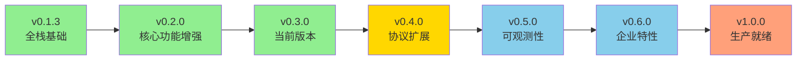
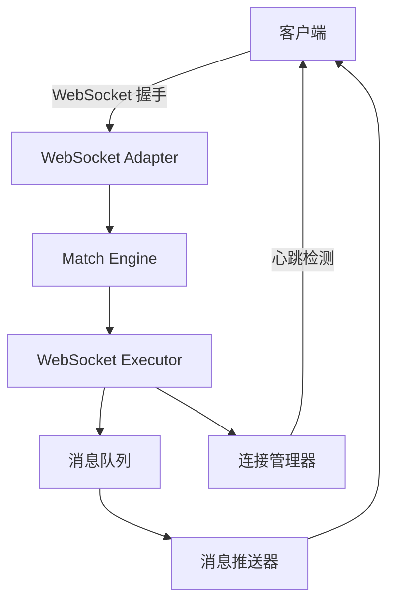
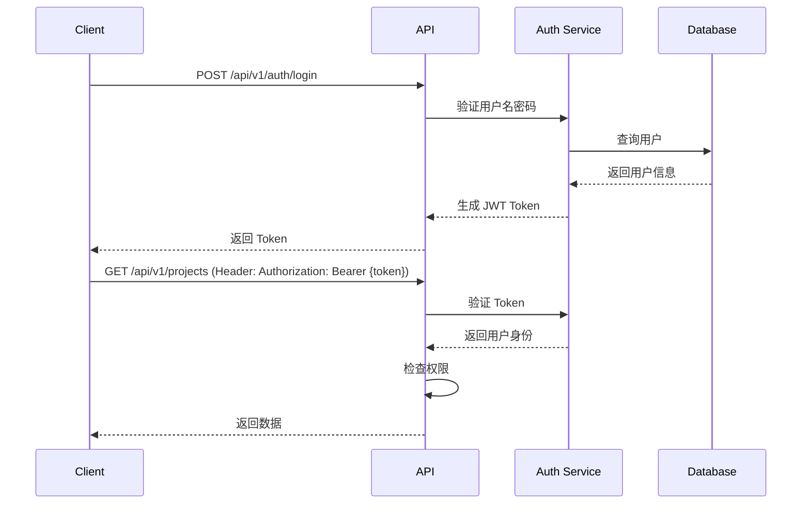
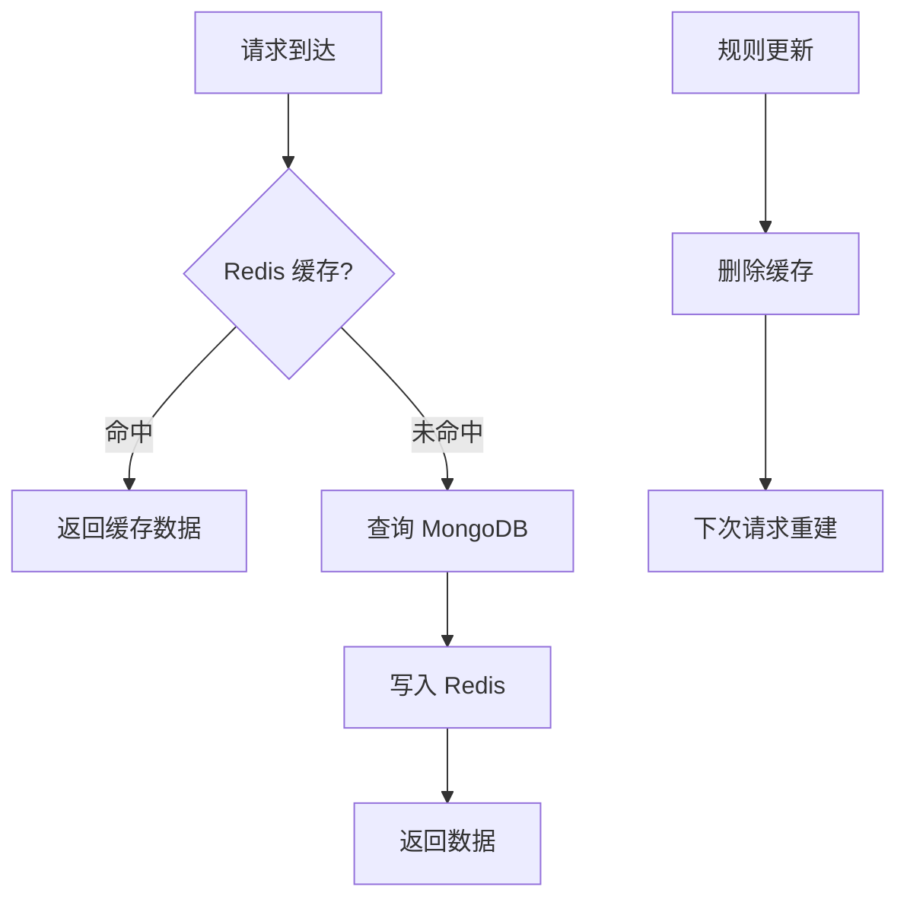
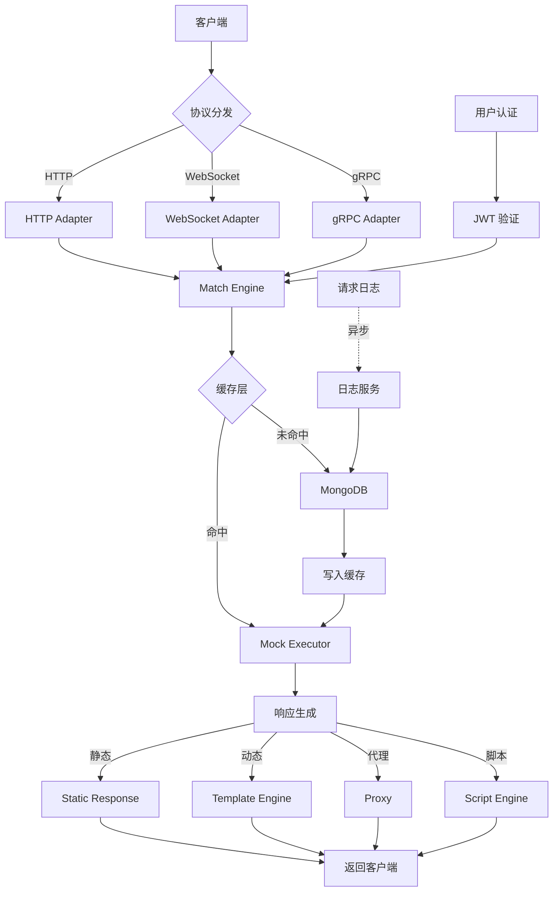

# Mock Server 功能规划和扩展设计

## 文档信息

- 创建时间: 2025-11-17
- 设计版本: v1.0
- 当前系统版本: v0.3.0
- 目标受众: 开发团队、产品经理、架构师

## 一、现状分析

### 1.0 版本说明

**当前版本**: v0.3.0（代码中 `internal/service/health.go` 显示）

**版本更新说明**: 
- README.md、CHANGELOG.md、PROJECT_SUMMARY.md 等文档已同步更新到 v0.3.0
- v0.3.0 已完成动态响应模板、代理模式、文件路径引用、阶梯延迟优化
- 本设计文档基于当前实际版本 v0.3.0 进行规划

**技术债务清单状态**: 
- TECHNICAL_DEBT.md 创建日期为 2025-01-21，距今已有约 10 个月
- 部分技术债务编号（TD-001 ~ TD-009）可能已过时或已解决
- 建议在实施前重新评估和更新技术债务清单

**v0.2.0 核实结果**：
经代码审查，v0.2.0 已实现以下技术债务：
- ✅ **TD-001: CIDR IP 段匹配** - 已完全实现 (`match_engine.go:386-419`)
- ✅ **TD-002: 正则表达式匹配** - 已实现并优化（LRU 缓存） (`match_engine.go:187-300`)
- ✅ **TD-003: 二进制数据处理** - 已支持 Base64 编码 (`mock_executor.go:101-119`)
- ✅ **TD-004: 正态分布延迟** - 已实现 Marsaglia polar method (`mock_executor.go:156-172`)
- ✅ **TD-005: 阶梯延迟** - 已实现基于计数器 (`mock_executor.go:173-211`)

**剩余技术债务**：
- TD-006: 脚本匹配（未实现）
- TD-007: WebSocket 支持（未实现）
- TD-008: gRPC 支持（未实现）
- TD-009: TCP 协议支持（未实现）

### 1.1 已实现功能概览

当前系统（v0.2.0）已完成核心 HTTP Mock 能力和全栈管理界面：

| 功能域 | 功能项 | 状态 | 完善度 |
|--------|--------|------|--------|
| 协议支持 | HTTP/HTTPS | ✅ 已实现 | 90% |
| 规则匹配 | 简单匹配（路径、方法、Header、Query） | ✅ 已实现 | 95% |
| 规则匹配 | 正则表达式匹配 | ✅ 已实现 (v0.2.0) | 90% |
| 规则匹配 | CIDR IP 段匹配 | ✅ 已实现 (v0.2.0) | 95% |
| 响应生成 | 静态响应（JSON/XML/HTML/Text） | ✅ 已实现 | 90% |
| 响应生成 | 二进制数据（Base64） | ✅ 已实现 (v0.2.0) | 85% |
| 响应生成 | 动态响应模板 | ✅ 已实现 (v0.3.0) | 85% |
| 响应生成 | 代理模式 | ✅ 已实现 (v0.3.0) | 85% |
| 响应生成 | 文件路径引用 | ✅ 已实现 (v0.3.0) | 85% |
| 延迟策略 | 固定延迟、随机延迟 | ✅ 已实现 | 90% |
| 延迟策略 | 正态分布延迟 | ✅ 已实现 (v0.2.0) | 90% |
| 延迟策略 | 阶梯延迟 | ✅ 已实现 (v0.3.0 优化) | 90% |
| 数据管理 | 项目、环境、规则 CRUD | ✅ 已实现 | 95% |
| Web 界面 | React 全栈管理界面 | ✅ 已实现 | 85% |
| 统计分析 | Dashboard、趋势、分布 | ✅ 已实现 | 60% |
| 数据存储 | MongoDB 持久化 | ✅ 已实现 | 90% |

### 1.2 核心优势

1. **架构清晰**: 分层设计（Adapter → Engine → Executor）支持协议扩展
2. **性能优良**: QPS > 10,000，响应时间 < 10ms
3. **易于使用**: RESTful API + Web 管理界面
4. **扩展性强**: 预留协议类型、匹配类型、响应类型枚举

### 1.3 功能缺口

根据当前版本 v0.2.0 分析，主要功能缺口包括：

| 缺口类型 | 具体项 | 业务影响 |
|----------|--------|----------|
| 协议支持 | WebSocket、gRPC、TCP/UDP | 无法覆盖微服务、实时通信场景 |
| 高级匹配 | 脚本匹配 | 无法实现复杂业务逻辑匹配 |
| 动态能力 | 模板引擎、代理模式 | 无法模拟真实后端逻辑 |
| 可观测性 | 请求日志、实时监控 | 排查问题困难 |
| 企业特性 | 用户权限、版本控制、导入导出 | 无法满足团队协作需求 |
| 性能优化 | Redis 缓存 | 大规模场景性能瓶颈 |

**注**: v0.2.0 已解决以下缺口：
- ✅ CIDR IP 段匹配
- ✅ 正则表达式匹配
- ✅ 二进制数据处理 (Base64)
- ✅ 正态分布延迟
- ✅ 阶梯延迟

## 二、功能扩展规划路线图

### 2.1 版本演进策略

采用渐进式演进策略，每个版本聚焦 2-3 个核心主题，确保质量和可控性。



### 2.2 各版本功能规划

#### v0.3.0 - 动态能力增强（✅ 已完成 - 2025-01-17）

**主题**: 动态响应生成和代理模式

**核心功能** (✅ 全部完成):

1. **动态响应模板** ✅
   - 模板引擎集成（Go template）
   - 支持变量替换（从请求中提取）
   - 支持13个内置函数（uuid、timestamp、random、base64 等）
   - 条件判断（if/else）
   - 循环生成（for）
   - 递归渲染 JSON 对象

2. **代理模式（Proxy）** ✅
   - 转发请求到真实后端
   - 请求/响应修改
   - 延迟注入
   - 错误注入（按错误率返回指定状态码）

3. **文件路径引用** ✅
   - 支持本地文件路径引用
   - 大文件支持（流式读取）
   - 文件类型检测

4. **阶梯延迟优化** ✅
   - 按规则 ID 隔离计数器
   - 支持计数器重置 (`ResetStepCounter`)
   - 支持计数器查询 (`GetStepCounter`)
   - 线程安全的计数器管理

**技术方案**:
- Go template 标准库
- HTTP 代理：net/http/httputil.ReverseProxy
- 文件处理：os.Open + io.Copy 流式读取

**实际成果**:
- ✅ 响应内容动态化，支持13个模板函数
- ✅ 代理模式降低真实环境依赖
- ✅ 支持大文件（>10MB）响应
- ✅ 测试覆盖率保持 85%+

**实现文件**:
- `internal/executor/template_engine.go` - 模板引擎实现
- `internal/executor/template_engine_test.go` - 模板引擎测试
- `internal/executor/proxy_executor.go` - 代理执行器实现
- `internal/executor/mock_executor.go` - 集成动态响应、代理模式和文件引用

---

#### v0.4.0 - 协议扩展（2026 年 1 月，开发周期 3 周）

**主题**: 多协议支持，覆盖实时通信和微服务场景

**核心功能**:

1. **WebSocket 协议支持**
   - WebSocket 连接管理
   - 消息推送（服务端主动推送）
   - 双向通信
   - 心跳保活
   - 连接数限制

2. **动态响应模板**
   - 模板引擎集成（如 Go template）
   - 支持变量替换（从请求中提取）
   - 支持函数调用（时间戳、随机数、UUID）
   - 条件判断（if/else）
   - 循环生成（for）

3. **代理模式（Proxy）**
   - 转发请求到真实后端
   - 请求/响应修改
   - 延迟注入
   - 错误注入（模拟超时、5xx 错误）

4. **脚本匹配（实验性）**
   - JavaScript 脚本引擎（goja）
   - 安全沙箱环境
   - 资源限制（CPU、内存、执行时间）
   - 脚本审计日志

**技术债务解决**: TD-006, TD-007

**预期成果**:
- 支持 WebSocket 实时通信场景
- 响应内容动态化率达到 80%
- 代理模式降低真实环境依赖

**安全风险**: 脚本匹配需要严格的沙箱隔离和资源限制

**注**: 技术债务编号基于 TECHNICAL_DEBT.md，如该文档已过时，建议先更新技术债务清单

---

#### v0.5.0 - 可观测性增强（2026 年 2 月，开发周期 2 周）

**主题**: 完善请求日志、监控和统计分析

**核心功能**:

1. **请求日志系统**
   - 完整请求/响应记录
   - 结构化日志存储（MongoDB）
   - 日志查询和过滤（按项目、环境、规则、时间范围）
   - 日志导出（JSON、CSV）
   - 日志保留策略（自动清理过期日志）

2. **实时监控**
   - 实时请求量统计（QPS）
   - 实时响应时间监控
   - 错误率监控（4xx/5xx）
   - 规则命中率统计
   - WebSocket 连接数监控

3. **统计分析增强**
   - 请求趋势分析（小时、天、周、月）
   - 响应时间分布（P50/P90/P95/P99）
   - 热点规则排行
   - 慢请求分析（超过阈值）
   - 异常流量告警

4. **监控数据可视化**
   - Dashboard 图表增强
   - 实时数据刷新
   - 自定义统计维度
   - 数据导出功能

**技术方案**:
- RequestLog 模型已定义，需实现日志记录逻辑
- 索引优化（timestamp、project_id、environment_id）
- 定时任务清理过期日志（默认保留 30 天）
- 时序数据聚合（按小时/天预聚合）

**预期成果**:
- 请求日志覆盖率 100%
- 问题排查时间缩短 70%
- 统计数据准确率 95%+

---

#### v0.6.0 - 企业特性（2026 年 3 月，开发周期 3 周）

**主题**: 团队协作和企业级功能

**核心功能**:

1. **用户认证和权限管理**
   - 用户注册/登录（JWT 认证）
   - 角色管理（Admin、Developer、Viewer）
   - 工作空间（Workspace）隔离
   - 项目成员管理
   - 操作权限控制（RBAC）

2. **规则版本控制**
   - 规则变更记录（Version 模型）
   - 版本历史查询
   - 版本对比（Diff）
   - 版本回滚
   - 变更审计日志

3. **配置导入导出**
   - 规则导出（JSON、YAML）
   - 批量导入
   - 模板市场（预定义规则模板）
   - 环境迁移（开发 → 测试 → 生产）

4. **团队协作**
   - 规则共享
   - 评论和标注
   - 变更通知（邮件、Webhook）
   - 操作审计

**数据模型**:
- User: 已定义，需实现认证逻辑
- Workspace: 已定义，需实现隔离逻辑
- Version: 已定义，需实现版本记录

**预期成果**:
- 支持多团队协作
- 变更可追溯性 100%
- 配置迁移效率提升 80%

---

#### v0.7.0 - 性能优化（2026 年 4 月，开发周期 2 周）

**主题**: 大规模场景性能优化

**核心功能**:

1. **Redis 缓存**
   - 规则缓存（减少数据库查询）
   - 统计数据缓存
   - 缓存失效策略（规则更新时）
   - 分布式缓存（支持集群）

2. **查询优化**
   - MongoDB 索引优化
   - 聚合查询优化
   - 分页性能优化
   - 慢查询分析

3. **并发优化**
   - 协程池管理
   - 连接池优化
   - 正则缓存（全局共享）
   - 内存复用

4. **负载均衡**
   - 多实例部署
   - 健康检查增强
   - 优雅关闭（Graceful Shutdown）

**性能目标**:
- QPS 提升至 50,000+
- P99 响应时间 < 20ms
- 支持规则数量 > 100,000
- 内存占用优化 30%

---

#### v0.8.0 - gRPC 协议支持（2026 年 5 月，开发周期 3 周）

**主题**: 微服务场景支持

**核心功能**:

1. **gRPC Mock 能力**
   - Proto 文件动态加载
   - gRPC 请求匹配
   - gRPC 响应生成
   - 流式 RPC 支持（Streaming）
   - 错误码模拟（gRPC Status Code）

2. **Proto 管理**
   - Proto 文件上传
   - Proto 解析和校验
   - Service 和 Method 自动发现
   - Proto 版本管理

3. **gRPC 高级特性**
   - Metadata 匹配
   - 拦截器（Interceptor）
   - 负载均衡测试
   - 超时和重试模拟

**技术方案**:
- 使用 grpc-go 库
- 动态 Proto 解析（protoreflect）
- gRPC Server 独立端口

**技术债务解决**: TD-008

**预期成果**:
- 支持微服务场景
- 覆盖 Unary RPC 和 Streaming RPC

**注**: 技术债务编号基于 TECHNICAL_DEBT.md，如该文档已过时，建议先更新技术债务清单

---

#### v1.0.0 - 生产就绪版（2026 年 6 月，开发周期 2 周）

**主题**: 稳定性、安全性、文档完善

**核心任务**:

1. **稳定性增强**
   - 全量测试覆盖率 > 85%
   - 压力测试和稳定性测试
   - 错误处理完善
   - 边界条件验证

2. **安全加固**
   - SQL/NoSQL 注入防护
   - XSS 防护
   - CSRF 防护
   - 速率限制（Rate Limiting）
   - API Key 认证

3. **文档完善**
   - API 文档（OpenAPI/Swagger）
   - 部署指南
   - 最佳实践
   - FAQ 和故障排查

4. **运维支持**
   - Prometheus 指标导出
   - 告警规则模板
   - Kubernetes 部署方案
   - CI/CD 流水线

**发布标准**:
- 测试覆盖率 > 85%
- 性能达标（QPS > 50,000）
- 安全漏洞扫描通过
- 文档完整度 > 90%

## 三、功能详细设计

### 3.1 动态响应模板（v0.3.0）

#### 功能目标

支持路径、Header、Query 参数的正则表达式匹配，提升规则灵活性。

#### 匹配策略

| 匹配对象 | 示例正则 | 匹配说明 |
|----------|----------|----------|
| 路径 | `/api/v\\d+/users/\\d+` | 匹配 /api/v1/users/123 |
| Header | `Bearer [A-Za-z0-9._-]+` | 匹配 JWT Token |
| Query | `[0-9]{10,13}` | 匹配时间戳 |

#### 性能优化

1. **正则缓存机制**
   - 全局缓存已编译的正则表达式
   - 使用 LRU 策略（最大 1000 条）
   - 缓存命中率监控

2. **安全防护**
   - 正则复杂度检测（嵌套层数、回溯次数）
   - 匹配超时（默认 100ms）
   - 超时后降级为简单匹配

#### 配置示例

```json
{
  "match_type": "Regex",
  "match_condition": {
    "path": "/api/v\\d+/users/(\\d+)",
    "headers": {
      "Authorization": "Bearer [A-Za-z0-9._-]+"
    },
    "query": {
      "timestamp": "[0-9]{10,13}"
    }
  }
}
```

#### 实现要点

1. 在 MatchEngine 中增加 matchRegex 函数
2. 引入 regexp 包，使用 sync.Map 存储缓存
3. 使用 context.WithTimeout 实现超时控制
4. 记录正则匹配性能指标

---

### 3.2 代理模式（v0.3.0）

#### 功能目标

支持将请求转发到真实后端，并能修改请求/响应、注入延迟和错误。

#### 代理类型

| 代理类型 | 说明 | 适用场景 |
|----------|------|----------|
| 透明代理 | 直接转发，不修改 | 快速集成真实服务 |
| 修改代理 | 修改请求/响应 | 数据脱敏、字段增强 |
| 延迟代理 | 注入网络延迟 | 弱网测试 |
| 错误代理 | 模拟后端错误 | 容错测试 |

#### 配置示例

```json
{
  "response": {
    "type": "Proxy",
    "content": {
      "target_url": "http://real-backend.com",
      "modify_request": {
        "headers": {
          "X-Mock-Mode": "proxy"
        }
      },
      "modify_response": {
        "headers": {
          "X-Proxied-By": "MockServer"
        },
        "body_replace": {
          "sensitive_field": "***"
        }
      },
      "inject_delay": 100,
      "error_rate": 0.1
    }
  }
}
```

#### 实现要点

1. 使用 `net/http/httputil.ReverseProxy`
2. 请求/响应修改器
3. 延迟注入逻辑
4. 错误率控制
5. 超时处理

---

### 3.3 WebSocket 协议支持（v0.4.0）

#### 架构设计



#### 核心功能

1. **连接管理**
   - 连接建立和握手
   - 连接池管理（最大连接数限制）
   - 连接超时检测
   - 心跳保活（Ping/Pong）

2. **消息处理**
   - 接收客户端消息
   - 服务端主动推送
   - 消息序列化（JSON/Text/Binary）
   - 消息路由（按规则匹配）

3. **匹配规则**

| 匹配字段 | 说明 | 示例 |
|----------|------|------|
| path | WebSocket 路径 | /ws/chat |
| query | 查询参数 | ?room_id=123 |
| header | 升级请求头 | Origin, Sec-WebSocket-Protocol |
| message_pattern | 消息内容匹配 | {"type": "subscribe"} |

4. **响应配置**

| 响应类型 | 说明 | 配置示例 |
|----------|------|----------|
| Echo | 回显消息 | {"type": "echo"} |
| Static | 静态消息 | {"type": "static", "content": {...}} |
| Push | 定时推送 | {"type": "push", "interval": 5000, "content": {...}} |
| Script | 脚本生成 | {"type": "script", "script": "..."} |

#### 技术方案

1. **依赖库**: gorilla/websocket
2. **并发模型**: 每个连接一个 goroutine
3. **消息队列**: Channel（带缓冲）
4. **状态管理**: 连接状态机（Connecting → Connected → Closing → Closed）

#### 配置示例

```json
{
  "protocol": "WebSocket",
  "match_condition": {
    "path": "/ws/chat",
    "query": {
      "room_id": "123"
    }
  },
  "response": {
    "type": "Push",
    "content": {
      "interval": 5000,
      "messages": [
        {"type": "heartbeat", "timestamp": "{{.Timestamp}}"},
        {"type": "notification", "content": "New message"}
      ]
    }
  }
}
```

---

### 3.4 动态响应模板详细设计（v0.3.0 已设计）

#### 功能目标

支持从请求中提取数据，动态生成响应内容。

#### 模板语法

基于 Go template 语法，扩展自定义函数。

| 功能 | 语法 | 示例 |
|------|------|------|
| 变量引用 | `{{.FieldName}}` | `{{.Request.Path}}` |
| 条件判断 | `{{if .Condition}}...{{end}}` | `{{if eq .Method "POST"}}...{{end}}` |
| 循环 | `{{range .Items}}...{{end}}` | `{{range .Users}}{{.Name}}{{end}}` |
| 函数调用 | `{{funcName args}}` | `{{uuid}}`, `{{timestamp}}` |

#### 内置函数

| 函数名 | 说明 | 返回值 | 示例 |
|--------|------|--------|------|
| uuid | 生成 UUID | string | `{{uuid}}` → "123e4567-e89b-12d3-a456-426614174000" |
| timestamp | 当前时间戳 | int64 | `{{timestamp}}` → 1609459200 |
| now | 当前时间 | string | `{{now "2006-01-02"}}` → "2025-01-21" |
| random | 随机数 | int | `{{random 1 100}}` → 42 |
| randomString | 随机字符串 | string | `{{randomString 10}}` → "aB3dE5fG7h" |
| base64 | Base64 编码 | string | `{{base64 "hello"}}` → "aGVsbG8=" |

#### 上下文数据

模板可访问的数据上下文：

```go
{
  "Request": {
    "Method": "POST",
    "Path": "/api/users",
    "Headers": {"Content-Type": "application/json"},
    "Query": {"page": "1"},
    "Body": {"name": "张三"}
  },
  "Rule": {
    "ID": "rule_123",
    "Name": "用户创建",
    "Priority": 100
  },
  "Environment": {
    "Variables": {"base_url": "http://localhost:9090"}
  }
}
```

#### 配置示例

```json
{
  "response": {
    "type": "Dynamic",
    "content": {
      "status_code": 200,
      "body": {
        "request_id": "{{uuid}}",
        "timestamp": "{{timestamp}}",
        "user": {
          "name": "{{.Request.Body.name}}",
          "created_at": "{{now \"2006-01-02 15:04:05\"}}",
          "id": "{{random 1000 9999}}"
        },
        "echo_path": "{{.Request.Path}}"
      }
    }
  }
}
```

响应结果：
```json
{
  "request_id": "123e4567-e89b-12d3-a456-426614174000",
  "timestamp": 1609459200,
  "user": {
    "name": "张三",
    "created_at": "2025-01-21 14:30:00",
    "id": 5678
  },
  "echo_path": "/api/users"
}
```

---

### 3.4 请求日志系统（v0.5.0）

#### 数据模型

RequestLog 模型已定义（models.go），包含以下字段：

| 字段 | 类型 | 说明 | 索引 |
|------|------|------|------|
| request_id | string | 请求唯一标识 | 是 |
| project_id | string | 项目 ID | 是（复合） |
| environment_id | string | 环境 ID | 是（复合） |
| rule_id | string | 匹配的规则 ID | 是 |
| protocol | string | 协议类型 | 是 |
| method | string | HTTP 方法 | 否 |
| path | string | 请求路径 | 否 |
| request | object | 请求详情 | 否 |
| response | object | 响应详情 | 否 |
| status_code | int | 响应状态码 | 是 |
| duration | int64 | 处理时长（ms） | 是 |
| source_ip | string | 客户端 IP | 是 |
| timestamp | time | 请求时间 | 是（TTL） |

#### 索引设计

```javascript
[
  {"timestamp": -1, "project_id": 1, "environment_id": 1},  // 时间范围查询
  {"request_id": 1},                                        // 请求追踪
  {"rule_id": 1, "timestamp": -1},                          // 规则命中统计
  {"status_code": 1, "timestamp": -1},                      // 错误率统计
  {"timestamp": 1}, {expireAfterSeconds: 2592000}           // TTL 索引（30天）
]
```

#### 日志记录策略

1. **异步记录**
   - 使用 Channel 缓冲（容量 10,000）
   - 独立 goroutine 批量写入（每 100 条或 1 秒）
   - 避免阻塞主请求链路

2. **采样策略**（可选）
   - 正常请求采样率 10%
   - 错误请求全量记录
   - 慢请求全量记录（> 1s）

3. **数据脱敏**
   - 敏感 Header 脱敏（Authorization、Cookie）
   - 请求体大小限制（最大 10KB）
   - 二进制数据不记录

#### 查询功能

支持的查询维度：

| 查询类型 | 参数 | 示例 |
|----------|------|------|
| 时间范围 | start_time, end_time | 2025-01-21 00:00:00 ~ 2025-01-21 23:59:59 |
| 项目环境 | project_id, environment_id | project_123, env_456 |
| 规则 | rule_id | rule_789 |
| 状态码 | status_code, status_range | 200, 4xx, 5xx |
| 慢请求 | min_duration | 1000 (>1s) |
| IP | source_ip | 192.168.1.100 |

#### 日志保留策略

1. **默认保留期**: 30 天（MongoDB TTL 索引）
2. **可配置保留期**: 7 天 / 30 天 / 90 天
3. **手动清理**: 提供 API 清理指定时间范围日志
4. **归档**: 导出历史日志到对象存储（可选）

---

### 3.5 用户认证和权限管理（v0.6.0）

#### 认证方案

采用 JWT（JSON Web Token）无状态认证。



#### 角色和权限

| 角色 | 权限范围 | 操作权限 |
|------|----------|----------|
| Admin | 全局 | 创建/编辑/删除项目、环境、规则；管理用户；查看日志 |
| Developer | 指定项目 | 创建/编辑/删除规则；查看日志 |
| Viewer | 指定项目 | 仅查看规则、统计、日志 |

#### 权限矩阵

| 资源 | Admin | Developer | Viewer |
|------|-------|-----------|--------|
| 创建项目 | ✅ | ❌ | ❌ |
| 编辑项目 | ✅ | ❌ | ❌ |
| 删除项目 | ✅ | ❌ | ❌ |
| 创建规则 | ✅ | ✅ | ❌ |
| 编辑规则 | ✅ | ✅ | ❌ |
| 删除规则 | ✅ | ✅ | ❌ |
| 查看规则 | ✅ | ✅ | ✅ |
| 查看日志 | ✅ | ✅ | ✅ |
| 管理用户 | ✅ | ❌ | ❌ |

#### 工作空间隔离

1. **Workspace 模型**
   - 每个 Workspace 包含多个项目
   - 用户属于一个或多个 Workspace
   - Workspace 内成员共享项目

2. **数据隔离**
   - 项目绑定 workspace_id
   - 查询时自动过滤 workspace
   - 跨 Workspace 访问拒绝

#### API 鉴权

1. **公开接口**（无需认证）
   - POST /api/v1/auth/login
   - POST /api/v1/auth/register
   - GET /api/v1/system/health

2. **受保护接口**（需要 JWT Token）
   - 所有项目、环境、规则、日志接口
   - 中间件验证 Token 有效性
   - 提取用户身份和权限

3. **权限检查**
   - 在 Handler 层检查操作权限
   - 返回 403 Forbidden（权限不足）
   - 记录权限拒绝日志

---

### 3.6 规则版本控制（v0.6.0）

#### 版本记录

Version 模型已定义，记录每次规则变更。

| 字段 | 说明 | 示例 |
|------|------|------|
| rule_id | 规则 ID | rule_123 |
| version | 版本号 | v1, v2, v3 |
| change_type | 变更类型 | Create, Update, Delete |
| changes | 变更内容 | {"priority": {"old": 100, "new": 200}} |
| operator | 操作人 | user_456 |
| description | 变更说明 | "提高优先级" |
| created_at | 变更时间 | 2025-01-21 14:30:00 |

#### 版本策略

1. **自动版本**: 每次更新/删除规则自动记录
2. **版本号**: 递增整数（v1, v2, v3...）
3. **Diff 计算**: 对比新旧数据，记录差异
4. **保留期**: 默认保留所有版本（可配置最大版本数）

#### 版本对比

提供 API 对比两个版本的差异：

```
GET /api/v1/rules/{rule_id}/versions/compare?from=v1&to=v3
```

响应示例：
```json
{
  "rule_id": "rule_123",
  "from_version": "v1",
  "to_version": "v3",
  "changes": [
    {
      "field": "priority",
      "old_value": 100,
      "new_value": 200
    },
    {
      "field": "match_condition.path",
      "old_value": "/api/users",
      "new_value": "/api/v1/users"
    }
  ]
}
```

#### 版本回滚

支持一键回滚到历史版本：

```
POST /api/v1/rules/{rule_id}/rollback
{
  "version": "v2",
  "reason": "回滚到稳定版本"
}
```

回滚逻辑：
1. 读取目标版本的完整规则配置
2. 更新当前规则
3. 记录新的版本（change_type: Rollback）

---

### 3.7 配置导入导出（v0.6.0）

#### 导出格式

支持 JSON 和 YAML 两种格式：

**JSON 格式**:
```json
{
  "version": "1.0",
  "export_time": "2025-01-21T14:30:00Z",
  "projects": [
    {
      "name": "测试项目",
      "workspace_id": "default",
      "environments": [
        {
          "name": "开发环境",
          "base_url": "http://localhost:9090",
          "rules": [...]
        }
      ]
    }
  ]
}
```

**YAML 格式**:
```yaml
version: "1.0"
export_time: "2025-01-21T14:30:00Z"
projects:
  - name: "测试项目"
    workspace_id: "default"
    environments:
      - name: "开发环境"
        base_url: "http://localhost:9090"
        rules: [...]
```

#### 导出范围

| 导出类型 | API | 说明 |
|----------|-----|------|
| 单个规则 | GET /api/v1/rules/{id}/export | 导出单条规则 |
| 环境规则 | GET /api/v1/environments/{id}/export | 导出环境下所有规则 |
| 项目配置 | GET /api/v1/projects/{id}/export | 导出项目所有配置 |
| 全局配置 | GET /api/v1/export | 导出所有项目和规则 |

#### 导入策略

1. **冲突处理**
   - Skip: 跳过已存在的规则
   - Overwrite: 覆盖已存在的规则
   - Merge: 合并（保留 ID，更新字段）

2. **ID 映射**
   - 自动生成新 ID
   - 或保留原 ID（需检查唯一性）

3. **依赖检查**
   - 检查 project_id 和 environment_id 存在性
   - 不存在则自动创建

#### 模板市场（预留）

提供常用规则模板：

| 模板名称 | 说明 | 适用场景 |
|----------|------|----------|
| REST API CRUD | 标准 REST 接口 | 用户、商品管理 |
| 分页查询 | 带分页参数的列表接口 | 列表页 |
| 文件上传 | 模拟文件上传响应 | 图片上传 |
| OAuth 2.0 | 模拟 OAuth 认证流程 | 第三方登录 |
| WebSocket Chat | 聊天室消息推送 | 实时通信 |

---

### 3.8 Redis 缓存（v0.7.0）

#### 缓存策略

| 缓存类型 | 缓存键 | TTL | 失效时机 |
|----------|--------|-----|----------|
| 规则列表 | `rules:{project_id}:{env_id}` | 5 分钟 | 规则更新/删除 |
| 单个规则 | `rule:{rule_id}` | 10 分钟 | 规则更新/删除 |
| 统计数据 | `stats:dashboard` | 1 分钟 | 定时刷新 |
| 用户信息 | `user:{user_id}` | 30 分钟 | 用户更新 |

#### 缓存流程



#### 缓存失效

1. **主动失效**
   - 规则创建/更新/删除时删除相关缓存
   - 项目/环境删除时删除所有关联缓存

2. **被动失效**
   - TTL 过期自动失效
   - LRU 内存淘汰

3. **缓存预热**
   - 系统启动时加载热点规则
   - 定时任务刷新统计数据缓存

#### 分布式缓存

1. **Redis 集群**: 支持 Redis Cluster 模式
2. **缓存一致性**: 使用 Pub/Sub 通知缓存更新
3. **降级策略**: Redis 不可用时直接查询 MongoDB

## 四、非功能性需求

### 4.1 性能目标

| 指标 | v0.2.0 (当前) | v0.7.0 (目标) | 提升幅度 |
|------|---------------|---------------|----------|
| QPS | 10,000 | 50,000 | 5x |
| P99 响应时间 | 50ms | 20ms | 60% ↓ |
| 支持规则数 | 10,000 | 100,000 | 10x |
| 并发连接数 | 1,000 | 10,000 | 10x |

### 4.2 可用性目标

| 指标 | 目标值 | 保障措施 |
|------|--------|----------|
| 服务可用性 | 99.9% | 健康检查、自动重启、熔断降级 |
| 数据可靠性 | 99.99% | MongoDB 副本集、定期备份 |
| 故障恢复时间 | < 5 分钟 | 自动故障转移 |

### 4.3 扩展性目标

1. **水平扩展**: 支持多实例部署，通过负载均衡分发请求
2. **存储扩展**: MongoDB 分片支持（当数据量 > 1TB）
3. **协议扩展**: 协议适配器模式，新增协议无需改动核心逻辑

### 4.4 安全性要求

| 安全类别 | 措施 |
|----------|------|
| 认证 | JWT Token 认证 |
| 授权 | RBAC 权限控制 |
| 传输 | HTTPS/TLS 加密 |
| 数据 | 敏感字段加密存储 |
| 审计 | 操作日志记录 |
| 防护 | 速率限制、IP 黑名单、SQL 注入防护 |

### 4.5 可维护性要求

1. **代码质量**: 测试覆盖率 > 85%，代码评审通过率 100%
2. **文档完整性**: API 文档、架构文档、部署文档完整
3. **监控可观测**: Prometheus 指标、日志聚合、链路追踪
4. **快速定位**: 完整的请求日志、错误栈追踪

## 五、技术方案选型

### 5.1 新增技术栈

| 组件 | 技术选型 | 用途 | 引入版本 |
|------|----------|------|----------|
| WebSocket | gorilla/websocket | WebSocket 协议支持 | v0.4.0 |
| 模板引擎 | Go template | 动态响应生成 | v0.4.0 |
| 脚本引擎 | goja | JavaScript 脚本执行 | v0.4.0 |
| 缓存 | Redis | 规则缓存、统计缓存 | v0.7.0 |
| 认证 | jwt-go | JWT 认证 | v0.6.0 |
| 密码加密 | bcrypt | 密码哈希 | v0.6.0 |
| gRPC | grpc-go | gRPC 协议支持 | v0.8.0 |
| Proto 解析 | protoreflect | 动态 Proto 解析 | v0.8.0 |
| 监控 | Prometheus | 指标采集 | v1.0.0 |

### 5.2 架构演进

#### 当前架构（v0.2.0）

```
Client → HTTP Adapter → Match Engine → Mock Executor → MongoDB
```

#### 目标架构（v1.0.0）



## 六、风险评估与应对

### 6.1 技术风险

| 风险项 | 风险等级 | 影响 | 应对措施 |
|--------|----------|------|----------|
| 脚本引擎安全 | 高 | 恶意脚本攻击 | 严格沙箱、资源限制、审计日志 |
| 正则 ReDoS | 中 | 性能下降 | 超时机制、复杂度检测 |
| WebSocket 连接耗尽 | 中 | 服务不可用 | 连接数限制、超时断开 |
| Redis 不可用 | 中 | 性能下降 | 降级方案（直接查 DB） |
| gRPC Proto 解析 | 低 | 解析失败 | 校验和错误处理 |

### 6.2 性能风险

| 风险项 | 风险等级 | 应对措施 |
|--------|----------|----------|
| 大规模规则查询 | 中 | Redis 缓存、索引优化 |
| 日志写入瓶颈 | 中 | 异步批量写入、采样策略 |
| 模板渲染性能 | 低 | 模板缓存、简化模板 |

### 6.3 兼容性风险

| 风险项 | 应对措施 |
|--------|----------|
| API 变更 | 版本化 API（/api/v1, /api/v2） |
| 数据模型变更 | 数据迁移脚本、向后兼容 |
| 配置文件变更 | 配置版本检查、自动升级 |

### 6.4 运维风险

| 风险项 | 应对措施 |
|--------|----------|
| 数据丢失 | 定期备份、副本集 |
| 服务宕机 | 健康检查、自动重启、多实例部署 |
| 监控盲区 | 完善监控指标、告警规则 |

## 七、实施建议

### 7.0 前置任务

在开始 v0.3.0 及后续版本开发前，建议完成以下前置任务：

**1. 文档同步更新**（高优先级）
- [ ] 更新 README.md 中的版本号为 v0.2.0
- [ ] 更新 PROJECT_SUMMARY.md 中的版本信息和功能列表
- [ ] 在 CHANGELOG.md 中添加 v0.2.0 的变更记录
- [ ] 更新所有文档中的日期为 2025-11-17 （北京时间）

**2. 技术债务清单重新评估**（高优先级）
- [ ] 检查 TECHNICAL_DEBT.md 中的 TD-001 ~ TD-009 是否已解决
- [ ] 更新已完成的技术债务状态
- [ ] 添加 v0.2.0 已实现的功能列表
- [ ] 重新评估剩余技术债务的优先级

**3. 当前版本功能梳理**（中优先级）
- [ ] 检查 v0.2.0 相比 v0.1.3 的新增功能
- [ ] 验证当前版本的测试覆盖率
- [ ] 识别已知问题和限制
- [ ] 确认性能基准数据（QPS、响应时间等）

**4. 开发环境准备**（中优先级）
- [ ] 确认 Go 1.24.0 环境
- [ ] 确认 Node.js 18+ 环境
- [ ] 确认 MongoDB 6.0+ 可用
- [ ] 确认 Docker 环境可用

### 7.1 优先级建议

**高优先级（必须实现）**:
- v0.3.0: 动态模板、代理模式
- v0.5.0: 请求日志系统、实时监控
- v0.6.0: 用户认证、权限管理

**中优先级（建议实现）**:
- v0.4.0: WebSocket 支持
- v0.6.0: 规则版本控制、配置导入导出
- v0.7.0: Redis 缓存

**低优先级（可选实现）**:
- v0.4.0: 脚本匹配（需充分评估安全风险）
- v0.8.0: gRPC 支持（根据用户需求决定）

**✅ 已完成（v0.2.0）**:
- ✅ CIDR IP 段匹配
- ✅ 正则表达式匹配（含 LRU 缓存）
- ✅ 二进制数据处理（Base64）
- ✅ 正态分布延迟
- ✅ 阶梯延迟

### 7.2 迭代建议

1. **保持节奏**: 每个版本 2-3 周，避免功能堆积
2. **质量优先**: 每个版本测试覆盖率 > 80%
3. **用户反馈**: 发布后收集用户反馈，快速迭代
4. **文档同步**: 功能开发和文档同步进行

### 7.3 资源评估

| 版本 | 开发工作量 | 测试工作量 | 文档工作量 | 总计 |
|------|------------|------------|------------|------|
| v0.3.0 | 8 人日 | 4 人日 | 2 人日 | 14 人日 |
| v0.4.0 | 15 人日 | 6 人日 | 3 人日 | 24 人日 |
| v0.5.0 | 10 人日 | 4 人日 | 2 人日 | 16 人日 |
| v0.6.0 | 18 人日 | 6 人日 | 4 人日 | 28 人日 |
| v0.7.0 | 10 人日 | 4 人日 | 2 人日 | 16 人日 |
| v0.8.0 | 20 人日 | 6 人日 | 4 人日 | 30 人日 |
| v1.0.0 | 12 人日 | 8 人日 | 6 人日 | 26 人日 |
| **总计** | **93 人日** | **38 人日** | **23 人日** | **154 人日** |

### 7.4 成功标准

| 版本 | 成功标准 |
|------|----------|
| v0.2.0 | ✅ 已完成：正则匹配、CIDR IP、二进制数据、正态/阶梯延迟 |
| v0.3.0 | 模板渲染正确率 > 99%，代理模式可用，支持大文件 |
| v0.4.0 | WebSocket 连接稳定，脚本匹配安全性验证通过 |
| v0.5.0 | 日志记录率 > 99%，统计数据准确率 > 95%，查询响应 < 500ms |
| v0.6.0 | 用户认证成功率 100%，权限控制准确率 100%，版本回滚成功率 100% |
| v0.7.0 | 缓存命中率 > 80%，QPS 提升至 50,000 |
| v0.8.0 | gRPC Mock 成功率 > 95%，支持 Streaming RPC |
| v1.0.0 | 测试覆盖率 > 85%，文档完整度 > 90%，无 P0/P1 级别 Bug |

## 八、附录

### 8.1 参考资料

- [当前系统架构](PROJECT_SUMMARY.md)
- [技术债务清单](TECHNICAL_DEBT.md)
- [变更日志](CHANGELOG.md)

### 8.2 术语表

| 术语 | 说明 |
|------|------|
| QPS | 每秒查询数（Queries Per Second） |
| P99 | 99% 的请求响应时间 |
| TTL | 生存时间（Time To Live） |
| RBAC | 基于角色的访问控制（Role-Based Access Control） |
| JWT | JSON Web Token |
| ReDoS | 正则表达式拒绝服务攻击 |
| CIDR | 无类别域间路由（Classless Inter-Domain Routing） |

### 8.3 变更记录

| 日期 | 版本 | 变更内容 | 作者 |
|------|------|----------|------|
| 2025-11-17 | v1.0 | 初始版本，规划 v0.3.0 ~ v1.0.0 | AI Assistant |
