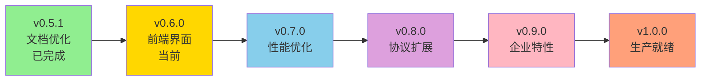

# Mock Server 功能规划更新和工作计划

## 文档信息

- 文档创建时间: 2025-01-18
- 最后更新时间: 2025-01-18
- 当前系统版本: v0.5.1
- 规划基线版本: v0.5.1
- 下一目标版本: v0.6.0
- 文档状态: 进行中

## 一、现状评估

### 1.1 版本演进历史

| 版本 | 发布时间 | 主题 | 状态 | 完成度 |
|------|----------|------|------|--------|
| v0.1.0 | 2025-01-14 | MVP 版本 | ✅ 已完成 | 100% |
| v0.1.1 | 2025-01-15 | 质量改进 | ✅ 已完成 | 100% |
| v0.1.3 | 2025-01-15 | 全栈基础 | ✅ 已完成 | 100% |
| v0.2.0 | 2025-01-16 | 核心功能增强 | ✅ 已完成 | 100% |
| v0.3.0 | 2025-01-17 | 动态能力增强 | ✅ 已完成 | 100% |
| v0.4.0 | 2025-01-18 | 协议扩展 | ✅ 已完成 | 100% |
| v0.5.0 | 2025-01-17 | 可观测性增强 | ✅ 已完成 | 100% |
| v0.5.1 | 2025-01-17 | 文档优化 | ✅ 已完成 | 100% |
| v0.6.0 | 规划中 | 企业特性 | 🔄 规划中 | 0% |

### 1.2 已实现功能盘点

#### 1.2.1 协议支持能力

| 协议类型 | 实现状态 | 完成版本 | 成熟度 | 备注 |
|---------|---------|---------|--------|------|
| HTTP/HTTPS | ✅ 已实现 | v0.1.0 | 95% | 生产就绪 |
| WebSocket | ✅ 已实现 | v0.4.0 | 90% | 支持1000并发连接 |
| gRPC | ❌ 未实现 | - | 0% | v0.8.0 规划 |
| TCP/UDP | ❌ 未实现 | - | 0% | v0.8.0 规划 |

#### 1.2.2 规则匹配能力

| 匹配类型 | 实现状态 | 完成版本 | 成熟度 | 备注 |
|---------|---------|---------|--------|------|
| 简单匹配 | ✅ 已实现 | v0.1.0 | 95% | 路径、方法、Header、Query |
| 正则表达式 | ✅ 已实现 | v0.2.0 | 90% | 含 LRU 缓存优化 |
| CIDR IP段 | ✅ 已实现 | v0.2.0 | 95% | IPv4 和 IPv6 支持 |
| 脚本匹配 | ✅ 已实现 | v0.4.0 | 85% | JavaScript 沙箱隔离 |

#### 1.2.3 响应生成能力

| 响应类型 | 实现状态 | 完成版本 | 成熟度 | 备注 |
|---------|---------|---------|--------|------|
| 静态响应 | ✅ 已实现 | v0.1.0 | 95% | JSON/XML/HTML/Text/Binary |
| 动态模板 | ✅ 已实现 | v0.3.0 | 85% | 13个内置函数 |
| 代理模式 | ✅ 已实现 | v0.3.0 | 85% | 请求/响应修改、错误注入 |
| 文件引用 | ✅ 已实现 | v0.3.0 | 85% | 流式读取大文件 |
| 脚本响应 | ✅ 已实现 | v0.4.0 | 80% | JavaScript 动态生成 |

#### 1.2.4 可观测性能力

| 功能项 | 实现状态 | 完成版本 | 成熟度 | 备注 |
|-------|---------|---------|--------|------|
| 请求日志 | ✅ 已实现 | v0.5.0 | 85% | 异步写入、敏感信息脱敏 |
| 实时监控 | ✅ 已实现 | v0.5.0 | 80% | Prometheus 指标 |
| 健康检查 | ✅ 已实现 | v0.1.1 | 90% | 组件状态检测 |
| 统计分析 | ✅ 已实现 | v0.1.3 | 75% | Dashboard、趋势分析 |

#### 1.2.5 企业特性能力

| 功能项 | 实现状态 | 规划版本 | 优先级 | 备注 |
|-------|---------|---------|--------|------|
| 用户认证 | ❌ 未实现 | v0.6.0 | P0 | JWT + bcrypt |
| 权限管理 | ❌ 未实现 | v0.6.0 | P0 | RBAC 模型 |
| 版本控制 | ❌ 未实现 | v0.6.0 | P1 | 规则版本管理 |
| 导入导出 | ❌ 未实现 | v0.6.0 | P1 | JSON/YAML 格式 |

### 1.3 技术债务分析

#### 1.3.1 已解决的技术债务

| 编号 | 描述 | 解决版本 | 解决方案 |
|------|------|---------|----------|
| TD-001 | CIDR IP 段匹配 | v0.2.0 | net.ParseCIDR 实现 |
| TD-002 | 正则表达式匹配 | v0.2.0 | LRU 缓存优化 |
| TD-003 | 二进制数据处理 | v0.2.0 | Base64 编码支持 |
| TD-004 | 正态分布延迟 | v0.2.0 | Marsaglia polar method |
| TD-005 | 阶梯延迟 | v0.3.0 | 原子计数器优化 |
| TD-006 | 脚本匹配 | v0.4.0 | goja JavaScript 引擎 |
| TD-007 | WebSocket 支持 | v0.4.0 | gorilla/websocket |

#### 1.3.2 待解决的技术债务

| 编号 | 描述 | 优先级 | 规划版本 | 影响范围 | 工作量评估 |
|------|------|--------|---------|---------|------------|
| TD-008 | gRPC 协议支持 | P2 | v0.8.0 | 协议扩展 | 5人日 |
| TD-009 | TCP/UDP 协议支持 | P2 | v0.8.0 | 协议扩展 | 3人日 |
| TD-010 | Redis 缓存支持 | P1 | v0.7.0 | 性能优化 | 3人日 |
| TD-011 | 用户认证系统 | P0 | v0.6.0 | 安全增强 | 5人日 |
| TD-012 | RBAC 权限控制 | P0 | v0.6.0 | 安全增强 | 4人日 |
| TD-013 | 前端功能完善 | P0 | v0.6.0 | 用户体验 | 8人日 |
| TD-014 | 前后端 CORS 配置 | P0 | v0.6.0 | 开发体验 | 0.5人日 |

### 1.4 质量状况评估

#### 1.4.1 测试覆盖率现状

| 模块 | 当前覆盖率 | 目标覆盖率 | 状态 | 优先级 |
|------|-----------|-----------|------|--------|
| executor | 80.7% | 85%+ | ⚠️ 接近目标 | P1 |
| service | 80.1% | 85%+ | ⚠️ 接近目标 | P1 |
| engine | 80.9% | 85%+ | ⚠️ 接近目标 | P1 |
| middleware | 97.2% | 85%+ | ✅ 已达标 | P3 |
| metrics | 100% | 85%+ | ✅ 已达标 | P3 |
| monitoring | 100% | 85%+ | ✅ 已达标 | P3 |
| adapter | 需评估 | 85%+ | ❓ 待评估 | P2 |
| api | 需评估 | 85%+ | ❓ 待评估 | P2 |
| repository | 需评估 | 85%+ | ❓ 待评估 | P2 |
| **总体** | **68%+** | **85%+** | **🔄 进行中** | **P0** |

#### 1.4.2 性能指标现状

| 指标 | 当前值 | 目标值 | 状态 |
|------|--------|--------|------|
| HTTP QPS | >10,000 | >10,000 | ✅ 达标 |
| 平均响应时间 | <10ms | <10ms | ✅ 达标 |
| P99 响应时间 | <50ms | <50ms | ✅ 达标 |
| WebSocket 并发连接 | 1000 | 1000 | ✅ 达标 |
| 规则匹配耗时 | <5ms | <5ms | ✅ 达标 |

### 1.5 功能缺口分析

#### 1.5.1 高优先级缺口（P0）

| 缺口项 | 业务影响 | 用户反馈 | 规划版本 |
|-------|---------|---------|----------|
| 前端管理界面完善 | 无可视化管理能力 | 高 | v0.6.0 |
| 用户认证系统 | 无安全控制 | 高 | v0.6.0 |
| CORS 配置 | 前后端联调困难 | 高 | v0.6.0 |

#### 1.5.2 中优先级缺口（P1）

| 缺口项 | 业务影响 | 用户反馈 | 规划版本 |
|-------|---------|---------|----------|
| 权限管理系统 | 团队协作不便 | 中 | v0.6.0 |
| 规则版本控制 | 回滚困难 | 中 | v0.6.0 |
| 配置导入导出 | 环境迁移不便 | 中 | v0.6.0 |
| Redis 缓存 | 大规模性能瓶颈 | 中 | v0.7.0 |

#### 1.5.3 低优先级缺口（P2）

| 缺口项 | 业务影响 | 用户反馈 | 规划版本 |
|-------|---------|---------|----------|
| gRPC 支持 | 微服务场景覆盖不全 | 低 | v0.8.0 |
| TCP/UDP 支持 | 特殊场景覆盖不全 | 低 | v0.8.0 |
| 集群部署 | 高可用需求 | 低 | v1.0.0 |

## 二、版本规划更新（基于系统设计文档）

### 2.1 版本路线图调整

**调整说明**: 根据系统设计文档的实施路线图，将用户认证和权限管理功能调整为低优先级（阶段四：企业特性），优先完成前端管理界面和核心功能完善。

基于当前 v0.5.1 版本的实际情况和系统设计文档，调整后的版本路线图如下:



**版本阶段对应关系**:

| 版本号 | 对应系统设计阶段 | 主题 | 说明 |
|-------|----------------|------|------|
| v0.1.0-v0.5.1 | 阶段一 + 部分阶段五 | 核心功能 + 可观测性 | 已完成 |
| v0.6.0 | 补充阶段一 + 阶段三部分 | 前端管理界面 | 当前重点 |
| v0.7.0 | 阶段六部分 | 性能优化 | Redis缓存集成 |
| v0.8.0 | 阶段二 | 协议扩展 | gRPC/TCP/UDP |
| v0.9.0 | 阶段四 | 企业特性 | 认证权限、版本控制 |
| v1.0.0 | 阶段六 + 阶段七 | 生产就绪 | 高可用、生态扩展 |

### 2.2 v0.6.0 - 前端管理界面（当前规划重点）

**主题**: 完成完整的 Web 管理界面，提供可视化配置能力

**目标时间**: 2025-01-28（预计 8 个工作日）

**核心目标**:
1. 完成前端管理界面全部功能模块开发
2. 实现前后端联调和集成部署
3. 支持配置导入导出功能
4. 完善统计分析和日志查询界面

**优先级调整说明**:
- ✅ **高优先级**: 前端管理界面、配置管理、导入导出
- ⏸️ **延后至 v0.9.0**: 用户认证、权限管理（系统设计文档阶段四）
- 📝 **理由**: 当前系统无认证机制，先完成核心管理功能，后续增加企业级安全特性

#### 2.2.1 前端管理界面开发

**功能清单**（对应系统设计文档 5. Web 管理界面）:

| 功能模块 | 功能点 | 优先级 | 工作量 | 对应系统设计 |
|---------|-------|--------|--------|-------------|
| 仪表盘 | 实时监控、统计图表 | P0 | 2人日 | 5-仪表盘 |
| 项目管理 | 工作空间、项目、环境 CRUD | P0 | 2.5人日 | 5-项目管理 |
| 规则管理 | 规则列表、创建向导、编辑器 | P0 | 3.5人日 | 5-规则管理 |
| Mock 测试 | 在线测试工具、请求构建器 | P0 | 1.5人日 | 5-规则管理 |
| 请求日志 | 日志查询、过滤、重放 | P1 | 1.5人日 | 5-请求日志 |
| 数据管理 | 配置导入导出、备份 | P1 | 1.5人日 | 5-数据管理 |
| 系统设置 | 基础配置（不含用户权限） | P2 | 0.5人日 | 5-系统设置 |

**技术实现**:
- 基于已有技术栈（React 18.3.1 + TypeScript 5.3.3 + Ant Design 5.14.0）
- 使用 TanStack Query 管理服务端状态
- Monaco Editor 用于脚本编辑
- ECharts 用于统计图表

**交付物**:
- 完整的前端页面和组件
- API 接口对接完成
- 用户操作文档

#### 2.2.2 配置导入导出功能

**功能清单**（对应系统设计文档 3. 配置管理器）:

| 功能点 | 描述 | 优先级 | 工作量 |
|-------|------|--------|--------|
| 项目导出 | 导出项目、环境、规则（JSON/YAML） | P0 | 1人日 |
| 项目导入 | 导入配置到新项目 | P0 | 1人日 |
| 规则批量导出 | 按条件导出规则集 | P1 | 0.5人日 |
| 规则批量导入 | 批量导入规则 | P1 | 0.5人日 |
| 冲突处理 | ID冲突、名称冲突处理 | P1 | 0.5人日 |

**导出格式定义**（对应系统设计文档）:

```
{
  "version": "1.0",
  "export_time": "ISO8601时间戳",
  "projects": [
    {
      "id": "项目ID",
      "name": "项目名称",
      "workspace_id": "工作空间ID",
      "environments": [
        {
          "id": "环境ID",
          "name": "环境名称",
          "base_url": "基础URL",
          "rules": [
            // 规则列表
          ]
        }
      ]
    }
  ]
}
```

**API 接口**（对应系统设计文档 6. 管理 API 服务）:

| 接口 | 方法 | 路径 | 描述 |
|------|------|------|------|
| 导出项目 | GET | /api/v1/projects/:id/export | 导出项目配置 |
| 导入项目 | POST | /api/v1/projects/import | 导入项目配置 |
| 导出规则 | POST | /api/v1/rules/export | 批量导出规则 |
| 导入规则 | POST | /api/v1/rules/import | 批量导入规则 |
| 导出格式验证 | POST | /api/v1/import/validate | 验证导入文件格式 |

#### 2.2.3 统计分析增强

**功能清单**（对应系统设计文档 6. 管理 API 服务 - 统计分析 API）:

| 功能点 | 描述 | 优先级 | 工作量 |
|-------|------|--------|--------|
| 概览统计 | 项目数、规则数、请求总量 | P0 | 0.5人日 |
| 规则统计 | 规则命中率、分布统计 | P0 | 0.5人日 |
| 性能指标 | QPS、响应时间分布 | P1 | 0.5人日 |
| 流量分析 | 协议分布、时间段分析 | P1 | 0.5人日 |
| 趋势图表 | 7天/30天趋势对比 | P1 | 0.5人日 |

**API 接口**:

| 接口 | 方法 | 路径 | 描述 |
|------|------|------|------|
| 概览统计 | GET | /api/v1/stats/overview | 获取概览数据 |
| 规则统计 | GET | /api/v1/stats/rules | 规则维度统计 |
| 性能指标 | GET | /api/v1/stats/performance | 性能指标数据 |
| 流量分析 | GET | /api/v1/stats/traffic | 流量分析数据 |

#### 2.2.4 请求日志界面完善

**功能清单**（对应系统设计文档 5. Web 管理界面 - 请求日志）:

| 功能点 | 描述 | 优先级 | 工作量 |
|-------|------|--------|--------|
| 实时日志流 | WebSocket 实时推送日志 | P1 | 1人日 |
| 日志查询 | 多维度过滤、分页查询 | P0 | 0.5人日 |
| 请求重放 | 重放历史请求 | P1 | 0.5人日 |
| 日志导出 | 导出查询结果 | P2 | 0.5人日 |
| 日志详情 | 完整请求/响应查看 | P0 | 0.5人日 |

**实时日志流实现**（WebSocket）:

```
客户端连接: ws://host:port/api/v1/logs/stream?project_id=xxx

消息格式:
{
  "type": "log",
  "data": {
    "request_id": "请求ID",
    "timestamp": "时间戳",
    "method": "HTTP方法",
    "path": "请求路径",
    "status_code": 200,
    "duration": 15
  }
}
```

#### 2.2.5 前后端集成部署

**后端调整**:

| 任务 | 描述 | 优先级 | 工作量 |
|------|------|--------|--------|
| CORS 中间件 | 添加跨域支持 | P0 | 0.5人日 |
| 静态文件托管 | 托管前端构建产物 | P0 | 0.5人日 |
| 路由优先级 | API优先，静态文件兜底 | P0 | 0.5人日 |
| SPA 路由支持 | NoRoute 返回 index.html | P0 | 已集成 |

**前端调整**:

| 任务 | 描述 | 优先级 | 工作量 |
|------|------|--------|--------|
| API 代理配置 | Vite 开发代理 | P0 | 已完成 |
| 环境变量 | .env.development/.env.production | P0 | 0.5人日 |
| 构建优化 | 生产构建、代码分割 | P1 | 0.5人日 |
| 路由配置 | BrowserRouter 配置 | P0 | 已完成 |

**CORS 配置详情**（参考 web/BACKEND_TODO.md）:
```
允许的源:
- http://localhost:5173 (前端开发服务器)
- http://localhost:8080 (前端生产环境-集成部署)

允许的方法:
- GET, POST, PUT, DELETE, OPTIONS, PATCH

允许的头:
- Content-Type
- Authorization (预留用于 v0.9.0)
- X-Request-ID

暴露的头:
- X-Request-ID

允许凭证: true
```

#### 2.2.6 工作分解（v0.6.0 - 调整后）

**阶段一：基础设施准备（1天）**

Day 1:
- 后端 CORS 中间件开发
- 前端环境变量配置
- 统计分析 API 接口开发
- 导入导出数据模型设计

**阶段二：配置导入导出开发（1.5天）**

Day 2:
- 导出功能 API 开发
- 导入功能 API 开发
- 数据验证和冲突处理

Day 3 上午:
- 前端导入导出界面
- 格式验证和预览

**阶段三：统计分析界面开发（1天）**

Day 3 下午:
- Dashboard 页面开发
- 统计卡片组件

Day 4:
- ECharts 图表集成
- 趋势分析图表
- 性能指标展示

**阶段四：核心管理界面开发（4天）**

Day 5:
- 项目管理页面开发
- 环境管理组件

Day 6-7:
- 规则管理页面（列表、创建、编辑）
- 规则配置表单（复杂表单）
- Monaco Editor 集成

Day 8:
- Mock 测试页面
- 请求构建器
- 响应展示组件

**阶段五：请求日志界面开发（1.5天）**

Day 9:
- 请求日志列表页面
- 日志查询和过滤
- 日志详情对话框

Day 10 上午:
- 实时日志流（WebSocket）
- 请求重放功能

**阶段六：集成测试和部署（1.5天）**

Day 10 下午:
- 静态文件托管配置
- Docker 镜像更新（多阶段构建）
- Makefile 命令优化

Day 11:
- 前后端集成测试
- 完整流程测试
- 性能测试
- 文档更新（README、CHANGELOG、API文档）

#### 2.2.7 交付物清单

**代码交付**:
- [ ] CORS 中间件
- [ ] 统计分析 API 增强
- [ ] 配置导入导出 API
- [ ] 前端管理界面（Dashboard、项目、规则、日志、测试）
- [ ] 实时日志流（WebSocket）
- [ ] 静态文件托管配置
- [ ] Docker 多阶段构建优化

**文档交付**:
- [ ] API 文档更新（统计、导入导出、日志流）
- [ ] 前端用户手册
- [ ] 部署文档更新（集成部署说明）
- [ ] CHANGELOG 更新
- [ ] README 更新（新增前端界面说明）
- [ ] 前端开发文档（web/frontend/DEVELOPMENT.md）

**测试交付**:
- [ ] 单元测试（导入导出、统计分析模块）
- [ ] 集成测试（前后端联调、WebSocket）
- [ ] 端到端测试（完整用户流程）
- [ ] 前端组件测试
- [ ] 性能测试报告（页面加载、API响应）

### 2.3 v0.7.0 - 性能优化（后续规划）

**对应系统设计阶段**: 阶段六部分 - 高可用

**主题**: 性能优化，支持大规模场景

**目标时间**: 2025-02-05（预计 5 个工作日）

**核心功能**:

| 功能项 | 描述 | 优先级 | 工作量 |
|-------|------|--------|--------|
| Redis 缓存 | 热点规则缓存 | P0 | 2人日 |
| 查询优化 | 数据库索引优化 | P1 | 1人日 |
| 连接池优化 | MongoDB 连接池调优 | P1 | 1人日 |
| 并发优化 | goroutine 池化 | P1 | 1人日 |
| 内存优化 | 减少内存分配 | P2 | 1人日 |

**性能目标**:
- HTTP QPS: 10,000 → 20,000
- 平均响应时间: <10ms → <5ms
- 规则匹配耗时: <5ms → <2ms
- 内存使用: 优化 30%

### 2.4 v0.8.0 - 协议扩展（后续规划）

**对应系统设计阶段**: 阶段二 - 协议扩展

**主题**: 扩展协议支持，覆盖更多场景

**目标时间**: 2025-02-15（预计 8 个工作日）

**核心功能**:

| 功能项 | 描述 | 优先级 | 工作量 |
|-------|------|--------|--------|
| gRPC 支持 | gRPC Mock 能力 | P0 | 5人日 |
| TCP 支持 | TCP 协议 Mock | P1 | 2人日 |
| UDP 支持 | UDP 协议 Mock | P2 | 1人日 |
| Proto 管理 | Protobuf 文件管理 | P1 | 2人日 |

### 2.5 v0.9.0 - 企业特性（后续规划）

**对应系统设计阶段**: 阶段四 - 企业特性

**主题**: 企业级能力，支持团队协作和安全控制

**目标时间**: 2025-02-20（预计 10 个工作日）

**核心功能**:

| 功能项 | 描述 | 优先级 | 工作量 |
|-------|------|--------|--------|
| 用户认证 | JWT Token、注册登录 | P0 | 2.5人日 |
| 权限管理 | RBAC 权限模型 | P0 | 2人日 |
| 版本控制 | 规则版本管理、回滚 | P1 | 2人日 |
| 审计日志 | 操作审计、变更记录 | P1 | 1.5人日 |
| 数据备份 | 自动备份、恢复 | P1 | 1人日 |
| 成员管理 | 工作空间成员协作 | P1 | 1人日 |

**技术方案**:
- 认证: JWT + bcrypt（对应系统设计文档安全性设计）
- 权限: RBAC 模型（管理员、开发者、查看者）
- 版本控制: MongoDB versions 集合
- 审计: 操作日志记录和查询

### 2.6 v1.0.0 - 生产就绪（里程碑版本）

**对应系统设计阶段**: 阶段六 + 阶段七 - 高可用 + 生态扩展

**主题**: 生产环境就绪，稳定可靠

**目标时间**: 2025-03-01（预计 10 个工作日）

**核心功能**:

| 功能项 | 描述 | 优先级 | 工作量 |
|-------|------|--------|--------|
| 集群部署 | 多实例部署支持 | P0 | 3人日 |
| 负载均衡 | Nginx 负载均衡配置 | P0 | 1人日 |
| HTTPS 支持 | TLS 证书配置 | P0 | 1人日 |
| 请求限流 | 防止恶意攻击 | P1 | 2人日 |
| 数据备份 | 自动备份和恢复 | P1 | 2人日 |
| 运维工具 | CLI 工具 | P1 | 2人日 |

## 三、当前工作计划执行（v0.6.0）

### 3.1 v0.6.0 详细工作计划

基于上述规划，现在开始执行 v0.6.0 版本的开发工作。

#### 3.1.1 Day 1：基础设施准备

**任务清单**:

1. **后端 CORS 中间件开发**
   - 文件: `internal/middleware/cors.go`
   - 功能: 处理跨域请求（参考 web/BACKEND_TODO.md）
   - 配置: 支持开发（localhost:5173）和生产环境
   - 测试: 编写单元测试

2. **统计分析 API 接口开发**
   - 文件: `internal/api/statistics_handler.go`（扩展现有）
   - 新增概览统计、性能指标、流量分析接口
   - 对应系统设计文档 6. 管理 API 服务

3. **导入导出数据模型设计**
   - 文件: `internal/models/import_export.go`
   - 定义导出格式结构（JSON/YAML）
   - 定义导入验证规则
   - 定义冲突解决策略

4. **前端环境变量配置**
   - 文件: `web/frontend/.env.development`, `.env.production`
   - 配置 API 基础路径（开发代理已完成）
   - 配置环境标识

**验收标准**:
- CORS 中间件可以正常处理跨域请求（开发和生产环境）
- 统计分析 API 返回正确数据
- 导入导出数据模型设计文档完成
- 前端可以正常连接后端 API

#### 3.1.2 Day 2-3上午：配置导入导出开发

**Day 2 任务**:

1. **导出功能 API 开发**
   - 文件: `internal/service/import_export_service.go`
   - 实现项目导出（包含环境和规则）
   - 实现规则批量导出
   - 支持 JSON/YAML 格式
   - 对应系统设计文档 3. 配置管理器

2. **导入功能 API 开发**
   - 文件: `internal/service/import_export_service.go`
   - 实现项目导入（创建新项目）
   - 实现规则批量导入
   - ID 冲突处理（生成新 ID）
   - 名称冲突处理（添加后缀）

3. **数据验证和冲突处理**
   - 导入数据格式验证
   - 依赖关系检查
   - 事务处理（失败回滚）

**Day 3 上午任务**:

1. **前端导入导出界面**
   - 文件: `web/frontend/src/pages/Projects/ImportExport.tsx`
   - 导出按钮和格式选择
   - 导入文件选择和预览
   - 冲突解决选项界面

2. **格式验证和预览**
   - 导入前格式验证
   - 导入数据预览
   - 冲突提示和解决

**验收标准**:
- 导出的配置文件格式正确完整
- 导入功能可以正确重建项目结构
- 冲突处理逻辑正确
- 前端界面友好易用

#### 3.1.3 Day 3下午-4：统计分析界面开发

**Day 3 下午任务**:

1. **Dashboard 页面开发**
   - 文件: `web/frontend/src/pages/Dashboard/index.tsx`
   - 统计卡片组件（项目数、规则数、请求总量等）
   - 页面布局设计
   - 对应系统设计文档 5. Web 管理界面 - 仪表盘

2. **统计数据获取**
   - 集成统计分析 API
   - 数据刷新机制
   - 加载状态处理

**Day 4 任务**:

1. **ECharts 图表集成**
   - 文件: `web/frontend/src/components/Charts/`
   - 折线图组件（趋势分析）
   - 柱状图组件（分布统计）
   - 饼图组件（协议分布）

2. **趋势分析图表**
   - 7天/30天请求趋势
   - 响应时间趋势
   - 对比分析（环比）

3. **性能指标展示**
   - QPS 实时展示
   - 响应时间分布
   - 规则命中率

**验收标准**:
- Dashboard 正确展示所有统计数据
- 图表美观、交互流畅
- 数据更新及时准确
- 支持时间范围切换

#### 3.1.4 Day 5-8：核心管理界面开发

**Day 5：项目和环境管理**

1. **项目管理页面**
   - 文件: `web/frontend/src/pages/Projects/index.tsx`
   - 项目列表展示（表格）
   - 项目创建对话框
   - 项目编辑/删除功能
   - 工作空间概念集成
   - 对应系统设计文档 5. Web 管理界面 - 项目管理

2. **环境管理组件**
   - 文件: `web/frontend/src/components/EnvironmentSelector/`
   - 环境切换器
   - 环境创建/编辑表单
   - 全局变量配置

**Day 6-7：规则管理**

1. **规则管理页面**
   - 文件: `web/frontend/src/pages/Rules/index.tsx`
   - 规则列表视图（搜索、过滤、排序）
   - 规则创建向导（分步表单）
   - 规则编辑器（可视化+代码模式）
   - 批量操作（启用/禁用/删除）
   - 对应系统设计文档 5. Web 管理界面 - 规则管理

2. **规则配置表单**
   - 文件: `web/frontend/src/components/RuleForm/index.tsx`
   - 匹配条件配置（简单/正则/脚本）
   - 响应配置（静态/动态/代理/脚本）
   - 延迟策略配置（四种类型）
   - Monaco Editor 集成（脚本编辑）

3. **规则测试工具**
   - 内置测试功能
   - 规则验证
   - 测试结果展示

**Day 8：Mock 测试页面**

1. **Mock 测试页面**
   - 文件: `web/frontend/src/pages/MockTest/index.tsx`
   - HTTP 请求构建器
   - 请求方法、路径、Headers、Body配置
   - 响应展示（格式化）
   - 历史记录保存

#### 3.1.5 Day 9-10上午：请求日志界面开发

**Day 9 任务**:

1. **请求日志列表页面**
   - 文件: `web/frontend/src/pages/RequestLogs/index.tsx`
   - 日志列表（分页、过滤）
   - 多维度过滤（时间、状态码、项目等）
   - 排序功能
   - 对应系统设计文档 5. Web 管理界面 - 请求日志

2. **日志查询和过滤**
   - 高级查询表单
   - 查询条件保存
   - 快速过滤选项

3. **日志详情对话框**
   - 完整请求信息展示
   - 完整响应信息展示
   - 请求/响应格式化
   - 复制功能

**Day 10 上午任务**:

1. **实时日志流（WebSocket）**
   - 文件: `web/frontend/src/pages/RequestLogs/RealtimeLog.tsx`
   - WebSocket 连接管理
   - 实时日志推送
   - 自动滚动和暂停
   - 对应系统设计文档 6. 管理 API 服务 - 日志查询 API

2. **请求重放功能**
   - 从日志重新发起请求
   - 请求参数编辑
   - 重放结果对比

**验收标准**:
- 所有管理页面功能完整
- 规则配置支持所有已实现的匹配和响应类型
- Mock 测试工具可用性良好
- 请求日志查询灵活高效
- 实时日志流稳定可靠
- 页面响应速度良好（首屏 <2s）
- 移动端基本适配

#### 3.1.6 Day 10下午-11：集成测试和部署

**Day 10 下午任务**:

1. **静态文件托管配置**
   - 文件: `cmd/mockserver/main.go`
   - 添加静态文件服务（Gin Static）
   - SPA 路由回退（NoRoute）
   - 路由优先级调整（API优先）
   - 参考 web/BACKEND_TODO.md

2. **Docker 镜像更新**
   - 文件: `Dockerfile`
   - 多阶段构建（Go + Node.js）
   - 第一阶段：前端构建（npm run build）
   - 第二阶段：后端构建（go build）
   - 第三阶段：运行时镜像（复制前端产物和后端二进制）
   - 镜像体积优化

3. **Makefile 命令优化**
   - 添加 `make build-frontend` 命令
   - 添加 `make build-all` 命令（前端+后端）
   - 添加 `make docker-build-full` 命令（包含前端）

**Day 11 任务**:

1. **前后端集成测试**
   - 完整用户流程测试（无认证）
   - 前端所有功能模块测试
   - 导入导出功能测试
   - WebSocket 实时日志测试
   - 异常情况测试

2. **性能测试**
   - API 响应时间测试
   - 前端页面加载时间测试
   - 前端组件渲染性能
   - 大数据量场景测试

3. **文档更新**
   - README 更新（新增前端界面说明）
   - CHANGELOG 更新（v0.6.0 变更记录）
   - API 文档更新（新增接口）
   - 前端开发文档（web/frontend/DEVELOPMENT.md）
   - 用户使用手册（docs/USER_GUIDE.md）
   - 部署文档更新（集成部署说明）

**验收标准**:
- 所有集成测试通过
- Docker 镜像可以正常运行（包含前端）
- 前端界面可以通过浏览器访问（http://localhost:8080）
- 性能指标满足要求（页面加载 <2s, API响应 <100ms）
- 文档完整准确，用户可根据文档完成部署和使用

### 3.2 风险和应对措施

#### 3.2.1 技术风险

| 风险项 | 概率 | 影响 | 应对措施 |
|-------|------|------|----------|
| JWT 安全性问题 | 中 | 高 | 使用强加密算法、设置合理过期时间、支持 Token 黑名单 |
| 权限系统复杂度 | 高 | 中 | 采用成熟的 RBAC 模型、充分测试 |
| 前端状态管理复杂 | 中 | 中 | 使用 TanStack Query 管理服务端状态、Zustand 管理客户端状态 |
| 导入导出数据一致性 | 中 | 高 | 严格的数据验证、事务处理、回滚机制 |

#### 3.2.2 进度风险

| 风险项 | 概率 | 影响 | 应对措施 |
|-------|------|------|----------|
| 前端开发进度延迟 | 中 | 高 | 分阶段交付、优先核心功能、预留缓冲时间 |
| API 接口变更频繁 | 中 | 中 | 接口设计评审、版本控制、向后兼容 |
| 测试时间不足 | 高 | 高 | 提前编写测试用例、自动化测试、持续集成 |

#### 3.2.3 质量风险

| 风险项 | 概率 | 影响 | 应对措施 |
|-------|------|------|----------|
| 安全漏洞 | 中 | 高 | 代码审查、安全测试、依赖扫描 |
| 性能问题 | 低 | 中 | 性能测试、优化关键路径、缓存策略 |
| 用户体验问题 | 中 | 中 | 用户测试、界面评审、迭代优化 |

### 3.3 质量保障措施

#### 3.3.1 代码质量

- 代码评审：所有代码提交需经过评审
- 单元测试：核心模块覆盖率 > 85%
- 静态分析：使用 golangci-lint、ESLint
- 持续集成：GitHub Actions 自动化测试

#### 3.3.2 测试策略

| 测试类型 | 覆盖范围 | 执行频率 | 负责人 |
|---------|---------|---------|--------|
| 单元测试 | 所有核心模块 | 每次提交 | 开发者 |
| 集成测试 | API 接口、前后端联调 | 每日构建 | QA |
| 端到端测试 | 完整用户流程 | 每周 | QA |
| 性能测试 | 关键 API、页面加载 | 每个版本 | QA |
| 安全测试 | 认证、权限、输入验证 | 每个版本 | 安全工程师 |

#### 3.3.3 文档质量

- API 文档：使用 Swagger/OpenAPI 规范
- 代码注释：关键逻辑必须注释
- 用户手册：图文并茂、步骤清晰
- 变更日志：详细记录每个版本的变更

## 四、后续版本规划概要

### 4.1 v0.7.0 规划要点

**目标**: 性能优化，支持大规模场景

**关键任务**:
1. Redis 缓存集成（热点规则、统计数据）
2. 数据库查询优化（索引、聚合查询）
3. 并发优化（goroutine 池、连接池）
4. 内存优化（减少内存分配、对象复用）

**性能目标**:
- HTTP QPS: 10,000 → 20,000
- 平均响应时间: <10ms → <5ms
- 内存使用: 优化 30%

### 4.2 v0.8.0 规划要点

**目标**: 协议扩展，覆盖微服务场景

**关键任务**:
1. gRPC 协议支持（服务端、流式 RPC）
2. Protobuf 文件管理
3. TCP/UDP 协议支持
4. 自定义协议解析

**技术选型**:
- gRPC: google.golang.org/grpc
- Protobuf: google.golang.org/protobuf

### 4.3 v1.0.0 规划要点

**目标**: 生产环境就绪

**关键任务**:
1. 高可用部署（集群、负载均衡）
2. 安全增强（HTTPS、限流、防攻击）
3. 运维工具（CLI、监控、告警）
4. 数据备份和恢复

**里程碑意义**:
- 首个生产就绪版本
- 支持大规模生产环境部署
- 完善的运维和监控体系

## 五、附录

### 5.1 技术栈总结

#### 5.1.1 后端技术栈

| 组件 | 技术选型 | 版本 | 用途 |
|------|---------|------|------|
| 语言 | Go | 1.24+ | 主要开发语言 |
| Web 框架 | Gin | latest | HTTP 服务器 |
| 数据库 | MongoDB | 6.0+ | 数据持久化 |
| 缓存 | Redis | 7.0+ | 热点数据缓存（v0.7.0） |
| 认证 | JWT + bcrypt | - | 用户认证 |
| 配置管理 | Viper | - | 配置加载 |
| 日志系统 | Zap | - | 结构化日志 |
| WebSocket | gorilla/websocket | v1.5.3 | WebSocket 支持 |
| JavaScript 引擎 | goja | latest | 脚本引擎 |
| 监控 | Prometheus | - | 指标采集 |

#### 5.1.2 前端技术栈

| 组件 | 技术选型 | 版本 | 用途 |
|------|---------|------|------|
| 框架 | React | 18.3.1 | UI 框架 |
| 语言 | TypeScript | 5.3.3 | 类型安全 |
| 构建工具 | Vite | 5.1.0 | 开发和构建 |
| UI 组件库 | Ant Design | 5.14.0 | 企业级组件 |
| 路由 | React Router | 6.22.0 | 路由管理 |
| 状态管理 | Zustand | 4.5.0 | 客户端状态 |
| 数据请求 | TanStack Query | 5.20.0 | 服务端状态 |
| HTTP 客户端 | Axios | 1.6.7 | API 调用 |
| 图表 | ECharts | 5.6.0 | 数据可视化 |
| 代码编辑器 | Monaco Editor | 0.46.0 | 脚本编辑 |

### 5.2 关键指标定义

#### 5.2.1 性能指标

| 指标 | 定义 | 测量方法 | 目标值 |
|------|------|---------|--------|
| QPS | 每秒查询数 | wrk 压测 | >10,000 |
| 平均响应时间 | API 平均响应时间 | wrk 压测 | <10ms |
| P99 响应时间 | 99% 请求响应时间 | wrk 压测 | <50ms |
| 内存使用 | 进程内存占用 | pprof | <500MB |
| CPU 使用率 | 进程 CPU 占用 | top/htop | <50% |

#### 5.2.2 质量指标

| 指标 | 定义 | 测量方法 | 目标值 |
|------|------|---------|--------|
| 单元测试覆盖率 | 代码覆盖率 | go test -cover | >85% |
| 代码复杂度 | 圈复杂度 | gocyclo | <15 |
| Bug 密度 | 每千行代码 Bug 数 | Issue 跟踪 | <0.5 |
| 可用性 | 系统正常运行时间比例 | 监控系统 | >99.9% |

### 5.3 术语表

| 术语 | 全称 | 说明 |
|------|------|------|
| RBAC | Role-Based Access Control | 基于角色的访问控制 |
| JWT | JSON Web Token | JSON 网络令牌 |
| CORS | Cross-Origin Resource Sharing | 跨域资源共享 |
| CIDR | Classless Inter-Domain Routing | 无类别域间路由 |
| LRU | Least Recently Used | 最近最少使用 |
| QPS | Queries Per Second | 每秒查询数 |
| P99 | 99th Percentile | 99 百分位数 |
| SPA | Single Page Application | 单页应用 |
| gRPC | gRPC Remote Procedure Call | 远程过程调用框架 |
| MVP | Minimum Viable Product | 最小可行产品 |

### 5.4 参考资料

- [Go 官方文档](https://golang.org/doc/)
- [React 官方文档](https://react.dev/)
- [MongoDB 官方文档](https://www.mongodb.com/docs/)
- [Ant Design 官方文档](https://ant.design/)
- [JWT 规范](https://jwt.io/)
- [Prometheus 文档](https://prometheus.io/docs/)

---

**文档状态**: 进行中  
**下一步行动**: 开始执行 v0.6.0 Day 1 任务  
**预计完成时间**: 2025-01-25