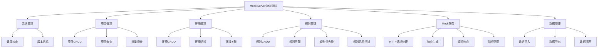
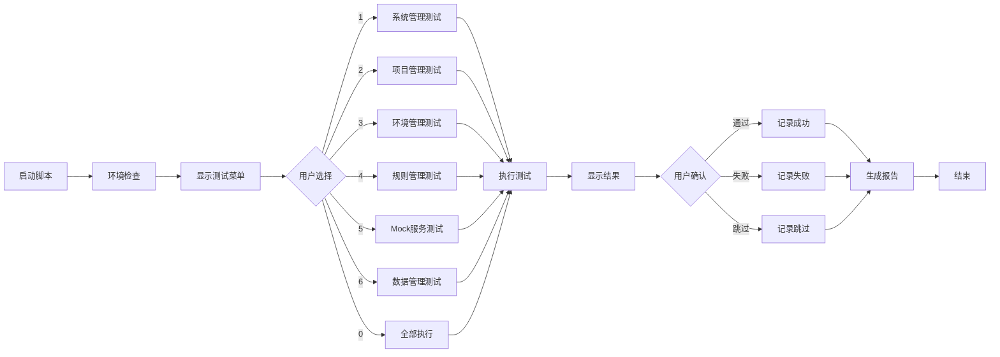
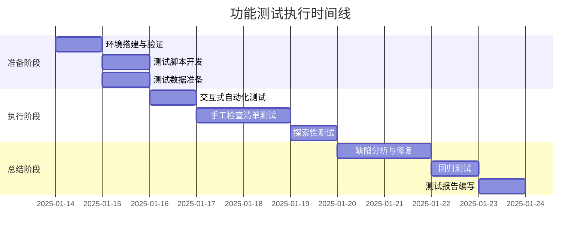
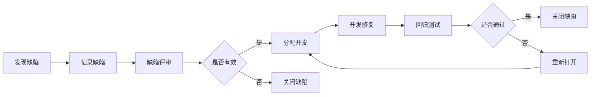

# Mock Server 功能测试方案与执行计划

## 文档信息

| 项目 | 内容 |
|------|------|
| 文档名称 | Mock Server 功能测试方案与执行计划 |
| 项目名称 | Mock Server |
| 版本号 | v1.0 |
| 创建日期 | 2025-01-14 |
| 测试类型 | 功能测试（人机交互式） |
| 测试范围 | 完整业务功能验证 |

## 一、测试方案概述

### 1.1 测试目标

通过人机交互的方式执行全面的功能测试，验证 Mock Server 系统的业务功能完整性、正确性和可用性。

**核心目标**：
- 验证所有功能模块是否符合需求规格
- 确保用户操作流程顺畅无误
- 发现潜在的功能缺陷和用户体验问题
- 补充自动化测试未覆盖的场景
- 为产品发布提供质量保证

### 1.2 测试策略

采用**三层测试执行模式**：

| 测试层级 | 执行方式 | 交互形式 | 覆盖范围 |
|---------|---------|---------|---------|
| 第一层：自动化功能测试 | 交互式测试脚本 | 用户选择场景、确认执行、验证结果 | 核心业务流程 |
| 第二层：手工功能测试 | 测试检查清单 | 用户按清单逐项执行并记录 | 边界场景、异常场景 |
| 第三层：探索性测试 | 自由探索 | 用户自由操作、记录问题 | 用户体验、隐藏缺陷 |

### 1.3 测试环境

**环境要求**：

| 组件 | 版本/配置 | 说明 |
|------|----------|------|
| 操作系统 | Linux / macOS / Windows | 支持跨平台测试 |
| Go | >= 1.25.4 | 后端运行环境 |
| MongoDB | >= 6.0 | 数据持久化 |
| Node.js | >= 18.0.0 | 前端运行环境（可选） |
| Docker | >= 20.10 | 容器化部署测试 |
| 网络 | localhost 或内网 | 管理API: 8080, Mock服务: 9090 |

**环境准备检查项**：
- MongoDB 服务运行正常
- 端口 8080、9090 可用
- 配置文件 config.yaml 正确配置
- 二进制文件已编译或 Docker 镜像已构建

## 二、测试范围与测试点

### 2.1 功能模块划分

系统功能模块按业务域划分为六大测试域：



### 2.2 测试点矩阵

#### 2.2.1 系统管理功能

| 测试点ID | 测试点名称 | 测试优先级 | 测试方法 |
|---------|-----------|-----------|---------|
| SYS-001 | 健康检查接口正常响应 | P0 | 自动化 + 手工 |
| SYS-002 | 健康检查返回正确状态 | P0 | 自动化 + 手工 |
| SYS-003 | 版本信息接口正常响应 | P1 | 自动化 + 手工 |
| SYS-004 | 版本信息包含版本号、构建时间、Git提交号 | P1 | 手工 |
| SYS-005 | 服务启动时间在可接受范围内 | P2 | 手工 |
| SYS-006 | 服务异常重启后数据完整性 | P1 | 手工 |

#### 2.2.2 项目管理功能

| 测试点ID | 测试点名称 | 测试优先级 | 测试方法 |
|---------|-----------|-----------|---------|
| PRJ-001 | 创建项目成功 | P0 | 自动化 + 手工 |
| PRJ-002 | 创建项目返回正确的项目ID | P0 | 自动化 + 手工 |
| PRJ-003 | 查询项目详情成功 | P0 | 自动化 + 手工 |
| PRJ-004 | 更新项目信息成功 | P0 | 自动化 + 手工 |
| PRJ-005 | 删除项目成功 | P0 | 自动化 + 手工 |
| PRJ-006 | 列出所有项目 | P1 | 自动化 + 手工 |
| PRJ-007 | 创建重名项目的处理 | P1 | 手工 |
| PRJ-008 | 项目名称为空的验证 | P1 | 手工 |
| PRJ-009 | 项目名称超长的验证 | P2 | 手工 |
| PRJ-010 | 项目描述包含特殊字符 | P2 | 手工 |
| PRJ-011 | 删除包含环境的项目 | P1 | 手工 |
| PRJ-012 | 删除包含规则的项目 | P1 | 手工 |
| PRJ-013 | 查询不存在的项目 | P1 | 手工 |
| PRJ-014 | 使用无效的项目ID格式 | P2 | 手工 |

#### 2.2.3 环境管理功能

| 测试点ID | 测试点名称 | 测试优先级 | 测试方法 |
|---------|-----------|-----------|---------|
| ENV-001 | 创建环境成功 | P0 | 自动化 + 手工 |
| ENV-002 | 创建环境返回正确的环境ID | P0 | 自动化 + 手工 |
| ENV-003 | 查询环境详情成功 | P0 | 自动化 + 手工 |
| ENV-004 | 更新环境信息成功 | P0 | 自动化 + 手工 |
| ENV-005 | 删除环境成功 | P0 | 自动化 + 手工 |
| ENV-006 | 列出项目的所有环境 | P1 | 自动化 + 手工 |
| ENV-007 | 同一项目下创建重名环境 | P1 | 手工 |
| ENV-008 | 环境名称为空的验证 | P1 | 手工 |
| ENV-009 | 环境base_url格式验证 | P1 | 手工 |
| ENV-010 | 删除包含规则的环境 | P1 | 手工 |
| ENV-011 | 查询不存在项目的环境 | P2 | 手工 |
| ENV-012 | 跨项目查询环境 | P2 | 手工 |

#### 2.2.4 规则管理功能

| 测试点ID | 测试点名称 | 测试优先级 | 测试方法 |
|---------|-----------|-----------|---------|
| RULE-001 | 创建HTTP规则成功 | P0 | 自动化 + 手工 |
| RULE-002 | 创建规则返回正确的规则ID | P0 | 自动化 + 手工 |
| RULE-003 | 查询规则详情成功 | P0 | 自动化 + 手工 |
| RULE-004 | 更新规则成功 | P0 | 自动化 + 手工 |
| RULE-005 | 删除规则成功 | P0 | 自动化 + 手工 |
| RULE-006 | 列出所有规则 | P1 | 自动化 + 手工 |
| RULE-007 | 启用规则 | P0 | 自动化 + 手工 |
| RULE-008 | 禁用规则 | P0 | 自动化 + 手工 |
| RULE-009 | 创建带延迟的规则 | P0 | 自动化 + 手工 |
| RULE-010 | 规则优先级排序验证 | P0 | 手工 |
| RULE-011 | 规则名称为空的验证 | P1 | 手工 |
| RULE-012 | 规则优先级为负数 | P2 | 手工 |
| RULE-013 | 规则优先级为零 | P2 | 手工 |
| RULE-014 | 路径匹配条件为空 | P1 | 手工 |
| RULE-015 | 响应内容为空 | P1 | 手工 |
| RULE-016 | 响应状态码非标准值 | P2 | 手工 |
| RULE-017 | 同时创建多条相同规则 | P1 | 手工 |
| RULE-018 | 查询不存在的规则 | P1 | 手工 |
| RULE-019 | 按项目ID过滤规则 | P1 | 手工 |
| RULE-020 | 按环境ID过滤规则 | P1 | 手工 |

#### 2.2.5 Mock服务功能

| 测试点ID | 测试点名称 | 测试优先级 | 测试方法 |
|---------|-----------|-----------|---------|
| MOCK-001 | GET请求Mock响应正确 | P0 | 自动化 + 手工 |
| MOCK-002 | POST请求Mock响应正确 | P0 | 自动化 + 手工 |
| MOCK-003 | PUT请求Mock响应正确 | P1 | 手工 |
| MOCK-004 | DELETE请求Mock响应正确 | P1 | 手工 |
| MOCK-005 | 响应自定义Header正确 | P0 | 自动化 + 手工 |
| MOCK-006 | 响应延迟功能正确 | P0 | 自动化 + 手工 |
| MOCK-007 | 路径精确匹配 | P0 | 手工 |
| MOCK-008 | 路径参数匹配（如/api/users/:id） | P0 | 手工 |
| MOCK-009 | Query参数匹配 | P1 | 手工 |
| MOCK-010 | Header匹配 | P1 | 手工 |
| MOCK-011 | 请求方法匹配 | P0 | 手工 |
| MOCK-012 | 未匹配规则返回404 | P0 | 自动化 + 手工 |
| MOCK-013 | 禁用规则不返回响应 | P0 | 自动化 + 手工 |
| MOCK-014 | 多规则优先级匹配 | P0 | 手工 |
| MOCK-015 | JSON响应格式正确 | P0 | 手工 |
| MOCK-016 | XML响应格式正确 | P1 | 手工 |
| MOCK-017 | HTML响应格式正确 | P1 | 手工 |
| MOCK-018 | Text响应格式正确 | P1 | 手工 |
| MOCK-019 | 固定延迟响应时间准确 | P1 | 手工 |
| MOCK-020 | 随机延迟响应时间在范围内 | P2 | 手工 |
| MOCK-021 | 项目ID错误的请求 | P1 | 手工 |
| MOCK-022 | 环境ID错误的请求 | P1 | 手工 |
| MOCK-023 | 路径不存在的请求 | P1 | 手工 |
| MOCK-024 | 并发请求处理正确 | P1 | 手工 |
| MOCK-025 | 大请求体处理 | P2 | 手工 |
| MOCK-026 | 大响应体返回 | P2 | 手工 |

#### 2.2.6 数据管理功能

| 测试点ID | 测试点名称 | 测试优先级 | 测试方法 |
|---------|-----------|-----------|---------|
| DATA-001 | 数据持久化验证 | P0 | 手工 |
| DATA-002 | 服务重启后数据保留 | P0 | 手工 |
| DATA-003 | 批量删除规则 | P1 | 手工 |
| DATA-004 | 数据库连接失败处理 | P1 | 手工 |
| DATA-005 | 数据库查询异常处理 | P2 | 手工 |

### 2.3 测试优先级说明

| 优先级 | 定义 | 覆盖范围 | 执行要求 |
|-------|------|---------|---------|
| P0 | 核心功能，阻塞性缺陷 | 主要业务流程、基本功能 | 必须全部通过 |
| P1 | 重要功能，影响用户体验 | 常用功能、边界处理 | 90%以上通过 |
| P2 | 一般功能，优化项 | 异常场景、极端情况 | 80%以上通过 |

## 三、测试执行方式设计

### 3.1 交互式自动化测试脚本

#### 3.1.1 脚本设计原则

**交互式设计要点**：
- 提供清晰的测试场景菜单
- 支持单个场景执行或批量执行
- 执行前显示测试步骤和预期结果
- 执行后需要用户确认实际结果
- 自动记录测试结果和执行日志
- 支持中断和继续执行

#### 3.1.2 脚本功能结构

**功能测试脚本（functional_test.sh）组成**：



#### 3.1.3 脚本交互流程

**测试场景执行流程**：

| 步骤 | 操作 | 系统行为 | 用户交互 |
|-----|------|---------|---------|
| 1 | 环境准备 | 检查服务、数据库、端口等前置条件 | 查看检查结果，确认继续 |
| 2 | 选择场景 | 显示测试场景菜单 | 输入场景编号 |
| 3 | 显示说明 | 展示测试目的、步骤、预期结果 | 阅读并确认执行 |
| 4 | 执行测试 | 自动调用API、发送请求、收集响应 | 观察执行过程 |
| 5 | 显示结果 | 输出响应数据、高亮关键信息 | 对比预期结果 |
| 6 | 结果确认 | 询问测试是否通过 | 输入 Y(通过) / N(失败) / S(跳过) |
| 7 | 记录结果 | 记录到测试报告文件 | 查看统计信息 |
| 8 | 继续测试 | 返回菜单或继续下一场景 | 选择继续或退出 |

#### 3.1.4 测试报告格式

**自动生成的测试报告（functional_test_report.md）结构**：

| 章节 | 内容 |
|------|------|
| 测试概要 | 执行时间、测试人员、测试环境、总体统计 |
| 测试详情 | 每个场景的执行结果、实际响应、通过状态 |
| 失败详情 | 失败场景的详细日志、错误信息、截图引用 |
| 缺陷列表 | 发现的问题、严重程度、重现步骤 |
| 建议改进 | 测试过程中发现的体验问题、优化建议 |

### 3.2 手工测试检查清单

#### 3.2.1 检查清单设计

**检查清单（functional_test_checklist.md）结构**：

测试检查清单采用表格形式，便于测试人员逐项执行和记录：

| 测试项编号 | 测试场景 | 测试步骤 | 预期结果 | 实际结果 | 通过状态 | 备注 |
|-----------|---------|---------|---------|---------|---------|------|
| PRJ-007 | 创建重名项目 | 1. 创建项目A<br>2. 再次创建同名项目A | 返回错误提示，不允许创建 | [待填写] | [待填写] | [待填写] |

#### 3.2.2 检查清单使用流程

**执行步骤**：
1. 测试人员打开检查清单文件
2. 按照测试优先级（P0 → P1 → P2）逐项执行
3. 在"实际结果"列填写实际观察到的现象
4. 在"通过状态"列填写：通过 / 失败 / 阻塞 / 跳过
5. 在"备注"列记录问题、截图文件名、建议等
6. 完成后统计通过率，提交测试报告

#### 3.2.3 边界场景测试点

**重点关注的边界和异常场景**：

| 场景类型 | 具体测试点 |
|---------|-----------|
| 输入验证 | 空值、null、超长字符串、特殊字符、SQL注入、XSS |
| 数据边界 | 最大值、最小值、零、负数、浮点数精度 |
| 并发场景 | 同时创建、同时更新、同时删除 |
| 异常处理 | 数据库断连、网络超时、磁盘满、内存溢出 |
| 权限控制 | 跨项目访问、跨环境访问（如有权限功能） |
| 性能边界 | 大量规则、大量并发请求、超大请求体 |

### 3.3 探索性测试指南

#### 3.3.1 探索性测试目标

**探索性测试关注点**：
- 发现脚本和清单未覆盖的隐藏缺陷
- 从用户视角评估系统可用性
- 测试非常规操作路径
- 验证系统在压力下的表现
- 发现用户体验问题

#### 3.3.2 探索性测试会话

**测试会话设计**：

| 会话ID | 会话主题 | 时长 | 探索方向 |
|-------|---------|------|---------|
| EXP-01 | 新手用户首次使用 | 30分钟 | 模拟新用户首次使用，记录困惑点 |
| EXP-02 | 高级用户复杂场景 | 30分钟 | 创建复杂规则组合，测试匹配逻辑 |
| EXP-03 | 异常操作路径 | 30分钟 | 故意执行错误操作，测试容错性 |
| EXP-04 | 性能压力测试 | 30分钟 | 创建大量数据，测试响应速度 |
| EXP-05 | 数据一致性验证 | 30分钟 | 反复创建删除，检查数据残留 |

#### 3.3.3 探索性测试记录

**记录模板（exploratory_test_notes.md）**：

| 字段 | 说明 |
|------|------|
| 会话时间 | 测试开始和结束时间 |
| 测试人员 | 执行探索性测试的人员 |
| 测试主题 | 本次会话的探索方向 |
| 操作路径 | 记录实际执行的操作序列 |
| 发现问题 | 记录发现的缺陷、体验问题 |
| 改进建议 | 对产品的优化建议 |

## 四、测试数据准备

### 4.1 测试数据策略

**数据准备原则**：
- 使用独立的测试数据库或测试环境
- 测试数据应覆盖正常值、边界值、异常值
- 每次测试前清理旧数据，确保测试独立性
- 保留测试数据用于问题排查和回归测试

### 4.2 基础测试数据

#### 4.2.1 项目测试数据

| 数据项 | 测试值 | 用途 |
|-------|--------|------|
| 项目名称（正常） | "功能测试项目"、"Test Project" | 基本功能测试 |
| 项目名称（边界） | "A"（1字符）、256字符长名称 | 边界测试 |
| 项目名称（异常） | ""（空）、null、包含emoji | 异常测试 |
| 项目描述 | 正常描述文本、超长文本、特殊字符 | 字段验证 |
| workspace_id | "default"、"test-workspace" | 多工作空间测试 |

#### 4.2.2 环境测试数据

| 数据项 | 测试值 | 用途 |
|-------|--------|------|
| 环境名称 | "开发环境"、"测试环境"、"生产环境" | 基本功能测试 |
| base_url | "http://localhost:8080"、"https://api.example.com" | URL格式测试 |
| base_url（异常） | "invalid-url"、"ftp://test" | URL验证测试 |

#### 4.2.3 规则测试数据

**简单GET规则**：
```
规则名称: "获取用户列表"
路径: "/api/users"
方法: "GET"
响应状态码: 200
响应体: {"code": 0, "data": [{"id": 1, "name": "张三"}]}
```

**带路径参数的规则**：
```
规则名称: "获取用户详情"
路径: "/api/users/:id"
方法: "GET"
响应状态码: 200
响应体: {"code": 0, "data": {"id": 1, "name": "张三"}}
```

**带延迟的规则**：
```
规则名称: "慢速接口"
路径: "/api/slow"
方法: "GET"
固定延迟: 2000ms
响应状态码: 200
```

**POST规则**：
```
规则名称: "创建用户"
路径: "/api/users"
方法: "POST"
响应状态码: 201
响应体: {"code": 0, "message": "创建成功"}
```

**高优先级规则**：
```
规则名称: "优先规则"
路径: "/api/test"
优先级: 1000
```

**低优先级规则**：
```
规则名称: "普通规则"
路径: "/api/test"
优先级: 1
```

### 4.3 测试数据准备脚本

**数据准备脚本功能**：
- 自动创建一组基础测试数据（项目、环境、规则）
- 支持按需生成指定数量的测试数据
- 提供数据清理功能
- 导出测试数据ID供测试脚本使用

## 五、测试执行计划

### 5.1 测试阶段划分



### 5.2 测试执行顺序

**推荐的测试执行顺序**：

| 阶段 | 测试内容 | 执行时长 | 交付物 |
|------|---------|---------|--------|
| 第1天 | 环境准备、脚本开发 | 8小时 | 测试环境、测试脚本 |
| 第2天 | 系统管理、项目管理、环境管理测试 | 8小时 | 部分测试报告 |
| 第3天 | 规则管理、Mock服务测试 | 8小时 | 部分测试报告 |
| 第4天 | 手工边界场景、异常场景测试 | 8小时 | 完整检查清单 |
| 第5天 | 探索性测试、缺陷验证 | 8小时 | 探索性测试记录 |
| 第6-7天 | 缺陷修复、回归测试 | 16小时 | 回归测试报告 |
| 第8天 | 测试总结、报告编写 | 8小时 | 最终测试报告 |

### 5.3 测试暂停与恢复

**测试中断处理**：
- 每个测试场景执行完毕后自动保存进度
- 支持从上次中断位置继续执行
- 测试日志持续记录，不会丢失
- 提供进度查询功能

## 六、测试工具与脚本

### 6.1 交互式测试脚本结构

**脚本文件组织**：

```
tests/functional/
├── functional_test.sh              # 主测试脚本（交互式）
├── test_cases/                     # 测试用例脚本
│   ├── system_tests.sh             # 系统管理测试用例
│   ├── project_tests.sh            # 项目管理测试用例
│   ├── environment_tests.sh        # 环境管理测试用例
│   ├── rule_tests.sh               # 规则管理测试用例
│   ├── mock_tests.sh               # Mock服务测试用例
│   └── data_tests.sh               # 数据管理测试用例
├── lib/                            # 公共库
│   ├── common.sh                   # 通用函数
│   ├── api_client.sh               # API调用封装
│   └── report_generator.sh         # 报告生成器
├── data/                           # 测试数据
│   ├── prepare_data.sh             # 数据准备脚本
│   ├── cleanup_data.sh             # 数据清理脚本
│   └── test_data.json              # 测试数据定义
├── reports/                        # 测试报告输出目录
├── functional_test_checklist.md    # 手工测试检查清单
└── exploratory_test_template.md    # 探索性测试模板
```

### 6.2 脚本核心功能

**主脚本（functional_test.sh）提供的功能**：

| 功能 | 说明 | 交互方式 |
|------|------|---------|
| 环境检查 | 验证服务状态、端口、配置 | 自动执行，显示结果 |
| 测试菜单 | 显示测试场景分类菜单 | 用户选择编号 |
| 场景执行 | 执行选定的测试场景 | 自动执行，显示过程 |
| 结果确认 | 请求用户确认测试结果 | 用户输入 Y/N/S |
| 进度保存 | 保存测试进度和结果 | 自动执行 |
| 报告生成 | 生成Markdown格式测试报告 | 自动执行 |
| 日志查看 | 查看详细执行日志 | 用户选择查看 |
| 数据清理 | 清理测试产生的数据 | 用户确认后执行 |

### 6.3 API调用封装

**API客户端函数库（api_client.sh）提供的函数**：

| 函数名 | 功能 | 参数 |
|--------|------|------|
| api_get | GET请求 | URL, 期望状态码 |
| api_post | POST请求 | URL, JSON数据, 期望状态码 |
| api_put | PUT请求 | URL, JSON数据, 期望状态码 |
| api_delete | DELETE请求 | URL, 期望状态码 |
| extract_id | 从响应中提取ID | 响应JSON, 字段名 |
| verify_field | 验证响应字段值 | 响应JSON, 字段名, 期望值 |
| mock_request | 发送Mock请求 | 项目ID, 环境ID, 路径, 方法 |

### 6.4 报告生成器

**自动生成的测试报告包含**：

| 报告章节 | 内容来源 | 格式 |
|---------|---------|------|
| 测试概要 | 脚本自动统计 | 表格：总数、通过数、失败数、跳过数、通过率 |
| 环境信息 | 脚本自动收集 | 表格：OS、Go版本、MongoDB版本、服务版本 |
| 测试结果 | 用户确认结果 | 表格：测试点、状态、执行时间 |
| 失败详情 | 失败场景日志 | 代码块：请求、响应、错误信息 |
| API调用日志 | 脚本记录 | 代码块：每个API调用的完整信息 |
| 截图引用 | 用户手工添加 | 图片链接列表 |

## 七、缺陷管理

### 7.1 缺陷等级定义

| 等级 | 名称 | 定义 | 示例 | 处理优先级 |
|------|------|------|------|-----------|
| P0 | 致命缺陷 | 系统崩溃、数据丢失、核心功能不可用 | 服务无法启动、数据库连接失败 | 立即修复 |
| P1 | 严重缺陷 | 重要功能失效、影响主要业务流程 | 规则创建失败、Mock请求无响应 | 当日修复 |
| P2 | 一般缺陷 | 功能部分失效、影响用户体验 | 错误提示不明确、响应格式不标准 | 3日内修复 |
| P3 | 轻微缺陷 | 界面显示问题、优化建议 | 文档错误、日志格式问题 | 择期修复 |

### 7.2 缺陷记录格式

**缺陷报告模板**：

| 字段 | 说明 |
|------|------|
| 缺陷ID | 唯一标识，格式：BUG-YYYYMMDD-序号 |
| 缺陷标题 | 简短描述问题 |
| 发现时间 | 缺陷发现的日期和时间 |
| 发现人 | 测试人员姓名 |
| 测试环境 | OS、版本号等环境信息 |
| 缺陷等级 | P0/P1/P2/P3 |
| 所属模块 | 系统管理/项目管理/规则管理等 |
| 重现步骤 | 详细的操作步骤 |
| 预期结果 | 正确的行为 |
| 实际结果 | 实际观察到的现象 |
| 附件 | 截图、日志文件 |
| 状态 | 新建/已确认/修复中/已修复/已验证/关闭 |

### 7.3 缺陷跟踪流程



## 八、测试完成标准

### 8.1 测试完成标准

**以下条件全部满足时，功能测试视为完成**：

| 标准项 | 完成标准 | 验证方式 |
|--------|---------|---------|
| 测试用例执行率 | 所有P0、P1用例执行完毕，P2用例执行80%以上 | 统计测试报告 |
| P0用例通过率 | 100% | 统计测试结果 |
| P1用例通过率 | ≥95% | 统计测试结果 |
| P2用例通过率 | ≥85% | 统计测试结果 |
| 致命缺陷 | 0个 | 缺陷列表检查 |
| 严重缺陷 | ≤2个且有解决方案 | 缺陷列表检查 |
| 测试报告完整性 | 测试报告包含所有必要章节 | 人工检查 |
| 测试数据清理 | 测试数据已清理或归档 | 数据库检查 |

### 8.2 质量门禁

**发布前必须通过的质量检查点**：

| 检查点 | 标准 | 检查人 |
|--------|------|--------|
| 核心功能可用性 | 项目、环境、规则CRUD全部正常 | 测试负责人 |
| Mock服务稳定性 | 连续1000次请求无失败 | 测试负责人 |
| 数据一致性 | 无数据丢失、无脏数据 | 测试负责人 |
| 性能基准达标 | 响应时间符合性能要求 | 性能测试人员 |
| 文档完整性 | README、API文档准确无误 | 技术写作人员 |

## 九、风险与应对

### 9.1 测试风险识别

| 风险ID | 风险描述 | 可能性 | 影响程度 | 风险等级 |
|--------|---------|--------|---------|---------|
| RISK-01 | 测试环境不稳定，MongoDB频繁断连 | 中 | 高 | 高 |
| RISK-02 | 测试数据准备不充分，覆盖不全面 | 中 | 中 | 中 |
| RISK-03 | 测试人员对系统不熟悉，测试效率低 | 低 | 中 | 中 |
| RISK-04 | 时间不足，无法完成所有测试 | 中 | 高 | 高 |
| RISK-05 | 缺陷修复引入新问题，回归测试不充分 | 中 | 高 | 高 |

### 9.2 风险应对措施

| 风险ID | 应对措施 |
|--------|---------|
| RISK-01 | 1. 使用Docker Compose确保环境稳定<br>2. 准备备用MongoDB实例<br>3. 脚本增加重试机制 |
| RISK-02 | 1. 提前准备测试数据清单<br>2. 使用数据生成脚本<br>3. 进行测试数据评审 |
| RISK-03 | 1. 测试前进行系统培训<br>2. 提供详细的测试指南<br>3. 安排熟悉系统的人员协助 |
| RISK-04 | 1. 优先执行P0、P1用例<br>2. 使用自动化脚本提高效率<br>3. 合理分配测试任务 |
| RISK-05 | 1. 建立回归测试集<br>2. 代码审查机制<br>3. 自动化回归测试 |

## 十、测试资源

### 10.1 人员安排

| 角色 | 职责 | 人数 | 技能要求 |
|------|------|------|---------|
| 测试负责人 | 测试计划、协调、报告 | 1 | 测试管理经验、技术背景 |
| 功能测试工程师 | 执行测试、记录缺陷 | 1-2 | 熟悉HTTP、API测试、Linux命令 |
| 自动化测试工程师 | 开发测试脚本 | 1 | Shell脚本、测试框架经验 |
| 开发人员（支持） | 缺陷修复、技术支持 | 1 | 熟悉系统架构 |

### 10.2 工具清单

| 工具类型 | 工具名称 | 用途 |
|---------|---------|------|
| API测试工具 | curl / Postman | 手工API调用测试 |
| 脚本语言 | Bash / Shell | 自动化测试脚本 |
| 文本编辑器 | VSCode / Vim | 编写测试脚本和报告 |
| 数据库工具 | MongoDB Compass | 数据验证 |
| 性能测试工具 | wrk / ab | 简单性能验证 |
| 日志查看 | tail / less / grep | 日志分析 |
| 版本管理 | Git | 测试脚本和报告版本管理 |

### 10.3 环境资源

| 资源类型 | 配置要求 | 数量 |
|---------|---------|------|
| 测试服务器 | 4核CPU、8GB内存、50GB存储 | 1台 |
| MongoDB实例 | 单节点或副本集 | 1个 |
| 网络 | 内网环境，端口8080、9090可访问 | - |
| 测试数据 | 独立的测试数据库 | 1个 |

## 十一、附录

### 11.1 术语表

| 术语 | 定义 |
|------|------|
| Mock Server | 模拟服务器，用于模拟HTTP接口响应 |
| 规则 | 定义请求匹配条件和响应内容的配置 |
| 项目 | 规则组织的顶层容器 |
| 环境 | 项目下的规则隔离空间 |
| 匹配引擎 | 根据请求特征匹配规则的核心组件 |
| 优先级 | 规则匹配的顺序控制参数 |
| P0/P1/P2 | 测试优先级或缺陷严重程度等级 |

### 11.2 参考文档

| 文档名称 | 位置 | 说明 |
|---------|------|------|
| 项目README | `/README.md` | 项目介绍和快速开始 |
| 项目总结 | `/PROJECT_SUMMARY.md` | 项目功能和架构概述 |
| 集成测试文档 | `/tests/integration/README.md` | E2E测试说明 |
| 性能测试文档 | `/tests/performance/BENCHMARK.md` | 性能基准 |
| 部署文档 | `/DEPLOYMENT.md` | 部署指南 |
| 配置文件 | `/config.yaml` | 系统配置 |

### 11.3 测试执行检查表

**测试准备阶段检查**：
- [ ] 测试环境已搭建并验证
- [ ] MongoDB服务正常运行
- [ ] 测试脚本已开发并调试通过
- [ ] 测试数据已准备
- [ ] 测试检查清单已准备
- [ ] 测试人员已培训
- [ ] 缺陷跟踪系统已就绪

**测试执行阶段检查**：
- [ ] 每日测试进度已记录
- [ ] 发现的缺陷已记录
- [ ] 测试日志已保存
- [ ] 阻塞问题已上报
- [ ] 测试结果已备份

**测试完成阶段检查**：
- [ ] 所有测试用例已执行
- [ ] 测试完成标准已满足
- [ ] 缺陷已修复或有解决方案
- [ ] 回归测试已完成
- [ ] 测试报告已编写
- [ ] 测试数据已清理
- [ ] 测试总结会议已召开
| 性能测试工具 | wrk / ab | 简单性能验证 |
| 日志查看 | tail / less / grep | 日志分析 |
| 版本管理 | Git | 测试脚本和报告版本管理 |

### 10.3 环境资源

| 资源类型 | 配置要求 | 数量 |
|---------|---------|------|
| 测试服务器 | 4核CPU、8GB内存、50GB存储 | 1台 |
| MongoDB实例 | 单节点或副本集 | 1个 |
| 网络 | 内网环境，端口8080、9090可访问 | - |
| 测试数据 | 独立的测试数据库 | 1个 |

## 十一、附录

### 11.1 术语表

| 术语 | 定义 |
|------|------|
| Mock Server | 模拟服务器，用于模拟HTTP接口响应 |
| 规则 | 定义请求匹配条件和响应内容的配置 |
| 项目 | 规则组织的顶层容器 |
| 环境 | 项目下的规则隔离空间 |
| 匹配引擎 | 根据请求特征匹配规则的核心组件 |
| 优先级 | 规则匹配的顺序控制参数 |
| P0/P1/P2 | 测试优先级或缺陷严重程度等级 |

### 11.2 参考文档

| 文档名称 | 位置 | 说明 |
|---------|------|------|
| 项目README | `/README.md` | 项目介绍和快速开始 |
| 项目总结 | `/PROJECT_SUMMARY.md` | 项目功能和架构概述 |
| 集成测试文档 | `/tests/integration/README.md` | E2E测试说明 |
| 性能测试文档 | `/tests/performance/BENCHMARK.md` | 性能基准 |
| 部署文档 | `/DEPLOYMENT.md` | 部署指南 |
| 配置文件 | `/config.yaml` | 系统配置 |

### 11.3 测试执行检查表

**测试准备阶段检查**：
- [ ] 测试环境已搭建并验证
- [ ] MongoDB服务正常运行
- [ ] 测试脚本已开发并调试通过
- [ ] 测试数据已准备
- [ ] 测试检查清单已准备
- [ ] 测试人员已培训
- [ ] 缺陷跟踪系统已就绪

**测试执行阶段检查**：
- [ ] 每日测试进度已记录
- [ ] 发现的缺陷已记录
- [ ] 测试日志已保存
- [ ] 阻塞问题已上报
- [ ] 测试结果已备份

**测试完成阶段检查**：
- [ ] 所有测试用例已执行
- [ ] 测试完成标准已满足
- [ ] 缺陷已修复或有解决方案
- [ ] 回归测试已完成
- [ ] 测试报告已编写
- [ ] 测试数据已清理
- [ ] 测试总结会议已召开
| 数据库工具 | MongoDB Compass | 数据验证 |
