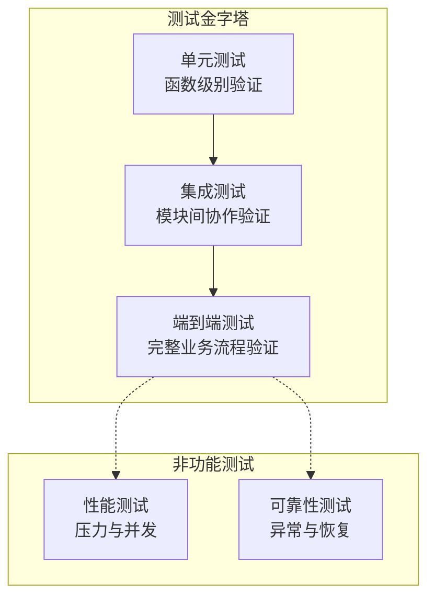
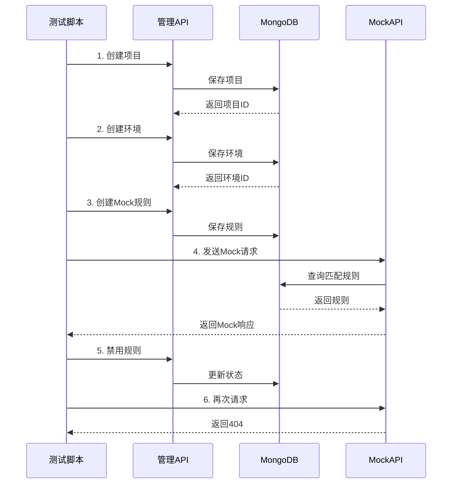
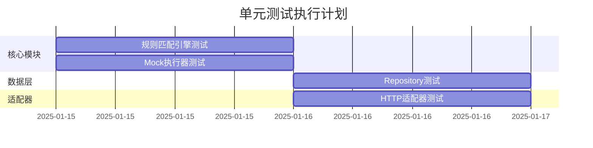
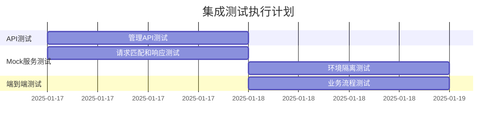
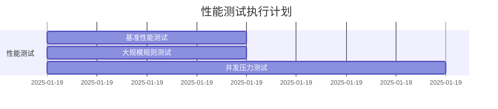
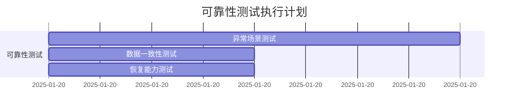
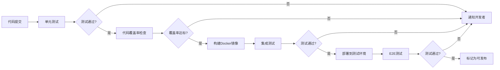
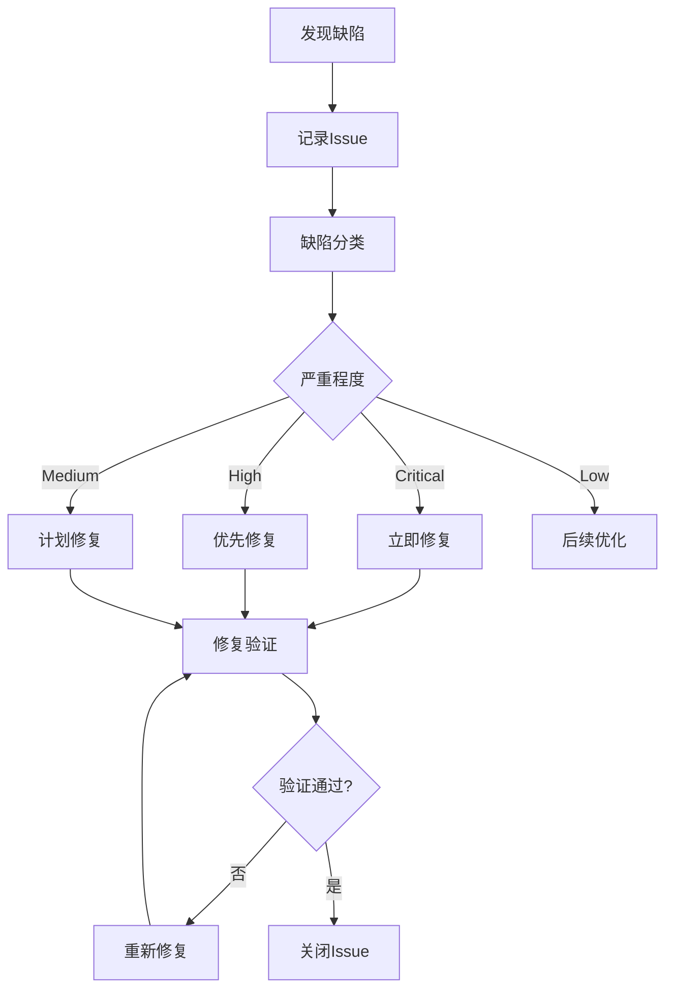

# Mock Server MVP 版本测试方案

## 方案概述

### 测试目标
对 Mock Server MVP 版本（v0.1.0）进行全面的质量保障，确保核心功能稳定可靠，为后续迭代提供坚实基础。

### 测试范围
- HTTP/HTTPS Mock 核心功能
- 规则匹配引擎准确性
- 管理 API 完整性
- 项目和环境隔离机制
- 数据持久化可靠性
- 系统性能和稳定性

### 测试策略
采用多层次测试体系，覆盖单元测试、集成测试、端到端测试和性能测试，确保代码质量和系统可靠性。

## 测试体系设计

### 测试层次架构



### 测试分层职责

| 测试层次 | 测试目标 | 覆盖率要求 | 执行频率 |
|---------|---------|-----------|---------|
| 单元测试 | 函数逻辑正确性 | 核心模块 > 80% | 每次提交 |
| 集成测试 | 模块协作正确性 | 关键路径 100% | 每次构建 |
| 端到端测试 | 业务流程完整性 | 主要场景 100% | 每日构建 |
| 性能测试 | 性能指标达标 | 关键接口 | 发布前 |

## 单元测试方案

### 测试覆盖模块

#### 1. 规则匹配引擎测试（engine/match_engine_test.go）

**测试场景分组**

| 测试组 | 测试场景 | 预期结果 |
|-------|---------|---------|
| HTTP方法匹配 | 精确匹配单个方法（GET） | 匹配成功 |
| HTTP方法匹配 | 匹配多个方法（GET/POST） | 两种方法均匹配成功 |
| HTTP方法匹配 | 不匹配的方法（PUT） | 匹配失败 |
| 路径匹配 | 精确路径匹配 /api/users | 匹配成功 |
| 路径匹配 | 路径参数匹配 /api/users/:id | 提取参数并匹配成功 |
| 路径匹配 | 多级路径参数 /api/:version/users/:id | 提取多个参数并匹配 |
| 路径匹配 | 路径不匹配 | 匹配失败 |
| Query参数匹配 | 单个参数匹配 status=active | 匹配成功 |
| Query参数匹配 | 多个参数匹配 | 所有参数匹配成功 |
| Query参数匹配 | 参数值不匹配 | 匹配失败 |
| Query参数匹配 | 缺少必需参数 | 匹配失败 |
| Header匹配 | Content-Type 匹配 | 匹配成功（不区分大小写） |
| Header匹配 | 自定义Header匹配 | 匹配成功 |
| Header匹配 | Header值不匹配 | 匹配失败 |
| IP白名单 | IP在白名单内 | 匹配成功 |
| IP白名单 | IP不在白名单内 | 匹配失败 |
| IP白名单 | CIDR范围匹配 192.168.1.0/24 | 范围内IP匹配成功 |
| 优先级排序 | 高优先级规则优先匹配 | 返回优先级高的规则 |
| 优先级排序 | 相同优先级按创建时间 | 返回较新的规则 |
| 组合条件 | Method + Path + Query 组合 | 全部条件满足时匹配 |
| 组合条件 | 部分条件不满足 | 匹配失败 |
| 边界条件 | 空规则列表 | 返回未找到 |
| 边界条件 | 所有规则禁用 | 返回未找到 |
| 边界条件 | 协议类型不匹配 | 跳过不匹配协议 |

**测试数据设计**

测试需要准备的Mock规则数据：
- 基础规则：覆盖不同HTTP方法和路径
- 优先级测试规则：相同条件不同优先级
- 复杂条件规则：包含Query、Header、IP限制的组合
- 边界情况规则：空值、特殊字符、超长路径

#### 2. Mock执行器测试（executor/mock_executor_test.go）

**测试场景分组**

| 测试组 | 测试场景 | 预期结果 |
|-------|---------|---------|
| 静态响应生成 | 返回JSON格式响应 | 正确解析并返回JSON |
| 静态响应生成 | 返回XML格式响应 | 正确返回XML内容 |
| 静态响应生成 | 返回HTML格式响应 | 正确返回HTML内容 |
| 静态响应生成 | 返回纯文本响应 | 正确返回文本内容 |
| 状态码处理 | 返回200成功状态 | 状态码正确 |
| 状态码处理 | 返回404错误状态 | 状态码正确 |
| 状态码处理 | 返回500服务错误 | 状态码正确 |
| 响应头设置 | 自定义Content-Type | Header正确设置 |
| 响应头设置 | 多个自定义Header | 所有Header正确设置 |
| 延迟配置 | 固定延迟100ms | 延迟时间在100-150ms之间 |
| 延迟配置 | 随机延迟50-200ms | 延迟时间在范围内 |
| 延迟配置 | 无延迟配置 | 立即返回 |
| 响应体处理 | 复杂嵌套JSON对象 | 正确序列化 |
| 响应体处理 | 数组响应 | 正确返回数组 |
| 响应体处理 | 空响应体 | 返回空内容 |
| 边界条件 | 超大响应体（>1MB） | 正确处理 |
| 边界条件 | 特殊字符处理 | 正确转义 |

#### 3. 协议适配器测试（adapter/http_adapter_test.go）

**测试场景分组**

| 测试组 | 测试场景 | 预期结果 |
|-------|---------|---------|
| 请求解析 | 解析GET请求 | 正确提取方法和路径 |
| 请求解析 | 解析POST请求及Body | 正确读取请求体 |
| 请求解析 | 解析Query参数 | 正确提取参数键值对 |
| 请求解析 | 解析请求头 | 正确提取所有Header |
| 请求解析 | 提取客户端IP | 正确获取真实IP |
| 响应构建 | 构建JSON响应 | 正确设置Content-Type和Body |
| 响应构建 | 构建带自定义Header的响应 | 所有Header正确设置 |
| 响应构建 | 设置状态码 | 状态码正确 |
| 边界条件 | 空请求体 | 正常处理 |
| 边界条件 | 超大请求体 | 正确读取 |
| 边界条件 | 非法JSON格式 | 作为原始数据处理 |

#### 4. 数据仓库测试（repository/*_test.go）

**RuleRepository 测试场景**

| 测试场景 | 验证点 | 预期结果 |
|---------|-------|---------|
| 创建规则 | 插入新规则 | 返回带ID的规则对象 |
| 创建规则 | 自动设置时间戳 | CreatedAt和UpdatedAt已设置 |
| 查询规则 | 按ID查询 | 返回正确的规则 |
| 查询规则 | 按项目和环境查询 | 返回该环境下所有规则 |
| 查询规则 | 仅查询启用规则 | 过滤禁用规则 |
| 查询规则 | 按优先级排序 | 返回有序列表 |
| 更新规则 | 修改规则内容 | 更新成功且UpdatedAt变更 |
| 更新规则 | 启用/禁用规则 | Enabled状态正确更新 |
| 删除规则 | 删除存在的规则 | 删除成功 |
| 分页查询 | 指定skip和limit | 返回正确数量和总数 |
| 边界条件 | 查询不存在的ID | 返回NotFound错误 |
| 边界条件 | 空环境查询 | 返回空列表 |

**ProjectRepository 测试场景**

| 测试场景 | 验证点 | 预期结果 |
|---------|-------|---------|
| 创建项目 | 插入新项目 | 返回带ID的项目对象 |
| 查询项目 | 按ID查询 | 返回正确的项目 |
| 查询项目 | 按工作空间查询 | 返回该空间下所有项目 |
| 更新项目 | 修改项目信息 | 更新成功 |
| 删除项目 | 删除项目 | 删除成功 |
| 列表查询 | 分页列表 | 返回分页结果 |

**EnvironmentRepository 测试场景**

| 测试场景 | 验证点 | 预期结果 |
|---------|-------|---------|
| 创建环境 | 插入新环境 | 返回带ID的环境对象 |
| 查询环境 | 按项目查询 | 返回该项目下所有环境 |
| 更新环境 | 修改环境配置 | 更新成功 |
| 删除环境 | 删除环境 | 删除成功 |

### 单元测试技术方案

**测试框架选择**

| 组件 | 技术选型 | 说明 |
|------|---------|------|
| 测试框架 | Go testing + testify | 标准库 + 断言增强 |
| Mock框架 | gomock | 接口Mock生成 |
| 数据库Mock | testcontainers-go | 真实MongoDB容器测试 |
| HTTP测试 | httptest | 标准库HTTP测试工具 |

**测试工具函数设计**

需要编写的通用测试辅助函数：
- Mock数据生成器：生成各类测试用的Rule、Project、Environment对象
- MongoDB测试容器管理器：启动/停止测试数据库
- HTTP请求构造器：快速构造测试请求
- 断言辅助函数：常用验证逻辑封装

**测试数据管理策略**

- 测试数据隔离：每个测试使用独立的数据库或集合
- 测试数据清理：测试后自动清理或使用事务回滚
- 测试数据fixture：预定义标准测试数据集

## 集成测试方案

### 测试场景设计

#### 1. 管理API集成测试

**项目管理流程测试**

| 测试场景 | 操作步骤 | 验证点 |
|---------|---------|-------|
| 完整项目生命周期 | 1. 创建项目<br/>2. 查询项目<br/>3. 更新项目<br/>4. 删除项目 | 每步操作成功且数据一致 |
| 项目列表查询 | 1. 创建多个项目<br/>2. 分页查询列表 | 分页正确，总数准确 |
| 工作空间隔离 | 1. 在不同workspace创建项目<br/>2. 按workspace查询 | 只返回指定空间项目 |

**环境管理流程测试**

| 测试场景 | 操作步骤 | 验证点 |
|---------|---------|-------|
| 完整环境生命周期 | 1. 创建项目<br/>2. 创建环境<br/>3. 查询环境<br/>4. 更新环境<br/>5. 删除环境 | 环境与项目正确关联 |
| 多环境管理 | 1. 为一个项目创建多个环境<br/>2. 查询项目的所有环境 | 返回所有环境列表 |
| 环境隔离验证 | 不同环境有独立的规则集 | 规则不跨环境访问 |

**规则管理流程测试**

| 测试场景 | 操作步骤 | 验证点 |
|---------|---------|-------|
| 完整规则生命周期 | 1. 创建规则<br/>2. 查询规则<br/>3. 更新规则<br/>4. 启用/禁用<br/>5. 删除规则 | 所有操作成功 |
| 规则列表查询 | 1. 创建多条规则<br/>2. 按项目查询<br/>3. 按环境查询 | 过滤条件正确 |
| 规则优先级管理 | 1. 创建不同优先级规则<br/>2. 查询时验证排序 | 按优先级降序排列 |

#### 2. Mock服务集成测试

**请求匹配和响应测试**

| 测试场景 | 前置条件 | 测试请求 | 验证点 |
|---------|---------|---------|-------|
| 简单GET请求匹配 | 创建GET /api/users规则 | GET /{project}/{env}/api/users | 返回配置的Mock响应 |
| 路径参数匹配 | 创建GET /api/users/:id规则 | GET /{project}/{env}/api/users/123 | 返回Mock响应 |
| POST请求匹配 | 创建POST /api/users规则 | POST /{project}/{env}/api/users + Body | 返回201响应 |
| Query参数匹配 | 创建规则要求status=active | GET /api/users?status=active | 匹配成功 |
| Query参数不匹配 | 创建规则要求status=active | GET /api/users?status=inactive | 返回404 |
| Header匹配 | 创建规则要求特定Header | 带匹配Header请求 | 匹配成功 |
| Header不匹配 | 创建规则要求特定Header | 缺少Header的请求 | 返回404 |
| 多条件组合匹配 | Method+Path+Query+Header规则 | 所有条件满足的请求 | 匹配成功 |
| 优先级匹配 | 创建重叠的高低优先级规则 | 符合两条规则的请求 | 返回高优先级规则响应 |
| 无匹配规则 | 有规则但不匹配 | 不符合任何规则的请求 | 返回404错误 |

**响应特性测试**

| 测试场景 | 配置 | 验证点 |
|---------|-----|-------|
| JSON响应 | 配置JSON响应体 | Content-Type正确，Body可解析 |
| XML响应 | 配置XML响应体 | Content-Type和格式正确 |
| 自定义状态码 | 配置404状态码 | 返回指定状态码 |
| 自定义响应头 | 配置多个Header | 所有Header正确返回 |
| 固定延迟 | 配置100ms延迟 | 响应时间约100ms |
| 随机延迟 | 配置50-200ms延迟 | 多次请求延迟在范围内 |

**环境隔离测试**

| 测试场景 | 前置条件 | 测试操作 | 预期结果 |
|---------|---------|---------|---------|
| 不同环境独立规则 | 同项目的dev和test环境各有规则 | 访问dev环境路径 | 只匹配dev环境规则 |
| 环境不存在 | 访问不存在的环境ID | 发送Mock请求 | 返回404或错误 |
| 项目隔离 | 不同项目有同名环境 | 访问各自环境 | 规则不互相干扰 |

#### 3. 端到端业务流程测试

**典型用户场景测试**



**场景1：用户API Mock完整流程**

步骤序列：
1. 创建"用户服务"项目
2. 创建"开发环境"
3. 创建"获取用户列表"Mock规则（GET /api/users）
4. 创建"获取用户详情"Mock规则（GET /api/users/:id）
5. 创建"创建用户"Mock规则（POST /api/users）
6. 发送GET请求测试用户列表
7. 发送GET请求测试用户详情
8. 发送POST请求测试创建用户
9. 更新"获取用户列表"规则，修改响应数据
10. 再次请求验证新响应
11. 禁用"创建用户"规则
12. 发送POST请求验证规则已禁用（应返回404）
13. 删除项目

验证点：
- 每个步骤操作成功
- Mock响应与配置一致
- 规则更新实时生效
- 禁用规则立即停止匹配
- 删除项目后相关数据清除

**场景2：多环境并行使用**

步骤序列：
1. 创建"订单服务"项目
2. 创建"开发环境"和"测试环境"
3. 在开发环境创建规则：GET /api/orders 返回开发数据
4. 在测试环境创建规则：GET /api/orders 返回测试数据
5. 发送请求到开发环境
6. 发送请求到测试环境
7. 验证两个环境返回不同数据

验证点：
- 环境间规则完全隔离
- 响应数据符合各自环境配置
- 同一项目的不同环境互不干扰

**场景3：规则优先级验证**

步骤序列：
1. 创建项目和环境
2. 创建低优先级规则（Priority=50）：GET /api/test 返回"低优先级"
3. 创建高优先级规则（Priority=100）：GET /api/test 返回"高优先级"
4. 发送请求到 /api/test
5. 验证返回"高优先级"响应
6. 禁用高优先级规则
7. 再次发送请求
8. 验证返回"低优先级"响应

验证点：
- 高优先级规则优先匹配
- 禁用高优先级后低优先级生效

### 集成测试技术方案

**测试环境准备**

| 组件 | 部署方式 | 说明 |
|------|---------|------|
| Mock Server | 启动实际服务 | 使用测试配置启动完整服务 |
| MongoDB | Docker容器 | 每次测试使用独立容器 |
| HTTP客户端 | Go net/http | 发送真实HTTP请求 |

**测试数据管理**

- 每个测试套件使用独立数据库
- 测试开始前清空数据库
- 测试结束后清理测试数据
- 使用固定的测试项目ID和环境ID便于调试

**测试辅助工具**

需要开发的测试工具类：
- APIClient：封装管理API调用
- MockClient：封装Mock服务调用
- TestDataBuilder：构建测试数据的Builder模式类
- AssertionHelper：业务级别的断言辅助函数

## 性能测试方案

### 性能测试目标

| 性能指标 | 目标值 | 测试场景 |
|---------|-------|---------|
| HTTP请求QPS | > 10,000 | 简单规则匹配 |
| 平均响应时间 | < 10ms | 无延迟配置 |
| P95响应时间 | < 30ms | 正常负载 |
| P99响应时间 | < 50ms | 正常负载 |
| 并发连接数 | > 5,000 | 持续压力测试 |
| 规则匹配性能 | < 5ms | 100条规则场景 |
| 数据库查询 | < 10ms | 规则查询操作 |

### 性能测试场景

#### 1. Mock服务性能测试

**场景1：基准性能测试**

测试配置：
- 规则数量：10条简单规则
- 并发用户：100
- 测试时长：60秒
- 请求分布：均匀访问各个规则

验证指标：
- QPS达到10,000以上
- 平均响应时间 < 10ms
- 错误率 < 0.1%

**场景2：大规模规则匹配测试**

测试配置：
- 规则数量：1,000条规则
- 并发用户：500
- 测试时长：300秒
- 请求分布：按优先级排列，高优先级规则匹配概率高

验证指标：
- QPS > 5,000
- P99响应时间 < 100ms
- 匹配准确率 100%

**场景3：响应延迟性能测试**

测试配置：
- 规则配置：50%规则有100ms固定延迟
- 并发用户：200
- 测试时长：120秒

验证指标：
- 有延迟的请求响应时间约100ms
- 无延迟的请求响应时间 < 10ms
- 系统资源使用正常

**场景4：并发压力测试**

测试配置：
- 并发用户：从100逐步增加到5,000
- 每个阶梯持续60秒
- 监控系统资源使用

验证指标：
- 确定系统最大并发容量
- 识别性能瓶颈点
- CPU使用率 < 80%
- 内存使用 < 2GB

#### 2. 管理API性能测试

**场景1：规则CRUD性能测试**

测试操作：
- 批量创建规则：1,000条
- 批量查询规则：分页查询
- 批量更新规则：修改配置
- 批量删除规则

验证指标：
- 创建操作 < 50ms per request
- 查询操作 < 20ms per request
- 更新操作 < 50ms per request
- 删除操作 < 30ms per request

**场景2：列表查询性能测试**

测试配置：
- 数据量：10,000条规则
- 分页大小：20条/页
- 并发查询：100

验证指标：
- 首页查询 < 20ms
- 中间页查询 < 30ms
- 尾页查询 < 50ms

### 性能测试工具和方法

**测试工具选择**

| 工具 | 用途 | 说明 |
|------|-----|------|
| Apache JMeter | HTTP压力测试 | 配置测试计划和并发场景 |
| wrk | 命令行压测 | 快速基准测试 |
| Go benchmark | 单元性能测试 | 核心函数性能测试 |
| pprof | 性能分析 | CPU和内存分析 |

**性能监控指标**

需要监控的系统指标：
- CPU使用率
- 内存使用量
- 网络IO
- 磁盘IO
- MongoDB连接数
- Goroutine数量
- GC暂停时间

**性能测试执行流程**


## 可靠性测试方案

### 异常场景测试

| 测试场景 | 异常注入 | 预期行为 |
|---------|---------|---------|
| 数据库连接失败 | MongoDB不可用 | 返回服务不可用错误，不崩溃 |
| 数据库连接中断 | 运行中断开连接 | 自动重连或返回错误 |
| 非法请求处理 | 发送畸形HTTP请求 | 返回400错误，不崩溃 |
| 超大请求体 | 发送10MB请求体 | 拒绝或正确处理 |
| 非法规则配置 | 创建无效规则 | 返回验证错误 |
| 并发创建冲突 | 同时创建同名项目 | 一个成功，其他返回冲突错误 |
| 规则查询超时 | 模拟慢查询 | 超时返回错误 |
| 内存泄漏测试 | 长时间运行 | 内存使用稳定 |
| 协程泄漏测试 | 大量并发请求 | Goroutine数量回落正常 |

### 数据一致性测试

| 测试场景 | 验证点 |
|---------|-------|
| 规则更新一致性 | 更新后立即查询，数据一致 |
| 删除级联验证 | 删除项目后，关联环境和规则是否处理 |
| 并发更新冲突 | 同时更新同一规则，数据不错乱 |
| 事务完整性 | 操作失败时数据不残留 |

### 恢复能力测试

| 测试场景 | 操作步骤 | 预期结果 |
|---------|---------|---------|
| 服务重启恢复 | 1. 创建规则<br/>2. 重启服务<br/>3. 发送Mock请求 | 规则持久化，服务正常工作 |
| 数据库故障恢复 | 1. 数据库故障<br/>2. 恢复数据库<br/>3. 服务自动恢复 | 服务恢复正常 |

## 测试执行计划

### 测试环境要求

| 环境组件 | 配置要求 |
|---------|---------|
| 操作系统 | Linux/macOS |
| Go版本 | 1.21+ |
| MongoDB | 6.0+ |
| 内存 | 最少4GB可用 |
| CPU | 4核心 |
| 网络 | 本地环境 |

### 测试执行步骤

**阶段一：单元测试（预计2天）**



1. 编写测试用例（engine、executor、adapter、repository）
2. 准备测试数据和Mock对象
3. 执行测试并收集覆盖率报告
4. 修复发现的问题
5. 达到80%代码覆盖率目标

**阶段二：集成测试（预计2天）**



1. 启动测试环境（Docker Compose）
2. 执行管理API集成测试
3. 执行Mock服务集成测试
4. 执行端到端业务流程测试
5. 记录测试结果和问题

**阶段三：性能测试（预计1天）**



1. 准备性能测试环境和数据
2. 执行基准性能测试
3. 执行大规模规则匹配测试
4. 执行并发压力测试
5. 收集性能数据并分析

**阶段四：可靠性测试（预计1天）**



1. 执行异常场景测试
2. 执行数据一致性测试
3. 执行恢复能力测试
4. 记录问题和改进建议

### 测试交付物

| 交付物 | 说明 | 格式 |
|-------|------|------|
| 单元测试代码 | 所有*_test.go文件 | Go代码 |
| 集成测试脚本 | API和E2E测试脚本 | Go代码 + Shell脚本 |
| 性能测试脚本 | JMeter测试计划 | JMX文件 |
| 测试数据集 | 标准测试数据 | JSON文件 |
| 测试报告 | 测试执行结果汇总 | Markdown文档 |
| 覆盖率报告 | 代码覆盖率统计 | HTML报告 |
| 性能测试报告 | 性能指标和分析 | PDF文档 |
| 问题清单 | 发现的缺陷列表 | Issue列表 |

## 测试自动化方案

### CI/CD集成

**测试流水线设计**



**Makefile测试命令**

需要提供的测试命令：
- `make test-unit`：运行单元测试
- `make test-integration`：运行集成测试
- `make test-e2e`：运行端到端测试
- `make test-all`：运行所有测试
- `make test-coverage`：生成覆盖率报告
- `make test-performance`：运行性能测试

**测试覆盖率要求**

| 模块 | 覆盖率目标 |
|------|-----------|
| engine | > 85% |
| executor | > 80% |
| adapter | > 75% |
| repository | > 80% |
| service | > 70% |
| api | > 75% |
| 整体平均 | > 80% |

### 持续测试监控

**测试指标监控**

需要跟踪的指标：
- 测试通过率趋势
- 代码覆盖率变化
- 测试执行时间
- 新增/修复的缺陷数量
- 性能指标变化趋势

**测试报告自动生成**

- 每次构建自动生成测试报告
- 覆盖率报告发布到静态页面
- 性能测试结果趋势图表
- 失败测试详细日志

## 测试质量保障

### 测试评审检查点

| 检查项 | 标准 |
|-------|------|
| 测试覆盖完整性 | 核心功能100%覆盖 |
| 测试用例质量 | 包含正常、边界、异常场景 |
| 断言有效性 | 每个测试有明确断言 |
| 测试独立性 | 测试间无依赖 |
| 测试可维护性 | 代码清晰，易于理解 |
| 测试数据管理 | 测试数据隔离和清理 |
| 性能基准合理性 | 性能目标符合实际 |

### 缺陷管理流程



**缺陷优先级定义**

| 级别 | 定义 | 响应时间 |
|------|------|---------|
| Critical | 系统崩溃、数据丢失 | 立即处理 |
| High | 核心功能不可用 | 24小时内 |
| Medium | 功能部分异常 | 3天内 |
| Low | 小问题、优化建议 | 计划处理 |

## 测试风险和应对

### 潜在风险识别

| 风险 | 影响 | 概率 | 应对措施 |
|------|------|------|---------|
| 测试环境不稳定 | 测试结果不可靠 | 中 | 使用Docker保证环境一致性 |
| 测试数据准备复杂 | 测试开发时间长 | 高 | 开发数据生成工具 |
| 性能测试环境资源不足 | 无法达到压测目标 | 中 | 申请云资源或优化测试规模 |
| MongoDB版本兼容问题 | 测试环境与生产不一致 | 低 | 统一使用6.0版本 |
| 并发测试不稳定 | 偶现测试失败 | 中 | 增加重试机制和并发控制 |
| 测试覆盖率不足 | 遗漏缺陷 | 中 | 定期审查测试覆盖情况 |

### 质量保障措施

- 测试代码也需要代码审查
- 定期运行全量测试套件
- 关键路径必须有自动化测试
- 性能基准测试纳入CI
- 建立测试失败快速响应机制
- 维护测试知识库和最佳实践

## 附录：测试工具和资源

### 推荐测试库

| 库名 | 用途 | 安装命令 |
|------|------|---------|
| testify | 断言和Mock | `go get github.com/stretchr/testify` |
| gomock | 接口Mock | `go get github.com/golang/mock/gomock` |
| testcontainers-go | 容器化测试 | `go get github.com/testcontainers/testcontainers-go` |
| httpexpect | HTTP API测试 | `go get github.com/gavv/httpexpect/v2` |

### 测试数据示例

**标准测试项目配置**

```
项目ID: test-project-001
项目名称: 测试项目
工作空间: test-workspace
```

**标准测试环境配置**

```
环境ID: test-env-dev
环境名称: 开发环境
项目ID: test-project-001
```

**标准测试规则配置**

```
规则ID: test-rule-001
规则名称: 用户列表接口
协议: HTTP
方法: GET
路径: /api/users
优先级: 100
响应状态码: 200
响应内容类型: JSON
```

### 参考文档

- Go Testing官方文档：https://golang.org/pkg/testing/
- Testify文档：https://github.com/stretchr/testify
- JMeter性能测试指南：https://jmeter.apache.org/usermanual/
- MongoDB测试最佳实践：https://www.mongodb.com/docs/manual/testing/
