# 项目文档更新与 GitHub 推送设计文档

## 需求概述

根据项目当前进展，更新项目的主要文档，确保文档内容与代码实现保持一致，并将更新后的所有内容推送到 GitHub。

## 背景分析

### 当前项目状态

**版本信息**：
- 当前代码版本：v0.1.3（开发中）
- 最新发布版本：v0.1.1
- Go 版本：1.24.0

**已完成功能**：
1. HTTP/HTTPS 协议支持（v0.1.0）
2. MongoDB 持久化（v0.1.0）
3. RESTful 管理 API（v0.1.0）
4. 测试覆盖率提升至 70%+（v0.1.1）
5. 统一错误码体系（v0.1.1）
6. Web 管理界面（v0.1.3 - 进行中）
7. 统计分析 API（v0.1.3 - 进行中）
8. 一键启动脚本（v0.1.3 - 进行中）

**前端技术栈**：
- React 18 + TypeScript 5
- Vite 5 + Ant Design 5
- React Router 6 + Zustand 4
- TanStack Query 5 + Axios 1
- ECharts 5（图表展示）

### 文档缺口识别

通过对比代码实现与文档内容，识别出以下文档更新需求：

| 文档文件 | 现状 | 需要更新的内容 |
|---------|------|--------------|
| README.md | 部分过时 | 版本号、功能特性、前端说明、技术栈 |
| CHANGELOG.md | 未完成 v0.1.3 | 补充 v0.1.3 正式发布说明 |
| PROJECT_SUMMARY.md | 版本号过时 | 版本信息、前端架构、项目结构 |
| DEPLOYMENT.md | 缺少前端部署 | 前端部署说明、全栈部署方案 |
| go.mod | 准确 | Go 版本为 1.24.0（无需修改） |
| web/frontend/README.md | 准确 | 内容完整（无需修改） |

## 设计目标

### 主要目标

1. **文档准确性**：确保所有文档反映当前代码实现和功能状态
2. **版本一致性**：统一版本号为 v0.1.3
3. **信息完整性**：补充前端相关的技术栈、架构、部署信息
4. **可用性提升**：优化文档结构，提高可读性和实用性

### 成功标准

- 所有主要文档版本号统一为 v0.1.3
- CHANGELOG.md 完整记录 v0.1.3 的所有变更
- README.md 包含前端管理界面的完整说明
- DEPLOYMENT.md 提供全栈部署方案
- PROJECT_SUMMARY.md 反映最新的项目状态和架构

## 文档更新方案

### 1. README.md 更新

**更新内容概要**：

| 章节 | 变更类型 | 变更说明 |
|-----|---------|---------|
| 版本信息 | 修改 | v0.1.0 → v0.1.3 |
| 特性列表 | 新增 | 补充 Web 管理界面、统计分析 API |
| 快速开始 | 优化 | 强化一键启动方式，补充前端访问说明 |
| API 文档 | 新增 | 补充统计分析 API 表格 |
| 开发计划 | 修改 | 更新已完成功能清单 |

**详细变更点**：

```
第 7 行：当前版本（v0.1.0 - MVP）→ 当前版本（v0.1.3）

第 19-20 行：
- ✅ **Web 管理界面**：React + TypeScript + Ant Design
- ✅ **统计分析 API**：Dashboard 统计、项目统计、规则统计等
调整状态标记：从未来规划 → 当前版本已完成

第 60-73 行：
突出强调"一键启动"为推荐方式，说明访问地址：
- 前端管理界面：http://localhost:5173
- 后端管理 API：http://localhost:8080/api/v1
- Mock 服务 API：http://localhost:9090

第 270-278 行：
新增统计分析 API 表格（5 个接口）

第 404-412 行：
更新已完成功能清单，增加：
- ✅ Web 管理界面（v0.1.3）
- ✅ 统计分析 API（v0.1.3）
- ✅ 一键启动脚本（v0.1.3）
```

### 2. CHANGELOG.md 更新

**更新内容概要**：

| 章节 | 变更类型 | 变更说明 |
|-----|---------|---------|
| Unreleased | 删除 | 移除"In Progress - v0.1.3"部分 |
| [0.1.3] | 新增 | 正式发布说明，包含完整功能清单 |
| 未来版本规划 | 调整 | 更新 v0.1.4、v0.2.0 规划内容 |

**v0.1.3 发布说明结构**：

```
## [0.1.3] - 2025-11-XX

### 🎨 Sprint 03: 全栈管理界面

本版本为为期 2 周的开发迭代，主要目标是提供完整的 Web 管理界面和统计分析能力。

### ✨ Added（核心功能）

#### Web 管理界面
- 技术栈：React 18 + TypeScript 5 + Vite 5 + Ant Design 5
- 完整功能模块：
  * Dashboard 仪表盘（统计概览、图表展示）
  * 项目管理（创建、编辑、删除、查询）
  * 环境管理（多环境配置）
  * Mock 规则管理（可视化配置界面）
  * Mock 测试（在线测试工具）
  * 设置（系统配置）

#### 统计分析 API
- 5 个统计端点：
  * GET /api/v1/statistics/dashboard
  * GET /api/v1/statistics/projects
  * GET /api/v1/statistics/rules
  * GET /api/v1/statistics/request-trend
  * GET /api/v1/statistics/response-time-distribution

#### 开发环境增强
- config.dev.yaml：本地开发专用配置
- Makefile 全栈启动命令：
  * make start-all：一键启动全栈应用
  * make stop-all：停止所有服务并清理端口
  * make start-frontend：启动前端开发服务器
  * make stop-frontend：停止前端服务

### 🔧 Improvements（改进）

#### 服务启动优化
- 健康检查端点验证服务状态
- 智能端口清理机制
- 详细的启动日志和状态提示

#### 进程管理优化
- nohup 后台运行进程
- PID 文件跟踪（/tmp/*.pid）
- 日志输出到 /tmp 便于调试

### 📊 Statistics（统计）

- 新增代码：约 3,500 行
  * 前端代码：约 2,800 行（React + TypeScript）
  * 统计 API：约 400 行
  * Makefile 增强：约 200 行
  * 配置文件：约 100 行

- 新增文件：
  * web/frontend/ - 完整前端项目
  * config.dev.yaml - 开发环境配置
  * internal/api/statistics_handler.go
  * internal/api/statistics_handler_test.go

### 🐛 Fixed（修复）

- 修复 MongoDB 连接问题（本地开发使用 localhost）
- 修复 admin_service_test.go 编译错误
- 修复 Makefile PID 检测失败问题
- 修复端口占用问题
- 修复前端 404 错误（实现统计 API）

### 🚧 Known Issues（已知问题）

- 统计 API 中的请求日志功能待实现
- 响应时间分布数据为模拟数据
- 前端暂未实现用户认证功能

### 🚀 What's Next

v0.1.4 规划：
- 请求日志记录功能
- 请求统计分析
- 响应时间监控
- 规则导入导出功能集成
```

### 3. PROJECT_SUMMARY.md 更新

**更新内容概要**：

| 章节 | 变更类型 | 变更说明 |
|-----|---------|---------|
| 项目概述 | 修改 | MVP → v0.1.3（全栈管理界面版本） |
| 已完成功能 | 新增 | 补充 Web 管理界面、统计分析 API |
| 技术架构 | 新增 | 补充前端技术栈表格 |
| 项目结构 | 修改 | 更新目录结构，补充 web/frontend |
| 已知限制 | 修改 | 移除"无 Web UI"限制 |
| 最后更新 | 修改 | 更新日期为当前日期 |

**前端技术栈表格**：

```
| 组件 | 技术选型 | 说明 |
|------|---------|------|
| 框架 | React 18 | 声明式 UI 框架 |
| 语言 | TypeScript 5 | 类型安全 |
| 构建工具 | Vite 5 | 快速开发和构建 |
| UI 组件库 | Ant Design 5 | 企业级 UI 组件 |
| 路由 | React Router 6 | 单页应用路由 |
| 状态管理 | Zustand 4 | 轻量级状态管理 |
| 数据请求 | TanStack Query 5 | 服务端状态管理 |
| HTTP 客户端 | Axios 1 | HTTP 请求库 |
| 图表 | ECharts 5 | 数据可视化 |
```

### 4. DEPLOYMENT.md 更新

**更新内容概要**：

| 章节 | 变更类型 | 变更说明 |
|-----|---------|---------|
| Docker Compose 部署 | 修改 | 补充前端访问说明 |
| 本地部署 | 新增 | 增加全栈本地部署章节 |
| 配置说明 | 优化 | 补充 config.dev.yaml 说明 |
| 运维管理 | 新增 | 增加前端日志管理说明 |

**全栈本地部署章节结构**：

```
### 全栈本地部署

适合需要同时开发前后端的场景。

#### 方式一：一键启动（推荐）

1. 确保已安装前置依赖
   - Go 1.21+
   - Node.js 18+
   - MongoDB 6.0+（或使用 Docker）

2. 启动全部服务
   ```bash
   make start-all
   ```

3. 访问服务
   - 前端管理界面：http://localhost:5173
   - 后端管理 API：http://localhost:8080/api/v1
   - Mock 服务 API：http://localhost:9090

4. 停止所有服务
   ```bash
   make stop-all
   ```

#### 方式二：分步启动

1. 启动 MongoDB
   ```bash
   make start-mongo
   ```

2. 启动后端（新终端）
   ```bash
   make start-backend
   ```

3. 启动前端（新终端）
   ```bash
   make start-frontend
   ```

#### 方式三：手动启动（调试模式）

1. 启动 MongoDB
   ```bash
   docker run -d -p 27017:27017 --name mongodb mongo:6.0
   ```

2. 启动后端
   ```bash
   cd /path/to/gomockserver
   go run cmd/mockserver/main.go -config config.dev.yaml
   ```

3. 启动前端
   ```bash
   cd web/frontend
   npm install
   npm run dev
   ```

#### 前端独立部署

如果只需要部署前端（后端已部署）：

1. 构建前端
   ```bash
   cd web/frontend
   npm install
   npm run build
   ```

2. 构建产物位于 `web/dist` 目录

3. 部署到静态服务器（Nginx/Apache/CDN）

4. 配置 API 代理（Nginx 示例）：
   ```nginx
   location /api {
       proxy_pass http://backend-server:8080;
   }
   ```
```

## GitHub 推送方案

### 推送策略

**分支策略**：

```
main (production)
  ← develop (integration)
      ← feature/v0.1.3-docs-update (文档更新分支)
```

**推送流程**：

```mermaid
graph LR
    A[创建文档更新分支] --> B[更新文档文件]
    B --> C[本地验证]
    C --> D[提交变更]
    D --> E[推送到远程仓库]
    E --> F[创建 Pull Request]
    F --> G[代码审查]
    G --> H[合并到 develop]
    H --> I[合并到 main]
    I --> J[打 Tag: v0.1.3]
```



### 提交信息规范

**Commit Message 格式**：

```
<type>(<scope>): <subject>

<body>

<footer>
```

**类型（type）定义**：

| 类型 | 说明 | 示例 |
|------|------|------|
| docs | 文档更新 | docs(readme): update feature list for v0.1.3 |
| feat | 新增功能 | feat(frontend): add dashboard page |
| fix | 修复缺陷 | fix(api): resolve statistics endpoint error |
| chore | 构建/工具变动 | chore(makefile): add start-all command |

**本次更新的 Commit Messages**：

```
1. docs(readme): update version to v0.1.3 and feature list
   
   - Update current version from v0.1.0 to v0.1.3
   - Add Web UI and Statistics API to feature list
   - Enhance quick start section with frontend access info
   - Add statistics API endpoints table

2. docs(changelog): add v0.1.3 release notes
   
   - Move in-progress v0.1.3 content to formal release section
   - Add complete feature list for Sprint 03
   - Document Web UI implementation details
   - Record statistics API endpoints
   - List all bug fixes and improvements

3. docs(summary): update project summary for v0.1.3
   
   - Add frontend technology stack table
   - Update project structure with web/frontend
   - Update completed features list
   - Remove "no Web UI" from known limitations
   - Update last modified date

4. docs(deployment): add full-stack deployment guide
   
   - Add full-stack local deployment section
   - Document one-command startup method
   - Add frontend-only deployment guide
   - Include Nginx proxy configuration example
```

### 推送命令序列

**步骤一：创建并切换分支**

```bash
git checkout -b feature/v0.1.3-docs-update
```

**步骤二：更新文档文件**

按照设计方案依次更新以下文件：
1. README.md
2. CHANGELOG.md
3. PROJECT_SUMMARY.md
4. DEPLOYMENT.md

**步骤三：分批提交变更**

```bash
# 提交 README.md 更新
git add README.md
git commit -m "docs(readme): update version to v0.1.3 and feature list

- Update current version from v0.1.0 to v0.1.3
- Add Web UI and Statistics API to feature list
- Enhance quick start section with frontend access info
- Add statistics API endpoints table"

# 提交 CHANGELOG.md 更新
git add CHANGELOG.md
git commit -m "docs(changelog): add v0.1.3 release notes

- Move in-progress v0.1.3 content to formal release section
- Add complete feature list for Sprint 03
- Document Web UI implementation details
- Record statistics API endpoints
- List all bug fixes and improvements"

# 提交 PROJECT_SUMMARY.md 更新
git add PROJECT_SUMMARY.md
git commit -m "docs(summary): update project summary for v0.1.3

- Add frontend technology stack table
- Update project structure with web/frontend
- Update completed features list
- Remove 'no Web UI' from known limitations
- Update last modified date"

# 提交 DEPLOYMENT.md 更新
git add DEPLOYMENT.md
git commit -m "docs(deployment): add full-stack deployment guide

- Add full-stack local deployment section
- Document one-command startup method
- Add frontend-only deployment guide
- Include Nginx proxy configuration example"
```

**步骤四：推送到远程仓库**

```bash
git push origin feature/v0.1.3-docs-update
```

**步骤五：创建 Pull Request**

通过 GitHub Web 界面创建 Pull Request：
- 标题：`docs: update documentation for v0.1.3 release`
- 描述模板：

```markdown
## 变更类型
- [x] 文档更新

## 变更说明
更新项目主要文档以反映 v0.1.3 版本的最新功能和状态。

## 变更内容

### README.md
- 更新版本号：v0.1.0 → v0.1.3
- 补充 Web 管理界面和统计分析 API 功能说明
- 优化快速开始章节，强调一键启动方式
- 新增统计分析 API 接口表格

### CHANGELOG.md
- 正式发布 v0.1.3 版本说明
- 完整记录 Sprint 03 的所有功能、改进和修复
- 补充代码统计和已知问题

### PROJECT_SUMMARY.md
- 新增前端技术栈表格
- 更新项目结构和已完成功能清单
- 移除"无 Web UI"限制说明

### DEPLOYMENT.md
- 新增全栈本地部署章节
- 补充一键启动命令说明
- 增加前端独立部署指南

## 验证方式
- [x] 文档链接检查通过
- [x] Markdown 格式验证通过
- [x] 版本号统一为 v0.1.3

## 相关 Issue
Closes #XX（如有关联 Issue）
```

**步骤六：合并和打标签**

Pull Request 审查通过后：

```bash
# 切换到 develop 分支
git checkout develop
git pull origin develop

# 合并文档更新分支
git merge --no-ff feature/v0.1.3-docs-update

# 推送到远程 develop 分支
git push origin develop

# 切换到 main 分支（生产分支）
git checkout main
git pull origin main

# 合并 develop 分支
git merge --no-ff develop

# 推送到远程 main 分支
git push origin main

# 打版本标签
git tag -a v0.1.3 -m "Release version 0.1.3 - Full-stack management interface

Major changes:
- Web management UI (React + TypeScript + Ant Design)
- Statistics API (5 endpoints)
- One-command startup (make start-all)
- Development environment enhancements"

# 推送标签到远程
git push origin v0.1.3
```

### GitHub Release 创建

在 GitHub 仓库创建正式 Release：

**Release 信息**：

- **Tag**：v0.1.3
- **Release Title**：v0.1.3 - 全栈管理界面版本
- **Description**：从 CHANGELOG.md 的 v0.1.3 章节复制内容

**附件**：
- 源代码自动打包（.zip、.tar.gz）
- 可选：构建后的前端静态文件压缩包

## 验证清单

### 文档质量验证

| 检查项 | 验证方法 | 通过标准 |
|--------|---------|---------|
| 版本号一致性 | 全文搜索版本号 | 所有文档统一为 v0.1.3 |
| Markdown 格式 | Markdown Linter | 无格式错误 |
| 链接有效性 | 链接检查工具 | 所有内部链接可访问 |
| 代码示例正确性 | 手动执行命令 | 命令可正常执行 |
| 技术信息准确性 | 对比源代码 | 与代码实现一致 |

### Git 提交验证

| 检查项 | 验证方法 | 通过标准 |
|--------|---------|---------|
| Commit Message 规范 | 格式检查 | 符合约定式提交规范 |
| 文件变更范围 | git diff | 仅包含文档文件 |
| 提交原子性 | 每个 commit | 单一职责，易于回滚 |
| 分支命名 | 分支名称 | 符合 feature/* 规范 |

### 推送验证

| 检查项 | 验证方法 | 通过标准 |
|--------|---------|---------|
| 远程推送成功 | git push 结果 | 无冲突，推送成功 |
| Pull Request 创建 | GitHub 页面 | PR 正确创建 |
| CI/CD 检查 | GitHub Actions | 所有检查通过（如有） |
| 代码审查 | Review 流程 | 至少一人审查通过 |

## 风险与应对

### 风险识别

| 风险 | 可能性 | 影响 | 应对策略 |
|------|-------|------|---------|
| 文档与代码实现不一致 | 中 | 高 | 详细对比代码，逐项验证 |
| 版本号遗漏 | 低 | 中 | 使用全局搜索确认所有版本号 |
| Git 冲突 | 中 | 低 | 推送前先 pull，及时解决冲突 |
| 链接失效 | 低 | 低 | 使用链接检查工具验证 |
| Commit Message 不规范 | 低 | 低 | 参照规范模板编写 |

### 回退方案

如果发现文档更新有误：

**场景一：尚未推送到远程**

```bash
# 撤销最后一次提交（保留修改）
git reset --soft HEAD~1

# 或撤销所有提交（丢弃修改）
git reset --hard HEAD~n
```

**场景二：已推送但未合并**

```bash
# 删除远程分支
git push origin --delete feature/v0.1.3-docs-update

# 本地重新修改后再次推送
```

**场景三：已合并到 develop/main**

```bash
# 创建修复分支
git checkout -b hotfix/v0.1.3-docs-fix

# 修改文档
# 提交并推送
git commit -m "docs: fix incorrect information in v0.1.3 docs"
git push origin hotfix/v0.1.3-docs-fix

# 创建新的 Pull Request
```

**场景四：已打标签和 Release**

```bash
# 删除本地标签
git tag -d v0.1.3

# 删除远程标签
git push origin --delete v0.1.3

# 删除 GitHub Release（通过 Web 界面）
# 修复文档后重新打标签
```

## 后续行动

### 文档维护机制

**定期更新**：
- 每次 Sprint 结束后更新 CHANGELOG.md 和 PROJECT_SUMMARY.md
- 每次版本发布前更新 README.md
- 新增功能模块后更新 DEPLOYMENT.md

**变更追踪**：
- 在开发任务中包含文档更新子任务
- Code Review 时检查文档是否同步更新
- 使用 GitHub Issue 追踪文档缺陷

### 文档归档

根据项目规范（memory id: 44e1c6c7-b982-4ee7-9c32-2407cd5d7b22），建议将旧版本文档归档：

**归档目录结构**：

```
docs/archive/
├── milestones/
│   └── v0.1.0-mvp.md
│   └── v0.1.1-quality-improvement.md
├── releases/
│   └── RELEASE_NOTES_v0.1.0.md
│   └── RELEASE_NOTES_v0.1.1.md
└── testing/
    └── functional_test_report_*.md
```

**归档操作**：

```bash
# 移动旧版本发布说明到归档目录
mkdir -p docs/archive/releases
git mv RELEASE_NOTES_v0.1.0.md docs/archive/releases/
git mv RELEASE_NOTES_v0.1.1.md docs/archive/releases/

# 提交归档变更
git commit -m "docs: archive old release notes"
```

## 成功指标

### 定量指标

| 指标 | 目标值 | 度量方式 |
|------|--------|---------|
| 文档更新完成率 | 100% | 4 个文件全部更新 |
| 版本号统一率 | 100% | 全局搜索无 v0.1.0/v0.1.1 残留 |
| Commit Message 规范率 | 100% | 所有提交符合约定式提交 |
| 推送成功率 | 100% | 无冲突，一次推送成功 |

### 定性指标

- 文档内容准确反映代码实现
- 文档结构清晰，易于阅读
- 新用户能够通过文档快速上手
- 技术细节描述准确，无歧义

## 时间规划

| 阶段 | 任务 | 预计耗时 |
|------|------|---------|
| 准备阶段 | 阅读现有文档，对比代码实现 | 30 分钟 |
| 文档更新 | 更新 README.md | 20 分钟 |
|  | 更新 CHANGELOG.md | 30 分钟 |
|  | 更新 PROJECT_SUMMARY.md | 20 分钟 |
|  | 更新 DEPLOYMENT.md | 30 分钟 |
| 验证阶段 | 格式检查、链接验证 | 15 分钟 |
| 提交推送 | Git 操作、创建 PR | 15 分钟 |
| **总计** |  | **2.5 小时** |
