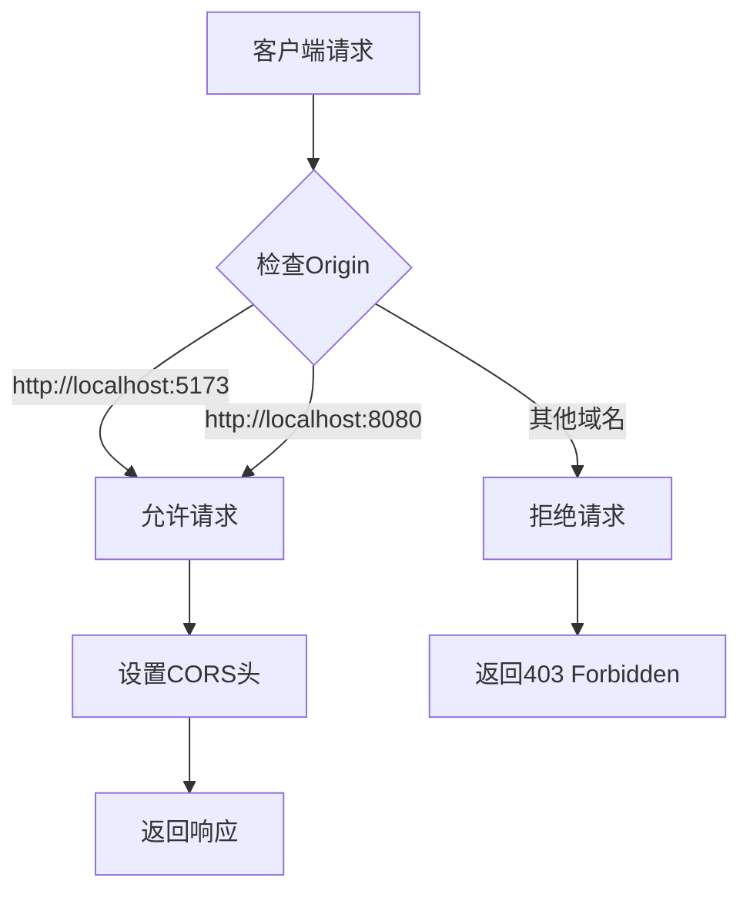

# gomockserver API 参考文档

<cite>
**本文档中引用的文件**
- [main.go](file://cmd/mockserver/main.go)
- [admin_service.go](file://internal/service/admin_service.go)
- [rule_handler.go](file://internal/api/rule_handler.go)
- [project_handler.go](file://internal/api/project_handler.go)
- [statistics_handler.go](file://internal/api/statistics_handler.go)
- [mock_handler.go](file://internal/api/mock_handler.go)
- [request_log_handler.go](file://internal/api/request_log_handler.go)
- [models.go](file://internal/models/models.go)
- [middleware.go](file://internal/service/middleware.go)
- [cors.go](file://internal/middleware/cors.go)
- [README.md](file://README.md)
</cite>

## 目录
1. [简介](#简介)
2. [API概述](#api概述)
3. [认证机制](#认证机制)
4. [CORS配置](#cors配置)
5. [系统管理API](#系统管理api)
6. [项目管理API](#项目管理api)
7. [规则管理API](#规则管理api)
8. [统计分析API](#统计分析api)
9. [Mock测试API](#mock测试api)
10. [请求日志API](#请求日志api)
11. [导入导出API](#导入导出api)
12. [错误处理](#错误处理)
13. [使用示例](#使用示例)

## 简介

gomockserver是一个功能强大的Mock服务器系统，提供了完整的RESTful API接口用于管理Mock规则、项目、环境等资源。本文档详细介绍了所有公开的API端点，包括HTTP方法、URL参数、请求体结构、响应格式及状态码。

### 主要特性
- **多协议支持**：HTTP/HTTPS、WebSocket、gRPC、TCP、UDP
- **智能匹配**：路径、方法、Header、Query参数匹配
- **动态响应**：静态配置、模板引擎、文件引用、延迟控制
- **企业级功能**：项目环境管理、多用户协作、统计分析

## API概述

### 基础信息
- **API版本**：v1
- **基础URL**：`http://localhost:8080/api/v1`
- **Mock服务地址**：`http://localhost:9090`
- **响应格式**：JSON
- **编码**：UTF-8

### 请求格式规范
- **Content-Type**：`application/json`
- **日期时间**：ISO 8601格式（`2024-01-01T12:00:00Z`）
- **分页参数**：`page`（页码，默认1），`page_size`（每页数量，默认20）

## 认证机制

gomockserver目前采用无认证机制，所有API端点均可直接访问。未来版本计划支持：
- JWT令牌认证
- API密钥认证
- OAuth2.0集成

## CORS配置

### 默认CORS配置



**图表来源**
- [cors.go](file://internal/middleware/cors.go#L20-L40)

#### 允许的源
- `http://localhost:5173` - 前端开发服务器
- `http://localhost:8080` - 前端生产环境

#### 允许的方法
- `GET`
- `POST`
- `PUT`
- `DELETE`
- `OPTIONS`
- `PATCH`

#### 允许的头部
- `Content-Type`
- `Authorization`（预留）
- `X-Request-ID`

#### 预期暴露的头部
- `X-Request-ID`

### 自定义CORS配置

```go
// 自定义CORS配置示例
customConfig := middleware.CORSConfig{
    AllowOrigins: []string{"http://example.com"},
    AllowMethods: []string{"GET", "POST"},
    AllowHeaders: []string{"Content-Type"},
    MaxAge:       1 * time.Hour,
}
```

**章节来源**
- [cors.go](file://internal/middleware/cors.go#L1-L88)

## 系统管理API

### 健康检查

**端点**：`GET /api/v1/system/health`

**描述**：检查系统健康状态

**请求示例**：
```bash
curl -X GET http://localhost:8080/api/v1/system/health
```

**响应格式**：
```json
{
    "status": "healthy",
    "database": true,
    "cache": true,
    "uptime": 3600
}
```

**状态码**：
- `200 OK` - 系统正常运行

### 版本信息

**端点**：`GET /api/v1/system/version`

**描述**：获取系统版本信息

**请求示例**：
```bash
curl -X GET http://localhost:8080/api/v1/system/version
```

**响应格式**：
```json
{
    "version": "0.6.0",
    "name": "MockServer"
}
```

### 系统信息

**端点**：`GET /api/v1/system/info`

**描述**：获取系统详细信息

**请求示例**：
```bash
curl -X GET http://localhost:8080/api/v1/system/info
```

**响应格式**：
```json
{
    "version": "0.6.0",
    "build_time": "2025-11-18",
    "go_version": "go1.24.0",
    "admin_api_url": "http://localhost:8080/api/v1",
    "mock_service_url": "http://localhost:9090"
}
```

**章节来源**
- [admin_service.go](file://internal/service/admin_service.go#L128-L152)

## 项目管理API

### 创建项目

**端点**：`POST /api/v1/projects`

**描述**：创建新的项目

**请求头**：
```http
Content-Type: application/json
```

**请求体**：
```json
{
    "name": "测试项目",
    "workspace_id": "default",
    "description": "这是一个测试项目"
}
```

**字段说明**：
| 字段名 | 类型 | 必填 | 描述 |
|--------|------|------|------|
| name | string | 是 | 项目名称 |
| workspace_id | string | 是 | 工作空间ID |
| description | string | 否 | 项目描述 |

**响应**：
```json
{
    "id": "project_123",
    "name": "测试项目",
    "workspace_id": "default",
    "description": "这是一个测试项目",
    "created_at": "2024-01-01T12:00:00Z",
    "updated_at": "2024-01-01T12:00:00Z"
}
```

**状态码**：
- `201 Created` - 创建成功
- `400 Bad Request` - 参数错误
- `500 Internal Server Error` - 服务器错误

### 获取项目列表

**端点**：`GET /api/v1/projects`

**描述**：获取所有项目列表

**请求示例**：
```bash
curl -X GET http://localhost:8080/api/v1/projects
```

**响应格式**：
```json
[
    {
        "id": "project_123",
        "name": "测试项目",
        "workspace_id": "default",
        "description": "这是一个测试项目",
        "created_at": "2024-01-01T12:00:00Z",
        "updated_at": "2024-01-01T12:00:00Z"
    }
]
```

**状态码**：
- `200 OK` - 查询成功
- `500 Internal Server Error` - 服务器错误

### 获取项目详情

**端点**：`GET /api/v1/projects/{id}`

**描述**：获取指定项目详情

**路径参数**：
| 参数名 | 类型 | 必填 | 描述 |
|--------|------|------|------|
| id | string | 是 | 项目ID |

**请求示例**：
```bash
curl -X GET http://localhost:8080/api/v1/projects/project_123
```

**响应**：
```json
{
    "id": "project_123",
    "name": "测试项目",
    "workspace_id": "default",
    "description": "这是一个测试项目",
    "created_at": "2024-01-01T12:00:00Z",
    "updated_at": "2024-01-01T12:00:00Z"
}
```

**状态码**：
- `200 OK` - 查询成功
- `404 Not Found` - 项目不存在
- `500 Internal Server Error` - 服务器错误

### 更新项目

**端点**：`PUT /api/v1/projects/{id}`

**描述**：更新项目信息

**路径参数**：
| 参数名 | 类型 | 必填 | 描述 |
|--------|------|------|------|
| id | string | 是 | 项目ID |

**请求体**：
```json
{
    "name": "更新后的项目名称",
    "description": "更新后的项目描述"
}
```

**响应**：
```json
{
    "id": "project_123",
    "name": "更新后的项目名称",
    "workspace_id": "default",
    "description": "更新后的项目描述",
    "created_at": "2024-01-01T12:00:00Z",
    "updated_at": "2024-01-01T12:00:00Z"
}
```

**状态码**：
- `200 OK` - 更新成功
- `400 Bad Request` - 参数错误
- `404 Not Found` - 项目不存在
- `500 Internal Server Error` - 服务器错误

### 删除项目

**端点**：`DELETE /api/v1/projects/{id}`

**描述**：删除项目（同时删除关联的环境和规则）

**路径参数**：
| 参数名 | 类型 | 必填 | 描述 |
|--------|------|------|------|
| id | string | 是 | 项目ID |

**请求示例**：
```bash
curl -X DELETE http://localhost:8080/api/v1/projects/project_123
```

**响应**：
```json
{
    "message": "Project deleted successfully"
}
```

**状态码**：
- `200 OK` - 删除成功
- `404 Not Found` - 项目不存在
- `500 Internal Server Error` - 服务器错误

### 创建环境

**端点**：`POST /api/v1/projects/{id}/environments`

**描述**：在项目下创建新环境

**路径参数**：
| 参数名 | 类型 | 必需 | 描述 |
|--------|------|------|------|
| id | string | 是 | 项目ID |

**请求体**：
```json
{
    "name": "开发环境",
    "base_url": "http://dev.api.example.com",
    "variables": {
        "api_key": "dev_key_123",
        "timeout": 30
    }
}
```

**字段说明**：
| 字段名 | 类型 | 必填 | 描述 |
|--------|------|------|------|
| name | string | 是 | 环境名称 |
| base_url | string | 否 | 基础URL |
| variables | object | 否 | 环境变量 |

**响应**：
```json
{
    "id": "env_456",
    "name": "开发环境",
    "project_id": "project_123",
    "base_url": "http://dev.api.example.com",
    "variables": {
        "api_key": "dev_key_123",
        "timeout": 30
    },
    "created_at": "2024-01-01T12:00:00Z",
    "updated_at": "2024-01-01T12:00:00Z"
}
```

**状态码**：
- `201 Created` - 创建成功
- `400 Bad Request` - 参数错误
- `500 Internal Server Error` - 服务器错误

### 获取环境列表

**端点**：`GET /api/v1/projects/{id}/environments`

**描述**：获取项目下的所有环境

**路径参数**：
| 参数名 | 类型 | 必填 | 描述 |
|--------|------|------|------|
| id | string | 是 | 项目ID |

**请求示例**：
```bash
curl -X GET http://localhost:8080/api/v1/projects/project_123/environments
```

**响应格式**：
```json
{
    "data": [
        {
            "id": "env_456",
            "name": "开发环境",
            "project_id": "project_123",
            "base_url": "http://dev.api.example.com",
            "variables": {
                "api_key": "dev_key_123",
                "timeout": 30
            },
            "created_at": "2024-01-01T12:00:00Z",
            "updated_at": "2024-01-01T12:00:00Z"
        }
    ]
}
```

**状态码**：
- `200 OK` - 查询成功
- `400 Bad Request` - 参数错误
- `500 Internal Server Error` - 服务器错误

### 获取环境详情

**端点**：`GET /api/v1/projects/{id}/environments/{env_id}`

**描述**：获取指定环境详情

**路径参数**：
| 参数名 | 类型 | 必填 | 描述 |
|--------|------|------|------|
| id | string | 是 | 项目ID |
| env_id | string | 是 | 环境ID |

**请求示例**：
```bash
curl -X GET http://localhost:8080/api/v1/projects/project_123/environments/env_456
```

**响应**：
```json
{
    "id": "env_456",
    "name": "开发环境",
    "project_id": "project_123",
    "base_url": "http://dev.api.example.com",
    "variables": {
        "api_key": "dev_key_123",
        "timeout": 30
    },
    "created_at": "2024-01-01T12:00:00Z",
    "updated_at": "2024-01-01T12:00:00Z"
}
```

**状态码**：
- `200 OK` - 查询成功
- `404 Not Found` - 环境不存在
- `500 Internal Server Error` - 服务器错误

### 更新环境

**端点**：`PUT /api/v1/projects/{id}/environments/{env_id}`

**描述**：更新环境信息

**路径参数**：
| 参数名 | 类型 | 必填 | 描述 |
|--------|------|------|------|
| id | string | 是 | 项目ID |
| env_id | string | 是 | 环境ID |

**请求体**：
```json
{
    "name": "更新后的环境名称",
    "base_url": "http://updated.api.example.com",
    "variables": {
        "api_key": "new_key_456"
    }
}
```

**响应**：
```json
{
    "id": "env_456",
    "name": "更新后的环境名称",
    "project_id": "project_123",
    "base_url": "http://updated.api.example.com",
    "variables": {
        "api_key": "new_key_456"
    },
    "created_at": "2024-01-01T12:00:00Z",
    "updated_at": "2024-01-01T12:00:00Z"
}
```

**状态码**：
- `200 OK` - 更新成功
- `400 Bad Request` - 参数错误
- `404 Not Found` - 环境不存在
- `500 Internal Server Error` - 服务器错误

### 删除环境

**端点**：`DELETE /api/v1/projects/{id}/environments/{env_id}`

**描述**：删除环境（同时删除该环境下的所有规则）

**路径参数**：
| 参数名 | 类型 | 必填 | 描述 |
|--------|------|------|------|
| id | string | 是 | 项目ID |
| env_id | string | 是 | 环境ID |

**请求示例**：
```bash
curl -X DELETE http://localhost:8080/api/v1/projects/project_123/environments/env_456
```

**响应**：
```json
{
    "message": "Environment deleted successfully"
}
```

**状态码**：
- `200 OK` - 删除成功
- `404 Not Found` - 环境不存在
- `500 Internal Server Error` - 服务器错误

**章节来源**
- [project_handler.go](file://internal/api/project_handler.go#L1-L212)

## 规则管理API

### 创建规则

**端点**：`POST /api/v1/rules`

**描述**：创建新的Mock规则

**请求头**：
```http
Content-Type: application/json
```

**请求体**：
```json
{
    "name": "用户列表接口",
    "project_id": "project_123",
    "environment_id": "env_456",
    "protocol": "HTTP",
    "match_type": "Simple",
    "priority": 1,
    "enabled": true,
    "match_condition": {
        "method": "GET",
        "path": "/api/users",
        "query": {
            "page": "1",
            "limit": "20"
        },
        "headers": {
            "Content-Type": "application/json"
        }
    },
    "response": {
        "type": "Static",
        "delay": {
            "type": "fixed",
            "fixed": 100
        },
        "content": {
            "status_code": 200,
            "content_type": "JSON",
            "body": {
                "code": 0,
                "message": "success",
                "data": [
                    {
                        "id": 1,
                        "name": "张三",
                        "email": "zhangsan@example.com"
                    },
                    {
                        "id": 2,
                        "name": "李四",
                        "email": "lisi@example.com"
                    }
                ]
            }
        }
    },
    "tags": ["user", "api"],
    "creator": "admin"
}
```

**字段说明**：
| 字段名 | 类型 | 必填 | 描述 |
|--------|------|------|------|
| name | string | 是 | 规则名称 |
| project_id | string | 是 | 项目ID |
| environment_id | string | 是 | 环境ID |
| protocol | string | 是 | 协议类型（HTTP, WebSocket, gRPC, TCP, UDP） |
| match_type | string | 是 | 匹配类型（Simple, Regex, Script） |
| priority | integer | 否 | 优先级（数字越小优先级越高，默认0） |
| enabled | boolean | 否 | 是否启用（默认true） |
| match_condition | object | 是 | 匹配条件 |
| response | object | 是 | 响应配置 |

**匹配条件示例**：
```json
{
    "method": "GET",
    "path": "/api/users",
    "path_regex": "^/api/users/\\d+$",
    "query": {
        "page": "1",
        "limit": "20"
    },
    "headers": {
        "Content-Type": "application/json",
        "Authorization": "Bearer .*"
    },
    "body": {
        "status": "active"
    },
    "ip_whitelist": ["192.168.1.0/24", "10.0.0.0/8"]
}
```

**响应格式**：
```json
{
    "id": "rule_789",
    "name": "用户列表接口",
    "project_id": "project_123",
    "environment_id": "env_456",
    "protocol": "HTTP",
    "match_type": "Simple",
    "priority": 1,
    "enabled": true,
    "match_condition": {...},
    "response": {...},
    "tags": ["user", "api"],
    "creator": "admin",
    "created_at": "2024-01-01T12:00:00Z",
    "updated_at": "2024-01-01T12:00:00Z"
}
```

**状态码**：
- `201 Created` - 创建成功
- `400 Bad Request` - 参数错误
- `500 Internal Server Error` - 服务器错误

### 获取规则列表

**端点**：`GET /api/v1/rules`

**描述**：获取规则列表，支持多种过滤条件

**查询参数**：
| 参数名 | 类型 | 必填 | 描述 |
|--------|------|------|------|
| page | integer | 否 | 页码（默认1） |
| page_size | integer | 否 | 每页数量（默认20，最大100） |
| project_id | string | 否 | 项目ID |
| environment_id | string | 否 | 环境ID |
| protocol | string | 否 | 协议类型 |
| enabled | boolean | 否 | 是否启用 |

**请求示例**：
```bash
curl -X GET "http://localhost:8080/api/v1/rules?page=1&page_size=10&project_id=project_123&enabled=true"
```

**响应格式**：
```json
{
    "data": [
        {
            "id": "rule_789",
            "name": "用户列表接口",
            "project_id": "project_123",
            "environment_id": "env_456",
            "protocol": "HTTP",
            "match_type": "Simple",
            "priority": 1,
            "enabled": true,
            "match_condition": {...},
            "response": {...},
            "tags": ["user", "api"],
            "creator": "admin",
            "created_at": "2024-01-01T12:00:00Z",
            "updated_at": "2024-01-01T12:00:00Z"
        }
    ],
    "total": 15,
    "page": 1,
    "page_size": 10
}
```

**状态码**：
- `200 OK` - 查询成功
- `500 Internal Server Error` - 服务器错误

### 获取规则详情

**端点**：`GET /api/v1/rules/{id}`

**描述**：获取指定规则详情

**路径参数**：
| 参数名 | 类型 | 必填 | 描述 |
|--------|------|------|------|
| id | string | 是 | 规则ID |

**请求示例**：
```bash
curl -X GET http://localhost:8080/api/v1/rules/rule_789
```

**响应**：
```json
{
    "id": "rule_789",
    "name": "用户列表接口",
    "project_id": "project_123",
    "environment_id": "env_456",
    "protocol": "HTTP",
    "match_type": "Simple",
    "priority": 1,
    "enabled": true,
    "match_condition": {
        "method": "GET",
        "path": "/api/users",
        "query": {
            "page": "1",
            "limit": "20"
        },
        "headers": {
            "Content-Type": "application/json"
        }
    },
    "response": {
        "type": "Static",
        "delay": {
            "type": "fixed",
            "fixed": 100
        },
        "content": {
            "status_code": 200,
            "content_type": "JSON",
            "body": {
                "code": 0,
                "message": "success",
                "data": [...]
            }
        }
    },
    "tags": ["user", "api"],
    "creator": "admin",
    "created_at": "2024-01-01T12:00:00Z",
    "updated_at": "2024-01-01T12:00:00Z"
}
```

**状态码**：
- `200 OK` - 查询成功
- `404 Not Found` - 规则不存在
- `500 Internal Server Error` - 服务器错误

### 更新规则

**端点**：`PUT /api/v1/rules/{id}`

**描述**：更新规则信息

**路径参数**：
| 参数名 | 类型 | 必填 | 描述 |
|--------|------|------|------|
| id | string | 是 | 规则ID |

**请求体**：
```json
{
    "name": "更新后的规则名称",
    "priority": 2,
    "enabled": false,
    "match_condition": {
        "method": "POST",
        "path": "/api/users/create"
    },
    "response": {
        "type": "Static",
        "content": {
            "status_code": 201,
            "content_type": "JSON",
            "body": {
                "code": 0,
                "message": "用户创建成功"
            }
        }
    }
}
```

**响应**：
```json
{
    "id": "rule_789",
    "name": "更新后的规则名称",
    "project_id": "project_123",
    "environment_id": "env_456",
    "protocol": "HTTP",
    "match_type": "Simple",
    "priority": 2,
    "enabled": false,
    "match_condition": {
        "method": "POST",
        "path": "/api/users/create"
    },
    "response": {
        "type": "Static",
        "content": {
            "status_code": 201,
            "content_type": "JSON",
            "body": {
                "code": 0,
                "message": "用户创建成功"
            }
        }
    },
    "tags": ["user", "api"],
    "creator": "admin",
    "created_at": "2024-01-01T12:00:00Z",
    "updated_at": "2024-01-01T12:00:00Z"
}
```

**状态码**：
- `200 OK` - 更新成功
- `400 Bad Request` - 参数错误
- `404 Not Found` - 规则不存在
- `500 Internal Server Error` - 服务器错误

### 删除规则

**端点**：`DELETE /api/v1/rules/{id}`

**描述**：删除规则

**路径参数**：
| 参数名 | 类型 | 必填 | 描述 |
|--------|------|------|------|
| id | string | 是 | 规则ID |

**请求示例**：
```bash
curl -X DELETE http://localhost:8080/api/v1/rules/rule_789
```

**响应**：
```json
{
    "message": "Rule deleted successfully"
}
```

**状态码**：
- `200 OK` - 删除成功
- `404 Not Found` - 规则不存在
- `500 Internal Server Error` - 服务器错误

### 启用规则

**端点**：`POST /api/v1/rules/{id}/enable`

**描述**：启用指定规则

**路径参数**：
| 参数名 | 类型 | 必填 | 描述 |
|--------|------|------|------|
| id | string | 是 | 规则ID |

**请求示例**：
```bash
curl -X POST http://localhost:8080/api/v1/rules/rule_789/enable
```

**响应**：
```json
{
    "message": "Rule enabled successfully"
}
```

**状态码**：
- `200 OK` - 启用成功
- `404 Not Found` - 规则不存在
- `500 Internal Server Error` - 服务器错误

### 禁用规则

**端点**：`POST /api/v1/rules/{id}/disable`

**描述**：禁用指定规则

**路径参数**：
| 参数名 | 类型 | 必填 | 描述 |
|--------|------|------|------|
| id | string | 是 | 规则ID |

**请求示例**：
```bash
curl -X POST http://localhost:8080/api/v1/rules/rule_789/disable
```

**响应**：
```json
{
    "message": "Rule disabled successfully"
}
```

**状态码**：
- `200 OK` - 禁用成功
- `404 Not Found` - 规则不存在
- `500 Internal Server Error` - 服务器错误

**章节来源**
- [rule_handler.go](file://internal/api/rule_handler.go#L1-L266)

## 统计分析API

### 概览统计

**端点**：`GET /api/v1/statistics/dashboard`

**描述**：获取系统概览统计信息

**请求示例**：
```bash
curl -X GET http://localhost:8080/api/v1/statistics/dashboard
```

**响应格式**：
```json
{
    "total_projects": 10,
    "total_environments": 25,
    "total_rules": 150,
    "total_requests": 10000,
    "enabled_rules": 120,
    "disabled_rules": 30,
    "requests_today": 2000
}
```

### 项目统计

**端点**：`GET /api/v1/statistics/projects`

**描述**：获取项目统计信息

**请求示例**：
```bash
curl -X GET http://localhost:8080/api/v1/statistics/projects
```

**响应格式**：
```json
[
    {
        "project_id": "project_123",
        "project_name": "测试项目",
        "request_count": 5000,
        "success_rate": 95.5
    }
]
```

### 规则统计

**端点**：`GET /api/v1/statistics/rules`

**描述**：获取规则统计信息

**请求示例**：
```bash
curl -X GET http://localhost:8080/api/v1/statistics/rules
```

**响应格式**：
```json
[
    {
        "rule_id": "rule_789",
        "rule_name": "用户列表接口",
        "project_id": "project_123",
        "request_count": 1000,
        "success_rate": 98.0,
        "avg_duration": 150.5
    }
]
```

### 实时统计

**端点**：`GET /api/v1/statistics/realtime`

**描述**：获取实时统计信息

**请求示例**：
```bash
curl -X GET http://localhost:8080/api/v1/statistics/realtime
```

**响应格式**：
```json
{
    "timestamp": "2024-01-01T12:00:00Z",
    "requests_per_min": 100,
    "active_connections": 5,
    "avg_response_time": 120.5,
    "error_rate": 1.5,
    "protocol_stats": {
        "http": {
            "count": 95,
            "success_rate": 98.5,
            "avg_duration": 115.0
        },
        "websocket": {
            "count": 5,
            "success_rate": 100.0,
            "avg_duration": 50.0
        }
    }
}
```

### 趋势分析

**端点**：`GET /api/v1/statistics/request-trend`

**描述**：获取请求趋势分析

**查询参数**：
| 参数名 | 类型 | 必填 | 描述 |
|--------|------|------|------|
| period | string | 否 | 时间粒度（hour, day, week, month，默认day） |
| duration | integer | 否 | 持续天数（默认7天） |

**请求示例**：
```bash
curl -X GET "http://localhost:8080/api/v1/statistics/request-trend?period=day&duration=7"
```

**响应格式**：
```json
{
    "period": "day",
    "data_points": [
        {
            "timestamp": "2024-01-01T00:00:00Z",
            "request_count": 1000,
            "success_count": 950,
            "error_count": 50,
            "avg_duration": 120.5
        }
    ]
}
```

### 对比分析

**端点**：`GET /api/v1/statistics/comparison`

**描述**：获取对比分析数据

**查询参数**：
| 参数名 | 类型 | 必填 | 描述 |
|--------|------|------|------|
| period | string | 否 | 时段类型（day, week, month，默认day） |

**请求示例**：
```bash
curl -X GET "http://localhost:8080/api/v1/statistics/comparison?period=day"
```

**响应格式**：
```json
{
    "current_period": {
        "start_time": "2024-01-01T00:00:00Z",
        "end_time": "2024-01-01T23:59:59Z",
        "total_requests": 2000,
        "success_rate": 95.5,
        "avg_duration": 120.5,
        "error_count": 100
    },
    "previous_period": {
        "start_time": "2024-01-01T00:00:00Z",
        "end_time": "2024-01-01T23:59:59Z",
        "total_requests": 1800,
        "success_rate": 94.0,
        "avg_duration": 115.0,
        "error_count": 120
    },
    "changes": {
        "requests_change": 11.11,
        "success_rate_change": 1.5,
        "duration_change": 4.78
    }
}
```

**章节来源**
- [statistics_handler.go](file://internal/api/statistics_handler.go#L1-L571)

## Mock测试API

### 发送Mock测试请求

**端点**：`POST /api/v1/mock/test`

**描述**：发送Mock测试请求

**请求示例**：
```bash
curl -X POST http://localhost:8080/api/v1/mock/test \
  -H "Content-Type: application/json" \
  -d '{
    "project_id": "project_123",
    "environment_id": "env_456",
    "method": "GET",
    "path": "/api/users",
    "headers": {
        "Content-Type": "application/json"
    }
}'
```

**响应格式**：
```json
{
    "message": "Mock request sent successfully"
}
```

**状态码**：
- `200 OK` - 请求发送成功
- `400 Bad Request` - 参数错误
- `500 Internal Server Error` - 服务器错误

### 获取Mock测试历史

**端点**：`GET /api/v1/mock/history`

**描述**：获取Mock测试历史记录

**查询参数**：
| 参数名 | 类型 | 必填 | 描述 |
|--------|------|------|------|
| project_id | string | 是 | 项目ID |

**请求示例**：
```bash
curl -X GET "http://localhost:8080/api/v1/mock/history?project_id=project_123"
```

**响应格式**：
```json
[
    {
        "id": "history_123",
        "request": {
            "method": "GET",
            "path": "/api/users",
            "headers": {...},
            "body": null
        },
        "response": {
            "status_code": 200,
            "headers": {...},
            "body": {...}
        },
        "timestamp": "2024-01-01T12:00:00Z",
        "project_id": "project_123",
        "environment_id": "env_456"
    }
]
```

**状态码**：
- `200 OK` - 查询成功
- `400 Bad Request` - 参数错误
- `500 Internal Server Error` - 服务器错误

### 清空Mock测试历史

**端点**：`DELETE /api/v1/mock/history`

**描述**：清空Mock测试历史记录

**查询参数**：
| 参数名 | 类型 | 必填 | 描述 |
|--------|------|------|------|
| project_id | string | 是 | 项目ID |

**请求示例**：
```bash
curl -X DELETE "http://localhost:8080/api/v1/mock/history?project_id=project_123"
```

**响应格式**：
```json
{
    "message": "Mock history cleared successfully"
}
```

**状态码**：
- `200 OK` - 清空成功
- `400 Bad Request` - 参数错误
- `500 Internal Server Error` - 服务器错误

### 删除单条Mock测试历史

**端点**：`DELETE /api/v1/mock/history/{id}`

**描述**：删除单条Mock测试历史记录

**路径参数**：
| 参数名 | 类型 | 必填 | 描述 |
|--------|------|------|------|
| id | string | 是 | 历史记录ID |

**请求示例**：
```bash
curl -X DELETE http://localhost:8080/api/v1/mock/history/history_123
```

**响应格式**：
```json
{
    "message": "Mock history item deleted successfully"
}
```

**状态码**：
- `200 OK` - 删除成功
- `400 Bad Request` - 参数错误
- `404 Not Found` - 历史记录不存在
- `500 Internal Server Error` - 服务器错误

**章节来源**
- [mock_handler.go](file://internal/api/mock_handler.go#L1-L82)

## 请求日志API

### 列表查询请求日志

**端点**：`GET /api/v1/request-logs`

**描述**：查询请求日志列表

**查询参数**：
| 参数名 | 类型 | 必填 | 描述 |
|--------|------|------|------|
| project_id | string | 否 | 项目ID |
| environment_id | string | 否 | 环境ID |
| rule_id | string | 否 | 规则ID |
| protocol | string | 否 | 协议类型 |
| method | string | 否 | HTTP方法 |
| path | string | 否 | 路径（支持正则） |
| status_code | integer | 否 | 状态码 |
| source_ip | string | 否 | 来源IP |
| start_time | string | 否 | 开始时间（RFC3339格式） |
| end_time | string | 否 | 结束时间（RFC3339格式） |
| page | integer | 否 | 页码（默认1） |
| page_size | integer | 否 | 每页数量（默认20） |
| sort_by | string | 否 | 排序字段（默认timestamp） |
| sort_order | string | 否 | 排序方向（asc/desc，默认desc） |

**请求示例**：
```bash
curl -X GET "http://localhost:8080/api/v1/request-logs?project_id=project_123&start_time=2024-01-01T00:00:00Z&end_time=2024-01-01T23:59:59Z&page=1&page_size=10"
```

**响应格式**：
```json
{
    "data": [
        {
            "id": "log_123",
            "request_id": "req_456",
            "project_id": "project_123",
            "environment_id": "env_456",
            "rule_id": "rule_789",
            "protocol": "HTTP",
            "method": "GET",
            "path": "/api/users",
            "request": {
                "headers": {...},
                "body": null
            },
            "response": {
                "status_code": 200,
                "headers": {...},
                "body": {...}
            },
            "status_code": 200,
            "duration": 150,
            "source_ip": "192.168.1.100",
            "timestamp": "2024-01-01T12:00:00Z"
        }
    ],
    "total": 150,
    "page": 1,
    "size": 10
}
```

**状态码**：
- `200 OK` - 查询成功
- `400 Bad Request` - 参数错误
- `500 Internal Server Error` - 服务器错误

### 获取单个请求日志

**端点**：`GET /api/v1/request-logs/{id}`

**描述**：获取指定请求日志详情

**路径参数**：
| 参数名 | 类型 | 必填 | 描述 |
|--------|------|------|------|
| id | string | 是 | 日志ID |

**请求示例**：
```bash
curl -X GET http://localhost:8080/api/v1/request-logs/log_123
```

**响应**：
```json
{
    "id": "log_123",
    "request_id": "req_456",
    "project_id": "project_123",
    "environment_id": "env_456",
    "rule_id": "rule_789",
    "protocol": "HTTP",
    "method": "GET",
    "path": "/api/users",
    "request": {
        "headers": {
            "Content-Type": "application/json",
            "User-Agent": "curl/7.88.1"
        },
        "body": null
    },
    "response": {
        "status_code": 200,
        "headers": {
            "Content-Type": "application/json",
            "X-Request-ID": "req_456"
        },
        "body": {
            "code": 0,
            "data": [...]
        }
    },
    "status_code": 200,
    "duration": 150,
    "source_ip": "192.168.1.100",
    "timestamp": "2024-01-01T12:00:00Z"
}
```

**状态码**：
- `200 OK` - 查询成功
- `404 Not Found` - 日志不存在
- `500 Internal Server Error` - 服务器错误

### 清理旧日志

**端点**：`DELETE /api/v1/request-logs/cleanup`

**描述**：清理指定天数前的旧日志

**查询参数**：
| 参数名 | 类型 | 必填 | 描述 |
|--------|------|------|------|
| before_days | integer | 是 | 清理多少天前的日志（最小1天） |

**请求示例**：
```bash
curl -X DELETE "http://localhost:8080/api/v1/request-logs/cleanup?before_days=30"
```

**响应格式**：
```json
{
    "message": "cleanup completed",
    "deleted_count": 1000,
    "before": "2023-12-01T12:00:00Z"
}
```

**状态码**：
- `200 OK` - 清理完成
- `400 Bad Request` - 参数错误
- `500 Internal Server Error` - 服务器错误

### 获取统计信息

**端点**：`GET /api/v1/request-logs/statistics`

**描述**：获取请求日志统计信息

**查询参数**：
| 参数名 | 类型 | 必填 | 描述 |
|--------|------|------|------|
| project_id | string | 否 | 项目ID |
| environment_id | string | 否 | 环境ID |
| start_time | string | 否 | 开始时间（RFC3339格式） |
| end_time | string | 否 | 结束时间（RFC3339格式） |
| period | string | 否 | 时间段（24h/7d/30d） |

**请求示例**：
```bash
curl -X GET "http://localhost:8080/api/v1/request-logs/statistics?period=24h"
```

**响应格式**：
```json
{
    "total_requests": 1000,
    "success_requests": 950,
    "error_requests": 50,
    "avg_duration": 120.5,
    "min_duration": 50,
    "max_duration": 500,
    "protocol_distribution": {
        "http": 900,
        "websocket": 100
    }
}
```

**状态码**：
- `200 OK` - 查询成功
- `400 Bad Request` - 参数错误
- `500 Internal Server Error` - 服务器错误

**章节来源**
- [request_log_handler.go](file://internal/api/request_log_handler.go#L1-L285)

## 导入导出API

### 导出项目

**端点**：`GET /api/v1/import-export/projects/{id}/export`

**描述**：导出指定项目的数据

**路径参数**：
| 参数名 | 类型 | 必填 | 描述 |
|--------|------|------|------|
| id | string | 是 | 项目ID |

**查询参数**：
| 参数名 | 类型 | 必填 | 描述 |
|--------|------|------|------|
| include_metadata | boolean | 否 | 是否包含元数据（默认false） |

**请求示例**：
```bash
curl -X GET "http://localhost:8080/api/v1/import-export/projects/project_123/export?include_metadata=true"
```

**响应格式**：
```json
{
    "version": "0.6.0",
    "exported_at": "2024-01-01T12:00:00Z",
    "data": {
        "project": {
            "id": "project_123",
            "name": "测试项目",
            "workspace_id": "default",
            "description": "这是一个测试项目"
        },
        "environments": [
            {
                "id": "env_456",
                "name": "开发环境",
                "project_id": "project_123",
                "base_url": "http://dev.api.example.com",
                "variables": {...}
            }
        ],
        "rules": [
            {
                "id": "rule_789",
                "name": "用户列表接口",
                "project_id": "project_123",
                "environment_id": "env_456",
                "protocol": "HTTP",
                "match_type": "Simple",
                "match_condition": {...},
                "response": {...}
            }
        ]
    }
}
```

**状态码**：
- `200 OK` - 导出成功
- `400 Bad Request` - 参数错误
- `404 Not Found` - 项目不存在
- `500 Internal Server Error` - 服务器错误

### 导出规则

**端点**：`POST /api/v1/import-export/rules/export`

**描述**：批量导出规则

**请求头**：
```http
Content-Type: application/json
```

**请求体**：
```json
{
    "project_id": "project_123",
    "environment_id": "env_456",
    "rule_ids": ["rule_789", "rule_101"],
    "include_metadata": true
}
```

**响应格式**：
```json
{
    "version": "0.6.0",
    "exported_at": "2024-01-01T12:00:00Z",
    "data": {
        "rules": [
            {
                "id": "rule_789",
                "name": "用户列表接口",
                "project_id": "project_123",
                "environment_id": "env_456",
                "protocol": "HTTP",
                "match_type": "Simple",
                "match_condition": {...},
                "response": {...}
            }
        ]
    }
}
```

**状态码**：
- `200 OK` - 导出成功
- `400 Bad Request` - 参数错误
- `500 Internal Server Error` - 服务器错误

### 导入数据

**端点**：`POST /api/v1/import-export/import`

**描述**：导入数据

**请求头**：
```http
Content-Type: application/json
```

**请求体**：
```json
{
    "data": {
        "version": "0.6.0",
        "data": {
            "project": {
                "name": "新项目",
                "workspace_id": "default"
            },
            "environments": [
                {
                    "name": "新环境",
                    "base_url": "http://new.api.example.com"
                }
            ],
            "rules": [
                {
                    "name": "新规则",
                    "protocol": "HTTP",
                    "match_type": "Simple",
                    "match_condition": {...},
                    "response": {...}
                }
            ]
        }
    },
    "strategy": "skip"  // skip, overwrite, merge
}
```

**导入策略**：
- `skip`：跳过已存在的项目/环境/规则
- `overwrite`：覆盖已存在的项目/环境/规则
- `merge`：合并现有规则（实验性）

**响应格式**：
```json
{
    "success": true,
    "message": "导入完成",
    "summary": {
        "created_projects": 1,
        "updated_projects": 0,
        "skipped_projects": 0,
        "created_environments": 1,
        "updated_environments": 0,
        "skipped_environments": 0,
        "created_rules": 1,
        "updated_rules": 0,
        "skipped_rules": 0
    }
}
```

**状态码**：
- `200 OK` - 部分成功（部分数据导入失败）
- `207 Multi-Status` - 部分成功
- `400 Bad Request` - 参数错误
- `500 Internal Server Error` - 服务器错误

### 验证导入数据

**端点**：`POST /api/v1/import-export/validate`

**描述**：验证导入数据格式

**请求头**：
```http
Content-Type: application/json
```

**请求体**：
```json
{
    "version": "0.6.0",
    "data": {
        "project": {...},
        "environments": [...],
        "rules": [...]
    }
}
```

**响应格式**：
```json
{
    "message": "validation successful",
    "data": {
        "rule_count": 10,
        "environment_count": 3,
        "has_project": true
    }
}
```

**状态码**：
- `200 OK` - 验证成功
- `400 Bad Request` - 数据格式错误
- `500 Internal Server Error` - 服务器错误

**章节来源**
- [admin_service.go](file://internal/service/admin_service.go#L155-L243)

## 错误处理

### 标准错误响应格式

所有API端点在发生错误时都返回标准的JSON格式错误响应：

```json
{
    "error": "错误描述信息"
}
```

### 常见HTTP状态码

| 状态码 | 描述 | 场景 |
|--------|------|------|
| 200 | 成功 | 请求处理成功 |
| 201 | 创建成功 | 资源创建成功 |
| 207 | 部分成功 | 批量操作部分成功 |
| 400 | 请求错误 | 参数格式错误、必填参数缺失 |
| 401 | 未授权 | 认证失败（未来版本） |
| 403 | 禁止访问 | 权限不足（未来版本） |
| 404 | 资源不存在 | 请求的资源不存在 |
| 405 | 方法不允许 | 使用了不支持的HTTP方法 |
| 429 | 请求过多 | 请求频率超出限制（未来版本） |
| 500 | 服务器错误 | 内部服务器错误 |
| 503 | 服务不可用 | 服务暂时不可用 |

### 错误处理最佳实践

1. **参数验证**：客户端应在发送请求前验证参数格式
2. **重试机制**：对于5xx错误，建议实现指数退避重试
3. **超时设置**：设置合理的请求超时时间（建议30秒）
4. **错误日志**：记录详细的错误信息用于调试

## 使用示例

### 完整工作流示例

#### 1. 创建项目和环境

```bash
# 创建项目
PROJECT_RESPONSE=$(curl -s -X POST http://localhost:8080/api/v1/projects \
  -H "Content-Type: application/json" \
  -d '{
    "name": "用户管理系统",
    "workspace_id": "default",
    "description": "用于用户管理API的Mock测试"
  }')

PROJECT_ID=$(echo $PROJECT_RESPONSE | jq -r '.id')
echo "项目ID: $PROJECT_ID"

# 创建环境
ENV_RESPONSE=$(curl -s -X POST "http://localhost:8080/api/v1/projects/$PROJECT_ID/environments" \
  -H "Content-Type: application/json" \
  -d '{
    "name": "测试环境",
    "base_url": "http://test.api.usersystem.com",
    "variables": {
      "api_version": "v1",
      "timeout": 30
    }
  }')

ENV_ID=$(echo $ENV_RESPONSE | jq -r '.id')
echo "环境ID: $ENV_ID"
```

#### 2. 创建Mock规则

```bash
# 创建用户列表规则
curl -X POST http://localhost:8080/api/v1/rules \
  -H "Content-Type: application/json" \
  -d "{
    \"name\": \"用户列表接口\",
    \"project_id\": \"$PROJECT_ID\",
    \"environment_id\": \"$ENV_ID\",
    \"protocol\": \"HTTP\",
    \"match_type\": \"Simple\",
    \"priority\": 1,
    \"enabled\": true,
    \"match_condition\": {
      \"method\": \"GET\",
      \"path\": \"/api/users\"
    },
    \"response\": {
      \"type\": \"Static\",
      \"delay\": {
        \"type\": \"fixed\",
        \"fixed\": 100
      },
      \"content\": {
        \"status_code\": 200,
        \"content_type\": \"JSON\",
        \"body\": {
          \"code\": 0,
          \"message\": \"success\",
          \"data\": [
            {
              \"id\": 1,
              \"name\": \"张三\",
              \"email\": \"zhangsan@example.com\",
              \"role\": \"admin\"
            },
            {
              \"id\": 2,
              \"name\": \"李四\",
              \"email\": \"lisi@example.com\",
              \"role\": \"user\"
            }
          ]
        }
      }
    }
  }"
```

#### 3. 测试Mock接口

```bash
# 测试用户列表接口
curl -v "http://localhost:9090/$PROJECT_ID/$ENV_ID/api/users?page=1&limit=10"
```

#### 4. 查看统计信息

```bash
# 查看项目统计
curl -X GET "http://localhost:8080/api/v1/statistics/projects"

# 查看实时统计
curl -X GET "http://localhost:8080/api/v1/statistics/realtime"

# 查看请求趋势
curl -X GET "http://localhost:8080/api/v1/statistics/request-trend?period=day&duration=7"
```

#### 5. 导入导出数据

```bash
# 导出项目
curl -X GET "http://localhost:8080/api/v1/import-export/projects/$PROJECT_ID/export?include_metadata=true" \
  -o project_export.json

# 导入项目（假设已有导出文件）
curl -X POST http://localhost:8080/api/v1/import-export/import \
  -H "Content-Type: application/json" \
  -d "$(cat project_export.json)"
```

### 高级使用场景

#### 环境隔离

```bash
# 创建不同环境
for ENV_NAME in "开发" "测试" "预发布" "生产"; do
    curl -X POST "http://localhost:8080/api/v1/projects/$PROJECT_ID/environments" \
      -H "Content-Type: application/json" \
      -d "{
        \"name\": \"$ENV_NAME\",
        \"base_url\": \"http://$ENV_NAME.api.usersystem.com\"
      }"
done
```

#### 批量规则管理

```bash
# 批量创建规则
RULES=(
    "{\"name\":\"用户详情\",\"path\":\"/api/users/\\d+\"}"
    "{\"name\":\"用户创建\",\"path\":\"/api/users\"}"
    "{\"name\":\"用户更新\",\"path\":\"/api/users/\\d+\"}"
    "{\"name\":\"用户删除\",\"path\":\"/api/users/\\d+\"}"
)

for RULE_JSON in "${RULES[@]}"; do
    curl -X POST http://localhost:8080/api/v1/rules \
      -H "Content-Type: application/json" \
      -d "{
        \"name\": $(echo $RULE_JSON | jq -r '.name'),
        \"project_id\": \"$PROJECT_ID\",
        \"environment_id\": \"$ENV_ID\",
        \"protocol\": \"HTTP\",
        \"match_type\": \"Regex\",
        \"match_condition\": {
          \"method\": \"GET\",
          \"path_regex\": $(echo $RULE_JSON | jq -r '.path')
        },
        \"response\": {
          \"type\": \"Static\",
          \"content\": {
            \"status_code\": 200,
            \"content_type\": \"JSON\",
            \"body\": {}
          }
        }
      }"
done
```

#### 规则启用/禁用管理

```bash
# 获取所有规则
RULES=$(curl -s "http://localhost:8080/api/v1/rules?project_id=$PROJECT_ID")

# 禁用所有规则
echo $RULES | jq -r '.data[].id' | while read RULE_ID; do
    curl -X POST "http://localhost:8080/api/v1/rules/$RULE_ID/disable"
done

# 启用特定规则
ENABLE_RULE_IDS=("rule_123" "rule_456")
for RULE_ID in "${ENABLE_RULE_IDS[@]}"; do
    curl -X POST "http://localhost:8080/api/v1/rules/$RULE_ID/enable"
done
```

### 故障排除

#### 常见问题解决

1. **CORS错误**
```bash
# 检查CORS配置
curl -I http://localhost:8080/api/v1/system/health \
  -H "Origin: http://localhost:5173"
```

2. **数据库连接问题**
```bash
# 检查系统健康状态
curl http://localhost:8080/api/v1/system/health
```

3. **规则匹配问题**
```bash
# 查看请求日志
curl -X GET "http://localhost:8080/api/v1/request-logs?project_id=$PROJECT_ID&start_time=$(date -d '-1 hour' +%Y-%m-%dT%H:%M:%SZ)&end_time=$(date +%Y-%m-%dT%H:%M:%SZ)"

# 检查规则状态
curl -X GET "http://localhost:8080/api/v1/rules?project_id=$PROJECT_ID"
```

#### 性能监控

```bash
# 实时监控
while true; do
    echo "=== $(date) ==="
    curl -s http://localhost:8080/api/v1/statistics/realtime | jq '.requests_per_min,.avg_response_time,.error_rate'
    sleep 10
done
```

这个API参考文档涵盖了gomockserver的所有核心功能，提供了完整的端点说明、参数描述、响应格式和使用示例。通过这些API，用户可以完全管理Mock服务器的各种资源，包括项目、环境、规则、统计信息等。