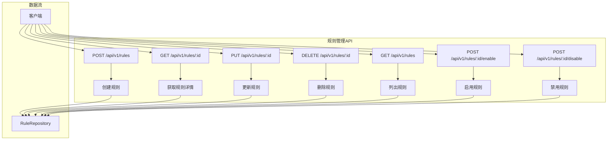

# 规则管理API参考文档

<cite>
**本文档中引用的文件**
- [rule_handler.go](file://internal/api/rule_handler.go)
- [models.go](file://internal/models/models.go)
- [rule_repository.go](file://internal/repository/rule_repository.go)
- [rule_handler_test.go](file://internal/api/rule_handler_test.go)
- [admin_service.go](file://internal/service/admin_service.go)
</cite>

## 目录
1. [简介](#简介)
2. [API概述](#api概述)
3. [规则模型](#规则模型)
4. [端点详细说明](#端点详细说明)
5. [错误处理](#错误处理)
6. [使用示例](#使用示例)
7. [最佳实践](#最佳实践)

## 简介

gomockserver的规则管理API提供了完整的RESTful接口，用于管理Mock规则的生命周期。该API支持创建、读取、更新、删除规则，以及启用/禁用规则状态的操作。所有API都遵循REST设计原则，使用JSON格式进行数据交换。

## API概述

规则管理API位于`/api/v1/rules`路径下，提供以下核心功能：

- **规则创建与管理**：创建新规则、获取规则详情、更新规则、删除规则
- **规则列表**：支持分页查询和多维度过滤
- **状态控制**：启用或禁用规则，支持幂等操作



**图表来源**
- [rule_handler.go](file://internal/api/rule_handler.go#L30-L266)
- [admin_service.go](file://internal/service/admin_service.go#L48-L61)

## 规则模型

规则是API的核心数据结构，包含匹配条件、响应配置和元数据信息。

### Rule 结构体

| 字段名 | 类型 | 必填 | 描述 |
|--------|------|------|------|
| id | string | 是 | 规则唯一标识符（系统自动生成） |
| name | string | 是 | 规则名称 |
| project_id | string | 是 | 所属项目ID |
| environment_id | string | 是 | 所属环境ID |
| protocol | ProtocolType | 是 | 协议类型（HTTP/WebSocket/gRPC/TCP/UDP） |
| match_type | MatchType | 是 | 匹配类型（Simple/Regex/Script） |
| priority | int | 否 | 优先级（数值越大优先级越高，默认0） |
| enabled | bool | 否 | 是否启用（默认false） |
| match_condition | map[string]interface{} | 是 | 匹配条件配置 |
| response | Response | 是 | 响应配置 |
| tags | []string | 否 | 标签数组 |
| creator | string | 否 | 创建者用户名 |
| created_at | time.Time | 是 | 创建时间 |
| updated_at | time.Time | 是 | 最后更新时间 |

### 协议类型枚举

| 值 | 描述 |
|----|------|
| HTTP | HTTP协议 |
| WebSocket | WebSocket协议 |
| gRPC | gRPC协议 |
| TCP | TCP协议 |
| UDP | UDP协议 |

### 匹配类型枚举

| 值 | 描述 |
|----|------|
| Simple | 简单匹配（字符串比较） |
| Regex | 正则表达式匹配 |
| Script | 脚本匹配 |

### 响应类型枚举

| 值 | 描述 |
|----|------|
| Static | 静态响应 |
| Dynamic | 动态响应 |
| Proxy | 代理响应 |
| Script | 脚本响应 |

### HTTPMatchCondition 匹配条件

| 字段名 | 类型 | 描述 |
|--------|------|------|
| method | interface{} | 请求方法（string或[]string） |
| path | string | 请求路径 |
| path_regex | string | 路径正则表达式 |
| query | map[string]string | 查询参数映射 |
| headers | map[string]string | 请求头映射 |
| body | map[string]interface{} | 请求体内容 |
| ip_whitelist | []string | IP白名单 |

### Response 响应配置

| 字段名 | 类型 | 描述 |
|--------|------|------|
| type | ResponseType | 响应类型 |
| delay | DelayConfig | 延迟配置 |
| content | map[string]interface{} | 响应内容 |

### DelayConfig 延迟配置

| 字段名 | 类型 | 描述 |
|--------|------|------|
| type | string | 延迟类型（fixed/random/normal/step） |
| min | int | 最小延迟时间（毫秒） |
| max | int | 最大延迟时间（毫秒） |
| fixed | int | 固定延迟时间（毫秒） |
| mean | int | 正态分布均值 |
| std_dev | int | 正态分布标准差 |
| step | int | 步进延迟 |
| limit | int | 延迟限制 |

**章节来源**
- [models.go](file://internal/models/models.go#L48-L176)

## 端点详细说明

### 1. 创建规则

**端点**: `POST /api/v1/rules`

**功能**: 创建新的Mock规则

**请求参数**:
- **Content-Type**: `application/json`
- **请求体**: 完整的Rule对象（部分字段可选）

**请求示例**:
```json
{
  "name": "用户查询规则",
  "project_id": "project-001",
  "environment_id": "env-001",
  "protocol": "HTTP",
  "match_type": "Simple",
  "priority": 100,
  "enabled": true,
  "match_condition": {
    "method": "GET",
    "path": "/api/users/:id",
    "query": {
      "format": "json"
    },
    "headers": {
      "Content-Type": "application/json"
    }
  },
  "response": {
    "type": "Static",
    "delay": {
      "type": "fixed",
      "fixed": 100
    },
    "content": {
      "status_code": 200,
      "content_type": "JSON",
      "body": {
        "id": 123,
        "name": "张三",
        "email": "zhangsan@example.com"
      }
    }
  },
  "tags": ["user", "profile"],
  "creator": "admin"
}
```

**响应**:
- **成功**: `201 Created`
- **请求无效**: `400 Bad Request`
- **服务器错误**: `500 Internal Server Error`

**响应体**:
```json
{
  "id": "654321abcdef654321abcdef",
  "name": "用户查询规则",
  "project_id": "project-001",
  "environment_id": "env-001",
  "protocol": "HTTP",
  "match_type": "Simple",
  "priority": 100,
  "enabled": true,
  "match_condition": {...},
  "response": {...},
  "tags": ["user", "profile"],
  "creator": "admin",
  "created_at": "2024-01-01T10:00:00Z",
  "updated_at": "2024-01-01T10:00:00Z"
}
```

**验证规则**:
- 必填字段：`name`, `project_id`, `environment_id`
- 协议必须是有效的ProtocolType值
- 匹配类型必须是有效的MatchType值
- 响应类型必须是有效的ResponseType值

**错误处理**:
- `400 Bad Request`: 缺少必填字段或JSON格式错误
- `500 Internal Server Error`: 数据库操作失败

**章节来源**
- [rule_handler.go](file://internal/api/rule_handler.go#L30-L52)

### 2. 获取规则详情

**端点**: `GET /api/v1/rules/:id`

**功能**: 根据ID获取规则的详细信息

**路径参数**:
- `id` (string): 规则唯一标识符

**请求示例**:
```bash
curl -X GET "http://localhost:8080/api/v1/rules/654321abcdef654321abcdef" \
  -H "Content-Type: application/json"
```

**响应**:
- **成功**: `200 OK`
- **规则不存在**: `404 Not Found`
- **请求无效**: `400 Bad Request`
- **服务器错误**: `500 Internal Server Error`

**成功响应**:
```json
{
  "id": "654321abcdef654321abcdef",
  "name": "用户查询规则",
  "project_id": "project-001",
  "environment_id": "env-001",
  "protocol": "HTTP",
  "match_type": "Simple",
  "priority": 100,
  "enabled": true,
  "match_condition": {
    "method": "GET",
    "path": "/api/users/:id",
    "query": {
      "format": "json"
    },
    "headers": {
      "Content-Type": "application/json"
    }
  },
  "response": {
    "type": "Static",
    "delay": {
      "type": "fixed",
      "fixed": 100
    },
    "content": {
      "status_code": 200,
      "content_type": "JSON",
      "body": {
        "id": 123,
        "name": "张三",
        "email": "zhangsan@example.com"
      }
    }
  },
  "tags": ["user", "profile"],
  "creator": "admin",
  "created_at": "2024-01-01T10:00:00Z",
  "updated_at": "2024-01-01T10:00:00Z"
}
```

**错误处理**:
- `400 Bad Request`: ID为空
- `404 Not Found`: 规则不存在
- `500 Internal Server Error`: 数据库查询失败

**章节来源**
- [rule_handler.go](file://internal/api/rule_handler.go#L54-L75)

### 3. 更新规则

**端点**: `PUT /api/v1/rules/:id`

**功能**: 更新现有规则的配置

**路径参数**:
- `id` (string): 规则唯一标识符

**请求参数**:
- **Content-Type**: `application/json`
- **请求体**: 需要更新的字段（非必填）

**请求示例**:
```json
{
  "name": "更新后的规则名称",
  "priority": 200,
  "enabled": true,
  "response": {
    "type": "Static",
    "content": {
      "status_code": 200,
      "content_type": "JSON",
      "body": {
        "message": "规则已更新"
      }
    }
  }
}
```

**响应**:
- **成功**: `200 OK`
- **规则不存在**: `404 Not Found`
- **请求无效**: `400 Bad Request`
- **服务器错误**: `500 Internal Server Error`

**响应体**:
```json
{
  "id": "654321abcdef654321abcdef",
  "name": "更新后的规则名称",
  "project_id": "project-001",
  "environment_id": "env-001",
  "protocol": "HTTP",
  "match_type": "Simple",
  "priority": 200,
  "enabled": true,
  "match_condition": {...},
  "response": {
    "type": "Static",
    "content": {
      "status_code": 200,
      "content_type": "JSON",
      "body": {
        "message": "规则已更新"
      }
    }
  },
  "tags": ["user", "profile"],
  "creator": "admin",
  "created_at": "2024-01-01T10:00:00Z",
  "updated_at": "2024-01-02T15:30:00Z"
}
```

**更新逻辑**:
- 对于未提供的字段，保留原有值
- 关键字段（name, project_id, environment_id, protocol, match_type）不允许更新
- 响应配置为空时保留原有配置

**错误处理**:
- `400 Bad Request`: JSON格式错误或ID为空
- `404 Not Found`: 规则不存在
- `500 Internal Server Error`: 数据库更新失败

**章节来源**
- [rule_handler.go](file://internal/api/rule_handler.go#L77-L143)

### 4. 删除规则

**端点**: `DELETE /api/v1/rules/:id`

**功能**: 删除指定的规则

**路径参数**:
- `id` (string): 规则唯一标识符

**请求示例**:
```bash
curl -X DELETE "http://localhost:8080/api/v1/rules/654321abcdef654321abcdef" \
  -H "Content-Type: application/json"
```

**响应**:
- **成功**: `200 OK`
- **规则不存在**: `404 Not Found`
- **请求无效**: `400 Bad Request`
- **服务器错误**: `500 Internal Server Error`

**成功响应**:
```json
{
  "message": "Rule deleted successfully"
}
```

**错误处理**:
- `400 Bad Request`: ID为空
- `404 Not Found`: 规则不存在
- `500 Internal Server Error`: 数据库删除失败

**章节来源**
- [rule_handler.go](file://internal/api/rule_handler.go#L145-L160)

### 5. 列出规则

**端点**: `GET /api/v1/rules`

**功能**: 分页查询规则列表，支持多种过滤条件

**查询参数**:

| 参数名 | 类型 | 描述 | 示例 |
|--------|------|------|------|
| page | int | 页码（默认1，最小1） | ?page=1 |
| page_size | int | 每页数量（默认20，最大100） | ?page_size=20 |
| project_id | string | 项目ID过滤 | ?project_id=project-001 |
| environment_id | string | 环境ID过滤 | ?environment_id=env-001 |
| protocol | string | 协议类型过滤 | ?protocol=HTTP |
| enabled | boolean | 启用状态过滤 | ?enabled=true |

**请求示例**:
```bash
# 基础查询
curl "http://localhost:8080/api/v1/rules?page=1&page_size=10"

# 带过滤条件
curl "http://localhost:8080/api/v1/rules?project_id=project-001&enabled=true&protocol=HTTP"
```

**响应**:
- **成功**: `200 OK`
- **服务器错误**: `500 Internal Server Error`

**响应体**:
```json
{
  "data": [
    {
      "id": "654321abcdef654321abcdef",
      "name": "规则1",
      "project_id": "project-001",
      "environment_id": "env-001",
      "protocol": "HTTP",
      "match_type": "Simple",
      "priority": 100,
      "enabled": true,
      "created_at": "2024-01-01T10:00:00Z",
      "updated_at": "2024-01-01T10:00:00Z"
    }
  ],
  "total": 25,
  "page": 1,
  "page_size": 10
}
```

**分页逻辑**:
- 计算跳过条数：`skip = (page - 1) * page_size`
- 默认值：page=1, page_size=20
- 限制范围：page_size >= 1 && page_size <= 100

**过滤条件**:
- 支持多字段组合过滤
- Boolean值自动转换（enabled=true/false）
- 空值参数会被忽略

**错误处理**:
- `500 Internal Server Error`: 数据库查询失败

**章节来源**
- [rule_handler.go](file://internal/api/rule_handler.go#L162-L205)

### 6. 启用规则

**端点**: `POST /api/v1/rules/:id/enable`

**功能**: 启用指定的规则（幂等操作）

**路径参数**:
- `id` (string): 规则唯一标识符

**请求示例**:
```bash
curl -X POST "http://localhost:8080/api/v1/rules/654321abcdef654321abcdef/enable" \
  -H "Content-Type: application/json"
```

**响应**:
- **成功**: `200 OK`
- **规则不存在**: `404 Not Found`
- **请求无效**: `400 Bad Request`
- **服务器错误**: `500 Internal Server Error`

**成功响应**:
```json
{
  "message": "Rule enabled successfully"
}
```

**幂等性说明**:
- 已启用的规则再次调用此接口不会产生副作用
- 返回相同的成功消息

**错误处理**:
- `400 Bad Request`: ID为空
- `404 Not Found`: 规则不存在
- `500 Internal Server Error`: 数据库更新失败

**章节来源**
- [rule_handler.go](file://internal/api/rule_handler.go#L207-L235)

### 7. 禁用规则

**端点**: `POST /api/v1/rules/:id/disable`

**功能**: 禁用指定的规则（幂等操作）

**路径参数**:
- `id` (string): 规则唯一标识符

**请求示例**:
```bash
curl -X POST "http://localhost:8080/api/v1/rules/654321abcdef654321abcdef/disable" \
  -H "Content-Type: application/json"
```

**响应**:
- **成功**: `200 OK`
- **规则不存在**: `404 Not Found`
- **请求无效**: `400 Bad Request`
- **服务器错误**: `500 Internal Server Error`

**成功响应**:
```json
{
  "message": "Rule disabled successfully"
}
```

**幂等性说明**:
- 已禁用的规则再次调用此接口不会产生副作用
- 返回相同的成功消息

**错误处理**:
- `400 Bad Request`: ID为空
- `404 Not Found`: 规则不存在
- `500 Internal Server Error`: 数据库更新失败

**章节来源**
- [rule_handler.go](file://internal/api/rule_handler.go#L237-L266)

## 错误处理

### HTTP状态码

| 状态码 | 含义 | 场景 |
|--------|------|------|
| 200 | 成功 | GET、PUT、DELETE、POST（状态变更） |
| 201 | 创建成功 | POST（创建规则） |
| 400 | 请求无效 | JSON格式错误、必填字段缺失、ID为空 |
| 404 | 资源不存在 | 规则不存在、项目不存在、环境不存在 |
| 500 | 服务器内部错误 | 数据库操作失败、系统异常 |

### 错误响应格式

所有错误响应都采用统一的JSON格式：

```json
{
  "error": "错误描述信息"
}
```

### 常见错误场景

#### 创建规则错误
```json
{
  "error": "name, project_id and environment_id are required"
}
```

#### 查询错误
```json
{
  "error": "Failed to get rule"
}
```

#### 更新错误
```json
{
  "error": "Failed to update rule"
}
```

#### 删除错误
```json
{
  "error": "Failed to delete rule"
}
```

**章节来源**
- [rule_handler.go](file://internal/api/rule_handler.go#L33-L48)
- [rule_handler.go](file://internal/api/rule_handler.go#L64-L66)
- [rule_handler.go](file://internal/api/rule_handler.go#L137-L140)

## 使用示例

### 完整工作流程示例

#### 1. 创建规则
```bash
# 创建用户查询规则
curl -X POST "http://localhost:8080/api/v1/rules" \
  -H "Content-Type: application/json" \
  -d '{
    "name": "用户查询规则",
    "project_id": "project-001",
    "environment_id": "env-001",
    "protocol": "HTTP",
    "match_type": "Simple",
    "priority": 100,
    "enabled": true,
    "match_condition": {
      "method": "GET",
      "path": "/api/users/:id",
      "query": {
        "format": "json"
      }
    },
    "response": {
      "type": "Static",
      "content": {
        "status_code": 200,
        "content_type": "JSON",
        "body": {
          "id": 123,
          "name": "张三",
          "email": "zhangsan@example.com"
        }
      }
    }
  }'
```

#### 2. 获取规则详情
```bash
# 获取刚创建的规则
RULE_ID="654321abcdef654321abcdef"
curl -X GET "http://localhost:8080/api/v1/rules/${RULE_ID}" \
  -H "Content-Type: application/json"
```

#### 3. 更新规则
```bash
# 更新规则名称和优先级
curl -X PUT "http://localhost:8080/api/v1/rules/${RULE_ID}" \
  -H "Content-Type: application/json" \
  -d '{
    "name": "用户查询优化规则",
    "priority": 200
  }'
```

#### 4. 启用规则
```bash
# 启用规则
curl -X POST "http://localhost:8080/api/v1/rules/${RULE_ID}/enable" \
  -H "Content-Type: application/json"
```

#### 5. 禁用规则
```bash
# 禁用规则
curl -X POST "http://localhost:8080/api/v1/rules/${RULE_ID}/disable" \
  -H "Content-Type: application/json"
```

#### 6. 列出规则
```bash
# 查询项目下的所有规则
curl "http://localhost:8080/api/v1/rules?project_id=project-001&enabled=true&page=1&page_size=10"
```

#### 7. 删除规则
```bash
# 删除规则
curl -X DELETE "http://localhost:8080/api/v1/rules/${RULE_ID}" \
  -H "Content-Type: application/json"
```

### 高级匹配条件示例

#### 正则表达式匹配
```json
{
  "match_condition": {
    "method": ["GET", "POST"],
    "path_regex": "^/api/users/\\d+$",
    "headers": {
      "Content-Type": "application/json"
    }
  }
}
```

#### 复杂查询参数匹配
```json
{
  "match_condition": {
    "method": "GET",
    "path": "/api/search",
    "query": {
      "type": "user",
      "status": "active",
      "sort": "name"
    }
  }
}
```

#### 动态响应示例
```json
{
  "response": {
    "type": "Dynamic",
    "content": {
      "status_code": 200,
      "content_type": "JSON",
      "body": {
        "timestamp": "{{timestamp}}",
        "uuid": "{{uuid}}",
        "random_number": "{{random 1000}}",
        "user_id": "{{query.id}}",
        "formatted_date": "{{date_format '2006-01-02'}}"
      }
    }
  }
}
```

## 最佳实践

### 1. 规则命名规范
- 使用描述性的名称，如`用户登录规则`、`商品查询规则`
- 避免使用特殊字符，推荐使用英文和下划线
- 考虑添加版本信息，如`用户查询_v1`

### 2. 优先级设置
- 高优先级规则使用较大的数值（如1000+）
- 通用规则使用较小的数值（如1-100）
- 禁用规则可以使用负数优先级

### 3. 匹配条件优化
- 尽量使用具体的路径和方法
- 合理使用查询参数过滤
- 避免过于宽泛的匹配条件

### 4. 响应配置
- 设置适当的延迟模拟真实网络环境
- 使用静态响应进行快速测试
- 使用动态响应生成随机数据

### 5. 环境隔离
- 在不同环境中使用不同的project_id和environment_id
- 确保测试环境和生产环境的规则完全隔离

### 6. 监控和维护
- 定期检查规则的启用状态
- 监控规则的命中率和性能
- 及时清理不再使用的规则

### 7. 权限管理
- 确保只有授权用户可以修改规则
- 记录规则变更的历史记录
- 实施规则变更的审批流程

通过遵循这些最佳实践，可以构建高效、可维护的Mock规则管理系统，提高开发和测试效率。