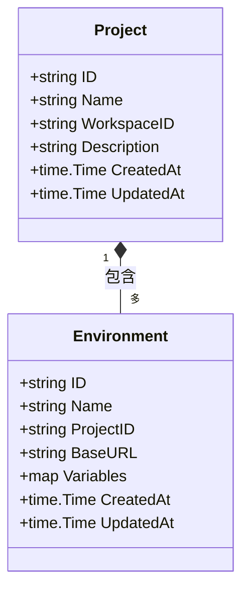
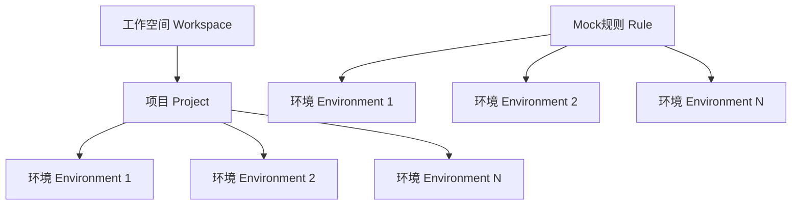

# 项目与环境管理API参考文档

<cite>
**本文档中引用的文件**
- [project_handler.go](file://internal/api/project_handler.go)
- [models.go](file://internal/models/models.go)
- [admin_service.go](file://internal/service/admin_service.go)
- [project_handler_test.go](file://internal/api/project_handler_test.go)
- [project_repository.go](file://internal/repository/project_repository.go)
- [environment_repository_extended_test.go](file://internal/repository/environment_repository_extended_test.go)
- [README.md](file://README.md)
</cite>

## 目录
1. [简介](#简介)
2. [项目管理API](#项目管理api)
3. [环境管理API](#环境管理api)
4. [数据模型](#数据模型)
5. [项目与环境关系](#项目与环境关系)
6. [错误处理](#错误处理)
7. [使用示例](#使用示例)
8. [最佳实践](#最佳实践)

## 简介

gomockserver是一个功能强大的Mock Server系统，提供完整的项目与环境管理功能。该项目采用RESTful API设计，支持多项目、多环境隔离，为企业级应用提供灵活的Mock解决方案。

### 核心概念

- **项目（Project）**: 代表一个独立的应用或服务，包含相关的Mock规则和环境配置
- **环境（Environment）**: 项目下的具体运行环境，如开发、测试、生产等
- **层级关系**: 环境必须属于某个项目，项目可以包含多个环境

## 项目管理API

### 创建项目

创建一个新的项目，用于组织相关的Mock规则和环境。

**HTTP方法**: `POST`
**URL**: `/api/v1/projects`

#### 请求头
- `Content-Type: application/json`

#### 请求体
```json
{
  "name": "项目名称",
  "workspace_id": "工作空间ID",
  "description": "项目描述（可选）"
}
```

#### 响应
- **成功**: `201 Created`
- **失败**: `400 Bad Request` 或 `500 Internal Server Error`

#### 响应体（成功）
```json
{
  "id": "项目唯一标识符",
  "name": "项目名称",
  "workspace_id": "工作空间ID",
  "description": "项目描述",
  "created_at": "创建时间",
  "updated_at": "更新时间"
}
```

**节来源**
- [project_handler.go](file://internal/api/project_handler.go#L28-L41)

### 获取项目详情

根据项目ID获取项目的详细信息。

**HTTP方法**: `GET`
**URL**: `/api/v1/projects/:id`

#### URL参数
- `id`: 项目唯一标识符

#### 响应
- **成功**: `200 OK`
- **未找到**: `404 Not Found`
- **服务器错误**: `500 Internal Server Error`

#### 响应体（成功）
```json
{
  "id": "项目唯一标识符",
  "name": "项目名称",
  "workspace_id": "工作空间ID",
  "description": "项目描述",
  "created_at": "创建时间",
  "updated_at": "更新时间"
}
```

**节来源**
- [project_handler.go](file://internal/api/project_handler.go#L57-L72)

### 更新项目

更新现有项目的属性信息。

**HTTP方法**: `PUT`
**URL**: `/api/v1/projects/:id`

#### URL参数
- `id`: 项目唯一标识符

#### 请求头
- `Content-Type: application/json`

#### 请求体
```json
{
  "name": "新的项目名称",
  "description": "新的项目描述"
}
```

#### 响应
- **成功**: `200 OK`
- **未找到**: `404 Not Found`
- **服务器错误**: `500 Internal Server Error`

#### 响应体（成功）
```json
{
  "id": "项目唯一标识符",
  "name": "更新后的项目名称",
  "workspace_id": "工作空间ID",
  "description": "更新后的项目描述",
  "created_at": "原始创建时间",
  "updated_at": "更新时间"
}
```

**节来源**
- [project_handler.go](file://internal/api/project_handler.go#L76-L93)

### 删除项目

删除指定的项目及其所有关联的环境和规则。

**HTTP方法**: `DELETE`
**URL**: `/api/v1/projects/:id`

#### URL参数
- `id`: 项目唯一标识符

#### 响应
- **成功**: `200 OK`
- **未找到**: `404 Not Found`
- **服务器错误**: `500 Internal Server Error`

#### 响应体（成功）
```json
{
  "message": "Project deleted successfully"
}
```

**节来源**
- [project_handler.go](file://internal/api/project_handler.go#L96-L106)

## 环境管理API

### 创建环境

在指定项目下创建新的环境。

**HTTP方法**: `POST`
**URL**: `/api/v1/projects/:id/environments`

#### URL参数
- `id`: 项目唯一标识符

#### 请求头
- `Content-Type: application/json`

#### 请求体
```json
{
  "name": "环境名称",
  "base_url": "基础URL（可选）",
  "variables": {
    "key": "value"
  }
}
```

#### 响应
- **成功**: `201 Created`
- **缺少项目ID**: `400 Bad Request`
- **服务器错误**: `500 Internal Server Error`

#### 响应体（成功）
```json
{
  "id": "环境唯一标识符",
  "name": "环境名称",
  "project_id": "项目ID",
  "base_url": "基础URL",
  "variables": {
    "key": "value"
  },
  "created_at": "创建时间",
  "updated_at": "更新时间"
}
```

**节来源**
- [project_handler.go](file://internal/api/project_handler.go#L110-L137)

### 获取环境详情

根据环境ID获取环境的详细信息。

**HTTP方法**: `GET`
**URL**: `/api/v1/projects/:id/environments/:env_id`

#### URL参数
- `id`: 项目唯一标识符
- `env_id`: 环境唯一标识符

#### 响应
- **成功**: `200 OK`
- **未找到**: `404 Not Found`
- **服务器错误**: `500 Internal Server Error`

#### 响应体（成功）
```json
{
  "id": "环境唯一标识符",
  "name": "环境名称",
  "project_id": "项目ID",
  "base_url": "基础URL",
  "variables": {
    "key": "value"
  },
  "created_at": "创建时间",
  "updated_at": "更新时间"
}
```

**节来源**
- [project_handler.go](file://internal/api/project_handler.go#L141-L156)

### 更新环境

更新现有环境的属性信息。

**HTTP方法**: `PUT`
**URL**: `/api/v1/projects/:id/environments/:env_id`

#### URL参数
- `id`: 项目唯一标识符
- `env_id`: 环境唯一标识符

#### 请求头
- `Content-Type: application/json`

#### 请求体
```json
{
  "name": "新的环境名称",
  "base_url": "新的基础URL",
  "variables": {
    "key": "value"
  }
}
```

#### 响应
- **成功**: `200 OK`
- **未找到**: `404 Not Found`
- **服务器错误**: `500 Internal Server Error`

#### 响应体（成功）
```json
{
  "id": "环境唯一标识符",
  "name": "更新后的环境名称",
  "project_id": "项目ID",
  "base_url": "更新后的基础URL",
  "variables": {
    "key": "value"
  },
  "created_at": "原始创建时间",
  "updated_at": "更新时间"
}
```

**节来源**
- [project_handler.go](file://internal/api/project_handler.go#L180-L197)

### 删除环境

删除指定的环境。

**HTTP方法**: `DELETE`
**URL**: `/api/v1/projects/:id/environments/:env_id`

#### URL参数
- `id`: 项目唯一标识符
- `env_id`: 环境唯一标识符

#### 响应
- **成功**: `200 OK`
- **未找到**: `404 Not Found`
- **服务器错误**: `500 Internal Server Error`

#### 响应体（成功）
```json
{
  "message": "Environment deleted successfully"
}
```

**节来源**
- [project_handler.go](file://internal/api/project_handler.go#L201-L210)

### 列出项目环境

获取指定项目下的所有环境列表。

**HTTP方法**: `GET`
**URL**: `/api/v1/projects/:id/environments`

#### URL参数
- `id`: 项目唯一标识符

#### 响应
- **成功**: `200 OK`
- **缺少项目ID**: `400 Bad Request`
- **服务器错误**: `500 Internal Server Error`

#### 响应体（成功）
```json
{
  "data": [
    {
      "id": "环境1唯一标识符",
      "name": "环境1名称",
      "project_id": "项目ID",
      "base_url": "环境1基础URL",
      "variables": {},
      "created_at": "创建时间",
      "updated_at": "更新时间"
    },
    {
      "id": "环境2唯一标识符",
      "name": "环境2名称",
      "project_id": "项目ID",
      "base_url": "环境2基础URL",
      "variables": {},
      "created_at": "创建时间",
      "updated_at": "更新时间"
    }
  ]
}
```

**节来源**
- [project_handler.go](file://internal/api/project_handler.go#L160-L176)

## 数据模型

### Project模型

项目实体的数据结构定义。



**图表来源**
- [models.go](file://internal/models/models.go#L104-L123)

#### Project字段说明

| 字段名 | 类型 | 描述 | 必填 |
|--------|------|------|------|
| id | string | 项目唯一标识符 | 是 |
| name | string | 项目名称 | 是 |
| workspace_id | string | 工作空间ID | 是 |
| description | string | 项目描述 | 否 |
| created_at | time.Time | 创建时间 | 是 |
| updated_at | time.Time | 更新时间 | 是 |

#### Environment字段说明

| 字段名 | 类型 | 描述 | 必填 |
|--------|------|------|------|
| id | string | 环境唯一标识符 | 是 |
| name | string | 环境名称 | 是 |
| project_id | string | 所属项目ID | 是 |
| base_url | string | 基础URL | 否 |
| variables | map | 环境变量 | 否 |
| created_at | time.Time | 创建时间 | 是 |
| updated_at | time.Time | 更新时间 | 是 |

**节来源**
- [models.go](file://internal/models/models.go#L104-L123)

## 项目与环境关系

### 层级结构

项目与环境之间存在严格的层级关系：



**图表来源**
- [project_handler.go](file://internal/api/project_handler.go#L117-L123)
- [project_handler.go](file://internal/api/project_handler.go#L161-L162)

### 数据隔离机制

1. **项目级别隔离**: 不同项目的数据完全隔离，无法相互访问
2. **环境级别隔离**: 同一项目下的环境数据相互隔离
3. **权限控制**: 通过项目ID确保数据访问的安全性

### 关联规则

- 每个Mock规则必须关联到具体的环境
- 环境的`project_id`字段是外键，指向所属项目
- 删除项目时会自动清理其下所有环境和规则

**节来源**
- [project_handler.go](file://internal/api/project_handler.go#L117-L123)
- [project_handler.go](file://internal/api/project_handler.go#L161-L162)

## 错误处理

### HTTP状态码

| 状态码 | 含义 | 场景 |
|--------|------|------|
| 200 | 成功 | 请求正常完成 |
| 201 | 创建成功 | 资源创建成功 |
| 400 | 请求错误 | 参数缺失或格式错误 |
| 404 | 资源不存在 | 指定的项目或环境不存在 |
| 500 | 服务器错误 | 内部数据库或其他服务错误 |

### 错误响应格式

```json
{
  "error": "错误描述信息"
}
```

### 常见错误场景

1. **项目ID缺失**: 在创建环境时未提供项目ID
2. **资源不存在**: 访问不存在的项目或环境
3. **数据库错误**: 数据库连接或操作失败
4. **JSON解析错误**: 请求体格式不正确

**节来源**
- [project_handler.go](file://internal/api/project_handler.go#L30-L32)
- [project_handler.go](file://internal/api/project_handler.go#L119-L121)
- [project_handler.go](file://internal/api/project_handler.go#L163-L164)

## 使用示例

### curl命令示例

#### 创建项目
```bash
curl -X POST http://localhost:8080/api/v1/projects \
  -H "Content-Type: application/json" \
  -d '{
    "name": "我的测试项目",
    "workspace_id": "workspace-001",
    "description": "这是一个测试项目"
  }'
```

#### 获取项目详情
```bash
curl -X GET http://localhost:8080/api/v1/projects/project-001
```

#### 创建环境
```bash
curl -X POST http://localhost:8080/api/v1/projects/project-001/environments \
  -H "Content-Type: application/json" \
  -d '{
    "name": "开发环境",
    "base_url": "http://dev.api.example.com",
    "variables": {
      "api_key": "dev-key-12345"
    }
  }'
```

#### 列出项目环境
```bash
curl -X GET http://localhost:8080/api/v1/projects/project-001/environments
```

#### 更新环境
```bash
curl -X PUT http://localhost:8080/api/v1/projects/project-001/environments/env-001 \
  -H "Content-Type: application/json" \
  -d '{
    "name": "开发环境（更新）",
    "base_url": "http://new-dev.api.example.com"
  }'
```

#### 删除环境
```bash
curl -X DELETE http://localhost:8080/api/v1/projects/project-001/environments/env-001
```

### JSON请求/响应示例

#### 创建项目的请求和响应
**请求**:
```json
{
  "name": "电商API测试",
  "workspace_id": "ws-001",
  "description": "用于电商API的Mock测试"
}
```

**响应**:
```json
{
  "id": "proj-001",
  "name": "电商API测试",
  "workspace_id": "ws-001",
  "description": "用于电商API的Mock测试",
  "created_at": "2024-01-15T10:30:00Z",
  "updated_at": "2024-01-15T10:30:00Z"
}
```

#### 环境列表的响应
**响应**:
```json
{
  "data": [
    {
      "id": "env-001",
      "name": "开发环境",
      "project_id": "proj-001",
      "base_url": "http://dev.api.example.com",
      "variables": {
        "api_key": "dev-key-12345",
        "timeout": 5000
      },
      "created_at": "2024-01-15T10:35:00Z",
      "updated_at": "2024-01-15T10:35:00Z"
    },
    {
      "id": "env-002",
      "name": "测试环境",
      "project_id": "proj-001",
      "base_url": "http://test.api.example.com",
      "variables": {
        "api_key": "test-key-67890",
        "timeout": 10000
      },
      "created_at": "2024-01-15T10:40:00Z",
      "updated_at": "2024-01-15T10:40:00Z"
    }
  ]
}
```

**节来源**
- [project_handler_test.go](file://internal/api/project_handler_test.go#L107-L110)
- [project_handler_test.go](file://internal/api/project_handler_test.go#L473-L475)

## 最佳实践

### 项目命名规范

1. **清晰性**: 使用描述性的项目名称
2. **一致性**: 采用统一的命名约定
3. **避免特殊字符**: 使用字母、数字和下划线

### 环境管理建议

1. **环境分离**: 为不同阶段创建独立的环境
2. **变量管理**: 合理使用环境变量区分配置
3. **定期清理**: 删除不再使用的环境

### API调用最佳实践

1. **错误处理**: 始终检查HTTP状态码
2. **数据验证**: 验证返回的数据格式
3. **重试机制**: 对于临时性错误实现重试

### 性能优化

1. **批量操作**: 尽可能使用批量API
2. **缓存策略**: 缓存频繁访问的项目和环境信息
3. **连接复用**: 使用HTTP连接池

**节来源**
- [admin_service.go](file://internal/service/admin_service.go#L66-L80)