# 数据模型

<cite>
**本文档中引用的文件**
- [models.go](file://internal/models/models.go)
- [database.go](file://internal/repository/database.go)
- [project_repository.go](file://internal/repository/project_repository.go)
- [rule_repository.go](file://internal/repository/rule_repository.go)
- [errors.go](file://internal/models/errors.go)
- [project_handler.go](file://internal/api/project_handler.go)
- [rule_handler.go](file://internal/api/rule_handler.go)
- [mongoinit.js](file://config/redis/mongoinit.js)
</cite>

## 目录
1. [简介](#简介)
2. [核心数据模型](#核心数据模型)
3. [集合映射关系](#集合映射关系)
4. [索引设计](#索引设计)
5. [数据生命周期管理](#数据生命周期管理)
6. [项目级别数据隔离](#项目级别数据隔离)
7. [数据访问模式](#数据访问模式)
8. [查询性能考量](#查询性能考量)
9. [错误处理机制](#错误处理机制)
10. [总结](#总结)

## 简介

Go Mock Server采用MongoDB作为主要数据存储，通过精心设计的数据模型支持Mock服务的核心功能。本文档详细阐述了Rule、Project、Environment等核心实体的数据结构、约束条件、索引设计以及查询优化策略。

## 核心数据模型

### Rule（规则）模型

Rule是系统的核心实体，代表一个完整的Mock规则配置。

```mermaid
classDiagram
class Rule {
+string ID
+string Name
+string ProjectID
+string EnvironmentID
+ProtocolType Protocol
+MatchType MatchType
+int Priority
+bool Enabled
+map[string]interface{} MatchCondition
+Response Response
+[]string Tags
+string Creator
+time.Time CreatedAt
+time.Time UpdatedAt
}
class Response {
+ResponseType Type
+DelayConfig Delay
+map[string]interface{} Content
}
class DelayConfig {
+string Type
+int Min
+int Max
+int Fixed
+int Mean
+int StdDev
+int Step
+int Limit
}
class HTTPMatchCondition {
+interface{} Method
+string Path
+string PathRegex
+map[string]string Query
+map[string]string Headers
+map[string]interface{} Body
+[]string IPWhitelist
}
Rule --> Response : "包含"
Response --> DelayConfig : "可选"
Rule --> HTTPMatchCondition : "匹配条件"
```

**图表来源**
- [models.go](file://internal/models/models.go#L48-L63)
- [models.go](file://internal/models/models.go#L77-L82)
- [models.go](file://internal/models/models.go#L84-L94)
- [models.go](file://internal/models/models.go#L66-L75)

#### 字段定义与约束

| 字段名 | 类型 | 约束条件 | 默认值 | 业务含义 |
|--------|------|----------|--------|----------|
| ID | string | 必填，MongoDB ObjectId | 自动生成 | 规则唯一标识符 |
| Name | string | 必填，非空 | - | 规则显示名称 |
| ProjectID | string | 必填，外键关联 | - | 所属项目ID |
| EnvironmentID | string | 必填，外键关联 | - | 所属环境ID |
| Protocol | ProtocolType | 枚举值 | HTTP | 协议类型 |
| MatchType | MatchType | 枚举值 | Simple | 匹配类型 |
| Priority | int | 必填，数值越大优先级越高 | 0 | 规则优先级 |
| Enabled | bool | 必填，默认为true | true | 规则启用状态 |
| MatchCondition | map[string]interface{} | 必填，动态结构 | {} | 匹配条件配置 |
| Response | Response | 必填 | - | 响应配置 |
| Tags | []string | 可选，数组 | [] | 规则标签 |
| Creator | string | 可选 | - | 创建者标识 |
| CreatedAt | time.Time | 自动设置 | 当前时间 | 创建时间 |
| UpdatedAt | time.Time | 自动更新 | 当前时间 | 最后更新时间 |

**节来源**
- [models.go](file://internal/models/models.go#L48-L63)

### Project（项目）模型

Project代表一个独立的Mock服务项目，具有完整的工作空间隔离能力。

```mermaid
classDiagram
class Project {
+string ID
+string Name
+string WorkspaceID
+string Description
+time.Time CreatedAt
+time.Time UpdatedAt
}
class Workspace {
+string ID
+string Name
+string Owner
+[]string Members
+map[string]interface{} Permissions
+time.Time CreatedAt
+time.Time UpdatedAt
}
Project --> Workspace : "属于"
```

**图表来源**
- [models.go](file://internal/models/models.go#L104-L112)
- [models.go](file://internal/models/models.go#L125-L134)

#### 字段定义与约束

| 字段名 | 类型 | 约束条件 | 默认值 | 业务含义 |
|--------|------|----------|--------|----------|
| ID | string | 必填，MongoDB ObjectId | 自动生成 | 项目唯一标识符 |
| Name | string | 必填，非空，唯一 | - | 项目名称 |
| WorkspaceID | string | 必填，外键关联 | - | 所属工作空间ID |
| Description | string | 可选 | - | 项目描述 |
| CreatedAt | time.Time | 自动设置 | 当前时间 | 创建时间 |
| UpdatedAt | time.Time | 自动更新 | 当前时间 | 最后更新时间 |

**节来源**
- [models.go](file://internal/models/models.go#L104-L112)

### Environment（环境）模型

Environment代表项目的不同部署环境，支持多环境配置管理。

```mermaid
classDiagram
class Environment {
+string ID
+string Name
+string ProjectID
+string BaseURL
+map[string]interface{} Variables
+time.Time CreatedAt
+time.Time UpdatedAt
}
class HTTPResponse {
+int StatusCode
+map[string]string Headers
+interface{} Body
+ContentType ContentType
}
Environment --> HTTPResponse : "配置"
```

**图表来源**
- [models.go](file://internal/models/models.go#L114-L123)
- [models.go](file://internal/models/models.go#L96-L102)

#### 字段定义与约束

| 字段名 | 类型 | 约束条件 | 默认值 | 业务含义 |
|--------|------|----------|--------|----------|
| ID | string | 必填，MongoDB ObjectId | 自动生成 | 环境唯一标识符 |
| Name | string | 必填，非空 | - | 环境名称 |
| ProjectID | string | 必填，外键关联 | - | 所属项目ID |
| BaseURL | string | 可选 | - | 基础URL |
| Variables | map[string]interface{} | 可选，动态配置 | {} | 环境变量 |
| CreatedAt | time.Time | 自动设置 | 当前时间 | 创建时间 |
| UpdatedAt | time.Time | 自动更新 | 当前时间 | 最后更新时间 |

**节来源**
- [models.go](file://internal/models/models.go#L114-L123)

## 集合映射关系

系统中的MongoDB集合与Go结构体之间通过BSON标签建立映射关系：

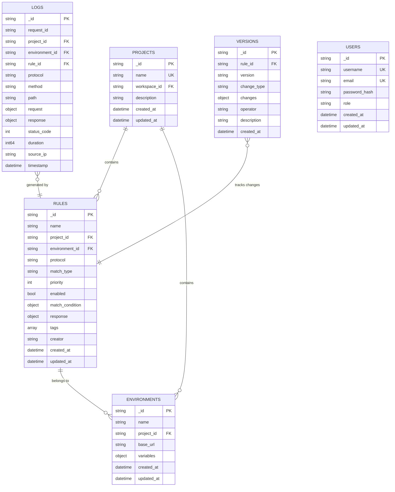

**图表来源**
- [models.go](file://internal/models/models.go#L48-L63)
- [models.go](file://internal/models/models.go#L104-L112)
- [models.go](file://internal/models/models.go#L114-L123)
- [database.go](file://internal/repository/database.go#L55-L146)

**节来源**
- [models.go](file://internal/models/models.go#L48-L176)
- [database.go](file://internal/repository/database.go#L55-L146)

## 索引设计

系统采用多层次索引策略优化查询性能：

### Rules集合索引

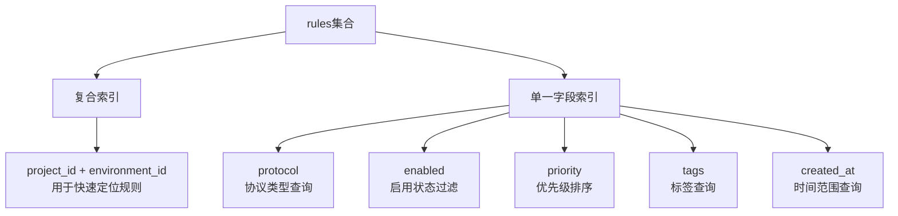

**图表来源**
- [database.go](file://internal/repository/database.go#L56-L79)

#### Rules集合索引详情

| 索引类型 | 字段组合 | 用途 | 性能影响 |
|----------|----------|------|----------|
| 复合索引 | project_id + environment_id | 快速定位特定环境规则 | O(log n) |
| 单字段索引 | protocol | 协议类型过滤查询 | O(log n) |
| 单字段索引 | enabled | 启用状态过滤 | O(log n) |
| 单字段索引 | priority | 优先级排序 | O(log n) |
| 单字段索引 | tags | 标签查询 | O(log n) |
| 单字段索引 | created_at | 时间范围查询 | O(log n) |

**节来源**
- [database.go](file://internal/repository/database.go#L56-L79)

### Projects集合索引

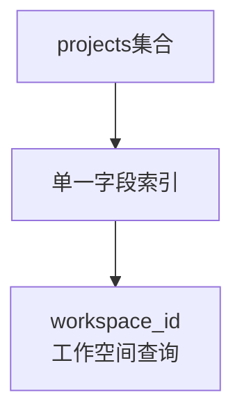

**图表来源**
- [database.go](file://internal/repository/database.go#L84-L91)

#### Projects集合索引详情

| 索引类型 | 字段 | 用途 | 性能影响 |
|----------|------|------|----------|
| 单字段索引 | workspace_id | 工作空间内项目查询 | O(log n) |

**节来源**
- [database.go](file://internal/repository/database.go#L84-L91)

### Environments集合索引

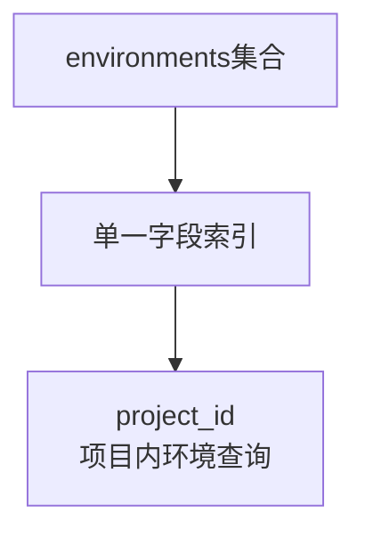

**图表来源**
- [database.go](file://internal/repository/database.go#L95-L102)

#### Environments集合索引详情

| 索引类型 | 字段 | 用途 | 性能影响 |
|----------|------|------|----------|
| 单字段索引 | project_id | 项目内环境查询 | O(log n) |

**节来源**
- [database.go](file://internal/repository/database.go#L95-L102)

### Logs集合索引（带TTL）

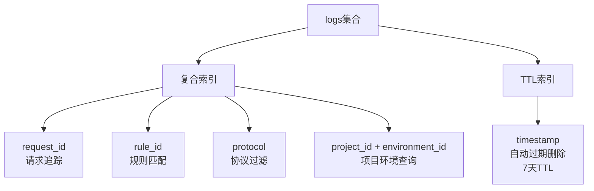

**图表来源**
- [database.go](file://internal/repository/database.go#L106-L129)

#### Logs集合索引详情

| 索引类型 | 字段组合 | 用途 | TTL设置 |
|----------|----------|------|---------|
| 单字段索引 | request_id | 请求追踪 | 无 |
| 单字段索引 | rule_id | 规则匹配 | 无 |
| 单字段索引 | protocol | 协议过滤 | 无 |
| 复合索引 | project_id + environment_id | 项目环境查询 | 无 |
| TTL索引 | timestamp | 自动过期删除 | 7天 |

**节来源**
- [database.go](file://internal/repository/database.go#L106-L129)

### Users集合索引

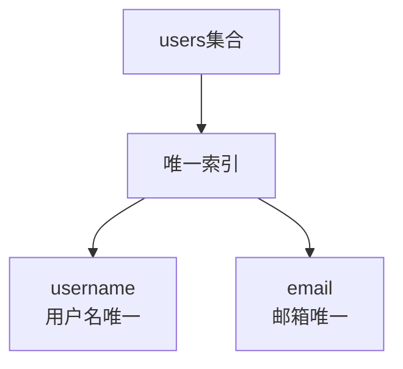

**图表来源**
- [database.go](file://internal/repository/database.go#L148-L162)

#### Users集合索引详情

| 索引类型 | 字段 | 用途 | 唯一性 |
|----------|------|------|--------|
| 唯一索引 | username | 用户名唯一性 | 是 |
| 唯一索引 | email | 邮箱唯一性 | 是 |

**节来源**
- [database.go](file://internal/repository/database.go#L148-L162)

## 数据生命周期管理

### 规则启用状态持久化

系统通过`Enabled`字段实现规则的启用状态持久化：

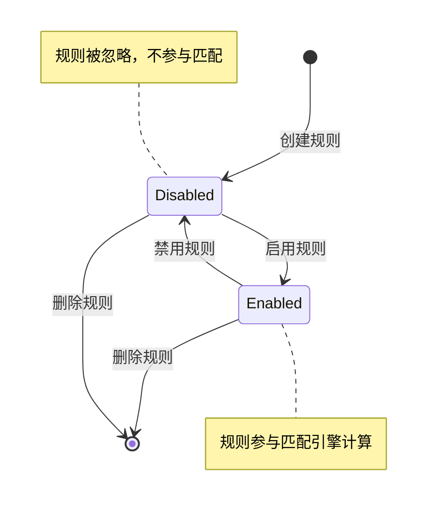

**图表来源**
- [models.go](file://internal/models/models.go#L56)

#### 启用状态管理特性

| 状态 | 字段值 | 匹配行为 | 查询优化 |
|------|--------|----------|----------|
| 启用 | true | 参与匹配计算 | enabled=true过滤 |
| 禁用 | false | 忽略不匹配 | enabled=false过滤 |

**节来源**
- [models.go](file://internal/models/models.go#L56)
- [rule_repository.go](file://internal/repository/rule_repository.go#L140-L161)

### 时间戳自动管理

所有核心实体都实现了自动时间戳管理：

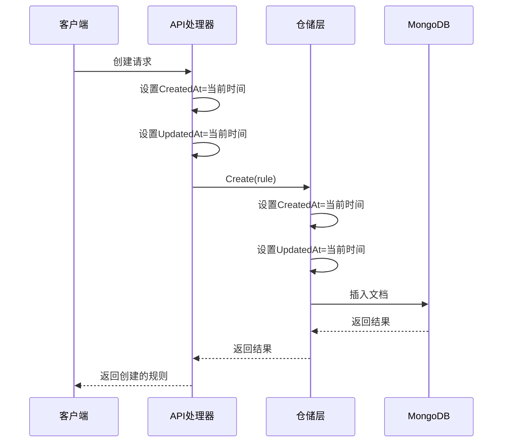

**图表来源**
- [project_repository.go](file://internal/repository/project_repository.go#L36-L49)
- [rule_repository.go](file://internal/repository/rule_repository.go#L36-L49)

**节来源**
- [project_repository.go](file://internal/repository/project_repository.go#L36-L49)
- [rule_repository.go](file://internal/repository/rule_repository.go#L36-L49)

## 项目级别数据隔离

### 工作空间隔离机制

系统通过工作空间（Workspace）实现项目级别的数据隔离：

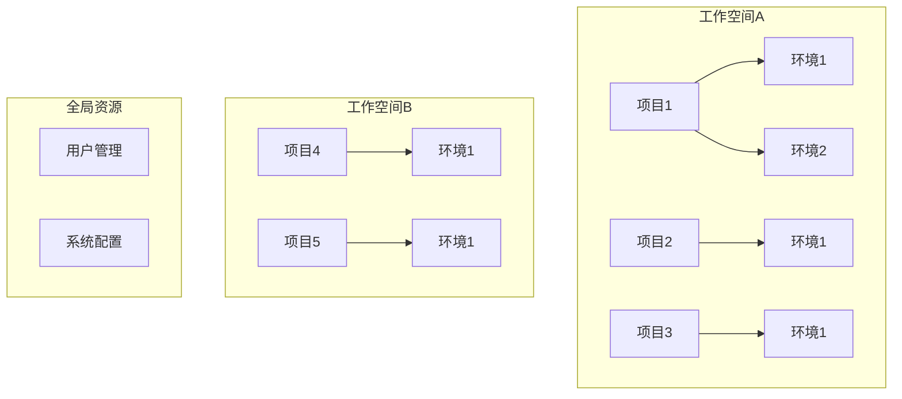

**图表来源**
- [models.go](file://internal/models/models.go#L125-L134)
- [project_repository.go](file://internal/repository/project_repository.go#L108-L122)

### 项目间数据隔离策略

| 隔离层级 | 隔离机制 | 实现方式 | 访问控制 |
|----------|----------|----------|----------|
| 工作空间级别 | WorkspaceID外键 | Project.WorkspaceID | 工作空间权限检查 |
| 项目级别 | ProjectID外键 | Rule.ProjectID, Environment.ProjectID | 项目成员权限 |
| 环境级别 | EnvironmentID外键 | Rule.EnvironmentID | 环境访问权限 |

**节来源**
- [models.go](file://internal/models/models.go#L107)
- [models.go](file://internal/models/models.go#L118)
- [models.go](file://internal/models/models.go#L51)

### 环境隔离机制

环境作为项目的子集，提供更细粒度的配置隔离：

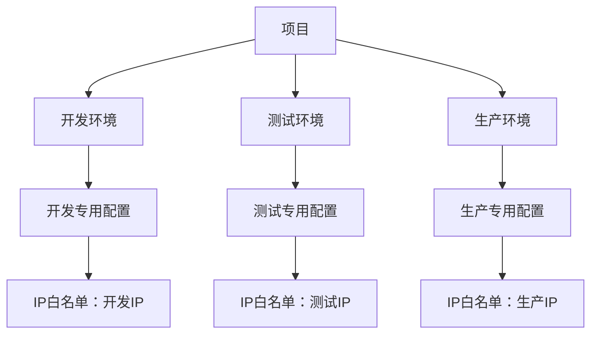

**图表来源**
- [models.go](file://internal/models/models.go#L114-L123)

**节来源**
- [models.go](file://internal/models/models.go#L114-L123)

## 数据访问模式

### 仓储模式实现

系统采用仓储模式封装数据访问逻辑：

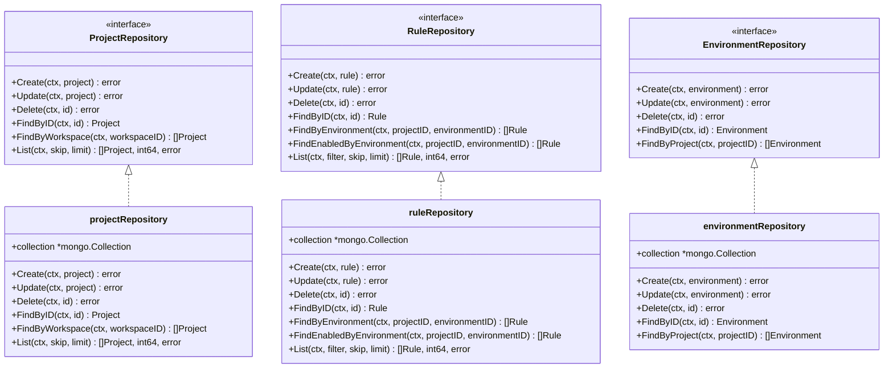

**图表来源**
- [project_repository.go](file://internal/repository/project_repository.go#L14-L22)
- [rule_repository.go](file://internal/repository/rule_repository.go#L14-L23)
- [project_repository.go](file://internal/repository/project_repository.go#L24-L33)
- [rule_repository.go](file://internal/repository/rule_repository.go#L25-L34)

### ORM映射实现

系统使用MongoDB Go Driver进行ORM映射：

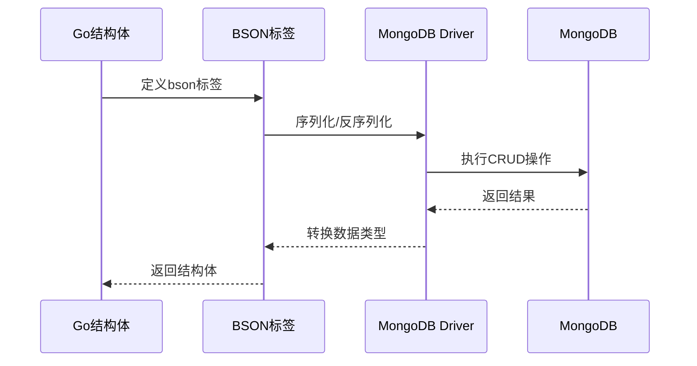

**图表来源**
- [models.go](file://internal/models/models.go#L48-L63)
- [project_repository.go](file://internal/repository/project_repository.go#L36-L49)

**节来源**
- [project_repository.go](file://internal/repository/project_repository.go#L14-L22)
- [rule_repository.go](file://internal/repository/rule_repository.go#L14-L23)

## 查询性能考量

### 查询优化策略

#### 1. 复合索引优化

系统针对常见查询模式设计复合索引：

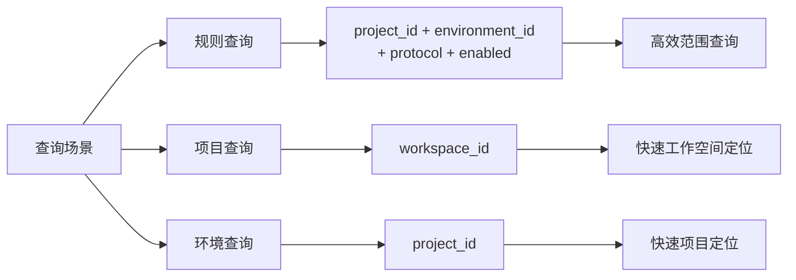

**图表来源**
- [database.go](file://internal/repository/database.go#L56-L102)

#### 2. 分页查询优化

系统支持高效的分页查询：

| 查询类型 | 优化策略 | 性能特点 | 适用场景 |
|----------|----------|----------|----------|
| 规则列表 | skip+limit+createdAt排序 | O(log n + k) | 大数据量分页 |
| 项目列表 | skip+limit+createdAt排序 | O(log n + k) | 项目浏览 |
| 环境查询 | 直接ID查询 | O(log n) | 单条查询 |
| 启用规则 | enabled=true过滤 | O(log n + k) | 性能优化 |

**节来源**
- [rule_repository.go](file://internal/repository/rule_repository.go#L164-L195)
- [project_repository.go](file://internal/repository/project_repository.go#L126-L153)

#### 3. TTL索引优化

日志集合使用TTL索引自动清理过期数据：

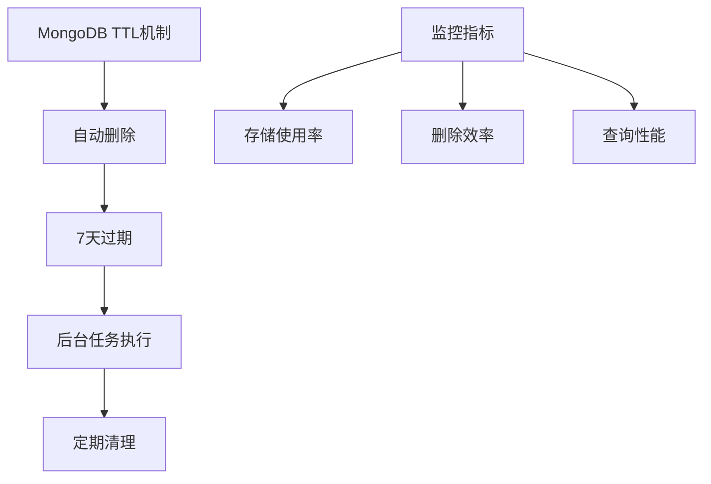

**图表来源**
- [database.go](file://internal/repository/database.go#L106-L129)

**节来源**
- [database.go](file://internal/repository/database.go#L106-L129)

### 查询模式分析

#### 常见查询模式

| 查询模式 | 索引使用 | 性能等级 | 优化建议 |
|----------|----------|----------|----------|
| 按ID查询 | _id索引 | O(log n) | 使用ObjectId查询 |
| 按项目查询 | project_id索引 | O(log n) | 使用复合索引 |
| 按环境查询 | environment_id索引 | O(log n) | 使用复合索引 |
| 按启用状态查询 | enabled索引 | O(log n) | 启用状态过滤 |
| 按优先级排序 | priority索引 | O(n log n) | 排序优化 |

**节来源**
- [rule_repository.go](file://internal/repository/rule_repository.go#L116-L161)

## 错误处理机制

### 错误分类体系

系统建立了完整的错误分类体系：

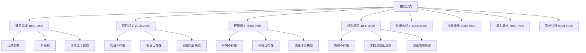

**图表来源**
- [errors.go](file://internal/models/errors.go#L30-L213)

### 错误响应格式

系统提供标准化的错误响应格式：

| 字段名 | 类型 | 用途 | 示例 |
|--------|------|------|------|
| code | int | 错误码 | 4001 |
| message | string | 英文错误信息 | "Rule not found" |
| details | string | 详细错误信息 | "Rule with ID xxx not found" |
| request_id | string | 请求跟踪ID | "req-123456" |

**节来源**
- [errors.go](file://internal/models/errors.go#L18-L28)
- [errors.go](file://internal/models/errors.go#L190-L213)

## 总结

Go Mock Server的数据模型设计体现了以下核心原则：

### 设计优势

1. **层次化数据结构**：通过Project-Environment-Rule的三层结构实现清晰的组织关系
2. **灵活的匹配机制**：Rule模型支持多种匹配类型和复杂的匹配条件
3. **高性能查询**：精心设计的复合索引和查询优化策略
4. **完善的生命周期管理**：自动时间戳和状态持久化机制
5. **强隔离性**：工作空间和项目级别的数据隔离

### 性能特点

- **查询优化**：复合索引支持复杂查询场景
- **存储优化**：TTL索引自动清理历史数据
- **并发安全**：MongoDB的ACID特性保证数据一致性
- **扩展性**：模块化的仓储模式支持水平扩展

### 应用场景

该数据模型特别适用于：
- 微服务Mock服务
- API测试环境管理
- 多环境配置管理
- 团队协作的Mock服务治理

通过这套完整的数据模型，系统能够高效地支持Mock服务的核心功能需求，同时保持良好的性能和可维护性。