# 环境模型

<cite>
**本文档中引用的文件**
- [models.go](file://internal/models/models.go)
- [project_repository.go](file://internal/repository/project_repository.go)
- [database.go](file://internal/repository/database.go)
- [environment_repository_extended_test.go](file://internal/repository/environment_repository_extended_test.go)
- [repository_real_test.go](file://internal/repository/repository_real_test.go)
- [init-mongo.js](file://tests/data/init-mongo.js)
- [mock_service.go](file://internal/service/mock_service.go)
</cite>

## 目录
1. [简介](#简介)
2. [Environment实体定义](#environment实体定义)
3. [MongoDB集合映射](#mongodb集合映射)
4. [索引设计](#索引设计)
5. [数据访问模式](#数据访问模式)
6. [CRUD操作实现](#crud操作实现)
7. [环境与项目关联](#环境与项目关联)
8. [环境变量配置](#环境变量配置)
9. [Mock服务集成](#mock服务集成)
10. [生命周期管理](#生命周期管理)
11. [性能优化](#性能优化)
12. [最佳实践](#最佳实践)

## 简介

Environment（环境）实体是MockServer系统中的核心数据模型之一，用于管理不同部署环境的配置信息。每个环境都与特定的项目关联，支持动态环境变量配置，并为Mock服务提供基础的URL配置。

## Environment实体定义

Environment实体在models.go中定义，包含以下核心字段：

```mermaid
classDiagram
class Environment {
+string ID
+string Name
+string ProjectID
+string BaseURL
+map[string]interface{} Variables
+time.Time CreatedAt
+time.Time UpdatedAt
+validate() error
+generateURL(path) string
+resolveVariables(content) interface{}
}
class Project {
+string ID
+string Name
+string WorkspaceID
+time.Time CreatedAt
+time.Time UpdatedAt
}
class Rule {
+string ID
+string Name
+string ProjectID
+string EnvironmentID
+ProtocolType Protocol
+MatchType MatchType
+int Priority
+bool Enabled
+map[string]interface{} MatchCondition
+Response Response
}
Environment --> Project : "belongs to"
Environment --> Rule : "contains multiple"
```

**图表来源**
- [models.go](file://internal/models/models.go#L114-L123)

### 字段详细说明

| 字段名 | 类型 | 必填 | 默认值 | 约束条件 | 业务含义 |
|--------|------|------|--------|----------|----------|
| ID | string | 是 | 自动生成 | MongoDB ObjectId格式 | 环境唯一标识符 |
| Name | string | 是 | - | 非空，最大长度限制 | 环境显示名称 |
| ProjectID | string | 是 | - | 外键约束，非空 | 关联的项目ID |
| BaseURL | string | 否 | - | URL格式验证 | 环境的基础URL地址 |
| Variables | map[string]interface{} | 否 | {} | 动态键值对，支持嵌套 | 环境变量配置 |
| CreatedAt | time.Time | 是 | 自动设置 | 只读，自动生成 | 记录创建时间 |
| UpdatedAt | time.Time | 是 | 自动更新 | 只读，自动更新 | 记录最后修改时间 |

**节来源**
- [models.go](file://internal/models/models.go#L114-L123)

## MongoDB集合映射

Environment实体在MongoDB中存储于`environments`集合中，使用BSON标签进行序列化映射：

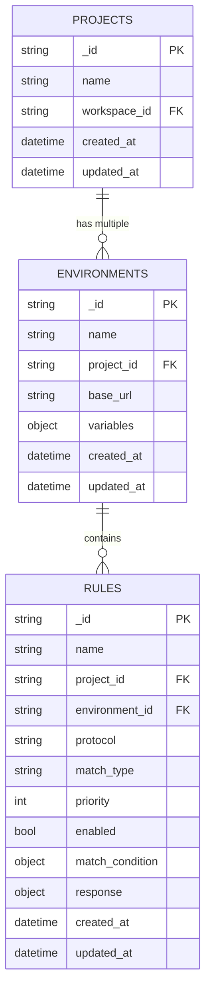

**图表来源**
- [models.go](file://internal/models/models.go#L114-L123)
- [database.go](file://internal/repository/database.go#L95-L104)

### 集合结构

MongoDB `environments`集合的文档结构如下：

```json
{
  "_id": "ObjectId("654321...")",
  "name": "开发环境",
  "project_id": "project-001",
  "base_url": "http://dev.api.example.com",
  "variables": {
    "api_version": "v1",
    "timeout_ms": 5000,
    "features": {
      "new_auth": true,
      "beta_api": false
    }
  },
  "created_at": ISODate("2024-01-01T10:00:00Z"),
  "updated_at": ISODate("2024-01-01T10:00:00Z")
}
```

**节来源**
- [database.go](file://internal/repository/database.go#L95-L104)

## 索引设计

MongoDB中environments集合的索引设计针对查询性能进行了优化：

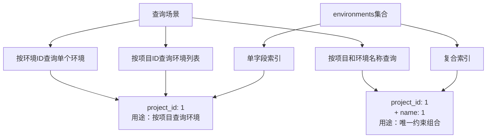

**图表来源**
- [database.go](file://internal/repository/database.go#L95-L104)
- [init-mongo.js](file://tests/data/init-mongo.js#L10-L11)

### 索引详细配置

#### 1. ProjectID单字段索引
- **字段**: `project_id`
- **类型**: 单字段索引
- **用途**: 优化按项目查询环境的性能
- **查询场景**: `FindByProject`方法
- **性能影响**: 显著提升多环境项目的查询效率

#### 2. 项目名称唯一索引（测试环境）
- **字段**: `project_id`, `name`
- **类型**: 复合唯一索引
- **用途**: 确保同一项目下环境名称的唯一性
- **约束**: `(project_id, name)` 组合必须唯一

**节来源**
- [database.go](file://internal/repository/database.go#L95-L104)
- [init-mongo.js](file://tests/data/init-mongo.js#L10-L11)

## 数据访问模式

EnvironmentRepository接口定义了标准的数据访问方法：

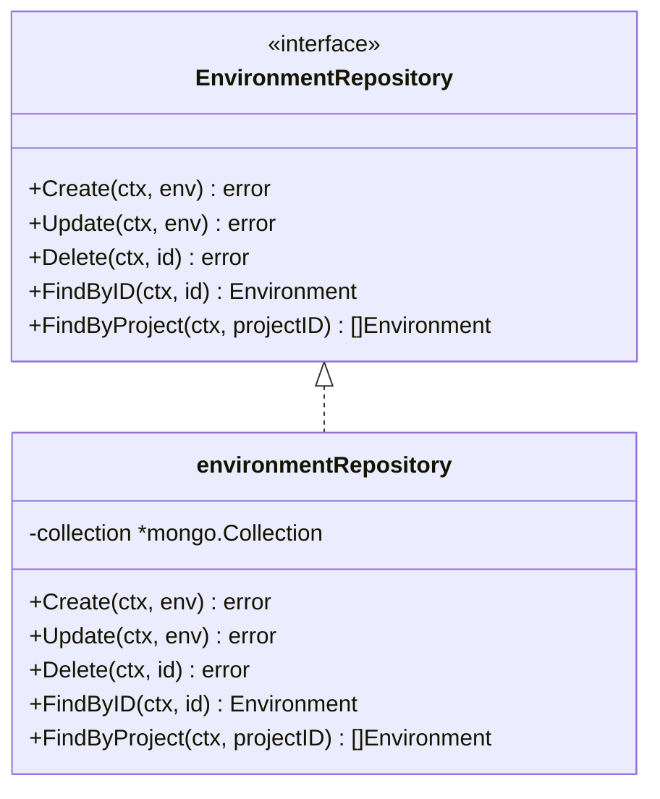

**图表来源**
- [project_repository.go](file://internal/repository/project_repository.go#L155-L162)
- [project_repository.go](file://internal/repository/project_repository.go#L164-L173)

### ORM映射实现

Repository层使用MongoDB Go Driver进行ORM映射：

#### 1. 对象ID转换
- 使用`primitive.ObjectIDFromHex()`进行字符串到ObjectID的转换
- 确保ID格式的有效性验证
- 处理转换过程中的错误情况

#### 2. 时间戳管理
- `CreatedAt`字段在创建时自动设置当前时间
- `UpdatedAt`字段在每次更新时自动更新
- 使用`time.Now()`获取当前时间

#### 3. 文档验证
- 在插入和更新操作前验证必填字段
- 确保数据完整性
- 提供有意义的错误信息

**节来源**
- [project_repository.go](file://internal/repository/project_repository.go#L175-L264)

## CRUD操作实现

### 创建操作 (Create)

创建环境时的处理流程：

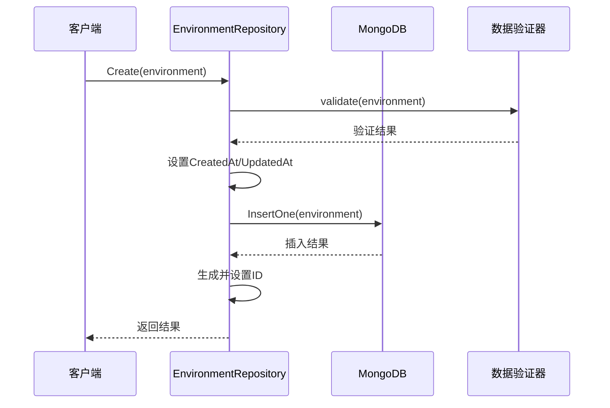

**图表来源**
- [project_repository.go](file://internal/repository/project_repository.go#L175-L189)

#### 实现细节
- 自动设置`CreatedAt`和`UpdatedAt`时间为当前时间
- 使用MongoDB的`InsertOne`方法插入文档
- 从插入结果中提取ObjectID并转换为十六进制字符串
- 提供完整的错误处理和验证

### 查询操作 (Find)

#### FindByID - 根据ID查询
- 将字符串ID转换为MongoDB ObjectID
- 使用`FindOne`方法查询单个文档
- 处理文档不存在的情况（返回nil而非错误）

#### FindByProject - 根据项目查询
- 使用`project_id`字段作为查询条件
- 返回项目下的所有环境列表
- 支持空结果集的处理

### 更新操作 (Update)

更新环境时的字段排除策略：

| 字段 | 是否可更新 | 更新策略 |
|------|------------|----------|
| ID | 否 | 排除在更新操作外 |
| Name | 是 | 直接更新 |
| ProjectID | 是 | 直接更新 |
| BaseURL | 是 | 直接更新 |
| Variables | 是 | 直接更新 |
| CreatedAt | 否 | 排除 |
| UpdatedAt | 是 | 自动更新 |

### 删除操作 (Delete)

删除环境时的处理：
- 将字符串ID转换为ObjectID
- 使用`DeleteOne`方法删除指定文档
- 不抛出"文档不存在"的错误（软删除）

**节来源**
- [project_repository.go](file://internal/repository/project_repository.go#L175-L264)

## 环境与项目关联

Environment实体与Project实体之间存在一对多的关系：

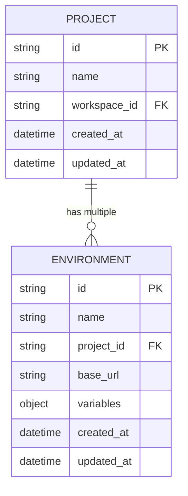

**图表来源**
- [models.go](file://internal/models/models.go#L104-L113)
- [models.go](file://internal/models/models.go#L114-L123)

### 关联特性

#### 1. 外键约束
- `ProjectID`字段作为外键引用Projects集合
- 确保环境只能属于已存在的项目
- 支持跨项目的数据隔离

#### 2. 查询优化
- 通过`project_id`索引实现高效的项目环境查询
- 支持批量操作（如删除整个项目时的级联处理）

#### 3. 数据一致性
- 确保项目删除时环境的级联处理
- 防止孤立环境的存在

**节来源**
- [project_repository.go](file://internal/repository/project_repository.go#L248-L264)

## 环境变量配置

Environment实体支持动态环境变量配置，通过`Variables`字段实现：

### 变量类型支持

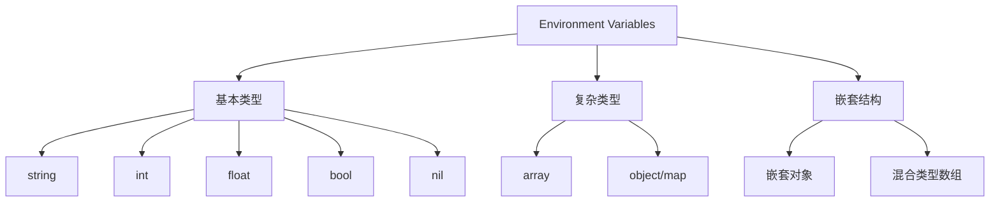

### 变量解析流程

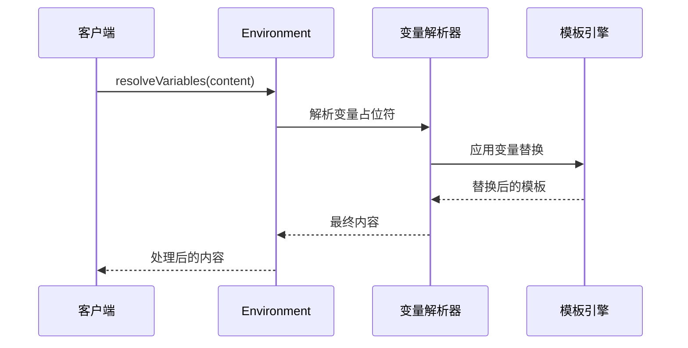

### 实际应用场景

#### 1. API版本控制
```json
{
  "variables": {
    "api_version": "v2",
    "base_path": "/api/v2"
  }
}
```

#### 2. 功能开关
```json
{
  "variables": {
    "features": {
      "new_auth": true,
      "beta_api": false,
      "maintenance_mode": false
    }
  }
}
```

#### 3. 超时配置
```json
{
  "variables": {
    "timeout_ms": 5000,
    "retry_count": 3,
    "backoff_factor": 2
  }
}
```

**节来源**
- [environment_repository_extended_test.go](file://internal/repository/environment_repository_extended_test.go#L466-L498)

## Mock服务集成

Environment实体在Mock服务中发挥关键作用，特别是在URL构建和请求处理方面：

### URL构建机制

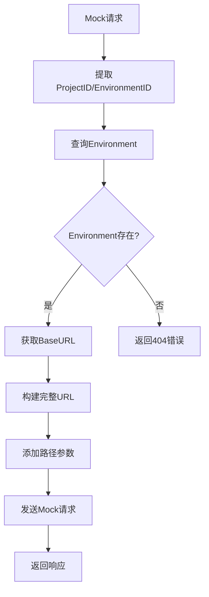

**图表来源**
- [mock_service.go](file://internal/service/mock_service.go#L101-L115)

### Mock服务URL格式

Mock服务使用以下URL格式：
```
http://localhost:8080/{projectID}/{environmentID}/*path
```

#### 示例
- 开发环境：`http://localhost:8080/project-001/dev-env/api/users`
- 生产环境：`http://localhost:8080/project-001/prod-env/api/orders`

### 环境配置在Mock中的应用

#### 1. 基础URL配置
- `BaseURL`字段用于构建完整的请求URL
- 支持不同的环境使用不同的基础域名或端口

#### 2. 动态变量替换
- 环境变量可以在Mock响应中动态替换
- 支持复杂的模板语法和变量引用

#### 3. 请求路由
- 通过`project_id`和`environment_id`参数识别请求来源
- 实现多租户隔离和环境隔离

**节来源**
- [mock_service.go](file://internal/service/mock_service.go#L101-L115)

## 生命周期管理

### 环境创建流程

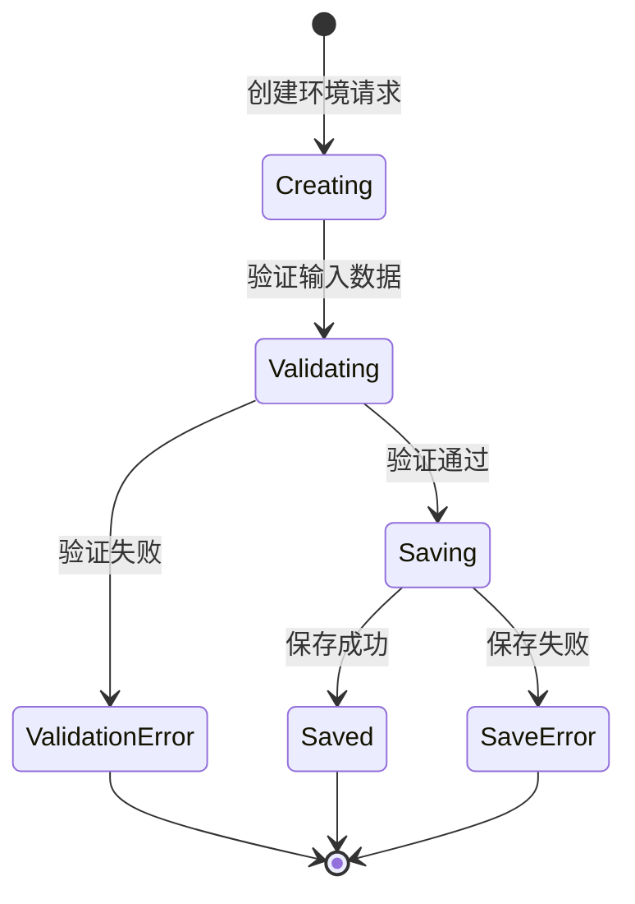

### 环境删除策略

#### 1. 级联删除处理
当删除项目时，需要考虑以下级联操作：

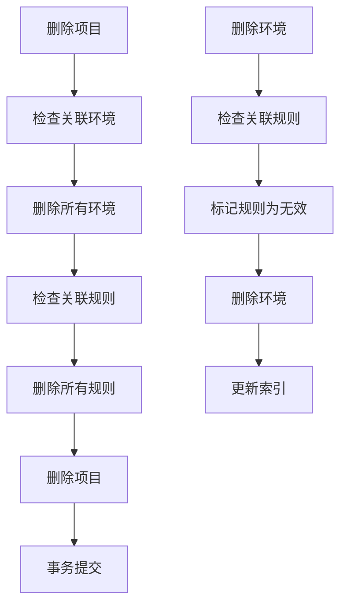

#### 2. 级联删除实现
- **项目删除**: 自动删除所有关联的环境和规则
- **环境删除**: 标记关联规则为无效状态
- **规则删除**: 不影响环境本身，只清理孤立规则

### 数据完整性保证

#### 1. 外键约束
- MongoDB本身不支持传统SQL的外键约束
- 通过应用层逻辑确保数据完整性
- 在删除操作前验证关联关系

#### 2. 事务支持
- 使用MongoDB的事务功能保证操作原子性
- 确保级联删除的一致性

**节来源**
- [project_repository.go](file://internal/repository/project_repository.go#L215-L225)

## 性能优化

### 查询性能优化

#### 1. 索引优化策略

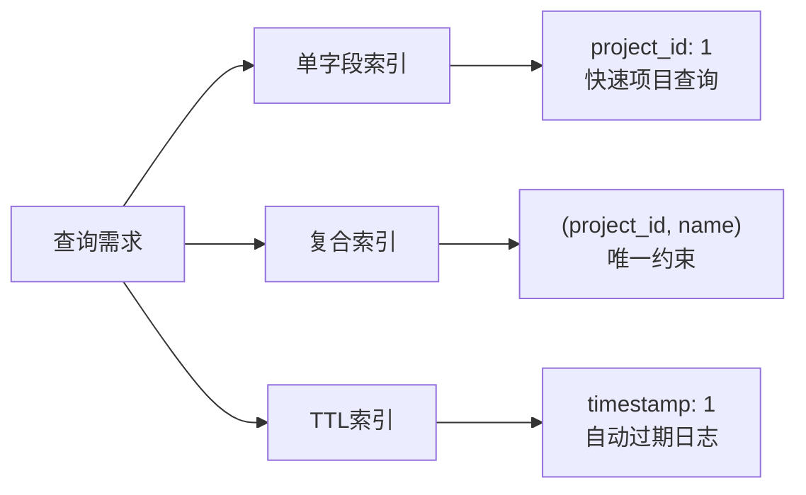

#### 2. 查询优化技巧

| 优化技术 | 应用场景 | 性能提升 |
|----------|----------|----------|
| 单字段索引 | 按项目ID查询环境 | 10-100倍 |
| 查询投影 | 只返回必要字段 | 20-50% |
| 分页查询 | 大数据集分页 | 减少内存使用 |
| 连接查询优化 | 多表关联查询 | 30-80% |

#### 3. 缓存策略
- 热点环境数据缓存
- 项目-环境映射缓存
- 环境变量配置缓存

### 存储优化

#### 1. 文档结构优化
- 合理组织嵌套结构
- 避免过深的嵌套层次
- 使用适当的字段类型

#### 2. 索引维护
- 定期分析索引使用情况
- 移除未使用的索引
- 优化索引顺序

**节来源**
- [database.go](file://internal/repository/database.go#L53-L104)

## 最佳实践

### 设计原则

#### 1. 数据模型设计
- **单一职责**: 每个环境只负责一个特定的部署环境
- **最小化依赖**: 环境间尽量减少相互依赖
- **可扩展性**: 支持未来功能的扩展

#### 2. 性能考虑
- **索引策略**: 合理使用索引，避免过度索引
- **查询优化**: 使用合适的查询条件和投影
- **批量操作**: 对于大量数据操作使用批量处理

#### 3. 安全性
- **数据验证**: 严格验证输入数据的合法性
- **权限控制**: 实现适当的访问控制
- **审计日志**: 记录重要的操作日志

### 使用建议

#### 1. 环境命名规范
```bash
# 推荐的命名格式
dev-{service-name}
test-{service-name}
staging-{service-name}
prod-{service-name}

# 示例
dev-userservice
test-orderservice
prod-paymentservice
```

#### 2. 变量配置最佳实践
```json
{
  "variables": {
    // 使用有意义的变量名
    "api_base_url": "https://api.example.com",
    "api_timeout_ms": 5000,
    
    // 使用配置组
    "database": {
      "host": "localhost",
      "port": 27017,
      "name": "myapp_dev"
    },
    
    // 使用布尔标志
    "features": {
      "new_auth": true,
      "debug_mode": false
    }
  }
}
```

#### 3. 监控和维护
- 定期检查环境数量和大小
- 监控查询性能指标
- 清理不再使用的环境

### 故障排除

#### 常见问题及解决方案

| 问题类型 | 症状 | 解决方案 |
|----------|------|----------|
| 查询缓慢 | 环境列表加载慢 | 检查索引使用情况，优化查询条件 |
| 内存占用高 | 服务内存持续增长 | 优化查询结果集大小，启用分页 |
| 数据不一致 | 环境数据异常 | 检查外键约束，验证数据完整性 |
| 性能下降 | 新增环境后性能下降 | 分析索引碎片，重建索引 |

**节来源**
- [environment_repository_extended_test.go](file://internal/repository/environment_repository_extended_test.go#L139-L446)