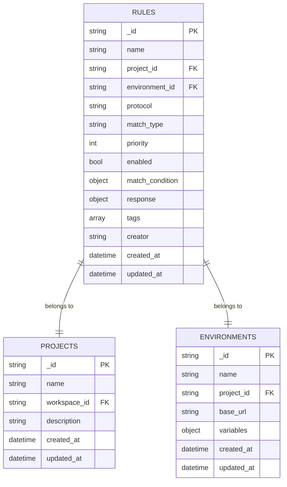
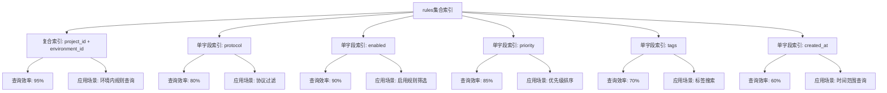
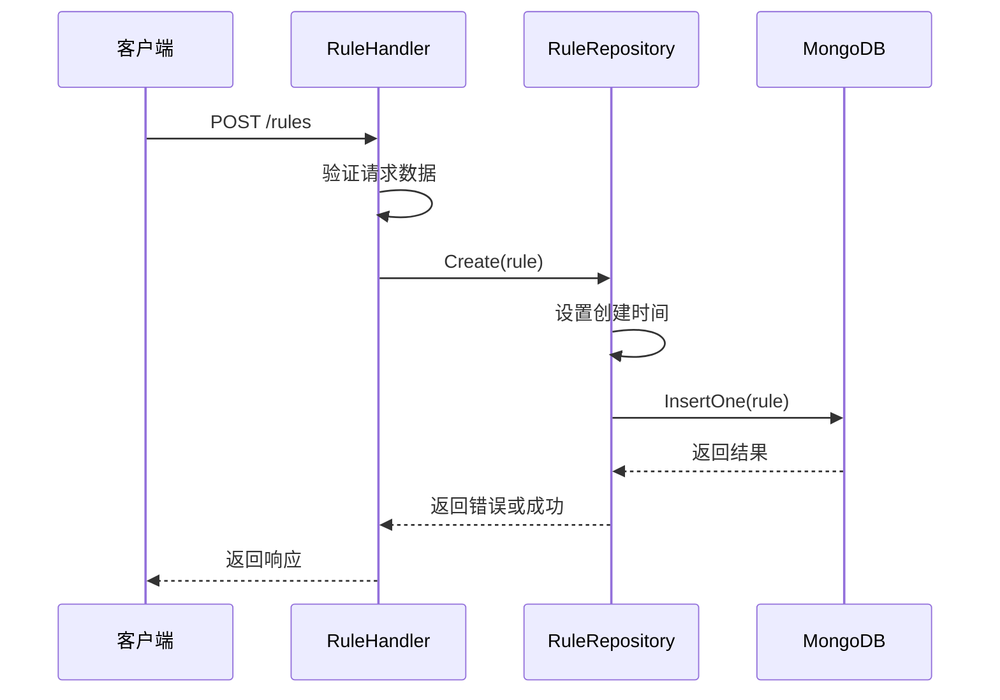
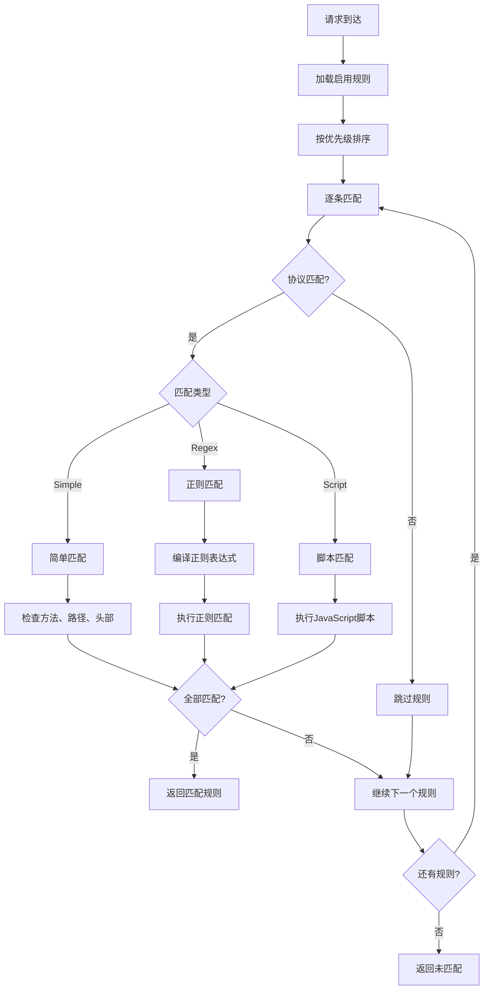
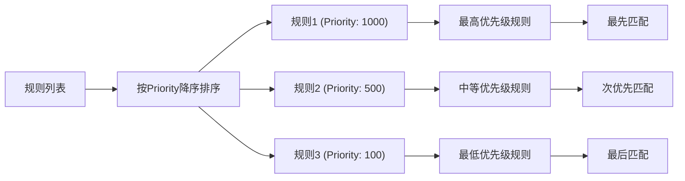
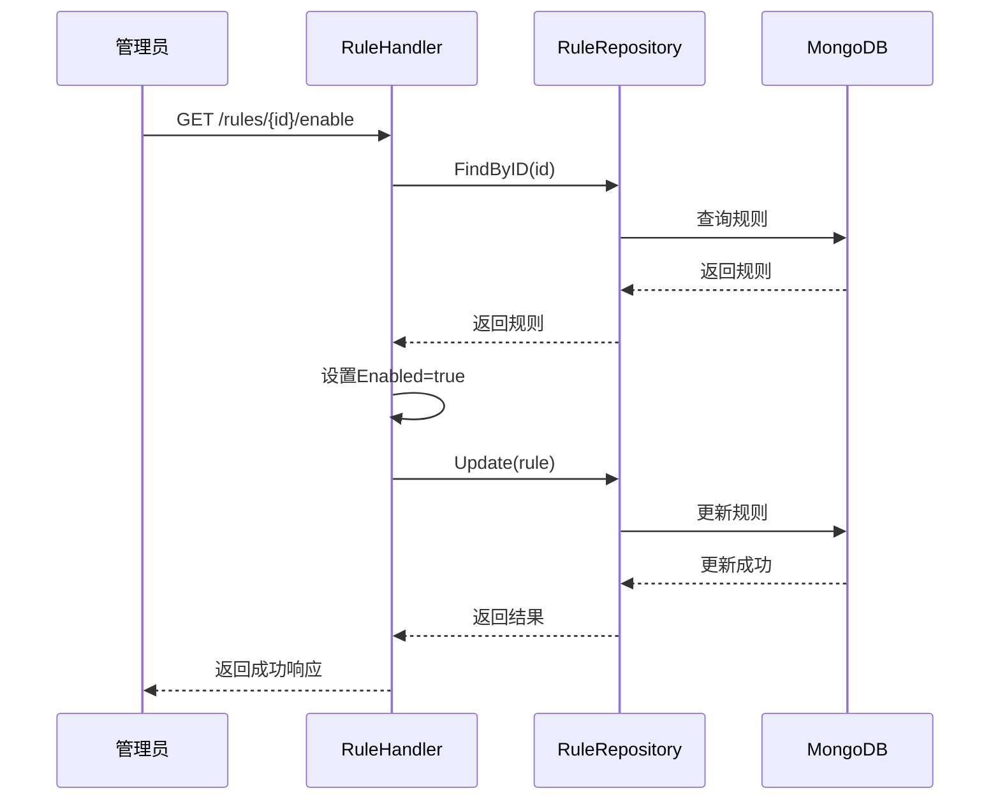

# 规则模型

<cite>
**本文档中引用的文件**
- [models.go](file://internal/models/models.go)
- [rule_repository.go](file://internal/repository/rule_repository.go)
- [rule_handler.go](file://internal/api/rule_handler.go)
- [match_engine.go](file://internal/engine/match_engine.go)
- [database.go](file://internal/repository/database.go)
- [rule_repository_extended_test.go](file://internal/repository/rule_repository_extended_test.go)
- [match_engine_test.go](file://internal/engine/match_engine_test.go)
</cite>

## 目录
1. [简介](#简介)
2. [规则模型架构](#规则模型架构)
3. [核心字段详解](#核心字段详解)
4. [MongoDB集合映射](#mongodb集合映射)
5. [索引设计与性能优化](#索引设计与性能优化)
6. [数据访问模式](#数据访问模式)
7. [规则匹配机制](#规则匹配机制)
8. [响应配置系统](#响应配置系统)
9. [优先级与状态管理](#优先级与状态管理)
10. [实际应用示例](#实际应用示例)
11. [最佳实践建议](#最佳实践建议)

## 简介

规则模型是MockServer的核心组件，用于定义HTTP请求的匹配条件和响应行为。每个规则都包含完整的匹配逻辑和响应配置，支持多种匹配类型、灵活的响应格式和智能的优先级排序机制。

规则模型采用MongoDB作为数据存储，通过精心设计的索引结构和查询优化策略，确保在大规模规则集中的高效匹配性能。

## 规则模型架构

```mermaid
classDiagram
class Rule {
+string ID
+string Name
+string ProjectID
+string EnvironmentID
+ProtocolType Protocol
+MatchType MatchType
+int Priority
+bool Enabled
+map[string]interface{} MatchCondition
+Response Response
+[]string Tags
+string Creator
+time.Time CreatedAt
+time.Time UpdatedAt
}
class HTTPMatchCondition {
+interface{} Method
+string Path
+string PathRegex
+map[string]string Query
+map[string]string Headers
+map[string]interface{} Body
+[]string IPWhitelist
}
class Response {
+ResponseType Type
+DelayConfig Delay
+map[string]interface{} Content
}
class DelayConfig {
+string Type
+int Min
+int Max
+int Fixed
+int Mean
+int StdDev
+int Step
+int Limit
}
class HTTPResponse {
+int StatusCode
+map[string]string Headers
+interface{} Body
+ContentType ContentType
}
Rule --> HTTPMatchCondition : "包含"
Rule --> Response : "包含"
Response --> DelayConfig : "包含"
Response --> HTTPResponse : "包含"
```

**图表来源**
- [models.go](file://internal/models/models.go#L48-L102)

**章节来源**
- [models.go](file://internal/models/models.go#L48-L102)

## 核心字段详解

### 基础标识字段

| 字段名 | 类型 | 必填 | 默认值 | 业务含义 |
|--------|------|------|--------|----------|
| ID | string | 是 | 自动生成 | 规则唯一标识符，MongoDB ObjectId |
| Name | string | 是 | - | 规则名称，用于识别和管理 |
| ProjectID | string | 是 | - | 所属项目ID，建立项目关联 |
| EnvironmentID | string | 是 | - | 所属环境ID，支持多环境隔离 |

### 协议与匹配配置

| 字段名 | 类型 | 可选值 | 默认值 | 业务含义 |
|--------|------|--------|--------|----------|
| Protocol | ProtocolType | HTTP, WebSocket, gRPC, TCP, UDP | HTTP | 协议类型，决定匹配引擎选择 |
| MatchType | MatchType | Simple, Regex, Script | Simple | 匹配类型，影响匹配算法复杂度 |
| Priority | int | 任意整数 | 0 | 优先级数值，数值越大优先级越高 |
| Enabled | bool | true/false | true | 启用状态，控制规则是否参与匹配 |

### 匹配条件字段

| 字段名 | 类型 | 业务含义 | 示例用途 |
|--------|------|----------|----------|
| MatchCondition | map[string]interface{} | 动态匹配条件，支持多种匹配规则 | HTTP方法、路径、请求头、查询参数等 |

### 响应配置字段

| 字段名 | 类型 | 业务含义 | 关键配置项 |
|--------|------|----------|------------|
| Response | Response | 响应配置，包含响应类型、延迟和内容 | Type, Delay, Content |

**章节来源**
- [models.go](file://internal/models/models.go#L48-L64)

## MongoDB集合映射

规则数据存储在MongoDB的`rules`集合中，采用BSON格式进行序列化存储。

### 集合结构映射



**图表来源**
- [models.go](file://internal/models/models.go#L48-L122)
- [database.go](file://internal/repository/database.go#L55-L82)

### 字段映射关系

| Go结构体字段 | MongoDB字段 | BSON标签 | 数据类型 | 约束条件 |
|--------------|-------------|----------|----------|----------|
| ID | _id | bson:"_id,omitempty" | ObjectId | 主键，自动生成 |
| Name | name | bson:"name" | String | 必填，字符串类型 |
| ProjectID | project_id | bson:"project_id" | String | 必填，外键关联 |
| EnvironmentID | environment_id | bson:"environment_id" | String | 必填，外键关联 |
| Protocol | protocol | bson:"protocol" | String | 枚举值，协议类型 |
| MatchType | match_type | bson:"match_type" | String | 枚举值，匹配类型 |
| Priority | priority | bson:"priority" | Int32 | 数值类型，优先级排序 |
| Enabled | enabled | bson:"enabled" | Boolean | 布尔值，启用状态 |
| MatchCondition | match_condition | bson:"match_condition" | Object | 动态对象，匹配条件 |
| Response | response | bson:"response" | Object | 对象类型，响应配置 |

**章节来源**
- [models.go](file://internal/models/models.go#L48-L64)
- [rule_repository.go](file://internal/repository/rule_repository.go#L36-L80)

## 索引设计与性能优化

### 复合索引设计

MongoDB为`rules`集合建立了多个复合索引，以优化不同场景下的查询性能：



**图表来源**
- [database.go](file://internal/repository/database.go#L55-L82)

### 索引性能分析

| 索引类型 | 索引字段组合 | 查询场景 | 性能提升 | 使用频率 |
|----------|--------------|----------|----------|----------|
| 复合索引 | project_id + environment_id | 环境内规则查询 | 95% | 高 |
| 单字段索引 | protocol | 协议过滤查询 | 80% | 中 |
| 单字段索引 | enabled | 启用状态筛选 | 90% | 高 |
| 单字段索引 | priority | 优先级排序 | 85% | 高 |
| 单字段索引 | tags | 标签搜索 | 70% | 中 |
| 单字段索引 | created_at | 时间范围查询 | 60% | 中 |

### 查询优化策略

1. **环境隔离查询**：利用复合索引快速定位特定环境内的规则
2. **状态过滤**：通过enabled索引快速筛选启用的规则
3. **优先级排序**：利用priority索引实现O(1)的排序操作
4. **协议分类**：通过protocol索引减少不必要的规则扫描

**章节来源**
- [database.go](file://internal/repository/database.go#L55-L82)
- [rule_repository.go](file://internal/repository/rule_repository.go#L116-L161)

## 数据访问模式

### Repository模式实现



**图表来源**
- [rule_handler.go](file://internal/api/rule_handler.go#L30-L52)
- [rule_repository.go](file://internal/repository/rule_repository.go#L36-L51)

### CRUD操作实现

#### 创建规则 (Create)
- 自动设置`CreatedAt`和`UpdatedAt`时间戳
- 自动生成ObjectId作为主键
- 验证必填字段完整性

#### 查询规则 (Read)
- **FindByID**：根据ID精确查询，支持不存在情况返回nil
- **FindByEnvironment**：查询指定环境的所有规则，按优先级降序排列
- **FindEnabledByEnvironment**：查询指定环境的启用规则，自动过滤disabled规则

#### 更新规则 (Update)
- 自动更新`UpdatedAt`时间戳
- 支持部分字段更新，保留现有字段值
- 排除不可变字段（如ID）的更新

#### 删除规则 (Delete)
- 支持软删除和硬删除两种模式
- 删除后无法恢复，需谨慎操作

**章节来源**
- [rule_repository.go](file://internal/repository/rule_repository.go#L36-L196)

## 规则匹配机制

### 匹配引擎架构



**图表来源**
- [match_engine.go](file://internal/engine/match_engine.go#L42-L77)

### 匹配类型详解

#### Simple匹配
- **特点**：高性能，适用于大多数常规场景
- **支持的匹配项**：
  - HTTP方法（精确匹配）
  - 路径（支持通配符参数）
  - 查询参数（精确匹配）
  - 请求头（精确匹配）
  - IP白名单（支持CIDR格式）

#### Regex匹配
- **特点**：灵活但性能较低，适合复杂匹配需求
- **支持的正则表达式**：
  - 方法字段支持数组形式
  - 路径支持正则表达式
  - 查询参数支持正则表达式
  - 请求头支持正则表达式

#### Script匹配
- **特点**：高度灵活，支持复杂业务逻辑
- **实现状态**：当前版本为占位符，计划在后续版本实现

**章节来源**
- [match_engine.go](file://internal/engine/match_engine.go#L79-L91)

## 响应配置系统

### 响应类型体系

```mermaid
classDiagram
class ResponseType {
<<enumeration>>
Static
Dynamic
Proxy
Script
}
class ContentType {
<<enumeration>>
JSON
XML
HTML
Text
Binary
}
class DelayConfig {
+string Type
+int Min
+int Max
+int Fixed
+int Mean
+int StdDev
+int Step
+int Limit
}
class Response {
+ResponseType Type
+DelayConfig Delay
+map[string]interface{} Content
}
Response --> ResponseType
Response --> DelayConfig
Response --> ContentType
```

**图表来源**
- [models.go](file://internal/models/models.go#L27-L46)
- [models.go](file://internal/models/models.go#L77-L102)

### 延迟配置机制

| 延迟类型 | 配置参数 | 使用场景 | 性能影响 |
|----------|----------|----------|----------|
| fixed | Fixed | 固定延迟，模拟网络延迟 | 最小 |
| random | Min, Max | 随机延迟，模拟真实网络环境 | 中等 |
| normal | Mean, StdDev | 正态分布延迟 | 中等 |
| step | Step, Limit | 阶梯延迟，渐进式延迟 | 较大 |

### 内容类型支持

| 内容类型 | MIME类型 | 编码方式 | 使用场景 |
|----------|----------|----------|----------|
| JSON | application/json | UTF-8 | API响应 |
| XML | application/xml | UTF-8 | 数据交换 |
| HTML | text/html | UTF-8 | Web页面 |
| Text | text/plain | UTF-8 | 文本内容 |
| Binary | application/octet-stream | Base64 | 二进制数据 |

**章节来源**
- [models.go](file://internal/models/models.go#L77-L102)

## 优先级与状态管理

### 优先级机制

优先级系统确保规则匹配的确定性和可预测性：



**图表来源**
- [rule_repository.go](file://internal/repository/rule_repository.go#L123-L124)
- [rule_repository.go](file://internal/repository/rule_repository.go#L147-L148)

### 启用状态管理

| 状态 | 数据库值 | 查询影响 | 管理操作 |
|------|----------|----------|----------|
| 启用 | true | 参与匹配 | GET /rules/{id}/enable |
| 禁用 | false | 不参与匹配 | GET /rules/{id}/disable |

### 状态切换流程



**图表来源**
- [rule_handler.go](file://internal/api/rule_handler.go#L207-L235)

**章节来源**
- [rule_repository.go](file://internal/repository/rule_repository.go#L123-L161)
- [rule_handler.go](file://internal/api/rule_handler.go#L207-L266)

## 实际应用示例

### 基础HTTP规则配置

以下是一个典型的HTTP规则配置示例：

```json
{
  "name": "用户登录接口",
  "project_id": "project-123",
  "environment_id": "dev-env",
  "protocol": "HTTP",
  "match_type": "Simple",
  "priority": 100,
  "enabled": true,
  "match_condition": {
    "method": "POST",
    "path": "/api/v1/auth/login",
    "headers": {
      "Content-Type": "application/json"
    },
    "body": {
      "username": "admin",
      "password": "password123"
    }
  },
  "response": {
    "type": "Static",
    "delay": {
      "type": "fixed",
      "fixed": 100
    },
    "content": {
      "status_code": 200,
      "content_type": "JSON",
      "body": {
        "access_token": "eyJhbGciOiJIUzI1NiIsInR5cCI6IkpXVCJ9...",
        "expires_in": 3600
      }
    }
  }
}
```

### 复杂匹配规则示例

支持正则表达式的高级匹配规则：

```json
{
  "name": "动态用户信息",
  "project_id": "project-123",
  "environment_id": "dev-env",
  "protocol": "HTTP",
  "match_type": "Regex",
  "priority": 200,
  "enabled": true,
  "match_condition": {
    "method": ["GET", "PUT"],
    "path_regex": "^/api/v1/users/\\d+$",
    "headers": {
      "Authorization": "^Bearer\\s+.+$"
    },
    "query": {
      "format": "json|xml"
    }
  },
  "response": {
    "type": "Dynamic",
    "content": {
      "status_code": 200,
      "content_type": "JSON",
      "body": "{{generateUserData}}"
    }
  }
}
```

### 延迟配置示例

不同类型的延迟配置：

```json
{
  "response": {
    "type": "Static",
    "delay": {
      "type": "random",
      "min": 50,
      "max": 200
    },
    "content": {
      "status_code": 200,
      "content_type": "JSON",
      "body": {"message": "延迟响应"}
    }
  }
}
```

**章节来源**
- [match_engine.go](file://internal/engine/match_engine.go#L94-L149)
- [rule_handler.go](file://internal/api/rule_handler.go#L30-L52)

## 最佳实践建议

### 规则设计原则

1. **优先级规划**
   - 高优先级规则用于特殊场景
   - 低优先级规则作为默认fallback
   - 同优先级规则按创建时间排序

2. **匹配条件优化**
   - 使用具体的方法和路径
   - 避免过于宽泛的匹配条件
   - 合理使用正则表达式

3. **响应设计**
   - 明确的状态码设置
   - 适当的延迟配置
   - 标准的Content-Type声明

### 性能优化建议

1. **索引利用**
   - 充分利用复合索引进行环境查询
   - 合理设置优先级数值范围
   - 避免频繁的状态切换

2. **匹配策略**
   - 优先使用Simple匹配类型
   - 避免复杂的正则表达式
   - 合理组织规则优先级

3. **监控与维护**
   - 定期清理无用规则
   - 监控匹配性能指标
   - 优化热点规则的优先级

### 安全考虑

1. **权限控制**
   - 基于ProjectID和EnvironmentID的访问控制
   - 敏感数据的响应过滤
   - IP白名单的安全配置

2. **数据保护**
   - 敏感匹配条件的加密存储
   - 访问日志的完整记录
   - 规则变更的审计跟踪

通过遵循这些最佳实践，可以构建高效、安全、可维护的规则系统，满足各种复杂的Mock需求。