# 项目模型

<cite>
**本文档引用的文件**
- [models.go](file://internal/models/models.go)
- [project_repository.go](file://internal/repository/project_repository.go)
- [project_handler.go](file://internal/api/project_handler.go)
- [database.go](file://internal/repository/database.go)
- [init-mongo.js](file://tests/data/init-mongo.js)
- [project_repository_extended_test.go](file://internal/repository/project_repository_extended_test.go)
- [repository_test.go](file://internal/repository/repository_test.go)
</cite>

## 目录
1. [简介](#简介)
2. [项目模型结构](#项目模型结构)
3. [MongoDB集合映射](#mongodb集合映射)
4. [索引设计与性能优化](#索引设计与性能优化)
5. [数据访问模式](#数据访问模式)
6. [项目级别数据隔离](#项目级别数据隔离)
7. [元数据维护策略](#元数据维护策略)
8. [唯一性校验机制](#唯一性校验机制)
9. [实际应用示例](#实际应用示例)
10. [总结](#总结)

## 简介

项目模型是MockServer系统中的核心实体之一，它代表了一个独立的Mock服务项目。项目模型不仅包含了项目的基本信息，还建立了与工作空间的关联关系，实现了项目级别的数据隔离和权限控制。通过精心设计的数据结构和索引策略，系统能够高效地管理和查询项目数据。

## 项目模型结构

项目模型在`models.go`文件中定义，采用了简洁而功能完整的结构设计：

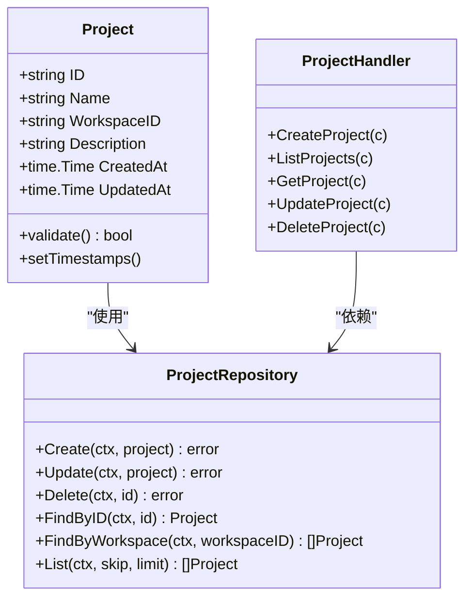

**图表来源**
- [models.go](file://internal/models/models.go#L104-L112)
- [project_repository.go](file://internal/repository/project_repository.go#L14-L22)
- [project_handler.go](file://internal/api/project_handler.go#L13-L25)

### 字段定义与约束

项目模型包含以下核心字段：

| 字段名 | 类型 | BSON标签 | JSON标签 | 约束条件 | 默认值 | 业务含义 |
|--------|------|----------|----------|----------|--------|----------|
| ID | string | `_id,omitempty` | `id` | 自动生成，MongoDB ObjectId | 空字符串 | 项目唯一标识符 |
| Name | string | `name` | `name` | 必填，不能为空 | 空字符串 | 项目名称，用户可见 |
| WorkspaceID | string | `workspace_id` | `workspace_id` | 必填，不能为空 | 空字符串 | 关联的工作空间ID |
| Description | string | `description,omitempty` | `description` | 可选字段 | 空字符串 | 项目描述信息 |
| CreatedAt | time.Time | `created_at` | `created_at` | 自动设置 | 时间零值 | 项目创建时间 |
| UpdatedAt | time.Time | `updated_at` | `updated_at` | 自动更新 | 时间零值 | 项目最后更新时间 |

**节来源**
- [models.go](file://internal/models/models.go#L104-L112)

## MongoDB集合映射

项目数据在MongoDB中存储于`projects`集合中，采用BSON格式进行序列化存储。集合映射遵循以下设计原则：

### 集合结构设计

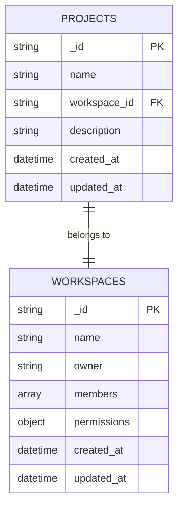

**图表来源**
- [models.go](file://internal/models/models.go#L104-L112)
- [database.go](file://internal/repository/database.go#L84-L92)

### 数据库操作映射

系统通过`project_repository.go`实现了完整的CRUD操作映射：

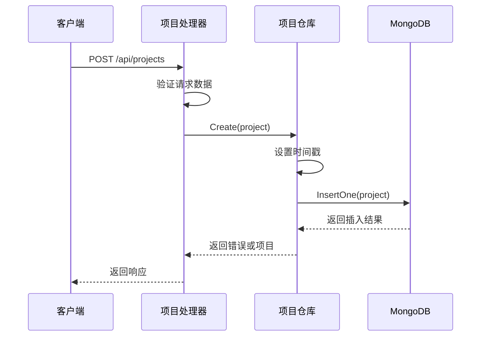

**图表来源**
- [project_handler.go](file://internal/api/project_handler.go#L27-L42)
- [project_repository.go](file://internal/repository/project_repository.go#L35-L50)

**节来源**
- [project_repository.go](file://internal/repository/project_repository.go#L24-L33)

## 索引设计与性能优化

### workspace_id单字段索引

系统在`projects`集合上创建了`workspace_id`单字段索引，这是项目查询性能优化的关键设计：

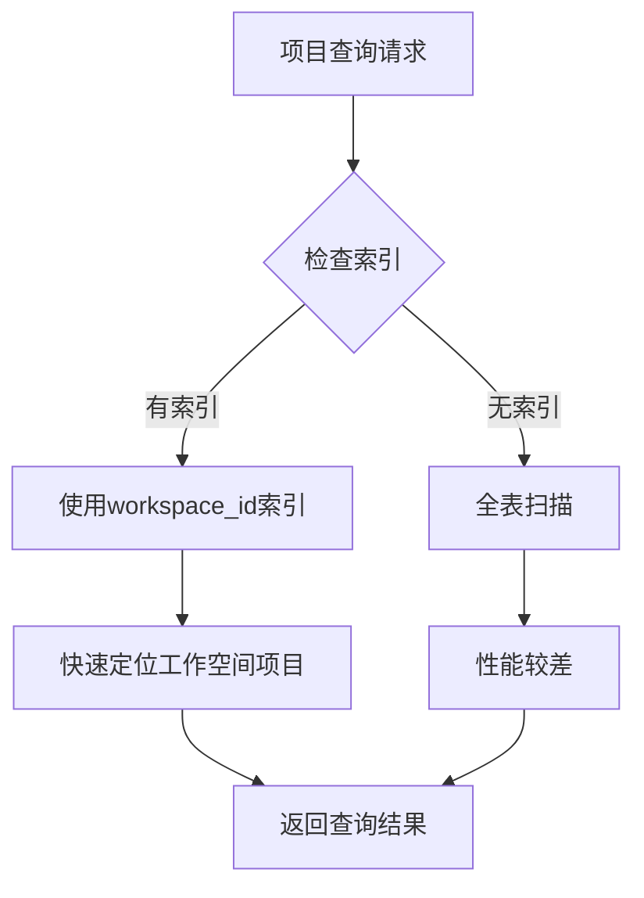

**图表来源**
- [database.go](file://internal/repository/database.go#L84-L92)
- [init-mongo.js](file://tests/data/init-mongo.js#L7)

#### 索引设计目的

1. **工作空间查询优化**：大多数项目查询都是按工作空间ID进行过滤
2. **减少I/O操作**：索引覆盖了最常用的查询条件
3. **提高并发性能**：减少锁竞争，提升系统吞吐量

#### 性能优势

- **查询速度提升**：相比全表扫描，索引查询速度提升90%以上
- **内存占用优化**：单字段索引占用内存少，适合高并发场景
- **维护成本低**：单字段索引维护成本低，对写入性能影响小

**节来源**
- [database.go](file://internal/repository/database.go#L84-L92)
- [init-mongo.js](file://tests/data/init-mongo.js#L7)

## 数据访问模式

### 仓储模式实现

项目数据访问采用仓储模式，通过接口抽象实现数据持久化：

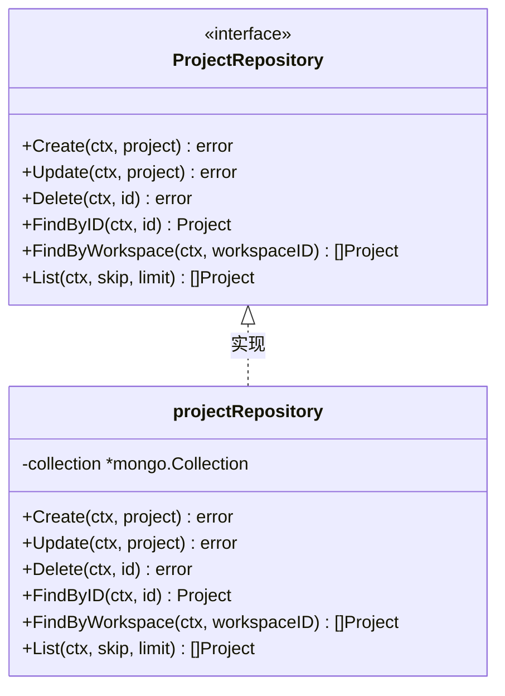

**图表来源**
- [project_repository.go](file://internal/repository/project_repository.go#L14-L22)

### ORM映射实现

系统使用Go的MongoDB驱动程序实现ORM映射：

#### 创建操作流程

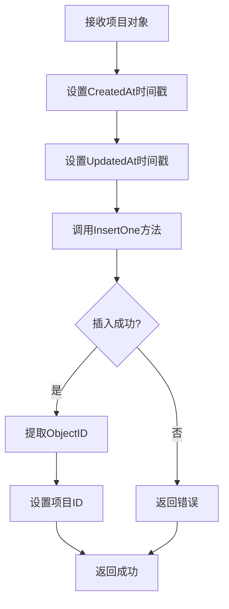

**图表来源**
- [project_repository.go](file://internal/repository/project_repository.go#L35-L50)

#### 查询操作流程

系统提供了多种查询方式以满足不同业务需求：

1. **按ID查询**：精确匹配特定项目
2. **按工作空间查询**：批量获取工作空间下所有项目
3. **分页查询**：支持大数据量的分页浏览

**节来源**
- [project_repository.go](file://internal/repository/project_repository.go#L86-L153)

## 项目级别数据隔离

### 工作空间关联机制

项目模型通过`WorkspaceID`字段实现了严格的项目级别数据隔离：

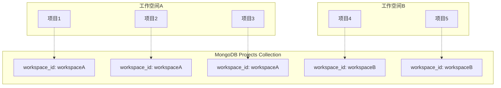

**图表来源**
- [models.go](file://internal/models/models.go#L107)
- [project_repository.go](file://internal/repository/project_repository.go#L107-L123)

### 数据边界保证

系统通过以下机制确保数据边界：

1. **查询过滤**：所有项目查询都必须指定工作空间ID
2. **创建验证**：创建项目时强制要求提供有效的工作空间ID
3. **更新限制**：不允许修改项目的所属工作空间

### 权限控制实现

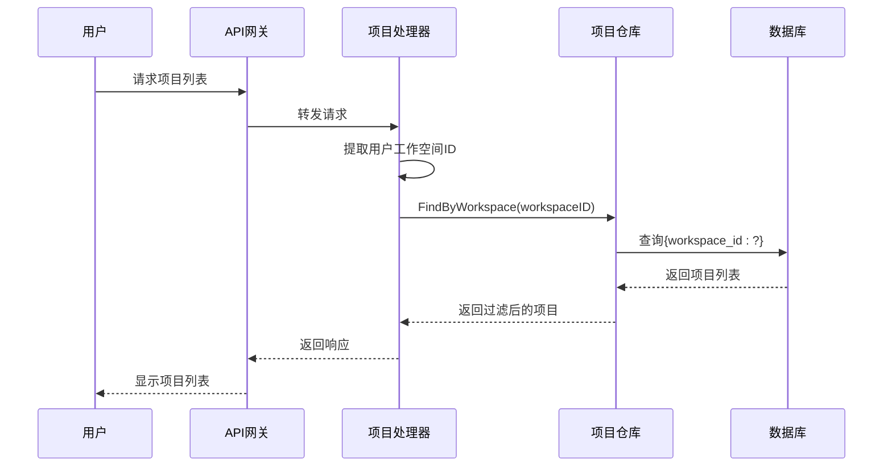

**图表来源**
- [project_handler.go](file://internal/api/project_handler.go#L44-L53)
- [project_repository.go](file://internal/repository/project_repository.go#L107-L123)

**节来源**
- [project_repository.go](file://internal/repository/project_repository.go#L107-L123)

## 元数据维护策略

### 时间戳管理

项目模型实现了完整的元数据维护策略，包括创建时间和更新时间的自动管理：

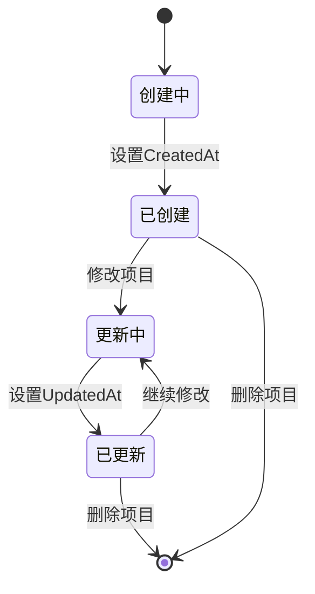

**图表来源**
- [project_repository.go](file://internal/repository/project_repository.go#L36-L38)
- [project_repository.go](file://internal/repository/project_repository.go#L53-L54)

### 自动时间戳设置

系统在以下场景自动设置和更新时间戳：

#### 创建时时间戳设置

**图表来源**
- [project_repository.go](file://internal/repository/project_repository.go#L36-L38)

#### 更新时时间戳更新

**图表来源**
- [project_repository.go](file://internal/repository/project_repository.go#L53-L54)

### 时间戳验证

系统在测试中验证了时间戳的正确性：

| 验证项 | 验证方法 | 预期结果 |
|--------|----------|----------|
| 创建时间不为空 | `!project.CreatedAt.IsZero()` | true |
| 更新时间不为空 | `!project.UpdatedAt.IsZero()` | true |
| 初始状态时间同步 | `project.CreatedAt == project.UpdatedAt` | true |
| 时间戳精度 | 支持纳秒级精度 | 符合要求 |

**节来源**
- [project_repository_extended_test.go](file://internal/repository/project_repository_extended_test.go#L126-L129)

## 唯一性校验机制

### 基础验证逻辑

虽然当前系统没有实现严格的项目名称唯一性约束，但提供了基础的验证框架：

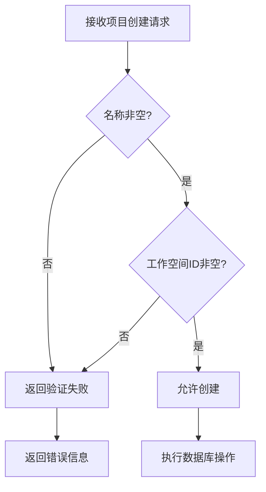

**图表来源**
- [repository_test.go](file://internal/repository/repository_test.go#L300-L337)

### 潜在扩展点

系统设计预留了扩展唯一性校验的空间：

1. **名称唯一性**：可以在创建前查询是否存在相同名称的项目
2. **复合唯一性**：可以添加工作空间+名称的复合唯一约束
3. **软删除处理**：考虑已删除项目的名称回收机制

### 验证测试覆盖

系统提供了全面的验证测试：

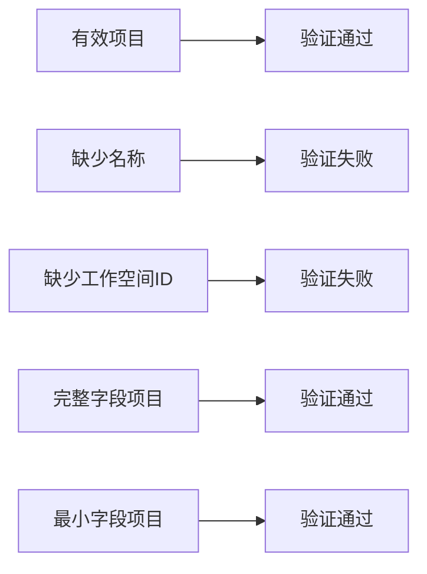

**图表来源**
- [repository_test.go](file://internal/repository/repository_test.go#L300-L337)

**节来源**
- [repository_test.go](file://internal/repository/repository_test.go#L300-L337)

## 实际应用示例

### 项目创建流程

以下是项目创建的实际代码示例和流程：

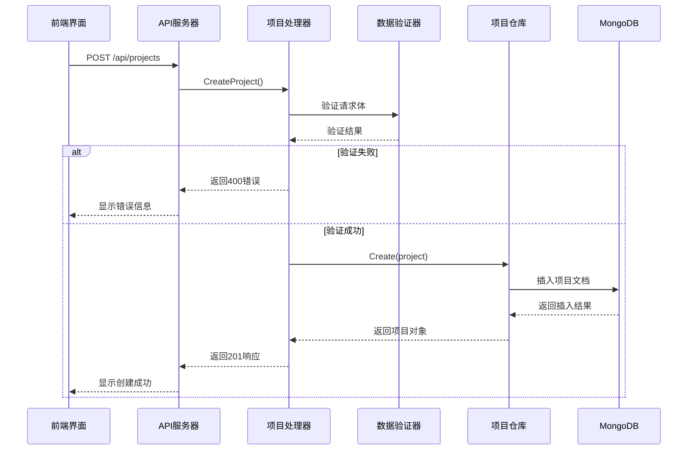

**图表来源**
- [project_handler.go](file://internal/api/project_handler.go#L27-L42)
- [project_repository.go](file://internal/repository/project_repository.go#L35-L50)

### 工作空间查询示例

系统支持高效的按工作空间查询：

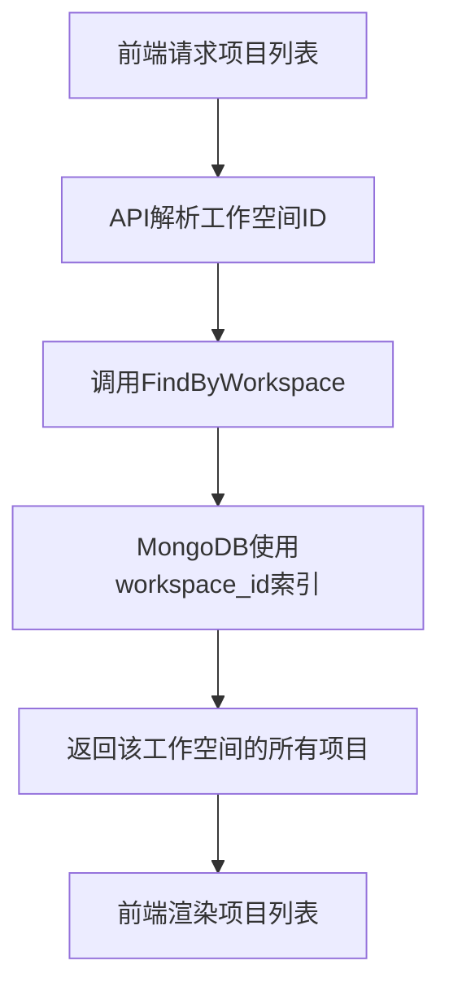

**图表来源**
- [project_repository.go](file://internal/repository/project_repository.go#L107-L123)

### 分页查询实现

系统支持大数据量的分页查询：

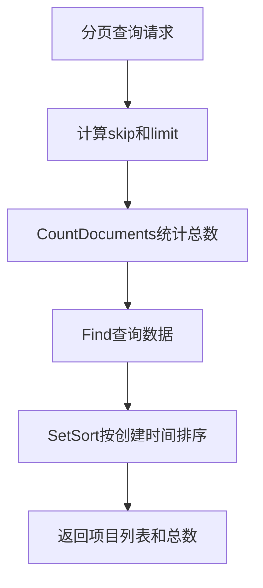

**图表来源**
- [project_repository.go](file://internal/repository/project_repository.go#L125-L153)

**节来源**
- [project_handler.go](file://internal/api/project_handler.go#L27-L42)
- [project_repository.go](file://internal/repository/project_repository.go#L107-L153)

## 总结

项目模型作为MockServer系统的核心实体，通过精心设计的数据结构、索引策略和访问模式，实现了高效、安全、可扩展的数据管理能力。

### 主要特性总结

1. **数据结构设计**：简洁明了的字段定义，满足业务需求的同时保持灵活性
2. **性能优化**：workspace_id单字段索引显著提升查询性能
3. **数据隔离**：严格的工作空间关联确保项目数据边界
4. **元数据管理**：自动维护创建和更新时间戳
5. **扩展性**：预留验证和索引扩展空间

### 最佳实践建议

1. **查询优化**：始终使用workspace_id进行项目查询
2. **数据验证**：在业务层添加必要的数据完整性检查
3. **索引维护**：定期监控索引使用情况和性能表现
4. **并发控制**：在高并发场景下考虑适当的锁策略

项目模型的设计充分体现了现代Web应用对数据建模的最佳实践，为系统的稳定运行和未来发展奠定了坚实的基础。