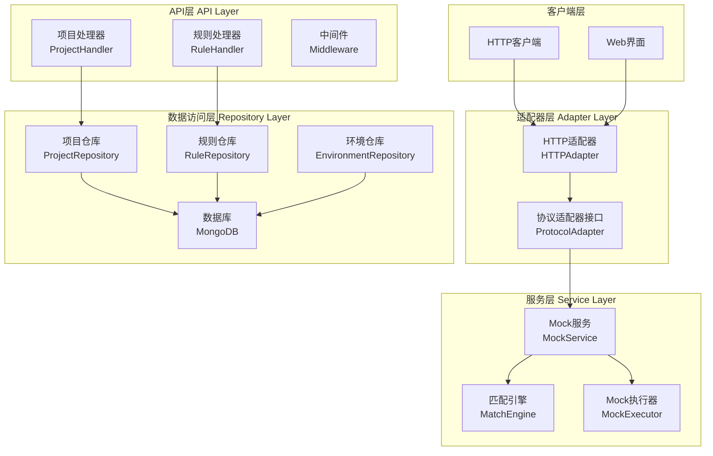
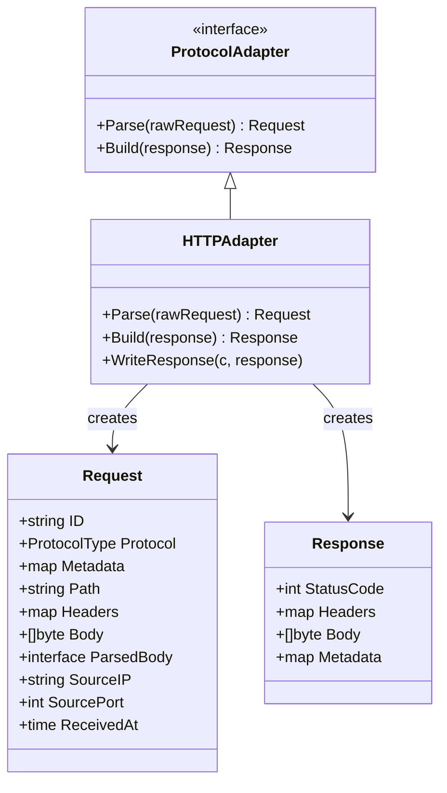
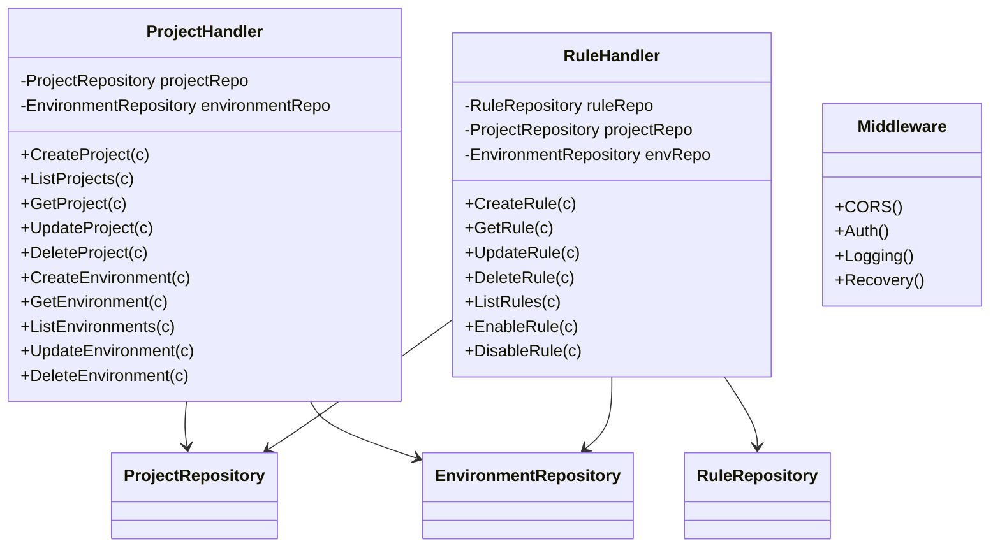
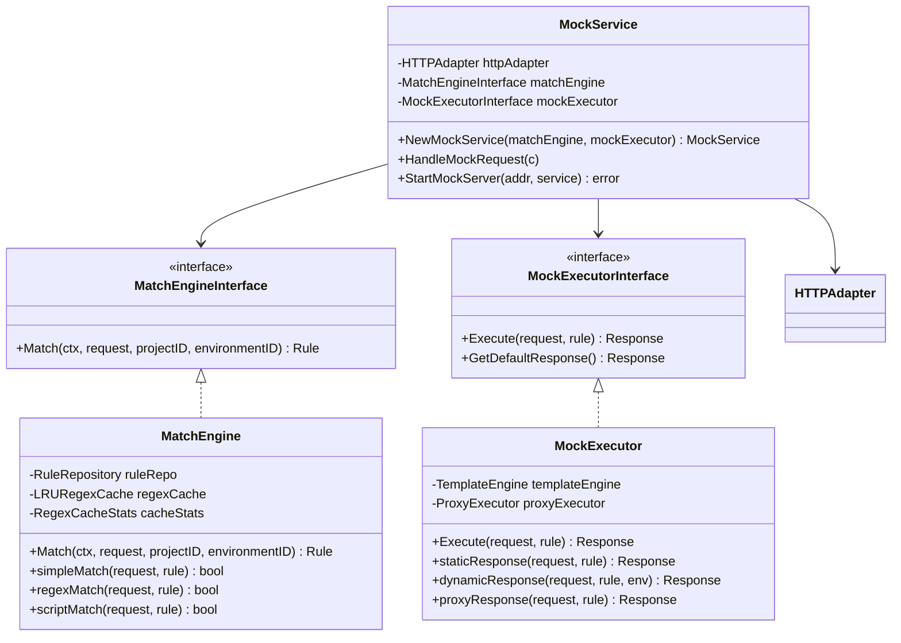
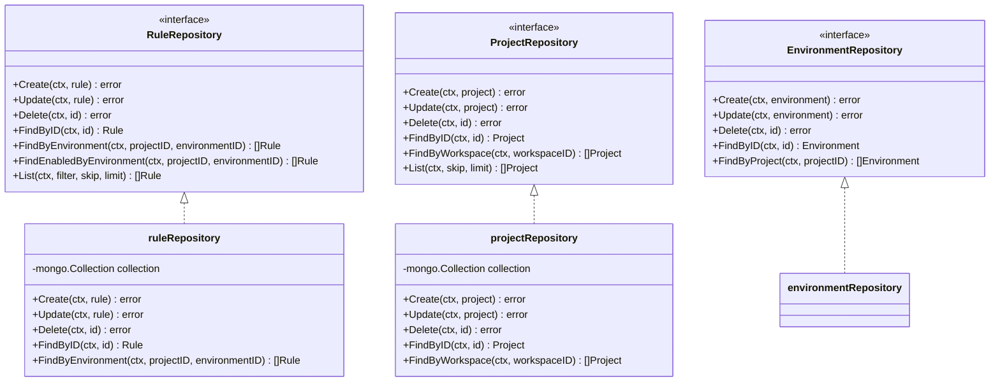
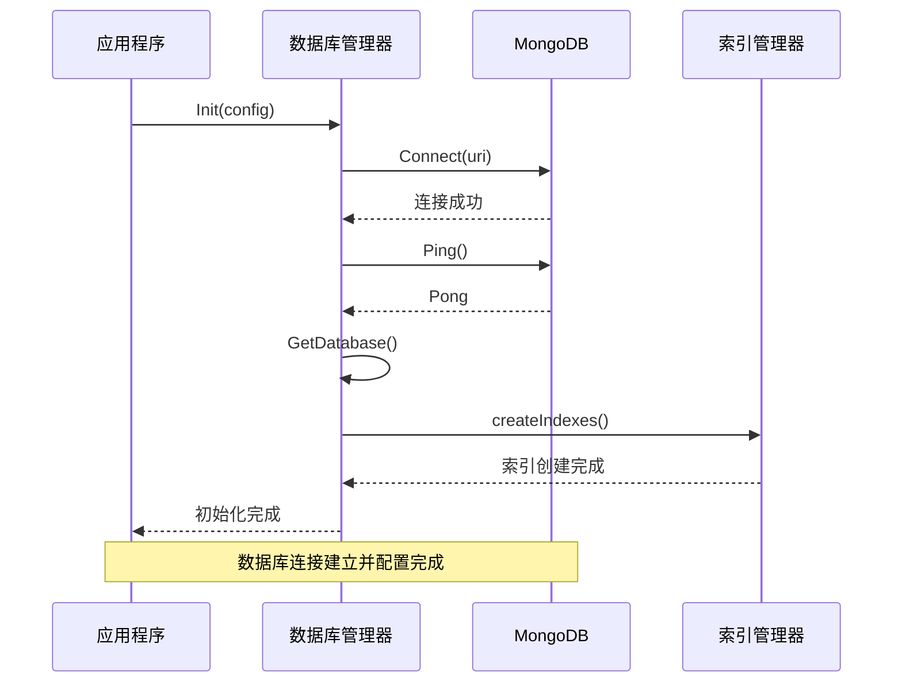
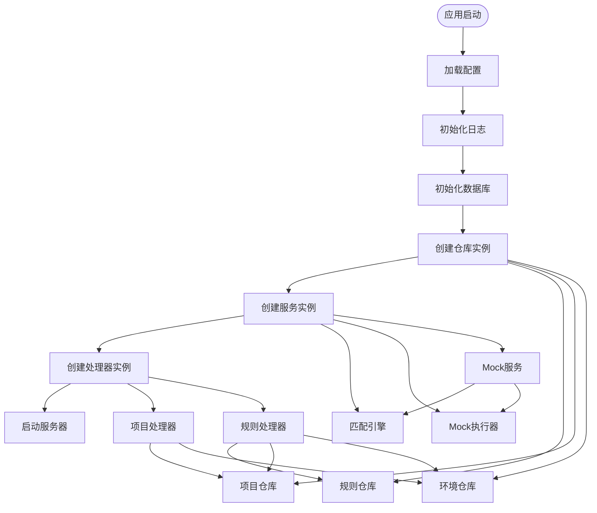
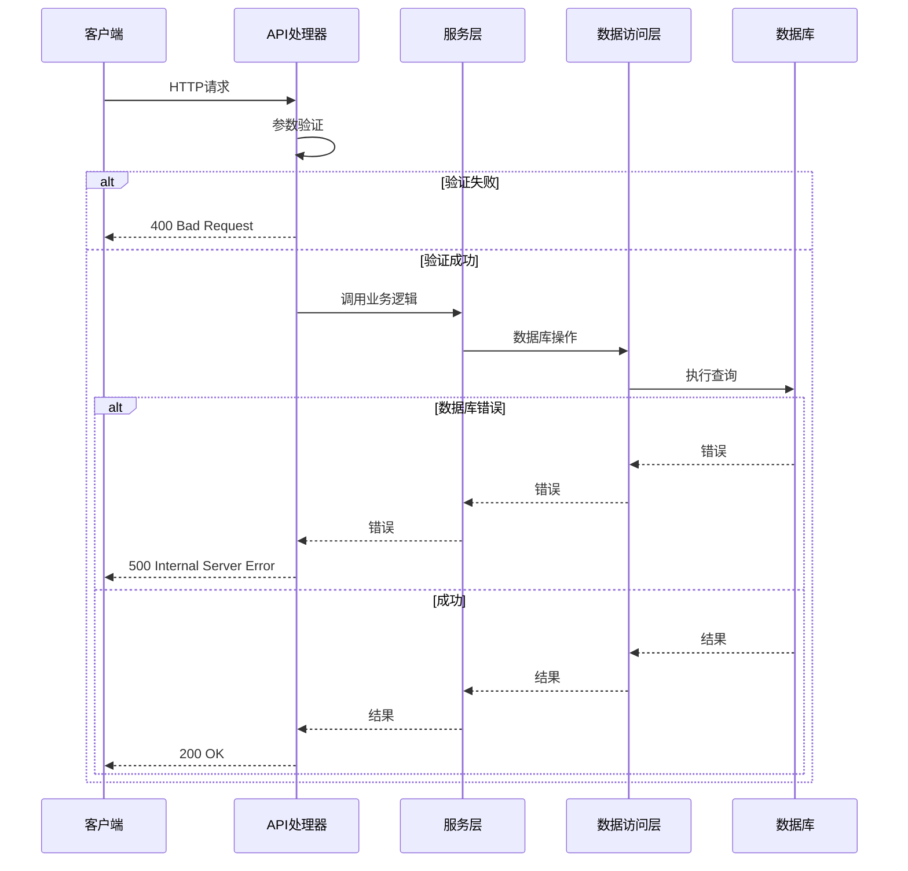
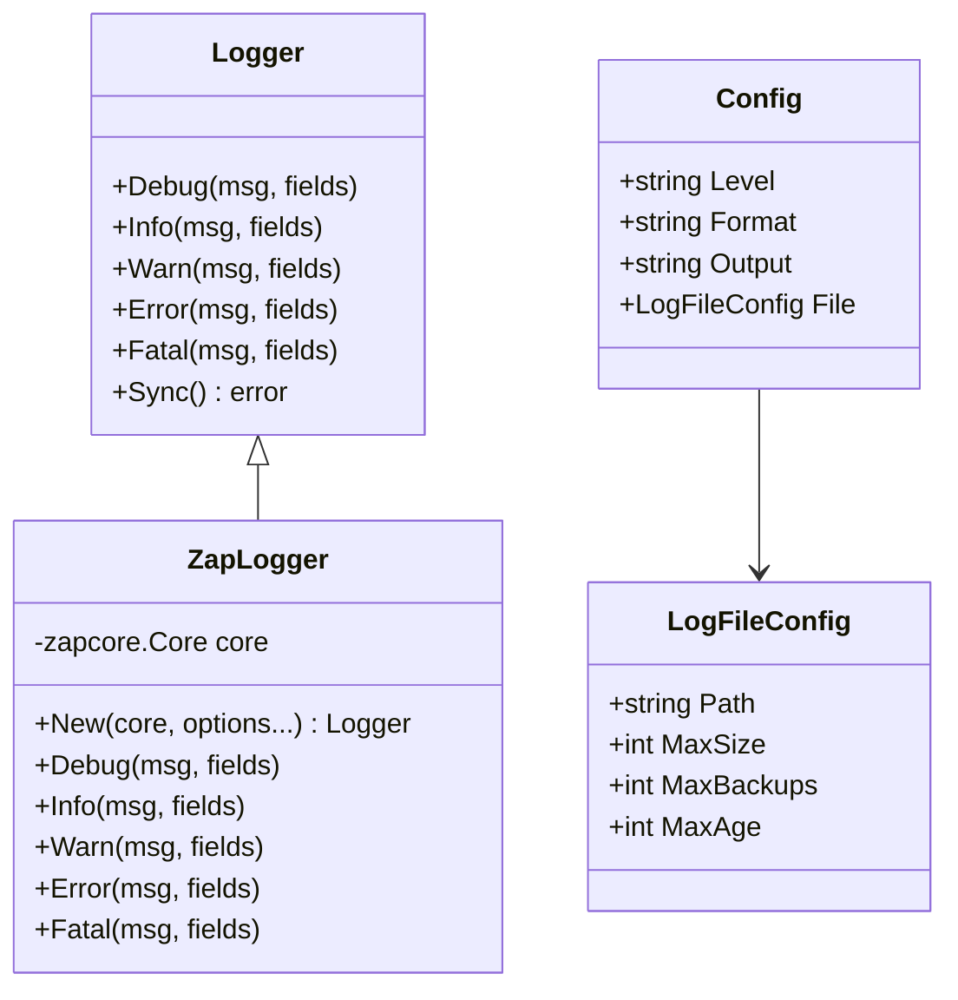
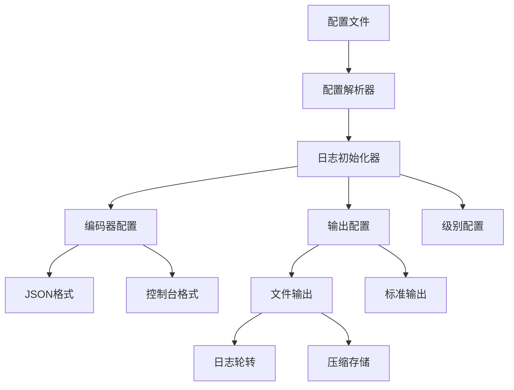

# gomockserver分层架构文档

<cite>
**本文档中引用的文件**
- [internal/adapter/adapter.go](file://internal/adapter/adapter.go)
- [internal/adapter/http_adapter.go](file://internal/adapter/http_adapter.go)
- [internal/service/mock_service.go](file://internal/service/mock_service.go)
- [internal/repository/rule_repository.go](file://internal/repository/rule_repository.go)
- [internal/repository/project_repository.go](file://internal/repository/project_repository.go)
- [internal/repository/database.go](file://internal/repository/database.go)
- [internal/engine/match_engine.go](file://internal/engine/match_engine.go)
- [internal/executor/mock_executor.go](file://internal/executor/mock_executor.go)
- [internal/api/project_handler.go](file://internal/api/project_handler.go)
- [internal/api/rule_handler.go](file://internal/api/rule_handler.go)
- [internal/models/models.go](file://internal/models/models.go)
- [internal/config/config.go](file://internal/config/config.go)
- [pkg/logger/logger.go](file://pkg/logger/logger.go)
</cite>

## 目录
1. [概述](#概述)
2. [架构总览](#架构总览)
3. [适配器层（Adapter Layer）](#适配器层adapter-layer)
4. [API层（API Layer）](#api层api-layer)
5. [服务层（Service Layer）](#服务层service-layer)
6. [数据访问层（Repository Layer）](#数据访问层repository-layer)
7. [依赖注入与错误处理](#依赖注入与错误处理)
8. [日志记录模式](#日志记录模式)
9. [总结](#总结)

## 概述

gomockserver采用经典的四层架构设计，通过清晰的职责分离实现了高度模块化的系统结构。该架构包含以下四个主要层次：

- **适配器层（Adapter Layer）**：负责处理不同协议的输入输出转换
- **API层（API Layer）**：提供RESTful API接口，处理HTTP请求路由
- **服务层（Service Layer）**：实现核心业务逻辑，协调各个组件
- **数据访问层（Repository Layer）**：封装MongoDB操作，提供数据持久化能力

这种分层架构确保了系统的可维护性、可测试性和可扩展性，同时遵循了领域驱动设计（DDD）的原则。

## 架构总览

**图表来源**
- [internal/adapter/http_adapter.go](file://internal/adapter/http_adapter.go#L14-L113)
- [internal/service/mock_service.go](file://internal/service/mock_service.go#L25-L116)
- [internal/repository/rule_repository.go](file://internal/repository/rule_repository.go#L14-L196)

## 适配器层（Adapter Layer）

适配器层是系统的第一层，负责处理不同协议的数据转换和传输。该层的核心职责是将外部协议（如HTTP）转换为内部统一的数据模型，并将内部响应转换回外部协议格式。

### 核心组件

#### 协议适配器接口（ProtocolAdapter）

**图表来源**
- [internal/adapter/adapter.go](file://internal/adapter/adapter.go#L31-L39)
- [internal/adapter/http_adapter.go](file://internal/adapter/http_adapter.go#L14-L113)

#### HTTP适配器实现

HTTP适配器负责将Gin框架的HTTP请求转换为统一的请求模型，并将统一的响应模型转换为HTTP响应。

**关键特性：**
- **请求解析**：从Gin上下文中提取请求信息，包括路径、头部、主体等
- **响应构建**：将统一响应模型转换为HTTP响应格式
- **错误处理**：优雅处理请求解析过程中的各种错误情况
- **性能优化**：支持大文件上传和流式处理

**节来源**
- [internal/adapter/http_adapter.go](file://internal/adapter/http_adapter.go#L21-L113)

### 适配器层职责边界

| 职责 | 描述 | 实现方式 |
|------|------|----------|
| 协议转换 | 将外部协议转换为内部统一模型 | ProtocolAdapter接口 |
| 请求验证 | 验证请求格式和完整性 | 输入参数校验 |
| 错误映射 | 将内部错误映射为适当的HTTP状态码 | 错误处理机制 |
| 性能优化 | 处理大文件和流式数据 | 流式处理和内存管理 |

## API层（API Layer）

API层提供RESTful API接口，处理HTTP请求路由和参数验证。该层负责接收客户端请求，进行基本的参数验证和权限检查，然后将请求转发给相应的服务层组件。

### 核心组件

#### 处理器架构

**图表来源**
- [internal/api/project_handler.go](file://internal/api/project_handler.go#L14-L212)
- [internal/api/rule_handler.go](file://internal/api/rule_handler.go#L15-L266)

#### API路由设计

| 资源 | 方法 | 路由 | 功能描述 |
|------|------|------|----------|
| 项目 | GET | `/projects` | 获取项目列表 |
| 项目 | POST | `/projects` | 创建新项目 |
| 项目 | GET | `/projects/:id` | 获取项目详情 |
| 项目 | PUT | `/projects/:id` | 更新项目信息 |
| 项目 | DELETE | `/projects/:id` | 删除项目 |
| 环境 | GET | `/projects/:id/environments` | 获取项目环境列表 |
| 环境 | POST | `/projects/:id/environments` | 创建新环境 |
| 规则 | GET | `/rules` | 获取规则列表 |
| 规则 | POST | `/rules` | 创建新规则 |
| 规则 | GET | `/rules/:id` | 获取规则详情 |
| 规则 | PUT | `/rules/:id` | 更新规则 |
| 规则 | DELETE | `/rules/:id` | 删除规则 |

**节来源**
- [internal/api/project_handler.go](file://internal/api/project_handler.go#L28-L212)
- [internal/api/rule_handler.go](file://internal/api/rule_handler.go#L30-L266)

### API层设计原则

1. **单一职责**：每个处理器专注于特定资源的操作
2. **参数验证**：使用Gin的绑定功能进行参数验证
3. **错误处理**：统一的错误响应格式和状态码
4. **中间件支持**：提供CORS、认证、日志等中间件

## 服务层（Service Layer）

服务层是系统的核心，实现复杂的业务逻辑。该层协调适配器、引擎和执行器组件，提供完整的Mock服务功能。

### 核心组件

#### Mock服务架构

**图表来源**
- [internal/service/mock_service.go](file://internal/service/mock_service.go#L25-L116)
- [internal/engine/match_engine.go](file://internal/engine/match_engine.go#L26-L436)
- [internal/executor/mock_executor.go](file://internal/executor/mock_executor.go#L21-L482)

#### 匹配引擎（MatchEngine）

匹配引擎负责根据请求特征匹配最合适的Mock规则。

**匹配流程：**
1. **规则加载**：从数据库加载指定环境下的所有启用规则
2. **优先级排序**：按规则优先级降序排列
3. **逐个匹配**：按优先级顺序尝试匹配每条规则
4. **条件验证**：验证协议类型、匹配条件等
5. **结果返回**：返回第一个匹配成功的规则或空

**支持的匹配类型：**
- **Simple**：简单匹配，支持精确路径、方法、头部等
- **Regex**：正则表达式匹配，支持复杂的模式匹配
- **Script**：脚本匹配（预留扩展）

**节来源**
- [internal/engine/match_engine.go](file://internal/engine/match_engine.go#L42-L77)

#### Mock执行器（MockExecutor）

Mock执行器负责根据匹配到的规则生成响应。

**响应类型：**
- **Static**：静态响应，直接返回预定义的内容
- **Dynamic**：动态响应，使用模板引擎生成响应
- **Proxy**：代理响应，将请求转发给目标服务
- **Script**：脚本响应（预留扩展）

**高级功能：**
- **延迟控制**：支持固定延迟、随机延迟、正态分布延迟、阶梯延迟
- **模板引擎**：支持JSON、文本、HTML等多种模板格式
- **文件引用**：支持从文件系统读取响应内容

**节来源**
- [internal/executor/mock_executor.go](file://internal/executor/mock_executor.go#L48-L72)

### 服务层职责边界

| 层次 | 职责 | 实现细节 |
|------|------|----------|
| MockService | 请求入口和协调 | 协调适配器、引擎、执行器 |
| MatchEngine | 规则匹配逻辑 | 多种匹配算法和缓存机制 |
| MockExecutor | 响应生成逻辑 | 多种响应类型和高级功能 |

## 数据访问层（Repository Layer）

数据访问层封装MongoDB操作，提供数据持久化能力。该层通过接口抽象隐藏具体的数据库实现，确保上层服务不受数据存储技术的影响。

### 核心组件

#### 仓库接口设计

**图表来源**
- [internal/repository/rule_repository.go](file://internal/repository/rule_repository.go#L14-L196)
- [internal/repository/project_repository.go](file://internal/repository/project_repository.go#L14-L265)

#### 数据库连接管理

**图表来源**
- [internal/repository/database.go](file://internal/repository/database.go#L19-L51)

### 数据访问层特性

1. **接口抽象**：通过接口定义数据访问契约
2. **连接池管理**：配置MongoDB连接池参数
3. **索引优化**：自动创建查询优化索引
4. **事务支持**：支持MongoDB事务操作
5. **错误处理**：统一的数据库错误处理机制

**节来源**
- [internal/repository/database.go](file://internal/repository/database.go#L53-L187)

### 数据模型设计

系统使用MongoDB作为主要数据存储，支持以下核心实体：

| 实体 | 描述 | 主要字段 |
|------|------|----------|
| Rule | Mock规则 | name, project_id, environment_id, protocol, match_type, priority, enabled |
| Project | 项目 | name, workspace_id, description |
| Environment | 环境 | name, project_id, base_url, variables |
| RequestLog | 请求日志 | request_id, project_id, environment_id, rule_id, protocol, method, path |
| User | 用户 | username, email, role |

**节来源**
- [internal/models/models.go](file://internal/models/models.go#L48-L176)

## 依赖注入与错误处理

### 依赖注入实现

gomockserver采用构造函数注入的方式实现依赖注入，确保组件间的松耦合。

**图表来源**
- [internal/service/mock_service.go](file://internal/service/mock_service.go#L32-L39)

### 错误处理策略

#### 分层错误处理

| 层级 | 错误处理策略 | 实现方式 |
|------|-------------|----------|
| 适配器层 | 协议转换错误 | 返回适当的HTTP状态码 |
| API层 | 参数验证错误 | 400 Bad Request |
| 服务层 | 业务逻辑错误 | 500 Internal Server Error |
| 数据访问层 | 数据库操作错误 | 500 Internal Server Error |

#### 错误传播机制

**图表来源**
- [internal/api/project_handler.go](file://internal/api/project_handler.go#L29-L42)
- [internal/service/mock_service.go](file://internal/service/mock_service.go#L56-L62)

## 日志记录模式

### 日志架构设计

gomockserver使用Zap作为日志框架，提供了结构化日志记录能力。

**图表来源**
- [pkg/logger/logger.go](file://pkg/logger/logger.go#L11-L116)

### 日志记录模式

#### 结构化日志记录

系统在关键业务流程中记录结构化日志，便于监控和故障排查：

| 日志级别 | 记录场景 | 示例字段 |
|----------|----------|----------|
| DEBUG | 详细调试信息 | method, path, params |
| INFO | 一般业务信息 | project_id, environment_id, rule_id |
| WARN | 警告信息 | invalid_ip, timeout, cache_miss |
| ERROR | 错误信息 | error, stack_trace, request_id |
| FATAL | 致命错误 | error, stack_trace, shutdown |

#### 日志配置管理

**图表来源**
- [pkg/logger/logger.go](file://pkg/logger/logger.go#L14-L71)
- [internal/config/config.go](file://internal/config/config.go#L92-L107)

**节来源**
- [pkg/logger/logger.go](file://pkg/logger/logger.go#L84-L116)

## 总结

gomockserver的四层架构设计体现了现代软件工程的最佳实践：

### 架构优势

1. **清晰的职责分离**：每一层都有明确的职责边界，降低了组件间的耦合度
2. **良好的可测试性**：通过接口抽象和依赖注入，便于单元测试和集成测试
3. **高度的可扩展性**：新增功能只需在相应层次添加组件，不影响现有代码
4. **优秀的可维护性**：模块化设计使得代码易于理解和维护

### 技术特色

1. **多协议适配**：通过适配器模式支持多种协议
2. **智能匹配引擎**：支持多种匹配算法和缓存机制
3. **灵活的响应生成**：支持静态、动态、代理等多种响应类型
4. **完善的日志系统**：结构化日志记录和配置化管理

### 最佳实践体现

- **依赖倒置原则**：高层模块不依赖低层模块的具体实现
- **接口隔离原则**：小而专一的接口设计
- **开闭原则**：对扩展开放，对修改封闭
- **单一职责原则**：每个组件都有单一的职责

这种架构设计不仅满足了当前的功能需求，也为未来的功能扩展和技术演进奠定了坚实的基础。