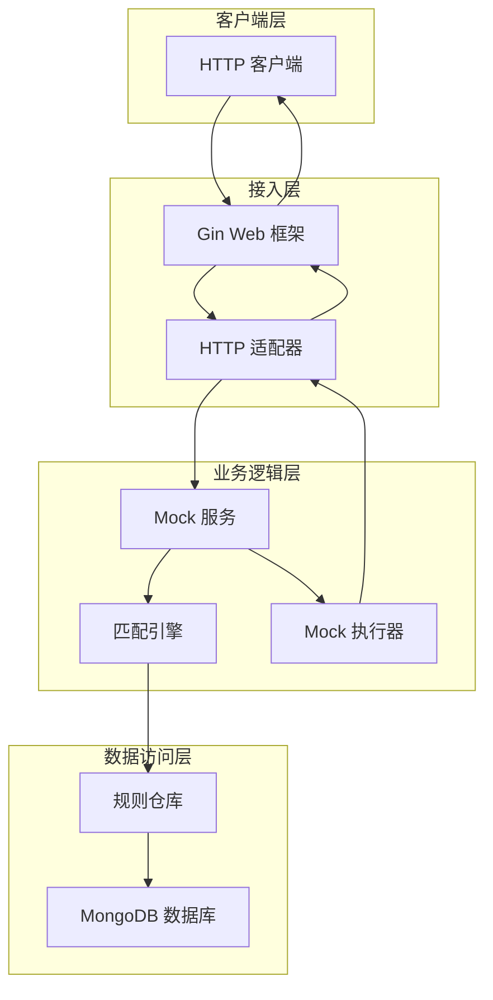
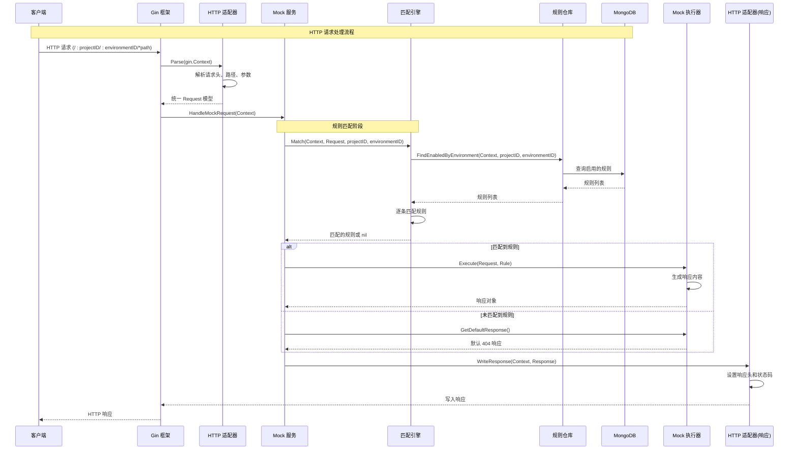
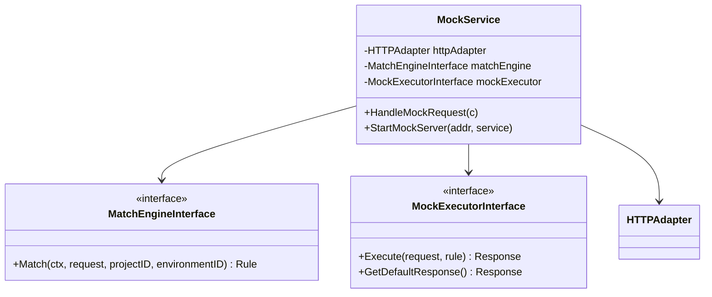
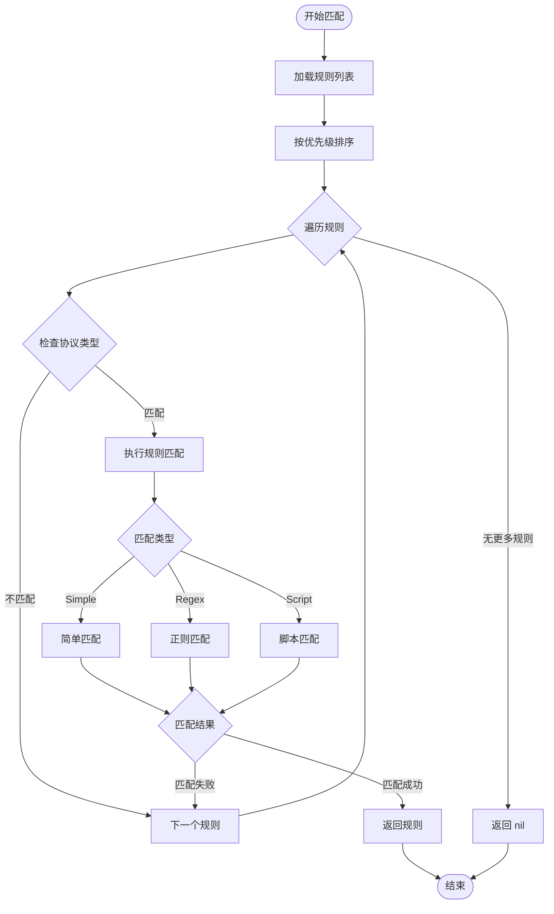
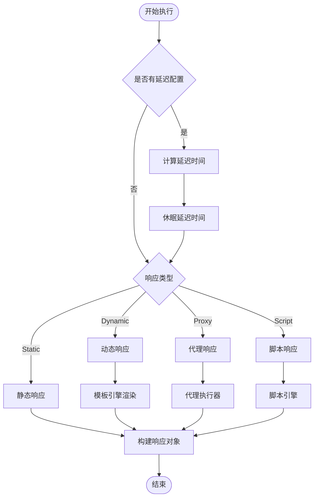
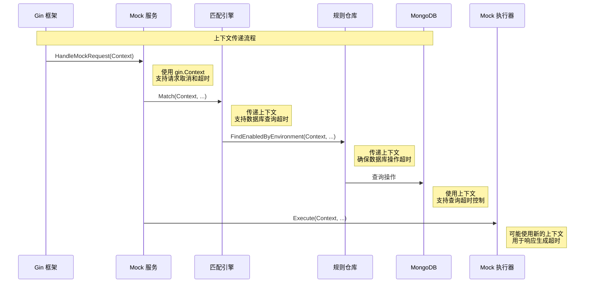
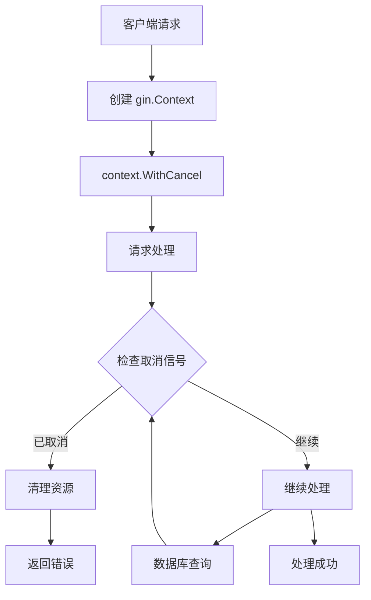
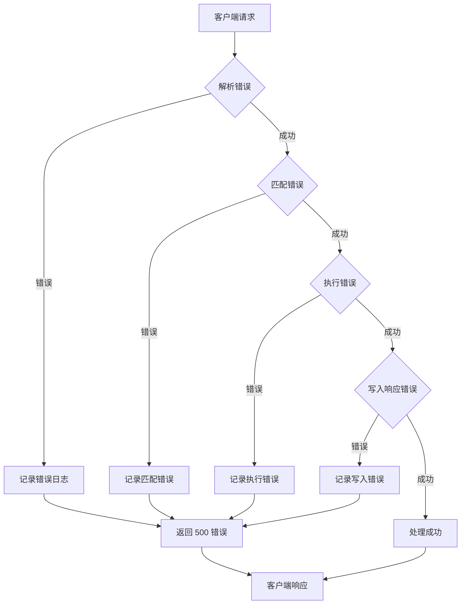

# gomockserver 数据流路径文档

<cite>
**本文档中引用的文件**
- [internal/adapter/http_adapter.go](file://internal/adapter/http_adapter.go)
- [internal/service/mock_service.go](file://internal/service/mock_service.go)
- [internal/engine/match_engine.go](file://internal/engine/match_engine.go)
- [internal/repository/rule_repository.go](file://internal/repository/rule_repository.go)
- [internal/executor/mock_executor.go](file://internal/executor/mock_executor.go)
- [internal/adapter/adapter.go](file://internal/adapter/adapter.go)
- [internal/models/models.go](file://internal/models/models.go)
- [internal/models/errors.go](file://internal/models/errors.go)
- [internal/api/health_handler.go](file://internal/api/health_handler.go)
</cite>

## 目录
1. [概述](#概述)
2. [系统架构概览](#系统架构概览)
3. [数据流路径详解](#数据流路径详解)
4. [关键组件分析](#关键组件分析)
5. [上下文传递机制](#上下文传递机制)
6. [异常处理流程](#异常处理流程)
7. [性能优化考虑](#性能优化考虑)
8. [总结](#总结)

## 概述

gomockserver 是一个基于 Go 语言构建的 Mock 服务器，采用分层架构设计，通过清晰的数据流路径实现了从 HTTP 请求到响应返回的完整处理链路。本文档详细追踪了从客户端请求到最终响应返回的完整数据流，并重点说明了上下文（context）在跨层调用中的传递和超时控制机制。

## 系统架构概览

gomockserver 采用典型的分层架构模式，主要包含以下核心层次：



**图表来源**
- [internal/adapter/http_adapter.go](file://internal/adapter/http_adapter.go#L1-L113)
- [internal/service/mock_service.go](file://internal/service/mock_service.go#L1-L116)
- [internal/engine/match_engine.go](file://internal/engine/match_engine.go#L1-L436)
- [internal/repository/rule_repository.go](file://internal/repository/rule_repository.go#L1-L196)

## 数据流路径详解

### 完整数据流序列图



**图表来源**
- [internal/adapter/http_adapter.go](file://internal/adapter/http_adapter.go#L21-L84)
- [internal/service/mock_service.go](file://internal/service/mock_service.go#L42-L98)
- [internal/engine/match_engine.go](file://internal/engine/match_engine.go#L43-L76)
- [internal/repository/rule_repository.go](file://internal/repository/rule_repository.go#L140-L160)
- [internal/executor/mock_executor.go](file://internal/executor/mock_executor.go#L49-L71)

### 请求解析阶段

HTTP 请求从客户端到达服务器后，经过以下处理步骤：

1. **Gin 框架接收请求**：Gin 框架解析 HTTP 请求，提取路径参数（projectID、environmentID、path）
2. **HTTP 适配器解析**：HTTPAdapter.Parse 方法将 gin.Context 转换为统一的 Request 模型
3. **数据提取**：
   - 生成唯一请求 ID
   - 读取请求体内容
   - 提取请求头信息
   - 解析查询参数
   - 获取客户端 IP 地址
   - 提取实际 API 路径

**节来源**
- [internal/adapter/http_adapter.go](file://internal/adapter/http_adapter.go#L21-L84)

### 规则匹配阶段

匹配引擎按照以下流程处理请求匹配：

1. **加载规则**：RuleRepository.FindEnabledByEnvironment 查询指定环境下的所有启用规则
2. **按优先级排序**：规则按照优先级降序排列
3. **逐条匹配**：MatchEngine.Match 遍历规则列表，执行匹配逻辑
4. **匹配类型支持**：
   - Simple：精确匹配和简单通配符匹配
   - Regex：正则表达式匹配
   - Script：脚本匹配（待实现）

**节来源**
- [internal/engine/match_engine.go](file://internal/engine/match_engine.go#L43-L76)
- [internal/repository/rule_repository.go](file://internal/repository/rule_repository.go#L140-L160)

### 响应生成阶段

根据匹配结果生成响应：

1. **静态响应**：直接返回预定义的响应内容
2. **动态响应**：使用模板引擎渲染动态内容
3. **代理响应**：转发请求到目标服务
4. **默认响应**：当没有匹配规则时返回 404

**节来源**
- [internal/executor/mock_executor.go](file://internal/executor/mock_executor.go#L49-L71)

## 关键组件分析

### HTTP 适配器（HTTPAdapter）

HTTP 适配器负责协议无关的请求和响应处理：

```mermaid
classDiagram
class HTTPAdapter {
+Parse(rawRequest) Request
+Build(response) interface{}
+WriteResponse(c, response)
-getContentType(headers) string
}
class Request {
+string ID
+ProtocolType Protocol
+map Metadata
+string Path
+map Headers
+[]byte Body
+string SourceIP
+time ReceivedAt
}
class Response {
+int StatusCode
+map Headers
+[]byte Body
+map Metadata
}
HTTPAdapter --> Request : "创建"
HTTPAdapter --> Response : "创建"
```

**图表来源**
- [internal/adapter/http_adapter.go](file://internal/adapter/http_adapter.go#L14-L113)
- [internal/adapter/adapter.go](file://internal/adapter/adapter.go#L9-L39)

### Mock 服务（MockService）

Mock 服务是核心业务逻辑组件，协调各个子系统：



**图表来源**
- [internal/service/mock_service.go](file://internal/service/mock_service.go#L25-L39)

### 匹配引擎（MatchEngine）

匹配引擎实现复杂的规则匹配逻辑：



**图表来源**
- [internal/engine/match_engine.go](file://internal/engine/match_engine.go#L43-L76)

### 规则仓库（RuleRepository）

规则仓库提供 MongoDB 数据访问接口：

| 方法 | 功能 | 查询条件 |
|------|------|----------|
| FindEnabledByEnvironment | 查找环境下所有启用的规则 | project_id, environment_id, enabled=true |
| FindByEnvironment | 查找环境下的所有规则 | project_id, environment_id |
| FindByID | 根据ID查找规则 | _id |
| Create | 创建新规则 | 完整规则对象 |
| Update | 更新规则 | 规则ID和更新内容 |
| Delete | 删除规则 | 规则ID |

**节来源**
- [internal/repository/rule_repository.go](file://internal/repository/rule_repository.go#L14-L23)

### Mock 执行器（MockExecutor）

Mock 执行器处理不同类型的响应生成：



**图表来源**
- [internal/executor/mock_executor.go](file://internal/executor/mock_executor.go#L49-L71)

## 上下文传递机制

### 上下文生命周期

gomockserver 中的上下文传递遵循以下模式：



**图表来源**
- [internal/service/mock_service.go](file://internal/service/mock_service.go#L66-L67)
- [internal/engine/match_engine.go](file://internal/engine/match_engine.go#L44-L45)
- [internal/api/health_handler.go](file://internal/api/health_handler.go#L86-L88)

### 超时控制策略

系统在多个层面实施超时控制：

1. **健康检查超时**：
   - Health 接口：5秒超时
   - Metrics 接口：5秒超时  
   - Ready 接口：3秒超时

2. **数据库操作超时**：
   - 规则查询：继承 gin.Context 的超时
   - 数据库 Ping：5秒超时

3. **脚本执行超时**：
   - JavaScript 脚本：最大执行时间限制

**节来源**
- [internal/api/health_handler.go](file://internal/api/health_handler.go#L86-L221)

### 上下文取消机制

系统支持优雅的请求取消：



## 异常处理流程

### 异常传播路径

系统采用分层异常处理机制，确保错误能够正确传播：



### 错误类型分类

系统定义了完整的错误码体系：

| 错误类别 | 错误码范围 | 示例错误 |
|----------|------------|----------|
| 通用错误 | 1000-1999 | 参数无效、未授权 |
| 项目相关 | 2000-2999 | 项目不存在、项目创建失败 |
| 环境相关 | 3000-3999 | 环境不存在、环境创建失败 |
| 规则相关 | 4000-4999 | 规则不存在、规则匹配失败 |
| 数据库相关 | 5000-5999 | 数据库连接失败、查询失败 |
| 系统错误 | 9000-9999 | 服务器内部错误、请求超时 |

**节来源**
- [internal/models/errors.go](file://internal/models/errors.go#L30-L212)

### 错误恢复策略

1. **数据库连接失败**：记录错误，返回 500 状态码
2. **规则匹配失败**：返回 500 状态码
3. **响应生成失败**：返回 500 状态码
4. **超时错误**：记录超时信息，返回 500 状态码

## 性能优化考虑

### 缓存机制

1. **正则表达式缓存**：MatchEngine 实现 LRU 缓存，避免重复编译正则表达式
2. **规则匹配缓存**：支持规则匹配结果缓存
3. **响应内容缓存**：静态响应内容可缓存

### 并发控制

1. **Goroutine 限制**：健康检查接口限制 Goroutine 数量
2. **数据库连接池**：使用连接池管理数据库连接
3. **超时控制**：各层级设置合理的超时时间

### 内存管理

1. **请求体缓冲**：合理控制请求体内存占用
2. **响应体优化**：支持大文件响应的流式处理
3. **垃圾回收优化**：减少不必要的内存分配

## 总结

gomockserver 的数据流路径设计体现了良好的软件架构原则：

1. **清晰的分层架构**：每一层都有明确的职责边界
2. **一致的接口设计**：各组件通过接口解耦，便于测试和扩展
3. **完善的上下文传递**：支持超时控制和优雅取消
4. **健壮的异常处理**：多层次的错误捕获和传播机制
5. **性能优化考虑**：缓存、并发控制等优化措施

该架构设计使得系统具有良好的可维护性、可扩展性和可靠性，能够满足生产环境的高并发和高可用需求。通过本文档的详细分析，开发者可以深入理解系统的数据流处理机制，并在此基础上进行功能扩展和性能优化。