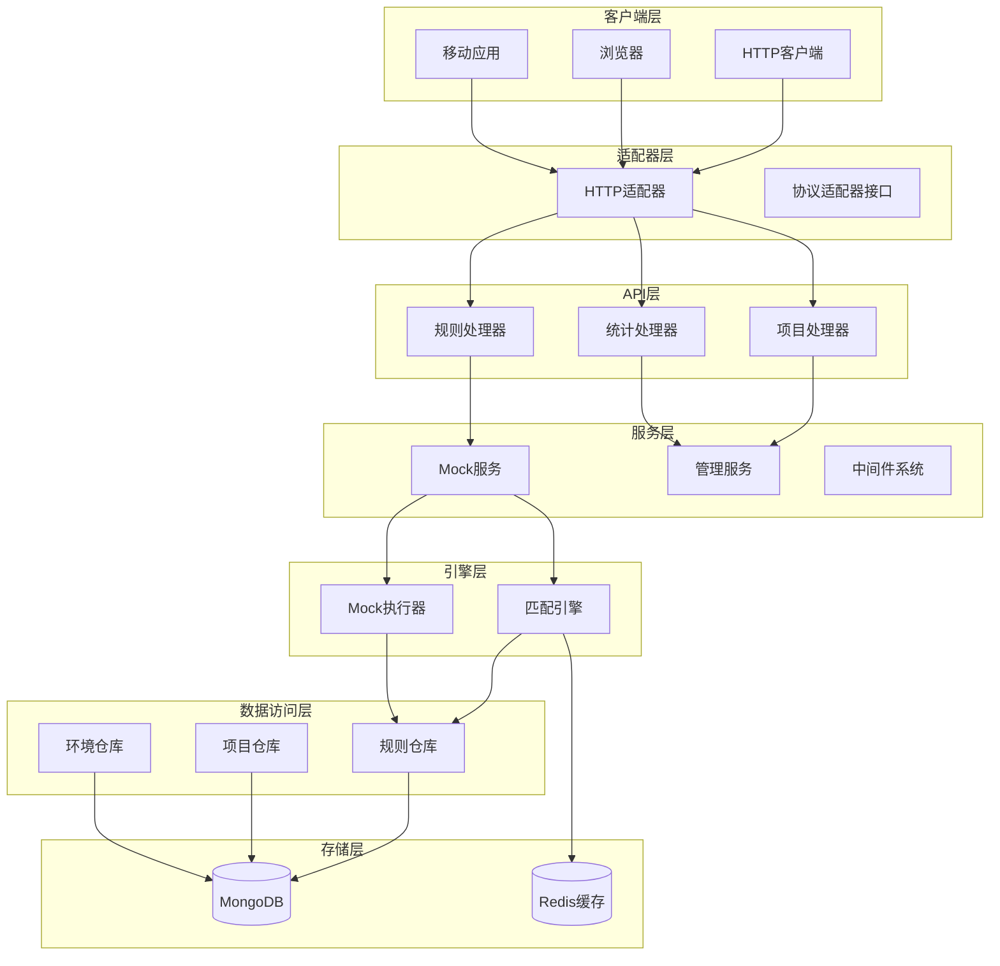
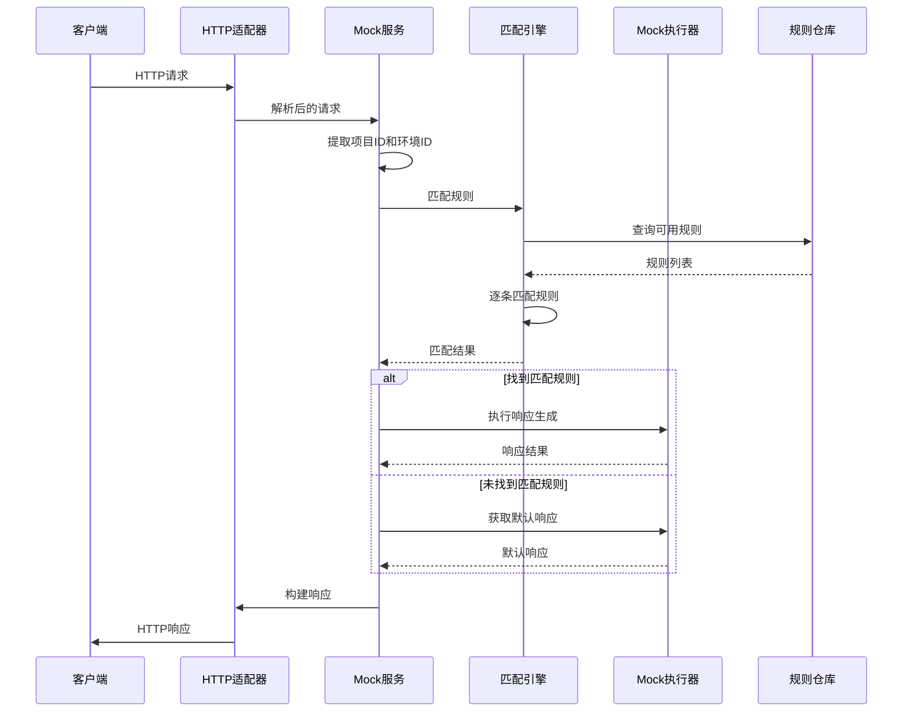
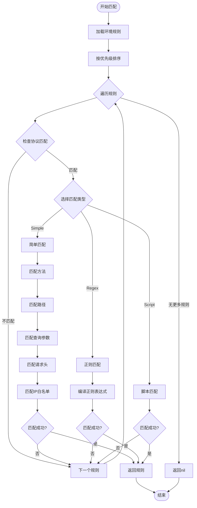
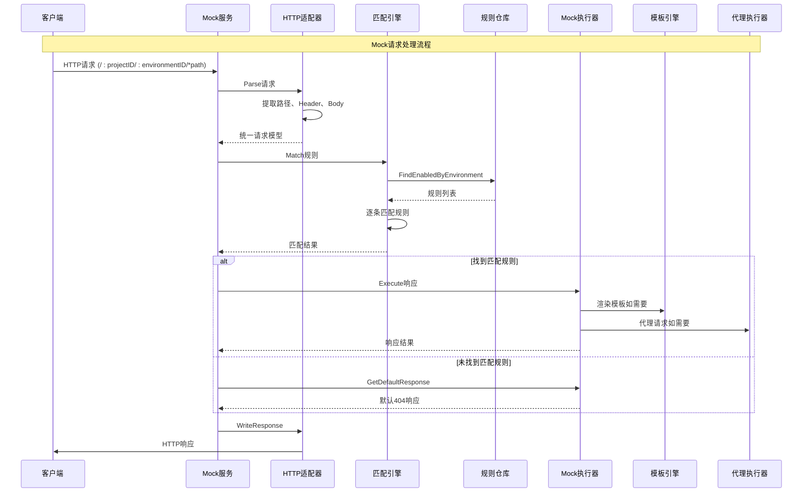
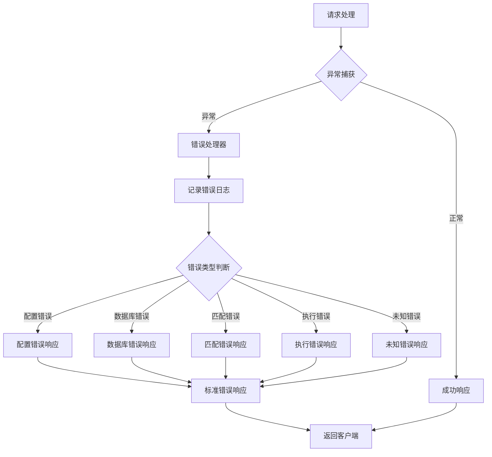
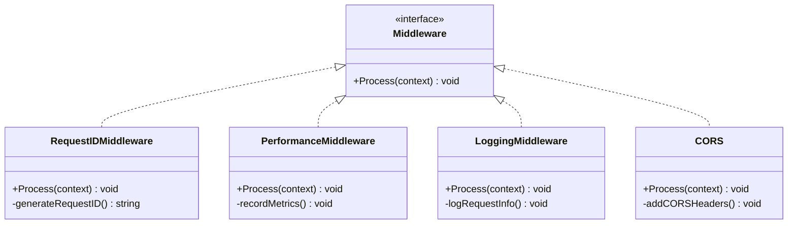
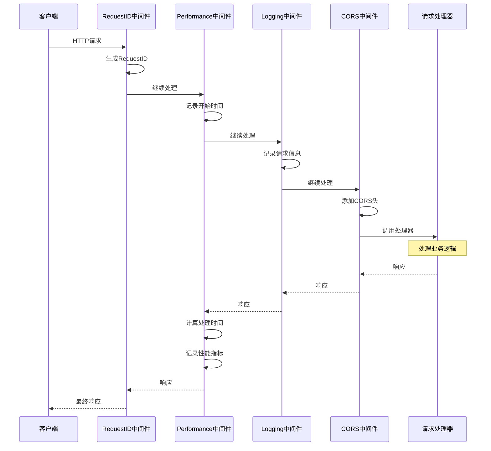
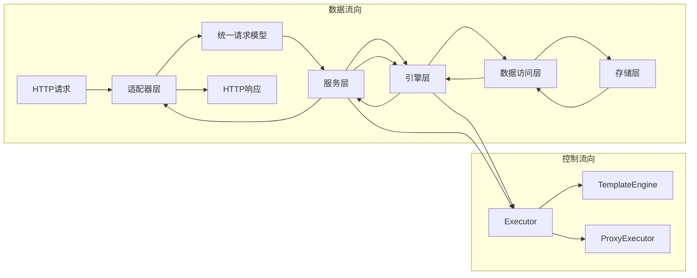
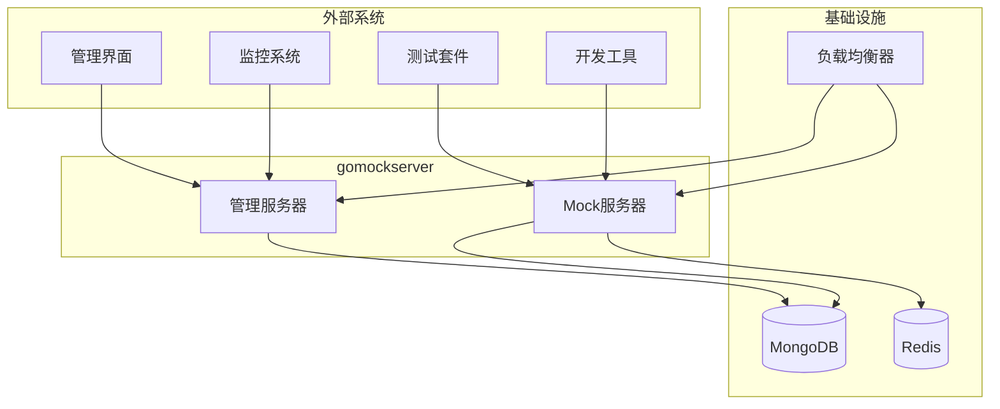
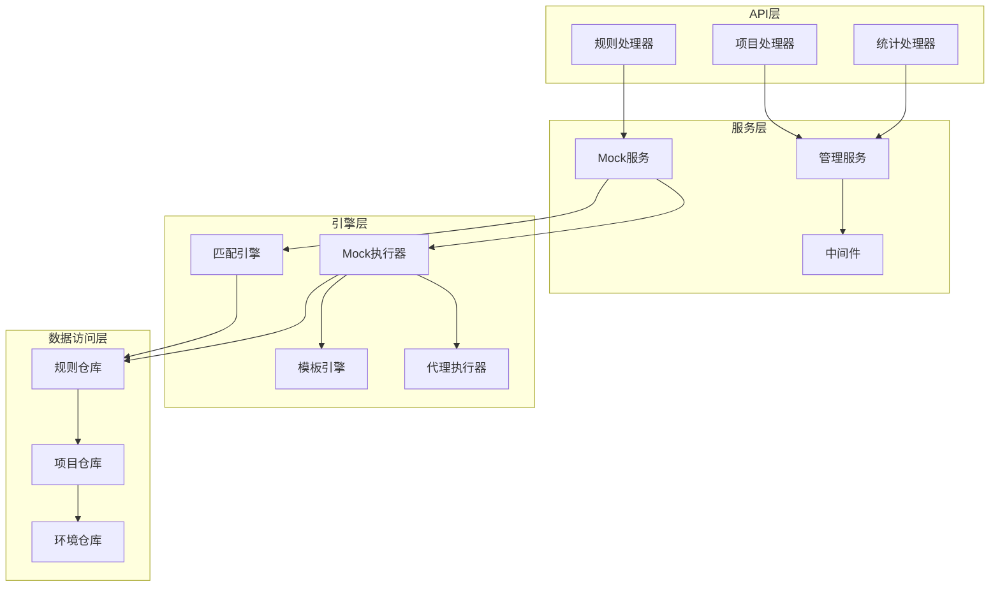

# gomockserver架构设计文档

<cite>
**本文档中引用的文件**
- [main.go](file://cmd/mockserver/main.go)
- [http_adapter.go](file://internal/adapter/http_adapter.go)
- [adapter.go](file://internal/adapter/adapter.go)
- [mock_service.go](file://internal/service/mock_service.go)
- [middleware.go](file://internal/service/middleware.go)
- [match_engine.go](file://internal/engine/match_engine.go)
- [mock_executor.go](file://internal/executor/mock_executor.go)
- [rule_repository.go](file://internal/repository/rule_repository.go)
- [models.go](file://internal/models/models.go)
- [errors.go](file://internal/models/errors.go)
- [config.go](file://internal/config/config.go)
- [project_handler.go](file://internal/api/project_handler.go)
- [rule_handler.go](file://internal/api/rule_handler.go)
</cite>

## 目录
1. [概述](#概述)
2. [系统架构总览](#系统架构总览)
3. [分层架构设计](#分层架构设计)
4. [核心组件详细分析](#核心组件详细分析)
5. [请求处理流程](#请求处理流程)
6. [中间件系统](#中间件系统)
7. [数据流和控制流](#数据流和控制流)
8. [系统上下文图](#系统上下文图)
9. [组件交互图](#组件交互图)
10. [性能优化策略](#性能优化策略)
11. [总结](#总结)

## 概述

gomockserver是一个基于Go语言构建的高性能Mock服务器，采用分层架构设计，支持多种协议（HTTP、WebSocket、gRPC、TCP、UDP）的请求模拟。系统通过适配器模式实现协议无关的请求处理，通过规则引擎进行智能匹配，并提供灵活的响应生成机制。

### 主要特性
- **多协议支持**：支持HTTP、WebSocket、gRPC、TCP、UDP等多种协议
- **智能匹配**：基于路径、方法、Header、Body等多维度规则匹配
- **灵活响应**：支持静态响应、动态模板响应、代理响应和脚本响应
- **高性能**：内置缓存机制和正则表达式优化
- **分布式部署**：支持MongoDB存储和Redis缓存

## 系统架构总览

gomockserver采用经典的分层架构模式，从上到下分为适配器层、API层、服务层和数据访问层，每层职责清晰，耦合度低。



**图表来源**
- [main.go](file://cmd/mockserver/main.go#L19-L98)
- [http_adapter.go](file://internal/adapter/http_adapter.go#L14-L113)
- [mock_service.go](file://internal/service/mock_service.go#L25-L116)

## 分层架构设计

### 适配器层（Adapter Layer）

适配器层负责协议转换和请求标准化，是系统与外部通信的桥梁。

#### 核心组件
- **HTTP适配器**：处理HTTP协议请求，提取路径、Header、Body等信息
- **协议适配器接口**：定义统一的协议处理规范

#### 关键功能
- 请求解析和标准化
- 响应构建和写入
- 协议无关的请求模型

**章节来源**
- [http_adapter.go](file://internal/adapter/http_adapter.go#L14-L113)
- [adapter.go](file://internal/adapter/adapter.go#L9-L39)

### API层（API Layer）

API层提供RESTful接口，处理业务逻辑的入口点。

#### 核心组件
- **规则处理器**：管理Mock规则的CRUD操作
- **项目处理器**：管理项目和环境的生命周期
- **统计处理器**：提供系统运行状态和统计数据

#### 设计特点
- 基于Gin框架的高效路由
- 统一的错误处理机制
- 完善的参数验证

**章节来源**
- [rule_handler.go](file://internal/api/rule_handler.go#L14-L266)
- [project_handler.go](file://internal/api/project_handler.go#L14-L212)

### 服务层（Service Layer）

服务层是业务逻辑的核心，协调各组件完成复杂的业务流程。

#### 核心组件
- **Mock服务**：处理Mock请求的核心服务
- **管理服务**：提供系统管理和配置功能
- **中间件系统**：提供横切关注点的处理

#### 核心职责
- 请求路由和分发
- 规则匹配和响应生成
- 系统监控和日志记录

**章节来源**
- [mock_service.go](file://internal/service/mock_service.go#L25-L116)
- [middleware.go](file://internal/service/middleware.go#L18-L134)

### 引擎层（Engine Layer）

引擎层包含系统的智能匹配和响应生成引擎。

#### 核心组件
- **匹配引擎**：实现多维度规则匹配
- **Mock执行器**：生成各种类型的响应

#### 技术特色
- LRU缓存优化正则表达式编译
- 多种匹配模式支持
- 模板引擎支持动态响应

**章节来源**
- [match_engine.go](file://internal/engine/match_engine.go#L26-L436)
- [mock_executor.go](file://internal/executor/mock_executor.go#L21-L482)

### 数据访问层（Repository Layer）

数据访问层提供统一的数据持久化接口。

#### 核心组件
- **规则仓库**：管理Mock规则的存储和检索
- **项目仓库**：管理项目和环境数据
- **环境仓库**：管理运行环境配置

#### 设计原则
- 仓储模式实现数据访问抽象
- MongoDB作为主要存储引擎
- 支持事务和批量操作

**章节来源**
- [rule_repository.go](file://internal/repository/rule_repository.go#L14-L196)

## 核心组件详细分析

### HTTP适配器详细分析

HTTP适配器是系统与HTTP客户端交互的关键组件，负责将Gin框架的请求转换为统一的请求模型。

```mermaid
classDiagram
class HTTPAdapter {
+Parse(rawRequest) Request
+Build(response) interface{}
+WriteResponse(context, response)
-getContentType(headers) string
}
class Request {
+string ID
+ProtocolType Protocol
+map Metadata
+string Path
+map Headers
+[]byte Body
+string SourceIP
+time ReceivedAt
}
class Response {
+int StatusCode
+map Headers
+[]byte Body
+map Metadata
}
class ProtocolAdapter {
<<interface>>
+Parse(rawRequest) Request
+Build(response) interface{}
}
HTTPAdapter ..|> ProtocolAdapter
HTTPAdapter --> Request : creates
HTTPAdapter --> Response : writes
```

**图表来源**
- [http_adapter.go](file://internal/adapter/http_adapter.go#L14-L113)
- [adapter.go](file://internal/adapter/adapter.go#L9-L39)

#### 核心处理流程
1. **请求解析**：从Gin上下文中提取HTTP相关信息
2. **标准化处理**：统一转换为内部请求模型
3. **响应构建**：将内部响应模型转换为Gin响应格式

**章节来源**
- [http_adapter.go](file://internal/adapter/http_adapter.go#L21-L113)

### Mock服务详细分析

Mock服务是整个系统的核心控制器，协调适配器、引擎和执行器完成完整的Mock请求处理流程。



**图表来源**
- [mock_service.go](file://internal/service/mock_service.go#L41-L98)
- [http_adapter.go](file://internal/adapter/http_adapter.go#L87-L113)

#### 核心业务逻辑
1. **路径参数提取**：从URL中提取projectID和environmentID
2. **规则匹配**：调用匹配引擎寻找最佳匹配规则
3. **响应生成**：根据匹配结果或默认配置生成响应
4. **响应写入**：将响应写入Gin上下文

**章节来源**
- [mock_service.go](file://internal/service/mock_service.go#L41-L98)

### 匹配引擎详细分析

匹配引擎实现了复杂而高效的规则匹配算法，支持多种匹配模式和优化策略。



**图表来源**
- [match_engine.go](file://internal/engine/match_engine.go#L42-L76)
- [match_engine.go](file://internal/engine/match_engine.go#L79-L91)

#### 匹配算法特点
1. **优先级匹配**：按规则优先级顺序进行匹配
2. **多维度匹配**：支持方法、路径、查询参数、请求头、IP等多个维度
3. **缓存优化**：正则表达式编译结果缓存
4. **性能优化**：早期退出机制减少不必要的计算

**章节来源**
- [match_engine.go](file://internal/engine/match_engine.go#L42-L436)

### Mock执行器详细分析

Mock执行器负责根据匹配结果生成不同类型的响应，支持静态、动态、代理和脚本响应。

```mermaid
classDiagram
class MockExecutor {
+Execute(request, rule) Response
+GetDefaultResponse() Response
-staticResponse(request, rule) Response
-dynamicResponse(request, rule, env) Response
-proxyResponse(request, rule) Response
-calculateDelay(config) int
-generateNormalRand(mean, stdDev) float64
}
class TemplateEngine {
+BuildContext(request, rule, env) Context
+Render(template, context) string
+RenderJSON(template, context) interface{}
}
class ProxyExecutor {
+Execute(request, config) Response
}
MockExecutor --> TemplateEngine : uses
MockExecutor --> ProxyExecutor : uses
```

**图表来源**
- [mock_executor.go](file://internal/executor/mock_executor.go#L21-L482)

#### 响应类型支持
1. **静态响应**：预定义的固定响应内容
2. **动态响应**：基于模板和上下文的动态生成
3. **代理响应**：转发请求到目标服务
4. **延迟响应**：支持固定、随机、正态分布和阶梯延迟

**章节来源**
- [mock_executor.go](file://internal/executor/mock_executor.go#L48-L71)

## 请求处理流程

### 完整请求处理链路

从HTTP请求到达系统到响应返回的完整流程展示了各组件间的协作关系。



**图表来源**
- [mock_service.go](file://internal/service/mock_service.go#L41-L98)
- [http_adapter.go](file://internal/adapter/http_adapter.go#L87-L113)

### 错误处理机制

系统实现了完善的错误处理和恢复机制，确保服务的稳定性和可靠性。



**图表来源**
- [errors.go](file://internal/models/errors.go#L1-L213)

**章节来源**
- [mock_service.go](file://internal/service/mock_service.go#L55-L98)

## 中间件系统

### 中间件架构设计

中间件系统提供了横切关注点的处理能力，包括请求追踪、性能监控、日志记录等功能。



**图表来源**
- [middleware.go](file://internal/service/middleware.go#L18-L134)

### 中间件处理流程

中间件按照注册顺序依次处理请求，在每个中间件中可以修改请求上下文或提前终止处理流程。



**图表来源**
- [middleware.go](file://internal/service/middleware.go#L18-L134)

**章节来源**
- [middleware.go](file://internal/service/middleware.go#L18-L134)

## 数据流和控制流

### 数据流向分析

系统中的数据流向体现了分层架构的设计理念，每一层只与相邻层交互，保持了良好的内聚性和松耦合。



**图表来源**
- [http_adapter.go](file://internal/adapter/http_adapter.go#L21-L113)
- [mock_service.go](file://internal/service/mock_service.go#L41-L98)
- [match_engine.go](file://internal/engine/match_engine.go#L42-L76)
- [mock_executor.go](file://internal/executor/mock_executor.go#L48-L71)

### 控制流优化

系统通过多种机制优化控制流，提高处理效率和用户体验。

1. **异步处理**：Mock服务和管理服务独立运行
2. **缓存策略**：规则匹配结果和正则表达式编译结果缓存
3. **早期退出**：匹配引擎在找到第一个匹配规则后立即返回
4. **并发处理**：支持高并发请求处理

**章节来源**
- [main.go](file://cmd/mockserver/main.go#L75-L91)

## 系统上下文图

### 外部系统交互

gomockserver作为一个独立的服务，与外部系统有着明确的交互边界。



**图表来源**
- [main.go](file://cmd/mockserver/main.go#L19-L98)
- [config.go](file://internal/config/config.go#L21-L37)

## 组件交互图

### 核心组件协作关系

系统核心组件之间的协作关系体现了分层架构的优势和设计的合理性。



**图表来源**
- [rule_handler.go](file://internal/api/rule_handler.go#L14-L266)
- [mock_service.go](file://internal/service/mock_service.go#L25-L116)
- [match_engine.go](file://internal/engine/match_engine.go#L26-L436)
- [mock_executor.go](file://internal/executor/mock_executor.go#L21-L482)

## 性能优化策略

### 缓存机制

系统实现了多层次的缓存策略来提升性能：

1. **正则表达式缓存**：LRU缓存机制避免重复编译
2. **规则缓存**：基于环境的规则列表缓存
3. **响应缓存**：静态响应内容缓存

### 并发处理

- **Goroutine池**：充分利用Go语言的并发优势
- **连接池**：数据库连接池和HTTP连接池
- **异步处理**：日志记录和监控指标异步处理

### 优化技术

- **早期退出**：匹配引擎在找到第一个匹配后立即返回
- **批量操作**：支持批量规则导入导出
- **压缩传输**：支持响应体压缩

**章节来源**
- [match_engine.go](file://internal/engine/match_engine.go#L26-L436)
- [mock_executor.go](file://internal/executor/mock_executor.go#L21-L482)

## 总结

gomockserver通过精心设计的分层架构，实现了高性能、高可用的Mock服务器解决方案。系统的主要优势包括：

### 架构优势
1. **清晰的分层设计**：每层职责明确，便于维护和扩展
2. **高度的模块化**：组件间耦合度低，支持独立演进
3. **强大的扩展性**：插件化设计支持新协议和新功能

### 技术亮点
1. **智能匹配引擎**：支持多种匹配模式和优化策略
2. **灵活的响应机制**：支持静态、动态、代理等多种响应类型
3. **完善的中间件系统**：提供横切关注点的统一处理

### 性能特征
1. **高并发处理**：充分利用Go语言的并发特性
2. **智能缓存**：多层次缓存机制提升响应速度
3. **资源优化**：合理的资源管理和回收机制

该架构设计不仅满足了当前的功能需求，还为未来的功能扩展和性能优化奠定了坚实的基础，是一个值得学习和借鉴的企业级系统架构设计案例。