# gomockserver核心交互流程文档

<cite>
**本文档中引用的文件**
- [mock_service.go](file://internal/service/mock_service.go)
- [http_adapter.go](file://internal/adapter/http_adapter.go)
- [match_engine.go](file://internal/engine/match_engine.go)
- [mock_executor.go](file://internal/executor/mock_executor.go)
- [middleware.go](file://internal/service/middleware.go)
- [models.go](file://internal/models/models.go)
- [adapter.go](file://internal/adapter/adapter.go)
- [mock_service_test.go](file://internal/service/mock_service_test.go)
</cite>

## 目录
1. [概述](#概述)
2. [系统架构](#系统架构)
3. [核心组件分析](#核心组件分析)
4. [HandleMockRequest核心流程](#handlemockrequest核心流程)
5. [匹配引擎优先级机制](#匹配引擎优先级机制)
6. [中间件集成](#中间件集成)
7. [错误处理与恢复](#错误处理与恢复)
8. [性能优化策略](#性能优化策略)
9. [故障排除指南](#故障排除指南)
10. [总结](#总结)

## 概述

gomockserver是一个高性能的Mock服务器，采用模块化架构设计，通过四个核心组件协同工作来处理HTTP请求的Mock响应。系统的核心交互流程围绕`HandleMockRequest`方法展开，该方法协调HTTPAdapter、MatchEngine和MockExecutor三个关键组件，实现了从请求解析到响应生成的完整生命周期管理。

## 系统架构

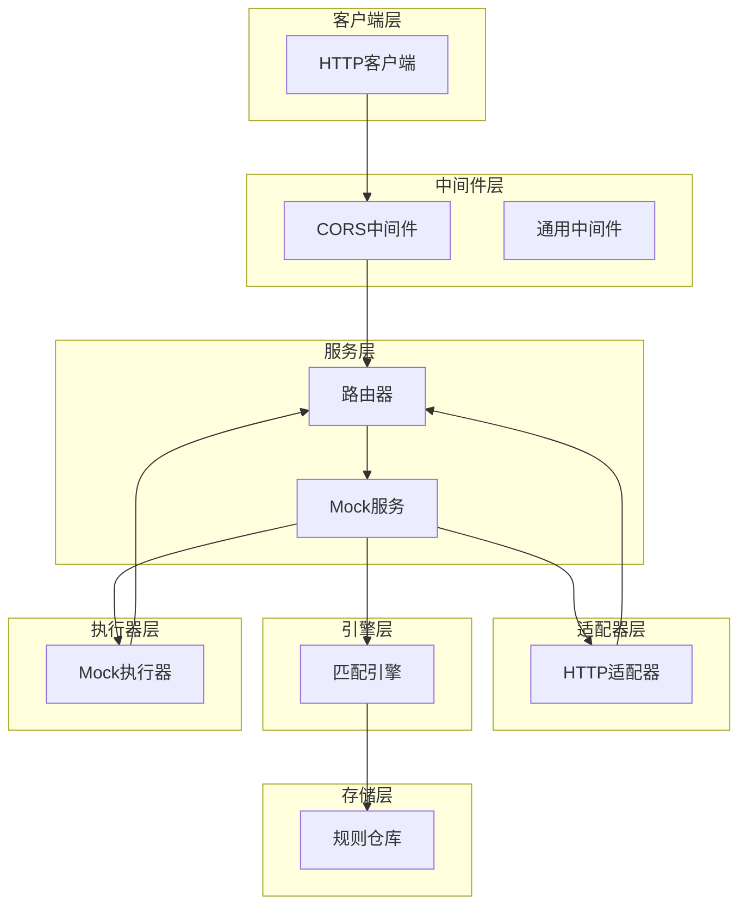

**图表来源**
- [mock_service.go](file://internal/service/mock_service.go#L101-L116)
- [http_adapter.go](file://internal/adapter/http_adapter.go#L14-L19)
- [match_engine.go](file://internal/engine/match_engine.go#L26-L40)

## 核心组件分析

### MockService - 服务协调器

MockService是整个系统的核心协调器，负责整合各个组件的功能。它维护着三个关键依赖：

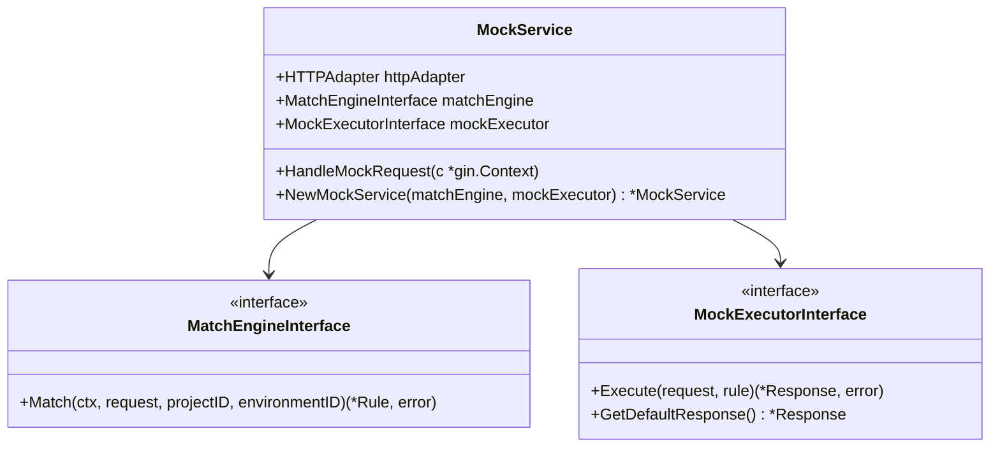

**图表来源**
- [mock_service.go](file://internal/service/mock_service.go#L25-L38)

### HTTPAdapter - 协议适配器

HTTPAdapter负责将Gin框架的HTTP请求转换为统一的请求模型，并将统一的响应模型转换回HTTP响应格式。

```mermaid
classDiagram
class HTTPAdapter {
+Parse(rawRequest) (*Request, error)
+Build(response) (interface{}, error)
+WriteResponse(c *gin.Context, response)
}
class Request {
+string ID
+ProtocolType Protocol
+map[string]string Headers
+[]byte Body
+string SourceIP
+time.Time ReceivedAt
+map[string]interface{} Metadata
}
class Response {
+int StatusCode
+map[string]string Headers
+[]byte Body
+map[string]interface{} Metadata
}
HTTPAdapter --> Request
HTTPAdapter --> Response
```

**图表来源**
- [http_adapter.go](file://internal/adapter/http_adapter.go#L14-L19)
- [adapter.go](file://internal/adapter/adapter.go#L9-L39)

### MatchEngine - 规则匹配引擎

MatchEngine实现了智能的规则匹配机制，支持多种匹配类型和优先级处理。

```mermaid
classDiagram
class MatchEngine {
+RuleRepository ruleRepo
+LRURegexCache regexCache
+Match(ctx, request, projectID, environmentID) (*Rule, error)
+simpleMatch(request, rule) (bool, error)
+regexMatch(request, rule) (bool, error)
+scriptMatch(request, rule) (bool, error)
+compileRegex(pattern) (*regexp.Regexp, error)
}
class Rule {
+string ID
+string Name
+ProtocolType Protocol
+MatchType MatchType
+int Priority
+bool Enabled
+map[string]interface{} MatchCondition
+Response Response
}
MatchEngine --> Rule
```

**图表来源**
- [match_engine.go](file://internal/engine/match_engine.go#L26-L40)
- [models.go](file://internal/models/models.go#L48-L64)

### MockExecutor - 响应执行器

MockExecutor负责根据匹配的规则生成不同类型的响应，包括静态响应、动态响应和代理响应。

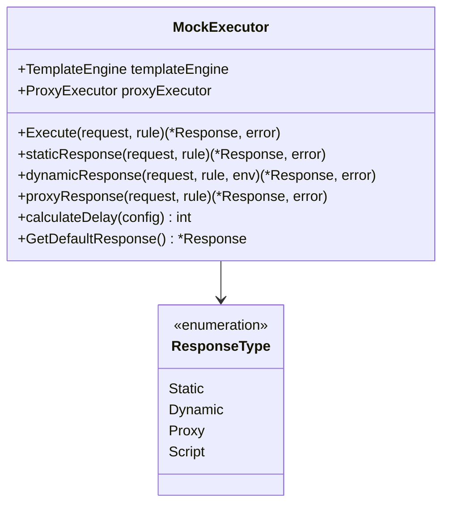

**图表来源**
- [mock_executor.go](file://internal/executor/mock_executor.go#L21-L46)

**章节来源**
- [mock_service.go](file://internal/service/mock_service.go#L25-L38)
- [http_adapter.go](file://internal/adapter/http_adapter.go#L14-L19)
- [match_engine.go](file://internal/engine/match_engine.go#L26-L40)
- [mock_executor.go](file://internal/executor/mock_executor.go#L21-L46)

## HandleMockRequest核心流程

`HandleMockRequest`方法是整个系统的核心入口点，它协调了四个关键步骤来处理HTTP请求。

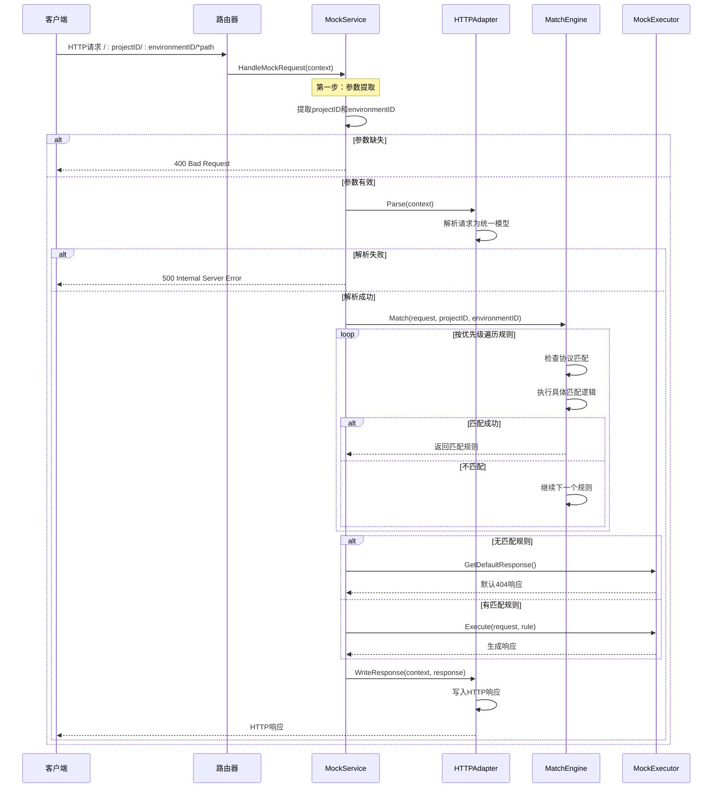

**图表来源**
- [mock_service.go](file://internal/service/mock_service.go#L42-L98)
- [http_adapter.go](file://internal/adapter/http_adapter.go#L21-L85)
- [match_engine.go](file://internal/engine/match_engine.go#L42-L77)
- [mock_executor.go](file://internal/executor/mock_executor.go#L48-L72)

### 详细流程分解

#### 1. URL参数提取阶段

系统首先从URL路径中提取`projectID`和`environmentID`参数：

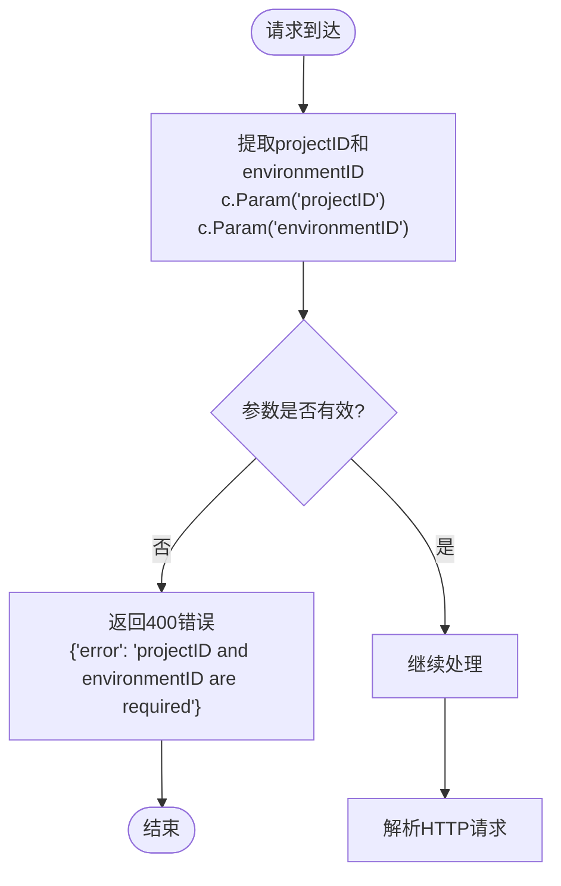

**图表来源**
- [mock_service.go](file://internal/service/mock_service.go#L44-L53)

#### 2. HTTP请求解析阶段

HTTPAdapter将Gin上下文转换为统一的请求模型：

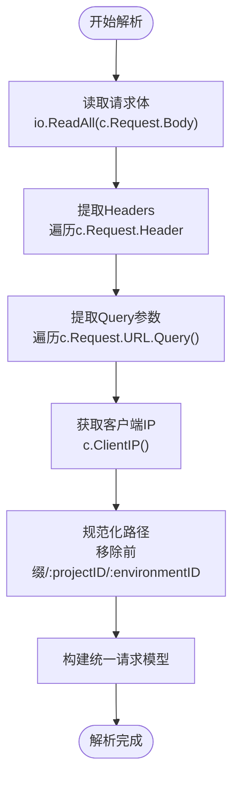

**图表来源**
- [http_adapter.go](file://internal/adapter/http_adapter.go#L21-L85)

#### 3. 规则匹配阶段

MatchEngine按优先级顺序匹配规则：

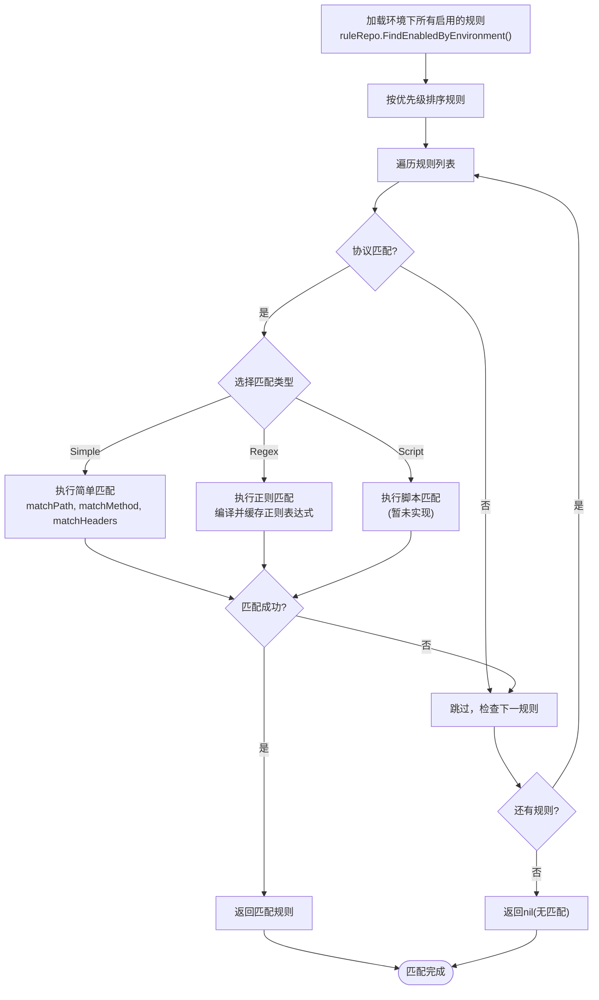

**图表来源**
- [match_engine.go](file://internal/engine/match_engine.go#L42-L77)

#### 4. 响应生成阶段

根据匹配结果或默认响应生成最终响应：

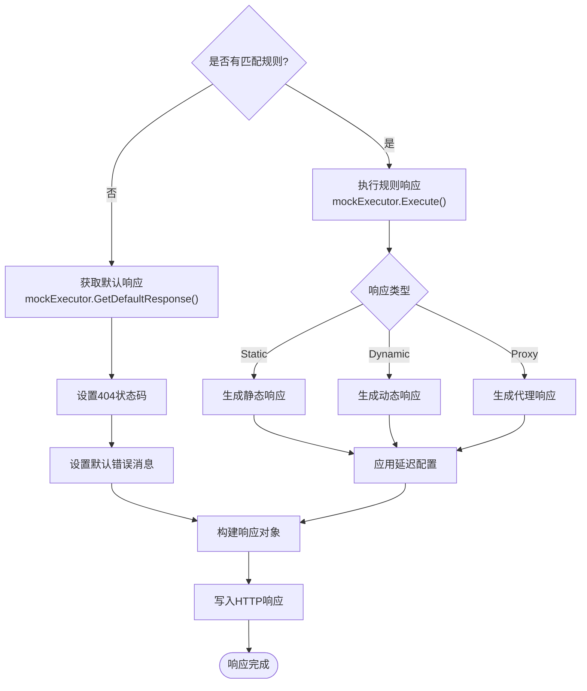

**图表来源**
- [mock_service.go](file://internal/service/mock_service.go#L76-L98)
- [mock_executor.go](file://internal/executor/mock_executor.go#L48-L72)

**章节来源**
- [mock_service.go](file://internal/service/mock_service.go#L42-L98)
- [http_adapter.go](file://internal/adapter/http_adapter.go#L21-L85)
- [match_engine.go](file://internal/engine/match_engine.go#L42-L77)
- [mock_executor.go](file://internal/executor/mock_executor.go#L48-L72)

## 匹配引擎优先级机制

MatchEngine实现了智能的优先级处理机制，确保高优先级规则能够优先匹配。

### 优先级处理流程

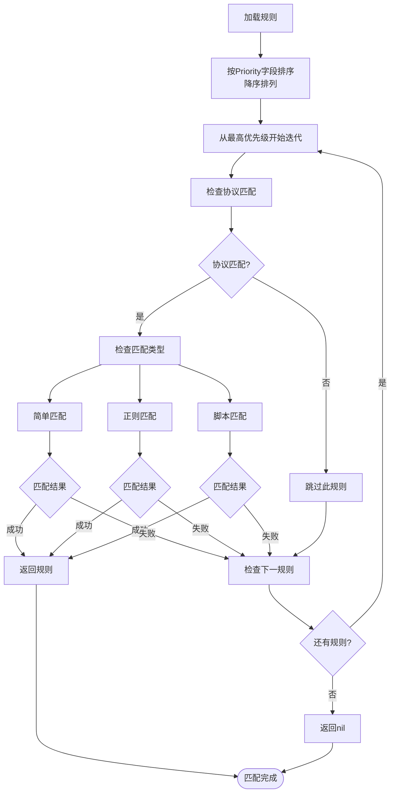

**图表来源**
- [match_engine.go](file://internal/engine/match_engine.go#L42-L77)

### 多维度规则匹配

MatchEngine支持四种维度的规则匹配：

| 匹配维度 | 描述 | 支持的匹配类型 | 示例 |
|---------|------|---------------|------|
| **路径匹配** | 请求路径的匹配 | 简单字符串、正则表达式 | `/api/users`, `/api/users/\d+` |
| **方法匹配** | HTTP方法的匹配 | 字符串、数组 | `GET`, `[GET, POST]` |
| **Header匹配** | 请求头的匹配 | 键值对 | `Content-Type: application/json` |
| **Query匹配** | 查询参数的匹配 | 键值对、正则表达式 | `page=1`, `name=\w+` |

### 正则表达式缓存机制

为了提高性能，MatchEngine实现了LRU缓存机制来缓存编译后的正则表达式：

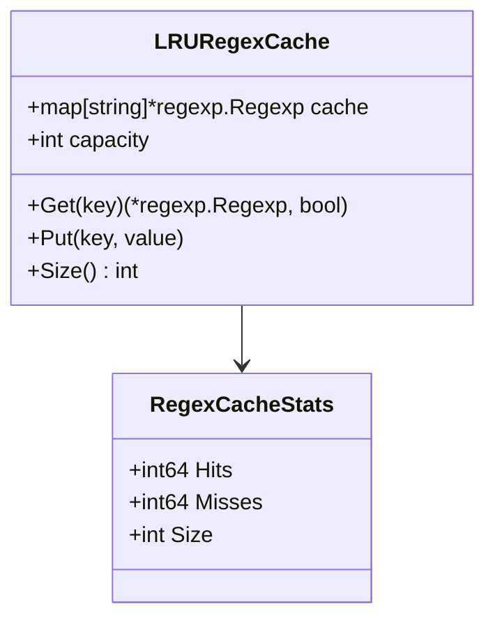

**图表来源**
- [match_engine.go](file://internal/engine/match_engine.go#L19-L24)
- [match_engine.go](file://internal/engine/match_engine.go#L152-L178)

**章节来源**
- [match_engine.go](file://internal/engine/match_engine.go#L42-L77)
- [match_engine.go](file://internal/engine/match_engine.go#L152-L178)

## 中间件集成

gomockserver集成了多个中间件来提供日志记录、性能监控和错误恢复功能。

### 中间件栈结构

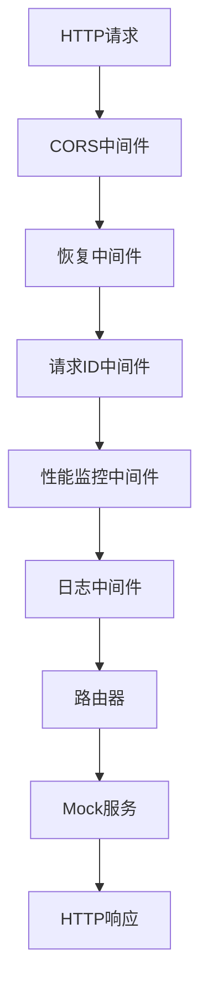

**图表来源**
- [mock_service.go](file://internal/service/mock_service.go#L101-L116)
- [middleware.go](file://internal/service/middleware.go#L18-L134)

### RequestIDMiddleware - 请求追踪

RequestIDMiddleware为每个请求生成唯一的请求ID，并在整个调用链路中传递：

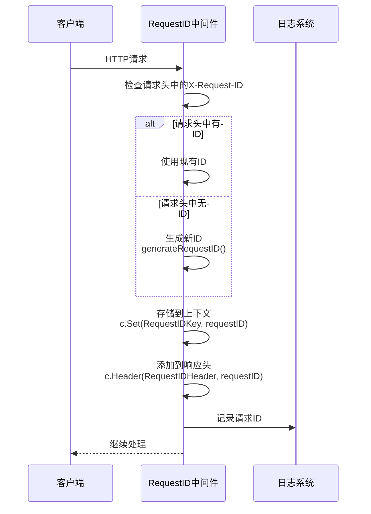

**图表来源**
- [middleware.go](file://internal/service/middleware.go#L18-L37)

### PerformanceMiddleware - 性能监控

PerformanceMiddleware记录请求处理时间和性能指标：

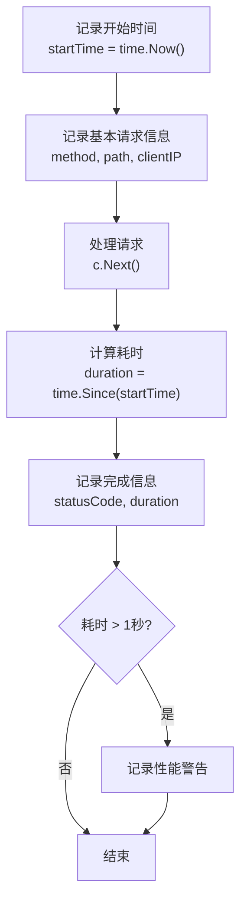

**图表来源**
- [middleware.go](file://internal/service/middleware.go#L40-L78)

### LoggingMiddleware - 请求日志

LoggingMiddleware提供详细的请求日志记录：

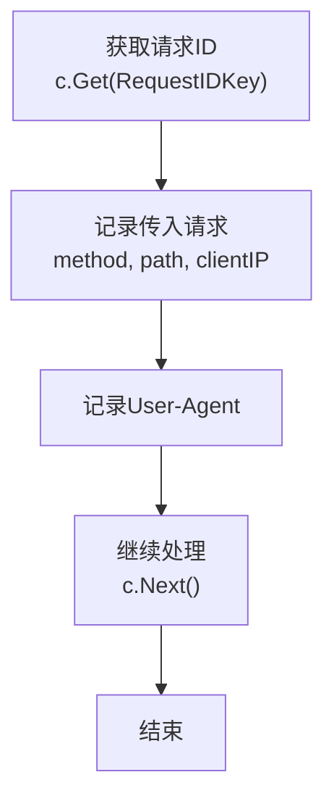

**图表来源**
- [middleware.go](file://internal/service/middleware.go#L81-L99)

**章节来源**
- [middleware.go](file://internal/service/middleware.go#L18-L134)

## 错误处理与恢复

系统实现了多层次的错误处理机制，确保在各种异常情况下都能提供适当的响应。

### 错误处理层次

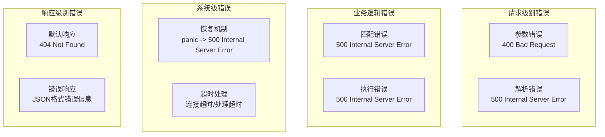

### 错误响应模式

| 错误类型 | HTTP状态码 | 响应格式 | 示例 |
|---------|-----------|---------|------|
| **参数缺失** | 400 | JSON | `{"error": "projectID and environmentID are required"}` |
| **解析失败** | 500 | JSON | `{"error": "Failed to parse request"}` |
| **匹配失败** | 500 | JSON | `{"error": "Failed to match rule"}` |
| **执行失败** | 500 | JSON | `{"error": "Failed to execute mock"}` |
| **无匹配规则** | 404 | JSON | `{"error": "No matching rule found"}` |

### 恢复机制

系统使用Gin框架的Recovery中间件来捕获和处理panic：

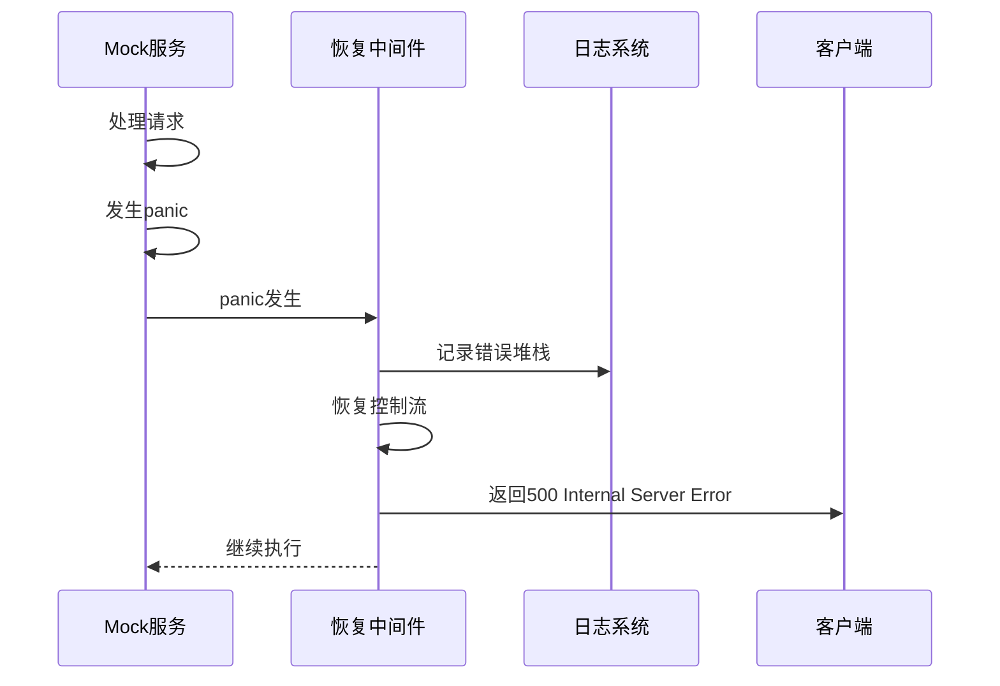

**图表来源**
- [mock_service.go](file://internal/service/mock_service.go#L104-L105)

**章节来源**
- [mock_service.go](file://internal/service/mock_service.go#L48-L62)
- [mock_service.go](file://internal/service/mock_service.go#L58-L62)
- [mock_service.go](file://internal/service/mock_service.go#L68-L73)
- [mock_service.go](file://internal/service/mock_service.go#L88-L93)

## 性能优化策略

### 缓存机制

系统实现了多层缓存来提升性能：

1. **正则表达式缓存**：MatchEngine使用LRU缓存来存储编译后的正则表达式
2. **规则缓存**：通过数据库查询优化减少重复查询
3. **响应缓存**：对于静态响应可以考虑实现响应缓存

### 并发处理

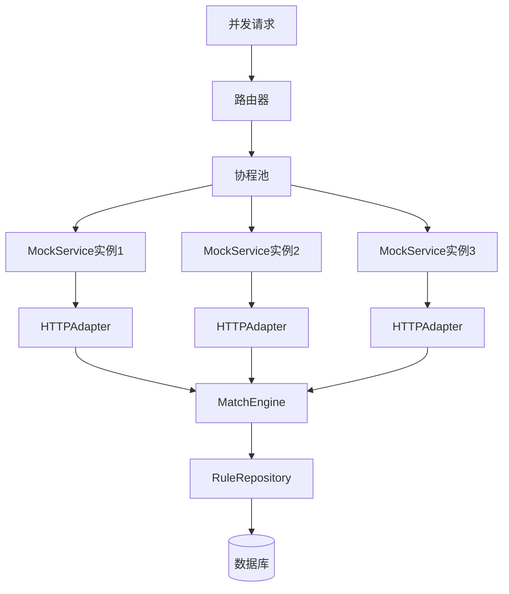

### 延迟配置

MockExecutor支持多种延迟配置来模拟不同的网络条件：

| 延迟类型 | 配置参数 | 描述 | 使用场景 |
|---------|---------|------|---------|
| **固定延迟** | `Fixed` | 固定毫秒数 | 模拟稳定的网络延迟 |
| **随机延迟** | `Min`, `Max` | 在最小值和最大值之间随机 | 模拟不稳定的网络环境 |
| **正态分布延迟** | `Mean`, `StdDev` | 符合正态分布的延迟 | 更真实的网络行为 |
| **阶梯延迟** | `Step`, `Limit` | 按请求次数递增的延迟 | 模拟资源逐渐耗尽的情况 |

**章节来源**
- [match_engine.go](file://internal/engine/match_engine.go#L152-L178)
- [mock_executor.go](file://internal/executor/mock_executor.go#L292-L364)

## 故障排除指南

### 常见问题诊断

#### 1. 400 Bad Request错误

**症状**：客户端收到400错误，提示"projectID and environmentID are required"

**可能原因**：
- URL格式不正确，缺少projectID或environmentID参数
- 请求路径中包含特殊字符或空格

**解决方案**：
```bash
# 正确格式：/:projectID/:environmentID/*path
curl -X GET "http://localhost:8080/project-001/env-001/api/users"
```

#### 2. 500 Internal Server Error错误

**症状**：客户端收到500错误，提示"Failed to match rule"或"Failed to execute mock"

**诊断步骤**：
1. 检查日志输出，确认具体的错误信息
2. 验证数据库连接是否正常
3. 检查规则配置是否正确

#### 3. 404 Not Found响应

**症状**：客户端收到404响应，提示"No matching rule found"

**诊断步骤**：
1. 检查是否存在匹配的规则
2. 验证规则的优先级设置
3. 确认请求的协议、方法、路径等参数是否匹配

### 性能问题排查

#### 1. 响应缓慢

**诊断工具**：
- 使用PerformanceMiddleware记录的性能日志
- 检查正则表达式缓存命中率

**优化建议**：
- 减少复杂的正则表达式使用
- 优化规则优先级，让常用规则排在前面
- 考虑增加缓存层

#### 2. 内存使用过高

**诊断方法**：
- 监控正则表达式缓存大小
- 检查规则数量和复杂度

**优化建议**：
- 调整LRU缓存容量
- 优化规则设计，避免过度匹配

**章节来源**
- [mock_service_test.go](file://internal/service/mock_service_test.go#L61-L99)
- [middleware.go](file://internal/service/middleware.go#L40-L78)

## 总结

gomockserver通过精心设计的模块化架构，实现了高效、可扩展的Mock服务器功能。其核心交互流程围绕`HandleMockRequest`方法展开，通过HTTPAdapter、MatchEngine和MockExecutor三个核心组件的协同工作，完成了从请求解析到响应生成的完整生命周期管理。

### 关键特性

1. **模块化设计**：清晰的职责分离，便于维护和扩展
2. **智能匹配**：支持多种匹配类型和优先级处理
3. **性能优化**：多层缓存机制和并发处理
4. **错误处理**：完善的错误处理和恢复机制
5. **中间件集成**：丰富的中间件支持，提供完整的可观测性

### 最佳实践建议

1. **规则设计**：合理设置规则优先级，避免不必要的规则遍历
2. **性能监控**：充分利用中间件提供的监控功能
3. **错误处理**：在生产环境中配置适当的日志级别
4. **缓存优化**：根据实际使用情况调整缓存配置

通过深入理解这些核心交互流程和设计原理，开发者可以更好地利用gomockserver的强大功能，构建高质量的Mock服务。