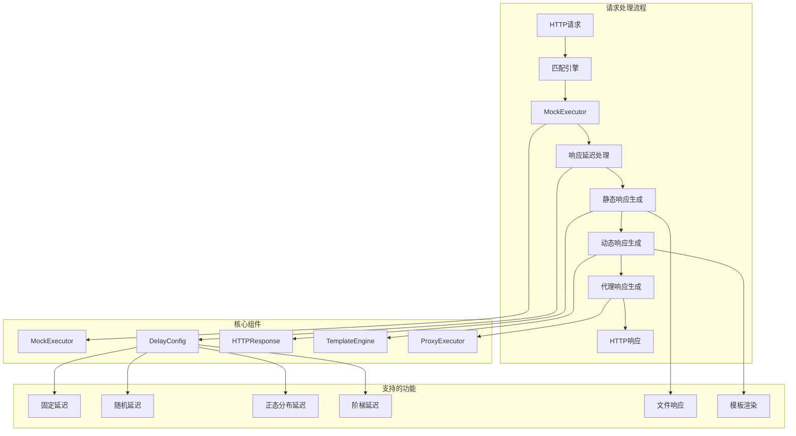
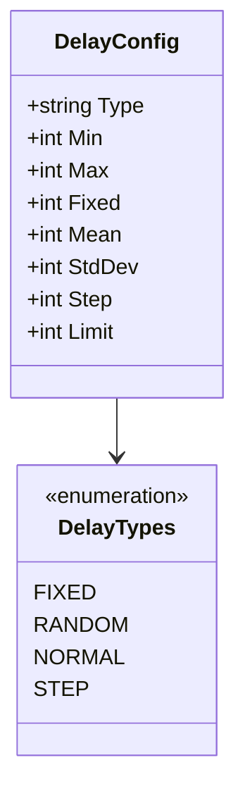
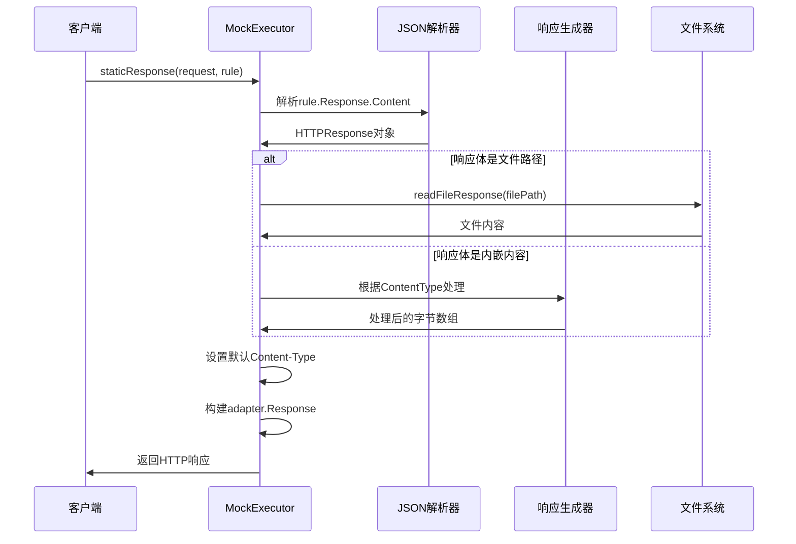
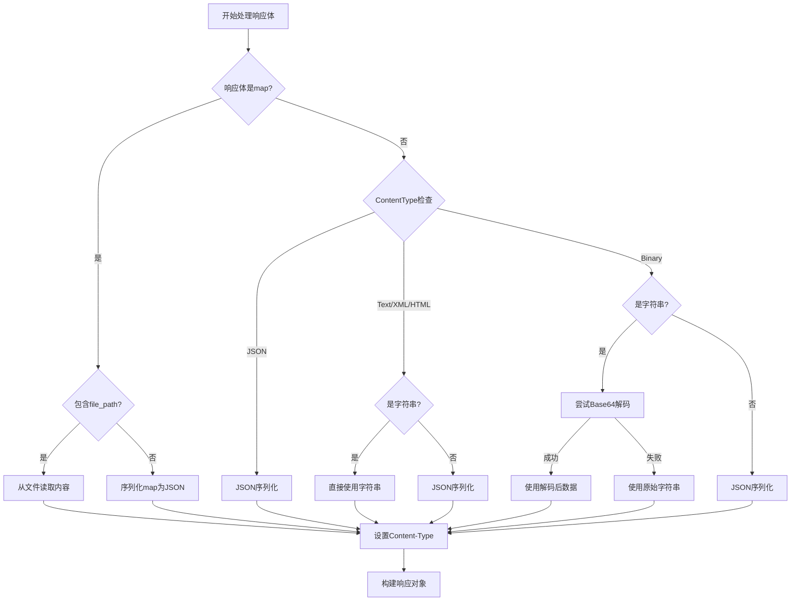
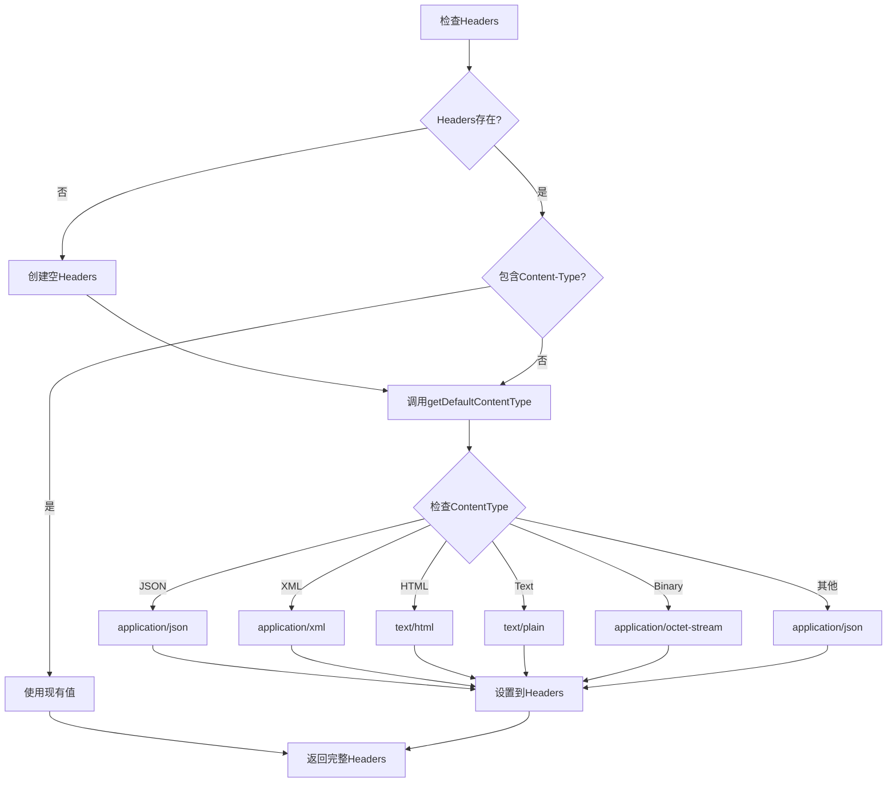
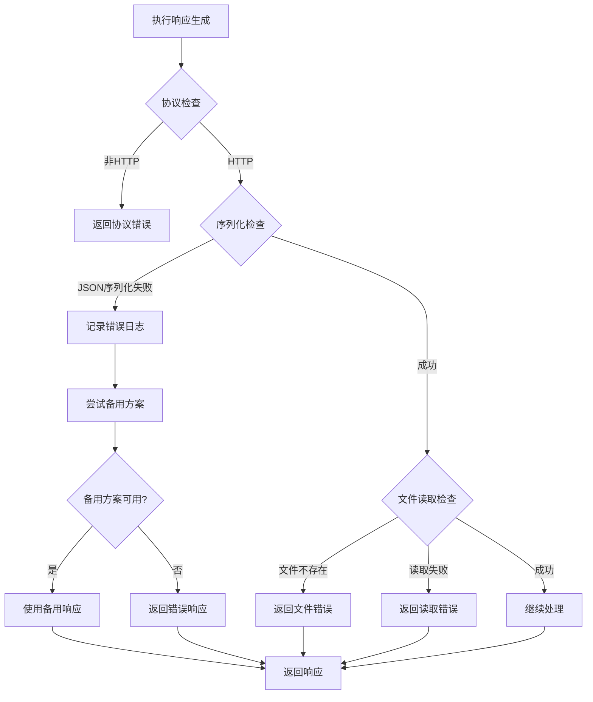
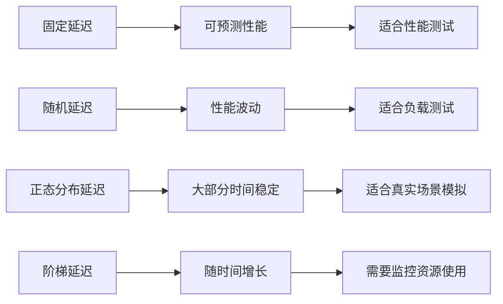
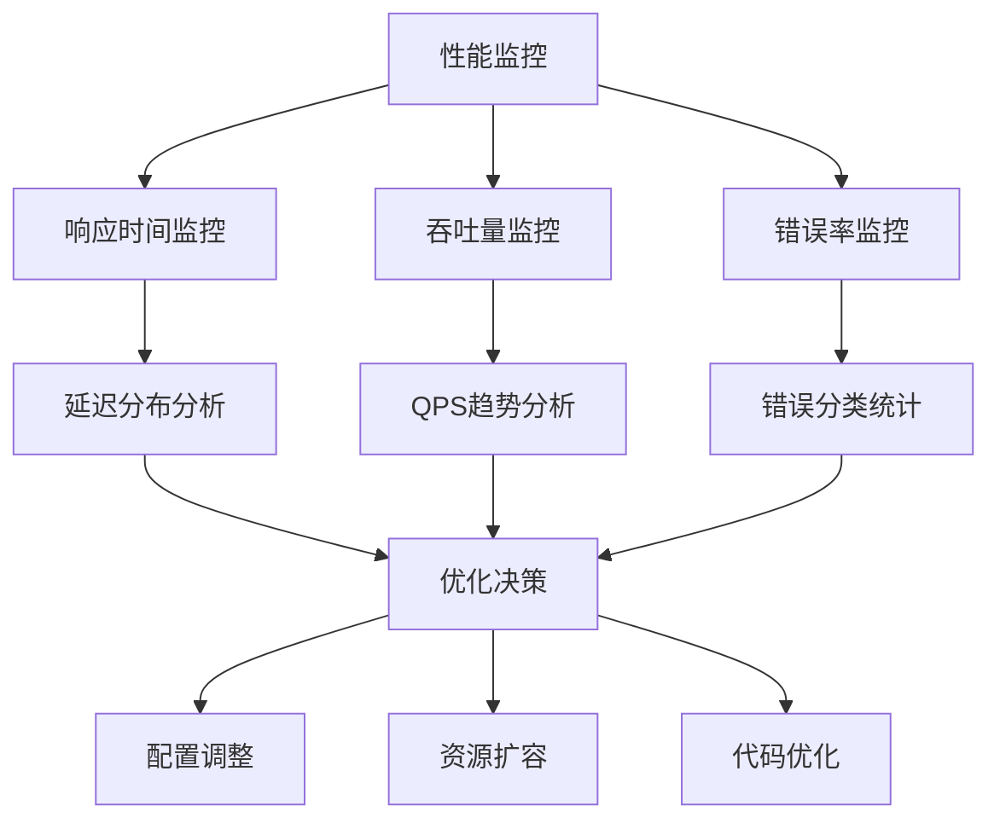

# Mock响应执行

<cite>
**本文档中引用的文件**
- [mock_executor.go](file://internal/executor/mock_executor.go)
- [models.go](file://internal/models/models.go)
- [mock_executor_test.go](file://internal/executor/mock_executor_test.go)
- [match_engine.go](file://internal/engine/match_engine.go)
- [http_adapter.go](file://internal/adapter/http_adapter.go)
</cite>

## 目录
1. [概述](#概述)
2. [系统架构](#系统架构)
3. [核心组件分析](#核心组件分析)
4. [响应延迟处理机制](#响应延迟处理机制)
5. [静态响应生成](#静态响应生成)
6. [HTTP响应结构](#http响应结构)
7. [配置示例](#配置示例)
8. [错误处理与性能考虑](#错误处理与性能考虑)
9. [性能优化建议](#性能优化建议)
10. [总结](#总结)

## 概述

MockExecutor是GoMockServer中的核心执行器，负责根据匹配成功的规则生成并返回HTTP响应。它提供了多种响应类型（静态、动态、代理、脚本），其中静态响应是最常用的类型，支持JSON、XML、HTML、Text、Binary等多种内容类型的响应体生成。

MockExecutor的主要职责包括：
- 根据规则配置生成HTTP响应
- 处理响应延迟（固定延迟、随机延迟、正态分布延迟、阶梯延迟）
- 自动设置Content-Type头部
- 处理各种响应体类型（JSON、XML、HTML、Text、Binary）
- 提供错误处理和性能监控

## 系统架构



**图表来源**
- [mock_executor.go](file://internal/executor/mock_executor.go#L48-L72)
- [match_engine.go](file://internal/engine/match_engine.go#L42-L77)

## 核心组件分析

### MockExecutor结构体

MockExecutor是响应执行的核心组件，包含了处理各种响应类型所需的全部状态和功能。

```mermaid
classDiagram
class MockExecutor {
+sync.Mutex normalRandMu
+float64 normalRandS
+float64 normalRandV
+bool normalRandOK
+map[string]int64 stepCounters
+sync.RWMutex stepCountersMu
+TemplateEngine templateEngine
+ProxyExecutor proxyExecutor
+Execute(request, rule) Response
+staticResponse(request, rule) Response
+dynamicResponse(request, rule, env) Response
+proxyResponse(request, rule) Response
+calculateDelay(config) int
+calculateStepDelay(config, ruleID) int
+generateNormalRand(mean, stdDev) float64
+getDefaultContentType(contentType) string
+readFileResponse(filePath) []byte
}
class TemplateEngine {
+BuildContext(request, rule, env) map
+Render(template, context) string
+RenderJSON(data, context) interface{}
}
class ProxyExecutor {
+Execute(request, config) Response
}
MockExecutor --> TemplateEngine
MockExecutor --> ProxyExecutor
```

**图表来源**
- [mock_executor.go](file://internal/executor/mock_executor.go#L21-L46)

**章节来源**
- [mock_executor.go](file://internal/executor/mock_executor.go#L21-L46)

### 响应类型支持

MockExecutor支持四种主要的响应类型：

| 响应类型 | 描述 | 用途 |
|---------|------|------|
| Static | 静态响应 | 预定义的固定响应内容 |
| Dynamic | 动态响应 | 基于模板和上下文的响应 |
| Proxy | 代理响应 | 转发到目标服务器 |
| Script | 脚本响应 | 未来版本支持 |

## 响应延迟处理机制

### DelayConfig结构

延迟配置通过DelayConfig结构定义，支持多种延迟策略：



**图表来源**
- [models.go](file://internal/models/models.go#L84-L94)

### calculateDelay函数工作机制

calculateDelay函数是延迟处理的核心，实现了四种延迟策略：

```mermaid
flowchart TD
A[calculateDelay开始] --> B{配置是否存在?}
B --> |否| C[返回0]
B --> |是| D{检查延迟类型}
D --> |fixed| E[返回Fixed值]
D --> |random| F{Max ≤ Min?}
F --> |是| G[返回Min值]
F --> |否| H[返回Min + rand.Intn(Max-Min)]
D --> |normal| I{StdDev ≤ 0?}
I --> |是| J[返回Mean值]
I --> |否| K[生成正态分布随机数]
K --> L[四舍五入并确保非负]
L --> M[返回结果]
D --> |step| N[调用calculateStepDelay]
N --> O[基于计数器计算阶梯延迟]
O --> P[应用上限限制]
P --> Q[返回最终延迟]
D --> |其他| R[返回0]
```

**图表来源**
- [mock_executor.go](file://internal/executor/mock_executor.go#L292-L330)

### 各种延迟策略详解

#### 固定延迟（Fixed）
- **特点**：每次延迟相同的时间
- **配置**：`Fixed`字段指定延迟毫秒数
- **适用场景**：模拟网络延迟、测试超时处理

#### 随机延迟（Random）
- **特点**：在指定范围内随机选择延迟时间
- **配置**：`Min`和`Max`定义延迟范围
- **实现**：使用`rand.Intn()`生成随机数
- **边界处理**：当`Max ≤ Min`时返回`Min`

#### 正态分布延迟（Normal）
- **特点**：延迟时间符合正态分布，大部分时间接近平均值
- **配置**：`Mean`为均值，`StdDev`为标准差
- **实现**：采用Marsaglia极坐标方法生成正态分布随机数
- **边界处理**：负值截断为0

#### 阶梯延迟（Step）
- **特点**：随着请求次数增加而递增延迟
- **配置**：`Fixed`为基础延迟，`Step`为步长，`Limit`为上限
- **实现**：使用独立计数器跟踪每个规则的请求次数
- **隔离机制**：支持按规则ID隔离计数器

**章节来源**
- [mock_executor.go](file://internal/executor/mock_executor.go#L292-L365)

## 静态响应生成

### staticResponse方法流程

staticResponse方法负责生成静态HTTP响应，支持多种内容类型和响应体格式：



**图表来源**
- [mock_executor.go](file://internal/executor/mock_executor.go#L74-L178)

### 内容类型处理

MockExecutor支持五种主要的内容类型：

| 内容类型 | MIME类型 | 处理方式 | 示例 |
|---------|----------|----------|------|
| JSON | application/json | JSON序列化 | `{ "data": "value" }` |
| XML | application/xml | 字符串处理 | `<root><data>value</data></root>` |
| HTML | text/html | 字符串处理 | `<html><body>...</body></html>` |
| Text | text/plain | 字符串处理 | 纯文本内容 |
| Binary | application/octet-stream | Base64解码 | 图片、文件等二进制数据 |

### 响应体生成逻辑



**图表来源**
- [mock_executor.go](file://internal/executor/mock_executor.go#L94-L154)

### 文件响应支持

MockExecutor支持从文件读取响应内容，这对于大文件响应特别有用：

- **文件路径格式**：支持相对路径和绝对路径
- **错误处理**：文件不存在或读取失败时返回详细错误信息
- **性能考虑**：大文件会增加内存占用，建议用于小到中等大小的文件

**章节来源**
- [mock_executor.go](file://internal/executor/mock_executor.go#L74-L178)

## HTTP响应结构

### HTTPResponse结构体

HTTPResponse是HTTP响应的核心数据结构，定义了完整的响应配置：

```mermaid
classDiagram
class HTTPResponse {
+int StatusCode
+map[string]string Headers
+interface{} Body
+ContentType ContentType
}
class ContentType {
<<enumeration>>
JSON
XML
HTML
Text
Binary
}
HTTPResponse --> ContentType
```

**图表来源**
- [models.go](file://internal/models/models.go#L96-L102)

### 响应配置详解

| 字段 | 类型 | 描述 | 默认值 |
|------|------|------|--------|
| StatusCode | int | HTTP状态码 | 200 |
| Headers | map[string]string | 响应头 | {} |
| Body | interface{} | 响应体内容 | 必需 |
| ContentType | ContentType | 内容类型 | 必需 |

### Content-Type自动设置

MockExecutor实现了智能的Content-Type设置机制：



**图表来源**
- [mock_executor.go](file://internal/executor/mock_executor.go#L156-L162)

**章节来源**
- [models.go](file://internal/models/models.go#L96-L102)
- [mock_executor.go](file://internal/executor/mock_executor.go#L432-L447)

## 配置示例

### 基础JSON响应配置

```json
{
  "name": "简单JSON响应",
  "protocol": "HTTP",
  "response": {
    "type": "Static",
    "content": {
      "status_code": 200,
      "content_type": "JSON",
      "body": {
        "message": "操作成功",
        "code": 0,
        "data": []
      }
    }
  }
}
```

### 带延迟的JSON响应配置

```json
{
  "name": "带延迟的JSON响应",
  "protocol": "HTTP",
  "response": {
    "type": "Static",
    "delay": {
      "type": "random",
      "min": 100,
      "max": 500
    },
    "content": {
      "status_code": 200,
      "content_type": "JSON",
      "body": {
        "message": "延迟响应",
        "timestamp": "{{now}}"
      }
    }
  }
}
```

### 自定义Content-Type的HTML响应配置

```json
{
  "name": "自定义头部HTML响应",
  "protocol": "HTTP",
  "response": {
    "type": "Static",
    "content": {
      "status_code": 200,
      "content_type": "HTML",
      "headers": {
        "Content-Type": "text/html; charset=utf-8",
        "X-Frame-Options": "DENY",
        "X-Content-Type-Options": "nosniff"
      },
      "body": "<!DOCTYPE html><html><head><title>测试页面</title></head><body><h1>Hello World</h1></body></html>"
    }
  }
}
```

### 二进制文件响应配置

```json
{
  "name": "图片文件响应",
  "protocol": "HTTP",
  "response": {
    "type": "Static",
    "content": {
      "status_code": 200,
      "content_type": "Binary",
      "body": "iVBORw0KGgoAAAANSUhEUgAAAAEAAAABCAYAAAAfFcSJAAAADUlEQVR42mP8/5+hHgAHggJ/PchI7wAAAABJRU5ErkJggg=="
    }
  }
}
```

### 阶梯延迟配置示例

```json
{
  "name": "阶梯延迟测试",
  "protocol": "HTTP",
  "response": {
    "type": "Static",
    "delay": {
      "type": "step",
      "fixed": 100,
      "step": 50,
      "limit": 500
    },
    "content": {
      "status_code": 200,
      "content_type": "JSON",
      "body": {
        "message": "阶梯延迟响应",
        "delay": "{{delay}}ms"
      }
    }
  }
}
```

## 错误处理与性能考虑

### 常见错误类型

MockExecutor在执行过程中可能遇到以下错误：

| 错误类型 | 描述 | 处理方式 |
|---------|------|----------|
| 协议不支持 | 非HTTP协议请求 | 返回错误信息 |
| 序列化失败 | JSON序列化错误 | 记录日志并返回原始数据 |
| 文件读取失败 | 响应体文件不存在 | 返回详细错误信息 |
| 延迟配置错误 | 配置参数无效 | 使用默认值或忽略 |
| 模板渲染失败 | 动态响应模板错误 | 返回静态响应 |

### 错误处理机制



**图表来源**
- [mock_executor.go](file://internal/executor/mock_executor.go#L76-L85)
- [mock_executor.go](file://internal/executor/mock_executor.go#L99-L104)

### 性能考虑因素

#### 内存占用分析

不同响应类型的内存占用情况：

| 响应类型 | 内存占用特点 | 优化建议 |
|---------|-------------|----------|
| 小型JSON | 内存占用较小 | 可以频繁使用 |
| 大型JSON | 内存占用较大 | 考虑分块传输 |
| 文件响应 | 内存占用取决于文件大小 | 避免大文件响应 |
| 二进制数据 | 内存占用较高 | 考虑流式处理 |
| 模板渲染 | 内存占用中等 | 优化模板复杂度 |

#### 延迟配置对性能的影响



#### 吞吐量影响因素

- **延迟配置**：高延迟会降低QPS
- **响应大小**：大响应体增加网络传输时间
- **CPU使用**：复杂的模板渲染消耗CPU
- **内存使用**：大量并发响应增加内存压力

**章节来源**
- [mock_executor.go](file://internal/executor/mock_executor.go#L76-L85)
- [mock_executor.go](file://internal/executor/mock_executor.go#L99-L104)

## 性能优化建议

### 延迟配置优化

1. **合理设置延迟范围**
   - 开发环境：使用固定延迟（10-100ms）
   - 测试环境：使用随机延迟（50-500ms）
   - 生产环境：避免不必要的延迟

2. **阶梯延迟使用建议**
   - 设置合理的步长和上限
   - 监控计数器状态，避免意外增长

3. **正态分布延迟优化**
   - 标准差不宜过大，避免极端延迟
   - 均值设置要符合实际业务场景

### 响应体优化

1. **内容类型选择**
   - 简单文本使用Text类型
   - 结构化数据使用JSON类型
   - 复杂文档使用XML类型
   - 二进制数据使用Binary类型

2. **文件响应优化**
   - 避免超过1MB的大文件
   - 考虑使用CDN或外部存储
   - 实施适当的缓存策略

3. **模板渲染优化**
   - 减少模板复杂度
   - 避免循环引用
   - 使用缓存机制

### 监控和调试



### 最佳实践

1. **开发阶段**
   - 使用固定延迟进行快速验证
   - 启用详细日志记录
   - 监控内存和CPU使用

2. **测试阶段**
   - 使用随机延迟模拟真实场景
   - 进行压力测试
   - 验证错误处理机制

3. **生产阶段**
   - 监控关键指标
   - 设置告警阈值
   - 定期性能评估

## 总结

MockExecutor作为GoMockServer的核心组件，提供了强大而灵活的响应生成功能。通过深入理解其工作原理和最佳实践，可以更好地利用这个工具进行API测试和模拟。

### 关键特性回顾

1. **多延迟策略**：支持固定、随机、正态分布、阶梯四种延迟策略
2. **丰富的内容类型**：支持JSON、XML、HTML、Text、Binary五种内容类型
3. **智能Content-Type设置**：自动设置合适的MIME类型
4. **灵活的响应体生成**：支持内嵌内容和文件引用
5. **完善的错误处理**：提供详细的错误信息和恢复机制

### 使用建议

- 根据测试需求选择合适的延迟策略
- 合理配置响应体大小，避免内存溢出
- 监控性能指标，及时发现和解决问题
- 利用模板功能生成动态响应内容
- 在生产环境中谨慎使用延迟功能

通过合理配置和使用MockExecutor，可以构建出高效、可靠的API测试和模拟环境，为软件开发和测试提供强有力的支持。