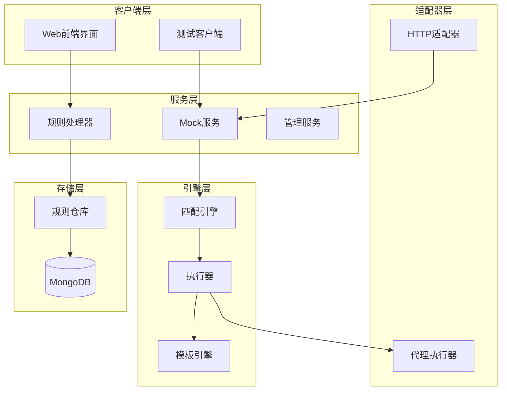
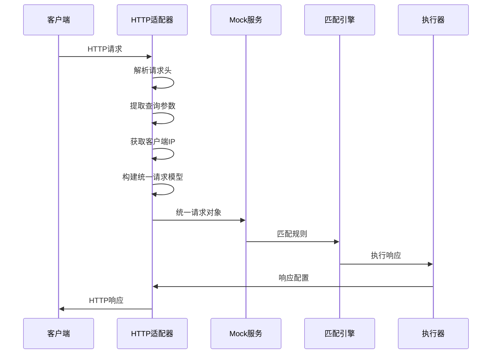
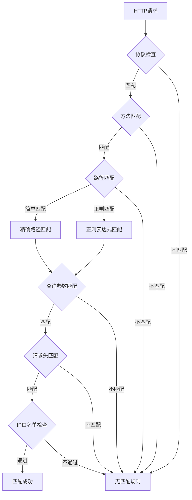
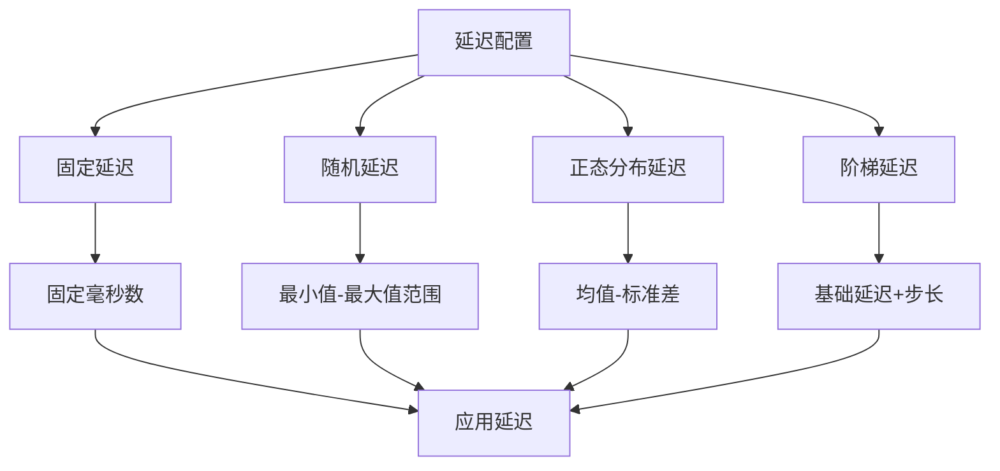
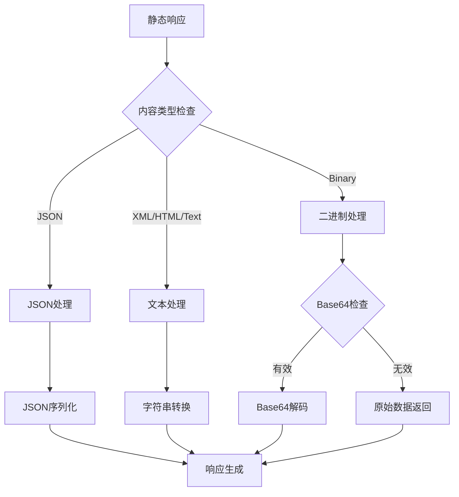
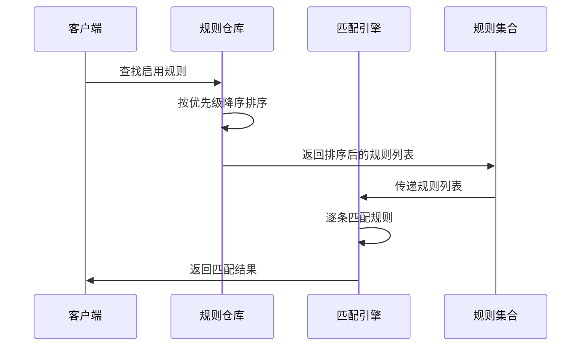
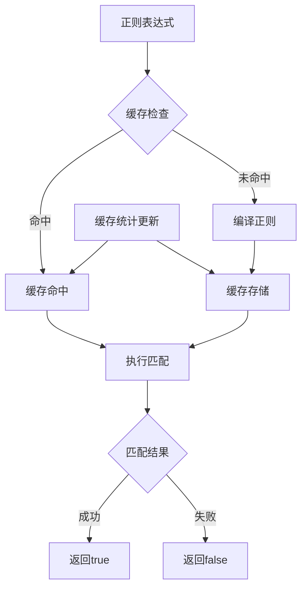

# gomockserver核心功能实现文档

<cite>
**本文档引用的文件**
- [models.go](file://internal/models/models.go)
- [match_engine.go](file://internal/engine/match_engine.go)
- [http_adapter.go](file://internal/adapter/http_adapter.go)
- [mock_executor.go](file://internal/executor/mock_executor.go)
- [mock_service.go](file://internal/service/mock_service.go)
- [rule_handler.go](file://internal/api/rule_handler.go)
- [rule_repository.go](file://internal/repository/rule_repository.go)
</cite>

## 目录
1. [系统概述](#系统概述)
2. [核心数据模型](#核心数据模型)
3. [HTTP/HTTPS协议支持](#httphttps协议支持)
4. [灵活的规则匹配能力](#灵活的规则匹配能力)
5. [响应延迟模拟](#响应延迟模拟)
6. [多格式响应体支持](#多格式响应体支持)
7. [规则优先级控制机制](#规则优先级控制机制)
8. [匹配策略详解](#匹配策略详解)
9. [配置示例与最佳实践](#配置示例与最佳实践)
10. [真实测试场景应用](#真实测试场景应用)

## 系统概述

gomockserver是一个功能强大的HTTP Mock服务器，提供了完整的API模拟解决方案。系统采用模块化架构设计，通过规则引擎实现灵活的请求匹配和响应生成，支持多种匹配策略和响应类型，满足复杂的测试需求。



**图表来源**
- [mock_service.go](file://internal/service/mock_service.go#L25-L38)
- [match_engine.go](file://internal/engine/match_engine.go#L26-L40)
- [mock_executor.go](file://internal/executor/mock_executor.go#L21-L46)

## 核心数据模型

### Rule结构体详解

Rule结构体是系统的核心数据模型，定义了完整的Mock规则配置：

```mermaid
classDiagram
class Rule {
+string ID
+string Name
+string ProjectID
+string EnvironmentID
+ProtocolType Protocol
+MatchType MatchType
+int Priority
+bool Enabled
+map[string]interface{} MatchCondition
+Response Response
+[]string Tags
+string Creator
+time.Time CreatedAt
+time.Time UpdatedAt
}
class HTTPMatchCondition {
+interface{} Method
+string Path
+string PathRegex
+map[string]string Query
+map[string]string Headers
+map[string]interface{} Body
+[]string IPWhitelist
}
class Response {
+ResponseType Type
+DelayConfig Delay
+map[string]interface{} Content
}
class DelayConfig {
+string Type
+int Min
+int Max
+int Fixed
+int Mean
+int StdDev
+int Step
+int Limit
}
Rule --> HTTPMatchCondition : "包含"
Rule --> Response : "包含"
Response --> DelayConfig : "包含"
```

**图表来源**
- [models.go](file://internal/models/models.go#L48-L94)

### 协议类型支持

系统支持多种协议类型，其中HTTP协议为主要支持对象：

| 协议类型 | 描述 | 支持状态 |
|---------|------|----------|
| HTTP | HTTP协议支持 | ✅ 完全支持 |
| WebSocket | WebSocket协议支持 | ✅ 完全支持 |
| gRPC | gRPC协议支持 | ✅ 完全支持 |
| TCP | TCP协议支持 | ✅ 完全支持 |
| UDP | UDP协议支持 | ✅ 完全支持 |

**章节来源**
- [models.go](file://internal/models/models.go#L7-L16)

### 匹配类型分类

系统提供三种匹配类型，满足不同的匹配需求：

| 匹配类型 | 描述 | 适用场景 |
|---------|------|----------|
| Simple | 简单匹配 | 精确路径、方法、查询参数匹配 |
| Regex | 正则表达式匹配 | 复杂路径模式、查询参数验证 |
| Script | 脚本匹配 | 自定义匹配逻辑（v0.4.0计划） |

**章节来源**
- [models.go](file://internal/models/models.go#L18-L25)

### 响应类型体系

系统支持四种响应类型，提供丰富的响应生成方式：

| 响应类型 | 描述 | 功能特点 |
|---------|------|----------|
| Static | 静态响应 | 预定义的固定响应内容 |
| Dynamic | 动态响应 | 支持模板渲染的响应生成 |
| Proxy | 代理响应 | 将请求转发到目标服务 |
| Script | 脚本响应 | 基于脚本的动态响应生成（v0.4.0计划） |

**章节来源**
- [models.go](file://internal/models/models.go#L27-L35)

## HTTP/HTTPS协议支持

### 协议适配机制

HTTP适配器负责将HTTP请求转换为统一的请求模型，并处理响应的生成和发送：



**图表来源**
- [http_adapter.go](file://internal/adapter/http_adapter.go#L21-L85)
- [mock_service.go](file://internal/service/mock_service.go#L42-L98)

### 请求解析功能

HTTP适配器实现了完整的请求解析功能：

- **请求ID生成**：使用UUID确保每个请求的唯一标识
- **请求体读取**：安全地读取HTTP请求体内容
- **头部提取**：提取所有请求头信息，支持多值头部
- **查询参数解析**：解析URL查询参数为键值对映射
- **IP地址获取**：准确获取客户端IP地址
- **路径标准化**：处理路径参数和前缀问题

**章节来源**
- [http_adapter.go](file://internal/adapter/http_adapter.go#L21-L85)

### 响应构建机制

HTTP适配器提供完整的响应构建和发送功能：

- **响应头设置**：支持自定义响应头
- **状态码设置**：支持自定义HTTP状态码
- **响应体写入**：支持多种内容类型的响应体
- **内容类型检测**：自动检测和设置Content-Type

**章节来源**
- [http_adapter.go](file://internal/adapter/http_adapter.go#L87-L113)

## 灵活的规则匹配能力

### 匹配条件详解

系统提供了全面的匹配条件支持，涵盖HTTP请求的各个维度：



**图表来源**
- [match_engine.go](file://internal/engine/match_engine.go#L80-L91)

### 方法匹配策略

支持单个方法和多个方法的匹配：

- **单方法匹配**：精确匹配指定的HTTP方法
- **多方法匹配**：支持数组形式的方法列表匹配
- **大小写不敏感**：忽略HTTP方法名称的大小写差异

**章节来源**
- [match_engine.go](file://internal/engine/match_engine.go#L313-L330)

### 路径匹配机制

系统提供两种路径匹配方式：

#### 简单路径匹配
- **精确匹配**：完全相同的路径字符串匹配
- **尾部斜杠处理**：标准化路径，处理尾部斜杠差异
- **路径参数支持**：支持`:param`形式的路径参数

#### 正则表达式匹配
- **路径正则**：支持完整的正则表达式路径匹配
- **缓存优化**：编译后的正则表达式缓存，提升性能
- **错误处理**：无效正则表达式的优雅降级

**章节来源**
- [match_engine.go](file://internal/engine/match_engine.go#L332-L369)

### 查询参数匹配

支持精确匹配和正则表达式匹配两种方式：

- **精确匹配**：键值对完全匹配
- **正则匹配**：支持查询参数值的正则表达式验证
- **多参数匹配**：同时匹配多个查询参数

**章节来源**
- [match_engine.go](file://internal/engine/match_engine.go#L371-L379)

### 请求头匹配

提供灵活的请求头匹配功能：

- **大小写不敏感**：请求头名称不区分大小写
- **精确匹配**：请求头值的精确匹配
- **多头匹配**：同时匹配多个请求头

**章节来源**
- [match_engine.go](file://internal/engine/match_engine.go#L381-L400)

### IP白名单匹配

支持多种IP匹配格式：

- **精确IP匹配**：匹配特定的IP地址
- **CIDR格式支持**：支持子网掩码格式的IP范围匹配
- **IPv4/IPv6兼容**：支持IPv4和IPv6地址

**章节来源**
- [match_engine.go](file://internal/engine/match_engine.go#L402-L435)

## 响应延迟模拟

### 延迟类型体系

系统提供四种延迟类型，满足不同的测试需求：



**图表来源**
- [mock_executor.go](file://internal/executor/mock_executor.go#L292-L329)

### 固定延迟

最简单的延迟类型，提供固定的等待时间：

- **配置参数**：`Fixed`字段指定延迟毫秒数
- **应用场景**：稳定的API响应时间模拟
- **性能特点**：计算简单，性能最优

**章节来源**
- [mock_executor.go](file://internal/executor/mock_executor.go#L300-L302)

### 随机延迟

在指定范围内生成随机延迟时间：

- **配置参数**：`Min`和`Max`字段定义范围
- **随机算法**：使用Go语言的`rand.Intn()`函数
- **边界处理**：当`Max <= Min`时返回`Min`值

**章节来源**
- [mock_executor.go](file://internal/executor/mock_executor.go#L303-L307)

### 正态分布延迟

基于正态分布生成延迟时间，模拟真实的网络行为：

- **数学原理**：使用Marsaglia极坐标方法生成正态分布随机数
- **配置参数**：`Mean`（均值）、`StdDev`（标准差）
- **边界约束**：确保生成的延迟值为非负整数

**章节来源**
- [mock_executor.go](file://internal/executor/mock_executor.go#L308-L323)

### 阶梯延迟

基于请求计数的阶梯式延迟增长：

- **计数器机制**：每个规则维护独立的请求计数器
- **阶梯计算**：`baseDelay + (count-1) * step`
- **上限控制**：可设置最大延迟限制
- **计数器重置**：支持按规则重置计数器

**章节来源**
- [mock_executor.go](file://internal/executor/mock_executor.go#L332-L364)

## 多格式响应体支持

### 内容类型体系

系统支持五种主要的内容类型：

| 内容类型 | MIME类型 | 用途描述 | 处理方式 |
|---------|----------|----------|----------|
| JSON | application/json | 结构化数据交换 | JSON序列化/反序列化 |
| XML | application/xml | 标准标记语言 | 原始XML字符串处理 |
| HTML | text/html | Web页面内容 | 原始HTML字符串处理 |
| Text | text/plain | 纯文本内容 | 原始文本字符串处理 |
| Binary | application/octet-stream | 二进制数据 | Base64编码/解码 |

**章节来源**
- [models.go](file://internal/models/models.go#L37-L46)

### 静态响应处理

静态响应支持多种内容组织方式：



**图表来源**
- [mock_executor.go](file://internal/executor/mock_executor.go#L74-L177)

### 文件引用支持

支持从文件系统读取响应内容：

- **文件路径引用**：通过`file_path`字段指定文件路径
- **安全性考虑**：需要确保文件访问的安全性
- **错误处理**：文件读取失败时的优雅降级

**章节来源**
- [mock_executor.go](file://internal/executor/mock_executor.go#L96-L105)

### 二进制数据处理

专门的二进制数据处理机制：

- **Base64编码**：支持Base64编码的二进制数据
- **解码失败处理**：解码失败时返回原始数据
- **MIME类型设置**：自动设置正确的Content-Type

**章节来源**
- [mock_executor.go](file://internal/executor/mock_executor.go#L129-L147)

### 动态响应生成

基于模板的动态响应生成：

- **模板引擎**：支持复杂的模板语法
- **上下文构建**：提供丰富的请求上下文信息
- **类型适配**：根据内容类型自动选择处理方式

**章节来源**
- [mock_executor.go](file://internal/executor/mock_executor.go#L180-L271)

## 规则优先级控制机制

### 优先级排序策略

系统采用严格的优先级排序机制：



**图表来源**
- [rule_repository.go](file://internal/repository/rule_repository.go#L116-L137)
- [match_engine.go](file://internal/engine/match_engine.go#L42-L77)

### 数据库排序实现

规则仓库在数据库查询时就进行优先级排序：

- **降序排列**：优先级高的规则排在前面
- **索引优化**：利用MongoDB的索引加速排序
- **内存效率**：减少内存中的排序操作

**章节来源**
- [rule_repository.go](file://internal/repository/rule_repository.go#L123-L124)

### 匹配顺序保证

匹配引擎严格按照排序后的规则顺序进行匹配：

- **短路机制**：找到第一个匹配的规则立即返回
- **优先级体现**：高优先级规则优先被匹配
- **一致性保证**：相同条件下优先级高的规则总是优先

**章节来源**
- [match_engine.go](file://internal/engine/match_engine.go#L51-L73)

## 匹配策略详解

### 精确匹配 vs 路径参数

系统支持两种主要的路径匹配策略：

#### 精确匹配
- **特点**：路径字符串完全一致
- **性能**：最高性能，字符串比较
- **适用场景**：固定路径的API端点

#### 路径参数匹配
- **特点**：支持`:param`形式的参数占位符
- **实现**：按路径段分割后逐段比较
- **灵活性**：支持动态参数的路径匹配

**章节来源**
- [match_engine.go](file://internal/engine/match_engine.go#L350-L369)

### 正则表达式匹配优化

正则表达式匹配的性能优化措施：



**图表来源**
- [match_engine.go](file://internal/engine/match_engine.go#L152-L175)

### 缓存机制

正则表达式编译结果的缓存机制：

- **LRU策略**：最近最少使用的正则表达式被淘汰
- **容量限制**：默认缓存容量1000个正则表达式
- **统计监控**：提供缓存命中率和miss率统计

**章节来源**
- [match_engine.go](file://internal/engine/match_engine.go#L19-L24)

## 配置示例与最佳实践

### 基础规则配置

以下是一个完整的规则配置示例：

```json
{
  "name": "用户查询接口",
  "project_id": "project-1",
  "environment_id": "dev",
  "protocol": "HTTP",
  "match_type": "Simple",
  "priority": 100,
  "enabled": true,
  "match_condition": {
    "method": "GET",
    "path": "/api/users/:id",
    "query": {
      "format": "json"
    },
    "headers": {
      "Accept": "application/json"
    },
    "ip_whitelist": ["192.168.1.0/24", "10.0.0.1"]
  },
  "response": {
    "type": "Static",
    "delay": {
      "type": "fixed",
      "fixed": 100
    },
    "content": {
      "status_code": 200,
      "content_type": "JSON",
      "body": {
        "id": "{{.Params.id}}",
        "name": "测试用户",
        "email": "user@example.com"
      }
    }
  }
}
```

### 复杂匹配场景

#### 多条件组合匹配
```json
{
  "match_condition": {
    "method": ["GET", "POST"],
    "path_regex": "^/api/(users|products)/\\d+$",
    "query": {
      "page": "\\d+",
      "limit": "\\d+"
    },
    "headers": {
      "Authorization": "^Bearer \\w+$"
    }
  }
}
```

#### 动态响应配置
```json
{
  "response": {
    "type": "Dynamic",
    "content": {
      "status_code": 200,
      "content_type": "JSON",
      "body": {
        "timestamp": "{{.Timestamp}}",
        "request_id": "{{.RequestID}}",
        "data": "{{.RequestBody}}"
      }
    }
  }
}
```

### 性能优化建议

#### 规则优先级设计
- **高频规则**：将常用接口的规则设置更高的优先级
- **特例规则**：特殊场景的规则放在低优先级位置
- **默认规则**：最后放置通用的默认响应规则

#### 匹配条件优化
- **方法优先**：HTTP方法是最快速的匹配条件
- **路径简化**：避免过于复杂的正则表达式路径匹配
- **查询参数**：只匹配必要的查询参数

## 真实测试场景应用

### API集成测试

在API集成测试中，gomockserver可以模拟各种响应场景：

#### 成功响应模拟
- **场景**：正常业务流程的API调用
- **配置**：设置合适的延迟时间和正确的响应格式
- **验证**：验证客户端能够正确处理成功响应

#### 错误响应模拟
- **场景**：API调用失败的各种情况
- **配置**：设置适当的HTTP状态码和错误信息
- **验证**：验证客户端的错误处理逻辑

#### 边界条件测试
- **场景**：API的边界输入和异常情况
- **配置**：模拟超时、限流、参数错误等场景
- **验证**：验证系统的健壮性和容错能力

### 性能测试支持

#### 延迟模拟
- **固定延迟**：模拟稳定的网络延迟
- **随机延迟**：模拟不稳定的网络环境
- **阶梯延迟**：模拟渐进式的性能退化

#### 并发测试
- **多规则并发**：测试多个规则同时匹配的情况
- **高并发压力**：测试系统在高并发下的表现
- **资源消耗**：监控CPU和内存的使用情况

### 端到端测试

#### 完整业务流程
- **场景**：模拟完整的业务流程
- **配置**：串联多个API的响应
- **验证**：验证整个业务流程的正确性

#### 异常恢复测试
- **场景**：系统异常后的恢复过程
- **配置**：模拟服务不可用和恢复
- **验证**：验证系统的自愈能力和用户体验

**章节来源**
- [mock_service.go](file://internal/service/mock_service.go#L42-L98)

## 总结

gomockserver通过其强大的核心功能，为API测试提供了完整的解决方案。从灵活的规则匹配到多样化的响应类型，从精确的优先级控制到高效的匹配算法，系统在保证功能丰富性的同时，也注重性能和易用性。通过合理的配置和使用，开发者可以在各种测试场景中充分发挥系统的优势，提高测试效率和质量。