# 规则匹配引擎

<cite>
**本文档引用的文件**
- [match_engine.go](file://internal/engine/match_engine.go)
- [models.go](file://internal/models/models.go)
- [rule_repository.go](file://internal/repository/rule_repository.go)
- [rule_handler.go](file://internal/api/rule_handler.go)
- [lru_cache.go](file://internal/engine/lru_cache.go)
- [match_engine_simple_test.go](file://internal/engine/match_engine_simple_test.go)
- [match_engine_test.go](file://internal/engine/match_engine_test.go)
</cite>

## 目录
1. [简介](#简介)
2. [系统架构概览](#系统架构概览)
3. [核心组件分析](#核心组件分析)
4. [Match方法执行流程](#match方法执行流程)
5. [简单匹配策略详解](#简单匹配策略详解)
6. [正则匹配与脚本匹配](#正则匹配与脚本匹配)
7. [规则优先级排序机制](#规则优先级排序机制)
8. [性能优化与缓存机制](#性能优化与缓存机制)
9. [实际应用示例](#实际应用示例)
10. [常见问题与解决方案](#常见问题与解决方案)
11. [总结](#总结)

## 简介

规则匹配引擎（MatchEngine）是GoMockServer项目的核心组件，负责根据HTTP请求的各种属性匹配预定义的规则。该引擎采用优先级驱动的匹配策略，支持多种匹配条件组合，为Mock服务器提供了灵活且高效的请求路由能力。

引擎的主要特点包括：
- **优先级驱动**：按照规则优先级顺序进行匹配，确保高优先级规则优先生效
- **多条件组合**：支持HTTP方法、路径、查询参数、请求头、IP白名单等多种匹配条件
- **缓存优化**：内置正则表达式编译缓存，提升正则匹配性能
- **扩展性设计**：预留了正则匹配和脚本匹配的扩展点

## 系统架构概览

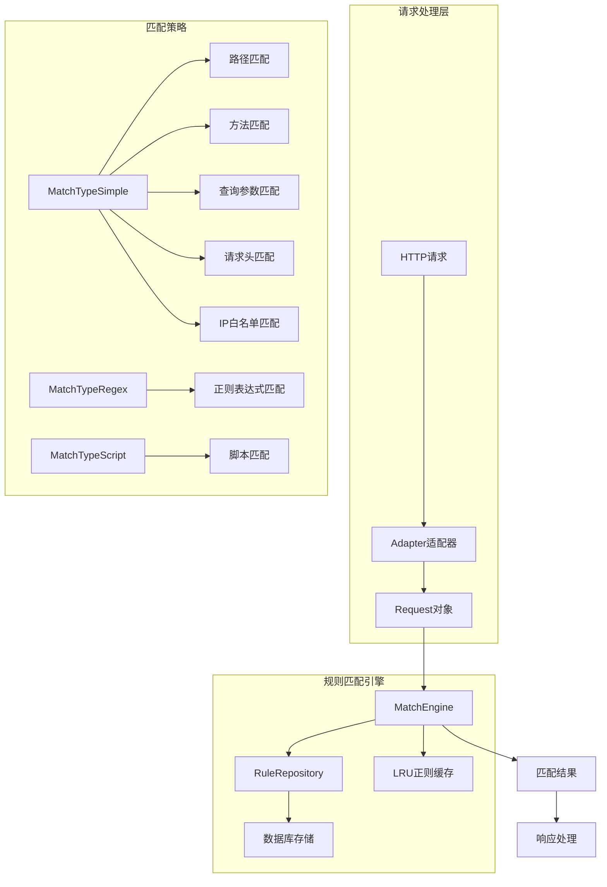

**图表来源**
- [match_engine.go](file://internal/engine/match_engine.go#L26-L436)
- [rule_repository.go](file://internal/repository/rule_repository.go#L14-L22)

**章节来源**
- [match_engine.go](file://internal/engine/match_engine.go#L1-L50)
- [models.go](file://internal/models/models.go#L18-L25)

## 核心组件分析

### MatchEngine结构体

MatchEngine是规则匹配引擎的核心结构体，包含了规则仓库、正则表达式缓存和统计信息：

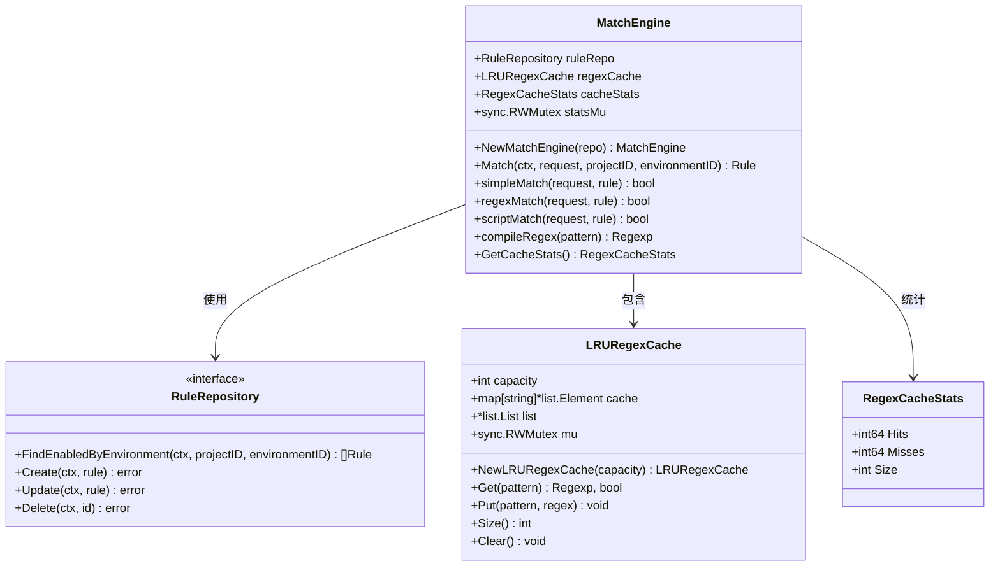

**图表来源**
- [match_engine.go](file://internal/engine/match_engine.go#L26-L40)
- [lru_cache.go](file://internal/engine/lru_cache.go#L10-L30)

### 数据模型结构

系统使用以下核心数据模型来表示规则和匹配条件：

```mermaid
classDiagram
class Rule {
+string ID
+string Name
+string ProjectID
+string EnvironmentID
+ProtocolType Protocol
+MatchType MatchType
+int Priority
+bool Enabled
+map[string]interface{} MatchCondition
+Response Response
+[]string Tags
+string Creator
+time.Time CreatedAt
+time.Time UpdatedAt
}
class HTTPMatchCondition {
+interface{} Method
+string Path
+string PathRegex
+map[string]string Query
+map[string]string Headers
+map[string]interface{} Body
+[]string IPWhitelist
}
class Response {
+ResponseType Type
+DelayConfig Delay
+map[string]interface{} Content
}
class DelayConfig {
+string Type
+int Min
+int Max
+int Fixed
+int Mean
+int StdDev
+int Step
+int Limit
}
Rule --> HTTPMatchCondition : 包含
Rule --> Response : 包含
Response --> DelayConfig : 可选
```

**图表来源**
- [models.go](file://internal/models/models.go#L48-L74)
- [models.go](file://internal/models/models.go#L66-L74)

**章节来源**
- [match_engine.go](file://internal/engine/match_engine.go#L26-L40)
- [models.go](file://internal/models/models.go#L48-L74)

## Match方法执行流程

Match方法是规则匹配引擎的入口点，实现了完整的规则匹配流程：

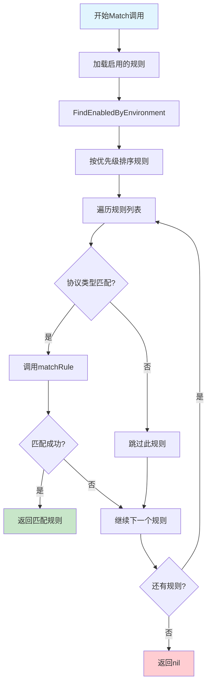

**图表来源**
- [match_engine.go](file://internal/engine/match_engine.go#L42-L76)

### 详细执行步骤

1. **规则加载**：通过RuleRepository从数据库加载指定项目和环境下的所有启用规则
2. **优先级排序**：规则按照Priority字段降序排列，确保高优先级规则优先匹配
3. **逐条匹配**：对每个规则执行匹配逻辑，直到找到第一个匹配成功的规则或遍历完成
4. **协议检查**：首先检查规则的Protocol是否与请求协议匹配
5. **匹配策略选择**：根据MatchType调用相应的匹配方法

**章节来源**
- [match_engine.go](file://internal/engine/match_engine.go#L42-L76)

## 简单匹配策略详解

简单匹配（MatchTypeSimple）是最常用的匹配策略，支持多种条件的精确匹配：

### 匹配条件类型

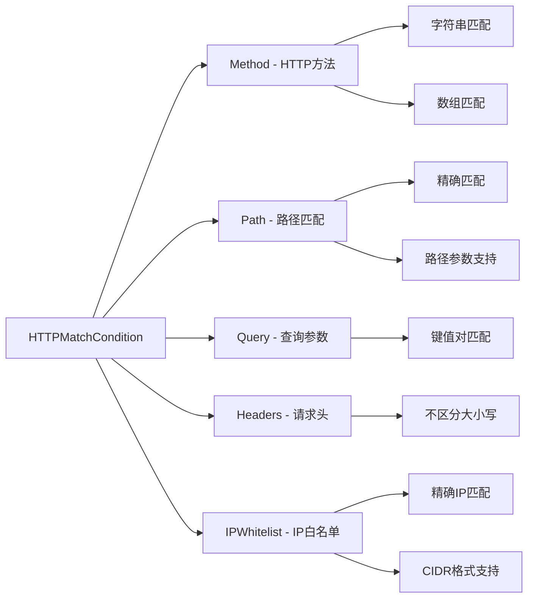

**图表来源**
- [match_engine.go](file://internal/engine/match_engine.go#L94-L149)
- [models.go](file://internal/models/models.go#L66-L74)

### 路径匹配实现

路径匹配支持两种模式：
- **精确匹配**：严格匹配路径字符串
- **路径参数支持**：使用`:param`语法支持动态参数

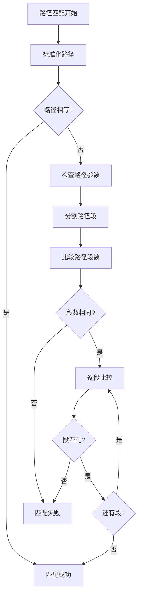

**图表来源**
- [match_engine.go](file://internal/engine/match_engine.go#L332-L368)

### HTTP方法匹配

方法匹配支持单个方法精确匹配和多个方法数组匹配：

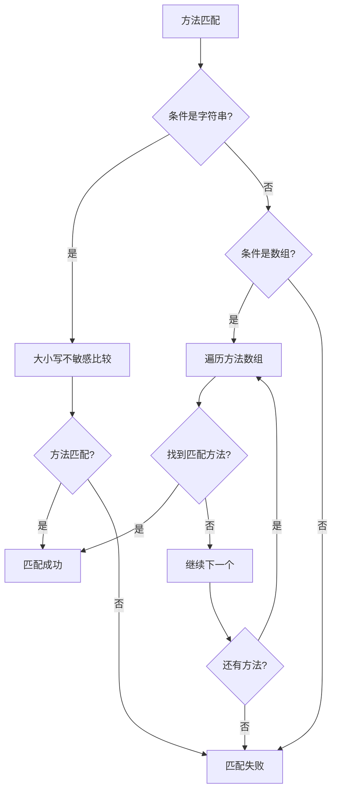

**图表来源**
- [match_engine.go](file://internal/engine/match_engine.go#L313-L329)

### 查询参数匹配

查询参数匹配采用键值对精确匹配策略：

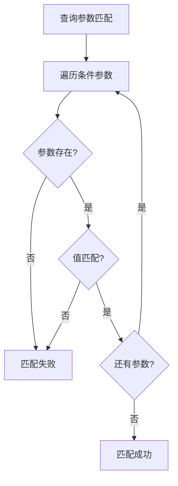

**图表来源**
- [match_engine.go](file://internal/engine/match_engine.go#L371-L378)

### 请求头匹配

请求头匹配具有以下特点：
- **不区分大小写**：使用`strings.EqualFold`进行比较
- **严格匹配**：要求所有条件头都必须存在于请求中
- **值精确匹配**：头值必须完全一致

### IP白名单匹配

IP白名单支持两种格式：
- **精确IP**：直接匹配IP地址
- **CIDR格式**：支持子网掩码匹配

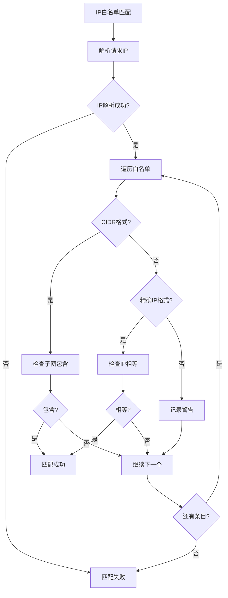

**图表来源**
- [match_engine.go](file://internal/engine/match_engine.go#L402-L434)

**章节来源**
- [match_engine.go](file://internal/engine/match_engine.go#L94-L149)
- [match_engine_simple_test.go](file://internal/engine/match_engine_simple_test.go#L1-L322)

## 正则匹配与脚本匹配

### 正则匹配策略

正则匹配（MatchTypeRegex）支持对路径、查询参数和请求头使用正则表达式进行匹配：

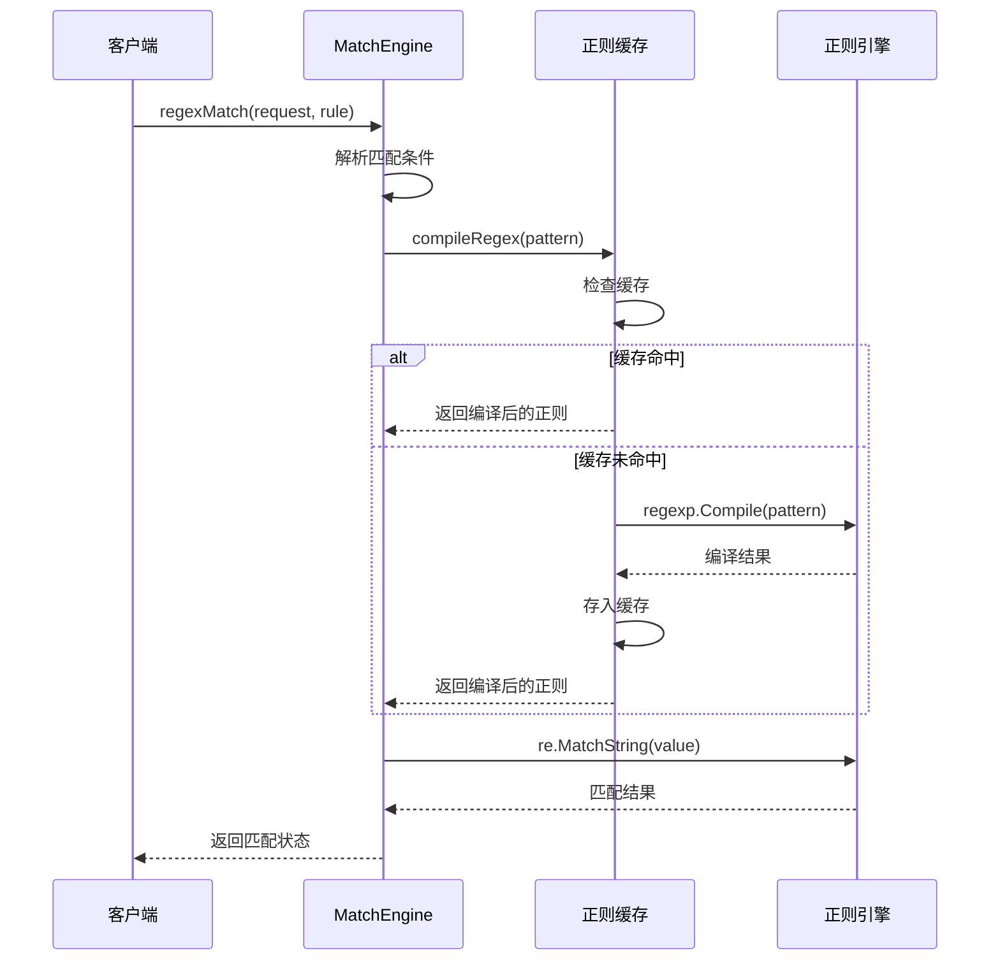

**图表来源**
- [match_engine.go](file://internal/engine/match_engine.go#L152-L175)
- [match_engine.go](file://internal/engine/match_engine.go#L187-L304)

### 脚本匹配策略

脚本匹配（MatchTypeScript）目前处于规划阶段，尚未实现：

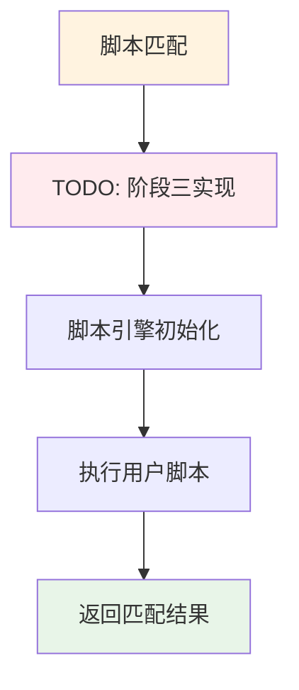

**图表来源**
- [match_engine.go](file://internal/engine/match_engine.go#L307-L311)

**章节来源**
- [match_engine.go](file://internal/engine/match_engine.go#L187-L304)
- [match_engine.go](file://internal/engine/match_engine.go#L307-L311)

## 规则优先级排序机制

### 排序策略

规则优先级排序是确保高优先级规则优先匹配的关键机制：

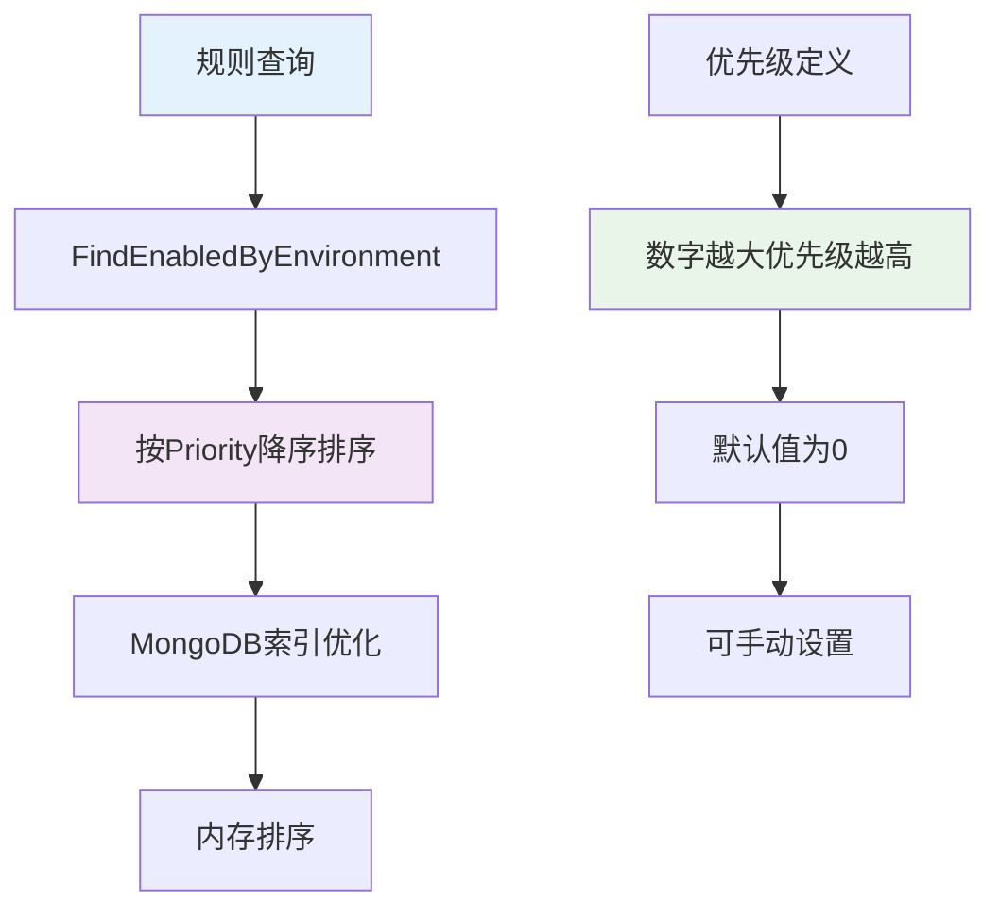

**图表来源**
- [rule_repository.go](file://internal/repository/rule_repository.go#L123-L147)

### 避免规则冲突

优先级机制有效避免了规则冲突：
1. **高优先级优先**：系统总是先尝试匹配高优先级规则
2. **短路求值**：一旦找到匹配规则就立即返回，不再检查后续规则
3. **明确优先级**：通过清晰的优先级设置避免歧义

### 性能考虑

- **数据库层面**：使用MongoDB的索引和排序功能
- **内存层面**：在内存中维护有序的规则列表
- **匹配效率**：通过协议检查和早期退出减少不必要的计算

**章节来源**
- [rule_repository.go](file://internal/repository/rule_repository.go#L123-L147)
- [match_engine.go](file://internal/engine/match_engine.go#L42-L76)

## 性能优化与缓存机制

### LRU正则表达式缓存

为了提升正则匹配性能，系统实现了LRU（Least Recently Used）缓存机制：

```mermaid
classDiagram
class LRURegexCache {
+int capacity
+map[string]*list.Element cache
+*list.List list
+sync.RWMutex mu
+Get(pattern) Regexp, bool
+Put(pattern, regex) void
+Size() int
+Clear() void
}
class regexCacheItem {
+string pattern
+*regexp.Regexp regex
}
class list.Element {
+*list.Element next
+*list.Element prev
+interface{} Value
}
LRURegexCache --> regexCacheItem : 存储
LRURegexCache --> list.Element : 使用
```

**图表来源**
- [lru_cache.go](file://internal/engine/lru_cache.go#L10-L30)

### 缓存工作原理

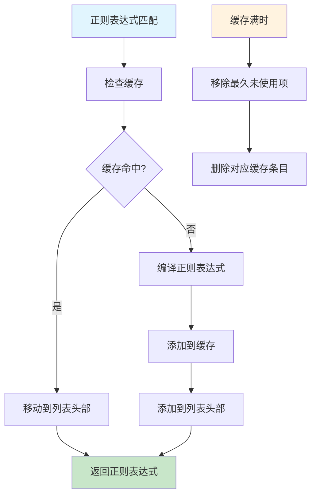

**图表来源**
- [lru_cache.go](file://internal/engine/lru_cache.go#L34-L72)

### 缓存统计与监控

系统提供了缓存统计功能：

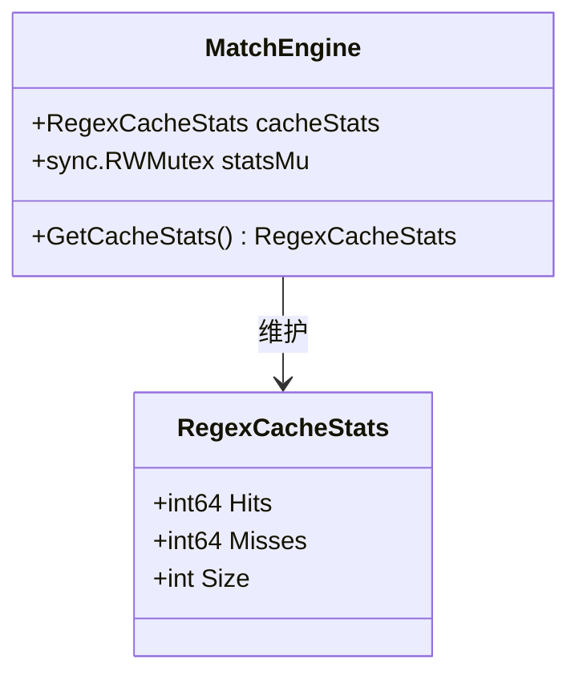

**图表来源**
- [match_engine.go](file://internal/engine/match_engine.go#L19-L24)

### 性能优化建议

1. **合理设置缓存容量**：根据实际使用情况调整LRU缓存大小
2. **避免频繁编译**：利用缓存机制减少重复编译开销
3. **正则表达式优化**：编写高效的正则表达式模式
4. **监控缓存命中率**：定期检查缓存统计信息

**章节来源**
- [lru_cache.go](file://internal/engine/lru_cache.go#L1-L88)
- [match_engine.go](file://internal/engine/match_engine.go#L152-L175)
- [match_engine.go](file://internal/engine/match_engine.go#L178-L185)

## 实际应用示例

### 基础规则配置示例

以下是一个典型的简单匹配规则配置：

```json
{
  "name": "用户管理API",
  "project_id": "project-1",
  "environment_id": "dev",
  "protocol": "HTTP",
  "match_type": "Simple",
  "priority": 100,
  "enabled": true,
  "match_condition": {
    "method": "GET",
    "path": "/api/users/:id",
    "query": {
      "status": "active"
    },
    "headers": {
      "Content-Type": "application/json"
    },
    "ip_whitelist": [
      "192.168.1.0/24",
      "10.0.0.1"
    ]
  },
  "response": {
    "type": "Static",
    "content": {
      "id": "{{params.id}}",
      "name": "Test User",
      "status": "active"
    }
  }
}
```

### 复杂条件组合示例

支持多种条件的复杂组合：

```json
{
  "match_condition": {
    "method": ["GET", "POST"],
    "path": "/api/v[0-9]+/users/[0-9]+",
    "query": {
      "page": "[0-9]+",
      "limit": "[0-9]+"
    },
    "headers": {
      "Content-Type": "application/.*",
      "Authorization": "Bearer .*"
    },
    "ip_whitelist": ["127.0.0.1", "::1"]
  }
}
```

### 正则表达式匹配示例

```json
{
  "match_type": "Regex",
  "match_condition": {
    "method": "GET",
    "path": "/api/users/[0-9]+",
    "query": {
      "status": "active|inactive"
    },
    "headers": {
      "Accept": "application/(json|xml)"
    }
  }
}
```

**章节来源**
- [match_engine_test.go](file://internal/engine/match_engine_test.go#L75-L261)
- [match_engine_simple_test.go](file://internal/engine/match_engine_simple_test.go#L233-L322)

## 常见问题与解决方案

### 规则不匹配排查

当规则无法匹配时，可以按照以下步骤进行排查：

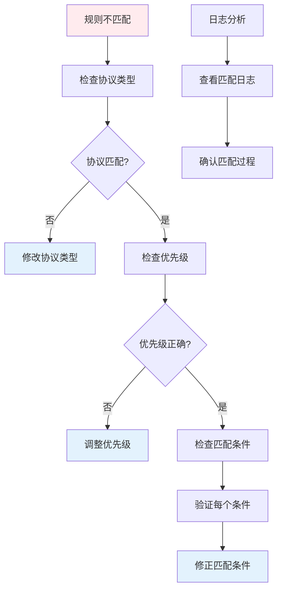

### 优先级设置错误

优先级设置错误是常见的问题：

1. **问题表现**：高优先级规则被低优先级规则覆盖
2. **解决方案**：重新评估规则优先级，确保重要规则具有更高优先级
3. **最佳实践**：为不同类型的规则设置合理的优先级范围

### 正则表达式编译失败

正则表达式编译失败的处理：

1. **检查语法**：确保正则表达式语法正确
2. **缓存清理**：清除正则缓存后重试
3. **日志记录**：查看编译失败的日志信息

### IP白名单配置问题

IP白名单配置常见问题：

1. **格式错误**：确保IP地址或CIDR格式正确
2. **网络配置**：检查客户端的真实IP地址
3. **IPv4/IPv6**：注意IPv4和IPv6地址的区别

### 性能问题诊断

性能问题的诊断步骤：

1. **缓存统计**：检查正则表达式缓存命中率
2. **规则数量**：避免创建过多低优先级规则
3. **匹配条件**：简化复杂的匹配条件组合

**章节来源**
- [match_engine_test.go](file://internal/engine/match_engine_test.go#L264-L454)
- [match_engine.go](file://internal/engine/match_engine.go#L152-L175)

## 总结

规则匹配引擎作为GoMockServer的核心组件，提供了灵活、高效且可扩展的规则匹配能力。其主要优势包括：

### 技术特点
- **优先级驱动**：确保高优先级规则优先匹配
- **多条件支持**：支持HTTP方法、路径、查询参数、请求头、IP白名单等多种匹配条件
- **性能优化**：内置正则表达式缓存机制，提升匹配性能
- **扩展性强**：预留了正则匹配和脚本匹配的扩展点

### 应用价值
- **灵活配置**：支持复杂的规则配置需求
- **易于维护**：清晰的优先级机制避免规则冲突
- **高性能**：缓存机制和优化算法确保良好的性能表现
- **可监控**：提供详细的缓存统计和匹配日志

### 发展方向
- **正则匹配完善**：进一步优化正则表达式的匹配性能
- **脚本匹配实现**：支持基于脚本的复杂匹配逻辑
- **智能推荐**：提供规则优先级和配置的最佳实践建议
- **可视化管理**：开发图形化的规则管理界面

规则匹配引擎的设计充分体现了现代软件架构的设计原则，通过模块化设计、性能优化和扩展性考虑，为Mock服务器提供了稳定可靠的核心匹配能力。