# 项目与环境管理

<cite>
**本文档中引用的文件**
- [models.go](file://internal/models/models.go)
- [project_repository.go](file://internal/repository/project_repository.go)
- [project_handler.go](file://internal/api/project_handler.go)
- [database.go](file://internal/repository/database.go)
- [project_repository_extended_test.go](file://internal/repository/project_repository_extended_test.go)
- [environment_repository_extended_test.go](file://internal/repository/environment_repository_extended_test.go)
- [project_handler_test.go](file://internal/api/project_handler_test.go)
- [admin_service.go](file://internal/service/admin_service.go)
</cite>

## 目录
1. [简介](#简介)
2. [项目结构概览](#项目结构概览)
3. [核心数据模型](#核心数据模型)
4. [数据访问层设计](#数据访问层设计)
5. [RESTful API架构](#restful-api架构)
6. [项目与环境的层级关系](#项目与环境的层级关系)
7. [CRUD操作详解](#crud操作详解)
8. [使用示例](#使用示例)
9. [性能考虑](#性能考虑)
10. [常见问题与解决方案](#常见问题与解决方案)
11. [总结](#总结)

## 简介

MockServer项目提供了一套完整的项目与环境管理功能，作为组织Mock规则的基础单元。该系统采用分层架构设计，通过清晰的数据模型定义和RESTful API接口，实现了对项目和环境的全生命周期管理。

项目与环境的层级关系构成了Mock规则的组织框架：
- **项目**：代表一个独立的业务模块或应用，具有唯一的工作空间标识
- **环境**：项目内的运行环境（如开发、测试、预发布、生产），每个环境可以配置不同的基础URL和变量
- **规则**：在特定环境中生效的Mock响应规则

## 项目结构概览

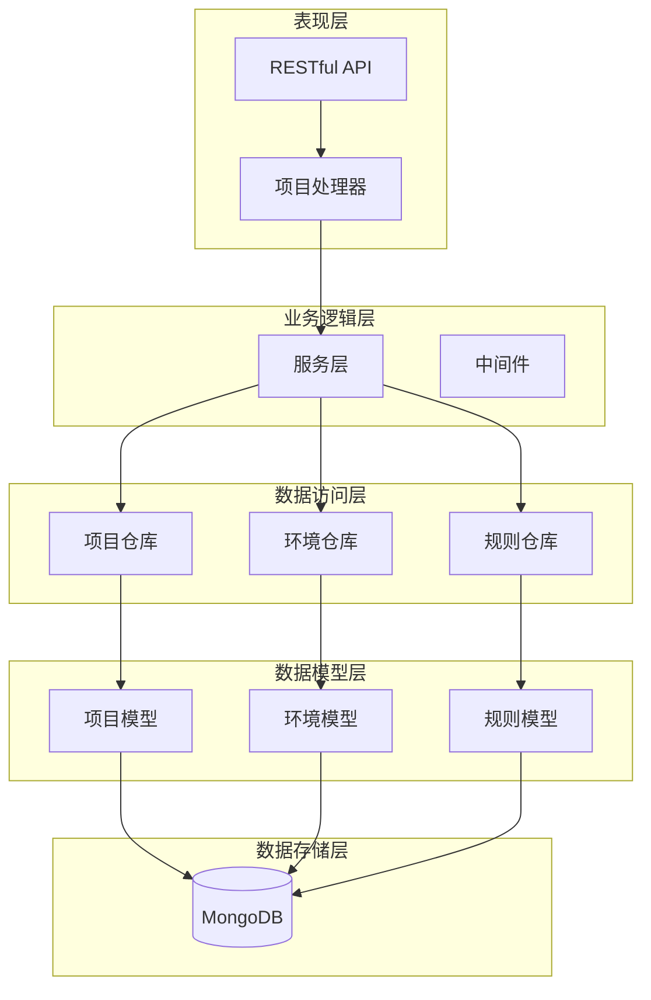

**图表来源**
- [project_handler.go](file://internal/api/project_handler.go#L14-L25)
- [project_repository.go](file://internal/repository/project_repository.go#L14-L265)
- [database.go](file://internal/repository/database.go#L14-L187)

## 核心数据模型

### 项目模型（Project）

项目模型定义了MockServer中项目的基本结构和属性：

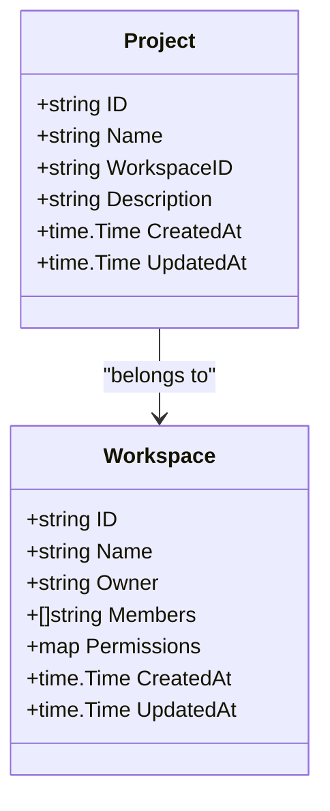

**图表来源**
- [models.go](file://internal/models/models.go#L104-L112)

**关键字段说明：**

| 字段 | 类型 | 描述 | 必填 |
|------|------|------|------|
| ID | string | 项目唯一标识符，MongoDB ObjectId格式 | 是 |
| Name | string | 项目名称，用于用户识别 | 是 |
| WorkspaceID | string | 所属工作空间ID，建立项目与工作空间的关联 | 是 |
| Description | string | 项目描述信息 | 否 |
| CreatedAt | time.Time | 项目创建时间 | 自动设置 |
| UpdatedAt | time.Time | 最后更新时间 | 自动设置 |

### 环境模型（Environment）

环境模型表示项目内的运行环境配置：

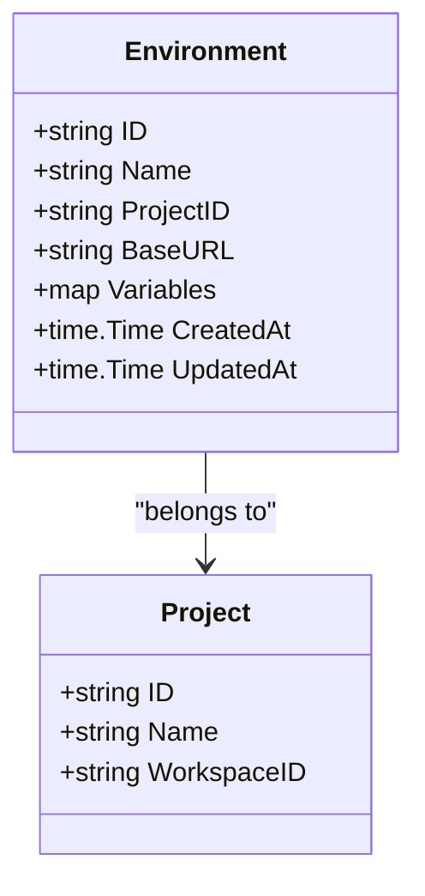

**图表来源**
- [models.go](file://internal/models/models.go#L114-L122)

**关键字段说明：**

| 字段 | 类型 | 描述 | 必填 |
|------|------|------|------|
| ID | string | 环境唯一标识符，MongoDB ObjectId格式 | 是 |
| Name | string | 环境名称（如开发、测试、生产） | 是 |
| ProjectID | string | 所属项目ID，建立环境与项目的关联 | 是 |
| BaseURL | string | 环境的基础URL地址 | 否 |
| Variables | map | 环境变量映射，支持嵌套结构 | 否 |
| CreatedAt | time.Time | 环境创建时间 | 自动设置 |
| UpdatedAt | time.Time | 最后更新时间 | 自动设置 |

**章节来源**
- [models.go](file://internal/models/models.go#L104-L122)

## 数据访问层设计

### 项目仓库接口（ProjectRepository）

项目仓库提供了项目数据的持久化操作接口：

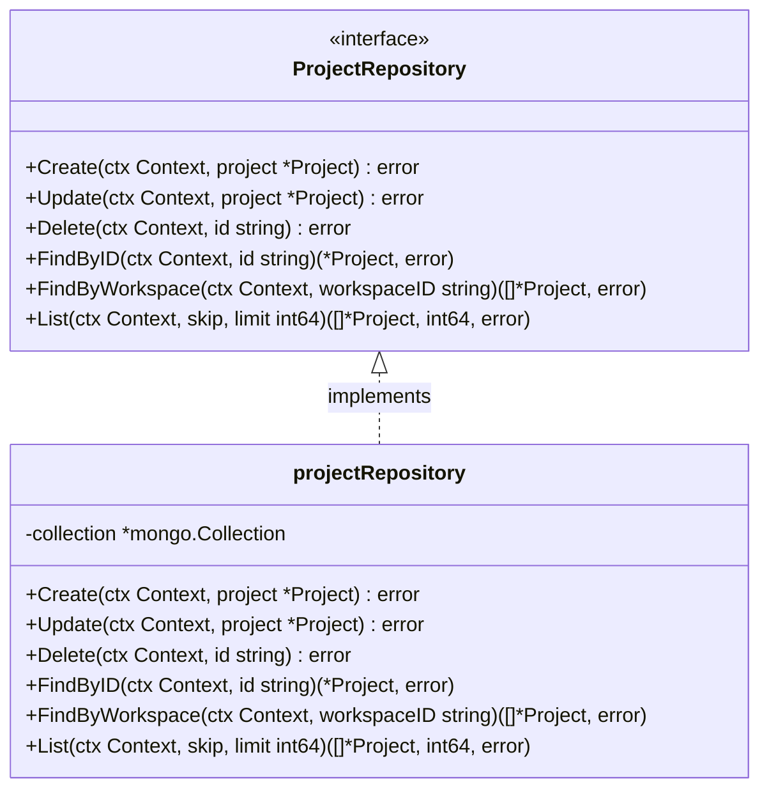

**图表来源**
- [project_repository.go](file://internal/repository/project_repository.go#L14-L22)
- [project_repository.go](file://internal/repository/project_repository.go#L24-L33)

### 环境仓库接口（EnvironmentRepository）

环境仓库负责环境数据的管理：

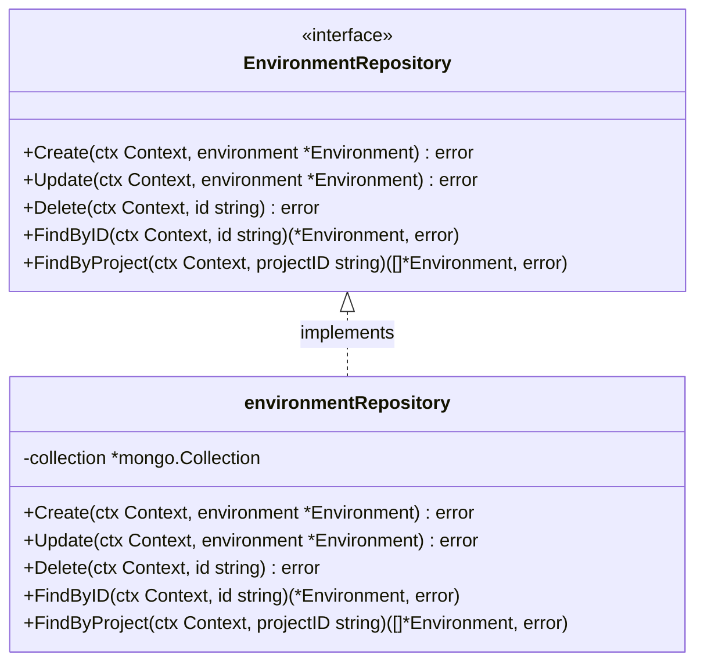

**图表来源**
- [project_repository.go](file://internal/repository/project_repository.go#L155-L162)
- [project_repository.go](file://internal/repository/project_repository.go#L164-L173)

### 数据库连接管理

系统通过统一的数据库连接管理器处理MongoDB连接：

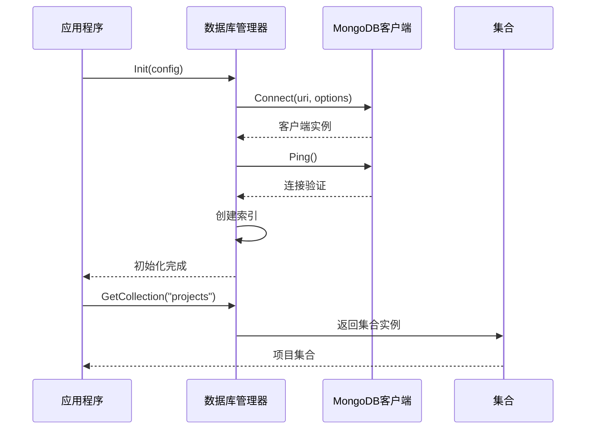

**图表来源**
- [database.go](file://internal/repository/database.go#L19-L51)
- [database.go](file://internal/repository/database.go#L174-L176)

**章节来源**
- [project_repository.go](file://internal/repository/project_repository.go#L14-L265)
- [database.go](file://internal/repository/database.go#L14-L187)

## RESTful API架构

### API路由设计

系统采用RESTful风格的API设计，遵循资源导向的URL结构：

```mermaid
graph TD
Root["/api/v1"] --> Projects["/projects"]
Projects --> ProjList["GET /"] [列出项目]
Projects --> ProjCreate["POST /"] [创建项目]
Projects --> ProjDetail["GET /:id"] [获取项目详情]
Projects --> ProjUpdate["PUT /:id"] [更新项目]
Projects --> ProjDelete["DELETE /:id"] [删除项目]
Projects --> Envs["/:id/environments"]
Envs --> EnvList["GET /"] [列出环境]
Envs --> EnvCreate["POST /"] [创建环境]
Envs --> EnvDetail["GET /:env_id"] [获取环境详情]
Envs --> EnvUpdate["PUT /:env_id"] [更新环境]
Envs --> EnvDelete["DELETE /:env_id"] [删除环境]
```

**图表来源**
- [admin_service.go](file://internal/service/admin_service.go#L63-L81)

### 项目处理器（ProjectHandler）

项目处理器封装了所有项目相关的API逻辑：

```mermaid
classDiagram
class ProjectHandler {
-projectRepo ProjectRepository
-environmentRepo EnvironmentRepository
+CreateProject(c *gin.Context)
+ListProjects(c *gin.Context)
+GetProject(c *gin.Context)
+UpdateProject(c *gin.Context)
+DeleteProject(c *gin.Context)
+CreateEnvironment(c *gin.Context)
+GetEnvironment(c *gin.Context)
+ListEnvironments(c *gin.Context)
+UpdateEnvironment(c *gin.Context)
+DeleteEnvironment(c *gin.Context)
}
class GinContext {
+Param(key string) string
+ShouldBindJSON(obj interface{}) error
+JSON(code int, obj interface{})
}
ProjectHandler --> GinContext : uses
```

**图表来源**
- [project_handler.go](file://internal/api/project_handler.go#L14-L25)

**章节来源**
- [project_handler.go](file://internal/api/project_handler.go#L14-L212)
- [admin_service.go](file://internal/service/admin_service.go#L48-L81)

## 项目与环境的层级关系

### 层级结构图

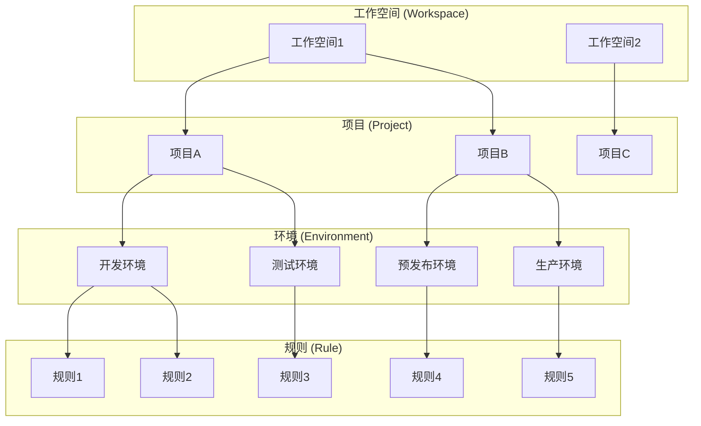

### 关联关系说明

1. **工作空间到项目**：一个工作空间可以包含多个项目
2. **项目到环境**：一个项目可以包含多个环境
3. **环境到规则**：一个环境可以包含多个Mock规则

这种层级关系确保了：
- 不同项目的规则相互隔离
- 同一项目内的环境配置独立
- 规则在指定环境中生效

## CRUD操作详解

### 项目CRUD操作

#### 创建项目（Create）

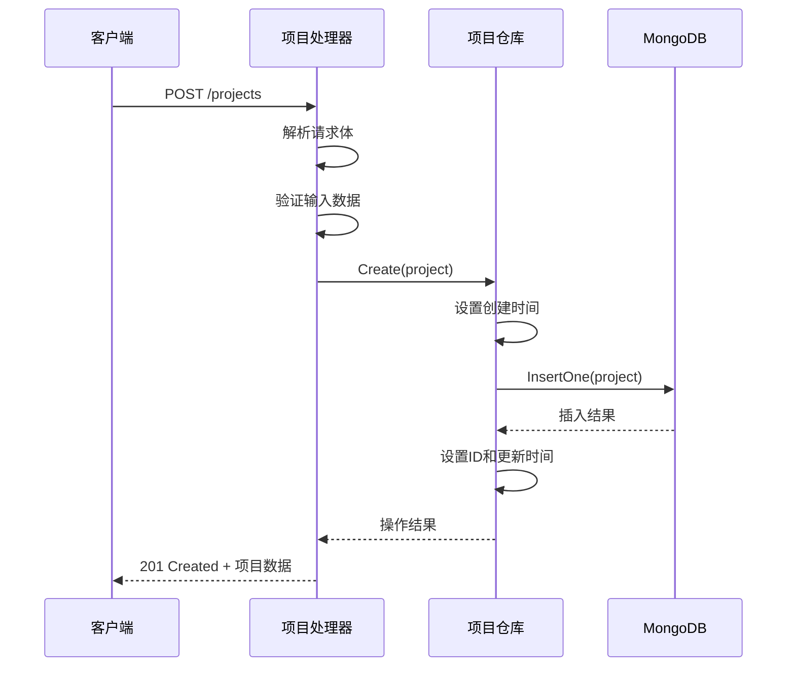

**图表来源**
- [project_handler.go](file://internal/api/project_handler.go#L28-L41)
- [project_repository.go](file://internal/repository/project_repository.go#L36-L49)

#### 查询项目（Read）

系统提供了多种查询方式：

| 方法 | 功能 | 参数 | 返回值 |
|------|------|------|--------|
| FindByID | 根据ID查询单个项目 | id: string | *Project, error |
| FindByWorkspace | 查询工作空间下的所有项目 | workspaceID: string | []*Project, error |
| List | 分页查询项目列表 | skip, limit: int64 | []*Project, int64, error |

#### 更新项目（Update）

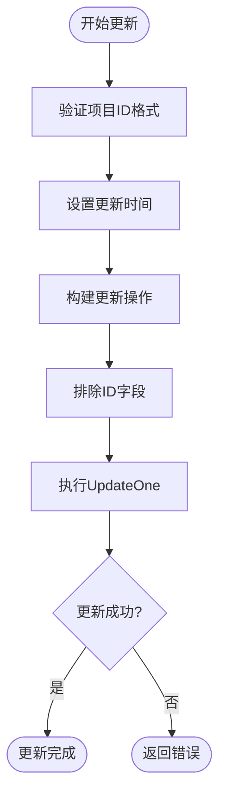

**图表来源**
- [project_repository.go](file://internal/repository/project_repository.go#L53-L71)

#### 删除项目（Delete）

删除项目时需要考虑以下约束：
- 删除项目会级联删除该项目下的所有环境
- 删除环境会级联删除这些环境下的所有规则
- 系统会检查是否存在依赖关系

### 环境CRUD操作

#### 创建环境

环境创建过程包含特殊的项目ID注入逻辑：

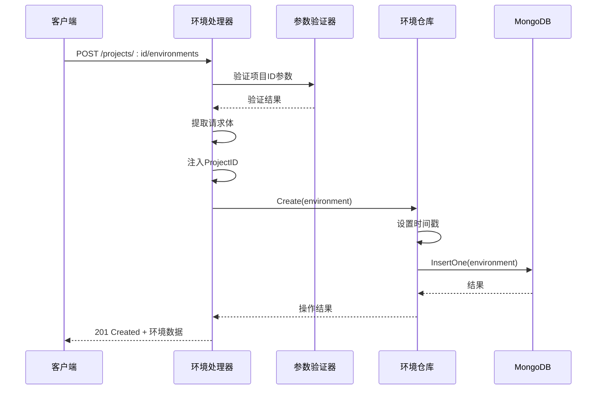

**图表来源**
- [project_handler.go](file://internal/api/project_handler.go#L110-L137)

#### 查询环境

环境查询支持两种方式：
- **FindByID**：根据环境ID查询单个环境
- **FindByProject**：查询项目下的所有环境

#### 更新和删除环境

环境的更新和删除操作与项目类似，但更加严格：
- 环境ID必须有效且存在
- 更新操作不会影响其他环境
- 删除操作会清理相关规则数据

**章节来源**
- [project_repository.go](file://internal/repository/project_repository.go#L36-L264)
- [project_handler.go](file://internal/api/project_handler.go#L28-L211)

## 使用示例

### 创建项目并添加环境

以下是通过API创建项目并为其添加环境的完整流程：

#### 1. 创建项目

```bash
# 请求示例
curl -X POST "http://localhost:8080/api/v1/projects" \
  -H "Content-Type: application/json" \
  -d '{
    "name": "用户管理系统",
    "workspace_id": "ws-001",
    "description": "管理用户注册、登录等功能的Mock服务"
  }'
```

**响应示例：**
```json
{
  "id": "65a1b2c3d4e5f6g7h8i9j0k1",
  "name": "用户管理系统",
  "workspace_id": "ws-001",
  "description": "管理用户注册、登录等功能的Mock服务",
  "created_at": "2024-01-01T10:00:00Z",
  "updated_at": "2024-01-01T10:00:00Z"
}
```

#### 2. 为项目创建开发环境

```bash
# 请求示例
curl -X POST "http://localhost:8080/api/v1/projects/65a1b2c3d4e5f6g7h8i9j0k1/environments" \
  -H "Content-Type: application/json" \
  -d '{
    "name": "开发环境",
    "base_url": "http://localhost:3000",
    "variables": {
      "api_version": "v1",
      "timeout": 5000,
      "debug_mode": true
    }
  }'
```

**响应示例：**
```json
{
  "id": "65a1b2c3d4e5f6g7h8i9j0k2",
  "name": "开发环境",
  "project_id": "65a1b2c3d4e5f6g7h8i9j0k1",
  "base_url": "http://localhost:3000",
  "variables": {
    "api_version": "v1",
    "timeout": 5000,
    "debug_mode": true
  },
  "created_at": "2024-01-01T10:05:00Z",
  "updated_at": "2024-01-01T10:05:00Z"
}
```

#### 3. 创建测试环境

```bash
# 请求示例
curl -X POST "http://localhost:8080/api/v1/projects/65a1b2c3d4e5f6g7h8i9j0k1/environments" \
  -H "Content-Type: application/json" \
  -d '{
    "name": "测试环境",
    "base_url": "https://test.api.example.com",
    "variables": {
      "api_version": "v1",
      "timeout": 10000,
      "ssl_verify": false
    }
  }'
```

#### 4. 列出项目的所有环境

```bash
# 请求示例
curl -X GET "http://localhost:8080/api/v1/projects/65a1b2c3d4e5f6g7h8i9j0k1/environments"
```

**响应示例：**
```json
{
  "data": [
    {
      "id": "65a1b2c3d4e5f6g7h8i9j0k2",
      "name": "开发环境",
      "project_id": "65a1b2c3d4e5f6g7h8i9j0k1",
      "base_url": "http://localhost:3000",
      "variables": {
        "api_version": "v1",
        "timeout": 5000,
        "debug_mode": true
      },
      "created_at": "2024-01-01T10:05:00Z",
      "updated_at": "2024-01-01T10:05:00Z"
    },
    {
      "id": "65a1b2c3d4e5f6g7h8i9j0k3",
      "name": "测试环境",
      "project_id": "65a1b2c3d4e5f6g7h8i9j0k1",
      "base_url": "https://test.api.example.com",
      "variables": {
        "api_version": "v1",
        "timeout": 10000,
        "ssl_verify": false
      },
      "created_at": "2024-01-01T10:10:00Z",
      "updated_at": "2024-01-01T10:10:00Z"
    }
  ]
}
```

### 环境变量使用示例

环境变量可以在Mock规则中使用，例如：

```json
{
  "name": "用户登录",
  "project_id": "65a1b2c3d4e5f6g7h8i9j0k1",
  "environment_id": "65a1b2c3d4e5f6g7h8i9j0k2",
  "protocol": "HTTP",
  "match_type": "Simple",
  "priority": 1,
  "enabled": true,
  "match_condition": {
    "method": "POST",
    "path": "{{base_url}}/api/{{api_version}}/login"
  },
  "response": {
    "type": "Static",
    "content": {
      "status": "success",
      "data": {
        "user_id": "user-12345",
        "token": "eyJhbGciOiJIUzI1NiIsInR5cCI6IkpXVCJ9..."
      }
    }
  }
}
```

在这个例子中，`{{base_url}}`和`{{api_version}}`会被环境变量替换。

## 性能考虑

### 分页查询优化

对于管理大量项目的情况，系统提供了分页查询功能：

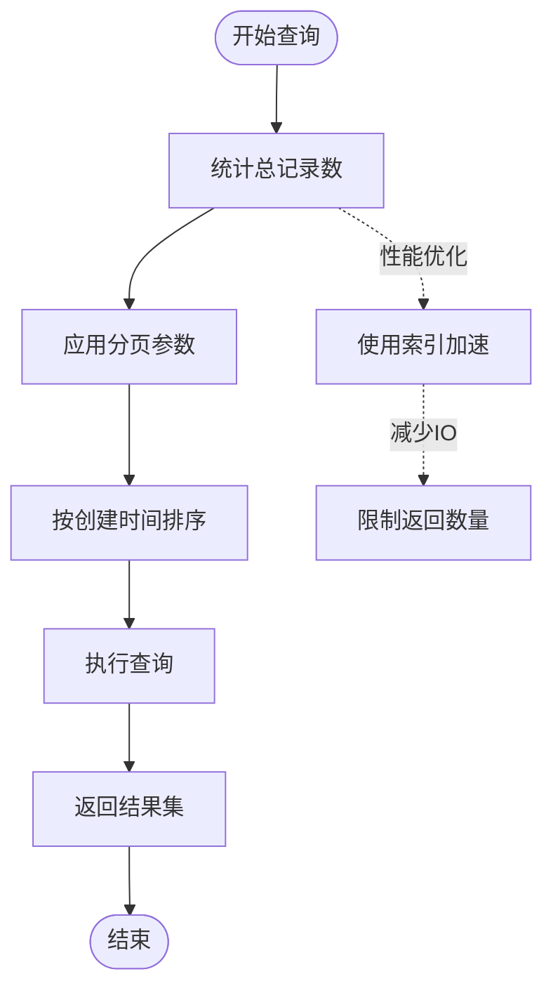

**图表来源**
- [project_repository.go](file://internal/repository/project_repository.go#L126-L152)

### 索引策略

系统为各个集合建立了专门的索引：

| 集合 | 索引字段 | 用途 |
|------|----------|------|
| projects | workspace_id | 加速按工作空间查询 |
| environments | project_id | 加速按项目查询 |
| rules | project_id, environment_id | 加速规则查询 |
| rules | protocol | 支持协议过滤 |
| rules | enabled | 支持启用状态过滤 |
| logs | request_id | 支持请求追踪 |
| logs | timestamp | 支持时间范围查询 |

### 并发控制

系统支持高并发操作：
- 项目仓库支持并发创建
- 环境仓库支持并发查询
- 数据库连接池管理
- 事务一致性保证

**章节来源**
- [project_repository.go](file://internal/repository/project_repository.go#L126-L152)
- [database.go](file://internal/repository/database.go#L53-L166)

## 常见问题与解决方案

### 删除被引用的项目/环境

**问题描述：**
当尝试删除一个包含子资源（环境或规则）的项目时，可能会遇到依赖关系问题。

**解决方案：**
系统采用级联删除策略：
1. 删除项目时自动删除其所有环境
2. 删除环境时自动删除其所有规则
3. 删除规则时清理相关日志和版本记录

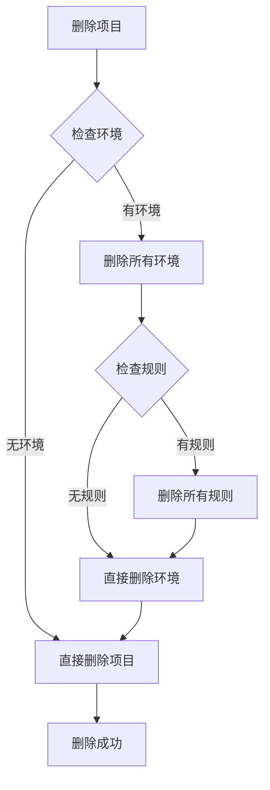

### 数据一致性保证

**问题描述：**
在高并发环境下可能出现数据不一致的问题。

**解决方案：**
1. **原子操作**：使用MongoDB的原子操作保证数据完整性
2. **时间戳管理**：自动维护创建和更新时间戳
3. **验证机制**：严格的输入验证和格式检查
4. **错误处理**：完善的错误捕获和恢复机制

### 环境变量冲突

**问题描述：**
不同环境可能使用相同的变量名，导致混淆。

**解决方案：**
1. **命名规范**：建议使用前缀区分环境变量
2. **作用域隔离**：每个环境的变量完全独立
3. **模板语法**：使用`{{variable_name}}`语法明确变量来源

### 大量数据查询性能

**问题描述：**
当项目或环境数量庞大时，查询性能可能下降。

**解决方案：**
1. **分页查询**：默认限制返回数量，支持分页
2. **索引优化**：为常用查询字段建立索引
3. **缓存策略**：对频繁查询的结果进行缓存
4. **异步处理**：大数据量操作采用异步处理

### 错误处理最佳实践

| 错误类型 | HTTP状态码 | 处理方式 |
|----------|------------|----------|
| 无效JSON | 400 | 返回具体解析错误信息 |
| 项目不存在 | 404 | 明确指出资源未找到 |
| 数据库错误 | 500 | 记录详细错误日志 |
| 权限不足 | 403 | 返回权限相关信息 |
| 参数缺失 | 400 | 列出必需的参数 |

**章节来源**
- [project_repository.go](file://internal/repository/project_repository.go#L75-L84)
- [project_handler.go](file://internal/api/project_handler.go#L28-L211)

## 总结

MockServer的项目与环境管理功能提供了一个完整、可靠的基础设施，用于组织和管理Mock规则。该系统的主要优势包括：

### 架构优势
- **分层设计**：清晰的职责分离，便于维护和扩展
- **接口抽象**：通过接口定义规范，支持多种存储后端
- **RESTful API**：符合现代Web标准，易于集成

### 功能特性
- **完整的CRUD操作**：支持项目和环境的全生命周期管理
- **层级关系**：清晰的项目-环境-规则三层结构
- **灵活的配置**：支持丰富的环境变量和配置选项
- **性能优化**：分页查询、索引优化、并发控制

### 可扩展性
- **模块化设计**：各组件相对独立，便于单独升级
- **插件机制**：支持自定义验证和处理逻辑
- **监控集成**：内置日志记录和错误追踪

### 最佳实践建议
1. **合理规划项目结构**：按业务模块划分项目
2. **规范环境命名**：使用统一的环境命名约定
3. **定期清理数据**：删除不再使用的项目和环境
4. **备份重要配置**：定期导出项目和环境配置
5. **监控系统性能**：关注查询性能和资源使用情况

这套项目与环境管理功能为MockServer提供了坚实的基础，支持复杂的Mock场景管理和团队协作需求。通过合理的使用和维护，可以显著提高Mock服务的效率和可靠性。