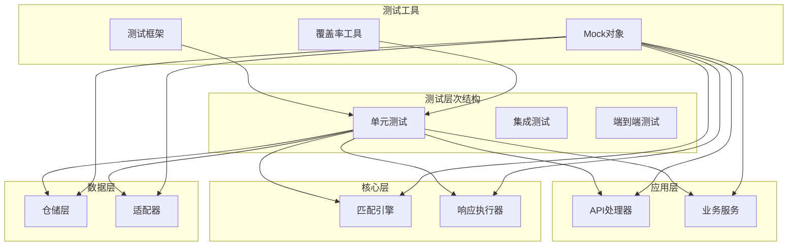
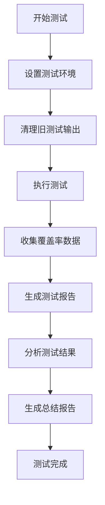
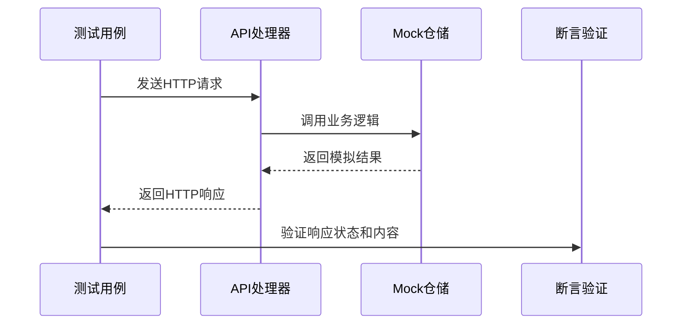
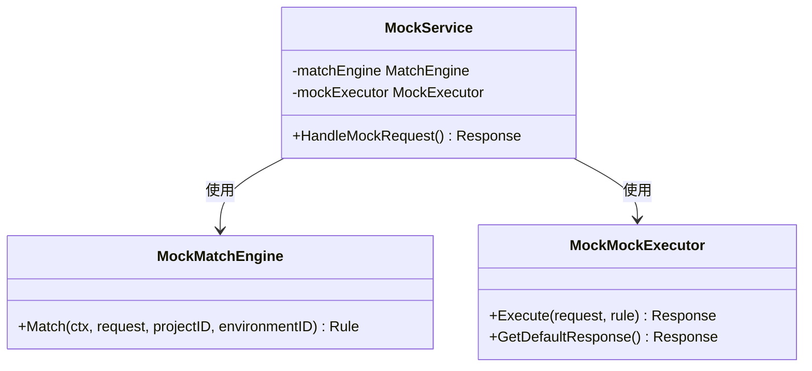
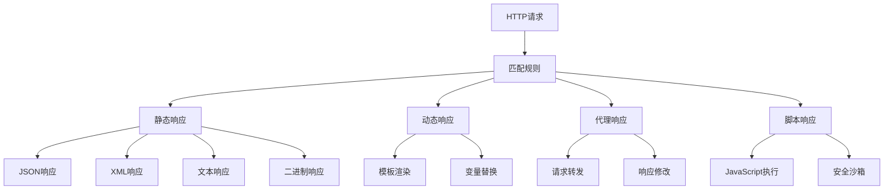
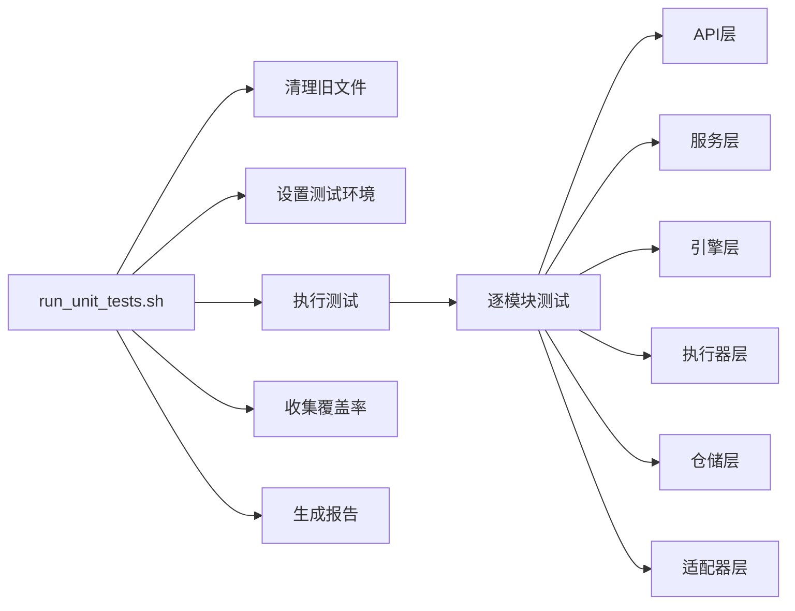
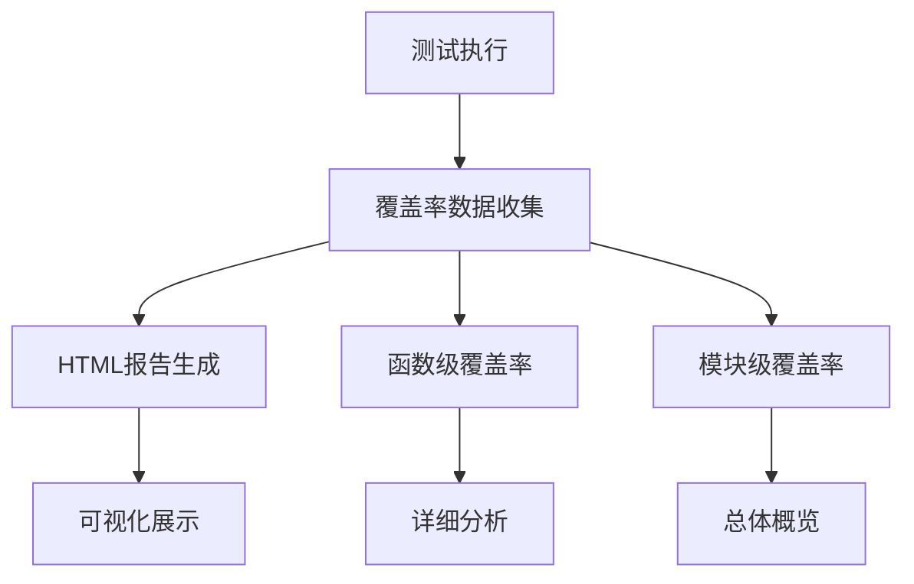
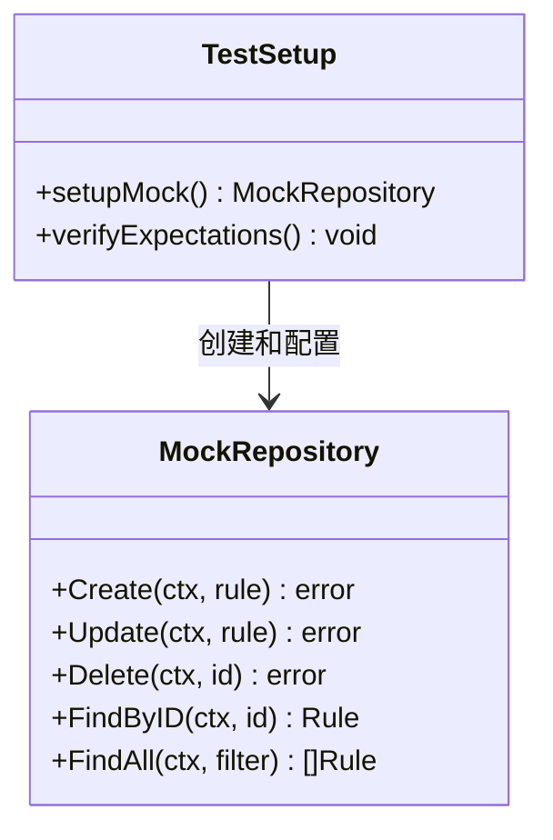

# 单元测试

<cite>
**本文档中引用的文件**
- [internal/api/project_handler_test.go](file://internal/api/project_handler_test.go)
- [internal/api/rule_handler_test.go](file://internal/api/rule_handler_test.go)
- [internal/service/admin_service_test.go](file://internal/service/admin_service_test.go)
- [internal/service/mock_service_test.go](file://internal/service/mock_service_test.go)
- [internal/repository/repository_test.go](file://internal/repository/repository_test.go)
- [internal/engine/match_engine_test.go](file://internal/engine/match_engine_test.go)
- [internal/executor/mock_executor_test.go](file://internal/executor/mock_executor_test.go)
- [scripts/run_unit_tests.sh](file://scripts/run_unit_tests.sh)
- [go.mod](file://go.mod)
- [README.md](file://README.md)
</cite>

## 目录
1. [概述](#概述)
2. [测试架构](#测试架构)
3. [测试框架与工具](#测试框架与工具)
4. [各层测试实现](#各层测试实现)
5. [测试执行策略](#测试执行策略)
6. [测试覆盖率管理](#测试覆盖率管理)
7. [测试最佳实践](#测试最佳实践)
8. [故障排除指南](#故障排除指南)
9. [总结](#总结)

## 概述

gomockserver采用分层架构设计，单元测试覆盖了整个应用的各个层次，包括API层、服务层、引擎层、执行器层、仓储层和适配器层。测试策略遵循TDD原则，确保每个组件都能独立测试和验证。

### 核心测试理念

- **分层测试**：每层都有对应的测试套件，确保层间接口的正确性
- **依赖隔离**：使用mock对象隔离外部依赖
- **全面覆盖**：涵盖正常流程、边界条件和异常情况
- **自动化执行**：通过脚本自动化测试执行和报告生成

## 测试架构

**图表来源**
- [internal/api/project_handler_test.go](file://internal/api/project_handler_test.go#L1-L50)
- [internal/service/admin_service_test.go](file://internal/service/admin_service_test.go#L1-L50)
- [internal/engine/match_engine_test.go](file://internal/engine/match_engine_test.go#L1-L50)

## 测试框架与工具

### 核心测试库

gomockserver使用以下测试工具和框架：

| 组件 | 版本 | 用途 |
|------|------|------|
| testify/assert | v1.11.1 | 断言库，提供丰富的断言方法 |
| testify/mock | v1.11.1 | Mock对象框架 |
| httptest | 内置 | HTTP请求测试 |
| go test | 内置 | Go标准测试框架 |

### 测试配置

**章节来源**
- [go.mod](file://go.mod#L15-L16)
- [scripts/run_unit_tests.sh](file://scripts/run_unit_tests.sh#L1-L50)

## 各层测试实现

### API层测试

API层测试主要验证HTTP处理器的功能和错误处理。

#### 测试特点

- **HTTP请求模拟**：使用`httptest`模拟HTTP请求
- **参数验证**：测试各种输入参数的有效性
- **错误处理**：验证错误响应和状态码
- **路由测试**：确保路由配置正确

#### 关键测试模式

**图表来源**
- [internal/api/project_handler_test.go](file://internal/api/project_handler_test.go#L97-L160)
- [internal/api/rule_handler_test.go](file://internal/api/rule_handler_test.go#L78-L140)

**章节来源**
- [internal/api/project_handler_test.go](file://internal/api/project_handler_test.go#L1-L637)
- [internal/api/rule_handler_test.go](file://internal/api/rule_handler_test.go#L1-L628)

### 服务层测试

服务层测试验证业务逻辑和服务协调功能。

#### Mock服务测试

服务层测试使用Mock对象隔离外部依赖：

**图表来源**
- [internal/service/mock_service_test.go](file://internal/service/mock_service_test.go#L17-L46)

**章节来源**
- [internal/service/admin_service_test.go](file://internal/service/admin_service_test.go#L1-L247)
- [internal/service/mock_service_test.go](file://internal/service/mock_service_test.go#L1-L381)

### 引擎层测试

引擎层测试专注于匹配算法和规则处理逻辑。

#### 匹配引擎测试重点

- **规则匹配**：测试不同匹配类型的匹配逻辑
- **优先级处理**：验证规则优先级的正确应用
- **IP白名单**：测试IP访问控制功能
- **复杂条件**：验证多条件组合匹配

**章节来源**
- [internal/engine/match_engine_test.go](file://internal/engine/match_engine_test.go#L1-L757)

### 执行器层测试

执行器层测试验证响应生成和处理逻辑。

#### 响应类型测试

**图表来源**
- [internal/executor/mock_executor_test.go](file://internal/executor/mock_executor_test.go#L98-L200)

**章节来源**
- [internal/executor/mock_executor_test.go](file://internal/executor/mock_executor_test.go#L1-L800)

### 仓储层测试

仓储层测试验证数据访问和持久化功能。

#### 数据模型测试

仓储层包含大量数据模型验证测试：

| 测试类别 | 测试内容 | 验证要点 |
|----------|----------|----------|
| 模型验证 | 字段完整性 | 必填字段检查 |
| 时间戳 | 自动设置 | CreatedAt/UpdatedAt |
| 过滤条件 | 查询构建 | 条件组合 |
| 分页参数 | 参数计算 | Skip/Limit计算 |
| 协议类型 | 常量验证 | 协议枚举值 |
| 响应类型 | 响应配置 | 响应类型枚举 |

**章节来源**
- [internal/repository/repository_test.go](file://internal/repository/repository_test.go#L1-L570)

## 测试执行策略

### 自动化测试脚本

gomockserver提供了完整的测试自动化脚本：

**图表来源**
- [scripts/run_unit_tests.sh](file://scripts/run_unit_tests.sh#L1-L100)

### 测试执行流程

1. **环境准备**：设置测试目录和清理旧文件
2. **并行执行**：各模块并行执行测试
3. **覆盖率收集**：收集各模块覆盖率数据
4. **报告生成**：生成HTML和文本报告
5. **结果分析**：分析测试结果和覆盖率

**章节来源**
- [scripts/run_unit_tests.sh](file://scripts/run_unit_tests.sh#L1-L297)

## 测试覆盖率管理

### 覆盖率报告生成

gomockserver使用Go的内置覆盖率工具生成详细的覆盖率报告：

**图表来源**
- [scripts/run_unit_tests.sh](file://scripts/run_unit_tests.sh#L130-L142)

### 覆盖率指标

| 指标类型 | 描述 | 目标值 |
|----------|------|--------|
| 总体覆盖率 | 整体代码覆盖率 | > 80% |
| 模块覆盖率 | 各模块覆盖率 | > 75% |
| 函数覆盖率 | 函数级覆盖率 | > 90% |
| 行覆盖率 | 代码行覆盖率 | > 85% |

**章节来源**
- [scripts/run_unit_tests.sh](file://scripts/run_unit_tests.sh#L146-L297)

## 测试最佳实践

### 测试用例设计原则

1. **单一职责**：每个测试用例只验证一个功能点
2. **独立性**：测试用例之间相互独立，不依赖执行顺序
3. **可重复性**：测试结果应该一致可重复
4. **清晰命名**：测试用例名称要清晰描述测试目的

### Mock对象使用规范

**图表来源**
- [internal/api/project_handler_test.go](file://internal/api/project_handler_test.go#L17-L96)

### 测试数据准备

测试数据准备遵循以下模式：

1. **测试参数化**：使用表格驱动测试
2. **边界值测试**：覆盖边界条件
3. **异常场景**：测试各种异常情况
4. **状态验证**：验证Mock对象的预期调用

### 断言方法

常用的断言方法：

| 断言类型 | 使用场景 | 示例 |
|----------|----------|------|
| Equal | 值相等比较 | assert.Equal(t, expected, actual) |
| NotEqual | 值不相等 | assert.NotEqual(t, expected, actual) |
| True/False | 布尔值验证 | assert.True(t, condition) |
| Error | 错误验证 | assert.Error(t, err) |
| Contains | 内容包含 | assert.Contains(t, string, substring) |

**章节来源**
- [internal/api/project_handler_test.go](file://internal/api/project_handler_test.go#L97-L160)
- [internal/service/mock_service_test.go](file://internal/service/mock_service_test.go#L60-L100)

## 故障排除指南

### 常见测试问题

1. **Mock调用验证失败**
   - 检查Mock对象的预期调用配置
   - 确认测试用例中的MockSetup正确设置

2. **测试超时**
   - 检查是否有死循环或阻塞操作
   - 验证异步操作的正确处理

3. **覆盖率不足**
   - 添加边界条件测试用例
   - 检查未测试的代码路径

### 调试技巧

1. **使用Verbose模式**：`go test -v`查看详细输出
2. **Race检测**：`go test -race`检测竞态条件
3. **覆盖率分析**：使用`go tool cover`分析具体代码行

**章节来源**
- [scripts/run_unit_tests.sh](file://scripts/run_unit_tests.sh#L285-L297)

## 总结

gomockserver的单元测试策略体现了现代Go应用程序测试的最佳实践：

### 核心优势

1. **全面覆盖**：覆盖了应用的所有核心层次
2. **自动化程度高**：完整的自动化测试执行和报告生成
3. **质量保证**：严格的覆盖率要求和持续集成
4. **可维护性**：清晰的测试结构和良好的测试实践

### 测试质量指标

- **覆盖率目标**：总体覆盖率 > 80%
- **模块覆盖率**：各模块覆盖率 > 75%
- **测试数量**：每个核心功能都有对应的测试用例
- **测试质量**：高质量的测试用例，覆盖正常和异常场景

### 持续改进

gomockserver的测试体系是一个持续演进的过程，随着功能的增加和架构的优化，测试策略也在不断改进和完善。通过自动化测试和持续集成，确保代码质量和系统稳定性。