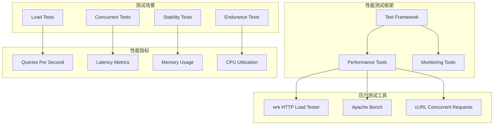
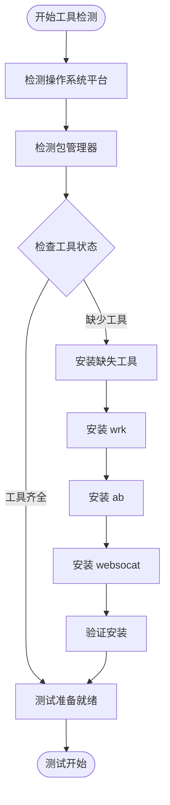
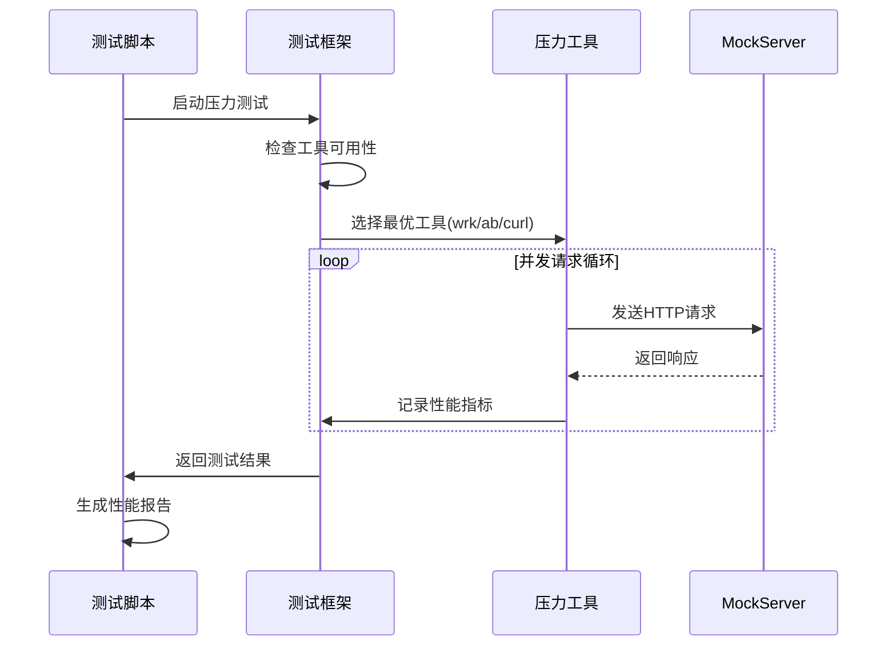
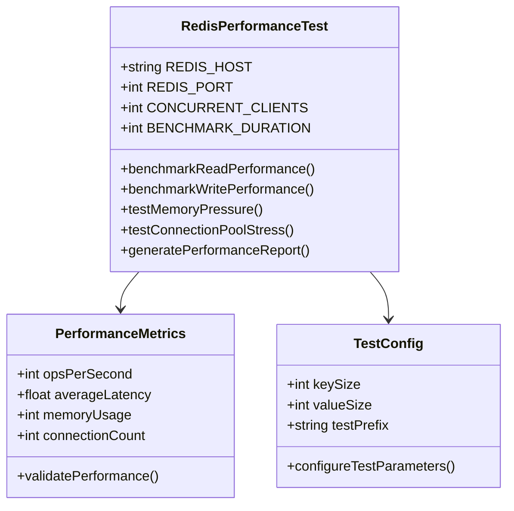
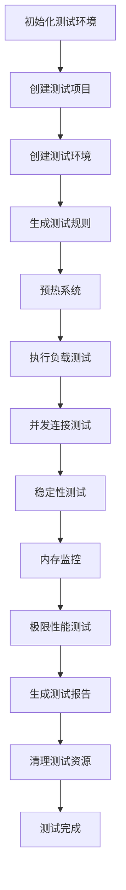
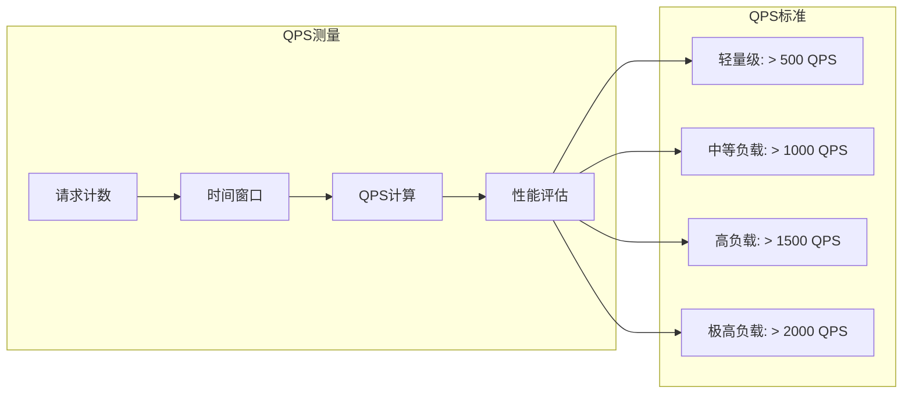
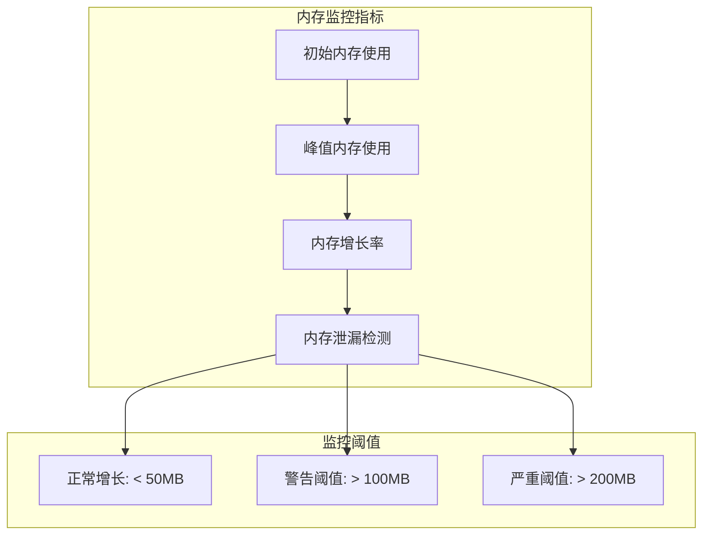
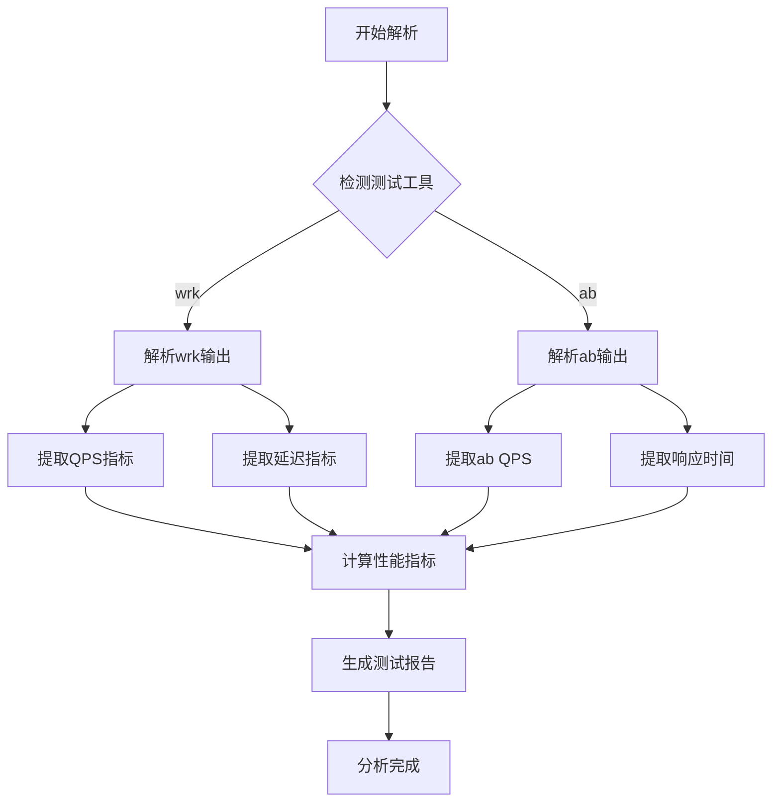
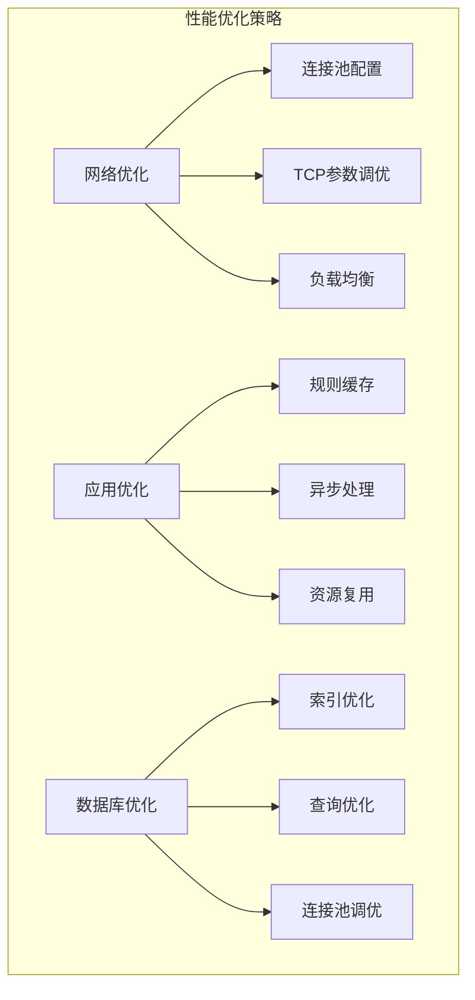

# 性能测试

<cite>
**本文档中引用的文件**
- [stress_e2e_test.sh](file://tests/integration/stress_e2e_test.sh)
- [test_framework.sh](file://tests/integration/lib/test_framework.sh)
- [redis_performance_test.sh](file://tests/redis/redis_performance_test.sh)
- [tool_installer.sh](file://tests/integration/lib/tool_installer.sh)
- [install_tools.sh](file://tests/integration/install_tools.sh)
- [README.md](file://README.md)
</cite>

## 目录
1. [简介](#简介)
2. [性能测试架构概述](#性能测试架构概述)
3. [压力测试工具配置](#压力测试工具配置)
4. [核心性能测试组件](#核心性能测试组件)
5. [性能测试执行流程](#性能测试执行流程)
6. [关键性能指标分析](#关键性能指标分析)
7. [性能测试结果分析](#性能测试结果分析)
8. [性能瓶颈识别与优化](#性能瓶颈识别与优化)
9. [最佳实践与建议](#最佳实践与建议)
10. [故障排除指南](#故障排除指南)

## 简介

gomockserver提供了全面的性能测试解决方案，支持多种压力测试工具和测试场景。该系统采用模块化的测试框架，能够模拟真实生产环境中的高并发请求，并提供详细的性能指标分析。

### 性能测试目标

- **高并发处理能力**：支持1000+并发连接和请求
- **低延迟响应**：平均响应时间<100ms，P95延迟<200ms
- **稳定性测试**：长时间负载测试和内存使用监控
- **扩展性验证**：极限性能测试和资源使用评估

## 性能测试架构概述



**图表来源**
- [test_framework.sh](file://tests/integration/lib/test_framework.sh#L514-L536)
- [stress_e2e_test.sh](file://tests/integration/stress_e2e_test.sh#L125-L208)

**章节来源**
- [test_framework.sh](file://tests/integration/lib/test_framework.sh#L1-L907)
- [stress_e2e_test.sh](file://tests/integration/stress_e2e_test.sh#L1-L550)

## 压力测试工具配置

### 工具安装与检测

gomockserver提供了自动化的工具安装和检测机制，支持多种平台和包管理器。



**图表来源**
- [tool_installer.sh](file://tests/integration/lib/tool_installer.sh#L38-L422)
- [install_tools.sh](file://tests/integration/install_tools.sh#L1-L274)

### 支持的测试工具

| 工具名称 | 用途 | 平台支持 | 安装方式 |
|---------|------|----------|----------|
| wrk | 高性能HTTP负载测试 | macOS/Linux | 包管理器/源码编译 |
| ab (Apache Bench) | 基础HTTP压力测试 | Linux/macOS | 包管理器 |
| curl | 并发HTTP请求测试 | 全平台 | 系统自带/包管理器 |
| websocat | WebSocket测试工具 | 全平台 | npm全局安装 |

**章节来源**
- [tool_installer.sh](file://tests/integration/lib/tool_installer.sh#L17-L29)
- [install_tools.sh](file://tests/integration/install_tools.sh#L37-L241)

## 核心性能测试组件

### 压力测试执行器

压力测试的核心执行逻辑，支持多种测试场景和工具选择。



**图表来源**
- [test_framework.sh](file://tests/integration/lib/test_framework.sh#L514-L536)
- [stress_e2e_test.sh](file://tests/integration/stress_e2e_test.sh#L125-L208)

### Redis性能测试组件

专门针对Redis缓存系统的性能测试套件，涵盖读写性能、内存压力和连接池测试。



**图表来源**
- [redis_performance_test.sh](file://tests/redis/redis_performance_test.sh#L1-L467)

**章节来源**
- [redis_performance_test.sh](file://tests/redis/redis_performance_test.sh#L1-L467)

## 性能测试执行流程

### 多级负载测试配置

系统提供标准化的多级负载测试配置，覆盖从轻量级到极高负载的各种场景。

| 测试级别 | 并发数 | 持续时间 | 测试目标 |
|---------|--------|----------|----------|
| 轻量级负载 | 10 | 10秒 | 基础功能验证 |
| 中等负载 | 50 | 20秒 | 正常业务场景 |
| 高负载 | 100 | 30秒 | 压力边界测试 |
| 极高负载 | 200 | 60秒 | 极限性能验证 |

### 测试执行步骤



**图表来源**
- [stress_e2e_test.sh](file://tests/integration/stress_e2e_test.sh#L301-L550)

**章节来源**
- [stress_e2e_test.sh](file://tests/integration/stress_e2e_test.sh#L301-L550)

## 关键性能指标分析

### QPS（每秒查询数）

QPS是衡量系统处理能力的核心指标，反映了系统的吞吐量。



### 延迟指标分析

系统提供多层次的延迟指标，用于全面评估响应性能。

| 延迟类型 | 目标值 | 测量方法 | 优化重点 |
|---------|--------|----------|----------|
| 平均响应时间 | < 100ms | wrk --latency | 网络优化、缓存策略 |
| P95延迟 | < 200ms | 分位数统计 | 瓶颈识别、资源分配 |
| P99延迟 | < 500ms | 极端情况分析 | 异常处理、资源限制 |

### 内存使用监控



**章节来源**
- [stress_e2e_test.sh](file://tests/integration/stress_e2e_test.sh#L125-L208)
- [test_framework.sh](file://tests/integration/lib/test_framework.sh#L514-L536)

## 性能测试结果分析

### 自动化结果解析

系统能够自动解析压力测试工具的输出，提取关键性能指标。



**图表来源**
- [stress_e2e_test.sh](file://tests/integration/stress_e2e_test.sh#L153-L168)

### 性能报告生成

每个测试完成后都会自动生成详细的性能报告，包含测试配置、结果分析和优化建议。

**章节来源**
- [stress_e2e_test.sh](file://tests/integration/stress_e2e_test.sh#L462-L550)

## 性能瓶颈识别与优化

### 常见性能瓶颈

1. **网络层面瓶颈**
   - 连接数限制
   - 网络带宽饱和
   - DNS解析延迟

2. **应用层面瓶颈**
   - 规则匹配算法复杂度
   - 内存分配频繁
   - GC压力过大

3. **数据库层面瓶颈**
   - 查询性能差
   - 连接池耗尽
   - 索引缺失

### 优化策略



### 监控与告警

建立完善的监控体系，及时发现和解决性能问题。

| 监控指标 | 告警阈值 | 处理策略 |
|---------|----------|----------|
| CPU使用率 | > 80% | 扩容或优化 |
| 内存使用率 | > 85% | 内存优化 |
| QPS下降 | > 30% | 故障排查 |
| 响应时间增加 | > 50ms | 性能调优 |

## 最佳实践与建议

### 测试环境配置

1. **硬件配置建议**
   - CPU：8核以上
   - 内存：16GB以上
   - 网络：千兆网卡

2. **软件环境准备**
   - 操作系统：Linux/Windows/macOS
   - 压力测试工具：wrk优先，ab作为备用
   - 监控工具：Prometheus + Grafana

### 测试策略

1. **渐进式测试**
   - 从轻量级开始，逐步增加负载
   - 每个阶段都要验证稳定性
   - 记录性能变化曲线

2. **多样化测试**
   - 不同类型的请求组合
   - 混合负载场景
   - 异常情况模拟

### 结果分析

1. **数据准确性**
   - 多次测试取平均值
   - 排除异常值影响
   - 考虑系统噪声

2. **趋势分析**
   - 性能随时间的变化
   - 负载增加的影响
   - 系统容量评估

## 故障排除指南

### 常见问题及解决方案

1. **压力测试工具未安装**
   ```bash
   # 自动安装工具
   ./tests/integration/install_tools.sh --stress
   
   # 手动安装wrk
   brew install wrk  # macOS
   sudo apt-get install wrk  # Ubuntu
   ```

2. **测试结果异常**
   - 检查MockServer服务状态
   - 验证网络连接
   - 确认测试规则正确性

3. **性能指标不准确**
   - 确保测试环境干净
   - 关闭不必要的服务
   - 使用专用测试机器

### 调试技巧

1. **日志分析**
   - 启用详细日志记录
   - 分析错误模式
   - 监控系统资源

2. **分步测试**
   - 单独测试每个组件
   - 逐步增加复杂度
   - 定位具体瓶颈

3. **对比测试**
   - 与历史数据对比
   - 与其他系统对比
   - 建立性能基线

**章节来源**
- [install_tools.sh](file://tests/integration/install_tools.sh#L1-L274)
- [tool_installer.sh](file://tests/integration/lib/tool_installer.sh#L1-L422)

## 结论

gomockserver的性能测试方案提供了全面、可靠的性能评估能力。通过自动化测试框架、多样化的测试工具和详细的指标分析，能够有效评估系统在各种负载条件下的表现。

关键优势：
- **自动化程度高**：从工具安装到结果分析全流程自动化
- **测试覆盖全面**：涵盖负载测试、并发测试、稳定性测试等多个维度
- **指标丰富准确**：提供QPS、延迟、内存等多维度性能指标
- **易于扩展**：模块化设计便于添加新的测试场景和工具

通过持续的性能测试和优化，可以确保gomockserver在生产环境中稳定高效地运行，满足企业级应用的需求。