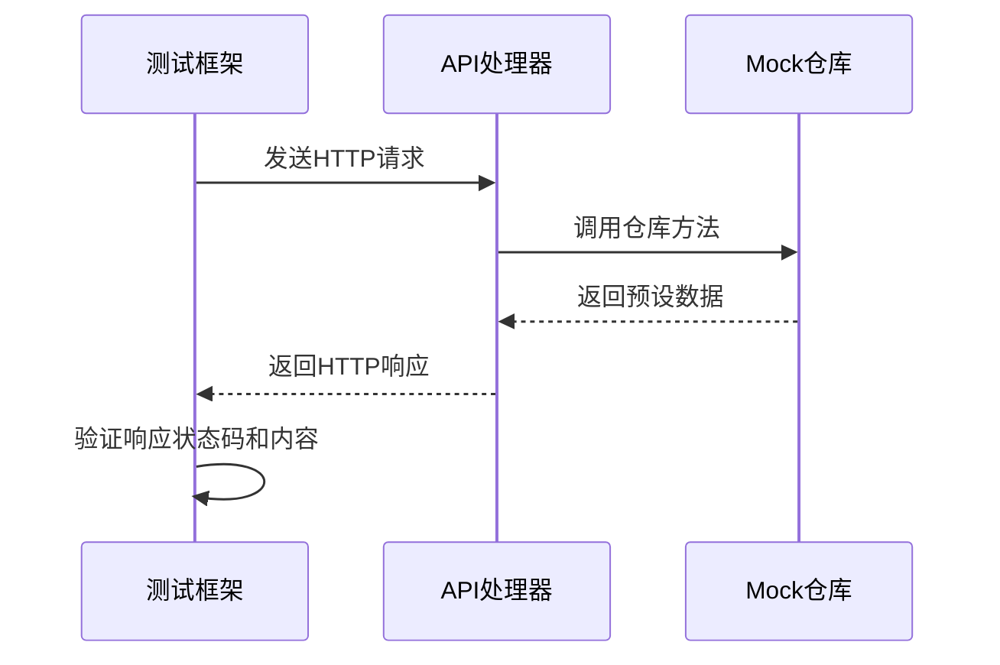
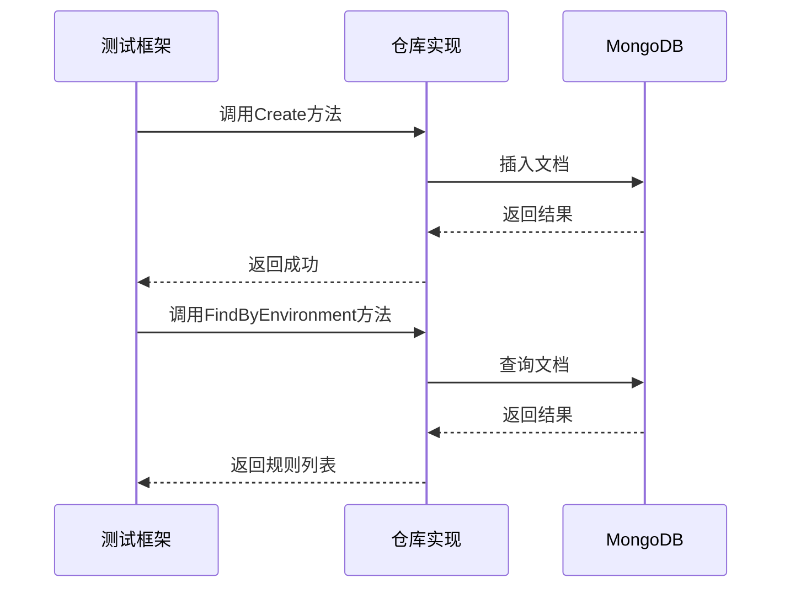
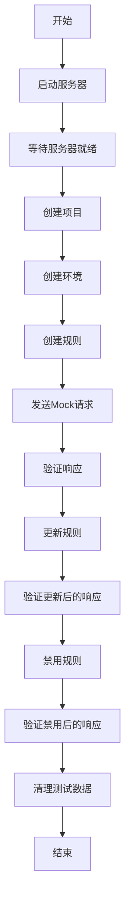
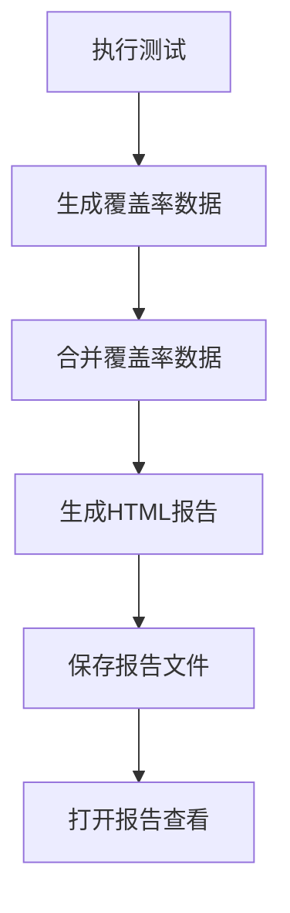
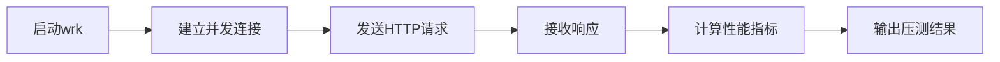
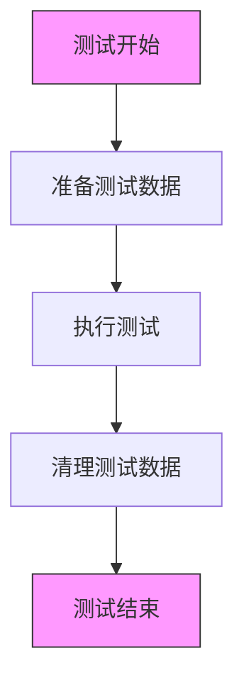
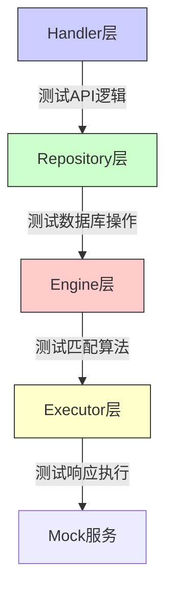

# 测试策略

<cite>
**本文档引用的文件**   
- [e2e_test.sh](file://tests/integration/e2e_test.sh)
- [repository_real_test.go](file://internal/repository/repository_real_test.go)
- [project_handler_test.go](file://internal/api/project_handler_test.go)
- [rule_handler_test.go](file://internal/api/rule_handler_test.go)
- [match_engine_test.go](file://internal/engine/match_engine_test.go)
- [mock_executor_test.go](file://internal/executor/mock_executor_test.go)
- [init-mongo.js](file://tests/data/init-mongo.js)
- [docker-compose.test.yml](file://docker-compose.test.yml)
</cite>

## 目录
1. [测试策略概述](#测试策略概述)
2. [单元测试](#单元测试)
3. [集成测试](#集成测试)
4. [端到端测试](#端到端测试)
5. [测试套件运行](#测试套件运行)
6. [覆盖率报告](#覆盖率报告)
7. [性能压测](#性能压测)
8. [测试数据准备与清理](#测试数据准备与清理)
9. [测试层级覆盖范围](#测试层级覆盖范围)

## 测试策略概述

gomockserver项目采用多层次的测试策略，确保代码质量和系统稳定性。测试体系包含单元测试、集成测试和端到端测试三个主要层级，每个层级都有明确的测试目标和覆盖范围。单元测试使用Go内置的testing框架，专注于验证单个函数和方法的正确性；集成测试通过真实MongoDB连接验证数据访问层的正确性；端到端测试则通过e2e_test.sh脚本模拟完整的业务流程，验证系统整体功能。测试数据准备和清理遵循最佳实践，确保测试的独立性和可重复性。

## 单元测试

单元测试是gomockserver测试策略的基础，主要使用Go内置的testing框架和testify/assert、testify/mock等第三方库。单元测试文件以_test.go为后缀，位于相应源码文件的同一目录下。测试采用依赖注入和mock技术，通过创建mock仓库来隔离外部依赖，确保测试的纯粹性和速度。

单元测试覆盖了项目中的核心组件，包括API处理器、匹配引擎和执行器。例如，project_handler_test.go文件中的测试用例验证了项目管理API的各个端点，包括创建、获取、更新和删除项目等操作。测试通过设置不同的请求体和mock行为，验证了各种场景下的响应状态码和错误处理。

**Diagram sources**
- [project_handler_test.go](file://internal/api/project_handler_test.go#L97-L637)
- [rule_handler_test.go](file://internal/api/rule_handler_test.go#L78-L628)

**Section sources**
- [project_handler_test.go](file://internal/api/project_handler_test.go#L1-L637)
- [rule_handler_test.go](file://internal/api/rule_handler_test.go#L1-L628)

## 集成测试

集成测试验证gomockserver与真实MongoDB数据库的交互，确保数据访问层的正确性。integration_test.go文件中的测试用例使用真实的MongoDB连接，测试了规则、项目和环境的完整CRUD流程。测试通过环境变量MONGODB_URI指定数据库连接，如果无法连接则自动跳过。

集成测试覆盖了数据访问层的多个方面，包括基本的CRUD操作、按环境查询规则、分页和过滤功能。例如，TestRuleRepository_RealDB_FindByEnvironment测试用例验证了按环境查询规则的功能，确保返回的规则按优先级降序排列。TestRuleRepository_RealDB_List测试用例则验证了分页和过滤功能的正确性。

**Diagram sources**
- [repository_real_test.go](file://internal/repository/repository_real_test.go#L81-L445)

**Section sources**
- [repository_real_test.go](file://internal/repository/repository_real_test.go#L1-L445)

## 端到端测试

端到端测试通过e2e_test.sh脚本模拟完整的业务流程，验证系统整体功能。测试脚本使用bash编写，通过curl命令与API交互，验证从项目创建到Mock请求的完整流程。测试包含多个阶段：准备工作、项目管理、环境管理、规则管理、Mock请求测试和规则状态管理。

端到端测试验证了系统的关键业务流程，包括创建项目、创建环境、创建规则、发送Mock请求、更新规则和验证响应。测试脚本具有良好的错误处理和重试机制，确保测试的稳定性和可靠性。例如，在测试基本Mock请求时，脚本会尝试最多3次，每次失败后等待2秒再重试。

**Diagram sources**
- [e2e_test.sh](file://tests/integration/e2e_test.sh#L1-L782)

**Section sources**
- [e2e_test.sh](file://tests/integration/e2e_test.sh#L1-L782)

## 测试套件运行

测试套件通过run_unit_tests.sh脚本运行，该脚本自动化了单元测试的执行过程。脚本首先清理之前的测试结果，然后依次运行各个组件的测试，并生成覆盖率报告。测试套件的运行遵循标准的Go测试流程，使用go test命令执行测试。

测试套件的运行流程包括：设置测试环境、执行测试、生成覆盖率报告和清理临时文件。脚本通过-tags=integration标志区分单元测试和集成测试，确保测试的隔离性。测试结果以标准格式输出，便于CI/CD系统解析和处理。

**Section sources**
- [run_unit_tests.sh](file://scripts/run_unit_tests.sh)

## 覆盖率报告

覆盖率报告通过Go的内置工具生成，包含unit-coverage-all.html等HTML文件。这些报告提供了详细的代码覆盖率信息，包括语句覆盖率、函数覆盖率和行覆盖率。覆盖率报告帮助开发人员识别未被测试覆盖的代码路径，确保测试的完整性。

覆盖率报告的生成过程包括：执行测试并收集覆盖率数据、合并各个组件的覆盖率数据、生成HTML报告。报告文件位于scripts/coverage/目录下，可以通过浏览器直接查看。高覆盖率是代码质量的重要指标，gomockserver项目要求核心组件的覆盖率不低于80%。

**Section sources**
- [unit-coverage-all.html](file://scripts/coverage/unit-coverage-all.html)

## 性能压测

性能压测使用wrk工具和wrk_script.lua脚本进行，评估系统在高并发场景下的性能表现。压测脚本模拟了大量并发请求，测量系统的吞吐量、延迟和错误率。性能压测是确保系统在生产环境中稳定运行的重要环节。

性能压测的配置包括：并发连接数、持续时间、请求速率和测试脚本。wrk_script.lua脚本定义了请求的路径、方法和头部信息，模拟真实的API调用场景。压测结果用于识别性能瓶颈，指导性能优化工作。

**Section sources**
- [wrk_script.lua](file://tests/performance/wrk_script.lua)

## 测试数据准备与清理

测试数据的准备和清理遵循最佳实践，确保测试的独立性和可重复性。集成测试使用init-mongo.js脚本初始化MongoDB数据库，创建必要的索引和测试数据。脚本在数据库启动时自动执行，确保每次测试都从一致的状态开始。

测试数据的清理在测试结束后自动进行，避免测试数据的累积。端到端测试脚本在退出时通过trap命令注册清理函数，确保即使测试失败也能正确清理测试数据。清理过程包括删除创建的项目、环境和规则，以及停止测试服务器。

**Diagram sources**
- [init-mongo.js](file://tests/data/init-mongo.js#L1-L21)
- [e2e_test.sh](file://tests/integration/e2e_test.sh#L56-L79)

**Section sources**
- [init-mongo.js](file://tests/data/init-mongo.js#L1-L21)
- [e2e_test.sh](file://tests/integration/e2e_test.sh#L1-L782)

## 测试层级覆盖范围

gomockserver的测试策略覆盖了多个层级，每个层级都有明确的测试重点。handler层测试API逻辑，验证各个端点的请求处理、参数验证和错误响应。repository层测试数据库操作，确保数据的正确存储和查询。engine层测试匹配算法，验证规则匹配的正确性和优先级处理。

各层级的测试覆盖范围如下：
- **handler层**：测试API端点的正确性，包括请求验证、响应格式和错误处理
- **repository层**：测试数据库操作的正确性，包括CRUD操作、查询和索引使用
- **engine层**：测试匹配算法的正确性，包括简单匹配、正则匹配和优先级排序
- **executor层**：测试响应执行的正确性，包括延迟、自定义头部和不同内容类型

**Diagram sources**
- [project_handler_test.go](file://internal/api/project_handler_test.go#L97-L637)
- [repository_real_test.go](file://internal/repository/repository_real_test.go#L81-L445)
- [match_engine_test.go](file://internal/engine/match_engine_test.go#L75-L757)
- [mock_executor_test.go](file://internal/executor/mock_executor_test.go#L17-L800)

**Section sources**
- [project_handler_test.go](file://internal/api/project_handler_test.go#L1-L637)
- [repository_real_test.go](file://internal/repository/repository_real_test.go#L1-L445)
- [match_engine_test.go](file://internal/engine/match_engine_test.go#L1-L757)
- [mock_executor_test.go](file://internal/executor/mock_executor_test.go#L1-L800)