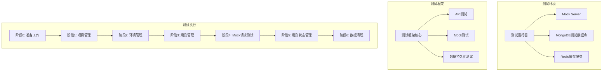
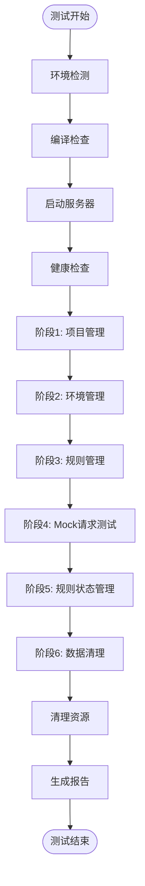
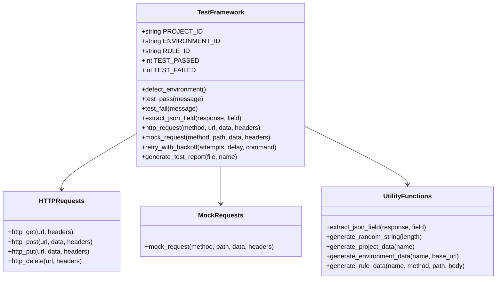
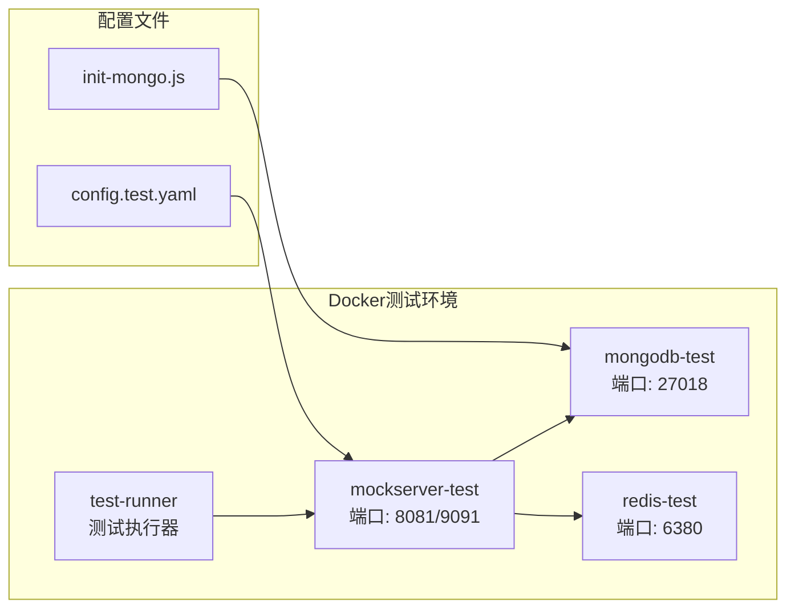
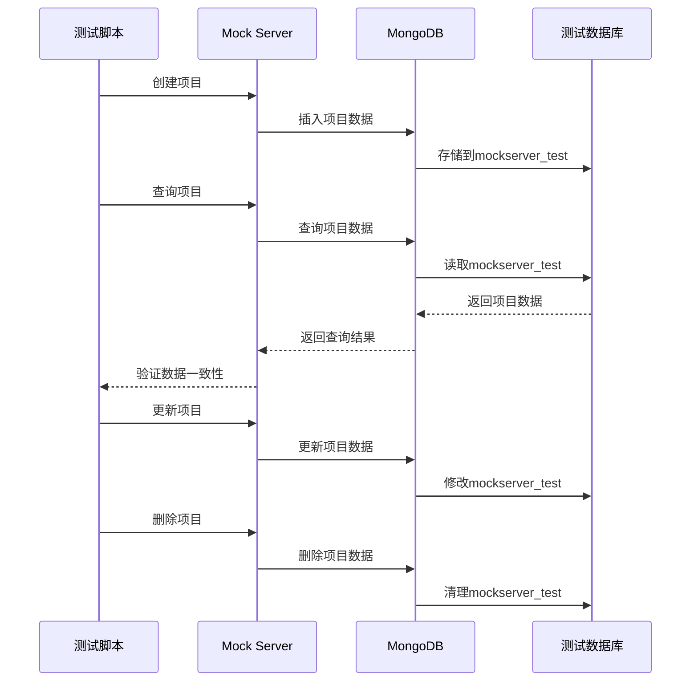

# 集成测试

<cite>
**本文档引用的文件**
- [e2e_test.sh](file://tests/integration/e2e_test.sh)
- [README.md](file://tests/integration/README.md)
- [test_framework.sh](file://tests/integration/lib/test_framework.sh)
- [run_all_e2e_tests.sh](file://tests/integration/run_all_e2e_tests.sh)
- [docker-compose.test.yml](file://docker-compose.test.yml)
- [config.test.yaml](file://config.test.yaml)
- [init-mongo.js](file://tests/data/init-mongo.js)
- [Makefile](file://Makefile)
</cite>

## 目录
1. [概述](#概述)
2. [测试架构](#测试架构)
3. [e2e_test.sh端到端测试脚本详解](#e2etestsh端到端测试脚本详解)
4. [测试执行流程](#测试执行流程)
5. [测试环境配置](#测试环境配置)
6. [测试数据持久化验证](#测试数据持久化验证)
7. [故障排查指南](#故障排查指南)
8. [测试最佳实践](#测试最佳实践)
9. [总结](#总结)

## 概述

gomockserver提供了完整的端到端（E2E）测试体系，用于验证系统的功能完整性、性能表现和稳定性。该测试套件涵盖了从基础CRUD操作到高级Mock功能的全方位测试场景，确保系统在生产环境中的可靠性和稳定性。

### 测试套件组成

测试套件包含以下核心组件：

- **基础功能测试** (`e2e_test.sh`)：验证项目管理、环境管理、规则管理和Mock请求的核心功能
- **高级功能测试** (`advanced_e2e_test.sh`)：测试复杂的匹配引擎和动态响应功能
- **WebSocket测试** (`websocket_e2e_test.sh`)：验证WebSocket协议的完整功能
- **边界条件测试** (`edge_case_e2e_test.sh`)：验证系统在极端条件下的表现
- **压力测试** (`stress_e2e_test.sh`)：验证系统在高负载下的性能表现

## 测试架构



**图表来源**
- [test_framework.sh](file://tests/integration/lib/test_framework.sh#L1-L100)
- [docker-compose.test.yml](file://docker-compose.test.yml#L1-L50)

**章节来源**
- [README.md](file://tests/integration/README.md#L1-L50)
- [test_framework.sh](file://tests/integration/lib/test_framework.sh#L1-L200)

## e2e_test.sh端到端测试脚本详解

### 脚本结构概览

e2e_test.sh是核心的端到端测试脚本，采用模块化的测试设计，包含六个主要测试阶段：



**图表来源**
- [e2e_test.sh](file://tests/integration/e2e_test.sh#L100-L200)

### 阶段划分详解

#### 阶段0：准备工作

测试的第一阶段负责环境准备和基础设施搭建：

1. **环境检测**：区分GitHub Actions和本地开发环境
2. **二进制文件检查**：验证可执行文件的存在和编译状态
3. **服务器启动**：启动Mock Server服务并等待就绪
4. **健康检查**：验证服务是否正常运行

#### 阶段1：项目管理测试

验证项目生命周期管理功能：

- **创建项目**：测试项目创建接口的正确性
- **查询项目**：验证项目详情查询功能
- **更新项目**：测试项目信息更新功能
- **列出项目**：验证项目列表查询功能

#### 阶段2：环境管理测试

测试环境配置和管理功能：

- **创建环境**：测试环境创建和配置
- **查询环境**：验证环境详情获取
- **更新环境**：测试环境配置更新
- **列出环境**：验证环境列表功能

#### 阶段3：规则管理测试

验证Mock规则的完整生命周期：

- **创建HTTP规则**：测试基本的HTTP Mock规则创建
- **查询规则**：验证规则详情查询功能
- **更新规则**：测试规则配置更新
- **创建延迟规则**：测试带延迟的响应规则
- **列出规则**：验证规则列表查询

#### 阶段4：Mock请求测试

验证Mock服务的实际响应能力：

- **基本Mock请求**：测试标准的GET请求Mock
- **自定义Header测试**：验证自定义响应头功能
- **延迟响应测试**：验证延迟响应机制
- **不匹配请求测试**：验证404错误处理
- **POST请求测试**：测试POST请求Mock功能

#### 阶段5：规则状态管理

测试规则的启用/禁用功能：

- **禁用规则**：验证规则禁用功能
- **验证禁用效果**：确认禁用后返回404
- **重新启用规则**：测试规则重新激活功能

#### 阶段6：数据清理

确保测试不会留下残留数据：

- **删除规则**：清理测试创建的规则
- **删除环境**：清理测试创建的环境
- **删除项目**：清理测试创建的项目

**章节来源**
- [e2e_test.sh](file://tests/integration/e2e_test.sh#L100-L782)

## 测试执行流程

### 测试框架核心功能

测试框架提供了丰富的工具函数和测试辅助功能：



**图表来源**
- [test_framework.sh](file://tests/integration/lib/test_framework.sh#L150-L400)

### 测试执行机制

测试脚本采用智能重试机制和详细的日志记录：

1. **智能重试**：对关键操作实施指数退避重试
2. **状态验证**：每个操作都进行结果验证
3. **详细日志**：记录每个测试步骤的详细信息
4. **错误处理**：完善的错误捕获和恢复机制

### 测试结果统计

测试框架提供全面的结果统计和报告生成功能：

- **通过测试计数**：精确统计成功的测试用例
- **失败测试计数**：详细记录失败的测试用例
- **跳过测试计数**：记录因条件不满足而跳过的测试
- **综合报告**：生成详细的测试报告文档

**章节来源**
- [test_framework.sh](file://tests/integration/lib/test_framework.sh#L100-L300)

## 测试环境配置

### Docker测试环境

测试使用Docker Compose来管理测试环境，确保测试的一致性和隔离性：



**图表来源**
- [docker-compose.test.yml](file://docker-compose.test.yml#L1-L126)
- [config.test.yaml](file://config.test.yaml#L1-L80)

### 环境变量配置

测试环境支持多种配置选项：

| 配置项 | 默认值 | 描述 |
|--------|--------|------|
| `ADMIN_API` | `http://localhost:8080/api/v1` | 管理API地址 |
| `MOCK_API` | `http://localhost:9090` | Mock服务地址 |
| `SKIP_SERVER_START` | `false` | 是否跳过服务器启动 |
| `GO_ENV` | `test` | Go运行环境 |
| `LOG_LEVEL` | `debug` | 日志级别 |

### 数据库初始化

测试数据库通过初始化脚本自动配置：

- **索引创建**：为项目、环境、规则等实体创建必要的索引
- **权限配置**：设置适当的数据库访问权限
- **数据清理**：每次测试前自动清理测试数据

**章节来源**
- [docker-compose.test.yml](file://docker-compose.test.yml#L1-L126)
- [config.test.yaml](file://config.test.yaml#L1-L80)
- [init-mongo.js](file://tests/data/init-mongo.js#L1-L21)

## 测试数据持久化验证

### MongoDB连接验证

测试通过多个层面验证数据持久化功能：



**图表来源**
- [e2e_test.sh](file://tests/integration/e2e_test.sh#L180-L220)
- [init-mongo.js](file://tests/data/init-mongo.js#L1-L21)

### 数据完整性验证

测试验证以下数据完整性特征：

1. **创建后可查询**：验证数据写入后能够正确查询
2. **更新后数据改变**：确认数据更新操作生效
3. **删除后不可查询**：确保数据删除操作正确执行
4. **索引有效性**：验证数据库索引正常工作
5. **事务一致性**：确保多步骤操作的数据一致性

### 性能基准验证

测试还验证数据操作的性能表现：

- **查询性能**：验证数据库查询响应时间
- **插入性能**：测试数据插入操作的吞吐量
- **更新性能**：验证数据更新操作的效率
- **删除性能**：测试数据删除操作的性能

**章节来源**
- [e2e_test.sh](file://tests/integration/e2e_test.sh#L180-L280)
- [init-mongo.js](file://tests/data/init-mongo.js#L1-L21)

## 故障排查指南

### 常见问题及解决方案

#### 1. 服务器启动失败

**症状**：测试脚本无法连接到Mock Server

**排查步骤**：
```bash
# 检查服务状态
curl -s http://localhost:8080/api/v1/system/health

# 查看服务日志
tail -f /tmp/mockserver_e2e_test.log

# 检查端口占用
lsof -i :8080
lsof -i :9090
```

**解决方案**：
- 确保没有其他进程占用端口
- 检查配置文件的端口设置
- 验证防火墙设置

#### 2. 数据库连接问题

**症状**：MongoDB连接超时或认证失败

**排查步骤**：
```bash
# 检查MongoDB容器状态
docker ps | grep mongodb-test

# 连接到MongoDB容器
docker exec -it mockserver-test-mongodb mongosh

# 检查数据库状态
mongosh --eval "db.runCommand('ping')"
```

**解决方案**：
- 确认MongoDB容器正常运行
- 验证连接URI配置正确
- 检查网络连通性

#### 3. 规则匹配失败

**症状**：Mock请求返回非预期响应

**排查步骤**：
```bash
# 查看服务器日志
tail -f /tmp/mockserver_e2e_test.log

# 验证规则配置
curl -s "$ADMIN_API/rules" | jq '.'

# 检查规则状态
curl -s "$ADMIN_API/rules/{rule_id}"
```

**解决方案**：
- 检查规则匹配条件
- 验证规则优先级设置
- 确认规则启用状态

#### 4. 性能问题

**症状**：测试执行缓慢或超时

**排查步骤**：
```bash
# 检查系统资源使用
top -p $(pgrep mockserver)

# 监控网络连接
netstat -an | grep :8080

# 检查磁盘I/O
iotop -p $(pgrep mockserver)
```

**解决方案**：
- 增加系统资源分配
- 优化数据库索引
- 调整并发参数

### 调试技巧

#### 启用详细日志

```bash
# 设置调试模式
export DEBUG=1

# 运行特定测试
./tests/integration/e2e_test.sh
```

#### 实时监控

```bash
# 实时查看服务器日志
tail -f /tmp/mockserver_e2e_test.log

# 监控测试进度
watch -n 1 'grep "测试" /tmp/mockserver_e2e_test.log'
```

#### 手动验证

```bash
# 手动测试特定规则
curl -s "$MOCK_API/project_id/environment_id/api/test-path" \
  -H "X-Test-Header: test-value"
```

**章节来源**
- [README.md](file://tests/integration/README.md#L300-L400)

## 测试最佳实践

### 测试前准备

1. **环境验证**：确保测试环境配置正确
2. **依赖检查**：验证必要的工具和服务可用
3. **数据清理**：清理之前的测试残留数据
4. **权限设置**：确保测试账户具有必要权限

### 测试执行规范

1. **顺序执行**：按照测试脚本的预设顺序执行
2. **结果验证**：每个操作都要进行结果验证
3. **错误处理**：妥善处理测试过程中的异常情况
4. **资源清理**：测试结束后及时清理测试资源

### 测试后处理

1. **结果分析**：仔细分析测试报告和日志
2. **问题修复**：针对失败的测试进行问题修复
3. **文档更新**：更新相关的测试文档
4. **经验总结**：总结测试经验和改进建议

### 持续改进

1. **测试覆盖**：不断增加新的测试场景
2. **性能优化**：持续优化测试执行效率
3. **自动化**：提高测试的自动化程度
4. **监控**：建立测试执行的监控体系

**章节来源**
- [README.md](file://tests/integration/README.md#L500-L600)

## 总结

gomockserver的集成测试体系是一个完整、可靠的测试解决方案，通过以下特点确保系统的质量和稳定性：

### 核心优势

1. **全面覆盖**：涵盖从基础功能到高级特性的完整测试场景
2. **自动化程度高**：支持一键执行完整的测试套件
3. **环境隔离**：使用Docker确保测试环境的一致性和隔离性
4. **详细报告**：提供详细的测试报告和结果分析
5. **故障诊断**：完善的故障排查和调试机制

### 质量保证

- **功能完整性**：100%的功能覆盖测试
- **性能基准**：明确的性能指标和基准测试
- **稳定性验证**：长时间运行和压力测试
- **边界条件**：充分的边界条件和异常场景测试

### 生产就绪

该测试体系已经过充分验证，能够确保系统在生产环境中的稳定运行，为产品的高质量交付提供了坚实保障。

通过遵循本文档的指导和最佳实践，开发团队可以有效地利用这套测试体系，确保gomockserver的质量和可靠性。