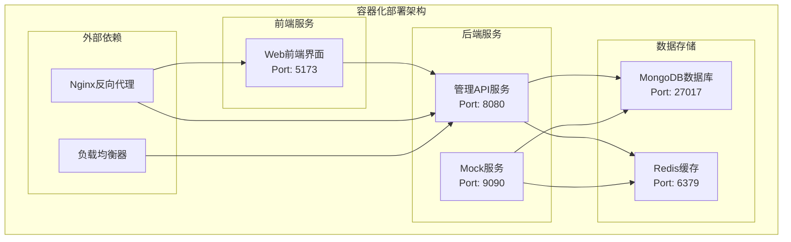
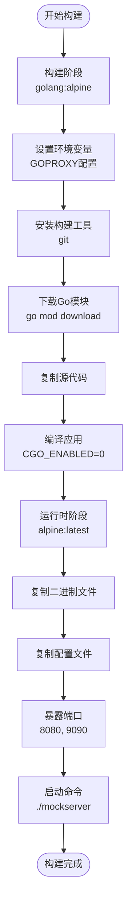
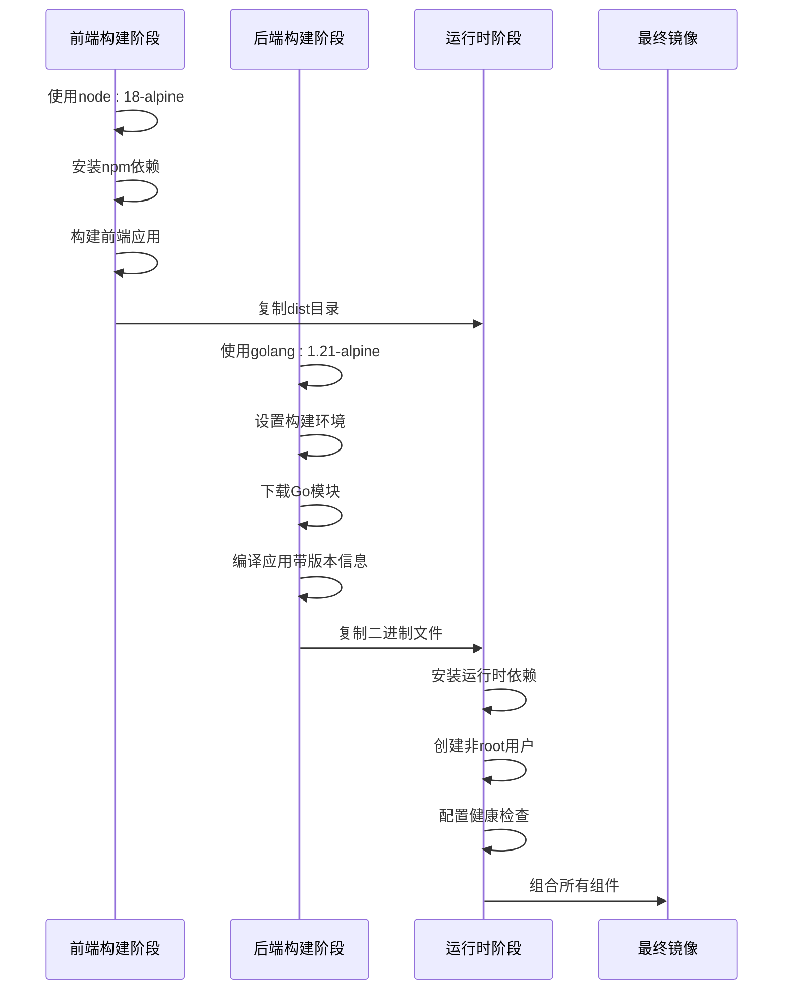
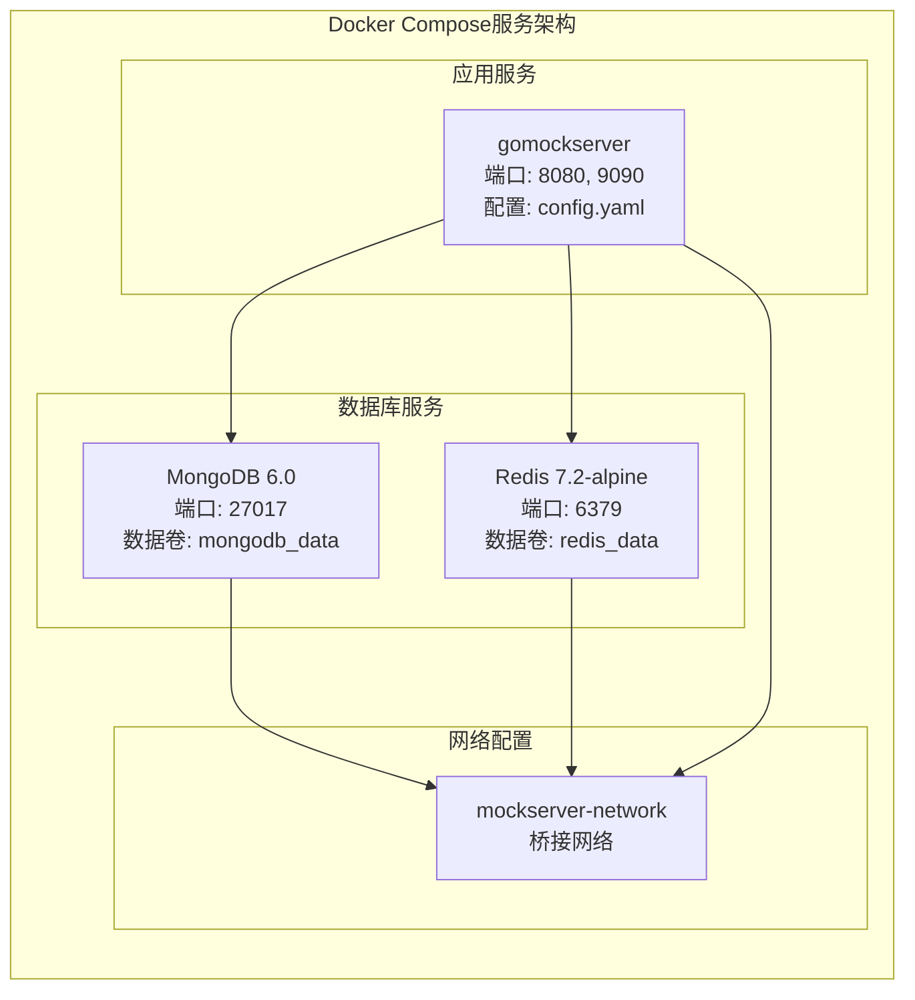
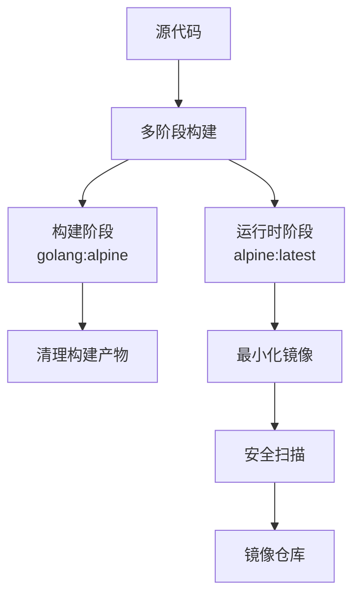

# 容器化部署

<cite>
**本文档中引用的文件**
- [Dockerfile](file://docker/Dockerfile)
- [docker-compose.yml](file://docker-compose.yml)
- [docker-compose.test.yml](file://docker-compose.test.yml)
- [config.yaml](file://config.yaml)
- [config.test.yaml](file://config.test.yaml)
- [config.dev.yaml](file://config.dev.yaml)
- [Makefile](file://Makefile)
- [DEPLOYMENT.md](file://DEPLOYMENT.md)
- [docker/Dockerfile.test](file://docker/Dockerfile.test)
- [docker/Dockerfile.fullstack](file://docker/Dockerfile.fullstack)
</cite>

## 目录
1. [概述](#概述)
2. [项目架构](#项目架构)
3. [Dockerfile多阶段构建](#dockerfile多阶段构建)
4. [Docker Compose配置](#docker-compose配置)
5. [环境变量配置](#环境变量配置)
6. [部署命令](#部署命令)
7. [最佳实践](#最佳实践)
8. [故障排除](#故障排除)

## 概述

gomockserver是一个基于Go语言开发的Mock服务管理系统，采用容器化部署方案。该项目提供了完整的Docker和Docker Compose配置，支持多种部署场景，包括开发测试、生产环境和CI/CD流水线。

### 核心特性

- **多阶段构建**：使用golang:alpine作为构建镜像，alpine:latest作为运行时镜像
- **微服务架构**：包含MongoDB数据库、Redis缓存和Mock服务
- **健康检查**：每个服务都配置了健康检查机制
- **环境隔离**：提供开发、测试和生产环境配置
- **端口映射**：8080端口用于管理API，9090端口用于Mock服务

## 项目架构



**图表来源**
- [docker-compose.yml](file://docker-compose.yml#L1-L83)
- [config.yaml](file://config.yaml#L1-L91)

## Dockerfile多阶段构建

### 构建阶段分析

gomockserver采用了高效的多阶段Docker构建策略，确保最终镜像的体积最小化和安全性。



**图表来源**
- [docker/Dockerfile](file://docker/Dockerfile#L1-L36)

### 构建阶段详解

#### 第一阶段：构建环境
- **基础镜像**：`golang:alpine` - 轻量化的Go开发环境
- **环境配置**：设置阿里云Go代理加速依赖下载
- **工具安装**：安装git以支持版本控制
- **依赖管理**：下载所有Go模块依赖

#### 第二阶段：运行时环境
- **基础镜像**：`alpine:latest` - 最小化的Linux发行版
- **安全考虑**：无包管理器，减少攻击面
- **端口暴露**：8080（管理API）、9090（Mock服务）
- **启动配置**：指定配置文件路径

**章节来源**
- [docker/Dockerfile](file://docker/Dockerfile#L1-L36)

### 完整堆栈构建

对于包含前端的完整部署，项目提供了专门的多阶段构建文件：



**图表来源**
- [docker/Dockerfile.fullstack](file://docker/Dockerfile.fullstack#L1-L121)

**章节来源**
- [docker/Dockerfile.fullstack](file://docker/Dockerfile.fullstack#L1-L121)

## Docker Compose配置

### 服务架构

docker-compose.yml文件定义了完整的微服务架构，包含三个主要服务：



**图表来源**
- [docker-compose.yml](file://docker-compose.yml#L1-L83)

### MongoDB服务配置

| 配置项 | 值 | 说明 |
|--------|-----|------|
| 镜像版本 | mongo:6.0 | 使用最新的MongoDB 6.0稳定版 |
| 容器名称 | mockserver-mongodb | 标准化的容器命名 |
| 重启策略 | always | 服务异常时自动重启 |
| 端口映射 | 27017:27017 | 主机与容器端口映射 |
| 环境变量 | MONGO_INITDB_DATABASE=mockserver | 初始化数据库名称 |
| 数据卷 | mongodb_data:/data/db | 持久化数据存储 |
| 健康检查 | mongosh ping命令 | 每10秒检查一次 |

### Redis服务配置

| 配置项 | 值 | 说明 |
|--------|-----|------|
| 镜像版本 | redis:7.2-alpine | 最新的Redis稳定版 |
| 容器名称 | mockserver-redis | 标准化容器命名 |
| 重启策略 | always | 服务异常时自动重启 |
| 端口映射 | 6379:6379 | 主机与容器端口映射 |
| 命令参数 | redis-server /usr/local/etc/redis/redis.conf | 指定配置文件 |
| 数据卷 | redis_data:/data | 持久化数据存储 |
| 健康检查 | redis-cli ping | 每10秒检查一次 |

### MockServer服务配置

| 配置项 | 值 | 说明 |
|--------|-----|------|
| 构建上下文 | . | 当前目录作为构建上下文 |
| Dockerfile路径 | docker/Dockerfile | 指定构建文件位置 |
| 容器名称 | mockserver-app | 标准化容器命名 |
| 重启策略 | always | 服务异常时自动重启 |
| 端口映射 | 8080:8080, 9090:9090 | 管理API和Mock服务端口 |
| 环境变量 | TZ=Asia/Shanghai | 设置时区 |
| 依赖服务 | mongodb, redis | 服务启动顺序控制 |
| 数据卷 | config.yaml:/root/config.yaml | 配置文件挂载 |
| 数据卷 | logs:/root/logs | 日志文件挂载 |

**章节来源**
- [docker-compose.yml](file://docker-compose.yml#L1-L83)

### 网络和数据卷配置

#### 网络配置
- **网络类型**：bridge（桥接网络）
- **网络名称**：mockserver-network
- **通信方式**：服务间通过容器名称直接通信

#### 数据卷配置
- **MongoDB数据卷**：mongodb_data - 持久化数据库数据
- **Redis数据卷**：redis_data - 持久化缓存数据
- **配置文件卷**：config.yaml - 挂载主配置文件
- **日志卷**：logs - 挂载日志输出目录

**章节来源**
- [docker-compose.yml](file://docker-compose.yml#L77-L83)

## 环境变量配置

### 配置覆盖机制

gomockserver支持通过环境变量覆盖config.yaml中的配置项，提供了灵活的部署配置方式。

#### 核心环境变量

| 环境变量 | 默认值 | 说明 |
|----------|--------|------|
| TZ | Asia/Shanghai | 时区设置 |
| REDIS_URL | redis://redis:6379 | Redis连接URL |
| REDIS_PASSWORD | 空 | Redis密码 |
| REDIS_DB | 0 | Redis数据库编号 |
| CACHE_ENABLED | true | 是否启用缓存 |

#### 端口配置

| 环境变量 | 默认值 | 说明 |
|----------|--------|------|
| SERVER_ADMIN_HOST | 0.0.0.0 | 管理API监听地址 |
| SERVER_ADMIN_PORT | 8080 | 管理API监听端口 |
| SERVER_MOCK_HOST | 0.0.0.0 | Mock服务监听地址 |
| SERVER_MOCK_PORT | 9090 | Mock服务监听端口 |

#### 数据库配置

| 环境变量 | 默认值 | 说明 |
|----------|--------|------|
| DATABASE_MONGODB_URI | mongodb://mongodb:27017 | MongoDB连接字符串 |
| DATABASE_MONGODB_DATABASE | mockserver | 数据库名称 |
| DATABASE_MONGODB_TIMEOUT | 10s | 连接超时时间 |

#### 日志配置

| 环境变量 | 默认值 | 说明 |
|----------|--------|------|
| LOGGING_LEVEL | info | 日志级别（debug, info, warn, error） |
| LOGGING_FORMAT | json | 日志格式（json, text） |
| LOGGING_OUTPUT | stdout | 输出目标（stdout, file） |

### 配置优先级

环境变量配置具有最高优先级，会覆盖config.yaml中的对应配置项。这种设计允许：

- **生产环境安全配置**：敏感信息通过环境变量传递
- **多环境适配**：不同环境使用不同的配置值
- **动态配置更新**：无需重新构建镜像即可更新配置

**章节来源**
- [docker-compose.yml](file://docker-compose.yml#L53-L59)
- [config.yaml](file://config.yaml#L1-L91)

## 部署命令

### 基础部署命令

#### 启动服务

```bash
# 构建并启动所有服务（后台运行）
docker-compose up -d

# 查看服务状态
docker-compose ps

# 查看实时日志
docker-compose logs -f

# 查看特定服务日志
docker-compose logs -f mockserver
```

#### 停止服务

```bash
# 停止服务但保留容器
docker-compose stop

# 停止并删除容器
docker-compose down

# 停止并删除容器及数据卷
docker-compose down -v
```

### 开发环境部署

#### 使用Makefile简化命令

```bash
# 启动完整开发环境
make start-all

# 停止所有服务
make stop-all

# 启动单独的服务
make start-mongo    # 启动MongoDB
make start-redis    # 启动Redis
make start-backend  # 启动后端服务
make start-frontend # 启动前端服务
```

#### 验证部署

```bash
# 检查服务健康状态
curl http://localhost:8080/api/v1/system/health

# 查看版本信息
curl http://localhost:8080/api/v1/system/version

# 检查MongoDB连接
docker exec -it mockserver-mongodb mongosh

# 检查Redis状态
docker exec -it mockserver-redis redis-cli info
```

### 测试环境部署

#### Docker Compose测试环境

```bash
# 启动测试环境
docker-compose -f docker-compose.test.yml up -d

# 运行集成测试
docker-compose -f docker-compose.test.yml --profile integration run --rm test-runner

# 性能测试
docker-compose -f docker-compose.test.yml --profile performance run --rm wrk-test

# 停止测试环境
docker-compose -f docker-compose.test.yml down
```

#### 测试环境特点

- **独立端口**：使用不同的端口避免冲突
- **专用配置**：使用config.test.yaml配置文件
- **测试数据**：预置测试数据初始化脚本
- **性能监控**：包含wrk性能测试工具

**章节来源**
- [Makefile](file://Makefile#L347-L373)
- [docker-compose.test.yml](file://docker-compose.test.yml#L1-L126)

### 生产环境部署

#### 安全配置建议

```bash
# 生产环境配置示例
export SERVER_ADMIN_PORT=8080
export SERVER_MOCK_PORT=9090
export DATABASE_MONGODB_URI="mongodb://production-mongodb:27017"
export LOGGING_LEVEL="warn"
export SECURITY_JWT_SECRET="your-secure-jwt-secret"
```

#### 生产部署最佳实践

1. **使用SSL/TLS**：在反向代理层配置HTTPS
2. **限制网络访问**：使用防火墙规则限制端口访问
3. **监控和日志**：配置集中式日志收集和监控
4. **备份策略**：定期备份数据库和配置文件
5. **版本管理**：使用Git标签管理部署版本

## 最佳实践

### 镜像管理

#### 镜像优化策略



#### 镜像大小优化

- **Alpine基础镜像**：相比Ubuntu等镜像减少约70%体积
- **单二进制文件**：CGO_ENABLED=0编译产生静态链接文件
- **无包管理器**：运行时镜像不包含apt/yum等包管理器
- **清理缓存**：构建过程中清理临时文件和缓存

### 容器安全

#### 安全配置要点

| 配置项 | 建议值 | 说明 |
|--------|--------|------|
| 用户权限 | 非root用户 | 创建专用用户运行应用 |
| 网络隔离 | 专用网络 | 使用自定义桥接网络 |
| 权限最小化 | 只读文件系统 | 挂载只读配置文件 |
| 资源限制 | CPU/Memory限制 | 防止单个容器消耗过多资源 |
| 健康检查 | 定期检查 | 自动发现和恢复故障 |

#### 安全加固措施

```bash
# 创建专用用户
RUN addgroup -g 1000 mockserver && \
    adduser -D -u 1000 -G mockserver mockserver && \
    chown -R mockserver:mockserver /app

# 切换到非root用户
USER mockserver

# 设置只读挂载
volumes:
  - ./config.yaml:/root/config.yaml:ro
```

### 性能优化

#### 资源配置建议

| 服务 | CPU | 内存 | 存储 | 说明 |
|------|-----|------|------|------|
| MongoDB | 2核 | 4GB | 50GB SSD | 数据库性能关键 |
| Redis | 1核 | 2GB | 10GB SSD | 缓存性能优化 |
| MockServer | 2核 | 2GB | 20GB | 应用服务 |
| 前端服务 | 1核 | 1GB | 5GB | 静态文件服务 |

#### 缓存策略

```yaml
# Redis配置示例
redis:
  enabled: true
  host: "redis"
  port: 6379
  db: 0
  pool:
    min: 10
    max: 100
```

### 监控和日志

#### 健康检查配置

```yaml
healthcheck:
  test: ["CMD", "curl", "-f", "http://localhost:8080/api/v1/system/health"]
  interval: 30s
  timeout: 10s
  retries: 3
  start_period: 30s
```

#### 日志配置

```yaml
logging:
  level: "info"
  format: "json"
  output: "stdout"
  file:
    path: "/var/log/mockserver/app.log"
    max_size: 100
    max_backups: 10
    max_age: 30
```

### 备份和恢复

#### 数据备份策略

```bash
#!/bin/bash
# MongoDB备份脚本
BACKUP_DIR="/backup/mongodb/$(date +%Y%m%d_%H%M%S)"
mkdir -p $BACKUP_DIR

# 执行备份
docker exec mockserver-mongodb mongodump \
  --db mockserver \
  --out $BACKUP_DIR

# 压缩备份
tar -czf $BACKUP_DIR.tar.gz -C $BACKUP_DIR .

# 清理临时文件
rm -rf $BACKUP_DIR
```

#### 恢复流程

```bash
# 停止服务
docker-compose down

# 恢复数据
docker exec mockserver-mongodb mongorestore \
  --db mockserver \
  /backup/mongodb/backup_file

# 重启服务
docker-compose up -d
```

## 故障排除

### 常见问题诊断

#### 服务启动失败

**症状**：容器启动后立即退出

**排查步骤**：
```bash
# 查看容器日志
docker-compose logs mockserver

# 检查端口占用
netstat -tulpn | grep :8080
netstat -tulpn | grep :9090

# 检查配置文件
docker exec mockserver-app cat /root/config.yaml
```

**解决方案**：
- 检查端口冲突
- 验证配置文件语法
- 确认依赖服务正常运行

#### 数据库连接问题

**症状**：日志显示数据库连接错误

**排查步骤**：
```bash
# 检查MongoDB服务状态
docker-compose ps mongodb

# 检查网络连接
docker network ls
docker network inspect mockserver_mockserver-network

# 测试MongoDB连接
docker exec -it mockserver-mongodb mongosh
```

**解决方案**：
- 确认MongoDB容器正常运行
- 检查网络配置
- 验证连接字符串格式

#### Mock规则不生效

**排查步骤**：
1. 检查规则是否启用（enabled: true）
2. 确认project_id和environment_id正确
3. 检查规则优先级和匹配条件
4. 查看请求日志

#### 性能问题优化

**优化建议**：
- 启用Redis缓存
- 增加MongoDB连接池大小
- 调整日志级别为warn或error
- 使用SSD存储
- 增加服务器资源

### 监控指标

#### 关键监控点

| 指标类型 | 监控项 | 告警阈值 |
|----------|--------|----------|
| 系统资源 | CPU使用率 | >80% |
| 系统资源 | 内存使用率 | >85% |
| 系统资源 | 磁盘空间 | >90% |
| 应用指标 | 响应时间 | >2s |
| 应用指标 | 错误率 | >5% |
| 数据库 | 连接数 | >最大连接数的80% |

#### 健康检查接口

```bash
# 健康检查
curl http://localhost:8080/api/v1/system/health

# 版本信息
curl http://localhost:8080/api/v1/system/version

# 系统状态
curl http://localhost:8080/api/v1/system/status
```

### 日志管理

#### 日志级别配置

```yaml
logging:
  level: "debug"  # 生产环境建议改为"warn"或"error"
  format: "json"
  output: "stdout"
```

#### 日志轮转配置

```bash
# 日志轮转脚本示例
logrotate /etc/logrotate.d/mockserver <<EOF
/var/log/mockserver/*.log {
    daily
    rotate 30
    compress
    delaycompress
    missingok
    notifempty
    create 644 mockserver mockserver
}
EOF
```

**章节来源**
- [DEPLOYMENT.md](file://DEPLOYMENT.md#L708-L824)