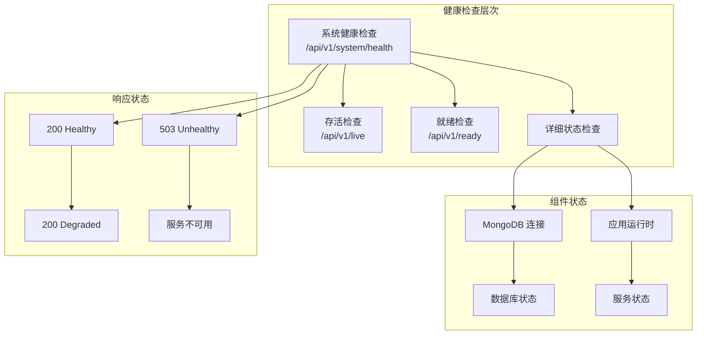
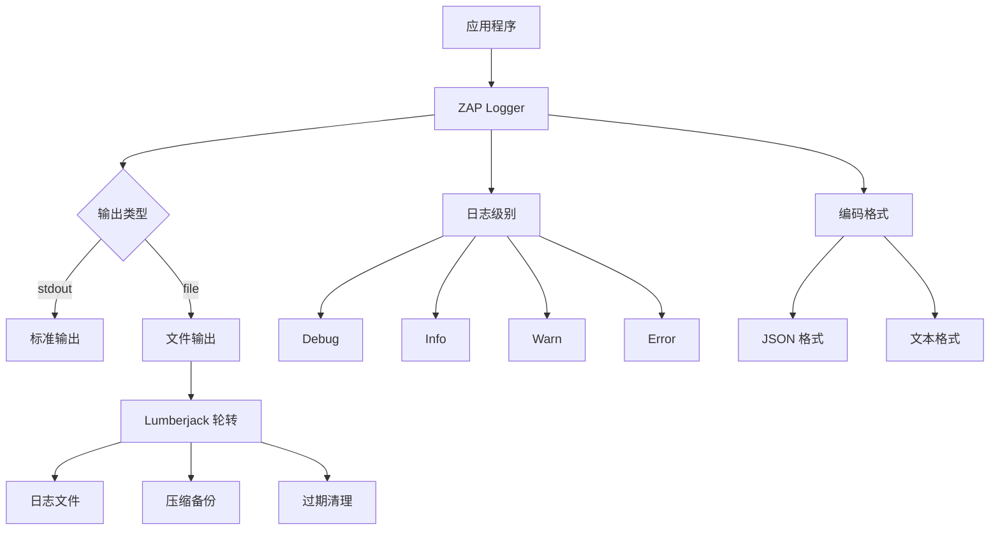
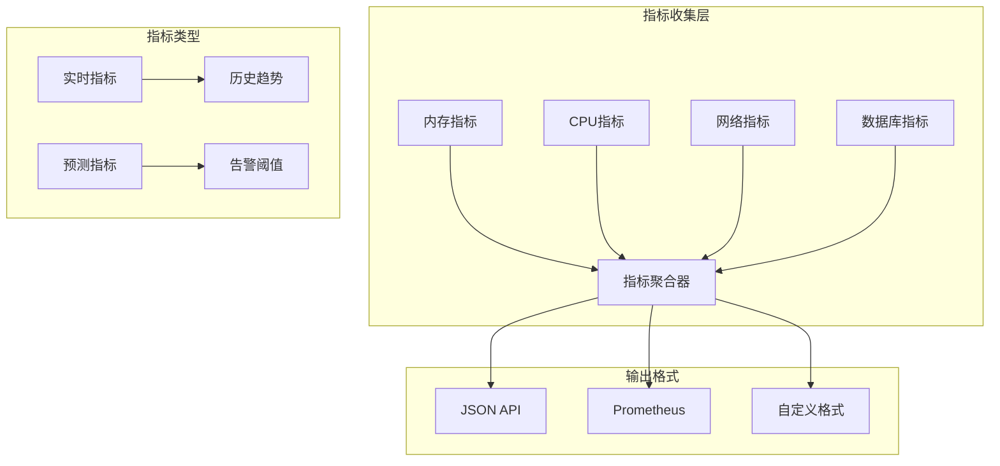

# 监控与日志管理指南

<cite>
**本文档引用的文件**
- [internal/service/health.go](file://internal/service/health.go)
- [pkg/logger/logger.go](file://pkg/logger/logger.go)
- [internal/service/middleware.go](file://internal/service/middleware.go)
- [internal/config/config.go](file://internal/config/config.go)
- [config.yaml](file://config.yaml)
- [config.test.yaml](file://config.test.yaml)
- [docker-compose.yml](file://docker-compose.yml)
- [Dockerfile](file://docker/Dockerfile)
- [DEPLOYMENT.md](file://DEPLOYMENT.md)
- [internal/service/log_cleanup_service.go](file://internal/service/log_cleanup_service.go)
- [internal/cache/monitor.go](file://internal/cache/monitor.go)
</cite>

## 目录
1. [概述](#概述)
2. [健康检查系统](#健康检查系统)
3. [日志管理系统](#日志管理系统)
4. [监控指标收集](#监控指标收集)
5. [部署配置](#部署配置)
6. [故障排查指南](#故障排查指南)
7. [最佳实践](#最佳实践)

## 概述

Mock Server 提供了一套完整的监控与日志管理解决方案，基于 Go 语言的 Gin 框架和 ZAP 日志库构建。系统包含健康检查端点、结构化日志输出、性能监控指标和自动化日志清理等功能。

### 核心特性

- **多层级健康检查**：支持 `/api/v1/system/health`、`/api/v1/live`、`/api/v1/ready` 端点
- **结构化日志**：基于 ZAP 实现 JSON 和文本格式的日志输出
- **性能监控**：内置内存、CPU、网络等系统指标收集
- **自动化运维**：支持日志轮转和自动清理机制
- **多环境适配**：支持 Docker、Kubernetes 和本地部署

## 健康检查系统

### 健康检查端点架构



**图表来源**
- [internal/service/health.go](file://internal/service/health.go#L67-L106)
- [internal/api/health_handler.go](file://internal/api/health_handler.go#L208-L252)

### 健康检查端点详解

#### 1. 系统健康检查 (/api/v1/system/health)

这是主要的健康检查端点，提供全面的服务状态信息：

**请求参数：**
- `detailed` (可选)：设置为 `true` 获取详细的组件状态信息

**响应格式：**
```json
{
  "status": "healthy",
  "version": "0.6.2",
  "app_name": "MockServer",
  "uptime": "1d 2h 30m 45s",
  "timestamp": "2024-01-15T10:30:45Z",
  "components": {
    "database": {
      "status": "healthy",
      "message": "database connection established"
    }
  }
}
```

**状态码映射：**
- `200`：服务健康或降级状态
- `503`：服务完全不可用

#### 2. 存活检查 (/api/v1/live)

最简单的健康检查端点，仅验证服务是否响应：

**响应：**
```json
{
  "status": "alive",
  "timestamp": "2024-01-15T10:30:45Z"
}
```

#### 3. 就绪检查 (/api/v1/ready)

验证服务是否准备好处理请求，包括数据库连接检查：

**响应：**
```json
{
  "status": "ready",
  "timestamp": "2024-01-15T10:30:45Z"
}
```

**章节来源**
- [internal/service/health.go](file://internal/service/health.go#L67-L106)
- [internal/api/health_handler.go](file://internal/api/health_handler.go#L208-L252)

### 健康检查集成方案

#### Docker Compose 集成

```yaml
services:
  mockserver:
    healthcheck:
      test: ["CMD", "curl", "-f", "http://localhost:8080/api/v1/system/health"]
      interval: 30s
      timeout: 10s
      retries: 3
      start_period: 30s
```

#### Kubernetes 集成

```yaml
livenessProbe:
  httpGet:
    path: /api/v1/system/health
    port: 8080
  initialDelaySeconds: 30
  periodSeconds: 10
  
readinessProbe:
  httpGet:
    path: /api/v1/system/health
    port: 8080
  initialDelaySeconds: 10
  periodSeconds: 5
```

## 日志管理系统

### 日志架构设计



**图表来源**
- [pkg/logger/logger.go](file://pkg/logger/logger.go#L13-L71)

### 日志配置详解

#### 配置参数

| 参数 | 类型 | 默认值 | 说明 |
|------|------|--------|------|
| `level` | string | "info" | 日志级别：debug, info, warn, error |
| `format` | string | "json" | 输出格式：json, text |
| `output` | string | "stdout" | 输出目标：stdout, file |
| `file.path` | string | "./logs/mockserver.log" | 日志文件路径 |
| `file.max_size` | int | 100 | 最大文件大小(MB) |
| `file.max_backups` | int | 10 | 最大备份数量 |
| `file.max_age` | int | 30 | 最大保留天数 |

#### 日志级别使用指南

**1. Debug 级别**
- **使用场景**：开发调试、问题排查
- **内容范围**：详细的执行流程、变量值、内部状态
- **配置示例**：
```yaml
logging:
  level: "debug"
  format: "text"
  output: "stdout"
```

**2. Info 级别**（默认）
- **使用场景**：生产环境常规记录
- **内容范围**：服务启动、配置加载、重要业务事件
- **配置示例**：
```yaml
logging:
  level: "info"
  format: "json"
  output: "file"
```

**3. Warn 级别**
- **使用场景**：潜在问题、异常情况
- **内容范围**：配置错误、性能警告、资源不足
- **配置示例**：
```yaml
logging:
  level: "warn"
  format: "json"
  output: "file"
```

**4. Error 级别**
- **使用场景**：错误事件记录
- **内容范围**：系统错误、数据库连接失败、请求处理异常
- **配置示例**：
```yaml
logging:
  level: "error"
  format: "json"
  output: "file"
```

**章节来源**
- [pkg/logger/logger.go](file://pkg/logger/logger.go#L13-L71)
- [config.yaml](file://config.yaml#L48-L58)

### 日志中间件集成

系统提供了三个级别的日志中间件：

#### 1. 请求追踪中间件

为每个请求生成唯一的 `X-Request-ID`，便于请求链路追踪：

```go
// RequestIDMiddleware 生成请求ID中间件
func RequestIDMiddleware() gin.HandlerFunc {
    return func(c *gin.Context) {
        requestID := c.GetHeader(RequestIDHeader)
        if requestID == "" {
            requestID = generateRequestID()
        }
        c.Set(RequestIDKey, requestID)
        c.Header(RequestIDHeader, requestID)
        c.Next()
    }
}
```

#### 2. 性能监控中间件

记录请求处理时间和性能指标：

```go
// PerformanceMiddleware 性能监控中间件
func PerformanceMiddleware() gin.HandlerFunc {
    return func(c *gin.Context) {
        startTime := time.Now()
        path := c.Request.URL.Path
        method := c.Request.Method
        
        c.Next()
        
        duration := time.Since(startTime)
        statusCode := c.Writer.Status()
        
        logger.Info("request completed",
            zap.String("request_id", requestID.(string)),
            zap.String("method", method),
            zap.String("path", path),
            zap.Int("status", statusCode),
            zap.Duration("duration", duration),
            zap.String("client_ip", c.ClientIP()),
        )
        
        if duration > time.Second {
            logger.Warn("slow request detected",
                zap.String("request_id", requestID.(string)),
                zap.String("method", method),
                zap.String("path", path),
                zap.Duration("duration", duration),
            )
        }
    }
}
```

#### 3. 调试日志中间件

记录详细的请求信息：

```go
// LoggingMiddleware 日志中间件
func LoggingMiddleware() gin.HandlerFunc {
    return func(c *gin.Context) {
        requestID, exists := c.Get(RequestIDKey)
        if !exists {
            requestID = "unknown"
        }
        
        logger.Debug("incoming request",
            zap.String("request_id", requestID.(string)),
            zap.String("method", c.Request.Method),
            zap.String("path", c.Request.URL.Path),
            zap.String("client_ip", c.ClientIP()),
            zap.String("user_agent", c.Request.UserAgent()),
        )
        
        c.Next()
    }
}
```

**章节来源**
- [internal/service/middleware.go](file://internal/service/middleware.go#L18-L134)

### 日志收集与聚合

#### Docker 环境日志配置

**Docker Compose 配置：**
```yaml
services:
  mockserver:
    volumes:
      - ./logs:/root/logs
    logging:
      driver: "json-file"
      options:
        max-size: "100m"
        max-file: "3"
```

**日志驱动配置：**
```yaml
logging:
  driver: "json-file"
  options:
    max-size: "100m"
    max-file: "5"
    compress: "true"
```

#### Kubernetes 环境日志聚合

**ConfigMap 配置：**
```yaml
apiVersion: v1
kind: ConfigMap
metadata:
  name: mockserver-logging
data:
  logging.yaml: |
    level: "info"
    format: "json"
    output: "stdout"
    file:
      path: "/var/log/mockserver/app.log"
      max_size: 50
      max_backups: 5
      max_age: 7
```

**日志收集器配置：**
```yaml
apiVersion: v1
kind: Service
metadata:
  name: mockserver-logging
spec:
  selector:
    app: mockserver
  ports:
  - port: 8080
    targetPort: 8080
  type: ClusterIP
```

**章节来源**
- [docker-compose.yml](file://docker-compose.yml#L44-L76)
- [DEPLOYMENT.md](file://DEPLOYMENT.md#L376-L410)

## 监控指标收集

### 系统指标架构



**图表来源**
- [internal/cache/monitor.go](file://internal/cache/monitor.go#L150-L228)

### 性能监控指标

#### 1. 系统运行时指标

| 指标类别 | 指标名称 | 数据类型 | 说明 |
|----------|----------|----------|------|
| 运行时信息 | uptime | Duration | 服务运行时间 |
| 运行时信息 | go_version | String | Go版本信息 |
| 运行时信息 | num_cpu | Int | CPU核心数 |
| 运行时信息 | goos | String | 操作系统 |
| 运行时信息 | goarch | String | 架构类型 |

#### 2. 内存使用指标

| 指标名称 | 类型 | 说明 |
|----------|------|------|
| alloc | Int64 | 当前分配的内存量 |
| total_alloc | Int64 | 累计分配的内存量 |
| sys | Int64 | 系统分配的内存量 |
| num_gc | Int64 | GC执行次数 |
| heap_alloc | Int64 | 堆内存分配量 |
| heap_sys | Int64 | 堆内存系统分配量 |
| heap_inuse | Int64 | 堆内存使用量 |
| stack_inuse | Int64 | 栈内存使用量 |
| gc_cpu_fraction | Float64 | GC CPU占比 |

#### 3. 网络连接指标

| 指标名称 | 类型 | 说明 |
|----------|------|------|
| bytes_transferred | Int64 | 传输字节数 |
| connections_count | Int64 | 连接总数 |
| active_connections | Int64 | 活跃连接数 |
| network_latency | Duration | 网络延迟 |
| throughput_mb | Float64 | 吞吐量(MB/s) |
| error_rate | Float64 | 错误率 |
| retries | Int64 | 重试次数 |

#### 4. 缓存性能指标

| 指标名称 | 类型 | 说明 |
|----------|------|------|
| hit_rate | Float64 | 缓存命中率 |
| miss_rate | Float64 | 缓存未命中率 |
| evictions | Int64 | 缓存驱逐次数 |
| memory_usage | Int64 | 缓存内存使用量 |

### 监控告警策略

#### 关键指标阈值

**内存使用告警：**
- 警告：内存使用率 > 70%
- 严重：内存使用率 > 85%

**响应时间告警：**
- 警告：平均响应时间 > 500ms
- 严重：平均响应时间 > 1000ms

**错误率告警：**
- 警告：错误率 > 1%
- 严重：错误率 > 5%

**连接数告警：**
- 警告：活跃连接数 > 80% 最大值
- 严重：活跃连接数 > 95% 最大值

#### 自动化监控配置

```yaml
# 性能配置
performance:
  log_retention_days: 7
  cache:
    rule_ttl: 300      # 规则缓存时间（秒）
    config_ttl: 1800   # 配置缓存时间（秒）
  rate_limit:
    enabled: true
    ip_limit: 1000     # 每分钟每IP请求数
    global_limit: 10000 # 每秒全局请求数
  timeout:
    health_check: 2s    # 健康检查超时
    slow_request_threshold: 1s # 慢请求阈值
```

**章节来源**
- [internal/cache/monitor.go](file://internal/cache/monitor.go#L150-L228)
- [config.yaml](file://config.yaml#L60-L82)

### 日志清理服务

系统提供了自动化的日志清理服务，支持按时间策略清理过期日志：

#### 清理策略配置

```go
// 日志清理服务
type LogCleanupService struct {
    repo           repository.RequestLogRepository
    retentionDays  int
    cleanupEnabled bool
    stopChan       chan struct{}
}

// 创建清理服务
func NewLogCleanupService(repo repository.RequestLogRepository, retentionDays int) *LogCleanupService {
    if retentionDays <= 0 {
        retentionDays = 7 // 默认保留7天
    }
    return &LogCleanupService{
        repo:           repo,
        retentionDays:  retentionDays,
        cleanupEnabled: true,
        stopChan:       make(chan struct{}),
    }
}
```

#### 清理调度

```go
func (s *LogCleanupService) Start() {
    logger.Info("log cleanup service started", zap.Int("retention_days", s.retentionDays))
    
    // 立即执行一次清理
    s.cleanup()
    
    // 每天凌晨2点执行清理
    ticker := time.NewTicker(24 * time.Hour)
    defer ticker.Stop()
    
    for {
        select {
        case <-ticker.C:
            s.cleanup()
        case <-s.stopChan:
            return
        }
    }
}
```

**章节来源**
- [internal/service/log_cleanup_service.go](file://internal/service/log_cleanup_service.go#L65-L119)

## 部署配置

### Docker 部署

#### Dockerfile 配置

```dockerfile
# 构建阶段
FROM golang:alpine AS builder
WORKDIR /app
ENV GOPROXY=https://mirrors.aliyun.com/goproxy,direct
RUN apk add --no-cache git
COPY go.mod go.sum ./
RUN go mod download
COPY . .
RUN CGO_ENABLED=0 GOOS=linux go build -v -a -installsuffix cgo -o mockserver ./cmd/mockserver

# 运行阶段
FROM alpine:latest
WORKDIR /root/
COPY --from=builder /app/mockserver .
COPY --from=builder /app/config.yaml .
EXPOSE 8080 9090
CMD ["./mockserver", "-config", "./config.yaml"]
```

#### Docker Compose 配置

```yaml
version: '3.8'
services:
  mongodb:
    image: mongo:6.0
    container_name: mockserver-mongodb
    restart: always
    ports:
      - "27017:27017"
    volumes:
      - mongodb_data:/data/db
    networks:
      - mockserver-network
    healthcheck:
      test: echo 'db.runCommand("ping").ok' | mongosh localhost:27017/test --quiet
      interval: 10s
      timeout: 5s
      retries: 5
      start_period: 10s

  mockserver:
    build:
      context: .
      dockerfile: docker/Dockerfile
    container_name: mockserver-app
    restart: always
    ports:
      - "8080:8080"
      - "9090:9090"
    environment:
      - TZ=Asia/Shanghai
    depends_on:
      mongodb:
        condition: service_healthy
    volumes:
      - ./config.yaml:/root/config.yaml
      - ./logs:/root/logs
    networks:
      - mockserver-network
    healthcheck:
      test: ["CMD", "curl", "-f", "http://localhost:8080/api/v1/system/health"]
      interval: 30s
      timeout: 10s
      retries: 3
      start_period: 30s

volumes:
  mongodb_data:

networks:
  mockserver-network:
    driver: bridge
```

**章节来源**
- [Dockerfile](file://docker/Dockerfile#L1-L36)
- [docker-compose.yml](file://docker-compose.yml#L1-L83)

### Kubernetes 部署

#### ConfigMap 配置

```yaml
apiVersion: v1
kind: ConfigMap
metadata:
  name: mockserver-config
data:
  config.yaml: |
    server:
      admin:
        host: "0.0.0.0"
        port: 8080
      mock:
        host: "0.0.0.0"
        port: 9090
    database:
      mongodb:
        uri: "mongodb://mongodb-service:27017"
        database: "mockserver"
        timeout: 10s
        pool:
          min: 10
          max: 100
    logging:
      level: "info"
      format: "json"
      output: "stdout"
```

#### Deployment 配置

```yaml
apiVersion: apps/v1
kind: Deployment
metadata:
  name: mockserver
spec:
  replicas: 3
  selector:
    matchLabels:
      app: mockserver
  template:
    metadata:
      labels:
        app: mockserver
    spec:
      containers:
      - name: mockserver
        image: mockserver:latest
        ports:
        - containerPort: 8080
          name: admin
        - containerPort: 9090
          name: mock
        volumeMounts:
        - name: config
          mountPath: /root/config.yaml
          subPath: config.yaml
        livenessProbe:
          httpGet:
            path: /api/v1/system/health
            port: 8080
          initialDelaySeconds: 30
          periodSeconds: 10
        readinessProbe:
          httpGet:
            path: /api/v1/system/health
            port: 8080
          initialDelaySeconds: 10
          periodSeconds: 5
      volumes:
      - name: config
        configMap:
          name: mockserver-config
```

**章节来源**
- [DEPLOYMENT.md](file://DEPLOYMENT.md#L376-L534)

## 故障排查指南

### 常见问题诊断

#### 1. 服务启动失败

**症状**：服务启动后立即退出或无法访问

**排查步骤**：
```bash
# 1. 查看容器日志
docker-compose logs mockserver

# 2. 检查端口占用
netstat -tulpn | grep :8080
netstat -tulpn | grep :9090

# 3. 检查配置文件语法
docker-compose config

# 4. 查看系统资源
docker stats mockserver
```

**解决方案**：
- 检查配置文件语法错误
- 确认端口未被占用
- 验证 MongoDB 连接配置
- 检查磁盘空间和权限

#### 2. 数据库连接问题

**症状**：健康检查返回数据库连接失败

**排查步骤**：
```bash
# 1. 检查 MongoDB 服务状态
docker-compose ps mongodb

# 2. 测试 MongoDB 连接
docker exec -it mockserver-mongodb mongosh

# 3. 查看 MongoDB 日志
docker-compose logs mongodb

# 4. 检查网络连通性
docker network inspect mockserver_mockserver-network
```

**解决方案**：
- 确认 MongoDB 服务已启动且健康
- 检查连接字符串配置
- 验证网络隔离设置
- 检查防火墙规则

#### 3. 性能问题

**症状**：响应时间过长或频繁超时

**排查步骤**：
```bash
# 1. 查看系统资源使用
docker stats mockserver

# 2. 检查慢查询日志
docker-compose logs mockserver | grep "slow request"

# 3. 分析内存使用
docker exec mockserver-app cat /proc/meminfo

# 4. 检查 GC 状态
docker exec mockserver-app cat /proc/<pid>/status
```

**解决方案**：
- 启用 Redis 缓存
- 增加连接池大小
- 优化查询条件
- 调整垃圾回收参数

#### 4. 日志问题

**症状**：日志丢失或格式异常

**排查步骤**：
```bash
# 1. 检查日志配置
cat config.yaml | grep logging

# 2. 查看日志文件权限
ls -la logs/

# 3. 检查磁盘空间
df -h logs/

# 4. 验证日志轮转
docker-compose logs mockserver | grep "log rotation"
```

**解决方案**：
- 调整日志级别为合适的值
- 检查磁盘空间和权限
- 配置适当的日志轮转参数
- 启用文件输出模式

### 监控告警配置

#### Prometheus 集成

```yaml
# prometheus.yml
global:
  scrape_interval: 15s

scrape_configs:
  - job_name: 'mockserver'
    static_configs:
      - targets: ['mockserver:8080']
    metrics_path: '/api/v1/metrics'
    scrape_interval: 30s
```

#### Grafana 仪表板

```json
{
  "dashboard": {
    "title": "Mock Server 监控",
    "panels": [
      {
        "title": "服务健康状态",
        "type": "stat",
        "targets": [
          {
            "expr": "mockserver_health_status"
          }
        ]
      },
      {
        "title": "响应时间",
        "type": "graph",
        "targets": [
          {
            "expr": "histogram_quantile(0.95, mockserver_request_duration_seconds)"
          }
        ]
      }
    ]
  }
}
```

**章节来源**
- [DEPLOYMENT.md](file://DEPLOYMENT.md#L693-L824)

## 最佳实践

### 生产环境配置

#### 1. 日志配置优化

```yaml
# 生产环境推荐配置
logging:
  level: "info"           # 生产环境使用 info 级别
  format: "json"          # 使用 JSON 格式便于解析
  output: "file"          # 输出到文件
  file:
    path: "/var/log/mockserver/app.log"
    max_size: 100         # 100MB 文件大小
    max_backups: 10       # 保留 10 个备份
    max_age: 30           # 保留 30 天
```

#### 2. 健康检查配置

```yaml
# 健康检查优化配置
performance:
  timeout:
    health_check: 2s        # 2秒超时
    slow_request_threshold: 1s # 1秒慢请求阈值
  rate_limit:
    enabled: true
    ip_limit: 1000          # 每分钟1000次
    global_limit: 10000     # 每秒10000次
```

#### 3. 监控指标配置

```yaml
# 监控指标配置
features:
  metrics: true           # 启用指标收集
  audit_log: true         # 启用审计日志
  version_control: true   # 启用版本控制
```

### 运维自动化

#### 1. 自动化部署脚本

```bash
#!/bin/bash
# 自动化部署脚本

# 停止旧服务
docker-compose down

# 更新代码
git pull origin main

# 构建新镜像
docker-compose build

# 启动新服务
docker-compose up -d

# 验证健康状态
sleep 30
curl -f http://localhost:8080/api/v1/system/health

if [ $? -eq 0 ]; then
    echo "部署成功"
else
    echo "部署失败"
    exit 1
fi
```

#### 2. 日志分析脚本

```bash
#!/bin/bash
# 日志分析脚本

# 分析错误日志
grep -E "(ERROR|FATAL)" logs/mockserver.log | tail -100

# 分析慢请求
grep "slow request" logs/mockserver.log | wc -l

# 分析内存使用
docker stats --no-stream --format "table {{.Container}}\t{{.CPUPerc}}\t{{.MemUsage}}"

# 分析磁盘使用
du -sh logs/
```

#### 3. 性能基准测试

```bash
#!/bin/bash
# 性能测试脚本

# 基准测试
wrk -t12 -c400 -d30s http://localhost:8080/api/v1/system/health

# 并发测试
ab -n 10000 -c 100 http://localhost:8080/api/v1/system/health

# 压力测试
siege -c100 -t30S http://localhost:8080/api/v1/system/health
```

### 安全配置建议

#### 1. 生产环境安全配置

```yaml
# 安全配置
security:
  jwt:
    secret: "your-strong-secret-key-here"  # 强密钥
    expiration: 7200                      # 2小时过期
  api_key:
    enabled: true                         # 启用 API Key
  ip_whitelist:
    enabled: true
    ips:
      - "192.168.1.0/24"                  # 限制可信网段
      - "10.0.0.0/8"
```

#### 2. 网络安全

```yaml
# 网络配置
server:
  admin:
    host: "127.0.0.1"                     # 仅本地访问
  mock:
    host: "0.0.0.0"                       # 可选：限制到特定网段
```

#### 3. 资源限制

```yaml
# Docker 资源限制
services:
  mockserver:
    deploy:
      resources:
        limits:
          cpus: '2.0'
          memory: 2G
        reservations:
          cpus: '1.0'
          memory: 1G
```

### 监控告警规则

#### 1. 关键指标告警

```yaml
# alertmanager.yml
groups:
  - name: mockserver.rules
    rules:
      - alert: MockServerDown
        expr: up{job="mockserver"} == 0
        for: 1m
        labels:
          severity: critical
        annotations:
          summary: "Mock Server 服务不可用"
          
      - alert: HighErrorRate
        expr: rate(mockserver_request_errors_total[5m]) > 0.1
        for: 2m
        labels:
          severity: warning
        annotations:
          summary: "Mock Server 错误率过高"
          
      - alert: HighMemoryUsage
        expr: container_memory_usage_bytes > 1.5G
        for: 5m
        labels:
          severity: warning
        annotations:
          summary: "Mock Server 内存使用过高"
```

#### 2. 日志告警

```yaml
# 日志告警规则
groups:
  - name: mockserver.logs
    rules:
      - alert: ErrorLogRate
        expr: increase(log_messages_total{level="error"}[5m]) > 100
        for: 1m
        labels:
          severity: warning
        annotations:
          summary: "Mock Server 错误日志速率过高"
```

通过遵循这些最佳实践，您可以确保 Mock Server 在生产环境中稳定、高效地运行，并具备完善的监控和日志管理能力。