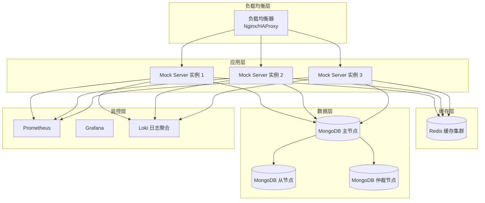
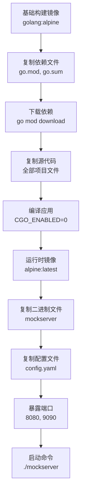
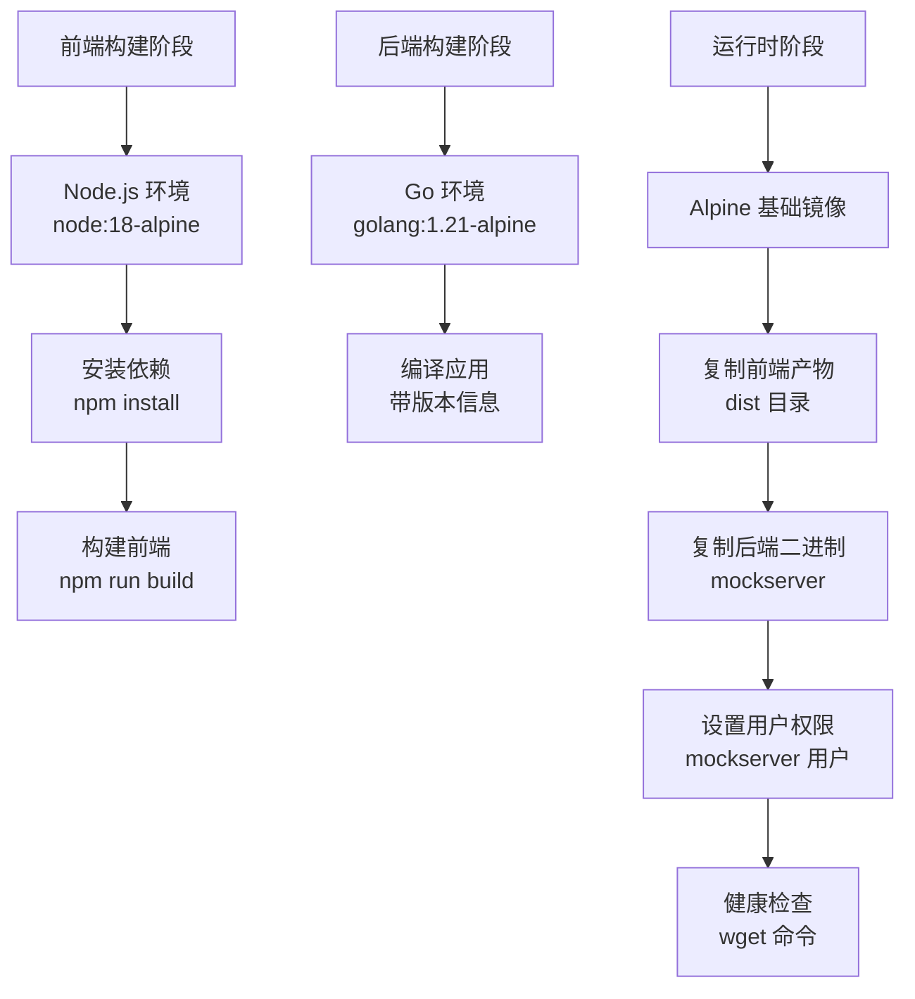
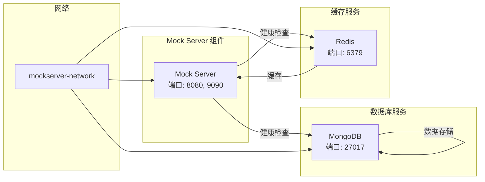
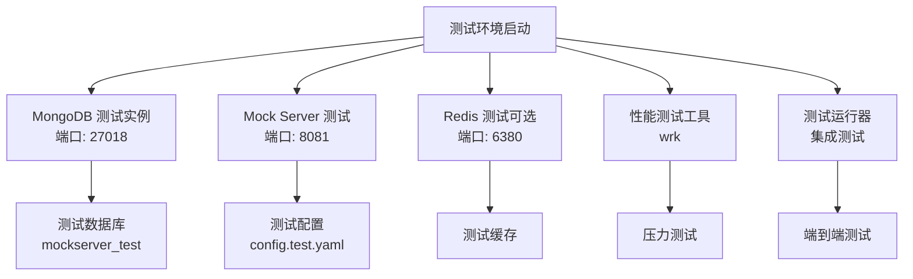
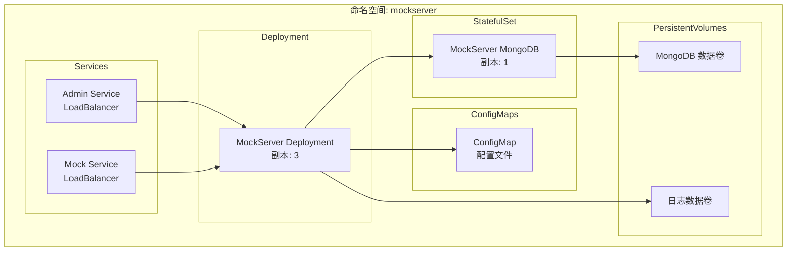
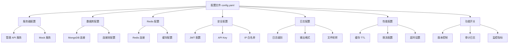
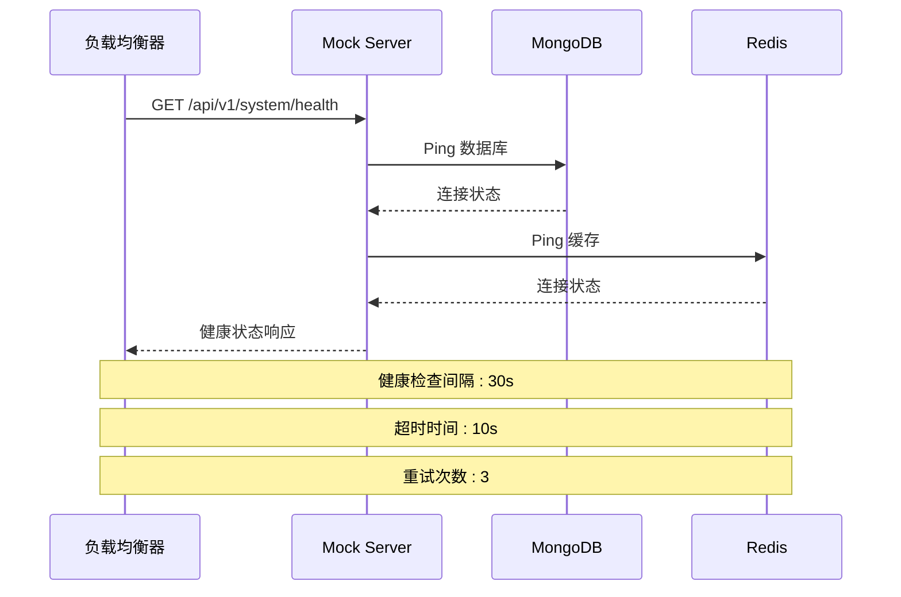
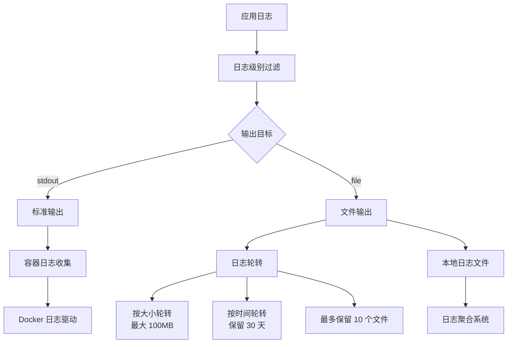
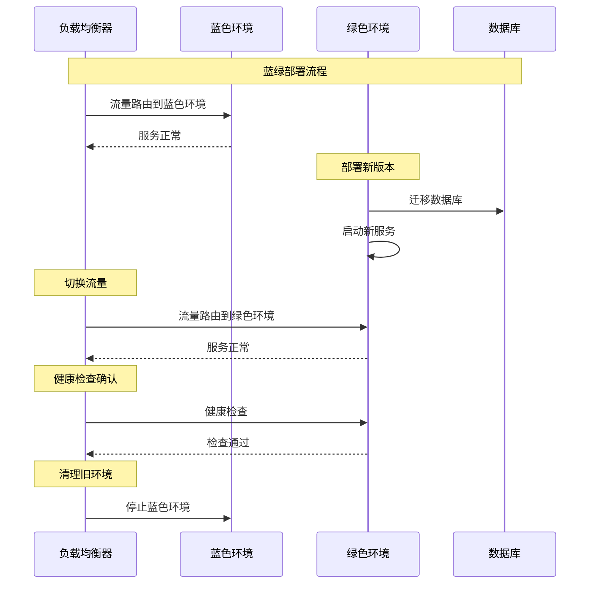

# 部署与运维

<cite>
**本文档引用的文件**
- [Dockerfile](file://docker/Dockerfile)
- [docker-compose.yml](file://docker-compose.yml)
- [docker-compose.test.yml](file://docker-compose.test.yml)
- [DEPLOYMENT.md](file://DEPLOYMENT.md)
- [config.yaml](file://config.yaml)
- [config.test.yaml](file://config.test.yaml)
- [Makefile](file://Makefile)
- [pkg/logger/logger.go](file://pkg/logger/logger.go)
- [internal/service/health.go](file://internal/service/health.go)
- [internal/api/health_handler.go](file://internal/api/health_handler.go)
</cite>

## 目录
1. [概述](#概述)
2. [部署架构](#部署架构)
3. [Docker 镜像构建](#docker-镜像构建)
4. [容器编排](#容器编排)
5. [Kubernetes 部署](#kubernetes-部署)
6. [配置管理](#配置管理)
7. [健康检查与监控](#健康检查与监控)
8. [日志收集](#日志收集)
9. [性能监控](#性能监控)
10. [故障排查](#故障排查)
11. [生产环境最佳实践](#生产环境最佳实践)
12. [升级与维护](#升级与维护)

## 概述

Mock Server 是一个基于 Go 的高性能 Mock 服务，支持多种部署方式以满足不同环境需求。本指南涵盖了从开发测试到生产环境的完整部署方案，包括 Docker 容器化、Kubernetes 集群部署以及传统服务器部署。

### 支持的部署方式

| 部署方式 | 适用场景 | 复杂度 | 推荐度 |
|---------|---------|-------|--------|
| 🐳 Docker Compose | 快速体验、开发测试 | ⭐⭐ | ⭐⭐⭐⭐⭐ |
| 🏗️ 本地部署 | 开发调试、源码定制 | ⭐⭐⭐ | ⭐⭐⭐ |
| ☸️ Kubernetes | 生产环境、高可用 | ⭐⭐⭐⭐ | ⭐⭐⭐⭐ |
| 🐳 Docker 单容器 | 特定环境、微服务 | ⭐⭐ | ⭐⭐⭐ |

## 部署架构

Mock Server 采用多层架构设计，支持水平扩展和高可用部署：



**图表来源**
- [docker-compose.yml](file://docker-compose.yml#L1-L83)
- [DEPLOYMENT.md](file://DEPLOYMENT.md#L377-L550)

## Docker 镜像构建

### 基础镜像构建

项目提供了三种不同用途的 Docker 镜像：

#### 1. 后端服务镜像 (Dockerfile)
适用于生产环境的单体镜像，包含完整的后端服务：



**图表来源**
- [docker/Dockerfile](file://docker/Dockerfile#L1-L36)

#### 2. 全栈镜像 (Dockerfile.fullstack)
包含前端和后端的完整镜像，支持静态文件服务：



**图表来源**
- [docker/Dockerfile.fullstack](file://docker/Dockerfile.fullstack#L1-L121)

#### 3. 测试镜像 (Dockerfile.test)
专为 CI/CD 和测试环境设计：


**图表来源**
- [docker/Dockerfile.test](file://docker/Dockerfile.test#L1-L51)

### 镜像构建命令

使用 Makefile 简化构建过程：

```bash
# 构建后端镜像
make docker-build

# 构建全栈镜像
make docker-build-full

# 自定义标签构建
docker build -f docker/Dockerfile -t mockserver:v1.0.0 .
```

**章节来源**
- [Makefile](file://Makefile#L347-L357)
- [docker/Dockerfile](file://docker/Dockerfile#L1-L36)
- [docker/Dockerfile.fullstack](file://docker/Dockerfile.fullstack#L1-L121)

## 容器编排

### Docker Compose 部署

Docker Compose 是最简单和推荐的部署方式，适合开发测试和快速部署。

#### 服务架构



**图表来源**
- [docker-compose.yml](file://docker-compose.yml#L1-L83)

#### 配置要点

1. **环境变量覆盖**：通过 `environment` 字段设置
2. **数据持久化**：使用 `volumes` 挂载数据卷
3. **健康检查**：内置健康检查机制
4. **服务依赖**：通过 `depends_on` 控制启动顺序

#### 部署命令

```bash
# 启动服务
docker-compose up -d

# 查看服务状态
docker-compose ps

# 查看日志
docker-compose logs -f

# 停止服务
docker-compose stop

# 完全清理
docker-compose down -v
```

### 测试环境配置

测试环境使用独立的 compose 文件，支持多种测试场景：



**图表来源**
- [docker-compose.test.yml](file://docker-compose.test.yml#L1-L126)

**章节来源**
- [docker-compose.yml](file://docker-compose.yml#L1-L83)
- [docker-compose.test.yml](file://docker-compose.test.yml#L1-L126)

## Kubernetes 部署

### 部署架构

Kubernetes 部署提供高可用性和弹性伸缩能力：



**图表来源**
- [DEPLOYMENT.md](file://DEPLOYMENT.md#L377-L550)

### 配置清单

#### 1. ConfigMap 配置

```yaml
apiVersion: v1
kind: ConfigMap
metadata:
  name: mockserver-config
data:
  config.yaml: |
    server:
      admin:
        host: "0.0.0.0"
        port: 8080
      mock:
        host: "0.0.0.0"
        port: 9090
    database:
      mongodb:
        uri: "mongodb://mongodb-service:27017"
        database: "mockserver"
        timeout: 10s
        pool:
          min: 10
          max: 100
    logging:
      level: "info"
      format: "json"
      output: "stdout"
```

#### 2. MongoDB StatefulSet

```yaml
apiVersion: apps/v1
kind: StatefulSet
metadata:
  name: mongodb
spec:
  serviceName: mongodb-service
  replicas: 1
  selector:
    matchLabels:
      app: mongodb
  template:
    metadata:
      labels:
        app: mongodb
    spec:
      containers:
      - name: mongodb
        image: mongo:6.0
        ports:
        - containerPort: 27017
        volumeMounts:
        - name: mongodb-data
          mountPath: /data/db
  volumeClaimTemplates:
  - metadata:
      name: mongodb-data
    spec:
      accessModes: ["ReadWriteOnce"]
      resources:
        requests:
          storage: 20Gi
```

#### 3. Mock Server Deployment

```yaml
apiVersion: apps/v1
kind: Deployment
metadata:
  name: mockserver
spec:
  replicas: 3
  selector:
    matchLabels:
      app: mockserver
  template:
    metadata:
      labels:
        app: mockserver
    spec:
      containers:
      - name: mockserver
        image: mockserver:latest
        ports:
        - containerPort: 8080
          name: admin
        - containerPort: 9090
          name: mock
        volumeMounts:
        - name: config
          mountPath: /root/config.yaml
          subPath: config.yaml
        livenessProbe:
          httpGet:
            path: /api/v1/system/health
            port: 8080
          initialDelaySeconds: 30
          periodSeconds: 10
        readinessProbe:
          httpGet:
            path: /api/v1/system/health
            port: 8080
          initialDelaySeconds: 10
          periodSeconds: 5
      volumes:
      - name: config
        configMap:
          name: mockserver-config
```

### 部署命令

```bash
# 应用配置
kubectl apply -f k8s/configmap.yaml
kubectl apply -f k8s/mongodb.yaml
kubectl apply -f k8s/mockserver.yaml

# 查看部署状态
kubectl get pods
kubectl get services

# 查看日志
kubectl logs -f deployment/mockserver
```

**章节来源**
- [DEPLOYMENT.md](file://DEPLOYMENT.md#L377-L550)

## 配置管理

### 配置文件结构

Mock Server 使用 YAML 格式的配置文件，支持环境变量覆盖：



**图表来源**
- [config.yaml](file://config.yaml#L1-L91)
- [config.test.yaml](file://config.test.yaml#L1-L80)

### 环境变量覆盖

支持通过环境变量覆盖配置文件中的设置：

| 环境变量 | 描述 | 示例值 |
|---------|------|--------|
| `SERVER_ADMIN_PORT` | 管理 API 端口 | `8080` |
| `SERVER_MOCK_PORT` | Mock 服务端口 | `9090` |
| `DATABASE_MONGODB_URI` | MongoDB 连接字符串 | `mongodb://localhost:27017` |
| `LOGGING_LEVEL` | 日志级别 | `debug` |
| `REDIS_URL` | Redis 连接 URL | `redis://localhost:6379` |
| `TZ` | 时区设置 | `Asia/Shanghai` |

### 配置文件挂载

在 Docker 部署中，可以通过卷挂载自定义配置：

```yaml
# docker-compose.yml
services:
  mockserver:
    volumes:
      - ./custom-config.yaml:/root/config.yaml
      - ./logs:/root/logs
```

### 持久化数据卷

确保关键数据的持久化：

```yaml
volumes:
  mongodb_data: # MongoDB 数据
  redis_data:   # Redis 数据
  logs:         # 应用日志
```

**章节来源**
- [config.yaml](file://config.yaml#L1-L91)
- [config.test.yaml](file://config.test.yaml#L1-L80)

## 健康检查与监控

### 健康检查端点

Mock Server 提供了完善的健康检查机制：



**图表来源**
- [internal/service/health.go](file://internal/service/health.go#L68-L106)
- [internal/api/health_handler.go](file://internal/api/health_handler.go#L86-L136)

### 健康检查 API

#### 1. 基础健康检查

```bash
# 简单健康检查
curl http://localhost:8080/api/v1/system/health

# 响应示例
{
  "status": "healthy",
  "version": "v1.0.0",
  "app_name": "Mock Server",
  "uptime": "1h 30m 45s",
  "timestamp": "2024-01-15T10:30:00Z"
}
```

#### 2. 详细健康检查

```bash
# 包含组件状态的详细检查
curl "http://localhost:8080/api/v1/system/health?detailed=true"

# 响应示例
{
  "status": "degraded",
  "version": "v1.0.0",
  "app_name": "Mock Server",
  "uptime": "1h 30m 45s",
  "timestamp": "2024-01-15T10:30:00Z",
  "components": {
    "database": {
      "status": "healthy",
      "message": "database connection established"
    },
    "cache": {
      "status": "unhealthy",
      "message": "cache connection failed",
      "details": {
        "error": "dial tcp: connection refused"
      }
    }
  }
}
```

### 监控集成方案

#### 1. Prometheus 监控指标

```yaml
# Prometheus 配置
scrape_configs:
  - job_name: 'mockserver'
    static_configs:
      - targets: ['mockserver:8080']
    metrics_path: '/api/v1/metrics'
    scrape_interval: 15s
```

#### 2. Grafana 仪表板

监控关键指标：
- 服务可用性
- 响应时间
- 错误率
- 数据库连接状态
- 缓存命中率

#### 3. 自定义健康检查脚本

```bash
#!/bin/bash
# 自定义健康检查脚本

check_service() {
    local url=$1
    local timeout=5
    
    if curl -f -s --max-time $timeout "$url" > /dev/null; then
        echo "✓ 服务正常: $url"
        return 0
    else
        echo "✗ 服务异常: $url"
        return 1
    fi
}

# 检查 Mock Server
check_service "http://localhost:8080/api/v1/system/health"

# 检查数据库
check_service "http://localhost:8080/api/v1/system/health?detailed=true"
```

**章节来源**
- [internal/service/health.go](file://internal/service/health.go#L68-L156)
- [internal/api/health_handler.go](file://internal/api/health_handler.go#L86-L151)

## 日志收集

### 日志配置

Mock Server 使用 zap 日志库，支持多种输出格式和轮转策略：



**图表来源**
- [pkg/logger/logger.go](file://pkg/logger/logger.go#L1-L116)

### 日志配置选项

#### 1. 日志级别

| 级别 | 描述 | 使用场景 |
|------|------|----------|
| `debug` | 调试信息 | 开发环境，问题排查 |
| `info` | 常规信息 | 生产环境默认 |
| `warn` | 警告信息 | 潜在问题提醒 |
| `error` | 错误信息 | 异常情况记录 |

#### 2. 输出格式

| 格式 | 特点 | 适用场景 |
|------|------|----------|
| `json` | 结构化，便于解析 | 生产环境，日志聚合 |
| `text` | 可读性强 | 开发调试 |

#### 3. 文件轮转配置

```yaml
logging:
  level: "info"
  format: "json"
  output: "file"
  file:
    path: "./logs/mockserver.log"
    max_size: 100      # MB
    max_backups: 10
    max_age: 30        # days
```

### Docker 日志收集

#### 1. Docker 日志驱动

```bash
# 使用 json-file 驱动（默认）
docker run -d --log-driver=json-file \
  --log-opt max-size=100m \
  --log-opt max-file=10 \
  mockserver:latest

# 使用 syslog 驱动
docker run -d --log-driver=syslog \
  --log-opt syslog-address=udp://localhost:514 \
  mockserver:latest
```

#### 2. Docker Compose 日志配置

```yaml
services:
  mockserver:
    logging:
      driver: json-file
      options:
        max-size: "100m"
        max-file: "10"
```

### 日志聚合系统

#### 1. ELK Stack 集成

```yaml
# Elasticsearch 配置
elasticsearch:
  image: docker.elastic.co/elasticsearch/elasticsearch:8.0.0
  environment:
    - discovery.type=single-node
    - xpack.security.enabled=false

# Logstash 配置
logstash:
  image: docker.elastic.co/logstash/logstash:8.0.0
  volumes:
    - ./logstash.conf:/usr/share/logstash/pipeline/logstash.conf
  command: logstash -f /usr/share/logstash/pipeline/logstash.conf

# Kibana 配置
kibana:
  image: docker.elastic.co/kibana/kibana:8.0.0
  ports:
    - "5601:5601"
```

#### 2. Fluentd 配置

```yaml
# fluentd 配置
<source>
  @type forward
</source>

<match mockserver.**>
  @type elasticsearch
  host elasticsearch
  port 9200
  index_name mockserver
</match>
```

### 日志分析脚本

```bash
#!/bin/bash
# 日志分析脚本

LOG_FILE="/var/log/mockserver/mockserver.log"

# 统计错误数量
error_count=$(grep -c "level=error" $LOG_FILE)

# 统计警告数量
warn_count=$(grep -c "level=warn" $LOG_FILE)

# 统计最近1小时的请求量
hourly_requests=$(grep "$(date -d '1 hour ago' '+%Y-%m-%d %H')" $LOG_FILE | wc -l)

echo "错误数量: $error_count"
echo "警告数量: $warn_count"
echo "每小时请求数: $hourly_requests"
```

**章节来源**
- [pkg/logger/logger.go](file://pkg/logger/logger.go#L1-L116)
- [config.yaml](file://config.yaml#L49-L58)

## 性能监控

### 监控指标体系

Mock Server 提供了全面的性能监控指标：


### 关键性能指标

#### 1. 系统资源监控

| 指标 | 监控阈值 | 告警级别 |
|------|----------|----------|
| CPU 使用率 | > 80% | 警告 |
| 内存使用率 | > 85% | 警告 |
| 磁盘使用率 | > 90% | 严重 |
| 网络带宽 | > 95% | 警告 |

#### 2. 应用性能指标

| 指标 | 目标值 | 监控方法 |
|------|--------|----------|
| 平均响应时间 | < 100ms | 应用内部统计 |
| 错误率 | < 0.1% | 错误计数器 |
| QPS | 根据业务需求 | 请求计数器 |
| 并发连接数 | < 10000 | 连接池监控 |

#### 3. 数据库性能监控

```yaml
# 数据库监控配置
database:
  mongodb:
    pool:
      min: 10
      max: 100
    timeout: 10s
performance:
  timeout:
    database_query: 10s
    database_write: 15s
```

### 监控工具集成

#### 1. Prometheus + Grafana

```yaml
# prometheus.yml
global:
  scrape_interval: 15s

scrape_configs:
  - job_name: 'mockserver'
    static_configs:
      - targets: ['mockserver:8080']
    metrics_path: '/api/v1/metrics'
    scrape_interval: 15s
```

#### 2. 自定义监控脚本

```bash
#!/bin/bash
# 性能监控脚本

# 检查服务状态
check_service_health() {
    local response=$(curl -s -o /dev/null -w "%{http_code}" http://localhost:8080/api/v1/system/health)
    if [ "$response" -eq 200 ]; then
        echo "✓ 服务健康"
    else
        echo "✗ 服务异常: HTTP $response"
    fi
}

# 检查响应时间
check_response_time() {
    local start_time=$(date +%s%N)
    curl -s -o /dev/null http://localhost:8080/api/v1/system/health
    local end_time=$(date +%s%N)
    local duration=$((($end_time - $start_time) / 1000000))
    
    echo "响应时间: ${duration}ms"
}

# 检查资源使用
check_resources() {
    local cpu_usage=$(top -bn1 | grep "Cpu(s)" | awk '{print $2}' | cut -d'%' -f1)
    local mem_usage=$(free | grep Mem | awk '{printf "%.1f", $3/$2 * 100.0}')
    
    echo "CPU 使用率: ${cpu_usage}%"
    echo "内存使用率: ${mem_usage}%"
}
```

**章节来源**
- [internal/api/health_handler.go](file://internal/api/health_handler.go#L56-L151)

## 故障排查

### 常见问题诊断

#### 1. 服务启动失败

**症状**：容器启动后立即退出或无法启动

**排查步骤**：

```bash
# 1. 查看容器日志
docker logs mockserver-app

# 2. 检查端口占用
netstat -tulpn | grep :8080
netstat -tulpn | grep :9090

# 3. 检查配置文件语法
docker exec mockserver-app cat /root/config.yaml | yaml-lint

# 4. 检查资源限制
docker stats mockserver-app
```

**解决方案**：
- 检查端口冲突并修改配置
- 验证配置文件格式
- 增加资源限制

#### 2. 数据库连接问题

**症状**：日志显示数据库连接错误

**排查步骤**：

```bash
# 1. 检查 MongoDB 服务状态
docker-compose ps mongodb

# 2. 检查网络连接
docker network ls
docker network inspect mockserver_mockserver-network

# 3. 测试 MongoDB 连接
docker exec -it mockserver-mongodb mongosh

# 4. 查看 MongoDB 日志
docker-compose logs mongodb
```

**解决方案**：
- 确保 MongoDB 容器正常运行
- 检查网络配置
- 验证连接字符串

#### 3. Mock 规则不生效

**排查步骤**：
1. 检查规则是否启用 (`enabled: true`)
2. 确认 `project_id` 和 `environment_id` 正确
3. 检查规则优先级和匹配条件
4. 查看请求日志

#### 4. 性能问题

**优化建议**：
- 启用 Redis 缓存
- 增加 MongoDB 连接池大小
- 调整日志级别为 `warn` 或 `error`
- 使用 SSD 存储
- 增加服务器资源

### 故障排查流程


### 监控告警配置

#### 1. 关键指标告警

```yaml
# AlertManager 告警规则
groups:
  - name: mockserver.rules
    rules:
      - alert: MockServerDown
        expr: up{job="mockserver"} == 0
        for: 1m
        labels:
          severity: critical
        annotations:
          summary: "Mock Server 服务不可用"
          
      - alert: HighErrorRate
        expr: rate(mockserver_errors_total[5m]) > 0.1
        for: 2m
        labels:
          severity: warning
        annotations:
          summary: "Mock Server 错误率过高"
          
      - alert: HighResponseTime
        expr: histogram_quantile(0.95, mockserver_request_duration_seconds) > 1
        for: 5m
        labels:
          severity: warning
        annotations:
          summary: "Mock Server 响应时间过长"
```

#### 2. 自动化故障恢复

```bash
#!/bin/bash
# 自动故障恢复脚本

RESTART_THRESHOLD=3
RESTART_COUNT=0

while true; do
    # 检查服务健康状态
    HEALTH_STATUS=$(curl -s -o /dev/null -w "%{http_code}" http://localhost:8080/api/v1/system/health)
    
    if [ "$HEALTH_STATUS" -ne 200 ]; then
        RESTART_COUNT=$((RESTART_COUNT + 1))
        
        if [ $RESTART_COUNT -ge $RESTART_THRESHOLD ]; then
            echo "服务连续 $RESTART_THRESHOLD 次健康检查失败，重启服务"
            docker-compose restart mockserver
            RESTART_COUNT=0
        fi
    else
        RESTART_COUNT=0
    fi
    
    sleep 30
done
```

**章节来源**
- [DEPLOYMENT.md](file://DEPLOYMENT.md#L708-L824)

## 生产环境最佳实践

### 安全配置

#### 1. 密钥管理

```yaml
# 生产环境安全配置
security:
  jwt:
    secret: "your-strong-secret-key-here"  # 使用强随机密钥
    expiration: 7200                      # 2小时过期
  api_key:
    enabled: true                         # 启用 API Key 认证
  ip_whitelist:
    enabled: true
    ips:
      - "192.168.1.0/24"
      - "10.0.0.0/8"
```

#### 2. 网络安全

```yaml
# 网络安全配置
server:
  admin:
    host: "127.0.0.1"  # 仅本地访问
  mock:
    host: "0.0.0.0"    # 根据需要限制
```

#### 3. HTTPS 配置

```nginx
# Nginx 反向代理配置
server {
    listen 443 ssl;
    server_name mockserver.example.com;
    
    ssl_certificate /path/to/certificate.crt;
    ssl_certificate_key /path/to/private.key;
    
    location / {
        proxy_pass http://localhost:8080;
        proxy_set_header Host $host;
        proxy_set_header X-Real-IP $remote_addr;
        proxy_set_header X-Forwarded-For $proxy_add_x_forwarded_for;
        proxy_set_header X-Forwarded-Proto $scheme;
    }
}
```

### 性能优化

#### 1. 资源配置

| 组件 | 最小配置 | 推荐配置 | 生产配置 |
|------|----------|----------|----------|
| CPU | 2核 | 4核 | 8核+ |
| 内存 | 2GB | 4GB | 8GB+ |
| 磁盘 | 20GB | 50GB SSD | 100GB+ SSD |
| 网络 | 100Mbps | 1Gbps | 10Gbps |

#### 2. 缓存优化

```yaml
# 缓存配置优化
performance:
  cache:
    rule_ttl: 300      # 规则缓存 5分钟
    config_ttl: 1800   # 配置缓存 30分钟
  rate_limit:
    enabled: true
    ip_limit: 1000     # 每分钟 1000次
    global_limit: 10000 # 每秒 10000次
```

#### 3. 数据库优化

```yaml
# 数据库连接池优化
database:
  mongodb:
    uri: "mongodb://mongodb:27017/?maxPoolSize=100&minPoolSize=10"
    timeout: 10s
    pool:
      min: 10
      max: 100
```

### 备份策略

#### 1. 数据备份

```bash
#!/bin/bash
# 自动备份脚本

BACKUP_DIR="/backup/mockserver"
DATE=$(date +%Y%m%d_%H%M%S)

# MongoDB 备份
docker exec mockserver-mongodb mongodump \
  --db mockserver \
  --out $BACKUP_DIR/mongodb_$DATE

# Redis 备份
docker exec mockserver-redis redis-cli \
  BGSAVE

# 复制 Redis 备份文件
docker cp mockserver-redis:/data/dump.rdb \
  $BACKUP_DIR/redis_$DATE.rdb

# 压缩备份
tar -czf $BACKUP_DIR/backup_$DATE.tar.gz \
  -C $BACKUP_DIR .

# 清理旧备份（保留30天）
find $BACKUP_DIR -name "backup_*.tar.gz" -mtime +30 -delete
```

#### 2. 配置备份

```bash
#!/bin/bash
# 配置备份脚本

CONFIG_BACKUP_DIR="/backup/config"
DATE=$(date +%Y%m%d_%H%M%S)

# 备份配置文件
cp config.yaml $CONFIG_BACKUP_DIR/config_$DATE.yaml
cp docker-compose.yml $CONFIG_BACKUP_DIR/docker-compose_$DATE.yml

# 备份证书文件
cp -r certs $CONFIG_BACKUP_DIR/certs_$DATE/

# 上传到远程存储
aws s3 sync $CONFIG_BACKUP_DIR s3://your-backup-bucket/config/
```

### 监控告警

#### 1. 关键指标监控

```yaml
# 监控指标配置
prometheus:
  scrape_configs:
    - job_name: 'mockserver'
      static_configs:
        - targets: ['mockserver:8080']
      metrics_path: '/api/v1/metrics'
      scrape_interval: 15s
      
      # 自定义告警规则
      alerting:
        alertmanagers:
          - static_configs:
              - targets:
                - alertmanager:9093
```

#### 2. 告警通知

```yaml
# AlertManager 配置
route:
  group_by: ['alertname', 'service']
  group_wait: 30s
  group_interval: 5m
  repeat_interval: 12h
  receiver: 'slack-notifications'

receivers:
  - name: 'slack-notifications'
    slack_configs:
      - api_url: 'https://hooks.slack.com/services/YOUR/SLACK/WEBHOOK'
        channel: '#alerts'
        title: '{{ .GroupLabels.alertname }}'
        text: '{{ .CommonAnnotations.description }}'
```

**章节来源**
- [config.yaml](file://config.yaml#L34-L47)
- [DEPLOYMENT.md](file://DEPLOYMENT.md#L770-L824)

## 升级与维护

### 升级策略

#### 1. 蓝绿部署



#### 2. 滚动更新

```yaml
# Kubernetes 滚动更新配置
apiVersion: apps/v1
kind: Deployment
metadata:
  name: mockserver
spec:
  replicas: 5
  strategy:
    type: RollingUpdate
    rollingUpdate:
      maxUnavailable: 1
      maxSurge: 1
  template:
    spec:
      containers:
      - name: mockserver
        image: mockserver:v1.1.0
        imagePullPolicy: Always
```

### 维护任务

#### 1. 定期维护计划

| 任务 | 频率 | 负责人 | 注意事项 |
|------|------|--------|----------|
| 日志清理 | 每日 | 运维团队 | 保留7天日志 |
| 备份验证 | 每周 | 运维团队 | 测试恢复流程 |
| 安全补丁 | 按需 | 安全团队 | 及时更新 |
| 性能优化 | 每月 | 运维团队 | 监控指标分析 |
| 容量规划 | 每季度 | 运维团队 | 预测增长趋势 |

#### 2. 维护脚本

```bash
#!/bin/bash
# 系统维护脚本

LOG_FILE="/var/log/maintenance.log"
DATE=$(date '+%Y-%m-%d %H:%M:%S')

log_message() {
    echo "[$DATE] $1" | tee -a $LOG_FILE
}

# 1. 备份当前配置
log_message "开始备份配置文件"
cp config.yaml config.yaml.backup.$(date +%Y%m%d)
cp docker-compose.yml docker-compose.yml.backup.$(date +%Y%m%d)

# 2. 清理日志文件
log_message "清理日志文件"
find /var/log/mockserver -name "*.log" -mtime +7 -delete

# 3. 清理临时文件
log_message "清理临时文件"
find /tmp -name "mockserver-*" -mtime +1 -delete

# 4. 检查磁盘空间
log_message "检查磁盘空间"
DISK_USAGE=$(df -h / | awk 'NR==2 {print $5}' | sed 's/%//')
if [ $DISK_USAGE -gt 80 ]; then
    log_message "警告：磁盘使用率过高 ($DISK_USAGE%)"
fi

# 5. 重启服务（可选）
log_message "重启服务"
docker-compose restart mockserver

log_message "维护任务完成"
```

### 版本管理

#### 1. 版本标签规范

```bash
# 版本号格式
# v{major}.{minor}.{patch}[-{prerelease}][-{build}]
# 示例：v1.0.0, v1.1.0-beta.1, v1.1.0+20240115

# 创建版本标签
git tag -a v1.1.0 -m "Release version 1.1.0"
git push origin v1.1.0
```

#### 2. 发布流程

```bash
#!/bin/bash
# 自动发布脚本

VERSION=$1
if [ -z "$VERSION" ]; then
    echo "用法: $0 <版本号>"
    exit 1
fi

# 1. 验证版本格式
if [[ ! $VERSION =~ ^v[0-9]+\.[0-9]+\.[0-9]+(-.*)?$ ]]; then
    echo "错误：版本号格式不正确"
    exit 1
fi

# 2. 运行测试
make test-all

# 3. 构建镜像
make docker-build
docker tag mockserver:latest mockserver:$VERSION

# 4. 推送镜像
docker push mockserver:$VERSION
docker push mockserver:latest

# 5. 创建 Git 标签
git tag -a $VERSION -m "Release $VERSION"
git push origin $VERSION

# 6. 更新文档
make docs
git add docs/
git commit -m "Update docs for $VERSION"
git push origin main
```

**章节来源**
- [Makefile](file://Makefile#L608-L620)
- [DEPLOYMENT.md](file://DEPLOYMENT.md#L770-L824)