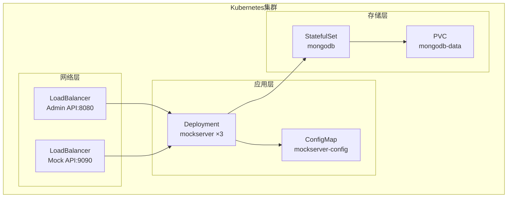
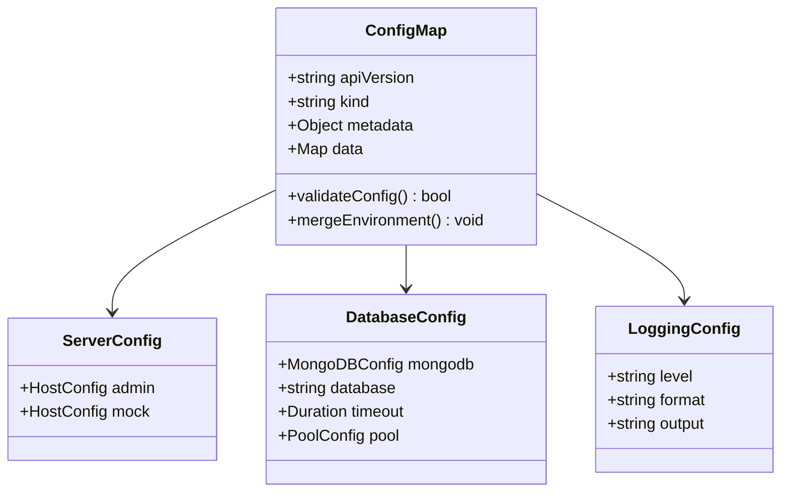
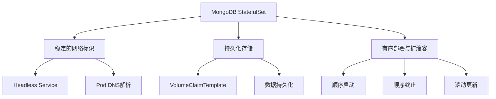
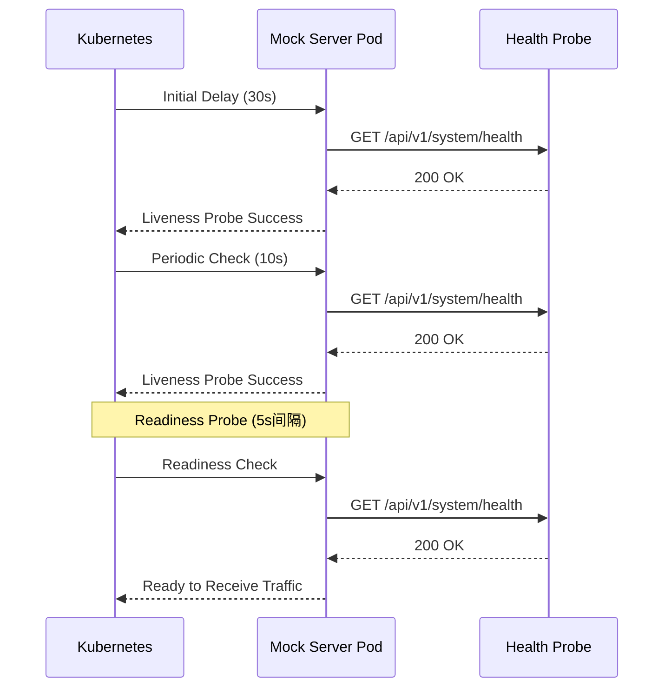
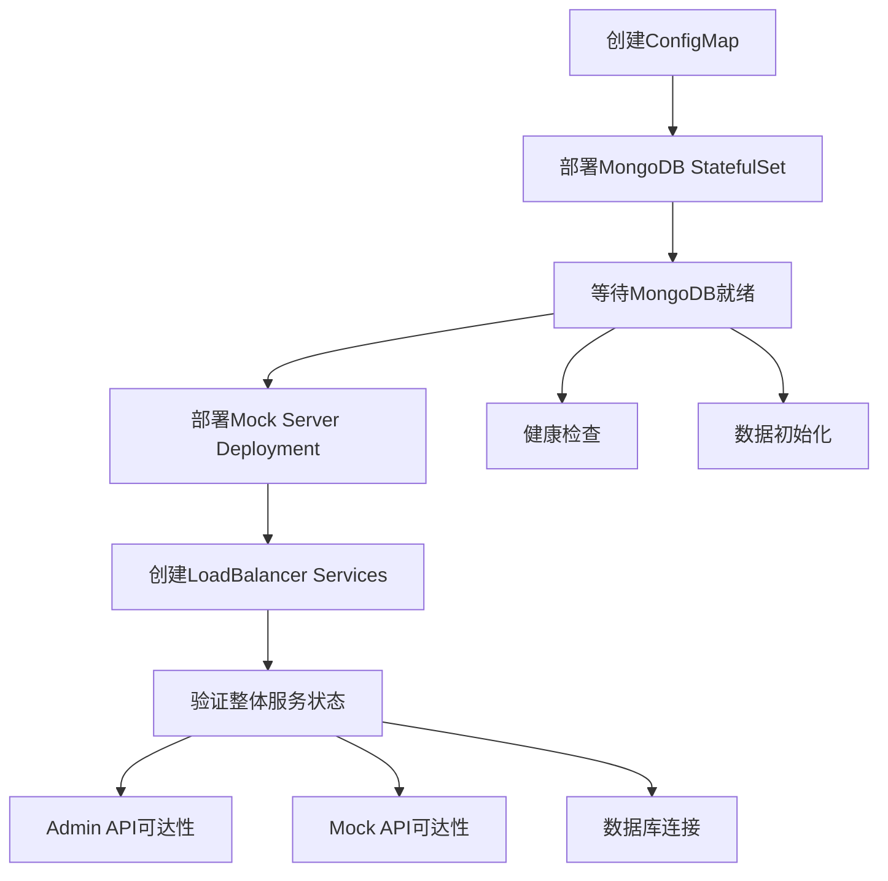
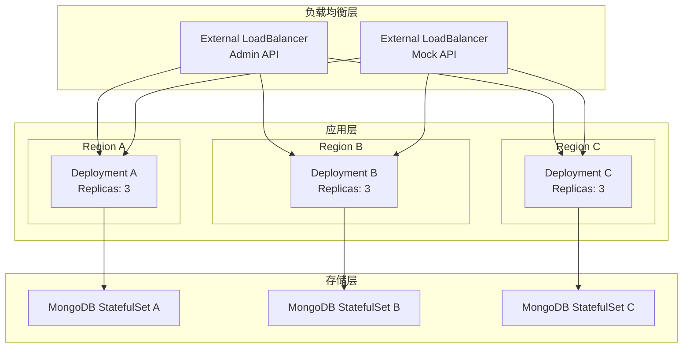

# Kubernetes集群部署指南

<cite>
**本文档中引用的文件**
- [DEPLOYMENT.md](file://DEPLOYMENT.md)
- [docker-compose.yml](file://docker-compose.yml)
- [config.yaml](file://config.yaml)
- [config.dev.yaml](file://config.dev.yaml)
- [config.test.yaml](file://config.test.yaml)
- [Makefile](file://Makefile)
- [README.md](file://README.md)
</cite>

## 目录
1. [概述](#概述)
2. [环境准备](#环境准备)
3. [配置文件详解](#配置文件详解)
4. [Kubernetes资源部署](#kubernetes资源部署)
5. [部署流程](#部署流程)
6. [监控与维护](#监控与维护)
7. [扩展性与高可用](#扩展性与高可用)
8. [故障排查](#故障排查)
9. [最佳实践](#最佳实践)

## 概述

本指南详细介绍了如何将gomockserver部署到Kubernetes集群中，实现生产环境的高可用部署。该部署方案包含以下核心组件：

- **MongoDB StatefulSet**：提供持久化数据库存储
- **Mock Server Deployment**：多副本部署，支持水平扩展
- **ConfigMap**：集中管理配置文件
- **LoadBalancer Services**：对外暴露管理API和Mock服务

### 部署架构图



**图表来源**
- [DEPLOYMENT.md](file://DEPLOYMENT.md#L376-L551)

## 环境准备

### 系统要求

| 组件 | 最小配置 | 推荐配置 |
|------|----------|----------|
| CPU | 2核 | 4核 |
| 内存 | 2GB | 4GB |
| 磁盘 | 10GB | 20GB SSD |
| Kubernetes版本 | 1.19+ | 1.24+ |

### 软件依赖

- **kubectl**：Kubernetes命令行工具
- **Helm**（可选）：用于包管理
- **MongoDB 6.0+**：数据库服务
- **Docker**：镜像构建工具

### 权限配置

确保kubectl客户端具有以下权限：
- 创建/更新/删除命名空间
- 创建/更新/删除ConfigMap
- 创建/更新/删除StatefulSet
- 创建/更新/删除Deployment
- 创建/更新/删除Service

## 配置文件详解

### ConfigMap配置

ConfigMap是Kubernetes中用于存储配置数据的对象，避免将敏感信息硬编码到容器镜像中。

#### 配置结构



**图表来源**
- [DEPLOYMENT.md](file://DEPLOYMENT.md#L382-L410)

#### 关键配置项

| 配置项 | 描述 | 默认值 |
|--------|------|--------|
| `server.admin.host` | 管理API监听地址 | "0.0.0.0" |
| `server.admin.port` | 管理API监听端口 | 8080 |
| `server.mock.host` | Mock服务监听地址 | "0.0.0.0" |
| `server.mock.port` | Mock服务监听端口 | 9090 |
| `database.mongodb.uri` | MongoDB连接字符串 | "mongodb://mongodb-service:27017" |
| `database.mongodb.database` | 数据库名称 | "mockserver" |
| `logging.level` | 日志级别 | "info" |
| `logging.format` | 日志格式 | "json" |

**章节来源**
- [DEPLOYMENT.md](file://DEPLOYMENT.md#L382-L410)

### MongoDB StatefulSet配置

StatefulSet提供了有状态应用的部署能力，确保Pod的稳定网络标识和持久化存储。

#### 核心特性



**图表来源**
- [DEPLOYMENT.md](file://DEPLOYMENT.md#L414-L459)

#### 存储配置

| 参数 | 值 | 说明 |
|------|-----|------|
| `replicas` | 1 | 副本数量 |
| `accessModes` | ReadWriteOnce | 访问模式 |
| `storage` | 20Gi | 存储容量 |
| `storageClassName` | - | 存储类（可选） |

**章节来源**
- [DEPLOYMENT.md](file://DEPLOYMENT.md#L414-L459)

### Mock Server Deployment配置

Deployment控制器确保指定数量的Pod副本始终运行，并支持滚动更新。

#### 健康检查配置



**图表来源**
- [DEPLOYMENT.md](file://DEPLOYMENT.md#L465-L534)

#### 资源限制

| 资源类型 | 请求值 | 限制值 | 说明 |
|----------|--------|--------|------|
| CPU | 500m | 1000m | 0.5-1核CPU |
| 内存 | 512Mi | 1Gi | 512MB-1GB内存 |
| 存储 | 100Mi | 500Mi | 配置文件存储 |

**章节来源**
- [DEPLOYMENT.md](file://DEPLOYMENT.md#L465-L534)

## Kubernetes资源部署

### 部署顺序

Kubernetes部署遵循严格的顺序，以确保依赖关系正确建立：



**图表来源**
- [DEPLOYMENT.md](file://DEPLOYMENT.md#L536-L551)

### 命令行操作

#### 应用配置

```bash
# 创建命名空间（可选）
kubectl create namespace mockserver

# 应用ConfigMap
kubectl apply -f k8s/configmap.yaml

# 部署MongoDB
kubectl apply -f k8s/mongodb.yaml

# 部署Mock Server
kubectl apply -f k8s/mockserver.yaml

# 查看部署状态
kubectl get pods -n mockserver
kubectl get services -n mockserver
```

#### 检查部署状态

```bash
# 查看Pod状态
kubectl get pods -n mockserver -o wide

# 查看详细状态
kubectl describe pod <pod-name> -n mockserver

# 查看事件
kubectl get events -n mockserver --sort-by=.metadata.creationTimestamp
```

#### 日志查看

```bash
# 查看Pod日志
kubectl logs -f deployment/mockserver -n mockserver

# 查看特定Pod日志
kubectl logs -f <pod-name> -n mockserver

# 查看最近的日志
kubectl logs --tail=100 -f deployment/mockserver -n mockserver

# 查看历史日志
kubectl logs --previous=true deployment/mockserver -n mockserver
```

**章节来源**
- [DEPLOYMENT.md](file://DEPLOYMENT.md#L536-L551)

## 监控与维护

### 健康检查机制

Kubernetes提供了多层次的健康检查机制：

#### Liveness Probe
- **检查路径**：`/api/v1/system/health`
- **初始延迟**：30秒
- **检查间隔**：10秒
- **超时时间**：5秒
- **失败阈值**：3次

#### Readiness Probe
- **检查路径**：`/api/v1/system/health`
- **初始延迟**：10秒
- **检查间隔**：5秒
- **超时时间**：3秒
- **成功阈值**：1次

### 监控指标

#### 关键指标

| 指标类别 | 指标名称 | 描述 |
|----------|----------|------|
| 资源使用 | CPU使用率 | Pod CPU使用百分比 |
| 资源使用 | 内存使用率 | Pod内存使用百分比 |
| 服务可用性 | Pod就绪状态 | Pod是否处于Ready状态 |
| 服务可用性 | 健康检查状态 | 应用健康检查结果 |
| 数据库连接 | 连接池状态 | MongoDB连接池使用情况 |

### 自动扩缩容

#### 水平Pod自动扩缩容（HPA）

```yaml
apiVersion: autoscaling/v2
kind: HorizontalPodAutoscaler
metadata:
  name: mockserver-hpa
  namespace: mockserver
spec:
  scaleTargetRef:
    apiVersion: apps/v1
    kind: Deployment
    name: mockserver
  minReplicas: 2
  maxReplicas: 10
  metrics:
  - type: Resource
    resource:
      name: cpu
      target:
        type: Utilization
        averageUtilization: 70
  - type: Resource
    resource:
      name: memory
      target:
        type: Utilization
        averageUtilization: 80
```

### 日志管理

#### 日志收集配置

```yaml
apiVersion: v1
kind: ConfigMap
metadata:
  name: fluent-bit-config
  namespace: mockserver
data:
  fluent-bit.conf: |
    [SERVICE]
        Flush         1
        Log_Level     info
        Daemon        off
        Parsers_File  parsers.conf
    
    [INPUT]
        Name              tail
        Path              /var/log/containers/*mockserver*.log
        Parser            docker
        Tag               mockserver.*
        Refresh_Interval  5
    
    [OUTPUT]
        Name  es
        Match mockserver.*
        Host  elasticsearch-service
        Port  9200
        Index mockserver-logs
```

## 扩展性与高可用

### 高可用架构



### 跨区域部署

#### 多区域配置

```yaml
# Region A
apiVersion: v1
kind: Namespace
metadata:
  name: mockserver-region-a
  labels:
    region: a
    zone: us-west-1

# Region B  
apiVersion: v1
kind: Namespace
metadata:
  name: mockserver-region-b
  labels:
    region: b
    zone: us-east-1

# Region C
apiVersion: v1
kind: Namespace
metadata:
  name: mockserver-region-c
  labels:
    region: c
    zone: eu-central-1
```

### 负载均衡策略

#### Ingress Controller配置

```yaml
apiVersion: networking.k8s.io/v1
kind: Ingress
metadata:
  name: mockserver-ingress
  namespace: mockserver
  annotations:
    nginx.ingress.kubernetes.io/rewrite-target: /
    nginx.ingress.kubernetes.io/ssl-redirect: "true"
    cert-manager.io/cluster-issuer: letsencrypt-prod
spec:
  tls:
  - hosts:
    - admin.mockserver.example.com
    - mock.mockserver.example.com
    secretName: mockserver-tls
  rules:
  - host: admin.mockserver.example.com
    http:
      paths:
      - path: /
        pathType: Prefix
        backend:
          service:
            name: mockserver-admin
            port:
              number: 8080
  - host: mock.mockserver.example.com
    http:
      paths:
      - path: /
        pathType: Prefix
        backend:
          service:
            name: mockserver-mock
            port:
              number: 9090
```

## 故障排查

### 常见问题诊断

#### Pod启动失败

```bash
# 查看Pod详细状态
kubectl describe pod <pod-name> -n mockserver

# 检查事件
kubectl get events -n mockserver --sort-by=.metadata.creationTimestamp

# 检查资源限制
kubectl top pods -n mockserver
```

#### 数据库连接问题

```bash
# 检查MongoDB状态
kubectl exec -it <mongodb-pod> -- mongo --eval "db.runCommand('ping')"

# 检查网络连通性
kubectl exec -it <mockserver-pod> -- ping mongodb-service

# 检查DNS解析
kubectl exec -it <mockserver-pod> -- nslookup mongodb-service
```

#### 配置问题

```bash
# 检查ConfigMap内容
kubectl get configmap mockserver-config -o yaml -n mockserver

# 检查挂载的配置文件
kubectl exec -it <pod-name> -- cat /root/config.yaml
```

### 性能优化

#### 资源调优

```yaml
# 资源请求和限制
resources:
  requests:
    cpu: 500m
    memory: 512Mi
  limits:
    cpu: 1000m
    memory: 1Gi

# 连接池配置
env:
- name: DATABASE_MONGODB_POOL_MIN
  value: "20"
- name: DATABASE_MONGODB_POOL_MAX  
  value: "200"
```

#### 缓存优化

```yaml
# Redis配置（如果启用）
env:
- name: REDIS_URL
  value: "redis://redis-service:6379"
- name: REDIS_DB
  value: "0"
- name: CACHE_RULE_TTL
  value: "300"
- name: CACHE_CONFIG_TTL
  value: "1800"
```

## 最佳实践

### 安全配置

#### RBAC权限控制

```yaml
apiVersion: rbac.authorization.k8s.io/v1
kind: Role
metadata:
  name: mockserver-role
  namespace: mockserver
rules:
- apiGroups: [""]
  resources: ["pods", "services", "configmaps"]
  verbs: ["get", "list", "watch", "create", "update", "patch", "delete"]
```

#### 安全扫描

```bash
# 使用Trivy进行镜像扫描
trivy image mockserver:latest

# 使用Clair进行漏洞扫描
clair-scanner --report=/tmp/report.json mockserver:latest
```

### 备份策略

#### 数据备份

```bash
#!/bin/bash
# MongoDB备份脚本
NAMESPACE="mockserver"
DATE=$(date +%Y%m%d_%H%M%S)

# 创建备份
kubectl exec -n $NAMESPACE $(kubectl get pods -n $NAMESPACE -l app=mongodb -o jsonpath='{.items[0].metadata.name}') \
  -- mongodump --archive --gzip --db mockserver > backup_$DATE.gz

# 上传到对象存储
aws s3 cp backup_$DATE.gz s3://mockserver-backups/$DATE.gz
```

#### 配置备份

```bash
# 备份ConfigMap
kubectl get configmap mockserver-config -n mockserver -o yaml > configmap-backup-$(date +%Y%m%d).yaml

# 备份Secret（如果有）
kubectl get secret mockserver-secret -n mockserver -o yaml > secret-backup-$(date +%Y%m%d).yaml
```

### 监控告警

#### Prometheus监控配置

```yaml
apiVersion: v1
kind: ConfigMap
metadata:
  name: prometheus-config
  namespace: monitoring
data:
  prometheus.yml: |
    global:
      scrape_interval: 15s
    
    scrape_configs:
    - job_name: 'mockserver'
      kubernetes_sd_configs:
      - role: pod
        namespaces:
          names: ['mockserver']
      relabel_configs:
      - source_labels: [__meta_kubernetes_pod_label_app]
        action: keep
        regex: mockserver
      - source_labels: [__meta_kubernetes_pod_annotation_prometheus_io_scrape]
        action: keep
        regex: true
```

### 滚动更新

#### 蓝绿部署

```yaml
# 蓝色环境
apiVersion: apps/v1
kind: Deployment
metadata:
  name: mockserver-blue
spec:
  replicas: 3
  selector:
    matchLabels:
      app: mockserver
      version: blue
  template:
    metadata:
      labels:
        app: mockserver
        version: blue
    spec:
      containers:
      - name: mockserver
        image: mockserver:v2.0-blue

# 绿色环境
apiVersion: apps/v1
kind: Deployment
metadata:
  name: mockserver-green
spec:
  replicas: 0
  selector:
    matchLabels:
      app: mockserver
      version: green
  template:
    metadata:
      labels:
        app: mockserver
        version: green
    spec:
      containers:
      - name: mockserver
        image: mockserver:v2.0-green
```

#### 金丝雀发布

```bash
# 部署金丝雀版本
kubectl set image deployment/mockserver mockserver=mockserver:v2.0-canary --record

# 检查部署状态
kubectl rollout status deployment/mockserver

# 如果发现问题，回滚
kubectl rollout undo deployment/mockserver
```

### CI/CD集成

#### GitHub Actions工作流

```yaml
name: Deploy to Kubernetes
on:
  push:
    branches: [main]
    tags: ['v*']

jobs:
  deploy:
    runs-on: ubuntu-latest
    steps:
    - uses: actions/checkout@v3
    
    - name: Setup kubectl
      uses: azure/setup-kubectl@v1
      with:
        version: 'v1.24.0'
    
    - name: Deploy to cluster
      run: |
        kubectl apply -f k8s/configmap.yaml
        kubectl apply -f k8s/mongodb.yaml
        kubectl apply -f k8s/mockserver.yaml
        kubectl rollout status deployment/mockserver
```

**章节来源**
- [DEPLOYMENT.md](file://DEPLOYMENT.md#L376-L551)

## 结论

本指南提供了完整的Kubernetes集群部署方案，涵盖了从基础配置到高级运维的各个方面。通过遵循这些最佳实践，您可以构建一个高可用、可扩展的gomockserver生产环境。

关键要点：
- 使用ConfigMap集中管理配置
- 采用StatefulSet确保数据库高可用
- 实施完善的健康检查机制
- 建立监控和告警体系
- 制定完整的备份和恢复策略
- 实现CI/CD自动化部署

定期审查和更新部署配置，确保系统始终处于最佳状态。