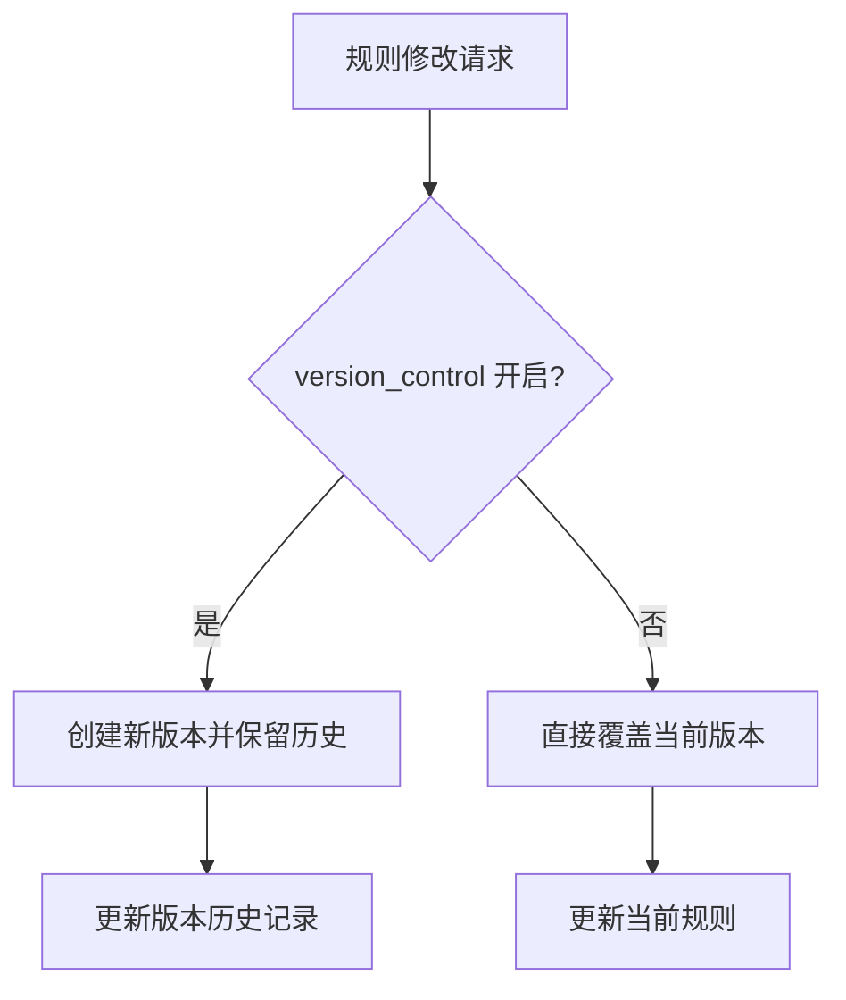
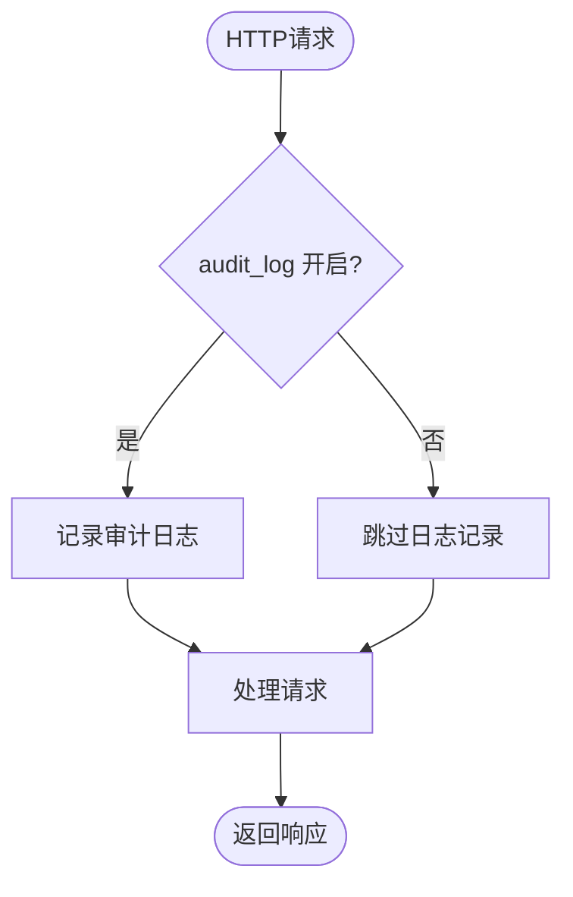
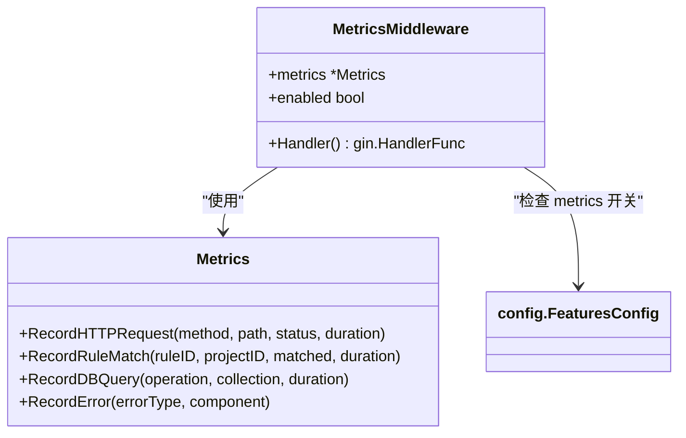
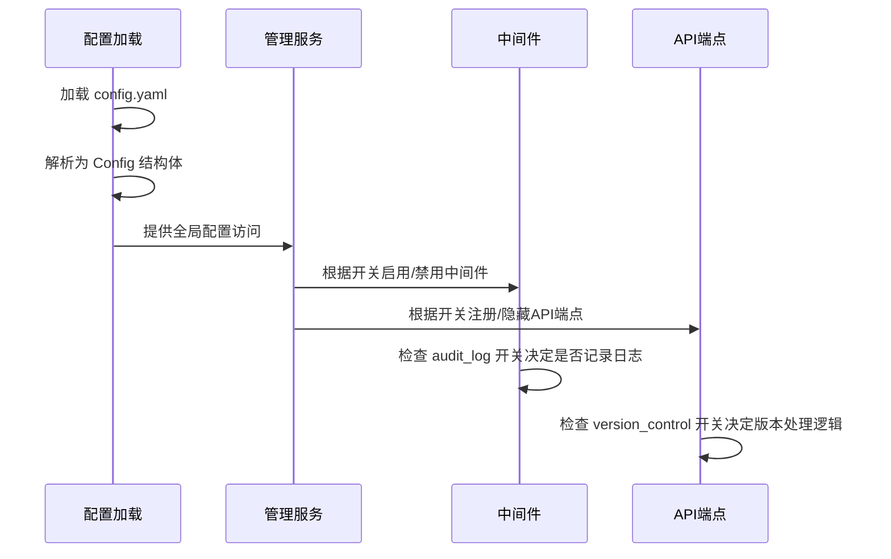

# 功能开关

<cite>
**本文档引用的文件**   
- [config.go](file://internal/config/config.go)
- [admin_service.go](file://internal/service/admin_service.go)
- [middleware.go](file://internal/service/middleware.go)
- [config.yaml](file://config.yaml)
- [import_export_service.go](file://internal/service/import_export_service.go)
- [metrics.go](file://internal/metrics/metrics.go)
- [request_logger.go](file://internal/middleware/request_logger.go)
</cite>

## 目录
1. [功能开关概述](#功能开关概述)
2. [FeaturesConfig 配置项详解](#featuresconfig-配置项详解)
3. [功能开关的运行时控制机制](#功能开关的运行时控制机制)
4. [使用场景与最佳实践](#使用场景与最佳实践)
5. [总结](#总结)

## 功能开关概述

本系统通过 `FeaturesConfig` 结构体提供了一组布尔型功能开关，用于在运行时动态控制核心功能的启用与禁用。这些开关允许系统管理员根据部署环境（开发、测试、生产）灵活调整系统行为，而无需修改代码或重新编译。主要功能开关包括：
- **version_control**: 控制规则版本控制功能
- **audit_log**: 控制审计日志记录功能
- **metrics**: 控制监控指标暴露功能

这些开关在 `config.yaml` 配置文件中定义，并通过 `config` 包加载到全局配置中，供系统各组件在运行时查询。

**Section sources**
- [config.go](file://internal/config/config.go#L128-L133)
- [config.yaml](file://config.yaml#L83-L90)

## FeaturesConfig 配置项详解

### version_control (版本控制)

`version_control` 开关控制规则版本控制功能的启用状态。

- **开启 (true)**: 系统将启用规则的版本控制功能。当规则被修改时，系统会保留历史版本，允许用户回滚到之前的配置。此功能对于生产环境的变更管理和故障恢复至关重要。
- **关闭 (false)**: 系统将禁用版本控制。规则修改为直接覆盖，不保留历史版本。这适用于开发环境，可以简化操作流程。

在当前代码库中，该开关主要影响导入导出服务的行为。当版本控制启用时，导出的数据会包含完整的元数据和版本信息，确保导入时能够正确处理版本冲突。

**Diagram sources**
- [import_export_service.go](file://internal/service/import_export_service.go#L154-L158)

**Section sources**
- [config.go](file://internal/config/config.go#L130)
- [config.yaml](file://config.yaml#L86)

### audit_log (审计日志)

`audit_log` 开关控制审计日志的记录功能。

- **开启 (true)**: 系统将记录所有关键操作的审计日志，包括规则创建、修改、删除等操作。这些日志包含操作时间、操作者、操作类型和相关资源信息，用于安全审计和问题追踪。
- **关闭 (false)**: 系统将不记录审计日志，减少日志存储开销和I/O操作，提高系统性能。

该开关通过中间件机制实现。当审计日志功能启用时，相关的中间件会拦截请求并记录日志；当禁用时，中间件会跳过日志记录逻辑。

**Diagram sources**
- [request_logger.go](file://internal/middleware/request_logger.go)
- [middleware.go](file://internal/service/middleware.go)

**Section sources**
- [config.go](file://internal/config/config.go#L131)
- [config.yaml](file://config.yaml#L88)

### metrics (监控指标)

`metrics` 开关控制监控指标的暴露功能。

- **开启 (true)**: 系统将启用Prometheus监控指标收集，暴露HTTP请求、规则匹配、数据库查询等关键性能指标。这些指标可用于监控系统健康状况、性能分析和告警。
- **关闭 (false)**: 系统将不收集和暴露任何监控指标，减少系统开销。

该开关影响 `metrics` 包的行为。当指标功能启用时，系统会初始化Prometheus指标收集器并在处理请求时记录相关数据；当禁用时，指标记录函数将不执行任何操作。

**Diagram sources**
- [metrics.go](file://internal/metrics/metrics.go)
- [config.go](file://internal/config/config.go#L132)

**Section sources**
- [config.go](file://internal/config/config.go#L132)
- [config.yaml](file://config.yaml#L90)
- [metrics.go](file://internal/metrics/metrics.go)

## 功能开关的运行时控制机制

功能开关通过配置中心模式实现运行时控制。系统启动时加载 `config.yaml` 文件，将配置解析为 `Config` 结构体实例并存储在全局变量中。各组件通过 `config.Get()` 方法获取全局配置，并根据 `FeaturesConfig` 中的布尔值决定是否执行特定功能。

在 `admin_service.go` 中，管理服务的启动逻辑会根据配置决定是否注册某些API端点或启用特定中间件。例如，当 `audit_log` 开启时，系统会注册审计日志相关的API；当 `metrics` 开启时，会暴露 `/metrics` 端点。

**Diagram sources**
- [admin_service.go](file://internal/service/admin_service.go)
- [config.go](file://internal/config/config.go)

**Section sources**
- [admin_service.go](file://internal/service/admin_service.go)
- [middleware.go](file://internal/service/middleware.go)

## 使用场景与最佳实践

### 使用场景

1. **开发环境**: 建议关闭 `audit_log` 和 `metrics` 以提高性能，保持 `version_control` 开启以便于调试和回滚。
2. **生产环境**: 建议开启所有功能开关，确保完整的审计追踪、性能监控和版本控制能力。
3. **性能测试**: 可临时关闭 `audit_log` 和 `metrics` 以获得纯粹的性能基准。
4. **故障排查**: 当系统出现问题时，可确保 `audit_log` 和 `metrics` 开启以收集诊断信息。

### 最佳实践

1. **环境化配置**: 为不同环境维护独立的配置文件（如 `config.dev.yaml`、`config.prod.yaml`），避免手动修改。
2. **变更管理**: 修改功能开关配置应遵循变更管理流程，特别是在生产环境中。
3. **监控开关状态**: 建立对功能开关状态的监控，确保关键功能（如审计日志）在生产环境中始终启用。
4. **文档化决策**: 记录每个环境的功能开关配置决策及其原因，便于团队理解和维护。

**Section sources**
- [config.yaml](file://config.yaml)
- [config.dev.yaml](file://config.dev.yaml)

## 总结

功能开关为系统提供了灵活的配置能力，允许在不重启服务的情况下动态调整系统行为。通过合理使用 `version_control`、`audit_log` 和 `metrics` 开关，可以在不同环境和场景下优化系统性能、安全性和可维护性。建议根据具体使用场景制定明确的开关配置策略，并将其纳入配置管理流程。