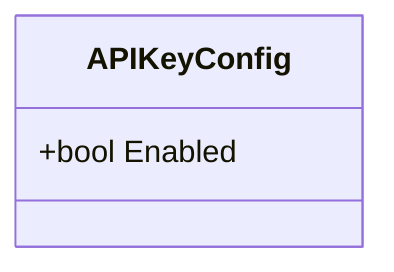
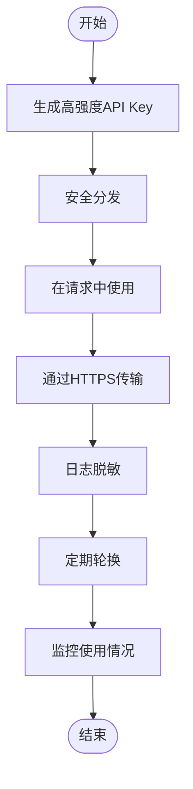

# API Key 配置

<cite>
**本文档引用的文件**   
- [config.go](file://internal/config/config.go)
- [config.yaml](file://config.yaml)
- [config.test.yaml](file://config.test.yaml)
- [config.dev.yaml](file://config.dev.yaml)
- [request_logger_test.go](file://internal/middleware/request_logger_test.go)
</cite>

## 目录
1. [简介](#简介)
2. [APIKeyConfig结构体详解](#apikeyconfig结构体详解)
3. [启用/禁用API Key认证](#启用禁用api-key认证)
4. [API Key使用场景与策略](#api-key使用场景与策略)
5. [生产环境配置示例](#生产环境配置示例)
6. [安全实践建议](#安全实践建议)
7. [测试环境配置](#测试环境配置)

## 简介
本文档详细说明了gomockserver项目中API Key认证的配置方法。通过分析`APIKeyConfig`结构体和相关配置文件，阐述了如何在不同环境中启用或禁用API Key认证，以及相关的安全实践建议。

**Section sources**
- [config.go](file://internal/config/config.go#L81-L84)

## APIKeyConfig结构体详解
`APIKeyConfig`结构体定义了API Key认证的配置选项，目前仅包含一个`Enabled`字段，用于控制API Key认证功能的开启与关闭。



**Diagram sources **
- [config.go](file://internal/config/config.go#L81-L84)

**Section sources**
- [config.go](file://internal/config/config.go#L81-L84)

## 启用/禁用API Key认证
`Enabled`字段是控制API Key认证功能的核心开关：
- 当`Enabled`设置为`true`时，系统将启用API Key认证，要求客户端在请求头中提供有效的API Key
- 当`Enabled`设置为`false`时，系统将禁用API Key认证，允许未认证的请求通过

API Key通常通过HTTP请求头`X-Api-Key`传递，系统会在中间件层进行验证。

**Section sources**
- [config.go](file://internal/config/config.go#L81-L84)
- [request_logger_test.go](file://internal/middleware/request_logger_test.go#L124)

## API Key使用场景与策略
API Key认证主要用于以下场景：
- 自动化脚本调用管理API
- 服务间的安全通信
- 第三方集成访问控制

生成与分发策略建议：
- 使用高强度随机算法生成API Key
- 为不同用途和用户分配不同的API Key
- 通过安全渠道分发API Key
- 记录API Key的分配和使用情况

**Section sources**
- [config.go](file://internal/config/config.go#L81-L84)
- [request_logger_test.go](file://internal/middleware/request_logger_test.go#L124)

## 生产环境配置示例
在生产环境中，建议启用API Key认证以增强系统安全性。以下是`config.yaml`中的配置示例：

```yaml
security:
  api_key:
    enabled: true
```

API Key认证可以与JWT认证共存，提供多层安全防护。系统通过中间件链依次验证不同的认证方式。

**Section sources**
- [config.yaml](file://config.yaml#L41-L42)

## 安全实践建议
为确保API Key认证的安全性，建议遵循以下最佳实践：
- 定期轮换API Key，降低泄露风险
- 遵循最小权限原则，为不同用途分配不同权限的API Key
- 在传输过程中使用HTTPS加密，防止API Key被窃听
- 在日志记录中对API Key进行脱敏处理，避免敏感信息泄露
- 实施适当的限流策略，防止暴力破解攻击



**Diagram sources **
- [config.go](file://internal/config/config.go#L81-L84)
- [request_logger_test.go](file://internal/middleware/request_logger_test.go#L124)

**Section sources**
- [config.go](file://internal/config/config.go#L81-L84)
- [request_logger_test.go](file://internal/middleware/request_logger_test.go#L124)

## 测试环境配置
在测试环境中，为了简化开发和调试过程，可以关闭API Key认证功能。以下是`config.test.yaml`中的配置示例：

```yaml
security:
  api_key:
    enabled: false
```

这种配置允许开发人员在不提供API Key的情况下进行API调用，提高开发效率。

**Section sources**
- [config.test.yaml](file://config.test.yaml#L41-L42)
- [config.dev.yaml](file://config.dev.yaml#L42)