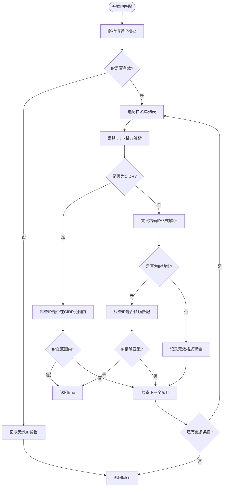

# IP 白名单配置

<cite>
**本文档引用的文件**
- [config.go](file://internal/config/config.go)
- [config.yaml](file://config.yaml)
- [match_engine.go](file://internal/engine/match_engine.go)
- [match_engine_test.go](file://internal/engine/match_engine_test.go)
- [models.go](file://internal/models/models.go)
- [middleware.go](file://internal/service/middleware.go)
</cite>

## 目录
1. [简介](#简介)
2. [IPWhitelistConfig 结构体详解](#ipwhitelistconfig-结构体详解)
3. [配置文件设置](#配置文件设置)
4. [支持的IP格式](#支持的ip格式)
5. [配置示例](#配置示例)
6. [与安全层的协同工作](#与安全层的协同工作)
7. [故障排查指南](#故障排查指南)
8. [最佳实践](#最佳实践)
9. [总结](#总结)

## 简介

IP白名单是一种重要的网络安全机制，用于限制对敏感接口的访问。在GoMockServer中，IP白名单配置通过`IPWhitelistConfig`结构体实现，提供了灵活的访问控制能力，支持IPv4和IPv6地址，以及CIDR网段格式。

该机制作为多层安全防护体系的重要组成部分，能够有效防止未经授权的访问，保护管理接口和敏感数据的安全。

## IPWhitelistConfig 结构体详解

### Enabled 开关字段

`Enabled`字段是一个布尔值，用于控制IP白名单功能的启用状态：

- **true**: 启用IP白名单验证，只有符合白名单的IP地址才能访问受保护的接口
- **false**: 禁用IP白名单验证，允许所有IP地址访问

### IPs 列表字段

`IPs`字段是一个字符串切片，包含允许访问的IP地址列表。该列表支持以下格式：

- **单个IP地址**: 如 `"192.168.1.100"`
- **IPv6地址**: 如 `"::1"` 或 `"2001:db8::1"`
- **CIDR网段**: 如 `"192.168.1.0/24"` 或 `"2001:db8::/64"`
- **混合格式**: 可以同时包含多种格式的IP地址

```mermaid
classDiagram
class IPWhitelistConfig {
+bool Enabled
+[]string IPs
+validateIPs() bool
+matchRequestIP(ip string) bool
}
class MatchEngine {
+matchIPWhitelist(requestIP string, whitelist []string) bool
+simpleMatch(request *Request, rule *Rule) (bool, error)
}
class Rule {
+map[string]interface{} MatchCondition
+HTTPMatchCondition
}
IPWhitelistConfig --> MatchEngine : "配置"
MatchEngine --> Rule : "验证规则"
```

**图表来源**
- [config.go](file://internal/config/config.go#L86-L90)
- [match_engine.go](file://internal/engine/match_engine.go#L402-L435)

**章节来源**
- [config.go](file://internal/config/config.go#L86-L90)

## 配置文件设置

### YAML配置格式

在`config.yaml`文件中，IP白名单配置位于`security.ip_whitelist`部分：

```yaml
security:
  # IP 白名单
  ip_whitelist:
    enabled: false
    ips: []
```

### 配置参数说明

| 参数 | 类型 | 必需 | 默认值 | 描述 |
|------|------|------|--------|------|
| enabled | boolean | 是 | false | 是否启用IP白名单功能 |
| ips | array | 否 | [] | 允许访问的IP地址列表 |

### 环境变量覆盖

系统支持通过环境变量覆盖配置文件中的设置：

```bash
# 启用IP白名单
export SECURITY_IP_WHITELIST_ENABLED=true

# 设置允许的IP地址
export SECURITY_IP_WHITELIST_IPS="192.168.1.100,192.168.1.101,192.168.1.0/24"
```

**章节来源**
- [config.yaml](file://config.yaml#L44-L46)

## 支持的IP格式

### IPv4 地址格式

系统完全支持标准的IPv4地址格式：

- **单个IP**: `"192.168.1.100"`
- **本地回环**: `"127.0.0.1"`
- **广播地址**: `"255.255.255.255"`

### IPv6 地址格式

系统支持IPv6地址，包括：

- **简化表示**: `"::1"` (等同于 `"0:0:0:0:0:0:0:1"`)
- **完整表示**: `"2001:0db8:85a3:0000:0000:8a2e:0370:7334"`
- **压缩表示**: `"2001:db8::1"`

### CIDR 网段格式

支持CIDR（无类别域间路由）格式，用于定义IP地址范围：

- **IPv4网段**: `"192.168.1.0/24"` 表示 `192.168.1.0` 到 `192.168.1.255`
- **IPv6网段**: `"2001:db8::/64"` 表示连续的IPv6地址块
- **子网掩码**: `"10.0.0.0/8"` 表示 `10.0.0.0` 到 `10.255.255.255`

### 格式优先级

系统按以下顺序尝试解析IP格式：

1. **CIDR格式**: 首先尝试解析为CIDR网段
2. **精确IP格式**: 如果不是CIDR格式，再尝试解析为精确IP地址
3. **无效格式**: 记录警告但不影响其他白名单条目



**图表来源**
- [match_engine.go](file://internal/engine/match_engine.go#L402-L435)

**章节来源**
- [match_engine.go](file://internal/engine/match_engine.go#L402-L435)

## 配置示例

### 基础配置示例

#### 单个IP访问控制

```yaml
security:
  ip_whitelist:
    enabled: true
    ips:
      - "192.168.1.100"
      - "192.168.1.101"
```

#### 网络段访问控制

```yaml
security:
  ip_whitelist:
    enabled: true
    ips:
      - "192.168.1.0/24"        # 整个C类网络
      - "10.0.0.0/8"           # 整个B类网络
      - "2001:db8::/64"        # IPv6网段
```

#### 混合格式配置

```yaml
security:
  ip_whitelist:
    enabled: true
    ips:
      - "192.168.1.100"        # 单个IP
      - "10.0.0.0/16"          # C类网络
      - "::1"                  # IPv6本地回环
      - "2001:db8::1"          # IPv6单个地址
```

### 生产环境推荐配置

#### 最小权限原则

```yaml
security:
  ip_whitelist:
    enabled: true
    ips:
      - "192.168.1.100/32"     # 严格限制到单个IP
      - "192.168.1.101/32"
```

#### 分阶段部署配置

```yaml
security:
  ip_whitelist:
    enabled: true
    ips:
      # 第一阶段：只允许运维团队IP
      - "192.168.10.0/24"
      
      # 第二阶段：添加开发团队IP
      # - "192.168.20.0/24"
      
      # 第三阶段：添加监控系统IP
      # - "192.168.30.100"
```

### 测试环境配置

#### 禁用IP白名单（开发环境）

```yaml
security:
  ip_whitelist:
    enabled: false
    ips: []
```

#### 本地开发环境

```yaml
security:
  ip_whitelist:
    enabled: true
    ips:
      - "127.0.0.1"           # 本地回环
      - "::1"                 # IPv6本地回环
      - "192.168.1.0/24"      # 开发网络
```

**章节来源**
- [config.yaml](file://config.yaml#L44-L46)

## 与安全层的协同工作

### 多层安全架构

IP白名单作为多层安全防护体系的一部分，与以下安全机制协同工作：


### 与JWT的协同

#### JWT + IP白名单组合

```yaml
security:
  jwt:
    secret: "your-secret-key"
    expiration: 7200
  ip_whitelist:
    enabled: true
    ips:
      - "192.168.1.0/24"      # 只允许内网访问
```

在这种配置下：
1. **IP白名单**首先验证请求来源IP是否在允许范围内
2. **JWT验证**随后验证请求中携带的令牌有效性
3. 双重验证确保更高的安全性

### 与API Key的协同

#### API Key + IP白名单组合

```yaml
security:
  api_key:
    enabled: true
  ip_whitelist:
    enabled: true
    ips:
      - "10.0.0.0/8"          # 只允许内部网络访问
```

这种配置适用于：
- **内部系统集成**: 只允许特定内部网络访问
- **第三方API调用**: 结合API Key进行双重认证
- **微服务通信**: 确保服务间通信的安全性

### 权限控制流程


**图表来源**
- [match_engine.go](file://internal/engine/match_engine.go#L402-L435)

**章节来源**
- [config.go](file://internal/config/config.go#L68-L73)

## 故障排查指南

### 常见问题及解决方案

#### 1. 访问被拒绝（403 Forbidden）

**症状**: 客户端收到403错误，提示访问被拒绝

**可能原因**:
- IP地址不在白名单中
- IP白名单配置未生效
- 配置文件格式错误

**排查步骤**:
1. 检查客户端实际IP地址
2. 验证配置文件中的IP白名单设置
3. 查看服务器日志中的IP验证警告

**解决方案**:
```yaml
# 添加客户端IP到白名单
security:
  ip_whitelist:
    enabled: true
    ips:
      - "192.168.1.100"  # 添加你的客户端IP
```

#### 2. IP格式解析错误

**症状**: 服务器日志显示"invalid IP format in whitelist"警告

**可能原因**:
- 白名单中包含无效的IP地址格式
- CIDR格式不正确
- IPv6地址格式错误

**排查步骤**:
1. 检查白名单中的所有IP地址格式
2. 验证CIDR子网掩码的有效性
3. 确认IPv6地址的正确性

**解决方案**:
```yaml
# 修正无效的IP格式
security:
  ip_whitelist:
    enabled: true
    ips:
      - "192.168.1.100"      # 正确的IPv4格式
      - "192.168.1.0/24"     # 正确的CIDR格式
      - "::1"                # 正确的IPv6本地回环
      - "2001:db8::1"        # 正确的IPv6地址
```

#### 3. 配置不生效

**症状**: 修改配置后访问仍然被拒绝

**可能原因**:
- 配置文件未正确加载
- 服务未重启
- 环境变量冲突

**排查步骤**:
1. 检查配置文件路径是否正确
2. 验证服务是否重新启动
3. 检查环境变量设置

**解决方案**:
```bash
# 重启服务使配置生效
sudo systemctl restart gomockserver

# 或者检查配置加载情况
curl -X GET http://localhost:8080/api/health
```

#### 4. IPv6地址无法匹配

**症状**: IPv6地址无法通过白名单验证

**可能原因**:
- IPv6地址格式不正确
- 系统网络配置问题
- IPv6支持未启用

**排查步骤**:
1. 验证IPv6地址格式
2. 检查系统IPv6支持
3. 测试IPv6连通性

**解决方案**:
```yaml
# 确保正确的IPv6格式
security:
  ip_whitelist:
    enabled: true
    ips:
      - "::1"                # 本地回环
      - "2001:db8::/64"      # IPv6网段
```

### 日志分析

#### 关键日志信息

系统会记录以下关键日志信息：

```bash
# 无效IP地址警告
{"level":"warn","msg":"invalid request IP address","ip":"invalid-ip"}

# 无效IP格式警告
{"level":"warn","msg":"invalid IP format in whitelist","ip":"invalid-format"}

# IP匹配成功日志
{"level":"info","msg":"IP whitelist match successful","source_ip":"192.168.1.100"}

# IP匹配失败日志
{"level":"warn","msg":"IP whitelist match failed","source_ip":"192.168.1.200"}
```

#### 日志级别配置

```yaml
logging:
  level: "debug"  # 启用详细日志以便调试
  format: "json"
```

### 调试工具

#### IP验证测试

```bash
# 测试IP地址格式
echo "192.168.1.100" | nc -zv 192.168.1.100 80

# 测试IPv6地址
ping6 ::1
```

#### 配置验证脚本

```bash
#!/bin/bash
# 验证IP白名单配置
CONFIG_FILE="./config.yaml"

echo "验证IP白名单配置..."
grep -A 5 "ip_whitelist" $CONFIG_FILE
echo ""

# 检查配置语法
python -c "
import yaml
with open('$CONFIG_FILE', 'r') as f:
    config = yaml.safe_load(f)
    print('配置语法正确')
    if config['security']['ip_whitelist']['enabled']:
        print(f'已启用IP白名单，包含{len(config['security']['ip_whitelist']['ips'])}个条目')
    else:
        print('IP白名单未启用')
"
```

**章节来源**
- [match_engine.go](file://internal/engine/match_engine.go#L405-L431)

## 最佳实践

### 生产环境配置原则

#### 1. 最小权限原则

始终遵循最小权限原则，只允许必要的IP地址访问：

```yaml
# ✅ 推荐：严格限制IP范围
security:
  ip_whitelist:
    enabled: true
    ips:
      - "192.168.1.100/32"    # 严格到单个IP
      - "192.168.1.101/32"
```

```yaml
# ❌ 不推荐：过于宽松的配置
security:
  ip_whitelist:
    enabled: true
    ips:
      - "0.0.0.0/0"           # 允许所有IPv4地址
      - "::/0"                # 允许所有IPv6地址
```

#### 2. 分阶段部署策略

采用分阶段部署的方式逐步收紧访问控制：

```yaml
# 第一阶段：临时开放
security:
  ip_whitelist:
    enabled: true
    ips:
      - "192.168.1.0/24"      # 开发网络

# 第二阶段：添加运维IP
security:
  ip_whitelist:
    enabled: true
    ips:
      - "192.168.1.0/24"      # 开发网络
      - "10.0.0.0/8"          # 运维网络

# 第三阶段：最终锁定
security:
  ip_whitelist:
    enabled: true
    ips:
      - "192.168.1.100/32"    # 严格限制
```

#### 3. 多重验证机制

结合多种安全机制提供更强的保护：

```yaml
security:
  jwt:
    secret: "${JWT_SECRET}"
    expiration: 3600
  api_key:
    enabled: true
  ip_whitelist:
    enabled: true
    ips:
      - "192.168.1.0/24"      # 内网访问
      - "10.0.0.0/8"          # 运维网络
```

### 监控和告警

#### 关键指标监控

```yaml
# 性能配置中启用相关指标
performance:
  metrics:
    enabled: true
    ip_whitelist_rejections: true
    authentication_failures: true
```

#### 告警规则示例

```yaml
# Prometheus告警规则
groups:
  - name: ip_whitelist_alerts
    rules:
      - alert: IPWhitelistRejectionsHigh
        expr: rate(ip_whitelist_rejections_total[5m]) > 0.1
        for: 5m
        labels:
          severity: warning
        annotations:
          summary: "IP白名单拒绝率过高"
          description: "过去5分钟内IP白名单拒绝次数过多，请检查配置"
```

### 文档和维护

#### 配置变更管理

```yaml
# 记录配置变更历史
features:
  version_control: true
  audit_log: true
```

#### 定期审查清单

- [ ] 每季度审查IP白名单配置
- [ ] 移除不再需要的IP地址
- [ ] 更新网络拓扑变化
- [ ] 验证配置文件语法
- [ ] 测试关键IP地址可达性

**章节来源**
- [config.go](file://internal/config/config.go#L86-L90)

## 总结

IP白名单配置是GoMockServer安全防护体系的重要组成部分，通过`IPWhitelistConfig`结构体提供了灵活而强大的访问控制能力。主要特点包括：

### 核心优势

1. **灵活的IP格式支持**: 同时支持IPv4、IPv6和CIDR网段格式
2. **多层次安全**: 作为多层安全防护的第一道防线
3. **易于配置**: 通过YAML配置文件即可完成设置
4. **完善的错误处理**: 提供详细的日志和错误信息

### 使用建议

- **生产环境**: 始终启用IP白名单，并严格限制允许的IP范围
- **开发环境**: 可根据需要临时禁用或放宽限制
- **安全加固**: 结合JWT、API Key等认证机制提供更强保护
- **持续监控**: 建立完善的监控和告警机制

### 注意事项

- 配置修改后需要重启服务才能生效
- IPv6地址需要正确格式化
- CIDR子网掩码必须有效
- 定期审查和更新白名单配置

通过合理配置和使用IP白名单，可以显著提升系统的安全性，有效防止未经授权的访问，保护敏感接口和数据的安全。