# JWT 配置

<cite>
**本文档引用的文件**
- [internal/config/config.go](file://internal/config/config.go)
- [config.yaml](file://config.yaml)
- [config.test.yaml](file://config.test.yaml)
- [internal/service/admin_service.go](file://internal/service/admin_service.go)
- [internal/service/middleware.go](file://internal/service/middleware.go)
- [internal/middleware/cors.go](file://internal/middleware/cors.go)
- [internal/config/config_test.go](file://internal/config/config_test.go)
</cite>

## 目录
1. [简介](#简介)
2. [JWT配置结构](#jwt配置结构)
3. [密钥安全要求](#密钥安全要求)
4. [过期时间设置策略](#过期时间设置策略)
5. [配置文件示例](#配置文件示例)
6. [API认证流程集成](#api认证流程集成)
7. [运行时行为分析](#运行时行为分析)
8. [生产环境推荐配置](#生产环境推荐配置)
9. [测试环境配置对比](#测试环境配置对比)
10. [密钥轮换机制建议](#密钥轮换机制建议)
11. [安全漏洞防范措施](#安全漏洞防范措施)
12. [最佳实践总结](#最佳实践总结)

## 简介

JWT（JSON Web Token）是一种开放标准（RFC 7519），用于在网络应用环境间安全地传输信息。在本MockServer项目中，JWT主要用于管理API的认证和授权，确保只有经过身份验证的客户端才能访问受保护的资源。

JWT配置通过`JWTConfig`结构体进行管理，包含两个核心字段：
- `Secret`：用于签名和验证JWT的密钥
- `Expiration`：JWT令牌的有效期（以秒为单位）

## JWT配置结构

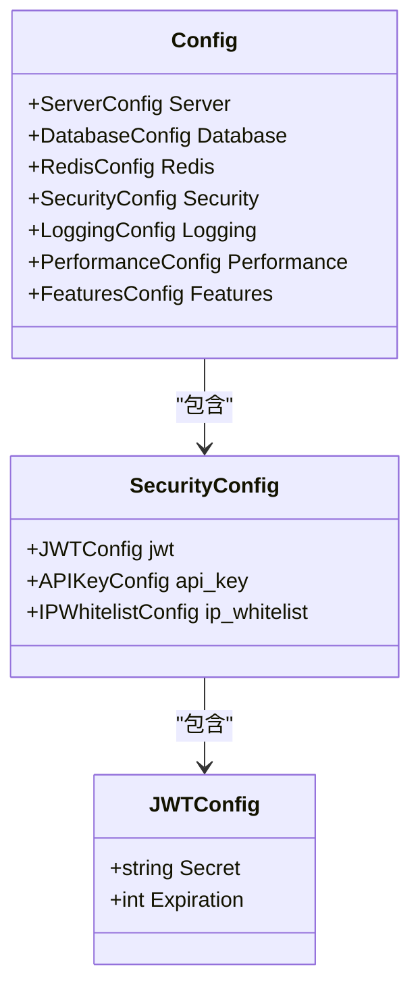

**图表来源**
- [internal/config/config.go](file://internal/config/config.go#L68-L80)

**章节来源**
- [internal/config/config.go](file://internal/config/config.go#L68-L80)

## 密钥安全要求

### 密钥长度要求

JWT密钥必须满足以下安全要求：

| 要求类型 | 最小长度 | 推荐长度 | 安全级别 |
|---------|---------|---------|---------|
| AES-256 | 32 字节 | ≥32 字节 | 高 |
| HMAC-SHA256 | 32 字节 | ≥32 字节 | 高 |
| RSA/ECDSA | 2048 位 | ≥2048 位 | 极高 |

### 密钥复杂度要求

1. **随机性要求**：密钥必须使用密码学安全的随机数生成器生成
2. **熵值要求**：密钥应具有至少128位的熵值
3. **字符集要求**：推荐使用Base64编码的安全随机字符串

### 密钥生成方式

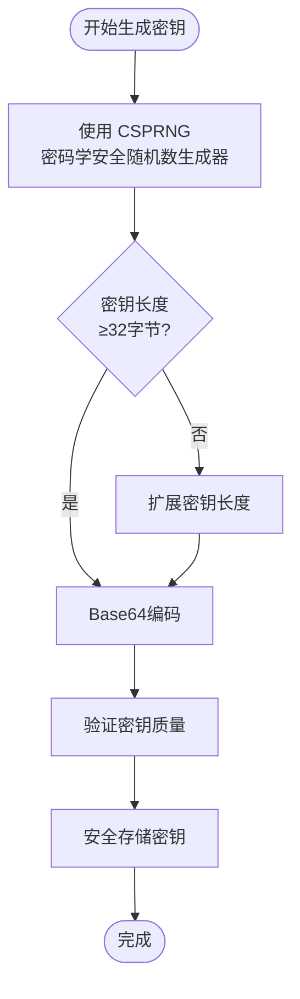

**图表来源**
- [internal/config/config_test.go](file://internal/config/config_test.go#L418-L419)

### 密钥存储安全

密钥不应硬编码在源代码中，推荐使用以下安全存储方式：

1. **环境变量**：通过环境变量注入密钥
2. **密钥管理服务**：使用AWS KMS、Azure Key Vault等
3. **配置文件加密**：对配置文件进行加密存储
4. **硬件安全模块**：使用HSM保护密钥

**章节来源**
- [config.yaml](file://config.yaml#L38-L39)
- [config.test.yaml](file://config.test.yaml#L38-L39)

## 过期时间设置策略

### 时间单位和范围

JWT的`Expiration`字段以秒为单位，表示令牌的有效期：

| 时间范围 | 适用场景 | 安全影响 |
|---------|---------|---------|
| 300-900 秒 | 一次性操作 | 最低风险 |
| 1800-3600 秒 | 短期会话 | 中等风险 |
| 86400-259200 秒 | 长期会话 | 较高风险 |
| 无过期时间 | 特殊需求 | 最高风险 |

### 建议值对照表

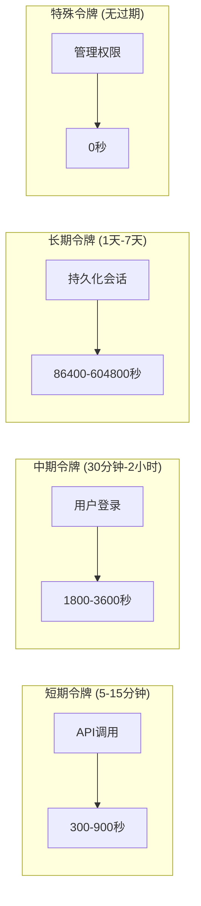

### 对安全性的影响

1. **短有效期**：提高安全性但增加刷新频率
2. **长有效期**：降低安全性但提升用户体验
3. **动态调整**：根据用户行为和风险评估动态调整

**章节来源**
- [config.yaml](file://config.yaml#L39-L39)
- [config.test.yaml](file://config.test.yaml#L39-L39)

## 配置文件示例

### 基础配置结构

```yaml
security:
  # JWT 配置
  jwt:
    secret: "your-secret-key-change-in-production"
    expiration: 7200 # 2小时，单位：秒
```

### 环境变量配置

```bash
# 生产环境
export JWT_SECRET="your-production-secret-key-here"
export JWT_EXPIRATION="7200"

# 开发环境
export JWT_SECRET="development-secret-key"
export JWT_EXPIRATION="1800"
```

### 配置加载流程

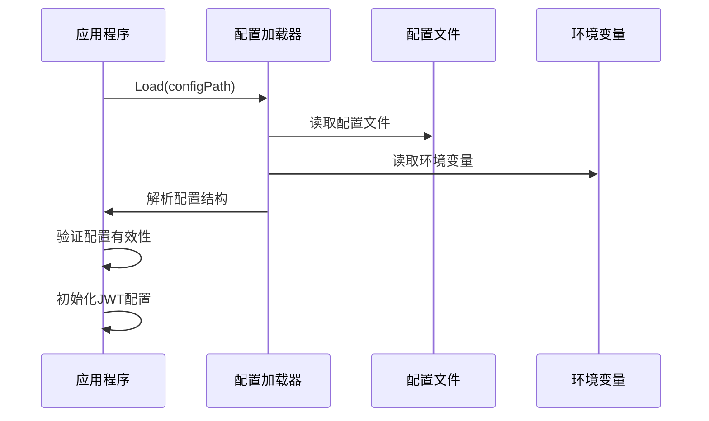

**图表来源**
- [internal/config/config.go](file://internal/config/config.go#L138-L167)

**章节来源**
- [config.yaml](file://config.yaml#L36-L40)
- [config.test.yaml](file://config.test.yaml#L36-L40)

## API认证流程集成

### 认证中间件架构

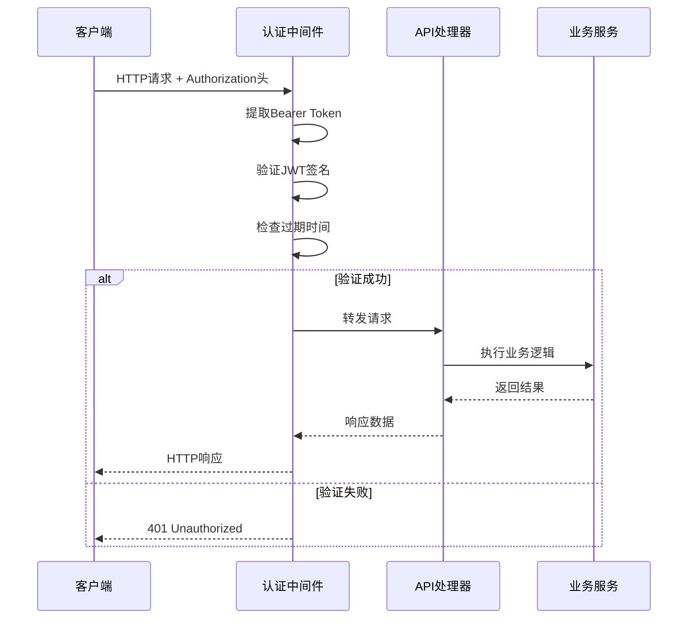

**图表来源**
- [internal/service/admin_service.go](file://internal/service/admin_service.go#L40-L124)

### CORS配置与JWT

JWT认证需要配合CORS中间件使用，确保跨域请求的正确处理：

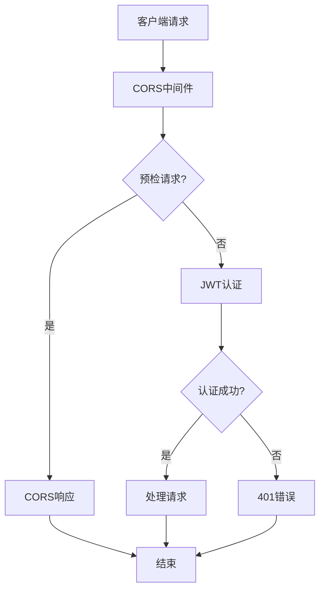

**图表来源**
- [internal/middleware/cors.go](file://internal/middleware/cors.go#L42-L88)

**章节来源**
- [internal/service/admin_service.go](file://internal/service/admin_service.go#L40-L124)
- [internal/middleware/cors.go](file://internal/middleware/cors.go#L42-L88)

## 运行时行为分析

### JWT验证流程

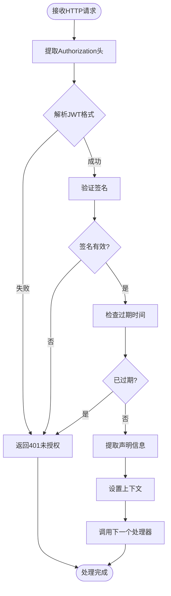

### 错误处理机制

| 错误类型 | HTTP状态码 | 错误信息 | 处理方式 |
|---------|-----------|---------|---------|
| 缺少Authorization头 | 401 | "Missing Authorization header" | 返回401 |
| 无效的Bearer格式 | 401 | "Invalid Bearer format" | 返回401 |
| 签名验证失败 | 401 | "Invalid signature" | 返回401 |
| 令牌已过期 | 401 | "Token expired" | 返回401 |
| 令牌格式错误 | 400 | "Invalid token format" | 返回400 |

**章节来源**
- [internal/service/middleware.go](file://internal/service/middleware.go#L18-L37)

## 生产环境推荐配置

### 推荐配置参数

```yaml
security:
  jwt:
    secret: "${JWT_SECRET}"  # 从环境变量读取
    expiration: 1800        # 30分钟，适合生产环境
```

### 安全配置清单

| 配置项 | 推荐值 | 说明 |
|-------|-------|------|
| 密钥长度 | ≥32字节 | 使用强随机密钥 |
| 过期时间 | 1800-3600秒 | 平衡安全性和可用性 |
| 算法选择 | HS256 | 标准且高效 |
| 刷新机制 | 实现 | 支持令牌刷新 |
| 错误处理 | 通用错误 | 避免信息泄露 |

### 监控和告警

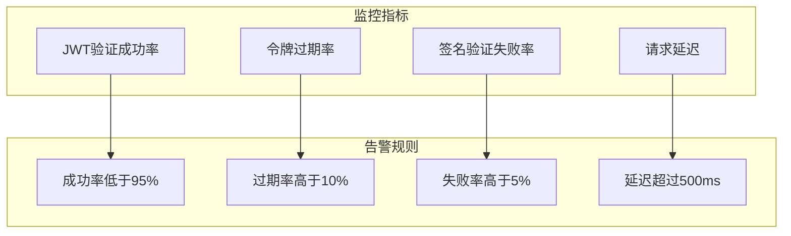

**章节来源**
- [config.yaml](file://config.yaml#L36-L40)

## 测试环境配置对比

### 开发环境配置

```yaml
# config.test.yaml
security:
  jwt:
    secret: "test-secret-key-do-not-use-in-production"
    expiration: 7200
```

### 测试环境特点

| 特性 | 开发环境 | 测试环境 | 生产环境 |
|------|---------|---------|---------|
| 密钥强度 | 中等 | 中等 | 高 |
| 过期时间 | 较长 | 较短 | 适中 |
| 错误信息 | 详细 | 基本 | 通用 |
| 性能要求 | 低 | 中等 | 高 |

### 环境切换策略

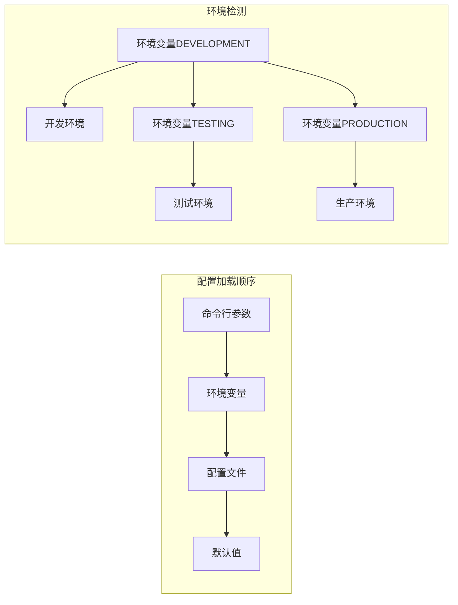

**图表来源**
- [config.test.yaml](file://config.test.yaml#L36-L40)

**章节来源**
- [config.test.yaml](file://config.test.yaml#L36-L40)

## 密钥轮换机制建议

### 轮换策略

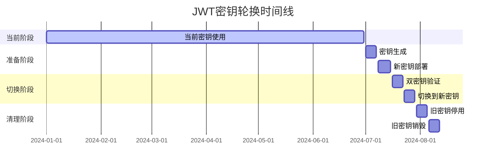

### 实施步骤

1. **准备阶段**（提前1-2周）
   - 生成新的密钥对
   - 部署新密钥到所有节点
   - 更新密钥管理系统的配置

2. **双密钥验证**（1周）
   - 同时支持新旧密钥验证
   - 监控验证成功率
   - 确保向后兼容性

3. **切换阶段**（1周）
   - 停用旧密钥验证
   - 强制使用新密钥
   - 更新相关文档

4. **清理阶段**（1周）
   - 销毁旧密钥材料
   - 更新密钥轮换计划
   - 记录轮换过程

### 自动化工具

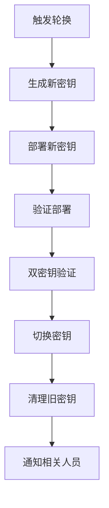

## 安全漏洞防范措施

### 常见安全威胁

| 威胁类型 | 描述 | 防范措施 |
|---------|------|---------|
| 密钥泄露 | 密钥被意外暴露 | 环境变量存储、定期轮换 |
| 重放攻击 | 旧令牌被重复使用 | 添加nonce或时间戳 |
| 中间人攻击 | 网络拦截令牌 | HTTPS强制、签名验证 |
| 权限提升 | 伪造高权限令牌 | 严格权限控制、审计日志 |

### 防护机制

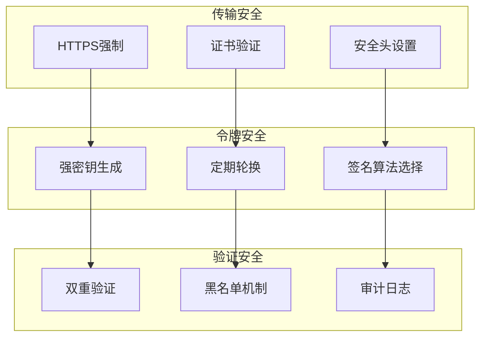

### 最佳实践清单

1. **密钥管理**
   - 使用专用密钥管理服务
   - 实施最小权限原则
   - 定期审查密钥访问日志

2. **令牌设计**
   - 包含必要的声明信息
   - 避免在令牌中存储敏感数据
   - 实施适当的过期策略

3. **运行时安全**
   - 监控异常访问模式
   - 实施速率限制
   - 记录详细的审计日志

**章节来源**
- [internal/config/config_test.go](file://internal/config/config_test.go#L418-L419)

## 最佳实践总结

### 配置管理最佳实践

1. **环境分离**
   - 开发、测试、生产环境使用不同密钥
   - 避免在配置文件中硬编码密钥
   - 使用环境变量注入敏感信息

2. **密钥安全**
   - 密钥长度至少32字节
   - 使用密码学安全的随机数生成器
   - 定期轮换密钥（建议每6个月）

3. **性能优化**
   - 合理设置过期时间
   - 实施令牌缓存机制
   - 优化签名验证性能

### 运维监控要点

```mermaid
mindmap
root((JWT监控))
验证指标
成功率
延迟
错误分类
安全指标
异常访问
签名失败
过期率
性能指标
验证时间
并发量
资源使用
运维指标
部署频率
回滚次数
告警响应
```

### 故障排除指南

| 问题症状 | 可能原因 | 解决方案 |
|---------|---------|---------|
| 401错误频繁出现 | 密钥不匹配 | 检查密钥配置一致性 |
| 令牌验证缓慢 | 签名算法复杂 | 优化算法选择 |
| 过期时间不生效 | 配置未生效 | 重启服务或重新加载配置 |
| 跨域问题 | CORS配置错误 | 检查CORS中间件设置 |

通过遵循这些最佳实践，可以确保JWT配置的安全性、可靠性和可维护性，为MockServer项目提供强大的身份认证和授权保障。