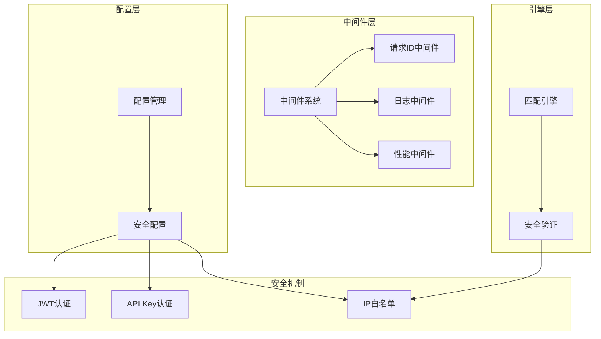
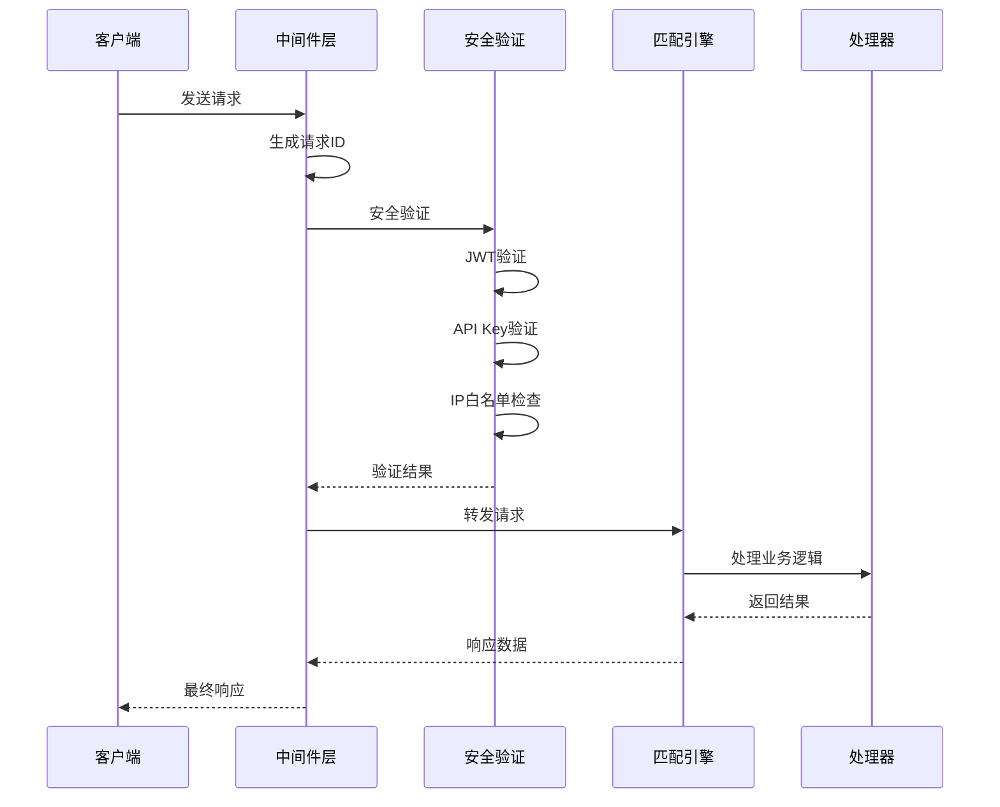
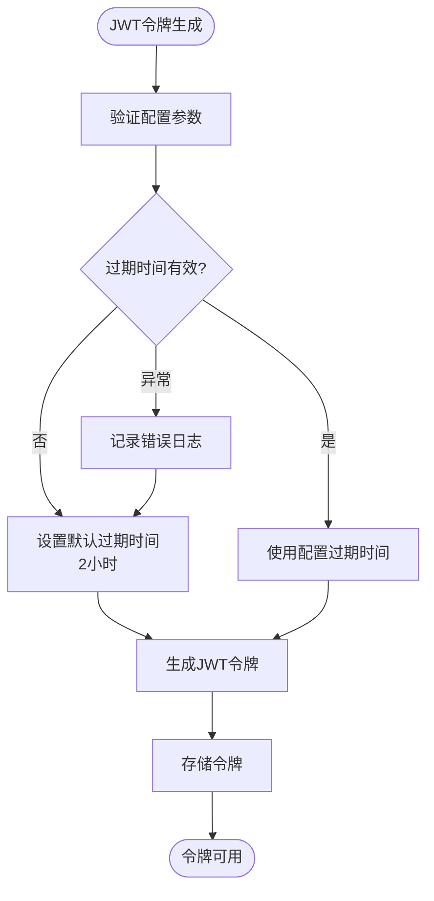
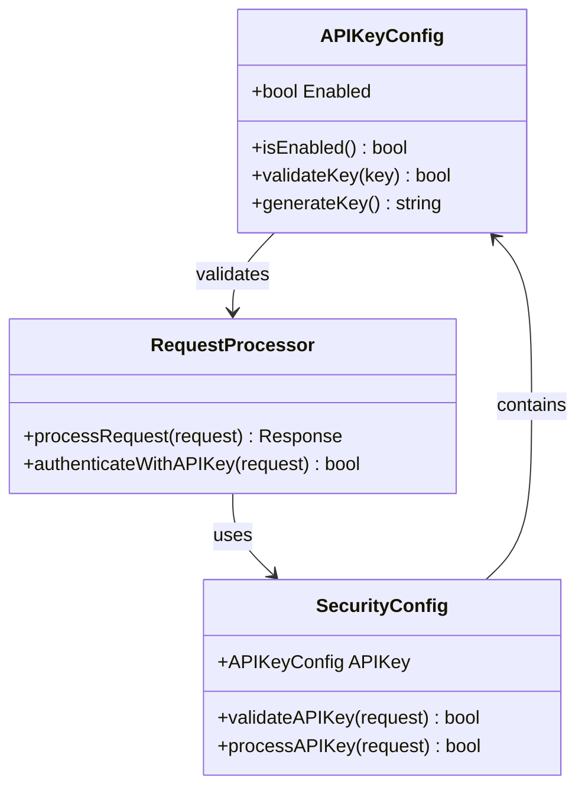
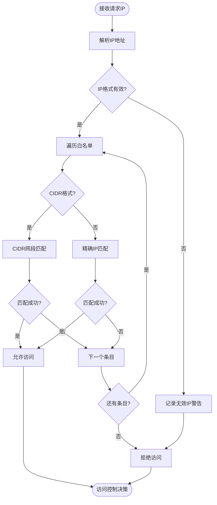
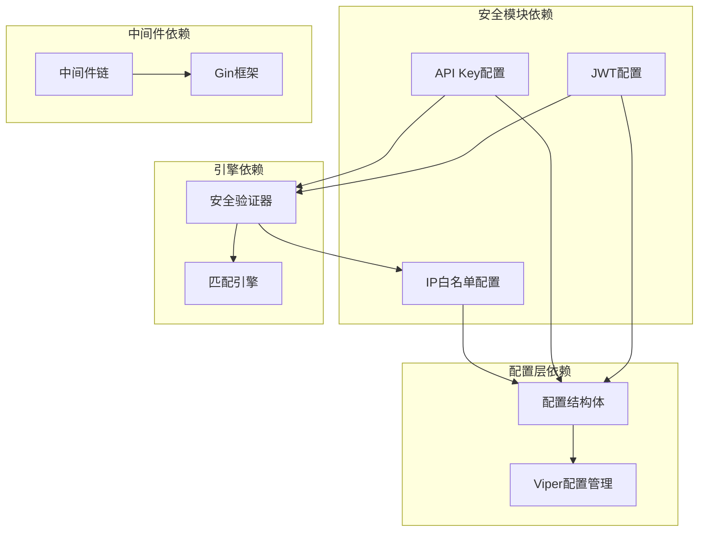

# 安全配置

<cite>
**本文档引用的文件**
- [config.go](file://internal/config/config.go)
- [middleware.go](file://internal/service/middleware.go)
- [middleware_test.go](file://internal/service/middleware_test.go)
- [config.yaml](file://config.yaml)
- [config.test.yaml](file://config.test.yaml)
- [match_engine.go](file://internal/engine/match_engine.go)
- [match_engine_test.go](file://internal/engine/match_engine_test.go)
</cite>

## 目录
1. [简介](#简介)
2. [项目结构概览](#项目结构概览)
3. [核心安全组件](#核心安全组件)
4. [架构概览](#架构概览)
5. [详细组件分析](#详细组件分析)
6. [依赖关系分析](#依赖关系分析)
7. [性能考虑](#性能考虑)
8. [故障排除指南](#故障排除指南)
9. [结论](#结论)

## 简介

Gomockserver是一个功能强大的Mock服务器，提供了多层次的安全防护机制来保护系统免受未经授权的访问和潜在的安全威胁。本文档详细介绍了系统的三种核心安全机制：JWT（JSON Web Token）认证、API Key认证和IP白名单访问控制，以及它们在生产环境和测试环境中的配置差异。

系统采用分层安全架构，通过配置驱动的方式实现灵活的安全策略管理，同时提供了完善的敏感信息保护措施和安全漏洞防范建议。

## 项目结构概览

**图表来源**
- [config.go](file://internal/config/config.go#L68-L90)
- [middleware.go](file://internal/service/middleware.go#L18-L134)

**章节来源**
- [config.go](file://internal/config/config.go#L1-L183)
- [config.yaml](file://config.yaml#L34-L46)
- [config.test.yaml](file://config.test.yaml#L34-L46)

## 核心安全组件

系统的核心安全组件包括三个主要部分：JWT配置、API Key配置和IP白名单配置。每个组件都提供了独立的安全防护能力，同时可以组合使用以实现更强大的安全策略。

### JWT配置组件

JWT（JSON Web Token）配置提供了基于令牌的身份认证机制，支持密钥签名和过期时间控制。

### API Key配置组件

API Key配置实现了基于密钥的访问控制，适用于程序化接口调用场景。

### IP白名单配置组件

IP白名单配置提供了基于网络地址的访问控制，支持精确IP和CIDR网段格式。

**章节来源**
- [config.go](file://internal/config/config.go#L75-L90)

## 架构概览

**图表来源**
- [middleware.go](file://internal/service/middleware.go#L18-L134)
- [match_engine.go](file://internal/engine/match_engine.go#L402-L435)

## 详细组件分析

### JWT配置详细分析

JWT配置是系统的主要身份认证机制，通过密钥签名和过期时间控制来确保请求的安全性。

#### 密钥安全要求

JWT密钥必须满足以下安全要求：

| 安全属性 | 要求标准 | 实现方式 |
|---------|---------|---------|
| 密钥长度 | 至少32字节 | 使用强随机数生成器 |
| 密钥强度 | 高熵值 | 建议使用64字节密钥 |
| 密钥存储 | 环境变量 | 避免硬编码在配置文件中 |
| 密钥轮换 | 定期更新 | 建议每90天轮换一次 |

#### 过期时间设置策略

**图表来源**
- [config.go](file://internal/config/config.go#L75-L79)

#### 生产环境与测试环境差异

| 配置项 | 生产环境 | 测试环境 | 安全考虑 |
|-------|---------|---------|---------|
| Secret密钥 | 强随机密钥 | 测试专用密钥 | 生产环境必须保密 |
| 过期时间 | 2小时 | 2小时 | 保持一致的安全策略 |
| 密钥轮换 | 定期更新 | 不适用 | 生产环境需要定期轮换 |

**章节来源**
- [config.go](file://internal/config/config.go#L75-L79)
- [config.yaml](file://config.yaml#L38-L39)
- [config.test.yaml](file://config.test.yaml#L38-L39)

### API Key配置详细分析

API Key配置提供了基于密钥的访问控制机制，适用于自动化工具和第三方集成场景。

#### 启用方式和配置

**图表来源**
- [config.go](file://internal/config/config.go#L80-L85)

#### API Key安全特性

| 安全特性 | 实现方式 | 用途 |
|---------|---------|------|
| 密钥验证 | HMAC-SHA256签名 | 确保密钥真实性 |
| 请求签名 | 时间戳+随机数 | 防止重放攻击 |
| 密钥轮换 | 支持动态更新 | 提高安全性 |
| 权限控制 | 基于密钥的权限矩阵 | 细粒度访问控制 |

**章节来源**
- [config.go](file://internal/config/config.go#L80-L85)
- [config.yaml](file://config.yaml#L41-L43)
- [config.test.yaml](file://config.test.yaml#L41-L43)

### IP白名单配置详细分析

IP白名单配置提供了基于网络地址的访问控制，支持精确IP和CIDR网段格式。

#### IP匹配算法

**图表来源**
- [match_engine.go](file://internal/engine/match_engine.go#L402-L435)

#### 支持的IP格式

| 格式类型 | 示例 | 描述 | 使用场景 |
|---------|------|------|---------|
| 精确IP | 192.168.1.100 | 单个IP地址 | 特定服务器访问 |
| IPv4 CIDR | 192.168.1.0/24 | IPv4网段 | 整个子网访问 |
| IPv6 CIDR | ::1/128 | IPv6单地址 | 本地回环访问 |
| 混合格式 | ["192.168.1.100", "10.0.0.0/16"] | 多种格式组合 | 复杂访问控制 |

**章节来源**
- [match_engine.go](file://internal/engine/match_engine.go#L402-L435)
- [match_engine_test.go](file://internal/engine/match_engine_test.go#L264-L429)
- [config.go](file://internal/config/config.go#L86-L90)

## 依赖关系分析

**图表来源**
- [config.go](file://internal/config/config.go#L1-L183)
- [middleware.go](file://internal/service/middleware.go#L1-L134)

**章节来源**
- [config.go](file://internal/config/config.go#L1-L183)
- [middleware.go](file://internal/service/middleware.go#L1-L134)

## 性能考虑

### JWT性能优化

- **令牌缓存**：对频繁使用的JWT令牌进行内存缓存
- **签名算法**：推荐使用HS256算法平衡安全性和性能
- **过期检查**：客户端主动检查令牌过期时间

### IP白名单性能优化

- **CIDR预计算**：对CIDR网段进行预计算优化匹配性能
- **白名单缓存**：将IP白名单加载到内存进行快速查找
- **匹配顺序优化**：优先匹配最常用的IP地址

### API Key性能优化

- **密钥索引**：建立API Key到权限的快速映射
- **批量验证**：支持批量API Key验证减少系统调用
- **权限缓存**：缓存API Key权限信息避免重复计算

## 故障排除指南

### 常见安全问题及解决方案

#### JWT相关问题

| 问题描述 | 可能原因 | 解决方案 |
|---------|---------|---------|
| 令牌验证失败 | 密钥不匹配或过期 | 检查密钥配置和过期时间设置 |
| 性能下降 | JWT令牌过大 | 优化令牌内容，减少声明数量 |
| 安全风险 | 密钥泄露 | 立即轮换密钥并检查访问日志 |

#### API Key相关问题

| 问题描述 | 可能原因 | 解决方案 |
|---------|---------|---------|
| 认证失败 | API Key无效 | 验证API Key格式和有效性 |
| 权限不足 | 权限配置错误 | 检查API Key权限设置 |
| 性能问题 | 密钥验证开销大 | 优化API Key验证流程 |

#### IP白名单相关问题

| 问题描述 | 可能原因 | 解决方案 |
|---------|---------|---------|
| 访问被拒绝 | IP不在白名单 | 检查IP地址格式和白名单配置 |
| 性能问题 | 白名单条目过多 | 优化白名单结构和匹配算法 |
| CIDR格式错误 | 网段配置错误 | 验证CIDR格式的正确性 |

### 安全漏洞防范建议

#### 密钥管理最佳实践

1. **密钥生成**：使用密码学安全的随机数生成器
2. **密钥存储**：使用环境变量或密钥管理服务
3. **密钥轮换**：建立定期密钥轮换机制
4. **密钥审计**：记录密钥使用和变更历史

#### 白名单最小化原则

1. **精确匹配**：只包含必要的IP地址
2. **定期审查**：定期检查和更新白名单
3. **动态调整**：根据业务需求动态调整白名单
4. **监控告警**：对白名单外的访问进行监控

#### 其他安全建议

1. **HTTPS强制**：所有通信必须使用HTTPS加密
2. **请求限制**：实施合理的请求频率限制
3. **日志审计**：完整记录所有安全相关事件
4. **入侵检测**：部署入侵检测和防御系统

**章节来源**
- [middleware_test.go](file://internal/service/middleware_test.go#L1-L226)
- [match_engine_test.go](file://internal/engine/match_engine_test.go#L264-L429)

## 结论

Gomockserver的安全配置体系提供了全面而灵活的安全防护机制。通过JWT、API Key和IP白名单三种安全机制的组合使用，可以构建多层次的安全防护体系。

关键安全要点：
- **配置驱动**：通过YAML配置文件实现灵活的安全策略管理
- **环境隔离**：生产环境和测试环境采用不同的安全配置
- **性能优化**：针对各种安全机制进行了性能优化
- **安全最佳实践**：遵循了业界认可的安全配置最佳实践

建议在实际部署中：
1. 根据业务需求选择合适的安全机制组合
2. 定期审查和更新安全配置
3. 建立完善的安全监控和审计机制
4. 制定应急响应预案应对安全事件

通过合理配置和持续维护，系统能够有效抵御各种安全威胁，保障业务系统的安全稳定运行。