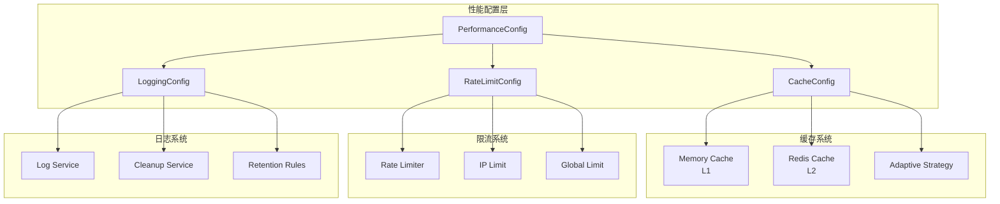
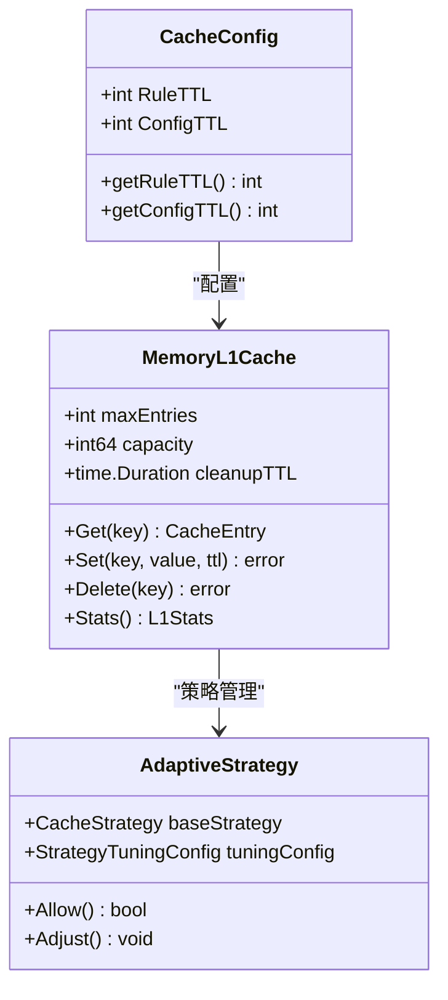
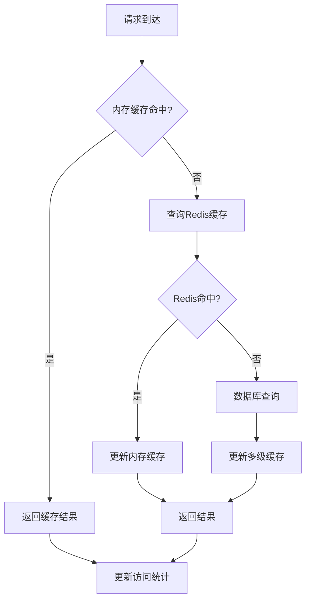
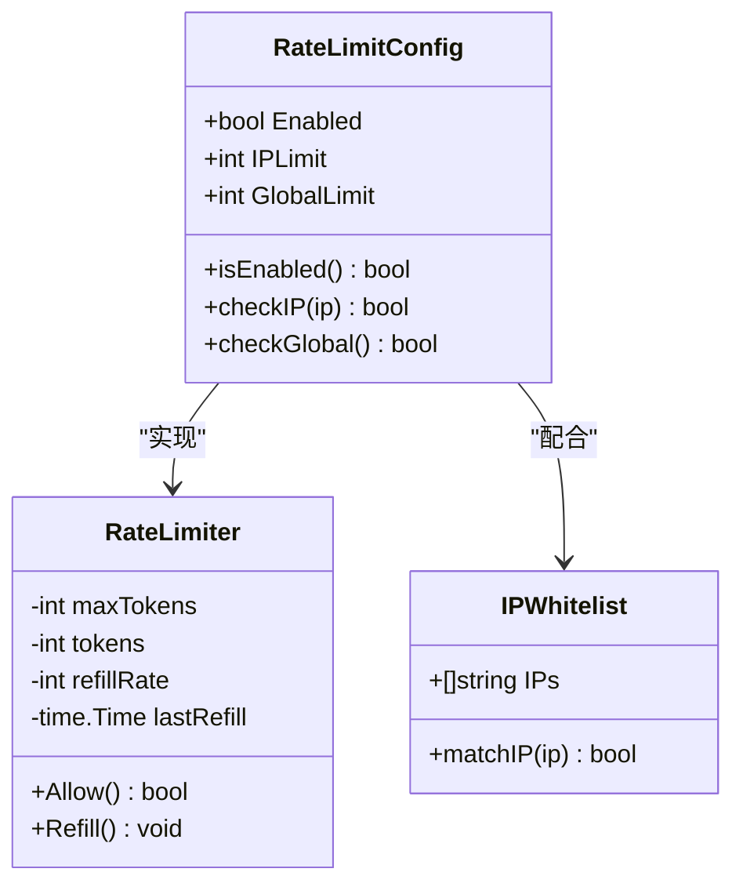
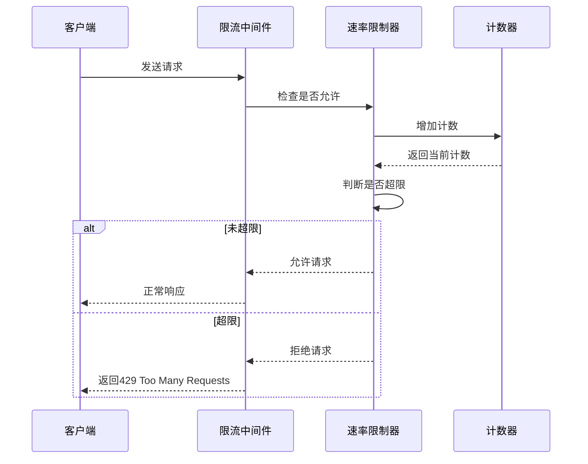
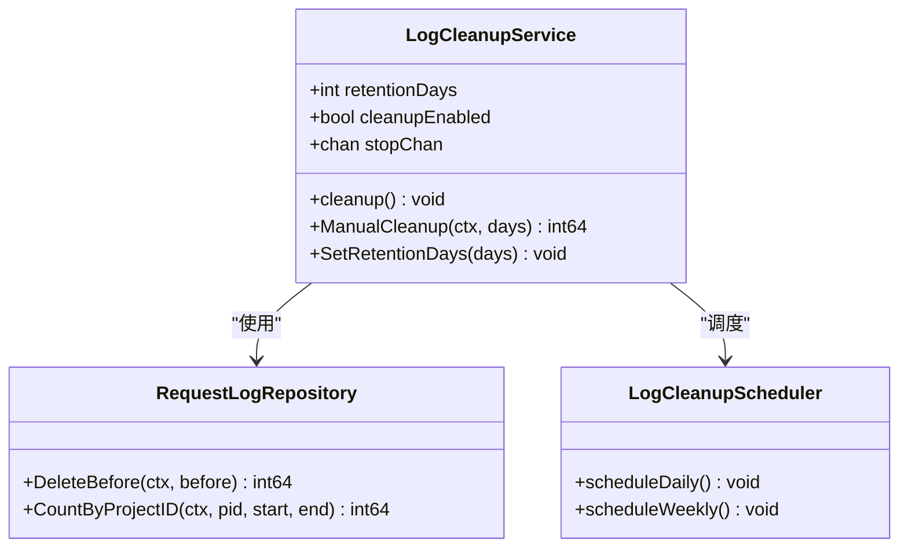
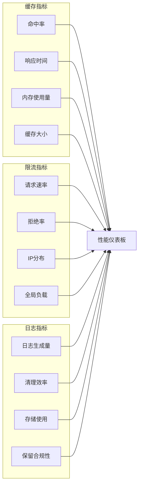

# 性能配置

<cite>
**本文档引用的文件**
- [internal/config/config.go](file://internal/config/config.go)
- [config.yaml](file://config.yaml)
- [config.test.yaml](file://config.test.yaml)
- [internal/service/middleware.go](file://internal/service/middleware.go)
- [internal/service/log_cleanup_service.go](file://internal/service/log_cleanup_service.go)
- [internal/cache/l1_memory.go](file://internal/cache/l1_memory.go)
- [internal/cache/monitor.go](file://internal/cache/monitor.go)
- [internal/engine/match_engine.go](file://internal/engine/match_engine.go)
</cite>

## 目录
1. [简介](#简介)
2. [性能配置架构](#性能配置架构)
3. [缓存配置详解](#缓存配置详解)
4. [限流配置详解](#限流配置详解)
5. [日志保留配置](#日志保留配置)
6. [环境差异对比](#环境差异对比)
7. [性能调优建议](#性能调优建议)
8. [监控与维护](#监控与维护)

## 简介

MockServer 的性能配置系统提供了全面的性能优化机制，包括智能缓存管理、流量控制和日志管理功能。通过合理的配置，可以显著提升系统的响应速度、稳定性和资源利用率。

## 性能配置架构

**图表来源**
- [internal/config/config.go](file://internal/config/config.go#L108-L126)
- [internal/cache/l1_memory.go](file://internal/cache/l1_memory.go#L11-L23)

**章节来源**
- [internal/config/config.go](file://internal/config/config.go#L108-L126)

## 缓存配置详解

### CacheConfig 结构

缓存配置包含两个核心参数：`rule_ttl` 和 `config_ttl`，它们分别控制不同类型的缓存生命周期。

**图表来源**
- [internal/config/config.go](file://internal/config/config.go#L115-L119)
- [internal/cache/l1_memory.go](file://internal/cache/l1_memory.go#L11-L23)

### rule_ttl 参数详解

**定义**: 规则缓存时间，单位：秒

**默认值**: 300 秒 (5分钟)

**作用机制**:
- 控制匹配规则的缓存时间
- 减少重复规则匹配的计算开销
- 支持动态规则更新

**性能影响**:
- 较短的 TTL 提高规则更新的实时性
- 较长的 TTL 提升匹配性能

**章节来源**
- [config.yaml](file://config.yaml#L65-L66)
- [internal/cache/l1_memory.go](file://internal/cache/l1_memory.go#L119-L122)

### config_ttl 参数详解

**定义**: 配置缓存时间，单位：秒

**默认值**: 1800 秒 (30分钟)

**作用机制**:
- 缓存项目和环境配置信息
- 减少数据库查询次数
- 支持配置变更的渐进式生效

**性能影响**:
- 影响配置更新的传播延迟
- 关联到系统的整体响应时间

**章节来源**
- [config.yaml](file://config.yaml#L65-L66)
- [internal/cache/l1_memory.go](file://internal/cache/l1_memory.go#L119-L122)

### 缓存策略优化

系统采用多级缓存架构：

**图表来源**
- [internal/cache/l1_memory.go](file://internal/cache/l1_memory.go#L69-L102)

## 限流配置详解

### RateLimitConfig 结构

**图表来源**
- [internal/config/config.go](file://internal/config/config.go#L121-L126)
- [internal/cache/monitor.go](file://internal/cache/monitor.go#L848-L877)

### 启用条件

**默认状态**: 启用 (`enabled: true`)

**应用场景**:
- 生产环境保护
- 防止恶意请求
- 资源合理分配

**章节来源**
- [config.yaml](file://config.yaml#L69-L71)

### IP 限制配置

**参数**: `ip_limit: 1000`

**含义**: 每分钟允许每个IP的最大请求数

**实现机制**:
- 基于令牌桶算法
- 每分钟重置计数器
- 支持滑动窗口统计

**性能考虑**:
- 过高的限制可能导致资源耗尽
- 过低的限制可能影响用户体验

**章节来源**
- [config.yaml](file://config.yaml#L70)

### 全局限制配置

**参数**: `global_limit: 10000`

**含义**: 每秒系统允许的最大总请求数

**实现策略**:
- 全局共享计数器
- 实时监控系统负载
- 自动降级机制

**章节来源**
- [config.yaml](file://config.yaml#L71)

### 限流算法实现

**图表来源**
- [internal/cache/monitor.go](file://internal/cache/monitor.go#L858-L877)

## 日志保留配置

### log_retention_days 参数

**定义**: 请求日志保留天数

**默认值**: 7 天

**作用机制**:
- 控制历史请求日志的存储周期
- 平衡存储空间和审计需求
- 支持合规性要求

**章节来源**
- [config.yaml](file://config.yaml#L62)

### 日志清理服务

**图表来源**
- [internal/service/log_cleanup_service.go](file://internal/service/log_cleanup_service.go#L65-L119)

### 清理策略

**自动清理**:
- 每天凌晨2点执行
- 基于保留天数自动删除
- 支持并发安全操作

**手动清理**:
- 支持按需清理
- 可指定保留天数
- 提供清理统计报告

**章节来源**
- [internal/service/log_cleanup_service.go](file://internal/service/log_cleanup_service.go#L65-L119)

## 环境差异对比

### 开发环境 vs 生产环境

| 配置项 | 开发环境 | 测试环境 | 生产环境 |
|--------|----------|----------|----------|
| log_retention_days | 7天 | 3天 | 7天 |
| rule_ttl | 300秒 | 60秒 | 300秒 |
| config_ttl | 1800秒 | 300秒 | 1800秒 |
| rate_limit.enabled | false | false | true |
| rate_limit.ip_limit | 1000 | 10000 | 1000 |
| rate_limit.global_limit | 10000 | 100000 | 10000 |

### 环境特定配置说明

**开发环境**:
- 禁用限流以方便调试
- 较短的缓存时间便于快速验证修改
- 标准的日志保留期

**测试环境**:
- 禁用限流避免测试干扰
- 更短的缓存时间和日志保留期
- 更宽松的限流阈值

**生产环境**:
- 启用完整的限流保护
- 标准的缓存和日志配置
- 高可用的监控和告警

**章节来源**
- [config.yaml](file://config.yaml#L61-L71)
- [config.test.yaml](file://config.test.yaml#L61-L71)

## 性能调优建议

### 缓存优化策略

**RuleTTL 调整**:
- 高频变更规则: 120-300秒
- 稳定规则: 600-1800秒
- 特殊场景: 30-60秒

**ConfigTTL 优化**:
- 小型项目: 600秒
- 中型项目: 1800秒
- 大型项目: 3600秒

### 限流参数调优

**IP 限制设置**:
- 个人用户: 100-500请求/分钟
- 企业用户: 1000-5000请求/分钟
- API 密钥: 10000-50000请求/分钟

**全局限制配置**:
- 单机部署: CPU核心数 × 1000
- 集群部署: 单机限制 × 节点数
- 关键服务: 降低20-30%

### 日志管理优化

**保留期策略**:
- 重要业务: 30天
- 一般业务: 7天
- 开发测试: 3天

**存储成本控制**:
- 压缩存储: 启用日志压缩
- 分级存储: 热数据内存，冷数据磁盘
- 定期归档: 历史数据归档到低成本存储

## 监控与维护

### 性能指标监控

### 常见问题排查

**缓存性能问题**:
- 检查命中率是否低于80%
- 监控内存使用是否接近上限
- 分析热点数据分布

**限流异常**:
- 检查限流配置是否过于严格
- 监控IP分布是否不均匀
- 分析突发流量模式

**日志存储问题**:
- 检查磁盘空间使用情况
- 监控清理任务执行状态
- 验证保留策略是否符合要求

### 维护最佳实践

**定期检查**:
- 每周检查性能指标趋势
- 每月评估配置合理性
- 每季度进行容量规划

**预防措施**:
- 建立配置变更审批流程
- 实施监控告警机制
- 制定应急预案

**章节来源**
- [internal/service/log_cleanup_service.go](file://internal/service/log_cleanup_service.go#L65-L119)
- [internal/cache/monitor.go](file://internal/cache/monitor.go#L848-L877)