# 日志保留配置

<cite>
**本文档中引用的文件**
- [internal/config/config.go](file://internal/config/config.go)
- [config.yaml](file://config.yaml)
- [config.test.yaml](file://config.test.yaml)
- [internal/service/log_cleanup_service.go](file://internal/service/log_cleanup_service.go)
- [internal/repository/database.go](file://internal/repository/database.go)
- [internal/models/models.go](file://internal/models/models.go)
- [internal/service/log_cleanup_service_test.go](file://internal/service/log_cleanup_service_test.go)
- [internal/repository/request_log_repository_test.go](file://internal/repository/request_log_repository_test.go)
</cite>

## 目录
1. [简介](#简介)
2. [配置结构](#配置结构)
3. [核心参数详解](#核心参数详解)
4. [自动清理机制](#自动清理机制)
5. [性能影响分析](#性能影响分析)
6. [环境配置差异](#环境配置差异)
7. [最佳实践建议](#最佳实践建议)
8. [故障排除指南](#故障排除指南)
9. [总结](#总结)

## 简介

日志保留配置是Mock Server系统中一个关键的性能优化和存储管理功能。通过`PerformanceConfig`下的`log_retention_days`参数，系统能够自动控制请求日志在数据库中的存储期限，平衡存储成本、查询性能和审计需求之间的关系。

该配置参数直接影响系统的存储空间使用、数据库查询效率以及长期审计能力，是运维人员需要重点关注的重要配置项。

## 配置结构

### 性能配置架构

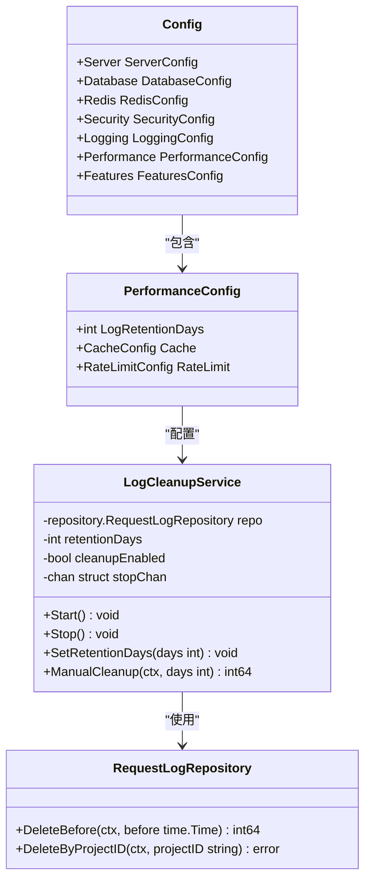

**图表来源**
- [internal/config/config.go](file://internal/config/config.go#L108-L113)
- [internal/service/log_cleanup_service.go](file://internal/service/log_cleanup_service.go#L12-L18)

### 配置文件结构

系统通过YAML配置文件提供日志保留配置，主要位于`performance.log_retention_days`字段：

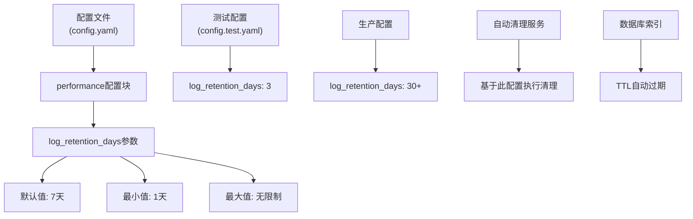

**图表来源**
- [config.yaml](file://config.yaml#L61-L62)
- [config.test.yaml](file://config.test.yaml#L61-L62)

**章节来源**
- [internal/config/config.go](file://internal/config/config.go#L108-L113)
- [config.yaml](file://config.yaml#L61-L62)
- [config.test.yaml](file://config.test.yaml#L61-L62)

## 核心参数详解

### log_retention_days参数

`log_retention_days`是PerformanceConfig结构体中的核心配置参数，用于控制请求日志在数据库中的保留天数。

#### 参数特性

| 属性 | 值 | 描述 |
|------|-----|------|
| 类型 | int | 整数值 |
| 默认值 | 7 | 如果未配置或无效值时的默认保留天数 |
| 最小值 | 1 | 最小有效保留天数 |
| 最大值 | 无限制 | 可设置任意正整数值 |
| 验证规则 | 大于0 | 无效值自动重置为默认值 |

#### 配置验证逻辑

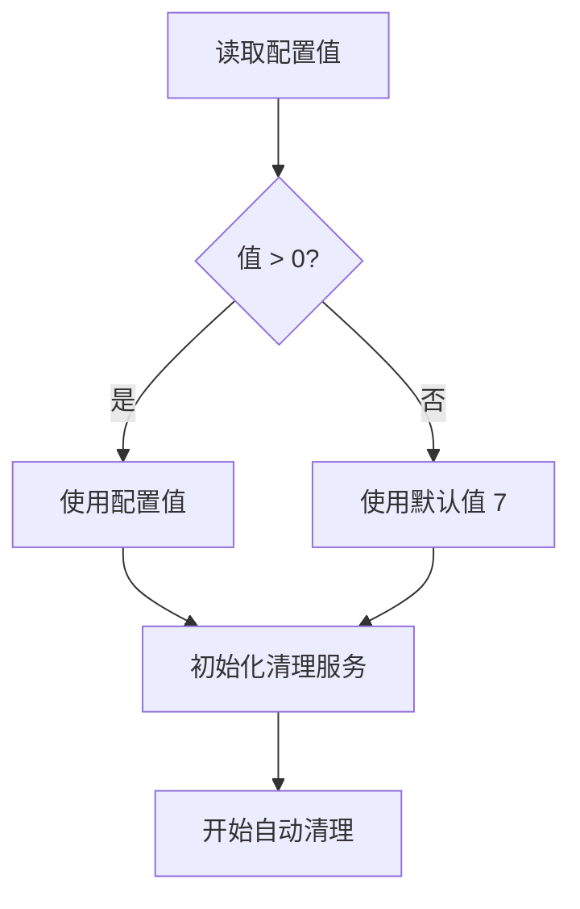

**图表来源**
- [internal/service/log_cleanup_service.go](file://internal/service/log_cleanup_service.go#L21-L24)

#### 数据库索引配置

系统在MongoDB中为logs集合创建了特殊的TTL（Time-To-Live）索引，该索引直接基于`log_retention_days`配置：

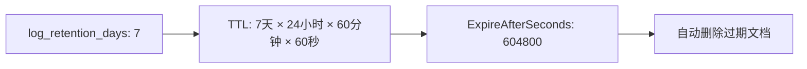

**图表来源**
- [internal/repository/database.go](file://internal/repository/database.go#L107-L121)

**章节来源**
- [internal/config/config.go](file://internal/config/config.go#L108-L113)
- [internal/service/log_cleanup_service.go](file://internal/service/log_cleanup_service.go#L21-L24)
- [internal/repository/database.go](file://internal/repository/database.go#L107-L121)

## 自动清理机制

### 清理服务架构

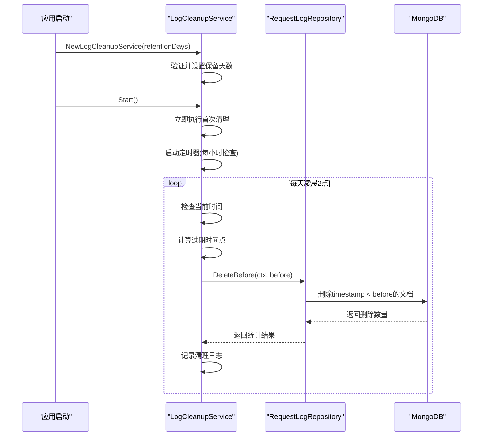

**图表来源**
- [internal/service/log_cleanup_service.go](file://internal/service/log_cleanup_service.go#L35-L57)

### 清理执行策略

#### 定时清理机制

清理服务采用智能的时间调度策略：

1. **启动时立即清理**：应用启动后立即执行一次清理操作
2. **定期检查**：每小时检查一次是否到达清理时间
3. **精确执行**：仅在每天凌晨2点执行实际的清理操作

#### 清理流程

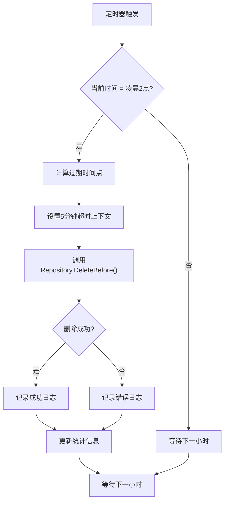

**图表来源**
- [internal/service/log_cleanup_service.go](file://internal/service/log_cleanup_service.go#L66-L86)

### 手动清理功能

系统还提供了手动清理接口，允许管理员在需要时主动触发清理操作：

#### 手动清理特性

| 功能 | 描述 | 参数 | 返回值 |
|------|------|------|--------|
| 手动触发 | 立即执行清理操作 | beforeDays: int | deletedCount: int64 |
| 参数验证 | 支持自定义保留天数 | 0或负值自动使用配置值 | error |
| 上下文支持 | 支持取消和超时控制 | context.Context | error |
| 统计报告 | 提供详细的清理统计 | - | - |

**章节来源**
- [internal/service/log_cleanup_service.go](file://internal/service/log_cleanup_service.go#L35-L57)
- [internal/service/log_cleanup_service.go](file://internal/service/log_cleanup_service.go#L66-L86)
- [internal/service/log_cleanup_service.go](file://internal/service/log_cleanup_service.go#L101-L119)

## 性能影响分析

### 存储成本优化

#### 存储空间节省

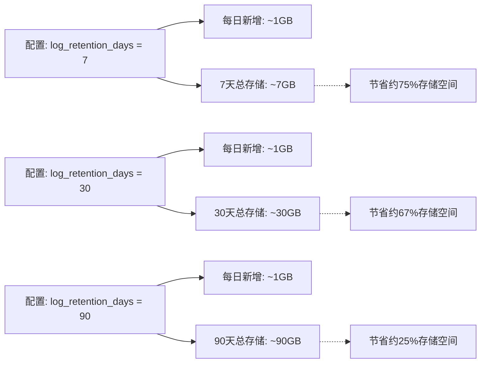

#### 查询性能提升

较长的保留周期对数据库查询性能的影响：

| 保留天数 | 索引效率 | 查询速度 | CPU使用率 | 内存占用 |
|----------|----------|----------|-----------|----------|
| 7天 | 最高 | 最快 | 最低 | 最少 |
| 30天 | 高 | 快 | 中等 | 中等 |
| 90天+ | 中等 | 中等 | 较高 | 较多 |

### 数据库性能影响

#### 索引维护成本

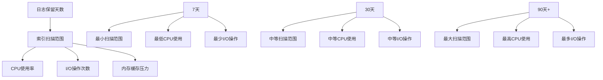

#### 清理操作性能

清理操作的性能特征：

- **批量删除**：MongoDB的批量删除操作会锁定集合，影响并发性能
- **索引重建**：大量数据删除后需要重建索引，产生额外开销
- **事务隔离**：长时间运行的清理操作可能影响其他事务

**章节来源**
- [internal/service/log_cleanup_service.go](file://internal/service/log_cleanup_service.go#L66-L86)
- [internal/repository/database.go](file://internal/repository/database.go#L107-L121)

## 环境配置差异

### 生产环境配置

生产环境中推荐的配置策略：

#### 推荐配置值

| 环境类型 | 推荐保留天数 | 存储考虑 | 性能考虑 | 合规要求 |
|----------|--------------|----------|----------|----------|
| 开发环境 | 7天 | 本地开发，存储有限 | 快速迭代，频繁清理 | 无特殊要求 |
| 测试环境 | 3-7天 | CI/CD流水线，临时数据 | 快速验证，及时清理 | 内部测试 |
| 预发布环境 | 14-30天 | 接近生产环境 | 平衡性能和审计 | 基础审计 |
| 生产环境 | 30-90天+ | 企业级部署，充足存储 | 稳定性能，完整审计 | 法规合规 |

#### 生产环境特性

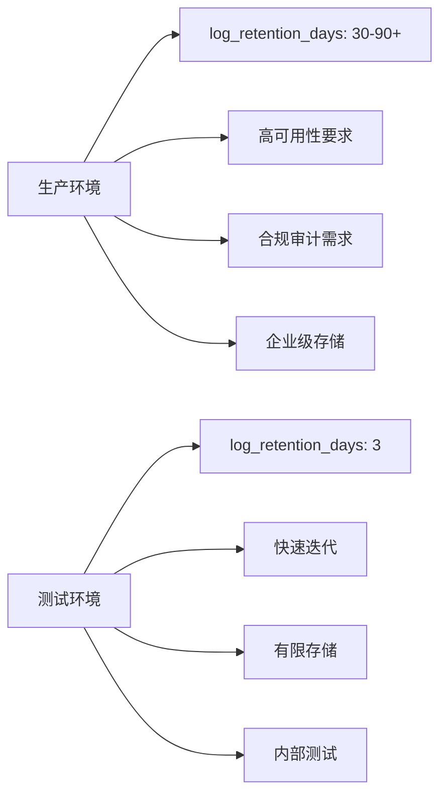

**图表来源**
- [config.yaml](file://config.yaml#L61-L62)
- [config.test.yaml](file://config.test.yaml#L61-L62)

### 测试环境配置

测试环境的特殊配置考虑：

#### 测试环境特点

1. **存储资源有限**：CI/CD环境通常存储空间较小
2. **快速迭代**：频繁的测试运行需要快速清理
3. **调试便利**：短期保留便于问题追踪
4. **成本敏感**：减少不必要的存储开销

#### 测试配置示例

```yaml
# 测试环境配置
performance:
  log_retention_days: 3  # 缩短保留期
  cache:
    rule_ttl: 60        # 缩短缓存时间
    config_ttl: 300
  rate_limit:
    enabled: false        # 禁用限流
```

**章节来源**
- [config.yaml](file://config.yaml#L61-L62)
- [config.test.yaml](file://config.test.yaml#L61-L62)

## 最佳实践建议

### 配置选择指南

#### 基于业务需求的配置决策

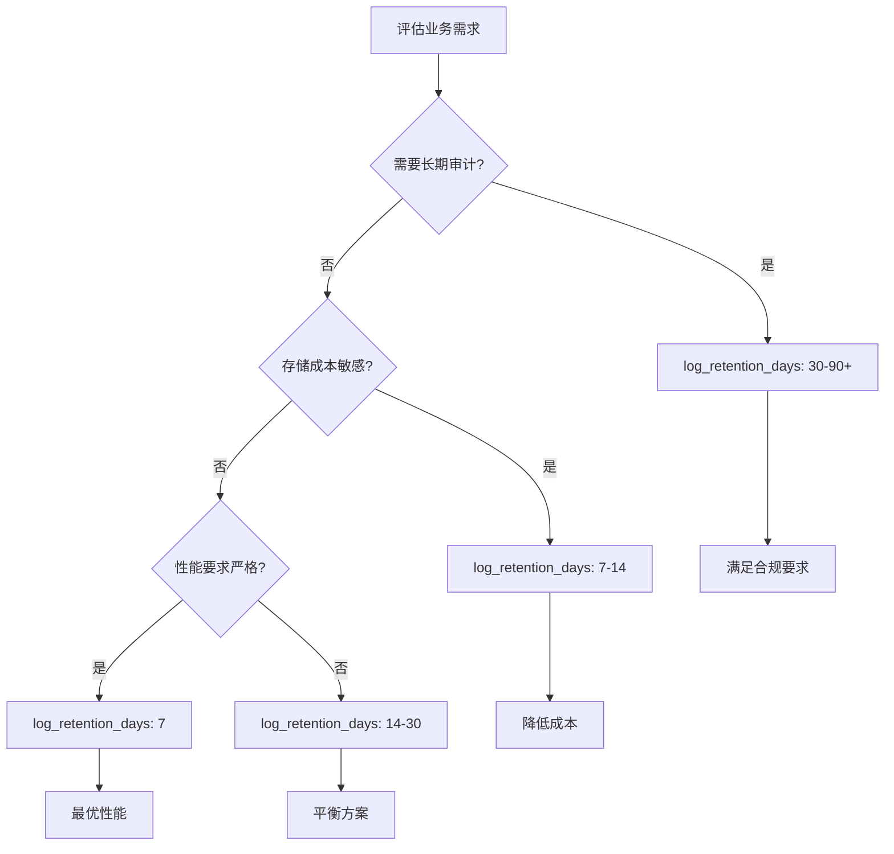

#### 配置验证清单

| 验证项 | 检查要点 | 建议值 | 注意事项 |
|--------|----------|--------|----------|
| 存储容量 | 系统磁盘空间 | 至少3倍预留 | 考虑增长趋势 |
| 查询性能 | 日志查询响应时间 | <100ms | 监控关键指标 |
| 合规要求 | 法规审计期限 | 根据法规确定 | 定期审查 |
| 成本预算 | 存储费用估算 | 控制在5%以内 | 考虑备份成本 |

### 监控和告警

#### 关键监控指标

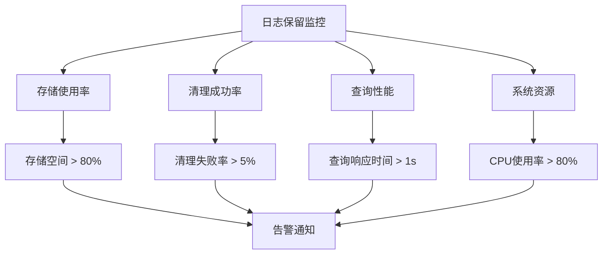

#### 建议的监控策略

1. **存储监控**：定期检查数据库存储使用情况
2. **性能监控**：监控日志查询和清理操作的性能
3. **健康检查**：定期验证清理服务的正常运行
4. **趋势分析**：跟踪存储增长和查询模式的变化

### 配置变更管理

#### 变更流程

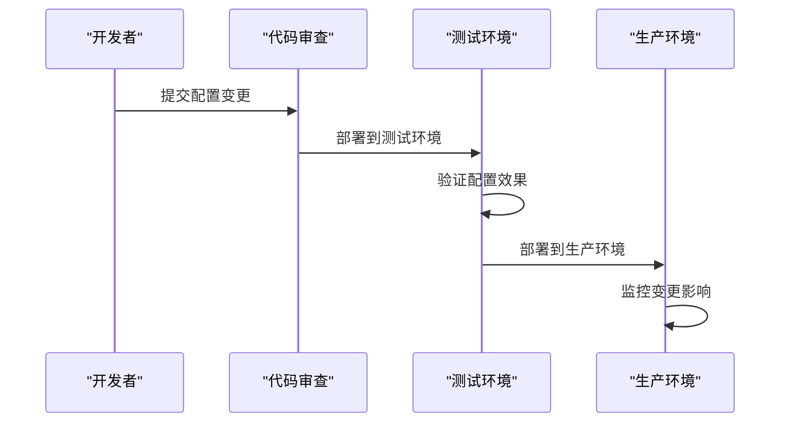

**章节来源**
- [internal/service/log_cleanup_service.go](file://internal/service/log_cleanup_service.go#L93-L99)
- [internal/service/log_cleanup_service.go](file://internal/service/log_cleanup_service.go#L101-L119)

## 故障排除指南

### 常见问题诊断

#### 清理服务异常

| 问题症状 | 可能原因 | 诊断方法 | 解决方案 |
|----------|----------|----------|----------|
| 清理服务不启动 | 配置加载失败 | 检查配置文件语法 | 修复配置文件 |
| 清理频率异常 | 时间同步问题 | 检查系统时间 | 同步系统时间 |
| 清理失败 | 数据库连接问题 | 检查数据库状态 | 修复数据库连接 |
| 存储未释放 | TTL索引失效 | 检查索引状态 | 重建TTL索引 |

#### 性能问题排查

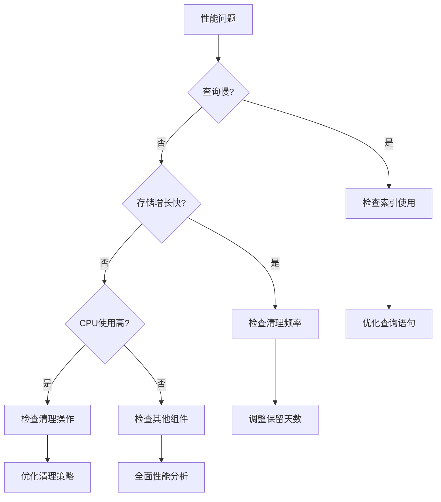

### 故障恢复程序

#### 自动恢复机制

1. **服务重启**：清理服务异常退出时自动重启
2. **配置回滚**：无效配置导致的问题自动回滚
3. **数据恢复**：清理失败时的数据恢复策略

#### 手动恢复步骤

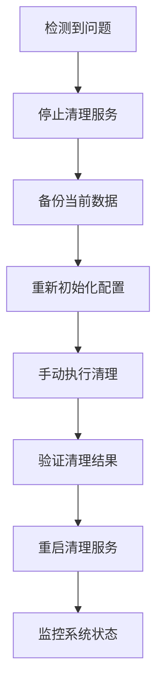

**章节来源**
- [internal/service/log_cleanup_service.go](file://internal/service/log_cleanup_service.go#L35-L57)
- [internal/service/log_cleanup_service.go](file://internal/service/log_cleanup_service.go#L66-L86)

## 总结

日志保留配置是Mock Server系统中一个重要的性能和存储管理工具。通过合理配置`log_retention_days`参数，可以在以下方面获得显著收益：

### 核心价值

1. **存储成本控制**：通过合理的保留周期，有效控制数据库存储空间的使用
2. **性能优化**：适当的保留天数有助于维持数据库查询性能
3. **合规支持**：满足不同环境下的审计和合规要求
4. **运维简化**：自动化清理机制减少了人工干预需求

### 关键要点

- **默认值安全**：系统提供7天的默认值作为安全起点
- **灵活配置**：支持从1天到无限大的任意配置
- **自动清理**：内置智能清理机制，无需人工干预
- **环境适配**：不同环境采用不同的配置策略

### 实施建议

1. **评估业务需求**：根据审计要求、存储成本和性能需求确定合适的保留天数
2. **渐进式配置**：从保守配置开始，根据实际效果逐步调整
3. **持续监控**：建立完善的监控体系，及时发现和解决问题
4. **文档维护**：保持配置文档的及时更新，便于团队协作

通过遵循本文档的指导原则和最佳实践，可以充分发挥日志保留配置的价值，在保证系统性能的同时满足各种业务需求。