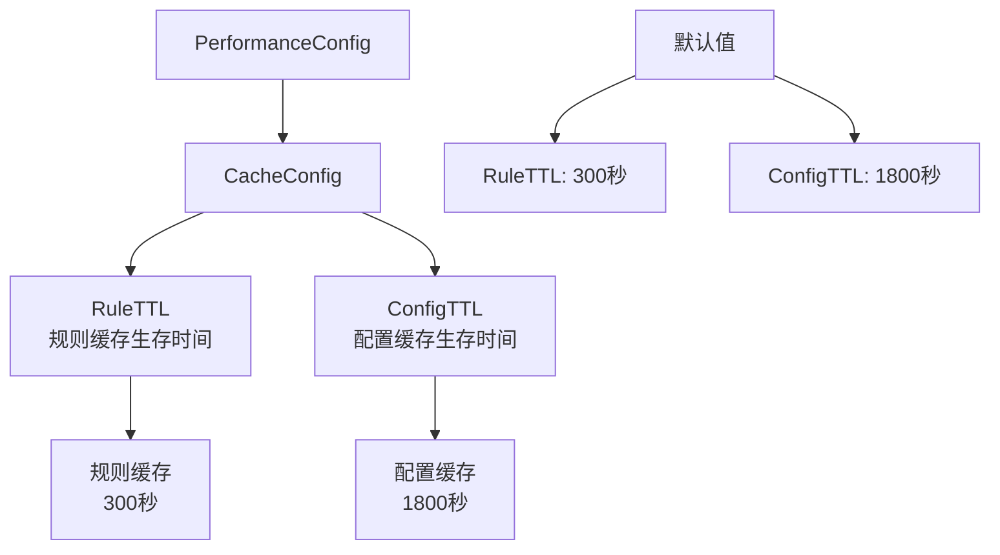
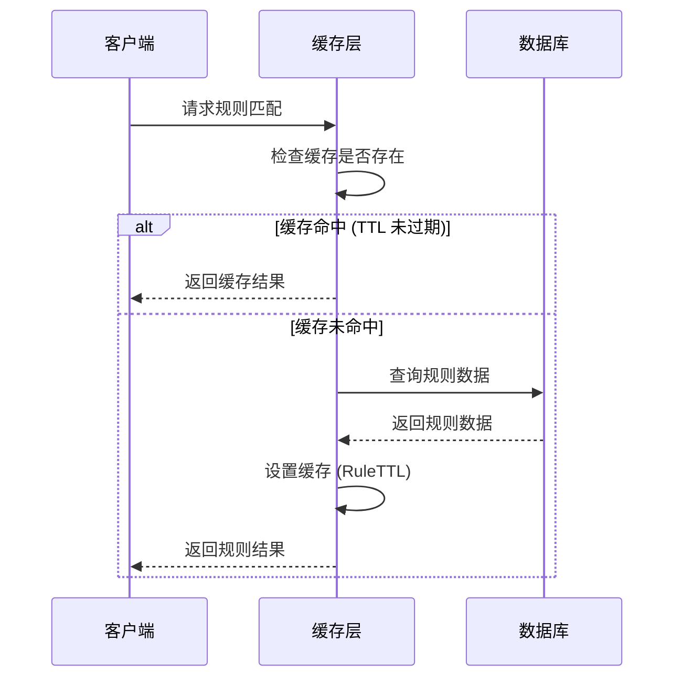
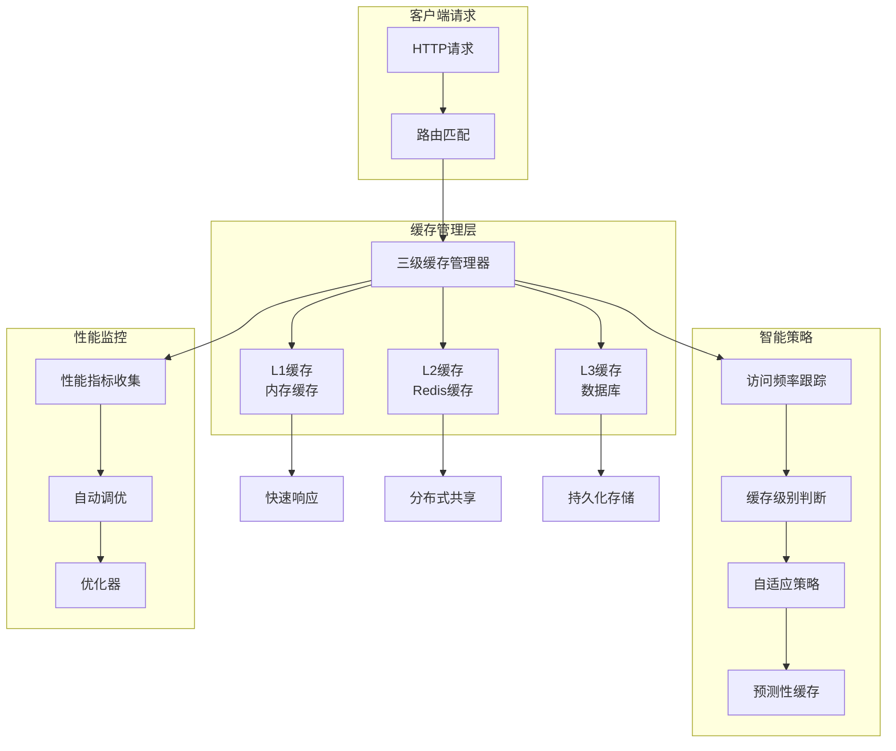
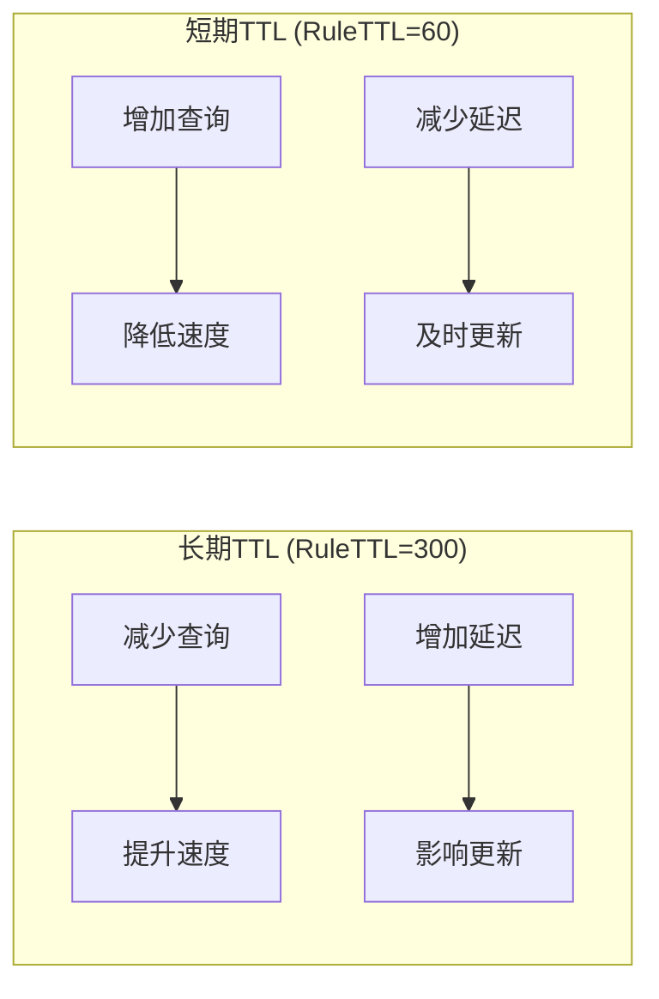
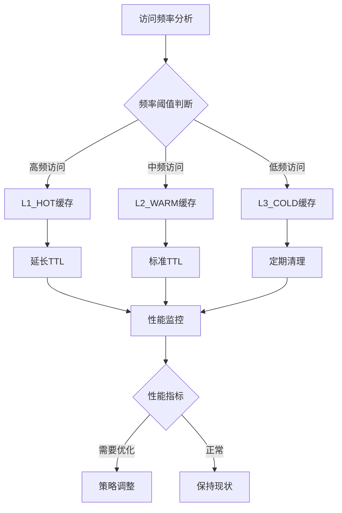
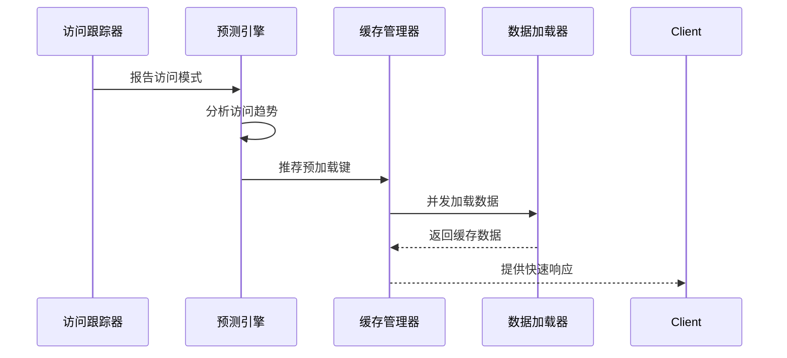
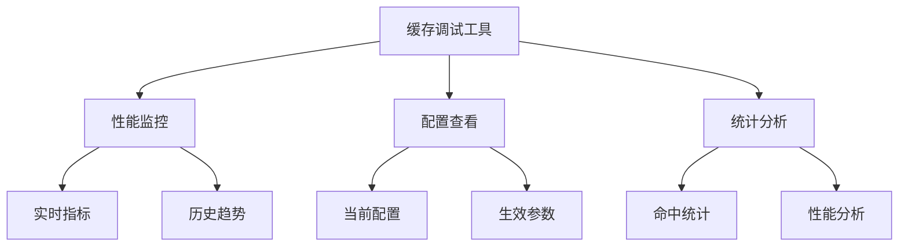

# 缓存配置

<cite>
**本文档中引用的文件**
- [config.yaml](file://config.yaml)
- [config.test.yaml](file://config.test.yaml)
- [config.go](file://internal/config/config.go)
- [enhanced_manager.go](file://internal/cache/enhanced_manager.go)
- [manager.go](file://internal/cache/manager.go)
- [optimizer.go](file://internal/cache/optimizer.go)
- [auto_tuner.go](file://internal/cache/auto_tuner.go)
- [predictive_cache.go](file://internal/cache/predictive_cache.go)
- [monitor.go](file://internal/cache/monitor.go)
</cite>

## 目录
1. [简介](#简介)
2. [配置结构概述](#配置结构概述)
3. [核心缓存参数详解](#核心缓存参数详解)
4. [缓存架构设计](#缓存架构设计)
5. [性能影响分析](#性能影响分析)
6. [环境配置差异](#环境配置差异)
7. [高级缓存特性](#高级缓存特性)
8. [性能调优指南](#性能调优指南)
9. [故障排除](#故障排除)
10. [总结](#总结)

## 简介

Mock Server 的缓存系统是一个多层次、智能化的缓存解决方案，旨在通过合理的缓存策略提升系统性能，同时保证数据的一致性和实时性。该系统基于 PerformanceConfig 下的 CacheConfig 配置，提供了灵活且高效的缓存管理机制。

## 配置结构概述

缓存配置位于 `performance.cache` 节点下，包含两个核心参数：



**图表来源**
- [config.go](file://internal/config/config.go#L115-L119)

**章节来源**
- [config.go](file://internal/config/config.go#L108-L119)
- [config.yaml](file://config.yaml#L64-L66)

## 核心缓存参数详解

### RuleTTL 参数

**定义**: 规则缓存的生存时间，单位为秒。

**作用机制**:
- 控制 Mock 规则在缓存中的存活时间
- 影响规则匹配的响应速度
- 平衡缓存命中率与规则更新及时性

**默认值**: 300 秒 (5 分钟)

**工作原理**:


**图表来源**
- [manager.go](file://internal/cache/manager.go#L112-L150)

### ConfigTTL 参数

**定义**: 配置数据的缓存生存时间，单位为秒。

**作用机制**:
- 控制系统配置信息的缓存时间
- 影响配置变更的传播速度
- 平衡配置实时性与系统负载

**默认值**: 1800 秒 (30 分钟)

**应用场景**:
- 服务器配置参数缓存
- 安全策略配置缓存
- 功能开关状态缓存

**章节来源**
- [config.go](file://internal/config/config.go#L116-L118)
- [config.yaml](file://config.yaml#L65-L66)

## 缓存架构设计

系统采用三层缓存架构，结合智能策略管理：



**图表来源**
- [enhanced_manager.go](file://internal/cache/enhanced_manager.go#L13-L30)
- [manager.go](file://internal/cache/manager.go#L12-L30)

### 缓存级别说明

| 缓存级别 | 存储介质 | 访问速度 | 容量大小 | 生命周期 |
|---------|---------|---------|---------|---------|
| L1_HOT | 内存 | 极快 | 中等 | RuleTTL × 2 |
| L2_WARM | Redis | 快 | 大 | ConfigTTL |
| L3_COLD | 数据库 | 慢 | 无限 | 永久 |

**章节来源**
- [manager.go](file://internal/cache/manager.go#L352-L359)
- [manager.go](file://internal/cache/manager.go#L367-L383)

## 性能影响分析

### 长期 TTL 的影响

**优势**:
- 减少数据库查询压力
- 提升响应速度
- 降低系统资源消耗

**劣势**:
- 规则更新延迟
- 可能导致不一致状态
- 增加内存占用

### 短期 TTL 的影响

**优势**:
- 配置实时性强
- 规则更新及时
- 数据一致性好

**劣势**:
- 增加数据库负载
- 响应时间可能变慢
- 系统资源消耗增加



**图表来源**
- [manager.go](file://internal/cache/manager.go#L367-L375)

**章节来源**
- [manager.go](file://internal/cache/manager.go#L367-L383)

## 环境配置差异

### 生产环境配置

```yaml
performance:
  cache:
    rule_ttl: 300        # 5分钟
    config_ttl: 1800     # 30分钟
```

**特点**:
- 较长的 TTL 值
- 优化响应时间和系统负载
- 适合高并发场景

### 测试环境配置

```yaml
performance:
  cache:
    rule_ttl: 60         # 1分钟
    config_ttl: 300      # 5分钟
```

**特点**:
- 较短的 TTL 值
- 便于开发调试
- 快速验证配置变更

### 环境对比表

| 配置项 | 生产环境 | 测试环境 | 影响说明 |
|-------|---------|---------|---------|
| RuleTTL | 300秒 | 60秒 | 生产环境更稳定，测试环境更敏感 |
| ConfigTTL | 1800秒 | 300秒 | 生产环境减少配置变更频率 |
| 适用场景 | 高并发生产 | 开发调试 | 不同的性能需求 |

**章节来源**
- [config.yaml](file://config.yaml#L65-L66)
- [config.test.yaml](file://config.test.yaml#L65-L66)

## 高级缓存特性

### 自适应缓存策略

系统提供自适应缓存策略，根据访问模式动态调整缓存行为：



**图表来源**
- [manager.go](file://internal/cache/manager.go#L352-L359)
- [enhanced_manager.go](file://internal/cache/enhanced_manager.go#L461-L472)

### 预测性缓存

基于访问模式预测未来的缓存需求：



**图表来源**
- [predictive_cache.go](file://internal/cache/predictive_cache.go#L43-L72)

### 自动调优机制

系统具备自动调优能力，根据性能指标动态调整缓存策略：

| 调优参数 | 范围 | 默认值 | 调优目标 |
|---------|------|--------|---------|
| HotDataThreshold | 0.5-0.9 | 0.8 | 热点数据识别 |
| WarmDataThreshold | 0.1-0.5 | 0.2 | 温数据识别 |
| L1TTL | 10s-300s | 300s | L1缓存时间 |
| L2TTL | 60s-3600s | 1800s | L2缓存时间 |

**章节来源**
- [auto_tuner.go](file://internal/cache/auto_tuner.go#L26-L62)
- [enhanced_manager.go](file://internal/cache/enhanced_manager.go#L48-L66)

## 性能调优指南

### 高并发场景调优

**推荐配置**:
```yaml
performance:
  cache:
    rule_ttl: 600      # 延长规则缓存时间
    config_ttl: 3600   # 延长配置缓存时间
```

**调优策略**:
1. **延长 RuleTTL**: 减少规则查询频率
2. **延长 ConfigTTL**: 减少配置更新开销
3. **启用预测性缓存**: 预测热点数据
4. **启用自适应策略**: 动态调整缓存行为

### 开发调试环境调优

**推荐配置**:
```yaml
performance:
  cache:
    rule_ttl: 30       # 短缓存时间
    config_ttl: 60     # 短配置缓存
```

**调优策略**:
1. **缩短 TTL 值**: 快速验证配置变更
2. **禁用高级特性**: 简化调试过程
3. **启用详细日志**: 监控缓存行为

### 性能监控指标

关键性能指标包括：

| 指标名称 | 监控目的 | 正常范围 | 警告阈值 |
|---------|---------|---------|---------|
| 命中率 | 缓存效果评估 | > 0.8 | < 0.6 |
| 平均响应时间 | 性能表现 | < 100ms | > 500ms |
| 内存使用率 | 资源消耗 | < 0.7 | > 0.8 |
| 数据库查询次数 | 缓存效果 | 最小化 | 增加 |

**章节来源**
- [monitor.go](file://internal/cache/monitor.go#L279-L318)

## 故障排除

### 常见问题及解决方案

**问题 1**: 缓存命中率过低
**原因**: TTL 设置过短或热点数据识别不当
**解决方案**:
- 增加 RuleTTL 和 ConfigTTL 值
- 检查访问频率统计准确性
- 调整热数据阈值

**问题 2**: 响应时间过长
**原因**: 缓存层级过多或缓存失效频繁
**解决方案**:
- 优化缓存层级结构
- 增加 L1 缓存容量
- 调整缓存清理策略

**问题 3**: 内存使用过高
**原因**: 缓存容量过大或 TTL 过长
**解决方案**:
- 减少缓存容量限制
- 缩短缓存生存时间
- 启用缓存清理机制

### 调试工具

系统提供多种调试工具：



**章节来源**
- [enhanced_manager.go](file://internal/cache/enhanced_manager.go#L617-L660)

## 总结

Mock Server 的缓存配置系统提供了全面而灵活的缓存管理解决方案。通过合理配置 RuleTTL 和 ConfigTTL 参数，可以在系统性能和数据实时性之间找到最佳平衡点。

**关键要点**:
1. **RuleTTL** 控制规则缓存时间，影响响应速度和更新延迟
2. **ConfigTTL** 控制配置缓存时间，影响配置实时性和系统负载
3. **环境差异** 导致配置不同，生产环境注重稳定性，测试环境注重实时性
4. **高级特性** 如自适应策略、预测性缓存和自动调优提供智能化缓存管理
5. **性能调优** 需要根据具体场景和需求进行定制化配置

通过深入理解这些配置参数和系统特性，可以构建高效、稳定的缓存解决方案，满足不同场景下的性能需求。