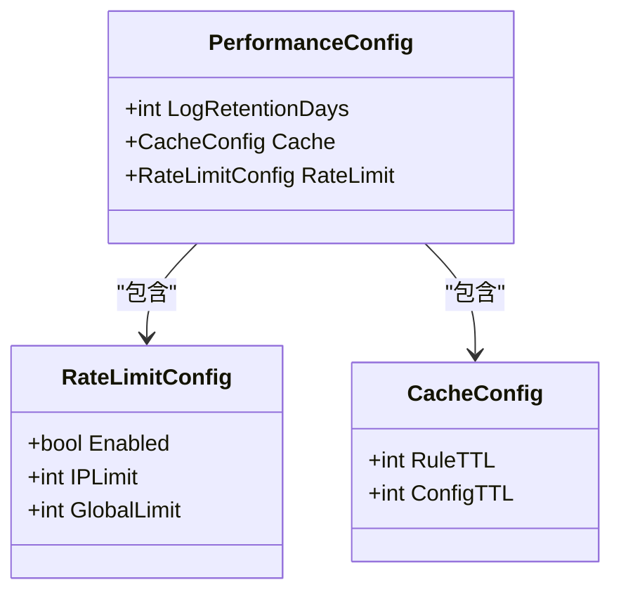
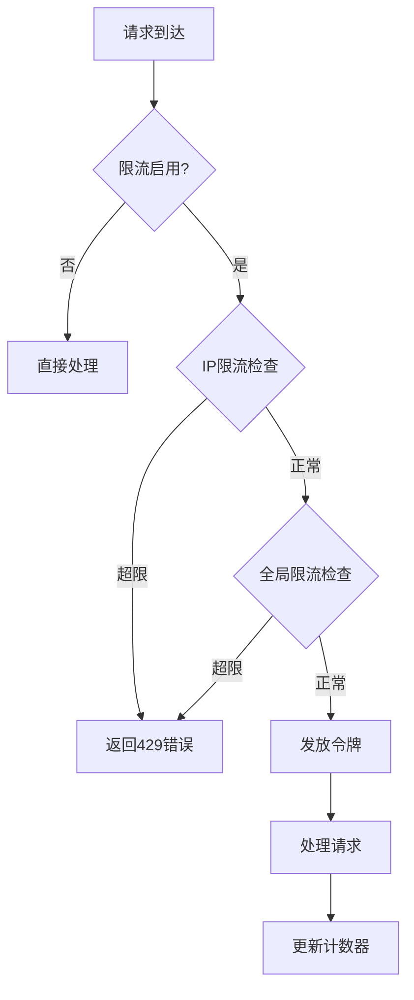
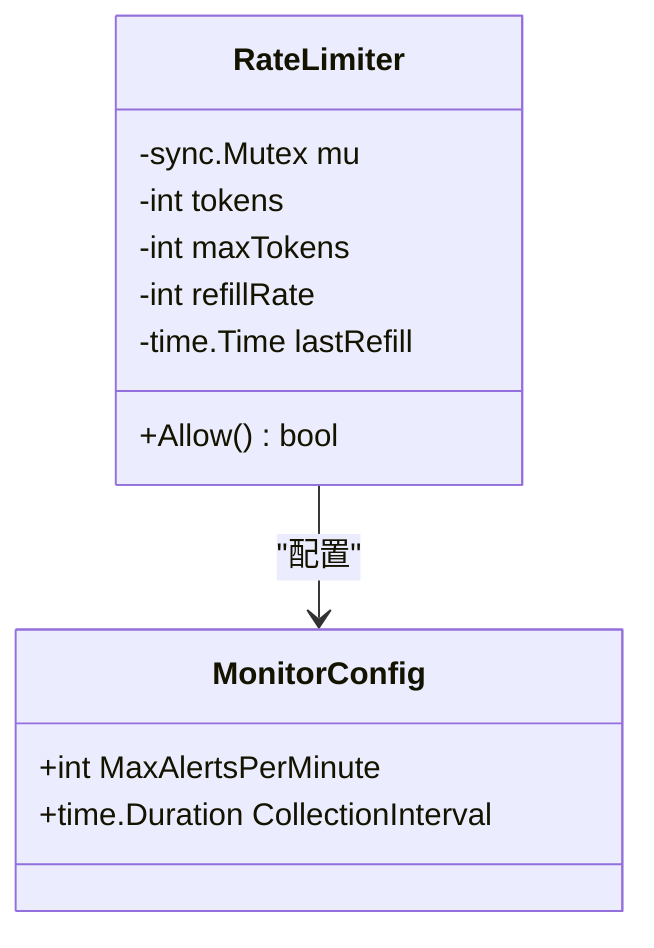
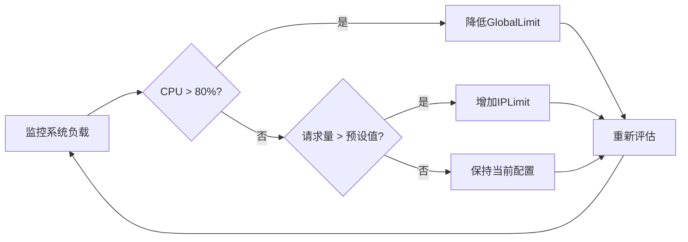
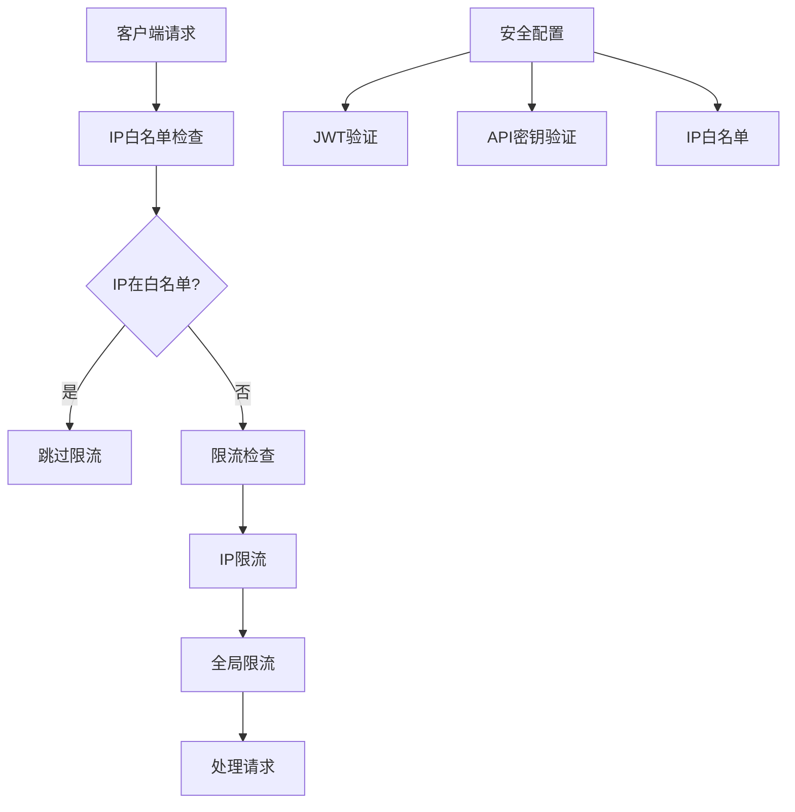
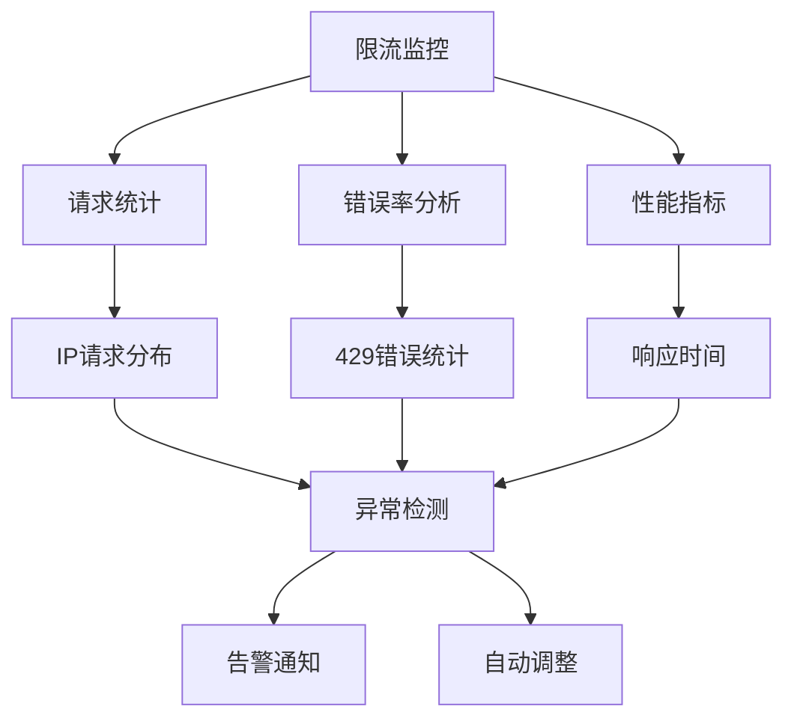

# 限流配置

<cite>
**本文档引用的文件**
- [config.yaml](file://config.yaml)
- [config.test.yaml](file://config.test.yaml)
- [internal/config/config.go](file://internal/config/config.go)
- [internal/cache/monitor.go](file://internal/cache/monitor.go)
- [internal/models/errors.go](file://internal/models/errors.go)
- [internal/service/middleware.go](file://internal/service/middleware.go)
</cite>

## 目录
1. [简介](#简介)
2. [配置结构](#配置结构)
3. [核心参数详解](#核心参数详解)
4. [配置示例对比](#配置示例对比)
5. [限流机制原理](#限流机制原理)
6. [配置策略建议](#配置策略建议)
7. [与安全防护的集成](#与安全防护的集成)
8. [故障排除指南](#故障排除指南)
9. [总结](#总结)

## 简介

限流配置是Mock Server性能配置的重要组成部分，用于保护系统免受恶意请求、爬虫攻击和突发流量的影响。通过PerformanceConfig下的RateLimitConfig，可以精确控制系统的请求处理能力，确保服务的稳定性和可用性。

限流系统采用令牌桶算法实现，提供两个维度的保护：
- **IP级别限流**：限制单个IP地址的请求频率
- **全局限流**：控制整个系统的请求处理能力

## 配置结构

限流配置位于`performance.rate_limit`节点，包含以下核心字段：



**图表来源**
- [internal/config/config.go](file://internal/config/config.go#L108-L126)

**章节来源**
- [internal/config/config.go](file://internal/config/config.go#L108-L126)

## 核心参数详解

### enabled 参数

`enabled`参数用于全局开启或关闭限流功能，是系统安全的第一道防线。

| 属性 | 类型 | 默认值 | 描述 |
|------|------|--------|------|
| enabled | bool | true | 是否启用限流功能 |

**功能特性：**
- **生产环境推荐启用**：在高流量场景下提供必要的保护
- **开发环境可关闭**：便于调试和测试
- **动态切换**：可通过配置热更新实现

### IPLimit 参数

`IPLimit`参数定义单个IP地址每分钟的最大请求数，有效防止恶意刷单和爬虫攻击。

| 属性 | 类型 | 默认值 | 单位 | 描述 |
|------|------|--------|------|------|
| IPLimit | int | 1000 | 每分钟请求数 | 单个IP地址的请求频率限制 |

**安全作用：**
- **防刷单攻击**：限制恶意用户短时间内大量请求
- **防爬虫行为**：阻止自动化工具过度抓取
- **资源保护**：防止单个客户端占用过多系统资源

### GlobalLimit 参数

`GlobalLimit`参数设置系统每秒可处理的全局请求数上限，保护后端服务不被压垮。

| 属性 | 类型 | 默认值 | 单位 | 描述 |
|------|------|--------|------|------|
| GlobalLimit | int | 10000 | 每秒请求数 | 系统整体请求处理能力限制 |

**系统保护作用：**
- **容量保护**：防止系统过载导致崩溃
- **服务质量保证**：确保正常用户的请求得到及时响应
- **突发流量应对**：在流量激增时维持系统稳定性

**章节来源**
- [config.yaml](file://config.yaml#L68-L71)
- [config.test.yaml](file://config.test.yaml#L67-L71)

## 配置示例对比

### 生产环境配置

```yaml
performance:
  rate_limit:
    enabled: true      # 启用限流保护
    ip_limit: 1000    # 单IP每分钟1000请求
    global_limit: 10000 # 全局每秒10000请求
```

**特点：**
- **严格保护**：启用所有限流功能
- **合理阈值**：根据实际负载设定
- **安全优先**：优先保证系统稳定性

### 测试环境配置

```yaml
performance:
  rate_limit:
    enabled: false     # 关闭限流，便于测试
    ip_limit: 10000   # 较高的IP限制
    global_limit: 100000 # 较高的全局限制
```

**特点：**
- **宽松策略**：减少对测试的干扰
- **高阈值**：适应测试场景的高并发需求
- **调试友好**：便于验证功能正确性

### 开发环境配置

```yaml
performance:
  rate_limit:
    enabled: false     # 开发时关闭限流
    ip_limit: 1000
    global_limit: 10000
```

**特点：**
- **开发便利**：不影响日常开发工作
- **适度保护**：保留基本的请求控制
- **快速迭代**：提高开发效率

**章节来源**
- [config.yaml](file://config.yaml#L68-L71)
- [config.test.yaml](file://config.test.yaml#L67-L71)

## 限流机制原理

### 令牌桶算法实现

系统采用令牌桶算法实现智能限流，具有以下特点：



**图表来源**
- [internal/cache/monitor.go](file://internal/cache/monitor.go#L858-L876)

### 实现细节

限流器的核心实现基于Go语言的并发安全设计：



**图表来源**
- [internal/cache/monitor.go](file://internal/cache/monitor.go#L270-L277)

**技术特性：**
- **线程安全**：使用互斥锁保护并发访问
- **自动补充**：按时间间隔自动补充令牌
- **容量限制**：最大令牌数量由配置决定

**章节来源**
- [internal/cache/monitor.go](file://internal/cache/monitor.go#L848-L876)

## 配置策略建议

### 高流量场景配置

对于高流量应用，建议采用以下配置策略：

| 场景 | IPLimit | GlobalLimit | 说明 |
|------|---------|-------------|------|
| 中等流量 | 500-1000 | 5000-10000 | 平衡保护与性能 |
| 高流量 | 1000-2000 | 10000-20000 | 强化保护措施 |
| 极高流量 | 2000-5000 | 20000-50000 | 最大保护强度 |

### 动态调整策略



### 特殊场景配置

**API网关场景：**
```yaml
performance:
  rate_limit:
    enabled: true
    ip_limit: 2000    # 更严格的IP限制
    global_limit: 15000 # 更高的全局限制
```

**Web应用场景：**
```yaml
performance:
  rate_limit:
    enabled: true
    ip_limit: 500     # 较宽松的IP限制
    global_limit: 8000  # 适中的全局限制
```

## 与安全防护的集成

### 多层防护架构

限流配置与安全防护体系形成完整的保护链：



**图表来源**
- [internal/engine/match_engine.go](file://internal/engine/match_engine.go#L402-L435)

### 错误处理机制

当请求超过限流阈值时，系统返回标准的429状态码：

| 错误码 | 英文消息 | 中文消息 | HTTP状态码 |
|--------|----------|----------|------------|
| 1020 | Too many requests | 请求过于频繁 | 429 |

**章节来源**
- [internal/models/errors.go](file://internal/models/errors.go#L46-L47)

## 故障排除指南

### 常见问题及解决方案

**问题1：正常用户被限流**
- **症状**：合法用户频繁收到429错误
- **原因**：IPLimit设置过低
- **解决**：适当提高IPLimit值，考虑使用IP白名单

**问题2：系统响应缓慢**
- **症状**：请求处理时间显著增加
- **原因**：GlobalLimit设置不当
- **解决**：根据系统实际承载能力调整GlobalLimit

**问题3：测试环境受限流影响**
- **症状**：测试脚本无法正常运行
- **原因**：测试环境启用了限流
- **解决**：在测试配置中关闭限流功能

### 监控和诊断



## 总结

限流配置是Mock Server安全防护体系的重要组成部分，通过合理的配置可以有效保护系统免受各种威胁。关键要点包括：

1. **分级配置**：不同环境采用不同的限流策略
2. **动态调整**：根据实际负载情况灵活调整阈值
3. **多层保护**：与安全防护体系协同工作
4. **监控告警**：建立完善的监控和告警机制

正确的限流配置不仅能够保护系统安全，还能提升用户体验，是现代Web服务不可或缺的基础设施。