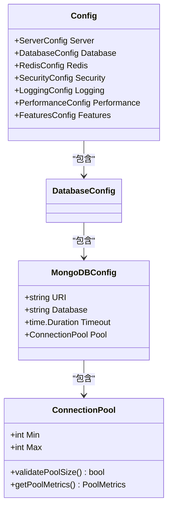
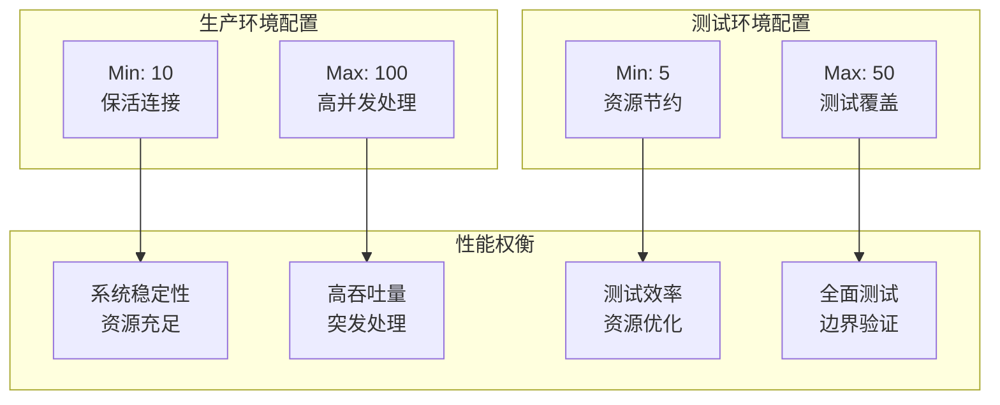
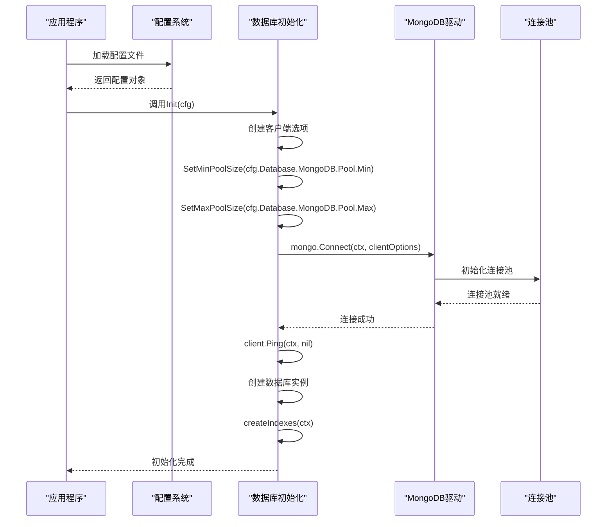
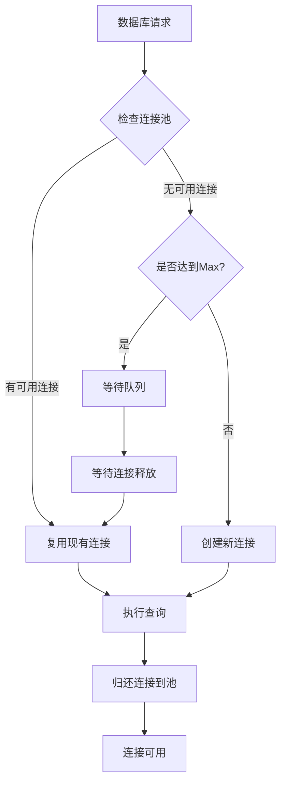
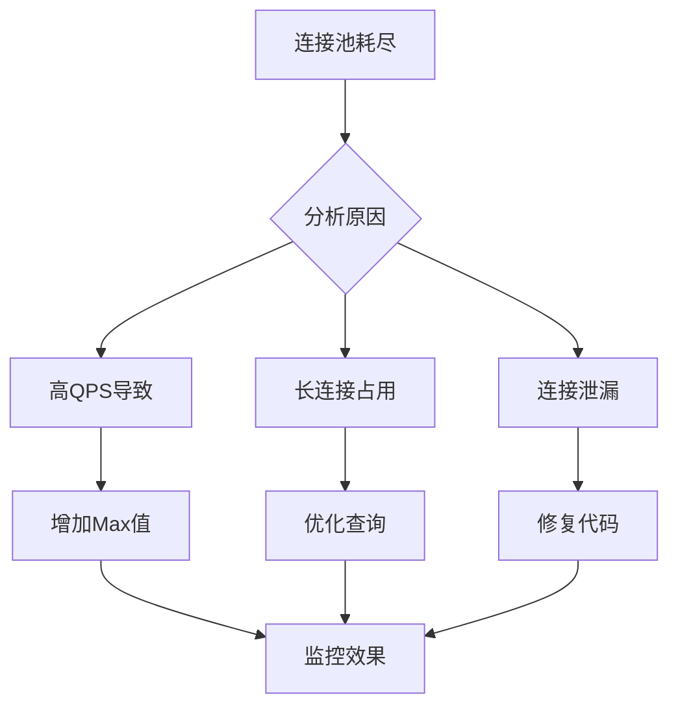

# 数据库连接池配置

<cite>
**本文档引用的文件**
- [internal/repository/database.go](file://internal/repository/database.go)
- [internal/config/config.go](file://internal/config/config.go)
- [config.yaml](file://config.yaml)
- [config.test.yaml](file://config.test.yaml)
- [internal/models/errors.go](file://internal/models/errors.go)
- [internal/repository/project_repository.go](file://internal/repository/project_repository.go)
</cite>

## 目录
1. [简介](#简介)
2. [ConnectionPool结构体详解](#connectionpool结构体详解)
3. [配置文件对比分析](#配置文件对比分析)
4. [连接池初始化机制](#连接池初始化机制)
5. [连接池工作原理](#连接池工作原理)
6. [性能调优指南](#性能调优指南)
7. [常见问题与解决方案](#常见问题与解决方案)
8. [最佳实践建议](#最佳实践建议)

## 简介

数据库连接池是现代应用程序中至关重要的组件，它通过维护一组预先建立的数据库连接来提高应用程序的性能和可扩展性。本文档深入分析GoMockServer项目中的MongoDB连接池配置，重点关注`ConnectionPool`结构体的`Min`和`Max`参数，以及它们在不同环境下的配置策略。

## ConnectionPool结构体详解

### 结构定义

`ConnectionPool`结构体是连接池配置的核心数据结构，定义在配置模块中：



**图表来源**
- [internal/config/config.go](file://internal/config/config.go#L52-L56)

### 参数含义

#### Min连接数（最小连接数）

`Min`参数定义了连接池中始终保持的最小连接数量，具有以下重要作用：

1. **保活连接机制**：确保连接池始终有可用的连接，避免新请求时频繁创建连接
2. **系统稳定性**：在低负载时期维持基本的数据库连接，减少连接建立的开销
3. **资源预分配**：为关键业务场景预留基础连接资源

#### Max连接数（最大连接数）

`Max`参数定义了连接池允许的最大连接数量，直接影响系统的并发处理能力：

1. **并发限制**：控制同时可以进行的数据库操作数量
2. **资源保护**：防止过多连接导致数据库服务器过载
3. **性能边界**：设定系统的最大并发处理能力

**章节来源**
- [internal/config/config.go](file://internal/config/config.go#L52-L56)

## 配置文件对比分析

### 生产环境配置（config.yaml）

生产环境采用保守但充足的配置策略：

| 参数 | 生产环境值 | 设计考量 |
|------|------------|----------|
| Min | 10 | 保持10个基础连接，满足日常最低需求 |
| Max | 100 | 允许最多100个并发连接，适应突发流量 |

### 测试环境配置（config.test.yaml）

测试环境采用更宽松的配置，便于测试各种场景：

| 参数 | 测试环境值 | 设计考量 |
|------|------------|----------|
| Min | 5 | 较低的基础连接数，节省测试资源 |
| Max | 50 | 中等并发能力，适合集成测试 |

### 配置差异分析



**图表来源**
- [config.yaml](file://config.yaml#L19-L21)
- [config.test.yaml](file://config.test.yaml#L19-L21)

**章节来源**
- [config.yaml](file://config.yaml#L19-L21)
- [config.test.yaml](file://config.test.yaml#L19-L21)

## 连接池初始化机制

### Init函数实现

数据库连接池的初始化过程通过`repository/database.go`中的`Init`函数完成：



**图表来源**
- [internal/repository/database.go](file://internal/repository/database.go#L19-L51)

### 关键配置步骤

1. **上下文设置**：使用配置的超时时间创建上下文
2. **客户端选项构建**：通过`options.Client()`创建客户端配置
3. **连接池参数设置**：
   - `SetMinPoolSize(uint64(cfg.Database.MongoDB.Pool.Min))`
   - `SetMaxPoolSize(uint64(cfg.Database.MongoDB.Pool.Max))`
4. **连接建立**：尝试建立与MongoDB的连接
5. **连接验证**：通过Ping操作验证连接有效性
6. **数据库实例获取**：获取指定的数据库实例

**章节来源**
- [internal/repository/database.go](file://internal/repository/database.go#L19-L51)

## 连接池工作原理

### 资源复用机制

连接池通过以下机制实现高效的资源复用：



### 连接生命周期管理

1. **连接创建**：当连接池中的连接不足时，自动创建新连接
2. **连接复用**：从池中取出空闲连接供新请求使用
3. **连接验证**：在复用前验证连接的有效性
4. **连接归还**：操作完成后将连接返回池中
5. **连接清理**：定期清理长时间未使用的连接

### 并发请求处理

连接池通过以下方式处理高并发请求：

- **连接预热**：Min参数确保有足够的连接应对突发流量
- **动态扩展**：Max参数限制并发量，防止系统过载
- **请求排队**：超出Max限制的请求进入等待队列
- **超时处理**：设置合理的超时时间避免请求无限等待

## 性能调优指南

### QPS与响应时间分析

根据不同的QPS（每秒查询数）和平均响应时间，推荐以下调优策略：

| QPS范围 | 平均响应时间 | 推荐Min | 推荐Max | 调优重点 |
|---------|--------------|---------|---------|----------|
| 10-50 | < 100ms | 5-10 | 50-100 | 平衡资源与性能 |
| 50-200 | 100-500ms | 10-20 | 100-200 | 提升并发能力 |
| 200+ | > 500ms | 20-50 | 200-500 | 性能瓶颈分析 |

### 调优公式

基于经验公式，可以计算最优连接池大小：

```
最优Min = 基础并发 × 0.5
最优Max = 基础并发 × 2.0
```

其中"基础并发"是指系统正常运行时的平均并发连接数。

### 监控指标

关键性能指标包括：

- **连接利用率**：`(活跃连接数 / 最大连接数) × 100%`
- **连接等待时间**：请求等待可用连接的平均时间
- **连接创建频率**：每秒创建新连接的数量
- **连接超时率**：因连接不足而超时的请求比例

## 常见问题与解决方案

### 连接池耗尽错误

**错误现象**：出现"connection pool exhausted"错误

**诊断方法**：
1. 检查当前活跃连接数
2. 分析请求模式和并发量
3. 监控连接池配置参数

**解决方案**：



### 连接泄漏问题

**症状识别**：
- 连接池中的连接数持续增长
- 最大连接数逐渐接近Min值
- 系统性能逐渐下降

**预防措施**：
1. 确保每个数据库操作都正确关闭连接
2. 使用defer语句保证资源释放
3. 设置合理的连接超时时间

### 性能瓶颈定位

**监控工具**：
- 数据库慢查询日志
- 连接池统计信息
- 应用程序性能监控

**优化策略**：
1. 优化查询语句
2. 添加适当的索引
3. 调整连接池参数
4. 实施读写分离

**章节来源**
- [internal/models/errors.go](file://internal/models/errors.go#L158-L170)

## 最佳实践建议

### 配置选择原则

1. **生产环境配置**：
   - Min值设置为系统正常负载的50-70%
   - Max值设置为基础并发的2-3倍
   - 定期监控和调整

2. **开发环境配置**：
   - Min值设置为较低值（如5-10）
   - Max值设置为适中值（如50-100）
   - 便于调试和测试

3. **测试环境配置**：
   - Min值设置为更低值（如2-5）
   - Max值设置为测试需求值（如20-50）
   - 专注于功能验证而非性能测试

### 监控和告警

建议实施以下监控策略：

- **连接池使用率**：设置告警阈值（如80%）
- **连接等待时间**：监控平均等待时间
- **连接创建频率**：异常增长可能指示问题
- **连接超时率**：超时率过高需要关注

### 故障恢复策略

1. **优雅降级**：连接池满时返回友好错误
2. **重试机制**：对临时性错误实施指数退避重试
3. **熔断器**：连续失败时暂时禁用数据库访问
4. **健康检查**：定期验证连接池状态

### 安全考虑

- **连接超时**：设置合理的连接超时时间
- **认证安全**：确保数据库连接使用强认证
- **网络隔离**：在安全的网络环境中部署数据库
- **权限控制**：限制数据库连接的权限范围

通过合理配置和监控数据库连接池，可以显著提升应用程序的性能和稳定性，同时避免常见的连接池问题。建议根据实际业务需求和系统负载情况，定期评估和调整连接池配置参数。