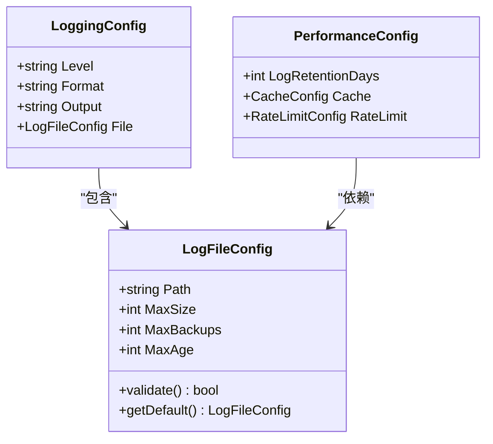
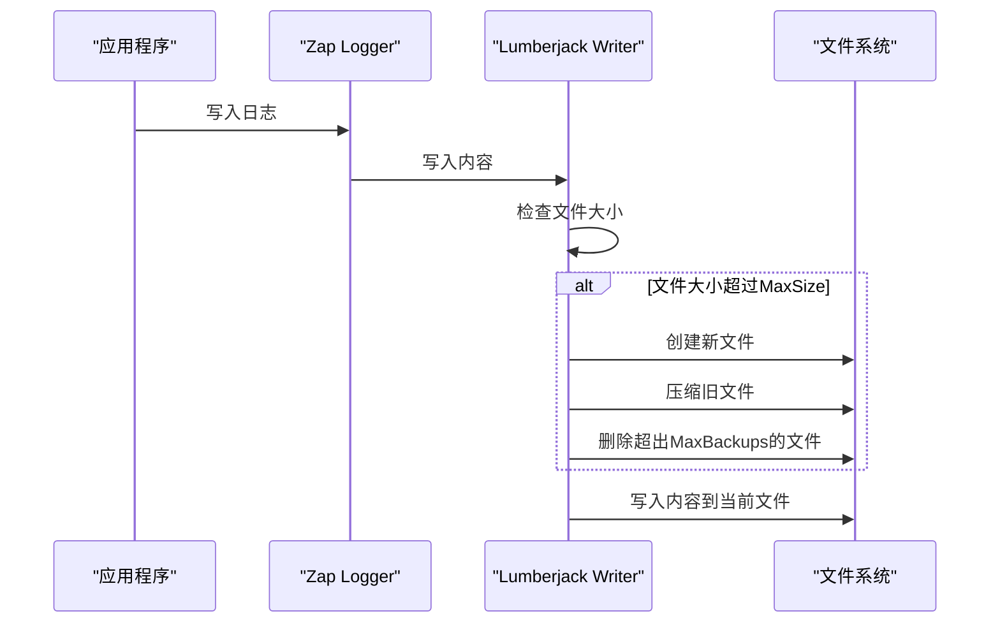
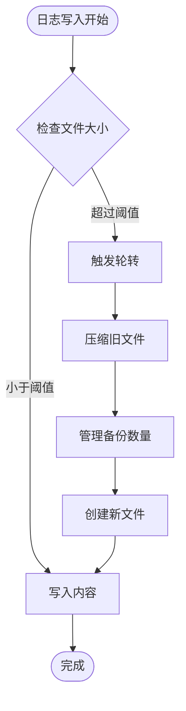
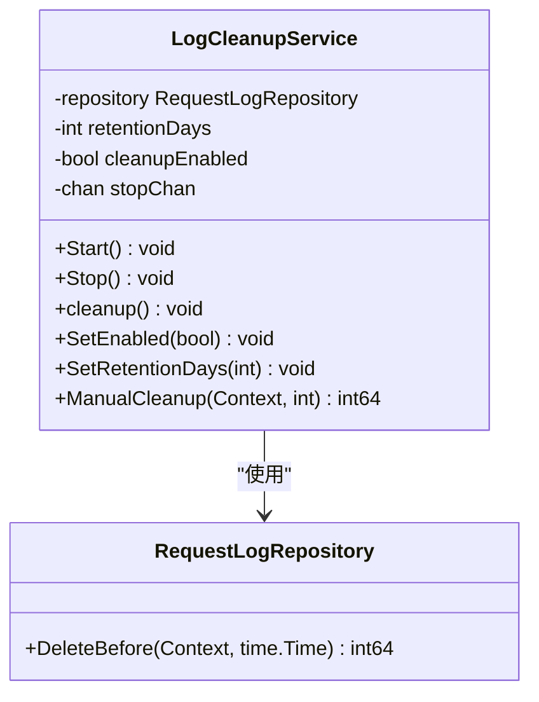
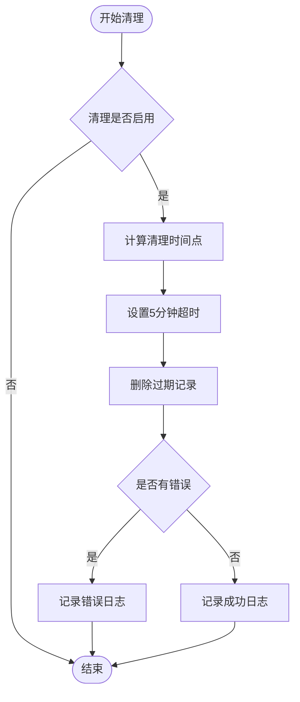

# 日志文件配置

<cite>
**本文档中引用的文件**
- [logger.go](file://pkg/logger/logger.go)
- [log_cleanup_service.go](file://internal/service/log_cleanup_service.go)
- [config.go](file://internal/config/config.go)
- [config.yaml](file://config.yaml)
- [config.test.yaml](file://config.test.yaml)
</cite>

## 目录
1. [简介](#简介)
2. [LogFileConfig结构体详解](#logfileconfig结构体详解)
3. [日志轮转机制](#日志轮转机制)
4. [日志清理机制](#日志清理机制)
5. [配置最佳实践](#配置最佳实践)
6. [性能优化建议](#性能优化建议)
7. [故障排除指南](#故障排除指南)
8. [总结](#总结)

## 简介

本项目采用分层的日志管理系统，包含两个核心组件：基于lumberjack的日志轮转系统和基于时间的自动清理系统。这种设计确保了日志文件的有效管理和系统的长期稳定运行。

## LogFileConfig结构体详解

### 结构定义

LogFileConfig是日志文件配置的核心数据结构，定义在配置模块中：



**图表来源**
- [config.go](file://internal/config/config.go#L100-L106)

### 参数详细说明

#### Path（日志文件路径）
- **类型**: string
- **作用**: 指定日志文件的存储路径
- **重要性**: 影响日志文件的可访问性和磁盘空间管理
- **最佳实践**: 
  - 使用绝对路径避免相对路径问题
  - 确保应用程序有写入权限
  - 考虑使用专门的日志目录

#### MaxSize（最大文件大小）
- **类型**: int
- **单位**: MB（兆字节）
- **作用**: 触发日志轮转的文件大小阈值
- **工作机制**: 当日志文件达到指定大小时，触发轮转操作
- **推荐值**:
  - 生产环境：100-500 MB
  - 开发环境：10-50 MB
  - 测试环境：5-20 MB

#### MaxBackups（最大备份数量）
- **类型**: int
- **作用**: 保留的历史日志文件数量
- **影响**: 直接决定磁盘空间占用量
- **计算公式**: 总磁盘空间 = MaxSize × MaxBackups
- **推荐值**:
  - 生产环境：10-50个备份
  - 开发环境：3-10个备份
  - 测试环境：1-5个备份

#### MaxAge（最大保留天数）
- **类型**: int
- **单位**: 天
- **作用**: 单个日志文件的最大保留时间
- **协同机制**: 与MaxBackups共同控制历史文件数量
- **推荐值**:
  - 生产环境：30-90天
  - 开发环境：7-30天
  - 测试环境：1-7天

**章节来源**
- [config.go](file://internal/config/config.go#L100-L106)

## 日志轮转机制

### lumberjack集成架构

系统通过lumberjack.Logger实现高效的日志轮转功能：



**图表来源**
- [logger.go](file://pkg/logger/logger.go#L51-L57)

### 轮转触发条件

日志轮转由以下条件触发：

1. **文件大小检查**: 当前日志文件大小 ≥ MaxSize（MB）
2. **压缩处理**: 自动启用gzip压缩历史文件
3. **命名规则**: 新文件名格式为`filename.YYYYMMDD-HHMMSS.ext`
4. **备份管理**: 保留最近的MaxBackups个文件

### 配置参数详解

在logger.go中，lumberjack.Logger的配置如下：



**图表来源**
- [logger.go](file://pkg/logger/logger.go#L51-L57)

**章节来源**
- [logger.go](file://pkg/logger/logger.go#L51-L57)

## 日志清理机制

### LogCleanupService架构

系统提供独立的日志清理服务，负责基于时间的自动清理：



**图表来源**
- [log_cleanup_service.go](file://internal/service/log_cleanup_service.go#L12-L18)

### 清理策略

#### 自动清理机制

1. **定时执行**: 每天凌晨2点执行清理任务
2. **时间窗口**: 删除早于retentionDays的记录
3. **并发安全**: 使用ticker确保定时准确性
4. **优雅关闭**: 支持服务优雅停止

#### 手动清理接口

提供灵活的手动清理功能：
- 可指定特定的保留天数
- 支持上下文超时控制
- 返回清理统计信息

### 清理流程



**图表来源**
- [log_cleanup_service.go](file://internal/service/log_cleanup_service.go#L66-L86)

**章节来源**
- [log_cleanup_service.go](file://internal/service/log_cleanup_service.go#L66-L119)

## 配置最佳实践

### 生产环境配置

基于生产环境的特点，推荐以下配置：

| 参数 | 推荐值 | 说明 |
|------|--------|------|
| Path | `/var/log/mockserver/app.log` | 使用系统标准日志目录 |
| MaxSize | 200 | 平衡文件大小和轮转频率 |
| MaxBackups | 20 | 提供足够的历史记录 |
| MaxAge | 60 | 保持较长时间的历史记录 |
| LogRetentionDays | 30 | 与MaxAge协调 |

### 开发环境配置

开发环境应注重调试便利性：

| 参数 | 推荐值 | 说明 |
|------|--------|------|
| Path | `./logs/dev-app.log` | 本地开发目录 |
| MaxSize | 50 | 较小文件便于调试 |
| MaxBackups | 5 | 适度的历史记录 |
| MaxAge | 14 | 短期历史记录 |
| LogRetentionDays | 7 | 快速清理 |

### 配置示例

#### 生产环境配置
```yaml
logging:
  level: "info"
  format: "json"
  output: "file"
  file:
    path: "/var/log/mockserver/app.log"
    max_size: 200
    max_backups: 20
    max_age: 60

performance:
  log_retention_days: 30
```

#### 测试环境配置
```yaml
logging:
  level: "debug"
  format: "json"
  output: "stdout"
  file:
    path: "./logs/test-app.log"
    max_size: 20
    max_backups: 3
    max_age: 7

performance:
  log_retention_days: 3
```

**章节来源**
- [config.yaml](file://config.yaml#L48-L58)
- [config.test.yaml](file://config.test.yaml#L48-L58)

## 性能优化建议

### 磁盘空间管理

1. **合理设置MaxSize**: 避免过大或过小的文件
2. **优化MaxBackups**: 根据存储容量调整
3. **定期监控**: 建立磁盘空间监控机制

### 性能调优

1. **异步写入**: 确保日志写入不影响主业务逻辑
2. **压缩效率**: 合理配置压缩级别
3. **清理频率**: 平衡清理效果和系统负载

### 监控指标

建议监控以下关键指标：
- 日志文件大小分布
- 磁盘空间使用率
- 清理任务执行时间
- 错误日志产生频率

## 故障排除指南

### 常见问题及解决方案

#### 日志文件无法创建
**症状**: 应用程序启动失败，提示文件权限错误
**解决方案**: 
- 检查目标目录是否存在
- 确认应用程序有写入权限
- 使用绝对路径避免权限问题

#### 磁盘空间不足
**症状**: 日志轮转失败，磁盘空间耗尽
**解决方案**:
- 减少MaxBackups数量
- 缩短MaxAge值
- 增加磁盘容量

#### 清理任务失败
**症状**: 过期日志未被清理
**解决方案**:
- 检查数据库连接状态
- 验证清理服务是否正常运行
- 查看错误日志定位具体问题

### 调试技巧

1. **启用调试模式**: 在开发环境使用debug级别
2. **监控日志**: 关注日志轮转和清理相关的日志
3. **性能分析**: 监控清理任务的执行时间

## 总结

本项目的日志文件配置系统通过lumberjack和LogCleanupService的协同工作，实现了高效、可靠的日志管理：

1. **分层设计**: 日志轮转和清理分离，职责明确
2. **参数化配置**: 通过LogFileConfig提供灵活的配置选项
3. **自动化管理**: 自动轮转和定时清理减少人工干预
4. **性能优化**: 压缩和备份策略平衡存储需求和性能
5. **监控友好**: 提供丰富的配置选项便于运维监控

这种设计确保了系统在各种环境下都能稳定运行，同时为运维人员提供了强大的工具来管理日志文件，保证系统的长期稳定性和可维护性。