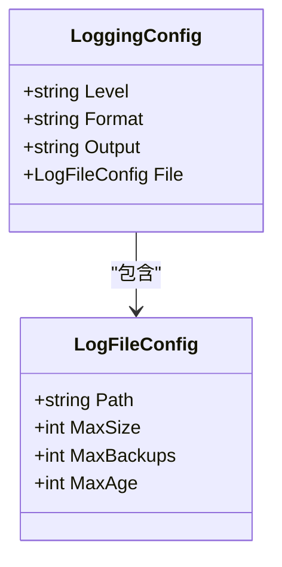
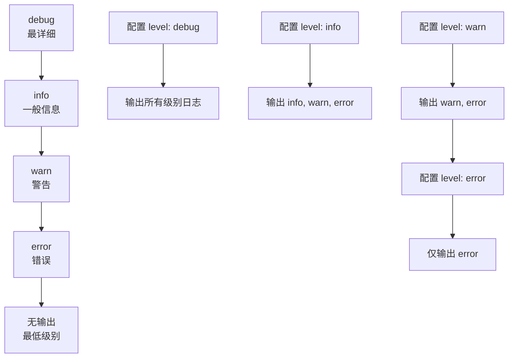
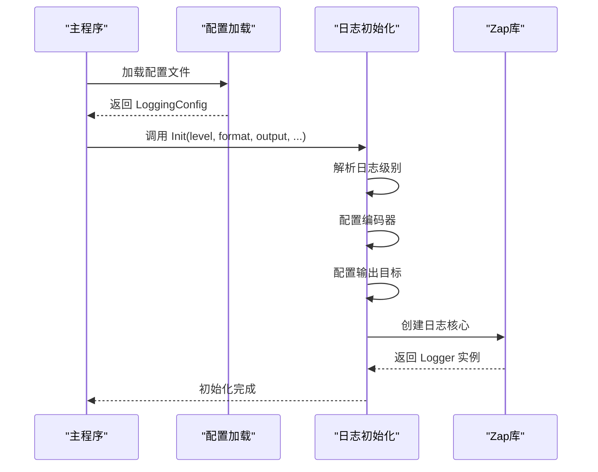
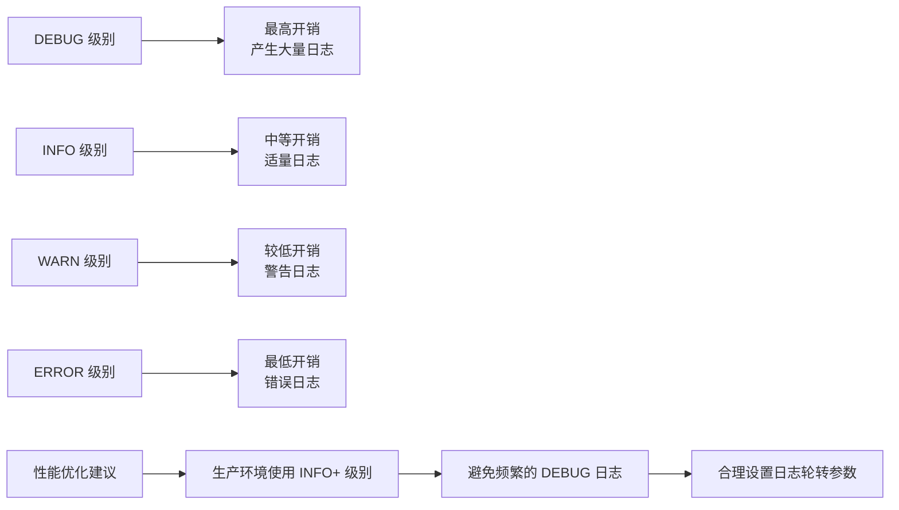

# 日志输出配置

<cite>
**本文档中引用的文件**
- [pkg/logger/logger.go](file://pkg/logger/logger.go)
- [internal/config/config.go](file://internal/config/config.go)
- [cmd/mockserver/main.go](file://cmd/mockserver/main.go)
- [config.yaml](file://config.yaml)
- [config.test.yaml](file://config.test.yaml)
</cite>

## 目录
1. [简介](#简介)
2. [日志配置结构](#日志配置结构)
3. [核心配置参数详解](#核心配置参数详解)
4. [日志级别配置](#日志级别配置)
5. [输出格式配置](#输出格式配置)
6. [输出目标配置](#输出目标配置)
7. [日志配置实现原理](#日志配置实现原理)
8. [环境配置示例](#环境配置示例)
9. [性能影响与优化建议](#性能影响与优化建议)
10. [调试与故障排除](#调试与故障排除)
11. [最佳实践](#最佳实践)

## 简介

本项目采用基于 zap 日志库的日志系统，提供了灵活且高性能的日志配置机制。通过 `LoggingConfig` 结构体，用户可以精确控制日志的输出级别、格式和目标，满足不同环境下的需求。

## 日志配置结构

日志配置通过 `LoggingConfig` 结构体定义，包含以下核心字段：



**图表来源**
- [internal/config/config.go](file://internal/config/config.go#L92-L106)

**章节来源**
- [internal/config/config.go](file://internal/config/config.go#L92-L106)

## 核心配置参数详解

### level 字段
控制日志记录的详细程度，决定哪些级别的日志会被输出。

### format 字段  
指定日志的输出格式，影响日志的可读性和结构化程度。

### output 字段  
定义日志的输出目标，支持标准输出和文件输出两种模式。

### file 字段  
当输出为文件时，提供详细的文件配置选项。

## 日志级别配置

### 可选级别
- **debug**: 最详细的调试信息，包含所有执行细节
- **info**: 一般信息，记录系统正常运行状态
- **warn**: 警告信息，表示潜在问题但不影响系统运行
- **error**: 错误信息，表示发生错误但系统仍可继续运行

### 级别优先级


### 级别选择指南
- **开发环境**: 推荐使用 `debug` 级别以获取完整调试信息
- **测试环境**: 推荐使用 `info` 或 `debug` 级别
- **生产环境**: 推荐使用 `info` 或 `warn` 级别，避免过多日志影响性能

**章节来源**
- [pkg/logger/logger.go](file://pkg/logger/logger.go#L16-L27)

## 输出格式配置

### JSON 格式
- **特点**: 结构化、机器友好、便于日志分析工具处理
- **适用场景**: 生产环境、日志聚合系统、自动化监控
- **示例输出**: `{"level":"INFO","ts":"2024-01-01T12:00:00Z","caller":"service/admin_service.go:122","msg":"starting admin server","address":"0.0.0.0:8080"}`

### Text 格式
- **特点**: 可读性强、人类友好、适合开发调试
- **适用场景**: 开发环境、本地调试、快速问题排查
- **示例输出**: `[INFO] 2024-01-01T12:00:00Z service/admin_service.go:122 starting admin server address=0.0.0.0:8080`

### 格式对比表

| 特性 | JSON 格式 | Text 格式 |
|------|-----------|-----------|
| 结构化程度 | 高 | 低 |
| 可读性 | 中等 | 高 |
| 分析效率 | 高 | 低 |
| 存储空间 | 较大 | 较小 |
| 工具支持 | 优秀 | 一般 |

**章节来源**
- [pkg/logger/logger.go](file://pkg/logger/logger.go#L31-L45)

## 输出目标配置

### stdout 输出
- **特点**: 实时输出、进程绑定、适合容器化部署
- **优势**: 
  - 日志直接流向容器日志系统
  - 无需额外文件管理
  - 支持日志收集工具（如 Fluentd、Fluent Bit）
- **限制**: 进程重启后日志丢失

### file 输出
- **特点**: 持久化存储、支持日志轮转、可长期保存
- **配置参数**:
  - `path`: 日志文件路径
  - `max_size`: 单个文件最大大小（MB）
  - `max_backups`: 保留的旧文件数量
  - `max_age`: 保留天数

### 输出目标选择指南
- **容器化部署**: 优先选择 stdout，配合日志收集系统
- **传统部署**: 可选择 file 输出，便于离线分析
- **混合场景**: 可同时配置多个输出目标

**章节来源**
- [pkg/logger/logger.go](file://pkg/logger/logger.go#L48-L62)

## 日志配置实现原理

### 初始化流程


**图表来源**
- [cmd/mockserver/main.go](file://cmd/mockserver/main.go#L30-L41)
- [pkg/logger/logger.go](file://pkg/logger/logger.go#L14-L71)

### 关键实现细节

#### 级别解析
```go
// 级别映射关系
switch level {
case "debug": zapLevel = zapcore.DebugLevel
case "info":  zapLevel = zapcore.InfoLevel
case "warn":  zapLevel = zapcore.WarnLevel
case "error": zapLevel = zapcore.ErrorLevel
default:      zapLevel = zapcore.InfoLevel
}
```

#### 编码器配置
- **JSON 格式**: 使用 `zap.NewProductionEncoderConfig()` 提供生产环境优化
- **Text 格式**: 使用 `zap.NewDevelopmentEncoderConfig()` 提供开发友好格式

#### 输出目标配置
- **文件输出**: 集成 lumberjack 库实现日志轮转
- **标准输出**: 直接使用 `os.Stdout`

**章节来源**
- [pkg/logger/logger.go](file://pkg/logger/logger.go#L14-L71)

## 环境配置示例

### 开发环境配置
```yaml
logging:
  level: "debug"      # 详细调试信息
  format: "text"      # 可读性强的文本格式
  output: "stdout"    # 标准输出
  file:
    path: "./logs/dev.log"
    max_size: 50      # 50MB
    max_backups: 3    # 保留3个备份
    max_age: 7        # 保留7天
```

### 测试环境配置
```yaml
logging:
  level: "debug"      # 调试级别
  format: "json"      # 结构化格式便于分析
  output: "stdout"    # 标准输出
  file:
    path: "./logs/test.log"
    max_size: 20      # 20MB
    max_backups: 2    # 保留2个备份
    max_age: 3        # 保留3天
```

### 生产环境配置
```yaml
logging:
  level: "info"       # 一般信息级别
  format: "json"      # 结构化格式便于日志分析
  output: "stdout"    # 标准输出，配合日志收集系统
  file:
    path: "/var/log/mockserver/app.log"
    max_size: 100     # 100MB
    max_backups: 10   # 保留10个备份
    max_age: 30       # 保留30天
```

### Docker 容器配置
```yaml
logging:
  level: "info"
  format: "json"
  output: "stdout"    # 容器日志系统收集
```

**章节来源**
- [config.yaml](file://config.yaml#L48-L58)
- [config.test.yaml](file://config.test.yaml#L48-L58)

## 性能影响与优化建议

### 性能考量因素

#### 日志级别对性能的影响


#### 格式对性能的影响
- **JSON 格式**: CPU 开销较高，但便于后续处理
- **Text 格式**: CPU 开销较低，更适合实时查看

#### 输出目标对性能的影响
- **stdout**: 低开销，适合大多数部署场景
- **file**: 中等开销，需要考虑磁盘 I/O 性能

### 优化建议

#### 日志级别优化
1. **开发阶段**: 使用 DEBUG 级别获取完整调试信息
2. **测试阶段**: 使用 INFO 级别平衡信息量和性能
3. **生产阶段**: 使用 WARN 或 ERROR 级别最小化性能影响

#### 日志轮转优化
```yaml
file:
  max_size: 100      # 控制单文件大小
  max_backups: 10    # 保留合理的备份数量
  max_age: 30        # 设置适当的保留期限
```

#### 异步日志优化
虽然当前实现是同步写入，但在高并发场景下建议：
- 使用异步日志队列
- 批量写入减少 I/O 操作
- 配置合适的缓冲区大小

**章节来源**
- [pkg/logger/logger.go](file://pkg/logger/logger.go#L48-L62)

## 调试与故障排除

### 常见问题及解决方案

#### 日志不输出
**可能原因**:
1. 日志级别设置过高（如只设置 ERROR，而实际需要 INFO）
2. 输出目标配置错误
3. 文件权限问题

**排查步骤**:
```bash
# 检查配置文件语法
yamllint config.yaml

# 检查文件权限
ls -la logs/

# 查看进程权限
ps aux | grep mockserver
```

#### 日志格式异常
**可能原因**:
1. 格式配置错误
2. 编码器配置问题

**解决方案**:
- 确认 `format` 字段值为 "json" 或 "text"
- 检查编码器配置是否正确

#### 日志轮转失败
**可能原因**:
1. 磁盘空间不足
2. 文件权限不够
3. 路径配置错误

**解决方案**:
```bash
# 检查磁盘空间
df -h

# 检查目录权限
ls -la logs/

# 检查文件是否存在
ls -la logs/mockserver.log*
```

### 调试技巧

#### 启用详细日志
```yaml
logging:
  level: "debug"
  format: "text"
  output: "stdout"
```

#### 日志验证脚本
```bash
#!/bin/bash
# 验证日志配置
echo "=== 日志配置验证 ==="
./mockserver --config config.yaml > /dev/null 2>&1 &
PID=$!

# 等待服务启动
sleep 2

# 检查进程状态
ps -p $PID && echo "服务正常启动"

# 检查日志输出
tail -n 10 logs/mockserver.log

# 清理进程
kill $PID
```

**章节来源**
- [pkg/logger/logger.go](file://pkg/logger/logger.go#L14-L71)

## 最佳实践

### 配置管理最佳实践

#### 环境隔离
- 不同环境使用独立的配置文件
- 敏感信息通过环境变量注入
- 配置文件纳入版本控制

#### 配置验证
```yaml
# config.yaml
logging:
  level: "${LOG_LEVEL:-info}"  # 使用环境变量，默认值为 info
  format: "${LOG_FORMAT:-json}"
  output: "${LOG_OUTPUT:-stdout}"
```

#### 监控集成
```yaml
logging:
  level: "info"
  format: "json"
  output: "stdout"
  file:
    path: "/var/log/app/app.log"
    max_size: 100
    max_backups: 10
    max_age: 30
```

### 安全考虑

#### 敏感信息保护
- 不要在日志中记录密码、密钥等敏感信息
- 使用日志过滤器移除敏感字段
- 在生产环境中避免使用 DEBUG 级别

#### 访问控制
- 确保日志文件有适当的权限设置
- 避免将日志文件暴露在 Web 服务器目录中
- 定期清理过期的日志文件

### 维护建议

#### 日志轮转策略
- 根据业务量调整轮转参数
- 定期检查磁盘使用情况
- 建立日志备份机制

#### 性能监控
- 监控日志写入性能
- 设置日志大小告警
- 定期评估日志配置的有效性

**章节来源**
- [cmd/mockserver/main.go](file://cmd/mockserver/main.go#L19-L41)
- [internal/config/config.go](file://internal/config/config.go#L138-L172)