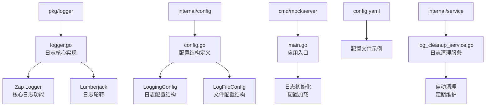
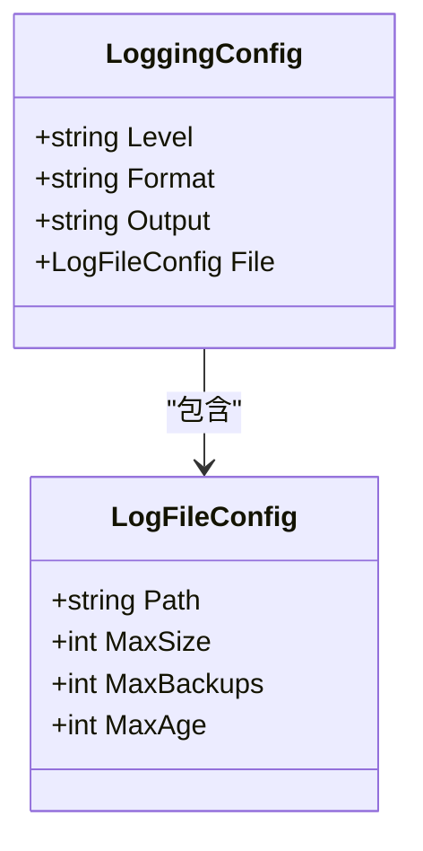
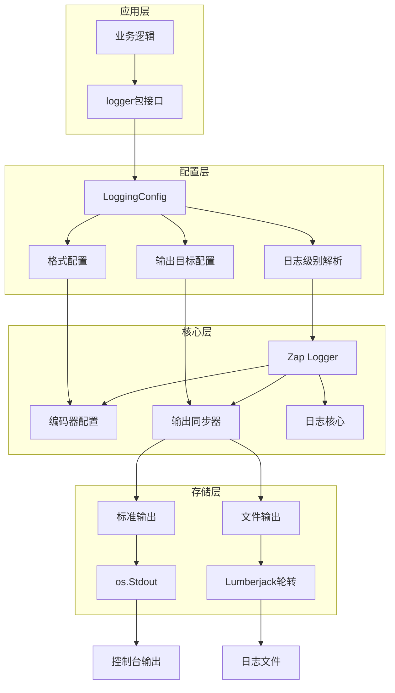
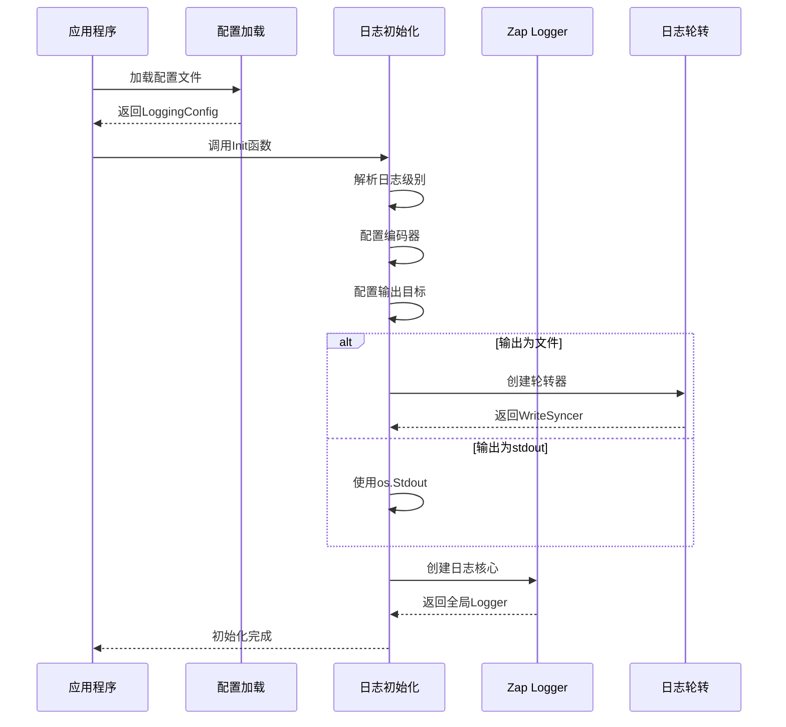
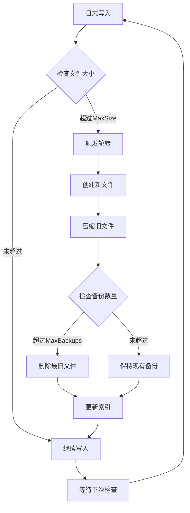
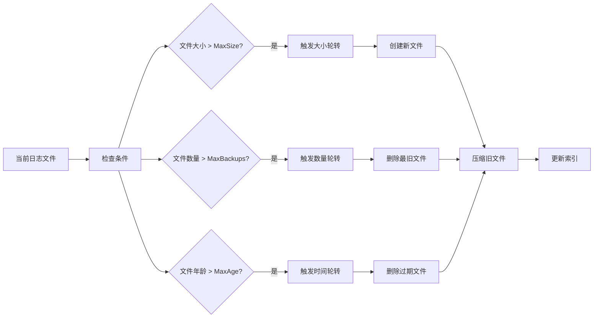

# 日志配置

<cite>
**本文档中引用的文件**
- [pkg/logger/logger.go](file://pkg/logger/logger.go)
- [internal/config/config.go](file://internal/config/config.go)
- [internal/config/config_test.go](file://internal/config/config_test.go)
- [cmd/mockserver/main.go](file://cmd/mockserver/main.go)
- [config.yaml](file://config.yaml)
- [internal/service/log_cleanup_service.go](file://internal/service/log_cleanup_service.go)
- [internal/service/log_cleanup_service_test.go](file://internal/service/log_cleanup_service_test.go)
</cite>

## 目录
1. [简介](#简介)
2. [项目结构](#项目结构)
3. [核心组件](#核心组件)
4. [架构概览](#架构概览)
5. [详细组件分析](#详细组件分析)
6. [配置参数详解](#配置参数详解)
7. [日志轮转机制](#日志轮转机制)
8. [性能考虑](#性能考虑)
9. [最佳实践](#最佳实践)
10. [故障排除指南](#故障排除指南)
11. [总结](#总结)

## 简介

本项目采用基于Zap的日志系统，提供了灵活且高性能的日志配置选项。日志系统支持多种输出目标、格式化方式和级别控制，并集成了强大的日志轮转和清理功能。

## 项目结构

项目的日志相关文件组织如下：



**图表来源**
- [pkg/logger/logger.go](file://pkg/logger/logger.go#L1-L116)
- [internal/config/config.go](file://internal/config/config.go#L92-L106)
- [cmd/mockserver/main.go](file://cmd/mockserver/main.go#L19-L98)

## 核心组件

### LoggingConfig 结构体

LoggingConfig 是日志配置的核心结构，定义了日志系统的整体配置：



**图表来源**
- [internal/config/config.go](file://internal/config/config.go#L92-L106)

### 日志级别系统

系统支持四种日志级别，按严重程度递增：

| 级别 | 描述 | 使用场景 |
|------|------|----------|
| debug | 调试信息 | 开发阶段的详细跟踪信息 |
| info | 一般信息 | 正常运行状态的关键事件 |
| warn | 警告信息 | 潜在问题但不影响正常运行 |
| error | 错误信息 | 发生错误但系统仍可继续运行 |

### 输出格式系统

支持两种输出格式：

| 格式 | 特点 | 适用场景 |
|------|------|----------|
| json | 结构化数据，便于机器解析 | 生产环境，日志分析工具集成 |
| text | 可读性强，适合开发调试 | 开发环境，快速问题排查 |

### 输出目标系统

支持两种输出目标：

| 目标 | 特点 | 使用场景 |
|------|------|----------|
| stdout | 标准输出，适合容器化部署 | Docker容器，Kubernetes集群 |
| file | 文件输出，支持轮转 | 传统服务器部署，长期存储需求 |

**章节来源**
- [pkg/logger/logger.go](file://pkg/logger/logger.go#L14-L71)
- [internal/config/config.go](file://internal/config/config.go#L92-L106)

## 架构概览

日志系统采用分层架构设计，确保高性能和灵活性：



**图表来源**
- [pkg/logger/logger.go](file://pkg/logger/logger.go#L14-L71)
- [cmd/mockserver/main.go](file://cmd/mockserver/main.go#L30-L41)

## 详细组件分析

### 日志初始化流程

日志初始化过程遵循严格的配置验证和资源分配流程：



**图表来源**
- [pkg/logger/logger.go](file://pkg/logger/logger.go#L14-L71)
- [cmd/mockserver/main.go](file://cmd/mockserver/main.go#L30-L41)

### 日志轮转机制

系统使用Lumberjack库实现智能日志轮转：



**图表来源**
- [pkg/logger/logger.go](file://pkg/logger/logger.go#L50-L57)

**章节来源**
- [pkg/logger/logger.go](file://pkg/logger/logger.go#L14-L71)

## 配置参数详解

### 基础配置参数

| 参数名 | 类型 | 必需 | 默认值 | 描述 |
|--------|------|------|--------|------|
| level | string | 是 | info | 日志级别(debug/info/warn/error) |
| format | string | 是 | json | 输出格式(json/text) |
| output | string | 是 | stdout | 输出目标(stdout/file) |

### 文件配置参数

| 参数名 | 类型 | 必需 | 默认值 | 描述 | 单位 |
|--------|------|------|--------|------|------|
| path | string | 是 | ./logs/app.log | 日志文件路径 | - |
| max_size | int | 是 | 100 | 最大文件大小 | MB |
| max_backups | int | 是 | 10 | 保留的备份文件数 | 个 |
| max_age | int | 是 | 30 | 保留天数 | 天 |

### 配置示例

以下是完整的配置示例：

```yaml
logging:
  level: "info"          # 日志级别
  format: "json"         # JSON格式
  output: "file"         # 输出到文件
  file:
    path: "./logs/mockserver.log"  # 日志文件路径
    max_size: 100              # 100MB
    max_backups: 10            # 保留10个备份
    max_age: 30                # 保留30天
```

**章节来源**
- [config.yaml](file://config.yaml#L48-L58)
- [internal/config/config.go](file://internal/config/config.go#L92-L106)

## 日志轮转机制

### 轮转策略

系统采用多维度的轮转策略：

1. **大小轮转**: 当单个日志文件达到指定大小时触发轮转
2. **时间轮转**: 基于文件创建时间进行轮转
3. **数量轮转**: 限制保留的备份文件数量
4. **压缩轮转**: 自动压缩历史日志文件

### 轮转配置详解



**图表来源**
- [pkg/logger/logger.go](file://pkg/logger/logger.go#L50-L57)

### 性能优化

轮转机制采用异步处理和批量操作，最小化对应用性能的影响：

- **异步轮转**: 轮转操作在后台线程执行
- **批量压缩**: 多个文件同时压缩减少I/O开销
- **内存优化**: 控制同时打开的文件句柄数量

**章节来源**
- [pkg/logger/logger.go](file://pkg/logger/logger.go#L50-L57)

## 性能考虑

### 日志性能优化

1. **异步写入**: 使用缓冲区减少磁盘I/O频率
2. **结构化日志**: JSON格式便于后续处理
3. **级别过滤**: 在编码前过滤掉不需要的日志级别
4. **字段复用**: 重用zap.Field对象减少内存分配

### 内存使用

- **缓冲区管理**: 合理配置缓冲区大小
- **垃圾回收**: 及时释放不再使用的日志对象
- **连接池**: 复用日志写入连接

### 并发安全

- **线程安全**: Zap库保证多线程环境下的安全性
- **锁机制**: 关键操作使用细粒度锁
- **无锁设计**: 非关键路径采用无锁算法

## 最佳实践

### 开发环境配置

```yaml
logging:
  level: "debug"
  format: "text"
  output: "stdout"
```

适用于开发阶段，便于快速调试和问题定位。

### 生产环境配置

```yaml
logging:
  level: "info"
  format: "json"
  output: "file"
  file:
    path: "/var/log/mockserver/app.log"
    max_size: 100
    max_backups: 10
    max_age: 30
```

适用于生产环境，平衡性能和存储需求。

### 监控和告警

建议配置以下监控指标：
- 日志文件大小增长趋势
- 日志写入延迟
- 磁盘空间使用率
- 轮转失败次数

### 调试技巧

1. **分级调试**: 根据需要调整日志级别
2. **结构化搜索**: 利用JSON格式进行日志分析
3. **时间戳精度**: 使用ISO8601时间格式便于排序
4. **上下文信息**: 添加必要的字段便于问题追踪

**章节来源**
- [config.yaml](file://config.yaml#L48-L58)
- [pkg/logger/logger.go](file://pkg/logger/logger.go#L14-L71)

## 故障排除指南

### 常见问题及解决方案

#### 1. 日志文件无法创建

**症状**: 应用启动时报错，提示无法创建日志文件

**原因**: 
- 目标目录不存在
- 权限不足
- 路径配置错误

**解决方案**:
- 确保日志目录存在并可写
- 检查文件系统权限
- 验证配置路径正确性

#### 2. 日志轮转失败

**症状**: 日志文件持续增长，未触发轮转

**原因**:
- 磁盘空间不足
- 文件权限问题
- 配置参数冲突

**解决方案**:
- 清理磁盘空间
- 检查文件权限
- 验证配置参数合理性

#### 3. 性能问题

**症状**: 应用响应变慢，怀疑日志系统影响

**诊断步骤**:
1. 检查日志级别设置
2. 监控磁盘I/O使用率
3. 分析日志写入模式
4. 调整缓冲区大小

### 调试工具

1. **日志分析脚本**: 自动解析和统计日志
2. **性能监控**: 实时监控日志系统性能
3. **配置验证**: 验证配置文件语法正确性

**章节来源**
- [pkg/logger/logger.go](file://pkg/logger/logger.go#L14-L71)
- [internal/service/log_cleanup_service.go](file://internal/service/log_cleanup_service.go#L65-L119)

## 总结

本项目的日志系统提供了完整而灵活的配置选项，支持多种输出格式和目标，具备强大的轮转和清理功能。通过合理的配置和使用最佳实践，可以在保证应用性能的同时，获得高质量的日志记录能力。

关键特性包括：
- 基于Zap的高性能日志引擎
- 支持JSON和文本两种输出格式
- 灵活的输出目标配置
- 智能的日志轮转机制
- 自动化的日志清理服务
- 完善的错误处理和恢复机制

建议根据实际应用场景选择合适的配置参数，并建立相应的监控和维护机制，以确保日志系统的稳定运行。