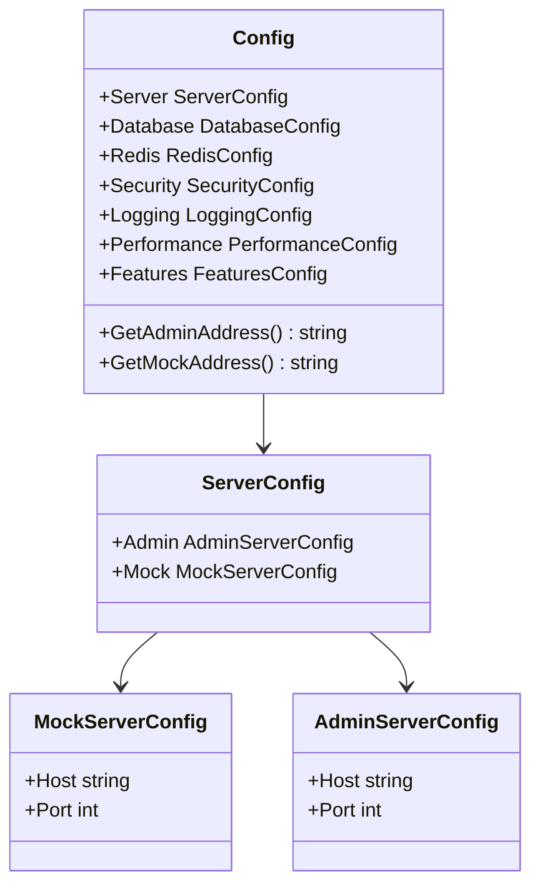
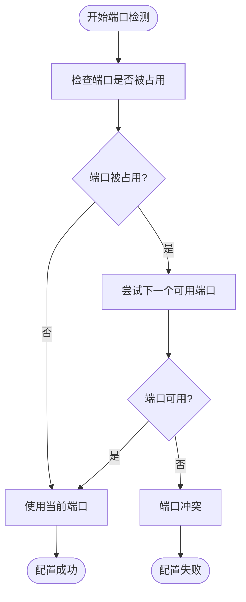
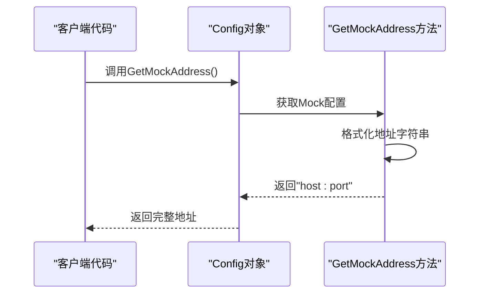
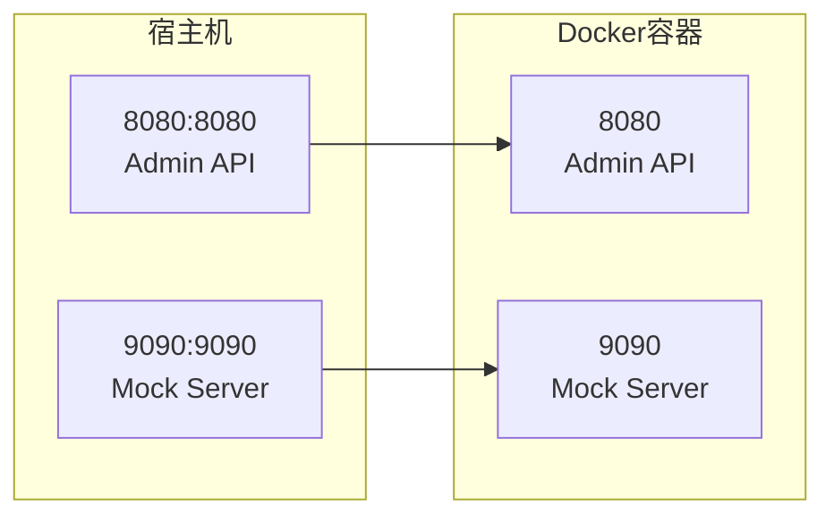
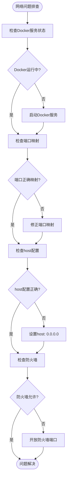

# Mock服务配置

<cite>
**本文档中引用的文件**
- [internal/config/config.go](file://internal/config/config.go)
- [config.yaml](file://config.yaml)
- [config.test.yaml](file://config.test.yaml)
- [cmd/mockserver/main.go](file://cmd/mockserver/main.go)
- [internal/service/mock_service.go](file://internal/service/mock_service.go)
- [internal/service/admin_service.go](file://internal/service/admin_service.go)
- [docker-compose.yml](file://docker-compose.yml)
- [Dockerfile](file://Dockerfile)
</cite>

## 目录
1. [简介](#简介)
2. [MockServerConfig结构体详解](#mockserverconfig结构体详解)
3. [配置文件结构](#配置文件结构)
4. [Host配置详解](#host配置详解)
5. [Port端口配置](#port端口配置)
6. [GetMockAddress方法](#getmockaddress方法)
7. [多环境配置差异](#多环境配置差异)
8. [Docker容器网络配置](#docker容器网络配置)
9. [常见配置问题及解决方案](#常见配置问题及解决方案)
10. [最佳实践建议](#最佳实践建议)

## 简介

Mock服务是GoMockServer的核心组件之一，负责模拟各种API接口的响应。Mock服务的配置主要通过`MockServerConfig`结构体进行管理，该结构体包含了服务监听地址和端口的关键配置信息。正确的配置对于确保Mock服务的正常运行至关重要。

## MockServerConfig结构体详解

`MockServerConfig`是Mock服务配置的核心数据结构，定义了服务的网络监听参数：



**图表来源**
- [internal/config/config.go](file://internal/config/config.go#L21-L37)

**节来源**
- [internal/config/config.go](file://internal/config/config.go#L33-L36)

## 配置文件结构

Mock服务的配置通过YAML文件进行管理，主要配置项位于`server.mock`部分：

| 配置项 | 类型 | 默认值 | 描述 |
|--------|------|--------|------|
| host | string | "0.0.0.0" | 服务监听地址 |
| port | int | 9090 | 服务监听端口 |

### 生产环境配置示例

```yaml
server:
  mock:
    host: "0.0.0.0"  # 监听所有网络接口
    port: 9090       # 默认端口
```

### 测试环境配置示例

```yaml
server:
  mock:
    host: "0.0.0.0"  # 监听所有网络接口
    port: 9090       # 默认端口
```

**节来源**
- [config.yaml](file://config.yaml#L8-L11)
- [config.test.yaml](file://config.test.yaml#L8-L11)

## Host配置详解

`host`字段决定了Mock服务的网络监听范围，不同的配置值会产生不同的访问效果：

### 0.0.0.0 - 全局监听

```yaml
host: "0.0.0.0"
```

**特点：**
- 监听所有网络接口
- 允许来自任何IP地址的连接
- 适用于需要外部访问的场景
- 在Docker容器中推荐使用此配置

**适用场景：**
- 开发环境
- 生产环境部署
- 需要跨网络访问的场景

### 127.0.0.1 - 本地监听

```yaml
host: "127.0.0.1"
```

**特点：**
- 仅监听本地回环接口
- 只能通过localhost访问
- 更高的安全性
- 适用于仅内部访问的场景

**适用场景：**
- 本地开发调试
- 单机部署环境
- 需要限制访问范围的场景

### 特定IP地址监听

```yaml
host: "192.168.1.100"
```

**特点：**
- 仅监听指定的网络接口
- 适用于多网卡环境
- 精确的网络控制

**适用场景：**
- 多网卡服务器
- 特定网络区域访问
- 网络隔离要求严格的环境

## Port端口配置

`port`字段指定了Mock服务监听的TCP端口号。默认端口为9090，但可以根据需要进行调整：

### 默认端口配置

```yaml
port: 9090
```

### 常见端口选择原则

| 场景 | 推荐端口范围 | 原因 |
|------|-------------|------|
| 开发环境 | 9090-9100 | 避免与常用服务冲突 |
| 测试环境 | 9100-9110 | 便于区分不同环境 |
| 生产环境 | 9110+ | 避免与开发测试端口混淆 |
| Docker环境 | 9090-9999 | Docker端口映射友好 |

### 端口冲突检测



**节来源**
- [cmd/mockserver/main.go](file://cmd/mockserver/main.go#L76-L80)

## GetMockAddress方法

`GetMockAddress()`方法用于构建完整的Mock服务访问地址，其工作原理如下：

### 方法实现逻辑



**图表来源**
- [internal/config/config.go](file://internal/config/config.go#L179-L182)

### 地址格式规范

方法使用以下格式构建地址：
- 格式：`"{host}:{port}"`
- 示例：`"0.0.0.0:9090"` 或 `"127.0.0.1:9090"`

### 使用场景

| 场景 | 使用方式 | 示例 |
|------|----------|------|
| 服务启动 | 直接传递给HTTP服务器 | `service.StartMockServer(cfg.GetMockAddress(), mockService)` |
| 客户端调用 | 作为API基础URL | `http://localhost:9090/project/env/resource` |
| 日志记录 | 记录服务监听地址 | `logger.Info("starting mock server", zap.String("address", cfg.GetMockAddress()))` |

**节来源**
- [internal/config/config.go](file://internal/config/config.go#L179-L182)
- [cmd/mockserver/main.go](file://cmd/mockserver/main.go#L77-L80)

## 多环境配置差异

不同环境下的Mock服务配置存在显著差异，以适应各环境的特点和需求：

### 环境对比表

| 配置项 | 开发环境 | 测试环境 | 生产环境 |
|--------|----------|----------|----------|
| host | "0.0.0.0" | "0.0.0.0" | "0.0.0.0" |
| port | 9090 | 9090 | 9090+ |
| 日志级别 | debug | debug | info/error |
| 缓存时间 | 较短 | 较短 | 正常 |
| 限流配置 | 关闭 | 关闭 | 启用 |
| 数据库连接 | 本地 | 测试专用 | 生产数据库 |

### 环境特定配置

#### 开发环境特点
- 详细的调试信息
- 较短的缓存时间
- 关闭限流机制
- 使用本地数据库

#### 测试环境特点  
- 与生产环境相似的配置
- 独立的测试数据库
- 禁用限流以提高测试速度
- 使用独立的日志文件

#### 生产环境特点
- 最小化的日志输出
- 启用性能优化
- 启用安全防护
- 使用高可用数据库

**节来源**
- [config.yaml](file://config.yaml#L1-L91)
- [config.test.yaml](file://config.test.yaml#L1-L80)

## Docker容器网络配置

Docker环境下的Mock服务配置需要特别注意网络映射和容器间通信：

### Docker Compose配置

```yaml
services:
  mockserver:
    build:
      context: .
      dockerfile: docker/Dockerfile
    container_name: mockserver-app
    restart: always
    ports:
      - "8080:8080"  # Admin API
      - "9090:9090"  # Mock Server
    environment:
      - TZ=Asia/Shanghai
    depends_on:
      mongodb:
        condition: service_healthy
      redis:
        condition: service_healthy
```

### 端口映射原理



**图表来源**
- [docker-compose.yml](file://docker-compose.yml#L44-L52)

### 容器网络配置要点

| 配置项 | 说明 | 注意事项 |
|--------|------|----------|
| ports映射 | 宿主机:容器端口 | 确保端口不冲突 |
| host配置 | 容器内部地址 | 通常使用"0.0.0.0" |
| 网络模式 | bridge网络 | 默认网络类型 |
| 环境变量 | 容器间通信 | 使用服务名作为主机名 |

**节来源**
- [docker-compose.yml](file://docker-compose.yml#L44-L52)

## 常见配置问题及解决方案

在配置Mock服务时，经常会遇到一些典型问题，以下是详细的排查和解决方法：

### 端口冲突问题

#### 问题现象
```
listen tcp 0.0.0.0:9090: bind: address already in use
```

#### 排查步骤
1. **检查端口占用**
   ```bash
   netstat -tulpn | grep :9090
   lsof -i :9090
   ```

2. **切换端口**
   ```yaml
   server:
     mock:
       port: 9091  # 使用其他端口
   ```

3. **终止占用进程**
   ```bash
   kill -9 <PID>
   ```

### 防火墙拦截问题

#### 问题现象
外部无法访问Mock服务，但本地访问正常

#### 解决方案
1. **检查防火墙规则**
   ```bash
   sudo ufw status
   sudo iptables -L
   ```

2. **开放端口**
   ```bash
   sudo ufw allow 9090
   sudo iptables -A INPUT -p tcp --dport 9090 -j ACCEPT
   ```

3. **验证网络连通性**
   ```bash
   telnet <服务器IP> 9090
   curl http://<服务器IP>:9090/api/v1/system/health
   ```

### Docker容器网络映射失败

#### 问题现象
容器内服务正常，但外部无法访问

#### 排查流程



#### 解决步骤

1. **验证容器状态**
   ```bash
   docker ps | grep mockserver
   docker logs mockserver-app
   ```

2. **检查网络配置**
   ```bash
   docker network ls
   docker network inspect mockserver-network
   ```

3. **测试容器内部连通性**
   ```bash
   docker exec -it mockserver-app curl http://localhost:9090/api/v1/system/health
   ```

4. **检查宿主机端口**
   ```bash
   ss -tuln | grep 9090
   ```

### 权限问题

#### 问题现象
服务启动失败，提示权限不足

#### 解决方案
1. **检查文件权限**
   ```bash
   chmod 644 config.yaml
   chown root:root config.yaml
   ```

2. **使用sudo启动**
   ```bash
   sudo ./mockserver -config=config.yaml
   ```

3. **检查SELinux配置**
   ```bash
   setenforce 0  # 临时关闭
   # 或者永久配置
   vi /etc/selinux/config
   ```

### 配置文件格式错误

#### 问题现象
服务启动时报配置解析错误

#### 常见错误及修复

| 错误类型 | 错误信息 | 修复方法 |
|----------|----------|----------|
| YAML语法错误 | unexpected token | 检查缩进和冒号 |
| 类型错误 | invalid port | 确保port为数字 |
| 字符串引号 | missing quotes | 对特殊字符加引号 |
| 缩进错误 | unexpected indentation | 统一使用空格或制表符 |

## 最佳实践建议

基于实际部署经验，以下是Mock服务配置的最佳实践建议：

### 配置管理最佳实践

1. **环境分离**
   - 为每个环境维护独立的配置文件
   - 使用环境变量覆盖敏感配置
   - 建立配置变更审批流程

2. **配置验证**
   - 启动前验证配置文件语法
   - 添加配置完整性检查
   - 建立配置回滚机制

3. **安全考虑**
   - 敏感信息使用环境变量
   - 限制服务访问范围
   - 定期更新认证凭据

### 性能优化建议

1. **端口规划**
   - 为不同环境分配专门的端口范围
   - 避免端口冲突和资源浪费
   - 考虑负载均衡需求

2. **网络优化**
   - 使用合适的host配置
   - 优化网络传输协议
   - 启用适当的缓存策略

3. **监控告警**
   - 监控服务可用性
   - 设置端口状态告警
   - 跟踪访问模式变化

### 运维管理建议

1. **文档维护**
   - 保持配置文档同步更新
   - 记录配置变更历史
   - 建立知识共享机制

2. **测试验证**
   - 定期测试配置有效性
   - 建立自动化测试流程
   - 模拟故障恢复场景

3. **备份恢复**
   - 定期备份配置文件
   - 建立快速恢复流程
   - 测试恢复能力

通过遵循这些最佳实践，可以确保Mock服务配置的稳定性、安全性和可维护性，为整个系统的可靠运行提供坚实保障。