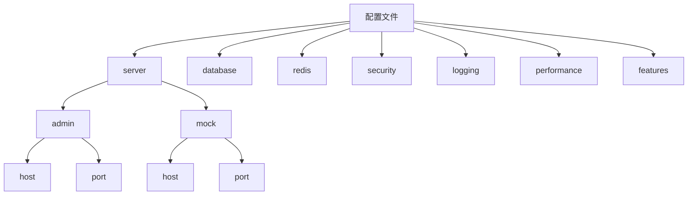
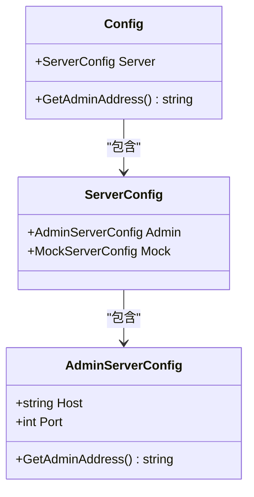
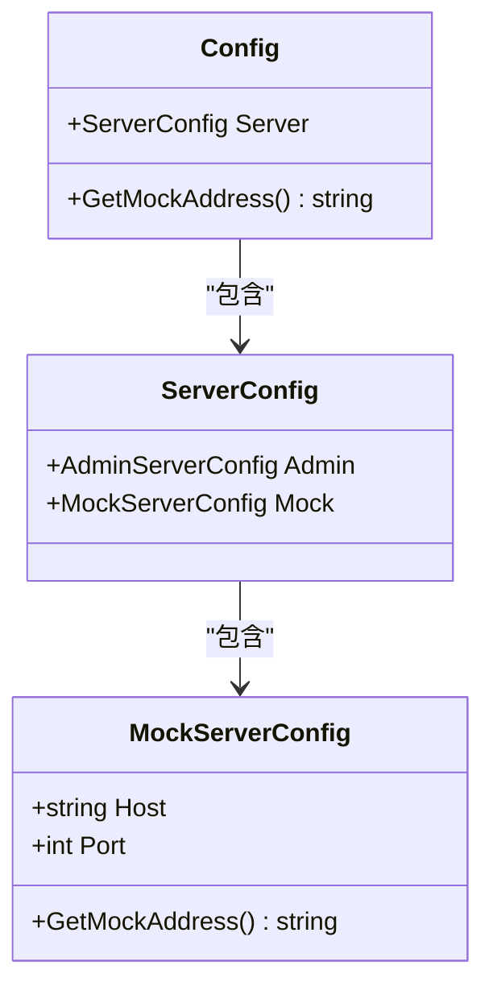
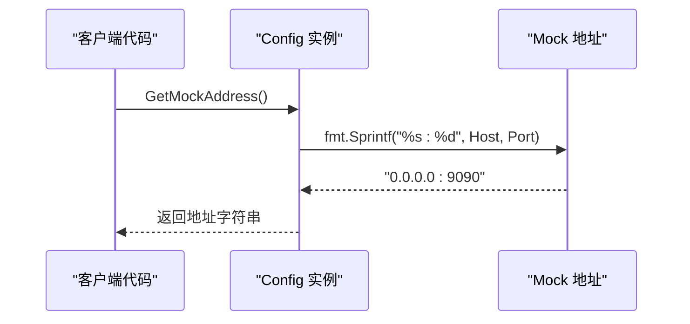
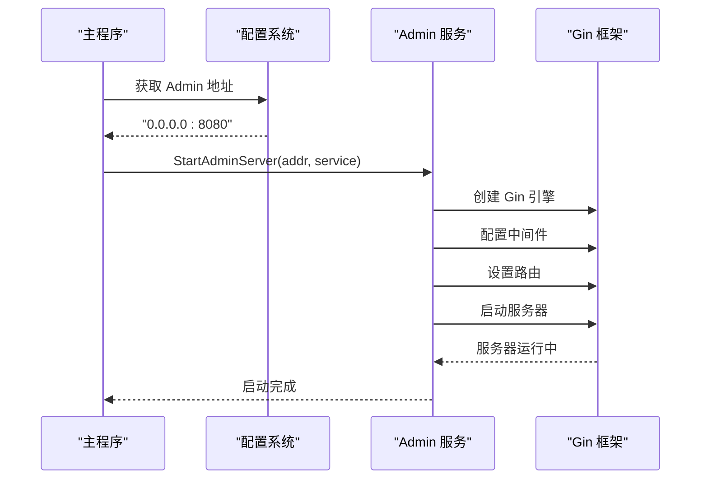
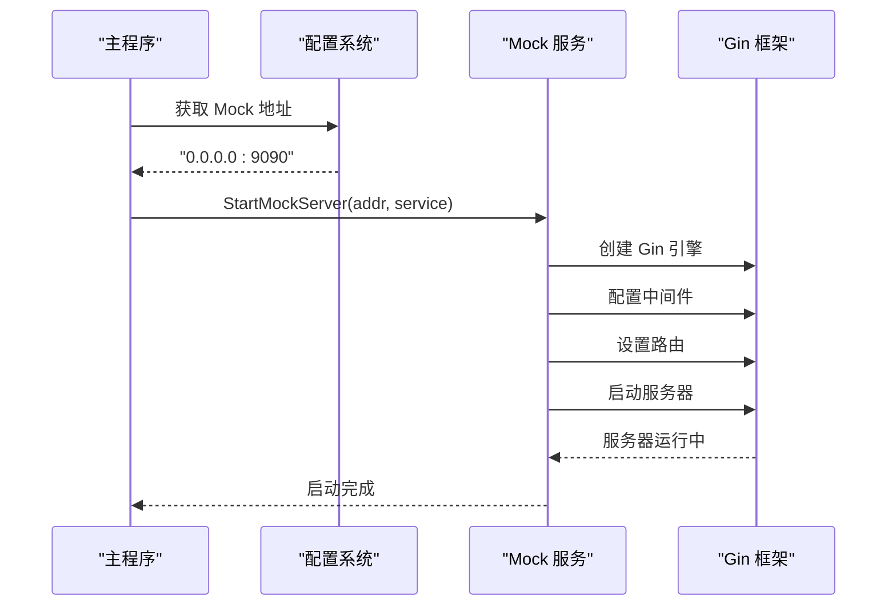

# 服务配置

<cite>
**本文档中引用的文件**
- [config.yaml](file://config.yaml)
- [config.test.yaml](file://config.test.yaml)
- [internal/config/config.go](file://internal/config/config.go)
- [internal/config/config_test.go](file://internal/config/config_test.go)
- [internal/service/admin_service.go](file://internal/service/admin_service.go)
- [internal/service/mock_service.go](file://internal/service/mock_service.go)
- [cmd/mockserver/main.go](file://cmd/mockserver/main.go)
- [internal/middleware/cors.go](file://internal/middleware/cors.go)
- [internal/service/middleware.go](file://internal/service/middleware.go)
</cite>

## 目录
1. [简介](#简介)
2. [配置文件结构](#配置文件结构)
3. [AdminServerConfig 结构详解](#adminserverconfig-结构详解)
4. [MockServerConfig 结构详解](#mockserverconfig-结构详解)
5. [配置文件示例](#配置文件示例)
6. [多环境配置差异](#多环境配置差异)
7. [地址获取方法](#地址获取方法)
8. [服务启动流程](#服务启动流程)
9. [常见配置问题排查](#常见配置问题排查)
10. [最佳实践建议](#最佳实践建议)

## 简介

MockServer 提供了灵活的服务配置机制，通过 YAML 配置文件管理 Admin 管理服务和 Mock 服务的网络绑定设置。本文档详细说明了 server 配置项下的 admin 和 mock 服务配置，包括配置结构、字段作用、使用方法以及常见问题解决方案。

## 配置文件结构

MockServer 的配置采用分层结构，主要包含以下核心配置项：



**图表来源**
- [config.yaml](file://config.yaml#L3-L11)
- [internal/config/config.go](file://internal/config/config.go#L10-L25)

**章节来源**
- [config.yaml](file://config.yaml#L1-L91)
- [internal/config/config.go](file://internal/config/config.go#L10-L25)

## AdminServerConfig 结构详解

### 结构定义

AdminServerConfig 是管理 API 服务的配置结构体，负责管理服务的网络绑定设置。



**图表来源**
- [internal/config/config.go](file://internal/config/config.go#L27-L30)
- [internal/config/config.go](file://internal/config/config.go#L21-L25)
- [internal/config/config.go](file://internal/config/config.go#L10-L18)

### Host 字段

**作用**: 指定管理服务监听的网络地址

- **默认值**: `"0.0.0.0"` - 监听所有网络接口
- **可选值**: 
  - `"0.0.0.0"` - 监听所有可用网络接口（推荐生产环境）
  - `"127.0.0.1"` - 仅监听本地回环接口（推荐开发环境）
  - 具体 IP 地址 - 监听指定网络接口
  - 域名 - 通过 DNS 解析后的 IP 地址

**影响范围**:
- 决定哪些客户端可以访问管理 API
- 影响服务的网络安全性
- 影响容器化部署的网络配置

### Port 字段

**作用**: 指定管理服务监听的端口号

- **默认值**: `8080`
- **有效范围**: `1-65535`
- **注意事项**:
  - 避免使用特权端口（1-1023）
  - 确保端口未被其他进程占用
  - 在容器化环境中需要正确映射端口

**章节来源**
- [internal/config/config.go](file://internal/config/config.go#L27-L30)

## MockServerConfig 结构详解

### 结构定义

MockServerConfig 是 Mock 服务的配置结构体，负责 Mock 服务的网络绑定设置。



**图表来源**
- [internal/config/config.go](file://internal/config/config.go#L33-L36)
- [internal/config/config.go](file://internal/config/config.go#L21-L25)
- [internal/config/config.go](file://internal/config/config.go#L10-L18)

### Host 字段

**作用**: 指定 Mock 服务监听的网络地址

- **默认值**: `"0.0.0.0"` - 监听所有网络接口
- **使用场景**:
  - 开发环境：通常使用 `"0.0.0.0"` 允许外部访问
  - 测试环境：根据测试需求选择合适的监听地址
  - 生产环境：考虑安全性和性能要求

**影响范围**:
- Mock 服务的可访问性
- 前端应用的 API 调用配置
- 容器网络通信

### Port 字段

**作用**: 指定 Mock 服务监听的端口号

- **默认值**: `9090`
- **配置建议**:
  - 与管理服务端口保持分离（避免端口冲突）
  - 在微服务架构中作为独立服务运行
  - 考虑负载均衡和高可用配置

**章节来源**
- [internal/config/config.go](file://internal/config/config.go#L33-L36)

## 配置文件示例

### 基础配置示例

以下是标准的配置文件结构：

```yaml
server:
  # 管理 API 服务配置
  admin:
    host: "0.0.0.0"
    port: 8080
  # Mock 服务配置
  mock:
    host: "0.0.0.0"
    port: 9090
```

### 自定义端口配置

```yaml
server:
  admin:
    host: "127.0.0.1"
    port: 8081
  mock:
    host: "localhost"
    port: 9091
```

### 域名配置示例

```yaml
server:
  admin:
    host: "api.example.com"
    port: 8080
  mock:
    host: "mock.example.com"
    port: 9090
```

**章节来源**
- [config.yaml](file://config.yaml#L3-L11)

## 多环境配置差异

### 开发环境配置

开发环境注重便利性和调试功能：

```yaml
server:
  admin:
    host: "0.0.0.0"
    port: 8080
  mock:
    host: "0.0.0.0"
    port: 9090

# 开发环境特性
features:
  version_control: true
  audit_log: true
  metrics: true

# 日志配置
logging:
  level: "debug"
  format: "json"
  output: "stdout"
```

### 测试环境配置

测试环境强调隔离性和稳定性：

```yaml
server:
  admin:
    host: "0.0.0.0"
    port: 8080
  mock:
    host: "0.0.0.0"
    port: 9090

# 测试环境特性
features:
  version_control: true
  audit_log: true
  metrics: true

# 数据库配置
database:
  mongodb:
    uri: "mongodb://mongodb-test:27017"
    database: "mockserver_test"
    timeout: 10s
    pool:
      min: 5
      max: 50

# Redis 配置
redis:
  enabled: false
  host: "redis-test"
  port: 6379
  password: ""
  db: 0
  pool:
    min: 2
    max: 20

# 日志配置
logging:
  level: "debug"
  format: "json"
  output: "stdout"
  file:
    path: "./logs/mockserver-test.log"
    max_size: 50
    max_backups: 3
    max_age: 7

# 性能配置
performance:
  log_retention_days: 3
  cache:
    rule_ttl: 60
    config_ttl: 300
  rate_limit:
    enabled: false
    ip_limit: 10000
    global_limit: 100000
```

### 生产环境配置

生产环境关注性能、安全性和稳定性：

```yaml
server:
  admin:
    host: "0.0.0.0"
    port: 8080
  mock:
    host: "0.0.0.0"
    port: 9090

# 生产环境特性
features:
  version_control: true
  audit_log: true
  metrics: true

# 数据库配置
database:
  mongodb:
    uri: "mongodb://mongodb-prod:27017"
    database: "mockserver_prod"
    timeout: 10s
    pool:
      min: 10
      max: 100

# Redis 配置
redis:
  enabled: true
  host: "redis-prod"
  port: 6379
  password: "${REDIS_PASSWORD}"
  db: 0
  pool:
    min: 10
    max: 100

# 日志配置
logging:
  level: "info"
  format: "json"
  output: "file"
  file:
    path: "/var/log/mockserver/mockserver.log"
    max_size: 100
    max_backups: 10
    max_age: 30

# 性能配置
performance:
  log_retention_days: 7
  cache:
    rule_ttl: 300
    config_ttl: 1800
  rate_limit:
    enabled: true
    ip_limit: 1000
    global_limit: 10000
```

**章节来源**
- [config.yaml](file://config.yaml#L1-L91)
- [config.test.yaml](file://config.test.yaml#L1-L80)

## 地址获取方法

### GetAdminAddress() 方法

GetAdminAddress() 方法用于获取管理服务的完整地址，格式为 `host:port`。


**图表来源**
- [internal/config/config.go](file://internal/config/config.go#L174-L177)

**实现逻辑**:
1. 从配置对象中获取 Admin 服务的 Host 和 Port
2. 使用 `fmt.Sprintf` 格式化地址字符串
3. 返回格式化的地址（如："0.0.0.0:8080"）

### GetMockAddress() 方法

GetMockAddress() 方法用于获取 Mock 服务的完整地址。



**图表来源**
- [internal/config/config.go](file://internal/config/config.go#L179-L182)

**实现逻辑**:
1. 从配置对象中获取 Mock 服务的 Host 和 Port
2. 使用 `fmt.Sprintf` 格式化地址字符串
3. 返回格式化的地址（如："0.0.0.0:9090"）

### 使用示例

```go
// 获取管理服务地址
adminAddr := config.Get().GetAdminAddress()
// 输出: "0.0.0.0:8080"

// 获取 Mock 服务地址  
mockAddr := config.Get().GetMockAddress()
// 输出: "0.0.0.0:9090"
```

**章节来源**
- [internal/config/config.go](file://internal/config/config.go#L174-L182)

## 服务启动流程

### 主程序启动顺序

MockServer 的主程序按照以下顺序启动各个服务：


**图表来源**
- [cmd/mockserver/main.go](file://cmd/mockserver/main.go#L19-L97)

### Admin 服务启动过程



**图表来源**
- [cmd/mockserver/main.go](file://cmd/mockserver/main.go#L75-L88)
- [internal/service/admin_service.go](file://internal/service/admin_service.go#L40-L123)

### Mock 服务启动过程



**图表来源**
- [cmd/mockserver/main.go](file://cmd/mockserver/main.go#L75-L88)
- [internal/service/mock_service.go](file://internal/service/mock_service.go#L101-L115)

**章节来源**
- [cmd/mockserver/main.go](file://cmd/mockserver/main.go#L19-L97)
- [internal/service/admin_service.go](file://internal/service/admin_service.go#L40-L123)
- [internal/service/mock_service.go](file://internal/service/mock_service.go#L101-L115)

## 常见配置问题排查

### 端口冲突问题

**问题描述**: 服务启动时提示端口已被占用

**排查步骤**:
1. 检查端口是否被其他进程占用
2. 修改配置文件中的端口号
3. 确保防火墙允许新端口访问

**解决方案**:
```bash
# 检查端口占用
netstat -tulpn | grep :8080
lsof -i :8080

# 修改配置文件
server:
  admin:
    port: 8081  # 更改端口号
```

### 地址绑定失败

**问题描述**: 服务无法绑定到指定的主机地址

**常见原因**:
- 指定的 IP 地址不存在于系统网卡上
- 权限不足（尝试绑定特权端口）
- 网络配置问题

**排查方法**:
```bash
# 检查网络接口
ip addr show

# 测试端口连通性
telnet 0.0.0.0 8080
nc -zv 0.0.0.0 8080
```

### CORS 配置问题

**问题描述**: 前端应用无法访问管理 API

**解决方案**:
1. 检查 CORS 配置
2. 确认前端应用的访问源
3. 调整 CORS 配置以允许前端访问

```yaml
# 修改 CORS 配置
security:
  cors:
    allowed_origins:
      - "http://localhost:5173"  # Vue 开发服务器
      - "http://localhost:8080"  # 前端生产环境
      - "https://your-domain.com"  # 生产域名
```

### 配置文件格式错误

**问题描述**: 配置文件解析失败

**常见错误**:
- YAML 格式错误（缩进、冒号使用不当）
- 字段类型不匹配
- 必需字段缺失

**验证方法**:
```bash
# 使用 YAML 验证工具
yamllint config.yaml

# 检查语法
python -c "import yaml; print(yaml.safe_load(open('config.yaml')))"
```

### 内存和资源限制

**问题描述**: 服务启动后频繁崩溃或性能下降

**排查要点**:
1. 检查系统资源使用情况
2. 调整连接池大小
3. 优化内存配置

```yaml
# 调整连接池配置
database:
  mongodb:
    pool:
      min: 20    # 增加最小连接数
      max: 200   # 增加最大连接数
```

**章节来源**
- [internal/config/config_test.go](file://internal/config/config_test.go#L112-L136)
- [internal/service/admin_service_test.go](file://internal/service/admin_service_test.go#L228-L246)

## 最佳实践建议

### 环境隔离配置

1. **开发环境**:
   ```yaml
   server:
     admin:
       host: "0.0.0.0"
       port: 8080
     mock:
       host: "0.0.0.0"
       port: 9090
   
   logging:
     level: "debug"
   
   features:
     audit_log: true
   ```

2. **测试环境**:
   ```yaml
   server:
     admin:
       host: "0.0.0.0"
       port: 8080
     mock:
       host: "0.0.0.0"
       port: 9090
   
   database:
     mongodb:
       database: "mockserver_test"
   
   performance:
     rate_limit:
       enabled: false
   ```

3. **生产环境**:
   ```yaml
   server:
     admin:
       host: "0.0.0.0"
       port: 8080
     mock:
       host: "0.0.0.0"
       port: 9090
   
   logging:
     level: "warn"
     output: "file"
   
   security:
     jwt:
       expiration: 3600  # 1小时
   ```

### 安全配置建议

1. **端口管理**:
   - 使用非特权端口（>1024）
   - 在防火墙中限制访问源
   - 考虑使用反向代理

2. **网络配置**:
   - 生产环境使用特定 IP 地址而非 `0.0.0.0`
   - 配置适当的网络隔离
   - 使用 VPN 或专用网络访问

3. **认证授权**:
   ```yaml
   security:
     jwt:
       secret: "${JWT_SECRET}"  # 使用环境变量
       expiration: 7200
     api_key:
       enabled: true
     ip_whitelist:
       enabled: true
       ips:
         - "192.168.1.0/24"
         - "10.0.0.0/8"
   ```

### 性能优化建议

1. **连接池配置**:
   ```yaml
   database:
     mongodb:
       pool:
         min: 10
         max: 100
   redis:
     pool:
       min: 5
       max: 50
   ```

2. **缓存配置**:
   ```yaml
   performance:
     cache:
       rule_ttl: 300      # 5分钟
       config_ttl: 1800   # 30分钟
   ```

3. **限流配置**:
   ```yaml
   performance:
     rate_limit:
       enabled: true
       ip_limit: 1000
       global_limit: 10000
   ```

### 监控和日志配置

1. **日志级别**:
   - 开发：`debug`
   - 测试：`info`
   - 生产：`warn` 或 `error`

2. **日志轮转**:
   ```yaml
   logging:
     file:
       max_size: 100      # 100MB
       max_backups: 10    # 保留10个备份
       max_age: 30        # 30天
   ```

3. **监控指标**:
   ```yaml
   features:
     metrics: true
     audit_log: true
   ```

这些最佳实践有助于确保 MockServer 在不同环境下稳定、安全、高效地运行。