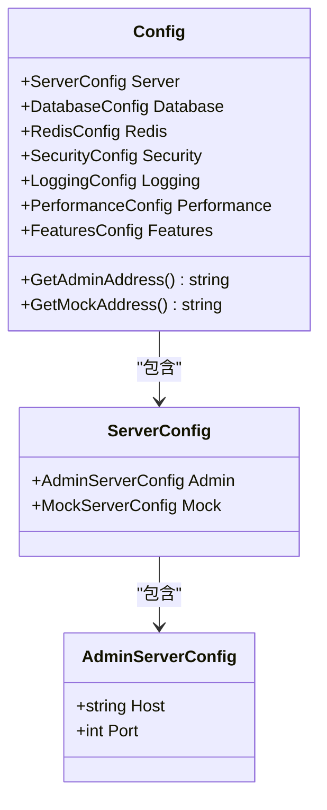
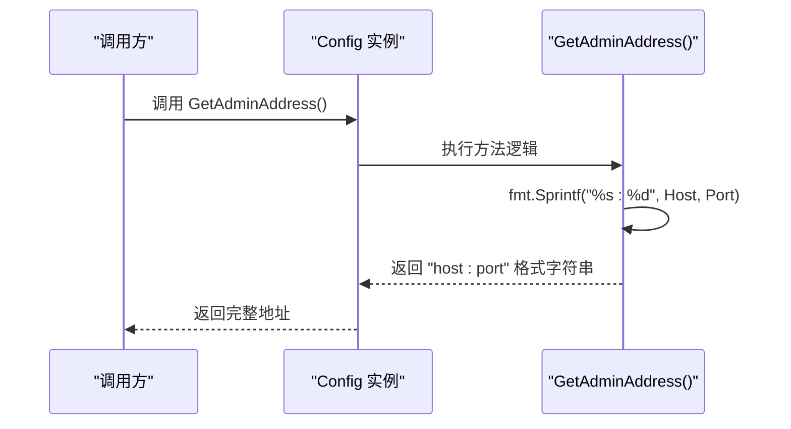
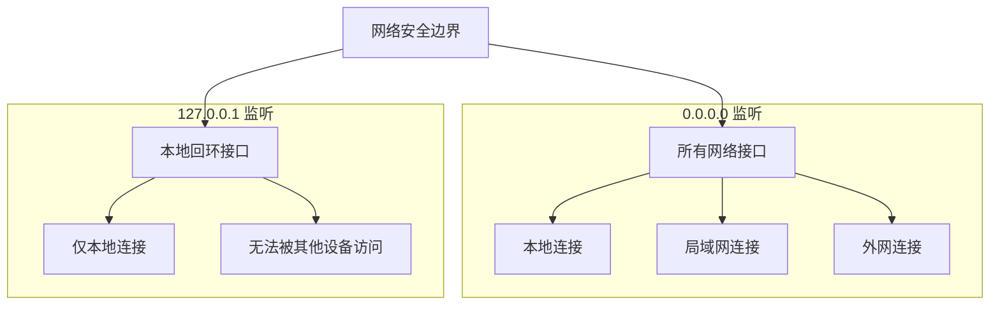
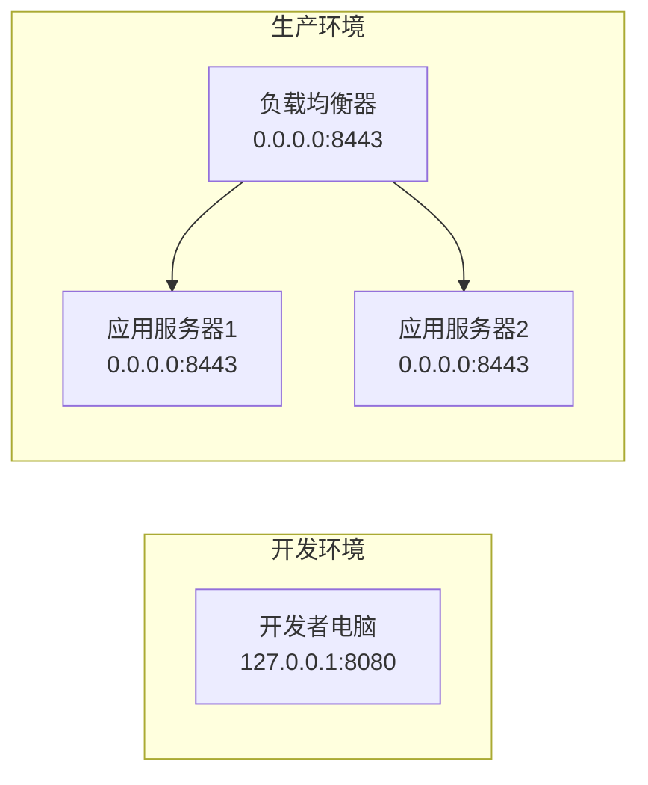
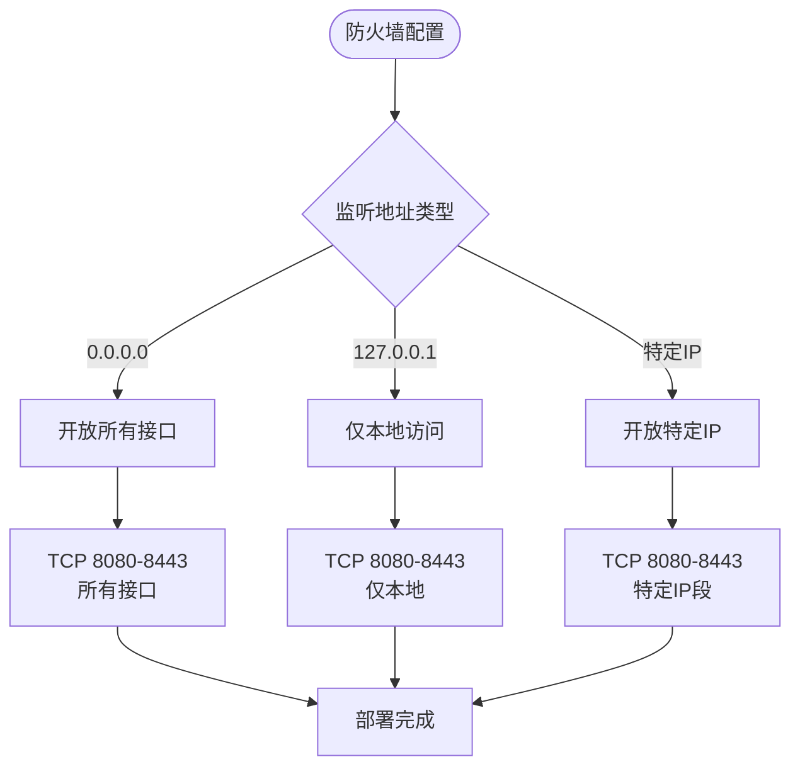
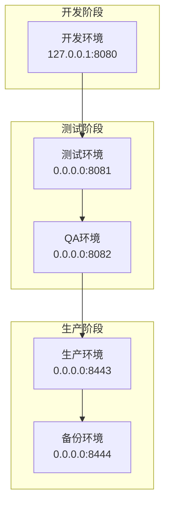

# 管理服务配置

<cite>
**本文档引用的文件**
- [config.go](file://internal/config/config.go)
- [config.yaml](file://config.yaml)
- [admin_service.go](file://internal/service/admin_service.go)
- [main.go](file://cmd/mockserver/main.go)
- [config_test.go](file://internal/config/config_test.go)
- [cors.go](file://internal/middleware/cors.go)
- [cors_test.go](file://internal/middleware/cors_test.go)
</cite>

## 目录
1. [简介](#简介)
2. [AdminServerConfig 结构体概述](#adminserverconfig-结构体概述)
3. [Host 字段配置详解](#host-字段配置详解)
4. [Port 字段配置详解](#port-字段配置详解)
5. [配置文件示例](#配置文件示例)
6. [GetAdminAddress 方法详解](#getadminaddress-方法详解)
7. [多环境配置对比](#多环境配置对比)
8. [网络访问差异分析](#网络访问差异分析)
9. [防火墙和容器网络影响](#防火墙和容器网络影响)
10. [配置错误排查指南](#配置错误排查指南)
11. [最佳实践建议](#最佳实践建议)

## 简介

MockServer 的管理服务配置是系统架构中的关键组件，负责提供 RESTful API 接口供用户管理和配置 Mock 规则。AdminServerConfig 结构体定义了管理服务的网络监听配置，包括主机地址和端口号两个核心字段。正确配置这些参数对于系统的网络访问、安全性以及部署方式具有重要影响。

## AdminServerConfig 结构体概述

AdminServerConfig 是管理服务配置的核心结构体，定义在配置模块中：



**图表来源**
- [config.go](file://internal/config/config.go#L27-L31)

**章节来源**
- [config.go](file://internal/config/config.go#L27-L31)

## Host 字段配置详解

### 基本概念

Host 字段指定管理服务监听的网络接口地址。它可以是以下几种形式：

1. **IPv4 地址**：如 `127.0.0.1`、`192.168.1.100`
2. **IPv6 地址**：如 `[::1]`、`[2001:db8::1]`
3. **域名**：如 `api.example.com`
4. **通配符地址**：如 `0.0.0.0`、`::`

### 常见配置值

| 配置值 | 描述 | 使用场景 |
|--------|------|----------|
| `"0.0.0.0"` | 监听所有网络接口 | 开发环境、Docker 容器、云部署 |
| `"127.0.0.1"` | 仅监听本地回环接口 | 本地开发、测试环境 |
| `"localhost"` | 主机名别名，解析为 127.0.0.1 | 简化配置、跨平台兼容 |
| `"192.168.1.100"` | 特定内网 IP 地址 | 内网部署、特定网络访问 |

### 配置示例

```yaml
server:
  admin:
    host: "0.0.0.0"  # 监听所有接口
    port: 8080
```

**章节来源**
- [config.yaml](file://config.yaml#L5-L7)
- [config.go](file://internal/config/config.go#L29)

## Port 字段配置详解

### 端口范围和分配原则

端口号是一个 16 位整数，范围从 0 到 65535。根据 RFC 标准，端口分为三个类别：

| 端口范围 | 类别 | 使用建议 |
|----------|------|----------|
| 0-1023 | 知名端口 | 系统服务，需要管理员权限 |
| 1024-49151 | 注册端口 | 用户服务，避免冲突 |
| 49152-65535 | 动态端口 | 自动分配，适合临时服务 |

### 常见端口选择

```yaml
server:
  admin:
    host: "0.0.0.0"
    port: 8080  # Web 服务标准端口
```

### 端口冲突检测

系统会在启动时自动检测端口可用性：


**图表来源**
- [admin_service.go](file://internal/service/admin_service.go#L41-L123)

**章节来源**
- [config.go](file://internal/config/config.go#L30)
- [admin_service.go](file://internal/service/admin_service.go#L41-L123)

## 配置文件示例

### 基础配置示例

```yaml
# Mock Server 配置文件
server:
  # 管理 API 服务配置
  admin:
    host: "0.0.0.0"
    port: 8080
  # Mock 服务配置
  mock:
    host: "0.0.0.0"
    port: 9090
```

### 高级配置示例

```yaml
server:
  admin:
    host: "0.0.0.0"
    port: 8443  # HTTPS 标准端口
  mock:
    host: "127.0.0.1"
    port: 9090  # 仅本地访问
```

### 环境隔离配置

```yaml
# 开发环境配置
server:
  admin:
    host: "127.0.0.1"
    port: 8080
  mock:
    host: "127.0.0.1"
    port: 9090

# 生产环境配置  
server:
  admin:
    host: "0.0.0.0"
    port: 8443
  mock:
    host: "0.0.0.0"
    port: 9090
```

**章节来源**
- [config.yaml](file://config.yaml#L3-L11)

## GetAdminAddress 方法详解

### 方法实现原理

GetAdminAddress 方法是 Config 结构体的一个方法，用于组合 Host 和 Port 字段生成完整的服务地址：



**图表来源**
- [config.go](file://internal/config/config.go#L174-L177)

### 方法签名和返回值

```go
func (c *Config) GetAdminAddress() string {
    return fmt.Sprintf("%s:%d", c.Server.Admin.Host, c.Server.Admin.Port)
}
```

### 使用示例

| 输入配置 | 返回地址 | 说明 |
|----------|----------|------|
| Host: "0.0.0.0", Port: 8080 | "0.0.0.0:8080" | 监听所有接口 |
| Host: "127.0.0.1", Port: 3000 | "127.0.0.1:3000" | 仅本地访问 |
| Host: "api.example.com", Port: 443 | "api.example.com:443" | 域名访问 |

**章节来源**
- [config.go](file://internal/config/config.go#L174-L177)
- [config_test.go](file://internal/config/config_test.go#L237-L287)

## 多环境配置对比

### 开发环境 vs 生产环境

| 配置维度 | 开发环境 | 生产环境 | 测试环境 |
|----------|----------|----------|----------|
| Host | "127.0.0.1" | "0.0.0.0" | "127.0.0.1" |
| Port | 8080 | 8443 | 8081 |
| 安全级别 | 低 | 高 | 中等 |
| 访问控制 | 无限制 | IP 白名单 | 有限制 |

### 环境配置模板

```yaml
# 开发环境 (dev.yaml)
server:
  admin:
    host: "127.0.0.1"
    port: 8080
  mock:
    host: "127.0.0.1"
    port: 9090

# 生产环境 (prod.yaml)  
server:
  admin:
    host: "0.0.0.0"
    port: 8443
  mock:
    host: "0.0.0.0"
    port: 9090
```

### 环境变量覆盖

系统支持通过环境变量覆盖配置文件：

```bash
export MOCKSERVER_ADMIN_HOST=0.0.0.0
export MOCKSERVER_ADMIN_PORT=8443
```

**章节来源**
- [config.go](file://internal/config/config.go#L151-L152)
- [main.go](file://cmd/mockserver/main.go#L21)

## 网络访问差异分析

### 0.0.0.0 与 127.0.0.1 的区别



### 访问能力对比表

| 监听地址 | 本地访问 | 局域网访问 | 外网访问 | 安全级别 |
|----------|----------|------------|----------|----------|
| 0.0.0.0 | ✅ | ✅ | ✅ | 较低 |
| 127.0.0.1 | ✅ | ❌ | ❌ | 较高 |
| 192.168.1.100 | ❌ | ✅ | ❌ | 中等 |

### 网络拓扑示例



**图表来源**
- [admin_service.go](file://internal/service/admin_service.go#L41-L123)

**章节来源**
- [admin_service.go](file://internal/service/admin_service.go#L41-L123)

## 防火墙和容器网络影响

### 防火墙配置要求

不同监听地址对防火墙配置有不同的要求：



### 容器网络配置

#### Docker Compose 示例

```yaml
version: '3.8'
services:
  mockserver:
    image: gomockserver:latest
    ports:
      - "8080:8080"      # 开发环境
      - "8443:8443"      # 生产环境
    networks:
      - app-network
      
networks:
  app-network:
    driver: bridge
```

#### Kubernetes 配置

```yaml
apiVersion: v1
kind: Service
metadata:
  name: mockserver-admin
spec:
  selector:
    app: mockserver
  ports:
  - port: 8443
    targetPort: 8443
    protocol: TCP
  type: ClusterIP
```

### 网络隔离考虑

| 部署场景 | 推荐配置 | 网络隔离级别 |
|----------|----------|--------------|
| 单机开发 | host: "127.0.0.1" | 无隔离 |
| 容器化部署 | host: "0.0.0.0" | 容器网络隔离 |
| 云原生部署 | host: "0.0.0.0" | VPC 网络隔离 |
| 企业内网 | host: "192.168.x.x" | 内网隔离 |

**章节来源**
- [admin_service.go](file://internal/service/admin_service.go#L41-L123)

## 配置错误排查指南

### 常见错误类型和解决方案

#### 1. 端口被占用错误

**错误现象：**
```
listen tcp 0.0.0.0:8080: bind: address already in use
```

**排查步骤：**


**解决方案：**
```bash
# 查找占用端口的进程
lsof -i :8080
netstat -tulpn | grep :8080

# 终止进程
kill -9 <PID>

# 或者更换端口
sed -i 's/port: 8080/port: 8081/' config.yaml
```

#### 2. 地址绑定失败

**错误现象：**
```
listen tcp 192.168.1.100:8080: bind: cannot assign requested address
```

**排查要点：**
- 检查网络接口是否存在
- 验证 IP 地址是否正确
- 确认网络配置状态

#### 3. 跨域访问限制

**错误现象：**
```
Access to XMLHttpRequest at 'http://localhost:8080/api/v1/projects' 
from origin 'http://localhost:5173' has been blocked by CORS policy
```

**解决方案：**


**图表来源**
- [cors.go](file://internal/middleware/cors.go#L43-L88)

**CORS 配置调整：**
```go
// 修改 CORS 配置
func DefaultCORSConfig() CORSConfig {
    return CORSConfig{
        AllowOrigins: []string{
            "http://localhost:5173",    // 前端开发
            "http://localhost:8080",    // 前端生产
            "http://your-domain.com",   // 生产域名
        },
        // ... 其他配置
    }
}
```

#### 4. 权限不足错误

**错误现象：**
```
listen tcp :80: bind: permission denied
```

**解决方案：**
```bash
# 使用非特权端口（1024以上）
sudo setcap 'cap_net_bind_service=+ep' /path/to/mockserver

# 或者使用 systemd 配置
[Unit]
Description=MockServer
After=network.target

[Service]
ExecStart=/usr/local/bin/mockserver --config=/etc/mockserver/config.yaml
User=mockserver
Group=mockserver
CapabilityBoundingSet=CAP_NET_BIND_SERVICE
AmbientCapabilities=CAP_NET_BIND_SERVICE

[Install]
WantedBy=multi-user.target
```

### 调试工具和技巧

#### 网络连通性测试

```bash
# 测试端口连通性
telnet localhost 8080
nc -zv localhost 8080

# 测试 HTTP 服务
curl -I http://localhost:8080/api/v1/system/health

# 测试 CORS 配置
curl -I -H "Origin: http://localhost:5173" \
     http://localhost:8080/api/v1/projects
```

#### 日志分析

```bash
# 查看启动日志
journalctl -u mockserver -f

# 分析错误日志
grep "ERROR" /var/log/mockserver/app.log | tail -20
```

**章节来源**
- [admin_service.go](file://internal/service/admin_service.go#L41-L123)
- [cors.go](file://internal/middleware/cors.go#L43-L88)

## 最佳实践建议

### 安全配置原则

1. **最小权限原则**
   ```yaml
   server:
     admin:
       host: "127.0.0.1"  # 仅本地访问
       port: 8080
   ```

2. **生产环境加固**
   ```yaml
   server:
     admin:
       host: "0.0.0.0"
       port: 8443  # HTTPS 端口
   ```

3. **网络隔离**
   ```yaml
   server:
     admin:
       host: "192.168.1.100"  # 内网专用 IP
       port: 8080
   ```

### 性能优化建议

1. **端口选择策略**
   - 开发环境：8080-8090
   - 测试环境：8090-8100  
   - 生产环境：8443-8453

2. **资源限制配置**
   ```yaml
   performance:
     rate_limit:
       enabled: true
       ip_limit: 1000
       global_limit: 10000
   ```

### 监控和维护

1. **健康检查配置**
   ```yaml
   server:
     admin:
       host: "0.0.0.0"
       port: 8080
   ```

2. **日志配置**
   ```yaml
   logging:
     level: "info"
     format: "json"
     output: "file"
     file:
       path: "/var/log/mockserver/admin.log"
       max_size: 100
       max_backups: 10
       max_age: 30
   ```

### 部署最佳实践



### 配置管理建议

1. **版本控制**
   - 将配置文件纳入版本控制系统
   - 使用环境变量覆盖敏感配置

2. **配置验证**
   ```bash
   # 启动前验证配置
   ./mockserver --config=config.yaml --dry-run
   ```

3. **滚动更新**
   - 使用配置热重载功能
   - 实施蓝绿部署策略

**章节来源**
- [config.go](file://internal/config/config.go#L137-L182)
- [main.go](file://cmd/mockserver/main.go#L25-L97)